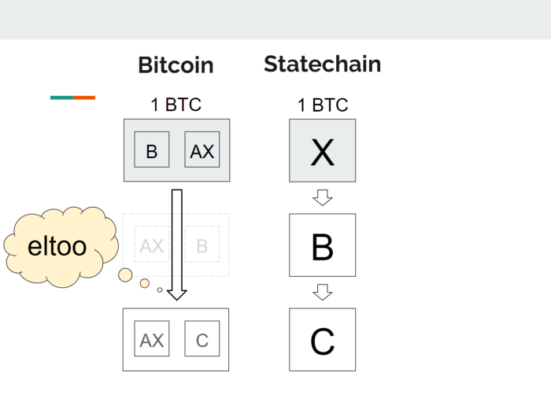
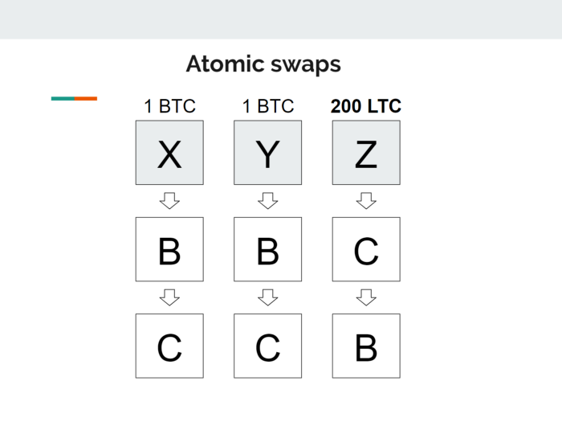
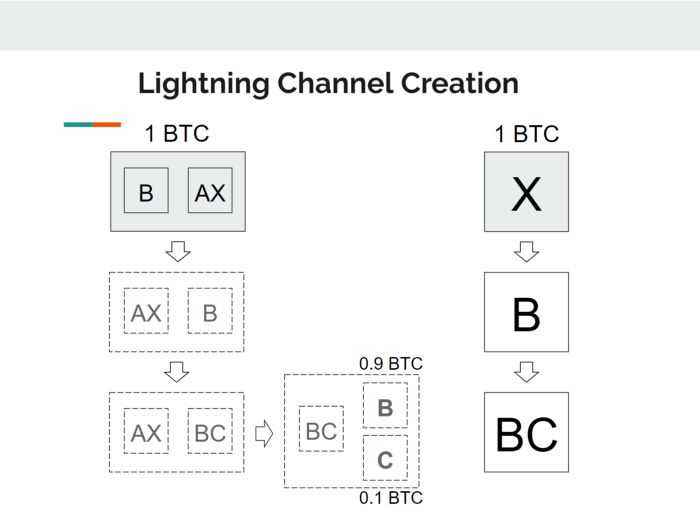
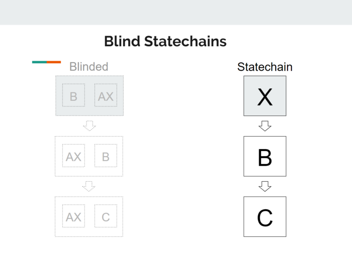

> *作者：Ruben Somsen*
> 
> *来源：<https://medium.com/@RubenSomsen/statechains-non-custodial-off-chain-bitcoin-transfer-1ae4845a4a39>*

**本文介绍了一种新的比特币 Layer 2 扩展协议，叫做 “statechain”。我们会历数其强项和弱点，探究它如何与闪电网络结合，并讨论它与盲签名结合对隐私性的影响。**

我第一次公开 Statechain 的概念是在 [Scaling Bitcoin in Tokyo 会议](http://youtu.be/FI9cwksTrQs?t=47m36s)上。因为这是一个技术会议，我准备了一个不适合普通听众的演讲。结果，它就没有引起什么注意。这是一个遗憾，因为 Statechain 是一种独特的二层协议，它的特性可以增强比特币的生态。希望这篇文章能让你相信它的有点。需要指出的是，这篇文章是概述性的，不会披露所有的技术细节。如果你想了解更多，请参看[这个演讲](http://youtu.be/FI9cwksTrQs?t=47m36s)、[这篇论文](https://github.com/RubenSomsen/rubensomsen.github.io/blob/master/img/statechains.pdf)以及[这个邮件组的讨论](https://lists.linuxfoundation.org/pipermail/bitcoin-dev/2019-June/017005.html)。

Statechain 是一种二层协议，意味着它可以在不用到比特币区块链的前提下转移价值。它可以帮助提高比特币的吞吐量并节约手续费。不像闪电网络，Statechain 无法做到免信任，但它维持了高水平的抗审查性（比联盟侧链要强很多），因为它能免信任地在链上发起取款。

Statechain 的基本思路是：用户把资金锁入与 **Statechain 主体**结成的 2-2 多签名合约中。当用户转移锁在合约中的资金（整个 UTXO）时，他们只需把私钥发送给意向接收方即可（这把私钥我们称为 “**临时私钥**”）。

基本理念就是如此，复杂性来源于希望降低欺诈的可能。但核心概念就这么简单，后面你会看到，它厉害得很。

- 非托管，因为 Statechain 和比特币区块链是串联更新的（原子化的） -

实质上，资金是控制在 Statechain 主体和 *所有* 知道临时私钥的用户手里。Statechain 主体理论上可以跟 *任何一个* 用户一道取出资金，但他们可以承诺只跟 *最后一个* 收到临时私钥的用户配合取款。Statechain *做不到* 只凭自己就把钱拿走。

我们再来看看其弱点。如果 Statechain 主体下线了，或者弄丢了私钥，甚至是拒绝配合，那怎么办？钱就直接没了吗？不是的。资金每次易手，都要生成一笔链下的交易。这使得临时私钥的最后一个接收者可以无需 Statechain 主体的协助，直接在链上赎回资金。所以 Statechain 是无法扣押你的钱的。

- 每次资金在 Statechain 上转移（例如 B 转给 C），都要创建一笔链下的比特币交易。我们使用 <a href="https://blockstream.com/eltoo.pdf">eltoo 技术</a>来保证，只有最后一个接收者可以无需 Statechain 主体的协助就取款。 -

那 Statechain 可以跟临时私钥的某一个前任知情者勾结，欺骗临时私钥的最后一个接收者吗？可以，但这种欺诈发生的概率是可以靠下列方法来降低的：

- 我们可以通过保证 Statechain 主体公开了 TA 签过的所有签名来确保 TA 遵守了协议（一种办法是使用 “适配器签名（[Adaptor Signatures](http://diyhpl.us/wiki/transcripts/layer2-summit/2018/scriptless-scripts/)）”）。任何 Statechain 主体发起的欺诈都会立即曝光。
- Statechain 主体并非只能有一个，可以是一个联盟 —— 只有一群人中的多数都同意，才能执行欺诈（比如通过 8-12 的多签名合约）。这个安全模型与[联盟侧链](https://blockstream.com/sidechains.pdf)（比如 [Liquid](https://www.blockstream.com/liquid/)）相似，但额外的好处是用户取款是 *无需许可的*。
- 每个 UTXO 的临时私钥和前任知情者组合都不同。若想偷走所有资金， Statechain 主体（或者黑客）必须为每个 UTXO 找到一个愿意跟他们勾结的前任知情者。所以全部资金被盗是不太可能的，只有一部分资金可能被盗。

那么 Statechain 是托管型的方案吗？*并不是*。非托管是 Statechain 的关键特性之一。即使一个法院下令某个 Statechain 实体去剥夺某个人的币，这个实体也做不到，因为他们只有两个密钥之一。而且他们也无法冻结用户的资产，因为所有者总是可以自己在链上拿回资金，无需 Statechain 主体的协助。也没有部分储备金（无法兑付）、强制硬分叉等等其它托管型方案常见的风险。

Statechain 的一个独特的属性是，它是完全在 UTXO 层面实现的。所以有一些有趣的结果：

- UTXO 是整个被转移的：如果你在 Statechain 中锁住了 1btc，转账时你就得一次性全部转出，但较大面额的 UTXO 总是可以换成更小面额的（比如用 1 btc 换成两个 0.5 btc 的 UTXO）
- 你可以跟其他用户多次交换等值的 UTXO，这就跟 [coinjoin](https://en.bitcoin.it/wiki/CoinJoin) 交易的效果是一样的，可以增强隐私性，尤其是通过洋葱网络来交换的时候
- 闪电网络可以在 Statechain UTXO 的基础上开启，以支持更小额度的支付（详见下文）
- 需要 UTXO 所有权的 打赌/oracle 协议可以高效执行（例如 2-3 多签名合约， [谨慎日志合约（DLC）](https://adiabat.github.io/dlc.pdf)）
- 比特币区块链上的非同质染色币可以通过 Statechain 实现链下转移（例如 [RGB](https://github.com/rgb-org/spec)）
- 用户的支付验证可扩展性比侧链强，因为币的转账历史是线性的，所以你只需要验证你感兴趣的那些币的历史就行

这里的洞见是，任何需要创建一个或多个新的比特币 UTXO 的事，都可以在链下通过 Statechain 来实现。同样值得指出的是，Statechain 是对链无感的，所以同一个 Statechain 的主体可以管理来自不同区块链的 UTXO 并允许用户相互交换（与去中心化交易所极其近似）。

- 不同资产互换的一个例子。用户 B 使用 2 btc 交换用户 C 的 200 ltc -

如我[最近在 Twitter 上说的](https://twitter.com/SomsenRuben/status/1115920063037497344)，除了通过二层协议来扩展，比特币没有别的选择。因此，像 Statechain 这样的技术的开发，是绝对必要的。我们需要许多权衡各不相同的方案，让用户自己选择最适合自己的一种。

下面就是 Statechin 与其他方案的对比（显然是过度简化的）：

| Layer      | 免信任性 | 抗审查性 | 缺点                |
| ---------- | -------- | -------- | ------------------- |
| 比特币     | 有       | 有       | 贵                  |
| 闪电网络   | 有       | 有       | 通道/路由 容量有限  |
| Statechain | 无       | 有*      | 无法简易地分割 UTXO |
| 侧链       | 无       | 无       | 取款需要许可        |
| 托管方案   | 无       | 无       | 单点故障            |

注 * ：有争议。有人会说，如果一个方案做不到免信任，就无法实现真正的抗审查性，因为资金仍有可能被偷，即使概率很小。

简而言之，Statechain 的创新之处在于，它让你可以在链下变更 UTXO 的所有权，同时保持高度的抗审查性，因为你可以在链上取款。它是非托管的，所以它自然降低了风险并使得 Statechain 主体更容易符合监管。最终来看，它是一种独特的二层协议，有自己的缺点，也有自己独特的优点。

## Statechain 与闪电网络

一个我已经提过、但值得更多研究的强大特性，是 Statechain 与闪电网络的互操作性。为了在闪电网络上开启一个通道，你需要在比特币区块链上获得一个 UTXO 并与某个人通过多签名合约来分享其所有权。Statechain 就提供了这种功能：任何存在于 Statechain 的 UTXO 都可以在任何时候转成一个闪电通道。

巧妙之处在于，所有的复杂性都可以在 Statechain 主体处隐藏起来。主体能看到的仅仅是整个 UTXO 都被转走了，但他们完全无法意识到接收方其实是个 2-2 的多签名闪电通道。

- 通道可以在 Statechain 上开启，无需 Statechain 主体的协助和知觉 -

通过利用状态通道，你可以在链下以最小的成本开启和关闭通道。觉得自己的通道容量太小了？没问题，你可以简单将现有的通道转移到一个更大的 UTXO 中。这个功能非常有用，因为你很难提前知道自己在一个通道中到底需要多大的容量。现在你可以便宜地实验起来，一旦你有了一个稳定的通道，你可以不费吹灰之力，将自己的通道从 Statechain 上移到比特币主链上。

另一个真正惊人的结果是，Statechain 让你可以随时拉人进入闪电网络。如果你在 Statechain 中存有资金，你可以立即将 Statechain 转为一个共享的闪电通道、给朋友发送一部分资金。如果你的朋友喜欢尽可能降低对 Statechain 主体的风险敞口，你可以把通道转移到链上。

一个更有趣的特性是 [Anthony Towns](https://twitter.com/ajtowns) 和 [Olaoluwa Osuntokun](https://twitter.com/roasbeef) 提醒我的：当你通过一个 Statechain 来开启一个闪电通道工厂时，在工厂中加入或移除成员都无需经过链上的交易，所以工厂变得更加灵活。

## 使用盲签名来加强隐私性

根据到目前的讲解，Statechain 虽然限制了 Statechain 实体对用户的控制，但仍然让实体可以知晓每一笔交易的大部分细节，而且大部分这些信息都是透明的公开给世界的。参与 Statechain 等同于 coinjoin 大大缓解了这个问题，但我们其实可以做得更好！

[盲签名（Blind signatures）](http://diyhpl.us/wiki/transcripts/building-on-bitcoin/2018/blind-signatures-and-scriptless-scripts/)让 Statechain 实体完全不知道自己在签名什么东西。这些交易将是完全不可见的 —— 也即表面上看，你完全不知道这个实体是不是真的在协助金额的转移，还是在签名别的事。本质上，这是不改变私钥本身，但以签名者无知无觉的方式改变了这个私钥的签名权；毫无疑问，这在密码货币之外也有用途。

- Statechain 实体正在盲签消息 —— TA 不知道自己签名的到底是比特币交易还是别的什么东西 -

这不止提高了系统的隐私性，也实质上挑战了 “支付处理” 的法律定义。Statechain 实体要做的事情就是根据用户的请求盲签消息。用户请求一个签名的同时指定一个新用户请求下一个签名。所有的请求和对应的盲签名都是透明公开的。

熟悉盲签名的读者会意识到，盲签名实体和普通 Statechain 实体的关键区别在于，用户需要在接受一笔支付前复明（unblind）并验证整个签名的链条，因为 Statechain 主体已不再能保证哪些签名是有意义的。如果历史上某个所请求的签名是不正确的，接收者应当拒绝这次支付。任何控制临时私钥的人都可以做复明这件事（感谢 [Jonas Nick](https://twitter.com/n1ckler) 检查我用于复明的临时密钥哈希方法）。

在这个意义上，盲签名 Statechain 是 [Chaumian cash](https://bitcoin.stackexchange.com/questions/9544/how-does-chaum-style-e-cash-work-all-the-wiki-links-are-broken) 的一个变种，但它成功地超越了这个阶段。Chaumian cash 下，服务器无从知道谁在接收资金，但如果服务器拒绝服务，资金也就等于丢失了。但盲签名 Statechain 则不然，服务器不仅不知道谁在转移资金，也不知道谁在接收资金（尤其跟 coinjoin 结合起来的话），并且，TA 还不能阻止你在比特币区块链上取回你的资金。

最后，值得一提，Statechain 协议是许多开发者开发的不同技术的集大成者。作为 Statechain 的作者，我的贡献仅限于创造性将它们组合在一起，实现转移 UTXO 所有权（更准确说是密钥签名权）的大胆目标。荣誉也应当归于 [侧链](https://blockstream.com/sidechains.pdf)、[Schnorr 签名](https://github.com/sipa/bips/blob/bip-schnorr/bip-schnorr.mediawiki)、[适配器签名](http://diyhpl.us/wiki/transcripts/layer2-summit/2018/scriptless-scripts/)、[盲签名](http://diyhpl.us/wiki/transcripts/building-on-bitcoin/2018/blind-signatures-and-scriptless-scripts/)、[eltoo](https://blockstream.com/eltoo.pdf)、[Graftroot](https://lists.linuxfoundation.org/pipermail/bitcoin-dev/2018-February/015700.html) 的创建者，以及（毫无疑问）许多给了我启发，但我无法回忆起其姓名的作者。

*感谢 [Adam Gibson](https://x0f.org/@waxwing)、[Bryan Bishop](https://twitter.com/kanzure)、[Calvin Kim](https://twitter.com/kcalvinalvinn) 对本文的审核与评论。*

附：我在 Scaling Bitcoin 东京大会上的[深入演讲视频](https://youtu.be/FI9cwksTrQs)，以及[我的论文](https://github.com/RubenSomsen/rubensomsen.github.io/blob/master/img/statechains.pdf)。

（完）