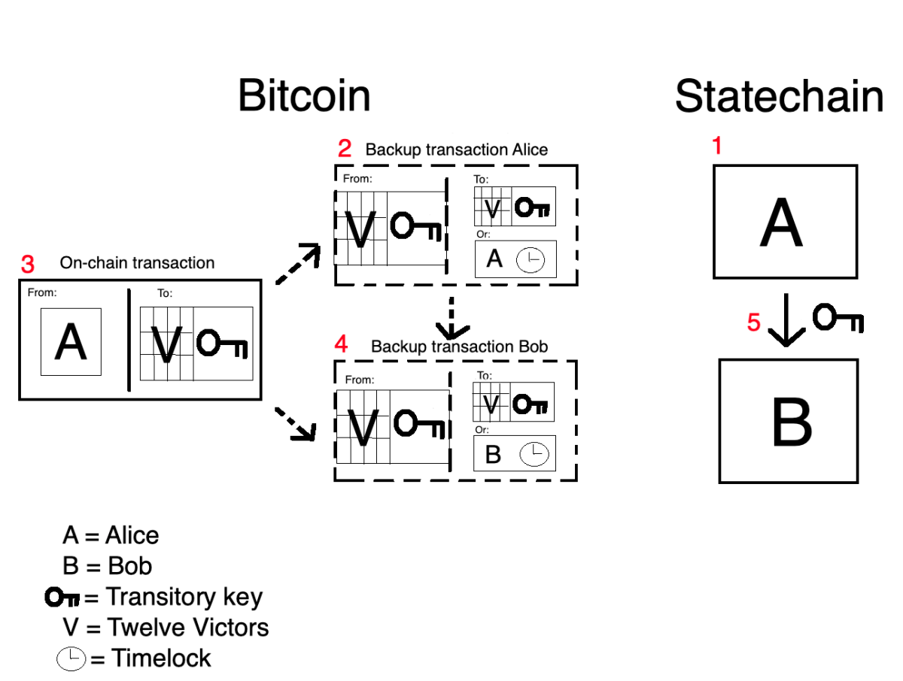

> *作者：AARON VAN WIRDUM*
> 
> *来源：<https://bitcoinmagazine.com/technical/statechains-sending-keys-not-coins-to-scale-bitcoin-off-chain>*

- Statechain 的用户直接发送可以用来花用资金的私钥。 -

区块空间总是有限的：比特币区块链平均每秒只能处理大概 10 笔交易。为了解决这个问题，比特币的技术社区一直在开发二层协议，即在 “链下” 处理交易的方法，比如[闪电网络](https://bitcoinmagazine.com/articles/history-lightning-brainstorm-beta)和[侧链](https://bitcoinmagazine.com/articles/sidechains-why-these-researchers-think-they-solved-key-piece-puzzle)。使用精密的密码学技巧，这些二层协议中的交易会捆绑在一起，最终以单笔交易的形式在比特币区块链上完成结算。

现在，一种新的二层协议加了进来。[Statechain](https://github.com/RubenSomsen/rubensomsen.github.io/blob/master/img/statechains.pdf)，由[首尔 Bitcoin Meetup](https://www.meetup.com/seoulbitcoin/)的组织者、[Unhashed 博客](https://www.unhashedpodcast.com/)联合主持人 Ruben Somsen 首创，它完全颠覆了比特币交易的概念。Statechain 的用户不是在地址间发送资金，而是直接发送可以使用资金的私钥。

我们来看看这个听起来很疯狂的想法到底靠不靠谱。

## 为什么 Statechain （在某种程度上）是安全的

简化来说，一笔比特币交易只是一条消息，声明哪些币（“UTXO”，未用过的交易输出）从哪个地址（“input”，输入）发到哪个地址（“output”，输出）。这条消息是用对应于发送地址的私钥签过密码学签名的，签名证明了确实是这些币的所有者创建了这笔交易。然后，整个数据包（交易本身加上签名）被广播道比特币网络中，最终被某个矿工打包到某个区块中。

技术上来说，当然可以直接发送私钥来代替支付交易：收到私钥的人就可以直接花费该私钥名下的资金了。但这样做是不安全的。如果私钥的发送者 —— 老规矩，我们叫她 “Alice” —— 给接收方 —— 也是老规矩，叫做 “Bob”—— 发送了一把私钥，那 Bob 怎么保证 Alice 没有私下保留一个备份呢？如果她真的保存了这把私钥 —— 这里我们用 “临时密钥” 来称呼吧 —— 那她就仍然能够在区块链上使用对应的资金，所以这些资金就不算是专属于 Bob 的。（译者注：在密码学的论文或者讲解中，大家惯常使用 “Alice” 和 “Bob” 作为交互方的化名。）

Statechain 对这个问题的第一种解决方案是加入第二把私钥。把资金锁在一个 2-2 的多签名合约中，这样仅凭一把私钥就无法在链上转移这笔钱了。

这第二把密钥是由一个中立的参与方 Victor 来生成的。 Victor 是这个 statechain 的协调员，肩负着非常重要的任务：Victor *必须且仅在* 临时密钥的最后一个接收者要求他签名的时候签名。

现在，我们假设 Alice 建立了一个 statechain，Victor 是协调员，他们俩使用两把私钥建立了一个多签名地址。现在 Alice 可以把 1 btc 发到这个地址里面 “锁住”。如果 Alice 想把这些币发给 Bob，她可以创建一笔交易，用自己的临时私钥签名，并要求 Victor 也签名。拿到两个签名后，Alice 就可以广播这笔交易，以普通的比特币交易的形式，给 Bob 发送资金。

但是，当然，这就压根没用上 statechain。所以，Alice 有个更好的主意，她直接把临时私钥发送给 Bob，并告知 Victor 她已经把私钥交了出去，所以 Bob 是临时私钥的所有者了。现在 Bob 可以联系 Victor 并请求签名来转移资金。

Alice 也还保留着这边临时密钥。但是，如果她想要 Victor 帮忙签名交易、转移资金，Victor 会拒绝。对于 Victor 来说，这些资金已经不属于  Alice 了。而因为 Alice 只有一笔私钥，光靠自己是没法转移其中的资金的。

如果 Bob 想要给其他人 —— 比如 Carol —— 转移资金，他可以如法炮制。当他把临时私钥发给 Carol 并告知 Victor 之后，Victor 就只会跟 Carol 配合了，所以 Carol 就成了资金的所有者。这个过程可以重复任意次，临时私钥可以发给 Dan、Erin、Frank，等等，完全无需用到区块链。

## 没有值得信任的 Victor

上面描述的场景，并没有完全消除信任需要。相反，人	们严重依赖 Victor。

一来，如果 Victor 接到请求而不签名交易，在这些币就动不了（也许 Victor 的电脑死机了，或者他被车撞了，甚至于，Victor 可能意识到了自己的权力，直接勒索临时密钥的所有者，不给钱就不签名）。

这个问题也是可以解决的 —— 但这正是 statechain 的设计复杂起来的地方。

在 Alice 初始化这个 statechain 时，她采取了预防措施：在把资金发送到这个多签名地址之前，她创建了一笔 “备份交易”，将资金从这个多签名地址发送到一个新的地址。

发送到新地址的资金可以在两种条件下使用。要么 Victor 和临时密钥的所有者一起签名，就像普通的交易一样，要么 Alice 可以独自花费这笔资金，在一个星期之后（举个例子）。

Alice *不把* 这笔备份交易发送到网络中。相反，她把交易发给 Victor，要求他签名并发回给自己。

在 Alice 收到签过名（但	没有广播）的备份交易之后，她再把资金发到多签名地址里面。这样一来，即使 Victor 消失了，她也可以把备份交易广播出去、在一周以后拿回自己的钱。

现在，假设 Alice 要给 Bob 发送临时私钥了，她先联系 Victor 并让他为 Bob 签名一条新的备份交易并交给 Bob。所以，当 Bob 拿到临时私钥时，就已经有一笔未广播但签过名的备份交易了，所以他也能在 Victor 玩失踪的时候拿回自己的钱。

在最后一轮的接触中，Alice 和 Bob（以及后续所有获得了临时密钥的人）使用一个为闪电网络设计的密码学方法，叫做 “[Eltoo](https://bitcoinmagazine.com/articles/future-bitcoin-what-lightning-could-look)”。Eltoo 使得 Bob 可以用自己的备份交易 “覆盖” Alice 的备份交易。所以，如果 Alice 尝试欺诈，把自己的旧备份交易广播出去，Bob 既可以在 Alice 的等待期（一周时间）里与 Victor 联系，联手拿回自己的钱；也可以使用自己的备份交易直接覆盖掉 Alice 的交易。

所以这个问题解决了。

## 相信 Victor（一点儿）

虽然 Vitcor 玩失踪的问题解决了，还有另一个问题：Victor 可以有意作恶。他可以跟临时私钥的前任所有者比如 Alice 联手，把属于 Bob、Carol、Erin、Frank 或任何一个最后拿到临时密钥的人的钱偷走（对于任何一个收到临时密钥的人来说，密钥的所有前任都也可能与 Victor 勾结。

这个问题实际上无法完全解决 —— 可能这就是 statechain 最大的一个缺点了。但这个风险时可以尽可能降低的。

期中一个最小化风险的措施就是把 Victor “分割”，并用多个实体来提到。“Victor 的私钥” 可以分割为几份。比如，12 个协调员中要有 8 个人，协助临时密钥的持有者转移资金。8 个 “Victor” 一起串通，总比 1 个 “Victor” 要难。

其次，如果这些 “Victor” 作弊，外界是可以发现的。可以通过创建一个新的微型区块链 —— 实际上，就是 “statechain” —— Alice、Bob、Carol 等等各自签名消息，证明自己已经把币转给了谁。如果 Victor 与 Alice 勾结，而 Alice 在 statechain 上已经把币签名给了 Bob，那么每个人都会看到。（这个微型区块链的结构尚未完全确定，但这并不是一个很难的问题。）

第三，这些协调员可以是大家熟知的主体。比如，一组比特币公司。这些公司在圈子里各有自己的脸面，因此，欺诈不是毫无代价的。虽然不像密码学的保证那么完美，这个假设也使得 statechain 的安全性类似于联盟侧链，比如 Blockstream 的 Liquid 和 RSK Labs 当前的 RSK 实现。

就是这么多！

- Statechain 让你可以在链下发送私钥，而不是发送资金到某个地址。 -

## Statechain 的局限性（与潜在解决方案）

除了需要信任协调员不会与前面的 statechain 参与者勾结，statechain 在其它方面也有一些局限性。

### 局限性

首先要指出的一点是，如本文所解释的，statechain 需要两个协议层面的升级：Schnorr 签名和 Sighash_Anyprevout（或 类似功能的操作码）。两个升级都在开发中，而且似乎不大可能引起争议。（译者注：Schnorr 签名已确定将于 2021 年 11 月随 Taproot 升级在比特币网络中激活。）

另一个局限是，statechain 仅支持发送（一个私钥名下的）所有 UTXO；在本文中就是 Alice 所有的币。因为 Alice 一开始锁住了 1 btc，她就必须把整个 1 btc 转出去，Bob、Carol 以及后续所有的临时私钥持有者都是如此。相比于普通的比特币交易，这是一个非常大的缺点，因为普通的比特币交易可以任意分割资金，剩下的可以作为找零返回给发送者。

### 解决方案

有缺点不代表没价值。首先，statechain 可以跟另一种叫 “原子化互换（atomic swap）” 的技术相结合。使用原子化互换，Alice 可以跟拥有两个价值 0.5 btc 的 UTXO 的 Zach 交换，而且双方都不需要信任对方不会半途跑路，而且可以完全在链下发生。所以原子化互换可以提升灵活性。

其次，即使是转移全部的 UTXO，在某些时候也是很有用的。可能最有趣的是，这个用法可以让参与者转移整个闪电通道。通过将闪电网络平衡至正确的数量（比如，首先在另一个通道中给自己支付一定的数量），Alice 就可以给 Bob 支付部分的资金。额外的好处是，这使得 Bob 可以立即开通一个闪电通道，无需经过在链上存入资金的步骤（这个步骤既需要时间也需要支付手续费）。

再加上，闪电网络交易的问题刚好相反 —— 大额交易比小额交易更难实现 —— statechain 和闪电网络可以相互取长补短。

### 隐私问题

尚不清楚 statechain 可以提供怎样的隐私性。在最差的情况下，Vivtor 和 其它参与者可以准确知道谁给谁支付了（虽然在现实中这个身份还是以公钥来表示的，不是实名的）。如果是不希望 Victor 窥探隐私，还是有办法可想的，比如，可以使用盲签名（由 eCash 发明者 David Chaum 在 1980 年代提出的一种密码学技术），而且盲签名还有一个额外的好处，将发送交易的任务从 Victor 处转移给了用户自己（理想情况下，协调员甚至不知道自己到底签名了什么）。

若要应对其他参与者，也可以反过来用原子化互换来解决。原子化互换可以模糊所有权证转移的链条。可能还有更多解决方案可以提升隐私性，比如 CoinJoin 交易的接受度（这也是主打隐私保护的钱包比如 Wasabi Wallet 的做法）。但细节还有待研究。

还有一些人担心临时私钥的上游参与者会尝试广播备份交易来认领资金，虽然这不太可能成功，毕竟成本很低（只需支付一笔链上的手续费），所以投机分子的欺诈可能会限制 statechain 的发展。

最后，当然，statechain 还是一个比较新的概念，还处在同行评议的阶段。

*感谢 Ruben Somsen 的讲解和反馈。想了解 statechain 的更多信息，请看他在 Medium 上的[解说文](https://medium.com/@RubenSomsen/statechains-non-custodial-off-chain-bitcoin-transfer-1ae4845a4a39)，以及他在阿姆斯特丹 [Breaking Bitcoin](https://www.youtube.com/watch?v=DqhxPWsJFZE&feature=youtu.be&t=17937) 大会上的演讲*。

（完）