> *作者：Elle Mouton*
> 
> *来源：<https://ellemouton.com/posts/taproot-prelims/>*

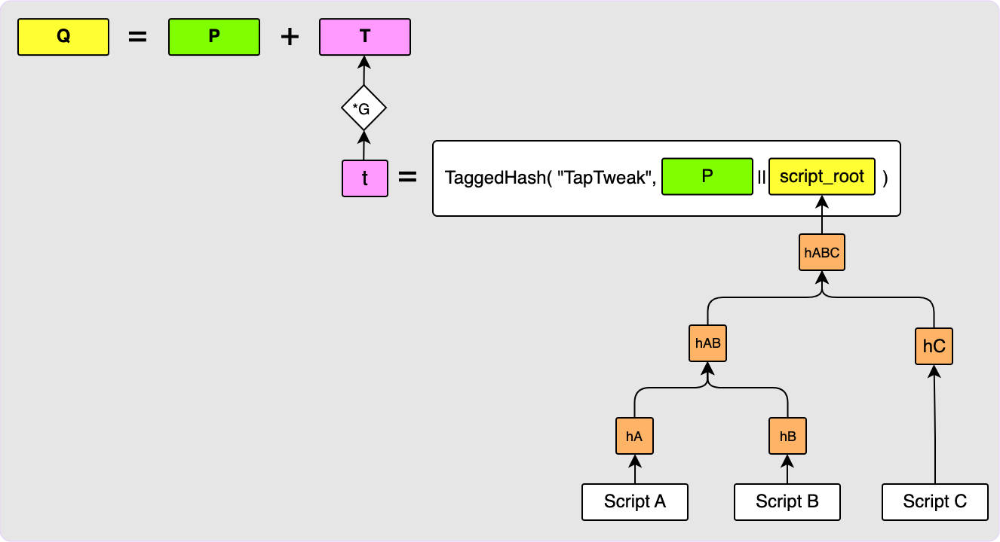

在我的上一篇博客中，我承诺了要撰写一篇关于 Taproot 通道的开发的文章。但是，开始写的时候我发现，可能先用一篇文章回顾一下理解 Taproot 通道所需的背景知识，会更好。那么我们开始吧！

## 概述

本文将介绍一些关于 Taproot 输出的背景知识，以及如何通过密钥路径和脚本路径来花费它。本文也会介绍两个签名方参与的 MuSig2 签名流程。注意，不论哪一个话题，我都不会穷尽细节。相反，这篇文章只是想唤醒你对这些话题的记忆，或者说给你足够多的关于 Taproot 输出和 MuSig2 工作原理的知识，这样你会更容易读懂下一篇文章。如果你想理解这两个话题的细节，有许多更好的文章；而且，勇敢一点的话，你可以去看 BIP：[Schnorr 签名](https://github.com/bitcoin/bips/blob/master/bip-0340.mediawiki)、[Taproot](https://github.com/bitcoin/bips/blob/master/bip-0341.mediawiki)、[Tapscript](https://github.com/bitcoin/bips/blob/master/bip-0342.mediawiki) 和 [MuSig2](https://github.com/bitcoin/bips/blob/master/bip-0327.mediawiki)。

好的，闲言少叙，我们直入正题！

## BIP340 公钥简述

公钥一般从会被编码成 32 字节的数组，而不是你可能习惯使用的常见的 33 字节的压缩公钥形式（compressed public key representation）。如果 secp256k1 曲线绘制在一个非有限域上（如下图所示），你可以看到对每一个 x 坐标值，都有两个可能的 y 坐标值。因为曲线实际上位于一个奇数阶的有限域上，所以，给定 x 坐标值，总有一个 y 坐标值是偶数，而另一个 y 坐标值是奇数。使用 32 位编码公钥的假设是，所记录的 y 值总是偶数那一个。这意味着，如果你想创建一个有效的 BIP340 签名，但你的私钥 `d` 所生成的公钥 `P` 带有奇数的 y 坐标值，那么你需要做的就是给你的私钥 *加上负号*。这将产生一个公钥  `P’`，其 x 坐标值与 `P` 相同，但其 y 坐标值是偶数。要了解更多关于  BIP340 公钥及其签名（也叫 “Schnorr 签名”）的信息，请看 [BIP 本身](https://github.com/bitcoin/bips/blob/master/bip-0340.mediawiki)。

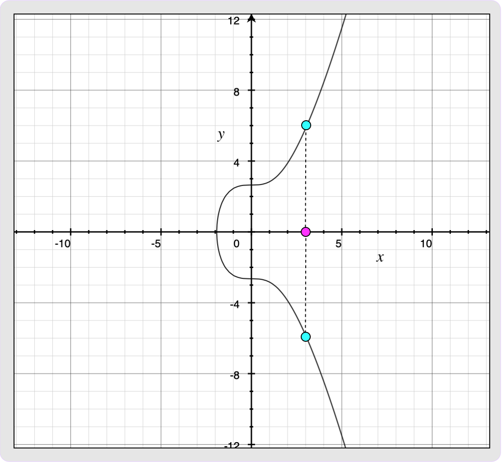

## Taproot 输出

Taproot 输出会在交易的 `scriptPubKey（脚本公钥）` 字段表现出来（跟其它类型的输出一样），它具有这样的形式：

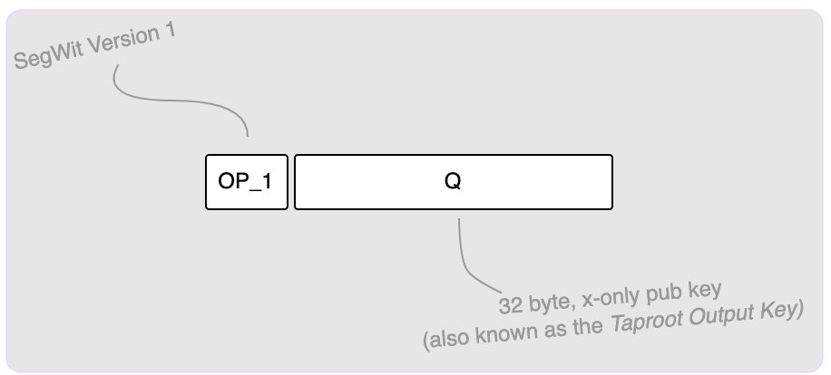

这个 `OP_1` 表明了这是一个隔离见证 v1 输出（也即，Taproot 输出），而后面的 32 字节则表示输出的公钥（也就是上面说的 [BIP340 公钥](#BIP340-公钥简述)）。我们通常使用 `Q` 来代指这个公钥。下面这张图片完整地展示了一笔交易中的一个 Taproot 输出：

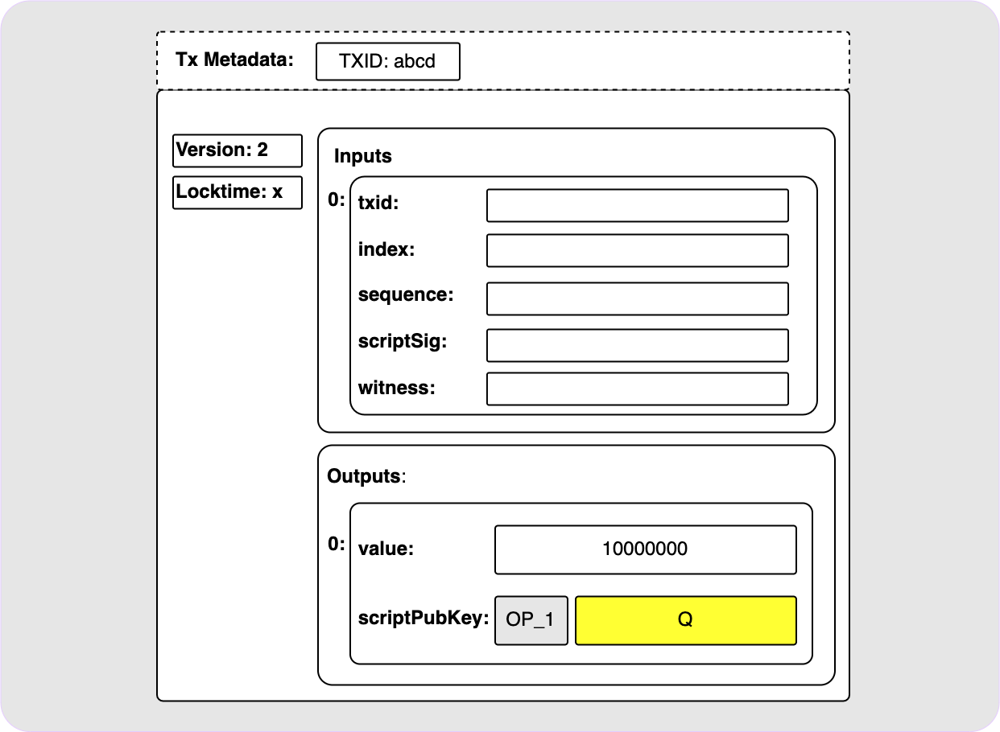

很棒。但是，这个输出里面到底是什么呢？它跟 P2PK 输出一样吗？不是的。要是那样的话就太差劲了。真相是，这个看起来很简单的输出可以包含许多不同的东西。它可能是一个简单的单公钥条件（没错，这就跟 P2PK 一样），也可以是一个 n-of-n 的 MuSig2 公钥；它还可以拥有许多脚本分支条件。还可以是上面这些的综合！我们稍微了解一下这些选项。

## 单公钥输出或 n-of-n 的 MuSig2 公钥输出

如果你只是想创建一个发送给单公钥 `P` 的输出，这是很容易做到的。在这种情况下，你是令你的公钥 `P` 作为输出的公钥 `Q` ；这个 `P` 通常称作 “*内部公钥*”。

要花费这个输出的时候，你只需要在见证数据字段提供一个 BIP340 签名，是用 `P` 背后的私钥 `d` 计算出来的，即可。你可能需要先给你的私钥加上负号，见上文的 “[BIP340 公钥](#BIP340-公钥简述)” 部分）。

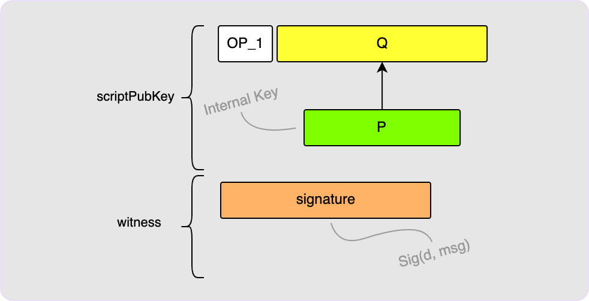

但是，如果你想用的是一个 n-of-n 的聚合 MuSig2 公钥呢？事实证明，这在链上看起来跟上面这种单公钥的输出 *没有什么区别* ！变化仅在于：你跟你的同僚签名者需要建立聚合公钥，然后计算最终的签名。但所有这些完成之后，最终我们得到的东西在链上看起来是没有分别的。

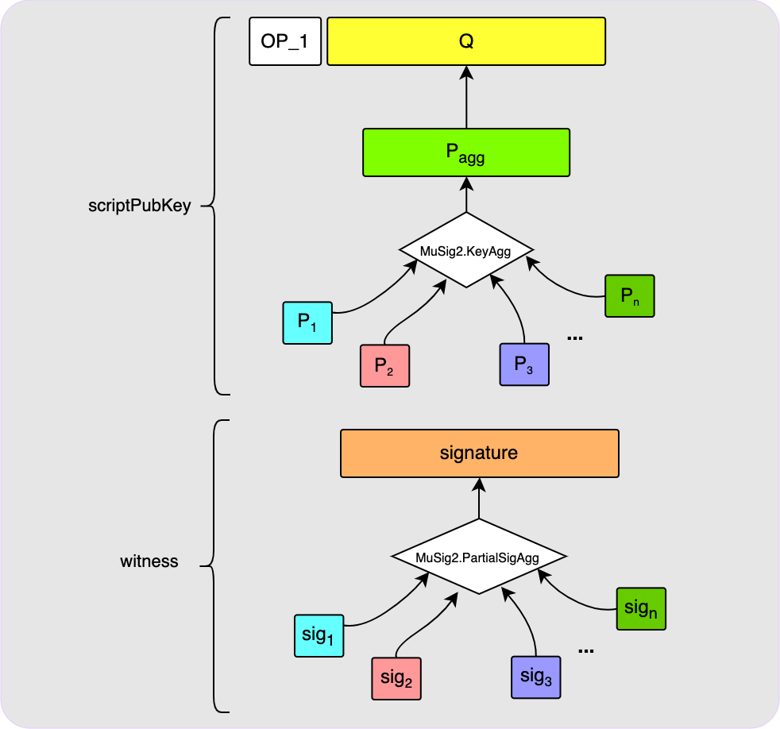

## 脚本路径

有魔法的地方从这里才刚刚开始。除了公钥，你还可以通过一个脚本来花费你的 Taproot 输出；而每一个 Taproot 输出可以有很多个这样的脚本。另一件很酷的事情是，即使你选择了为你的 Taproot 输出加入脚本路径，你依然可以添加上文那样的常规密钥路径。举个例子，假设你希望随时花费你的输出，但你还希望加入三种脚本路径，使该输出可以在别的情况下花费：30 天后，你的伙伴可以花费这个输出；这是第一种脚本路径。你还有另外两种脚本路径（假设其中一种是 2-of-3 多签名，还有一种需要揭晓某个原像），那么，你的 Taproot 输出将这样构造出来：

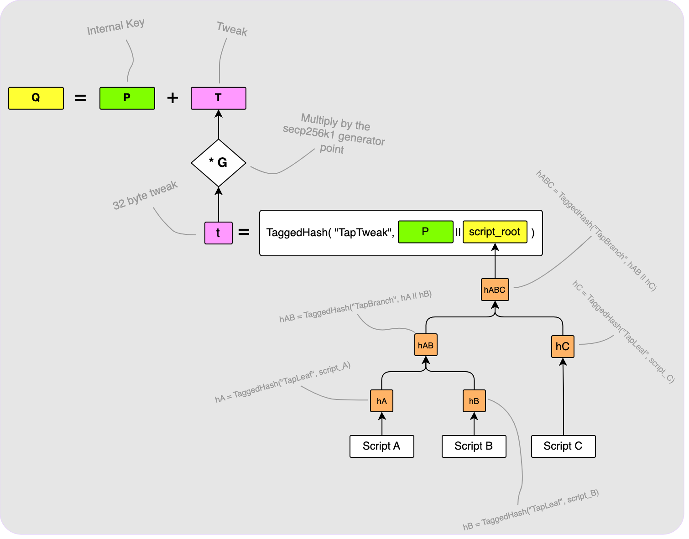

我们简单解释一下上图：

首先，如上图右边所示，将三个脚本（`Script A`、`Script B` 和 `Script C`）都放入一棵[默克尔树](https://en.wikipedia.org/wiki/Merkle_tree)中。这棵默克尔树的根植会跟我们的内部公钥 `P` 一起运行哈希计算，形成一个 32 位的调整值 `t`。这个调整值再通过乘以生成点 `G`、转化成它的椭圆曲线点 `T`，再将 `T` 跟内部公钥 `P` 相加，就得到了最终的输出公钥 `Q`。我在这里跳过了一些东西，例如脚本编码的细节，以及脚本是如何哈希成默克尔树的，如果你有兴趣，可以去读相关的 BIP。

大功告成 —— 我们的有趣 Taproot 输出已经建立好了！但是，现在，我们该怎么花费它呢？有两种花费这个输出的办法：一种是通过内部公钥 `P`，我们称为 “*[密钥路径花费](https://ellemouton.com/posts/taproot-prelims/#key-path-spends)*”。另一种是通过默克尔树上的其中一个脚本，我们称为 “*[脚本路径花费](https://ellemouton.com/posts/taproot-prelims/#script-path-spends)*”。

### 密钥路径花费

通过密钥路径来花费带有脚本的 Taproot 输出是非常简单的，就跟我们在前面花费使用未经调整的普通公钥的 Taproot 输出类似。唯一的区别在于，你需要使用上面得到的调整值 `t` 来调整你的私钥 `d`。换句话说，你的新私钥变成了 `d+t`，这才是你要用来计算你的签名的秘密值。就这么简单！如果你通过密钥路径来花费这个输出，你就不需要揭开任何脚本，所以观察链上信息的任何人都无法知道你的输出竟然还可以通过脚本路径来花费。

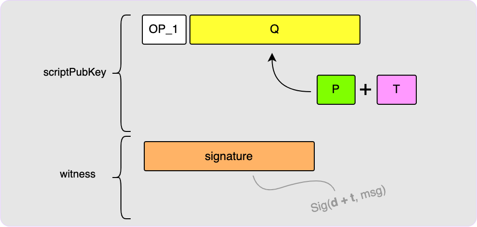

### 脚本路径花费

若用通过其中一个脚本路径来花费，你的见证数据就需要稍微复杂一些。假设你想通过 `Script B` 来花费。我们需要做下列操作以说服验证者，我们有权利花费这个输出：

1. 我们必须为 `Script B` 提供一个有效的花费脚本。
2. 我们需要证明，`Script B` 是嵌进这个输出中的。

步骤 1 很简单：我们只需要为 `Script B` 提供有效的见证脚本，再带上 `Script B` 即可。而步骤 2 就更费功夫了。为了证明 `Script B` 是嵌进 `Q` 中的，我们需要给验证者提供构造 `Q` 的所有模块。我们称这些模块为 “控制块（control block）” 。放在控制块中的第一个东西就是内部公钥 `P`；控制块也包含了允许验证者计算默克尔树根植的默克尔证据。因为见证数据中已经包含了 `Script B`（因为步骤 1），所以验证者可以计算 `hB`（见上文关于默克尔树构造的图片），我们只需提供 `hA` 和 `hC` 即可。验证者将使用这些哈希值来计算 `script_root`，然后将它跟内部公钥 `P` 一起哈希，以计算出调整值 `t`。然后，验证者可以计算出对应的调整点 `T`，将它与内部公钥 `P` 相加后得到最终的 `Q`。控制块必须包含的最后一个东西是一个比特，说明最终的 `Q` 点的 y 坐标值是一个奇数还是一个偶数，这样验证者可以检查他们得到的 `Q` 值是否具有正确的 y 坐标值。

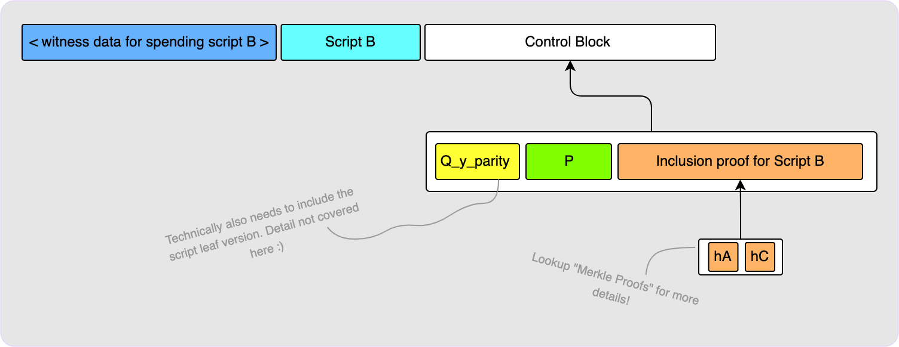

值得指出的是，不知道 `d`（内部公钥 `P` 背后的私钥）也不影响使用 `Script B` 的花费行为（当然，`Script B` 中不能包含 `P`）。另一间事情是，我们不需要揭开树上其它未被使用的脚本的内容，只需提供它们的哈希值即可。

## BIP86 调整

有一种聪明的技巧，可以在你想要创建没有脚本路径的 Taproot 输出时向第三方证明其中真的没有脚本路径。你需要做的仅仅是按照有脚本路径那样构造 `Q`，*但是* 将 script root 值留空。

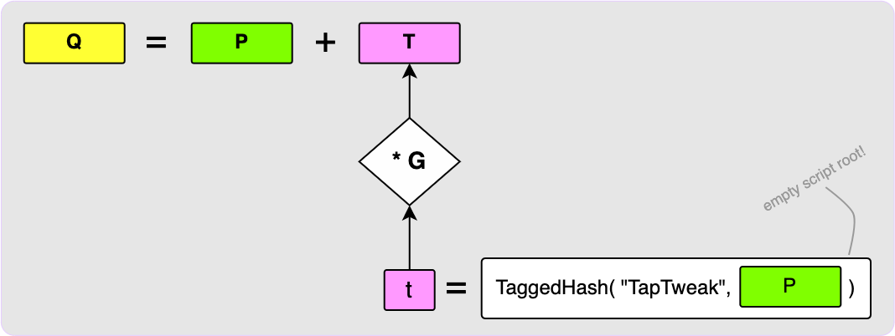

这个输出将仅能够通过密钥路径，使用私钥 `d+t` 来花费。然后，你可以向第三方提供 `P`，来证明这个输出中没有脚本路径。他们可以使用` P` 来计算 `t` 和 `T`，然后验证 `P + T` 等于输出公钥 `Q`。更多信息可见 [BIP86](https://github.com/bitcoin/bips/blob/master/bip-0086.mediawiki#address-derivation)。

## MuSig2

有了 Taproot 软分叉，比特币节点现在可以理解 BIP340 签名（或者说 Schnorr 签名）了。这种签名的好处在于其线性可加性：公钥 `P_1` 的主人可以为消息 `msg` 创建一个签名碎片 `sig_1`，然后公钥 `P_2` 的主人可以为同一条消息创建 `sig_2`。这两个碎片可以结合，也即 `sig = sig_1 + sig_2` 是他们的聚合公钥 `P = P_1 + P_2` 的一个有效签名。

这非常酷，因为这意味着我们不需要创建一个很长的 n-of-n 多签名脚本，然后为每一个签名支付区块空间费用，只需要提供一个签名，而且完全不需要提供脚本。只有一个公钥（也就是那个 *聚合* 公钥）会出现在链上。

棘手的地方在于，建立这个聚合公钥以及创建最终签名，所有事情都需要在 *链下* 完成。[MuSig2](https://github.com/bitcoin/bips/blob/master/bip-0327.mediawiki) 是一种协议，定义了应该如何完成整个流程。其中的许多步骤都是精心设计的，以保证整个流程是信任最小化的，以及保护用户免受 “密钥扣减（key cancellation）” 这样的攻击。

[BIP327](https://github.com/bitcoin/bips/blob/master/bip-0327.mediawiki) 定义了 MuSig2 协议以及流程中的各个步骤应该使用的多种算法。因为这篇文章的目的只是提供理解 Taproot 闪电通道所需的背景知识，我以为只会在 API（应用程序接口）的层面上介绍 MuSig2，介绍它使用了什么样的算法，但主要关注如何在闪电通道中使用它。如果你想了解更多，请看相关的 BIP。我在[这里](https://github.com/ellemouton/schnorr/tree/master/musig2)也从头实现了所有的 MuSig2 方法，如果你更喜欢阅读代码的话，可以看看。

### MuSig2 vs n-of-n Multisig

你需要牢记一件事：使用 n-of-n Multisig 输出的时候，生成签名的各方是完全独立的。只要每人都有需要签名的消息，他们用自己的私钥就能创建出一个签名。这个签名可以安全地分发给其他签名者，而且最终交易的见证数据中会包含 `n` 个签名。换句话说：签名的时候，各方并不需要交互。但在 MuSig2 中就不是这样：因为链上只有一个公钥，因此需要制作出一个签名。这 `n` 方必须彼此交互，以产生最终的签名。

### 案例讲解

我们走一遍两方参与的情形。Alice 和 Bob 希望建立一个 2-of-2 的 MuSig2 输出，然后用一个签名来花费它。

第一个图展示了初始状态：Alice 和 Bob 各有各的私钥以及对应的公钥，现在双方并没有共享的知识。

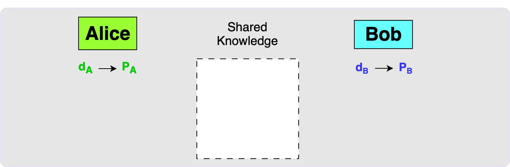

当双方决定一起构造一个输出的时候，他们首先需要交互公钥。然后，双方都使用 MuSig2 `KeySort` 算法来排序公钥，并使用 `KeyAgg` 算法来聚合公钥。这将产生一个聚合公钥 `P_agg`，也是最终出现在输出中的公钥。

当 Alice 和 Bob 有了双方都想要签名的共享消息（比如他们想要发起的交易）时，他们进入签名阶段。

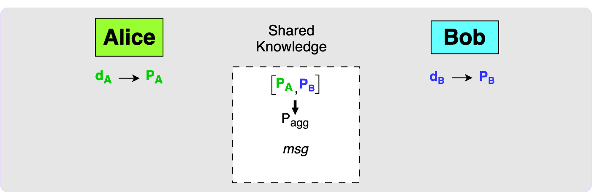

签名阶段的第一步是每一方都要创建一个 nonce。每个人都要创建一个秘密的 nonce 值，称为 `secnonce`，与之相关的公开 nonce 值 `pubnonce` 是由它决定的。注意，每一个 `secnonce` 实际上都是由两个私钥组成的，而每一个 `pubnonce` 都是由这两个私钥所推导出的的公钥组成的。这里要使用两个 nonce 值的安全理由已经超出了本文的范围。然后，Alice 和 Bob 需要交互公开 nonce 值，然后，双方都使用 MuSig2 `NonceAgg` 方程来决定聚合 nonce 值：`aggnonce`。注意，这个步骤不需要对消息操作，意味着这个步骤可以在知晓需要签名的消息前就发生。

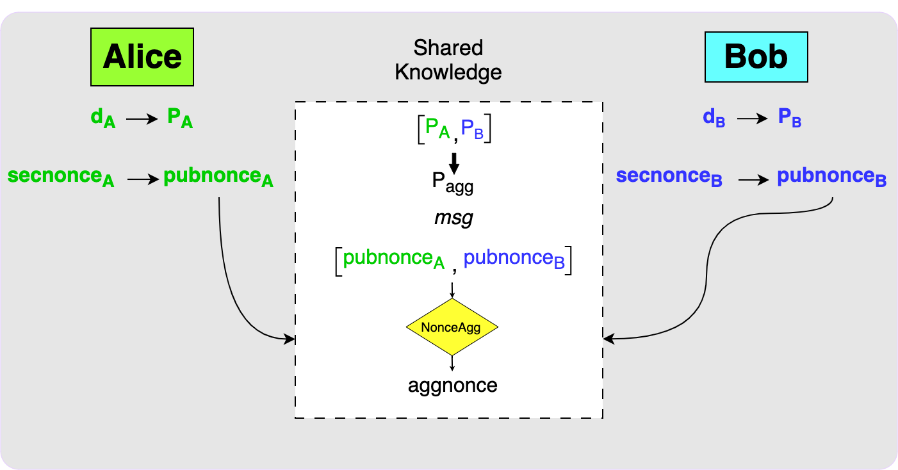

当双方都交换了公开 nonce 值、都知晓了需要签名的消息之后，每一方都可以使用 MuSig2 的 `Sign` 函数来产生签名碎片。

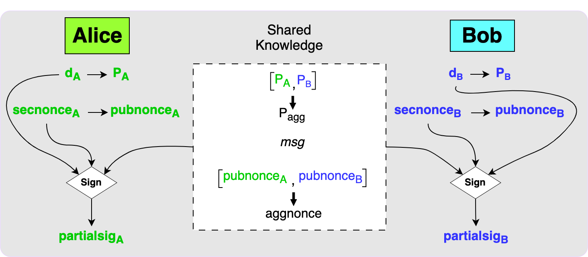

最后一步，是双方交换签名碎片。每一方都可以使用 MuSig2 `PartialSigAgg` 函数来计算最终的签名。这个签名将是 `P_agg` 对消息 `msg` 的有效签名。

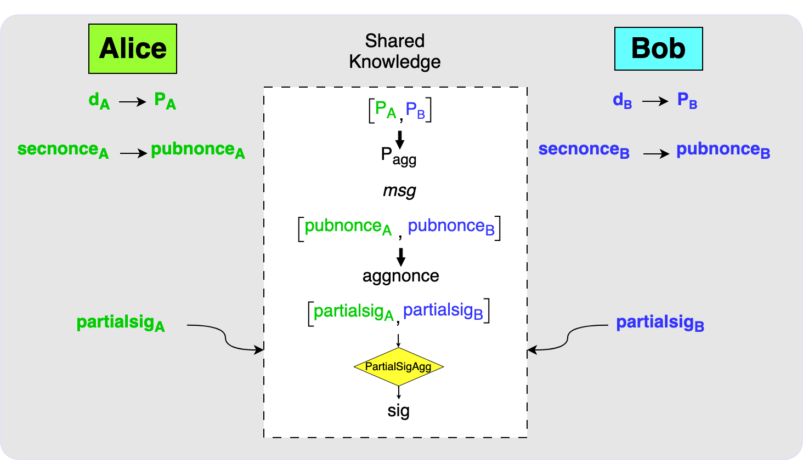

熟悉上述的 MuSig2 流程是很重要的，因为在下一篇文章中我们会经常用到。在 Taproot 通道中，一个通道的注资交易输出将是一个 MuSig2 聚合公钥。这意味着，花费这个输出的每一笔承诺交易都需要经历这里的签名流程。因为闪电通道中的通道状态是不对称的，这意味着每次状态更新都需要执行两次签名流程：一次是为了签名本地的承诺交易，而另一次是签名远端的承诺交易。但更多细节，就等下一篇博客吧。

感谢阅读！希望这篇文章能帮到你！如果你认为某些东西需要进一步理清，或者有不正确的地方，请不要迟疑，联系我！

（完）