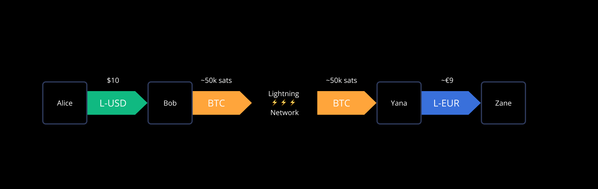

> *作者：Lightning Labs*
> 
> *来源：<https://docs.lightning.engineering/the-lightning-network/taproot-assets>*

“Taproot Assets”（曾用名 “Taro”）是一种新的协议，由 Taproot 赋能，用于在比特币系统内发行资产，且资产可在闪电网络内传输，实现及时、高容量、低手续费的交易。就其核心而言，Taproot Assets 利用了比特币网络的安全性和稳定性，以及闪电网络的速度、可扩展性和低手续费。

Taproot Assets 依赖于比特币最近的一次升级 Taproot；该升级引入了一种新的树型结构，允许开发者在一个比特币交易输出内嵌入任意的资产元数据。Taproot 还使用 Schnorr 签名来提升简洁性和可扩展性；而且，重要的是，它还能跟闪电网络中的多跳交易相结合。

纵观比特币的历史，许多提议致力于将资产带到比特币区块链上。Taproot Assets 依靠 Taproot 带来的力量，推进了这些提议背后的想法。在一种以 Taproot 为核心的设计中，Taproot Assets 可以在比特币和闪电网络上发行资产，而且更加隐私和可扩展。利用 Taproot Assets 协议发行的资产可以存入闪电通道中，让节点可以提供从比特币到资产的原子化互换。这让 Taproot Assets 可以跟广大的闪电网络互操作，从闪电网络的采用中受益并强化闪电网络的网络效应。

Taproot Assets 使用一种 “稀疏默克尔树（Sparse-Merkle Tree）” 结构来启用 见证/交易数据 的快速、高效、隐私的检索和更新；并使用一种 “默克尔总和树（Merkle-Sum Tree）” 来证明 有效状态转换/无通胀。资产可以通过链上交易来转移，也可以在存入闪电通道后通过闪电网络来转移。

 Taproot Assets 交易的参与者承担验证和存储的成本（需要在本地（链下）存储空间内存储相关资产的见证数据），或者，可以使用名为 “Universes” 的信息仓库（类似于一个 git 仓库）。为检查一项资产的有效性，需要验证该资产自创世输出（状态）以来的流转。这是通过在 Taproot Assets gossip 层中接收交易数据的一个验证文件来实现的。客户端可以交叉检查自己的区块链副本，并在需要转移相关资产时修改自己的证据。

总结：

1. 允许在比特币区块链上发行资产
2. 利用 taproot 来获得隐私性和可扩展性
3. 资产可以存入闪电通道
4. 资产可以在现有的闪电网络中转移

[阅读更多：2022 年 4 月 Taproot Assets 的宣布演讲幻灯片](https://docs.google.com/presentation/d/1YgMG4MOjs5dHhlf77Zh0WOENXqB0JTV8ZarVjS8slyk)

[观看：Taproot Assets: A new protocol for multi-asset Bitcoin and Lightning](https://www.youtube.com/watch?v=-yiTtO_p3Cw)

## 特性与局限性

Taproot Assets 支持许多特性，让协议可扩展、健壮，并且对带宽和性能有限的移动设备友好。

- Taproot Assets 是轻客户端友好的：验证成本低，而且只需访问不必信任的比特币交易。Taproot Assets 并不需要对整条区块链的知识。
- Taproot Assets 允许资产与比特币的原子化互换。
- Taproot Assets 可以发行唯一资产、不唯一的资产以及收藏品。
- Taproot Assets 允许创造性的多签名和联合签名安排。
- Taproot Assets 通道可以跟 BTC 通道并存在同一个 UTXO 中，这使得 Taproot Assets 可以存在于闪电网络中，而不需要消耗额外的资源。举个例子，Alice 和 Bot 可以在一笔比特币交易中创建两条通道，一条是某种资产的通道，另一条是 BTC 通道。
- 未来可能引入的特性包括机密交易以及作为 Taproot Assets 转移的一部分的零知识证据。

## Taproot Assets 协议

Taproot Assets 主要是一种链上协议，资产会使用 taproot 交易发行在比特币区块链上。

### 概念

为理解 Taproot Assets，我们需要熟悉几个概念；有一些概念是比较新颖的，即使在比特币区块链的语境下。

[阅读 BIP：Taproot Assets 协议](https://github.com/Roasbeef/bips/blob/bip-tap/bip-tap.mediawiki)

在这里学习基本概念：

- [公钥密码学](https://www.cloudflare.com/en-ca/learning/ssl/how-does-public-key-encryption-work/)
- [密码哈希函数](https://resources.infosecinstitute.com/topic/introduction-to-hash-functions/)
- [默克尔树](https://nakamoto.com/merkle-trees/)
- [比特币 UTXO](https://mirror.xyz/0xaFaBa30769374EA0F971300dE79c62Bf94B464d5/Yetu-6pZkbQCOpsBxswn_7dGUZDxoBU8NrOQIZScwpg)

**Taproot 交易**

Taproot 是由 [BIP 341](https://github.com/bitcoin/bips/blob/master/bip-0341.mediawiki) 定义的一种新的比特币交易类型；从 2021 年 11 月开始， Taproot 在比特币区块链上完全激活。Taproot 交易相比传统的比特币交易，主要区别在于控制资金的脚本被包含在一个叫做 “tapScript 分支” 的树状结构中，而该结构是隐秘地承诺的。如果相关的 “密钥花费路径”（脚本）没有被用来移动资金，其内容就不必暴露。

传统的交易要求暴露整个脚本（不论用到的是脚本中的哪一部分），而 Taproot 交易则可以通过暴露一个公钥（及其有效签名）来避免暴露脚本；如果密钥花费路径不可用，也只需要揭晓被执行的脚本片段。所有其它没有用到的脚本路径都依然是私密的，或者也可以在链下选择性揭晓。

这使我们可以创建更加复杂的脚本；在密钥花费中，不需要付出在区块链上提交额外数据的额外成本；而且我们还可以高效验证一个修剪过后的脚本片段。在 Taproot Assets 的语境下，这让我们可以为一笔比特币交易可证地附加任意数据，且不需要在链上揭晓这些数据。

**承担到一个哈希值：Taptweak**

我们将这样包含了任意数据的交易叫做 “承诺”。一旦这样的交易被包含在某个区块中，我们就在其中承诺了一些数据，而且再也不能改变这些数据。

在承诺数据的时候，我们要使用一个叫做 “Taptweak” 的调整因子来扭曲我们的 Taproot 花费密钥的公钥。这让我们可以选择性揭晓被承诺的数据，而无需揭晓我们的私钥；或者，我们可以花费这个 taproot 输出而无需揭晓承诺。

在 Taproot 交易中，这种技术用来承诺脚本树（用树状结构组织起来的多段脚本）；实际上，这可以用来承诺任意数据。

- `Q = P + H(P|c)G`
- Q 就是 Taproot 输出的最终的公钥
- P 就是 Taproot 输出的 “内部公钥”
- H(P|c) 是内部公钥以及数据承诺的哈希值

在使用我们的私钥来签名 Taproot 输出的花费交易时，这个私钥（内部公钥的私钥）也需要用公钥和数据承诺的哈希值（H(P|c)）来扭曲。

[阅读：Taproot 即将到来：它是什么，如何有益于比特币](https://bitcoinmagazine.com/technical/taproot-coming-what-it-and-how-it-will-benefit-bitcoin)

[观看：Bitcoin Optech Schnorr Taproot 研讨会](https://bitcoinops.org/en/schorr-taproot-workshop/)

**稀疏默克尔树**

“稀疏默克尔树（SMT）” 是一种数据结构；使用它的时候，可以证明特定数据并不存在于一棵默克尔树中（“稀疏” 在此处意味着 “稀稀落落”）。SMT 是一种经过认证的 键-值对 存储（authenticated key-value store），意思是，树上叶子的关键字（key）（或者说其位置）与其内容是相互绑定的。

为了实现这种属性，叶子的内容会被哈希、创建出一棵默克尔树，并且叶子的位置正对应着其哈希摘要的位图（bitmap）。必然地，这会需要一棵 256 层的树，它会有 2^256 个叶子。生成这样的树是高效的，尽管看起来体积很大，因为绝大部分的分支包含的都是空的叶子，可以用 nil 哈希值来代表。


<p style="text-align:center">- 构造一棵稀疏默克尔树 -</p>


举个例子，我们可以使用一种虚构的哈希函数 sha002 来创建一棵稀疏默克尔树；sha002 的输出是 0 跟 3 之间的数字。于是，我们创建出的稀疏默克尔树就有 4 个叶子：0、1、2 和 3。只有叶子 2 是有内容的，所有其它叶子都是空的。为了找到叶子 2（其二进制表示是 “10”），我们只需在第一步中选择右边的分支（1），然后在第二步中选择左边的分支（0）。


<p style="text-align:center">- 定位一棵稀疏默克尔树中的一个叶子 -</p>


要验证叶子 2 的内容，我们只需要揭晓这个叶子中的数值、叶子 3 的哈希值，以及分支 0 的哈希值，即可。

在稀疏默克尔树中，每一个叶子都可以描述成一个指南，可以通过一张表示成二进制形式的地图找到自己。这张地图就是这棵稀疏默克尔树本身，而这个指南可以表示成在每一个分叉路口应该转左还是转右的指令。举个例子，在一棵 2^4 大的稀疏默克尔树上，第 10 个叶子可以用二进制表示成 1001，意味着我们只需先走右边、然后走左边、再走左边，最后走右边，就可以找到对的那个叶子。

这种属性，在构造和重构稀疏默克尔树的时候是极为有用的，因为它准确描述了我们要重新构造稀疏默克尔树的哪一部分。更重要的是，每个叶子中的数据，都可以用叶子在树上的位置来描述。

使用稀疏默克尔树，我们可以将数据与公开的关键字关联起来，并以易于验证的方式证明我们已经删除了这个数据，而无需揭晓整棵树。


因为每一个数据都有自己预先确定的位置，所以树的根哈希值独立于这些数据插入树的顺序。

[亦见：Plasma Cash](https://ethresear.ch/t/plasma-cash-plasma-with-much-less-per-user-data-checking/1298)

**默克尔总和树**

“默克尔总和树” 是一种默克尔树，其每个叶子都包含了一个数字值，并且树上每个节点都包含其下面的叶子的数字值之和。所以，默克尔总和树的根就是所有叶子的数字值之和。

因为承诺了跟叶子相关联的数量，默克尔总和树允许状态转换（无通胀）的高效验证。

[亦见：使用默克尔总和树生成债务证明](https://blog.bitmex.com/addressing-the-privacy-gap-in-proof-of-liability-protocols/)

**结合 taproot、taptweak、稀疏默克尔树和默克尔总和树**

Taproot Assets 协议使用了上述概念的结合，以支持发行原生于比特币区块链的资产。稀疏默克尔树和默克尔总和树会结合成稀疏默克尔总和树。

这棵树的根值会被添加到一个 taproot tapscript 中，然后参与一个 taproot 地址的创建。

Taproot Assets 没有自己的区块链，资产的发行者会在链下存储稀疏默克尔总和树，然后以协议外的通信方式为资产持有者发放资产证明。这样的资产的持有者可以独立验证自己的账户被包含在了树中，并且携带了正确的数量；对应的一笔 taproot 交易存在，并已经被比特币区块链确认。

[阅读 BIP：稀疏默克尔总和树](https://github.com/Roasbeef/bips/blob/bip-tap/bip-tap-ms-smt.mediawiki)

### 发行资产

**资产 ID**

要发行一种 Taproot Assets 资产的时候，我们先要创建该资产的标识符。我们创建一个 32 字节的资产 ID，这是用三个元素哈希出来的：即将被花费以铸造这种资产的输出点（outpoint）（译者注：可以理解为 UTXO 的编号）、铸造者选定的一种资产标签（例如，其品牌名的哈希值），以及跟这种资产相关的元数据，例如网站、图片和文档。

```
asset_id = sha256(genesis_outpoint || asset_tag || asset_meta)
```

**资产脚本（Asset Script）**

资产脚本可以有输入和输出，类似于比特币交易。新创建的资产不包含任何 Taproot Assets 输入，但资产的转移会有。

资产脚本的输出定义了新创建的资产会被发放给谁。更准确地说，这是通过一棵稀疏默克尔总和树来实现的：在树上，每个账户都用其 256 比特的关键字来辨识，跟这个关键字对应的叶子包含了关于这个账户拥有的数量的信息。

可以在一笔比特币交易中发行多项资产，但每一种资产都有自己单独的资产脚本以及其中的稀疏默克尔树。资产可以是唯一的，也可以是不唯一的。

[阅读 BIP：Taproot Asset 脚本](https://github.com/Roasbeef/bips/blob/bip-tap/bip-tap-vm.mediawiki)

**资产叶子**

每一个叶子都包含一个 TLV（类型、长度、数值）数据，类似于用在闪电网络中的 TLV。它包含了一些信息（例如版本、资产 id、数量），还有与这项资产的以往流转有关的数据（例如签名）。

**承诺到树根**

生成了稀疏默克尔总和树和资产脚本之后，我们就可以扭曲我们的内部公钥、获得这个合约的地址并敲定这笔交易。

**发布交易**

发布这笔交易并让它得到比特币区块链的确认之后，我们就不可逆地创造了一种资产。对其他人来说，这笔交易看起来跟其它标准的 taproot 交易没有区别。

**资产证明**

资产发行者现在可以选择性地揭晓自己创建了什么资产，以及这些资产被分配给了谁。最重要的是，发行者可以向接收者证明一项资产已经转移给了他们，办法是揭晓一个具体的资产证明，包括资产的脚本，以及接收者账户作为关键字的叶子的稀疏默克尔总和树的路径。


<p style="text-align:center">- 证明稀疏默克尔树上不包含某个状态 -</p>


### 转移资产

Taproot Assets 资产可以在链上转移，也可以用来开启闪电网络通道。在这一节，我们只讨论以链上交易转移。

Taproot Assets 协议并不规定各资产账户的持有者之间如何交互，这件事交给各个应用。发行者在定义资产的性质或者说约束资产的意图上享有灵活性。

资产根承诺（Asset Root Commitment）承诺了树上持有的所有资产以及它们的总和。资产 id 是全局唯一的，因为它取决于其创世输出的标识符。整个树根可以包含多个资产 id，资金的保护是通过验证资产树根（asset_tree_root）来实现的。

```
asset_tree_root = sha256(asset_id || left_hash || right_hash || sum_value)
```

**Taproot Assets 地址**

Taproot Assets 地址是 bech32m 编码的标识符，编码了资产 ID、资产脚本的哈希值、稀疏默克尔总和树的内部公钥、数量，以 “Taproot Assets” 或 `taptb1`（测试网）为前缀。

```
bech32(hrp=TapHrp, asset_id || asset_script_hash || internal_key || amt)
```

资产的发行者，或者资产的持有者，可以使用 Taproot Assets 地址中的这些信息，来创建或修改对应的稀疏默克尔总和树（下文讲述）。这种地址格式也可以用来请求对某地址持有某数量的一个具体证明。

[阅读 BIP：Taproot Assets 链上地址](https://github.com/Roasbeef/bips/blob/bip-tap/bip-tap-addr.mediawiki)

**在树内转移资产**

为转移 Taproot Assets 资产，接收者将自己的地址发给自己的交易对象：可以发起转移的资产当前持有人。资产持有者跟发行者之间的具体交互现在还没有严格定义。可以留给各应用甚至资产的发行者来指定。

资金的发送者需要创建一棵新的稀疏默克尔总和树，反映新的余额。这是通过减少特定叶子的余额、增加另一个叶子的余额来实现的。稀疏默克尔总和树保证了在这样一笔交易中，不会创建新的资产（不会通胀），并且发送者对这项资产的索取权已被完全放弃。


<p style="text-align:center">- 定位账户 -</p>


创建资产需要一笔链上的 taproot 交易，但可以铸造多少资产以及多少账户可以持有这些资产则并没有限制。为转移资产，如上所述，需要重组默克尔树并发布新的一笔链上交易。一笔链上交易可以反映多少内部 Taproot Assets 交易也没有限制。

使用这种方法，资金被分配给账户持有者，表示成稀疏默克尔总和树上的叶子，但发起这样的内部转移的能力限制在 taproot 内部私钥的所有者手上。


<p style="text-align:center">- 用在 Taproot Assets 协议中的多种树结构的概览 -</p>


**Universe**

“Universe” 是一项服务，提供关于资产的信息以及给资产持有者的证据。它就像比特币的区块浏览器，但展示的是 Taproot Assets 交易数据，这些数据本身是 Taproot Assets 协议客户端在链下存储的。主要区别在于，因为与 Taproot Assets 相关的绝大部分信息都是链下的，所以更容易隐藏。

Universe 可以由资产的发行者自己运行，也可以由发行者另外指定。自发运行聚合了由资产持有者提交的信息的的 Universe 也是便利的。

举个例子，给定一个资产 ID，Universe 可以提供关于其创世输出的信息，以及当前的元信息（例如文档、资产脚本以及流通中的总数）。服务端可以知道多项资产（Multiverse），也可以仅知道一个输出（Pocket Universe）。

Universe 在 Taproot Assets 协议中没有特权。它提供可用比特币区块链验证的教育处数据。恶意的 Universe 只能拒绝返回客户端请求的数据。Taproot Assets 交易数据跟 Universe 不是绑定的。Universe 提供的数据可得性产品是由希望快速、便宜地验证自己的资产的用户激励的。

[阅读 BIP：Taproot Asset Universes](https://github.com/Roasbeef/bips/blob/bip-tap/bip-tap-universe.mediawiki)

**资产的合并与分割**

资产可以在其自身的稀疏默克尔树上内部转移（如上所述），也可以发送给另一个 taproot 密钥持有者。这叫做资产的分割。

在资产分各种，发送者也需要更新自己的 taproot 输出的稀疏默克尔总和树：调整余额并重新计算默克尔根。在资产合并的情形中，树根中的和也会改变。

此外，这会产生另一棵稀疏默克尔总和树、承诺到一个新的 taproot 输出中。这棵默克尔树由资产的接受者计算，过程跟上面案例中的发行者类似，区别在于，这种资产不是凭空创建出来的，而是从一个前序输出（比如这种资产的创世输出）中分割出来的。

**资产证明**

为验证资产分割已经发生，新的 Universer 的操作者需要下列证据：

- 资产在交易 t0 中创建
- 资产存在于 t0 中的原版默克尔树中的某个叶子中
- 该叶子的余额在交易 t1 中设为 0
- 资产存在于 t1 中的新默克尔树的一个叶子中

资产分割完成后，资产的所有人就可以像发行者一样，执行内部交易。而在分割之前，总是需要包含发行证明，用作流转验证。

资产证明的规模会随着用到的链上交易的增加而线性增长。每一种资产交易都需要追溯到创世输出以完成审计。一个资产证明仅在其索引到的链上输出是为花费输出时，才是有效的。

**无效资产**

如果一项资产所在的 taproot 输出被花费掉了，而这项资产有没有承诺到一棵新的稀疏默克尔总和树中，那么就认为它已经成了一项无效的资产的。这对第三方观察者来说是不明显的，而且在一些情境中，可能更好的做法是将资产承诺到一棵新的、空的默克尔树上，以证明这项资产已经毁掉了、作废掉了，或者说 “烧掉” 了。

[阅读 BIP：Taproot Assets Flat File Proof Format](https://github.com/Roasbeef/bips/blob/bip-tap/bip-tap-proof-file.mediawiki)

## Taproot Assets 进入闪电网络

Taproot Assets 协议描述了如何在比特币区块链上发行资产。这些资产可以存入 “[闪电网络支付通道](https://docs.lightning.engineering/the-lightning-network/payment-channels/lifecycle-of-a-payment-channel)” 中，实现即时转移。

这一原理让闪电网络的用户可以在自己的钱包中持有不同于 BTC 的资产：比如说，稳定币。它们可以接收以稳定币计价的支付，并通过闪电网络使用稳定币来为商品和服务支付。

比特币依然是闪电网络的骨架，而 Taproot Assets 资产的支付可以通过现有的比特币闪电网络来路由，无需升级、切换。当比特币为这些以其它资产计价的支付提供流动性时，路由节点的运营者就可以收到以聪支付的更多路由费。 

### 启用 Taproot Assets 的通道

Taproot Assets 通道的创建方式跟当前比特币通道的创建方式是相似的。在这些可以觉察 Taproot Assets 支付的通道中，可以构造 [HTLC](https://docs.lightning.engineering/the-lightning-network/multihop-payments/hash-time-lock-contract-htlc) 来协助支付，就像转移比特币一样。

资产会通过创建在通道承诺交易中嵌套的 HTLC 来转移；在需要的时候，HTLC 中的价值可以被接收者通过揭晓一个[原像](https://docs.lightning.engineering/community-resources/glossary#preimage)来申领，也可以由发送者在超时之后取回。这些交易是闪电通道中的比特币交易的 Taproot Assets 等价物。

**多跳的 Taproot Assets 资产转移**

历史上，支付网络都挣扎于冷启动问题 —— 只要创建一种新的资产，就需要建立一个全新的支付网络，以服务于这种资产的支付需求。Taproot Assets 支持一种支付路由模式，让闪电网络可以处理带有任何资产的通道，同时具有跨不同资产发现支付路径的能力。闪电通道中的 Taproot Assets 资产可以通过广大的闪电网络来转移。举个例子，在整条支付转发路径上所有参与者都具有流动性的情形中，它们可以选择用比特币还是被转移的 Taproot Assets 资产来收取路由费。

即使没有这样全面支持 Taproot Assets 的路径，比特币路径也可以担当起来，只要第一个节点愿意用聪来转发相关 Taproot Assets 资产的价值。这也可以让闪电网络可以协助比特币与 Taproot Assets 资产的交换。这也允许支付的接受者自选使用 Taproot Assets 资产（而不是比特币）来接收支付。在下面的例子中，Bob 和 Carol 都可以作为这样的边缘节点，将支付过来的 L-USD 换成 BTC 。


<p style="text-align:center">- 通过广大的闪电网络来发起 Taproot Assets 支付的一个例子 -</p>


这也使得我们可以接收 Taproot Assets 资产但把对应的发票交给其它任何闪电钱包 —— 即使它们并没有集成 Taproot Assets 协议 —— 它们可以用 BTC 来支付发票。

这让闪电发票保持作为标准方案的地位。一个最终用 Taproot Assets 结算的发票可以用 BTC 或任何其它资产来支付；并且，任何拥有 Taproot Assets 余额的人都可以支付任何闪电发票。


<p style="text-align:center">- 接收者选择用同一种资产接收一笔 Taproot Assets 支付的案例 -</p>


### 汇率

Taproot Assets 协议自身为集成节点提供了处理汇率的选择。在通道中处理互换的两个对等节点自主决定汇率。他们可能使用来自高流动性交易所的参考汇率，或者自己决定。重要的是，在接收支付时，发票是由接受者自己生成的，这就保证了它能收到合适数量的想要资产。

任何能够感知 Taproot Assets 通道的闪电网络节点都可以作为这样的 “边缘节点（Edge node）”。他们在转发和互换的手续费上相互竞争。这些手续费包括路由费和互换手续费（也可以说是差价）。

在创建发票时，接受者（例如下面这个例子中的 Zane）和自己的对等节点（例如 Yana）先对汇率达成一致。他们使用这个双方同意的价格来生成一张常规的闪电网络发票，并将发票交给支付者；发票就包含了转发提示和通道的条款。

当支付这通过自己构造的支付路径传递支付时，支付会抵达 Yana，而 Yana 会转发 L-EUR 给 Zane。在释放原像之前，Zane 的钱包会检查自己是否收到了预期数量的 L-EUR。

在通过 L-USD 来支付以聪标价的发票时，Alice 必须跟 Bob 对最新的汇率和手续费达成一致。她可以确认支付、将对方要求的 L-USD 加上手续费转递给对方，而接受者只会在收到了自己想要数量的聪时才会释放原像。



<p style="text-align:center">- 发送者和接受者无需使用同一种资产 -</p>


如果边缘节点担心自己的流动性被滥用，可以使用其它工具，例如关闭某一条通道、减低发票的有效性或提高差价。

Taproot Assets 协议不会管制或设定汇率，只会提供有用市场所需的机制，保证进入的低技术门槛，支持自动化、原子化并且即时的转发。
