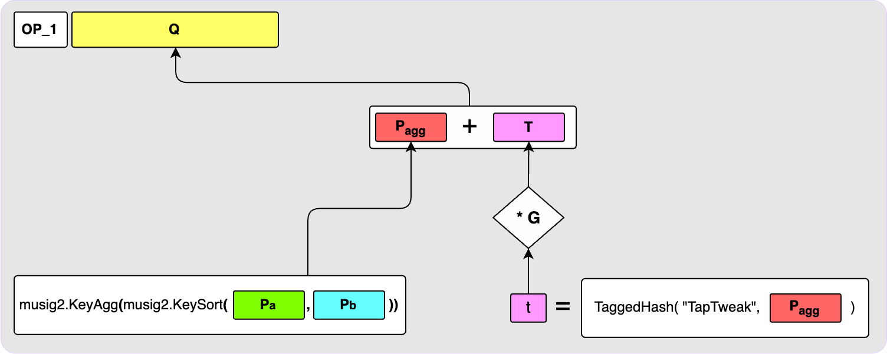
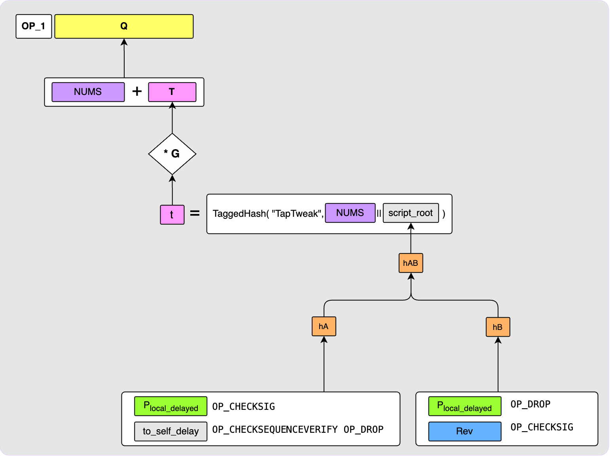
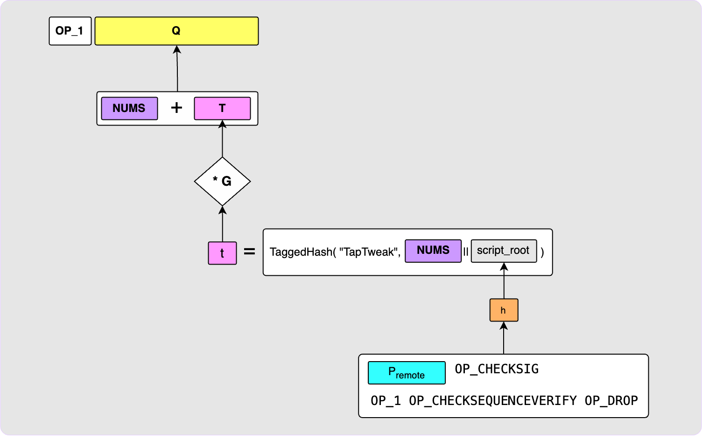
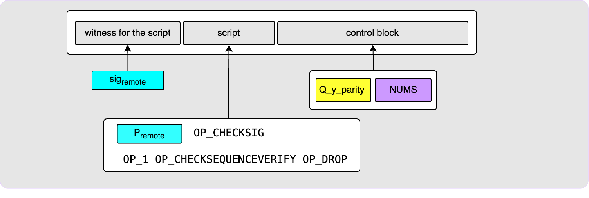
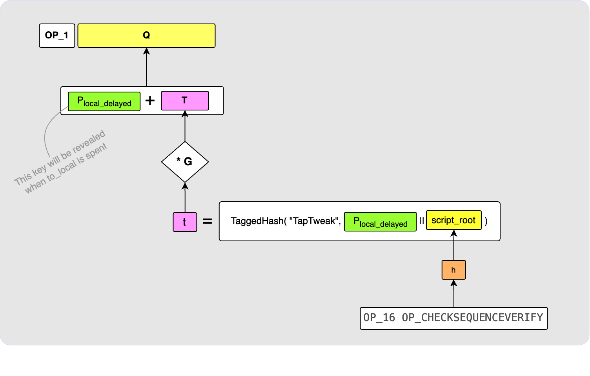
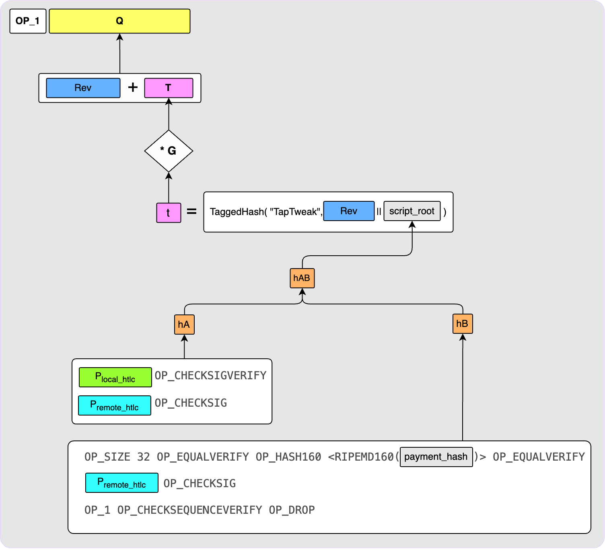
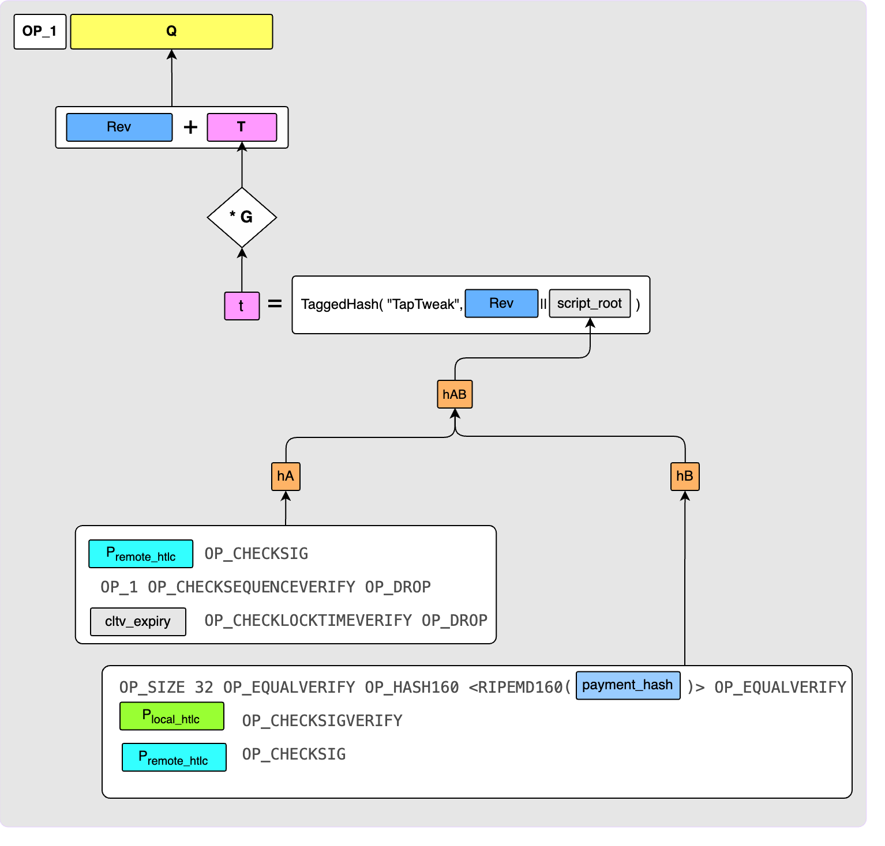
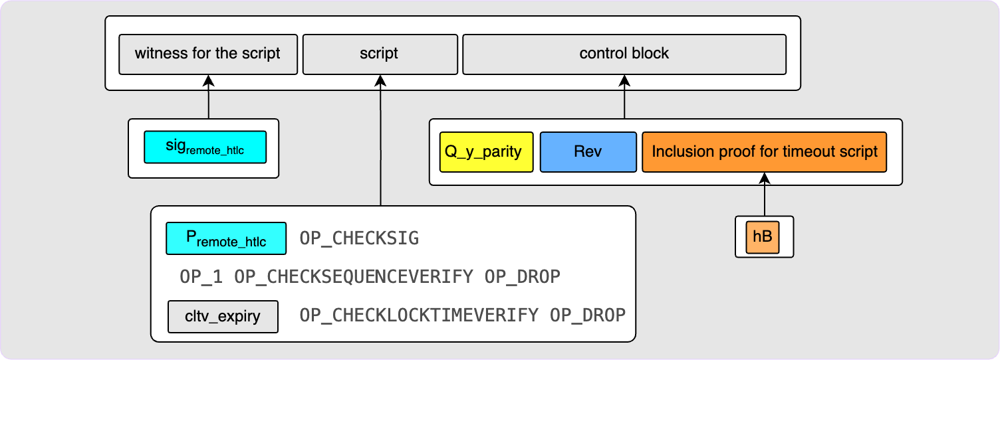

> *作者：Elle Mouton*
> 
> *来源：<https://ellemouton.com/posts/taproot-chan-txs/>*

兄弟，不要泄气，终点就在眼前。

## 概述

在本文中，我会探究基于 Taproot 的闪电通道（下文简称 “Taproot 通道”）的注资交易和承诺交易的结构。如果你错过了我的[上一篇文章](https://ellemouton.com/posts/taproot-prelims)（关于 Taproot 和 MuSgi2）（[中文译本](https://www.btcstudy.org/2023/04/27/taproot-and-musig2-recap-by-elle-mouton/)），可能先读一下它会比较好，可以帮你先了解一下这篇文章需要用到的各种模块。如果你还需要回顾承诺交易的一般结构，请看[这篇文章](https://ellemouton.com/posts/htlc-deep-dive)，我在里面解释了承诺交易的各个输出为什么要有那样的脚本装置。

提醒一下，Taproot 通道依然在设计阶段，所以，在 Roasbeef 的[这份提议](https://github.com/lightning/bolts/pull/995)被合并之前，这篇文章还会继续更改，以跟上人们对提议作出的变更。甚至目前的提议中也还有几个悬而未决的问题，我会尝试在这里说明。

如果你以前读过我的文章，你应该已经注意到了，我喜欢画图。这篇文章是变本加厉了。为了帮助理解，这里的图例说明了每一种颜色一般来说代表了什么

- 译者注：绿色代表签名者公钥及其签名；蓝色代表通道对手的公钥和签名；紫色代表两者的局和公钥；粉色代表调整项；黄色代表输出公钥和输出公钥的签名；橙色是 TapTree 上的哈希值；灰色和白色没有特殊的含义 -

准备好了吗？跟我来！

## 注资交易的输出

注资交易的输出定义了通道的开启。在前 Taproot 通道中，这个输出会给一个 2-of-2 的多签名支付，意味着任何花费这个输出的交易（承诺交易以及关闭通道的交易）都必须得到通道双方的签名。因为输出是一个 P2SH 输出，一旦人们在链上使用它，其背后的 2-of-2 多签名脚本就会在见证脚本中揭晓，任何观察区块链的人都能清楚知道，这笔交易是为了关闭一条闪电通道。

在 Taproot 通道中，这个输出编程了一个 2-of-2 MuSig2 输出。从这个输出中花费的交易依然需要得到双方的签名，但是，这样的签名可以通过 MuSig2 协议聚合成一个签名。这意味着，在理想情况下、双方合作一起关闭通道时，其关闭通道的交易看起来将跟其它 P2TR 的密钥花费交易没有区别。这对于不对外公开的通道来说是极大的隐私性改进，因为不再有办法断定这是一条闪电通道，而它们也从未在闪电网络中通过 gossip 协议向外广告自身是一条通道。至于公开的通道，gossip 协议实际上需要重新设计，以支持新的通道类型；而现在人们正在争论，这个新的 gossip 协议是否应该显露出通道的注资交易。关于 Taproot 通道的 gossip 协议，我会另外写一篇文章。

下面这张图展示了一个 Taproot 通道的注资交易输出是如何构造的：

通道中的两方（称为 “己方” 和 “对手方”），使用 MuSig2 协议聚合他们俩各自的注资公钥 `P_a` 和 `P_b`、聚合成 `P_agg`；这个聚合公钥本身也作为 Taproot 输出的内部公钥。然后，这个内部公钥使用 BIP86 调整项来调整。你应该还记得，上一篇文章中我们讲到，BIP86 调整让通道的所有者可以向网络中的其它节点证明：这个注资交易输出没有隐藏的脚本路径。

## 花费注资交易

注资交易的输出只能通过密钥路径来花费。因为其内部公钥是一个使用 MuSig2 协议产生出来的聚合公钥，花费它就需要双方都给需要签名的消息创建一个签名碎片。然后，使用 MuSig2 的 `PartialSigAgg` 函数聚合这两个签名碎片；最后，使用调整项 `T` 来产生可以有效花费注资交易输出的签名。

注意，在前 Taproot 通道中，花费注资交易输出也需要两个签名，但这两个签名完全可以独立创建；在 Taproot 通道中，有效的签名是双方在交互中创建的。我会在下一篇文章中介绍这个交互流程的具体细节。

## 承诺交易的输出

一笔承诺交易可能有 6 种不同的输出：`to_local` 和 `to_remote` 输出、己方的锚点输出和对手的锚点输出，正在提供的 HTLC 输出和已被接受的 HTLC 输出。我们分别细说。

### `to_local` 输出

`to_local` 输出负责给自己支付通道余额。这个输出必须能够被对手随时撤销、仅能在 `to_self-delay` 个区块后自己才能从中花费。这个撤销密钥也用作这个 Taproot 输出的内部公钥；而带有时间锁的、给自己支付的脚本则放在 TapTree 。

**密钥路径花费**

这个输出的内部公钥就是撤销密钥，因此 *只能* 在跟这笔承诺交易相关的状态被撤销时才能被对手花费（关于撤销操作，更多细节见 [这里](https://ellemouton.com/posts/updating-state) 和 [这里](https://ellemouton.com/posts/revocation)）。因此，如果你自己尝试欺骗对手、发布旧的状态，对手就可以通过密钥路径（同时也是最高效的花费路径）拿走这个输出中的资金。

（译者注：这个撤销密钥是通过双方提供的公钥构造出来的，所以在己方提供秘密值（私钥）之后，对手方就能构造出整个密钥背后的私钥；也只有对手方能构造出来，己方是无法构造出来的，因为不知道对手的秘密值。）

**脚本路径花费**

如果这笔承诺交易最终被广播道了链上，并且是诚实的、强制关闭通道的行为，那么对手就不能通过撤销密钥来花费。在这种条件下，这个输出是可以被己方通过脚本路径来花费的（在得到 `to_self_delay` 个区块的确认之后）。下图展示了花费这个路径所需的见证脚本：

这包含了一个对 `local_delayed` 脚本有效的见证数据，也就是来自己方的公钥 `P_local_delayed` 的一个有效签名。这个脚本自身也必须被公开，而且最后，控制块也必须展现出来。在这个案例中，控制块只包含 `to_local` 输出的输出公钥的奇偶位校验以及内部公钥。注意，这里的控制块不需要包含证据，因为这棵 Taproot 脚本树上只有一个脚本，意思是脚本数的根植可以从 `local_delayed` 脚本直接计算出来。

### `to_remote` 输出

这个输出给远程方支付通道的余额。因为在所有锚点通道中，任何非锚点的输出都需要至少长达 1 个区块的 CSV（相对时间锁），这样才能保证不打破 [CPFP carve out](https://bitcoinops.org/en/topics/cpfp-carve-out/) 规则。因此，远程方也只能在这个输出获得 1 个区块的确认之后才能花费这笔资金。这种要求只能通过一个脚本来实现，所以这个输出也要用到 Taproot 脚本树。

你可能会认为这张图有一个错误：我在前面说过，我们需要在这里执行一个 CSV，但这个脚本中没有 `OP_1` 来表示时间锁的长度。事实上，这不是一个错误，而是一个很酷的脚本编程技巧！如果 `<remotepubkey> OP_CHECKSIG` 检查失败了，那么这个脚本立即就会退出。但是，如果它通过了，它会给堆栈推入一个 `OP_1`，让我们的 CSV 得到时间锁的长度。不过，若是为了清晰好读，这样的技巧可以用更明显的 `OP_1 OP_CHECKSEQUENCEVERIFY` 来替代。

此刻，你可能还关心这个内部公钥。我们只需要为这个输出设置一个花费路径，但不幸的是，这个路径我们只能放到脚本树中。而且，我们还必须设置一个内部公钥，即使我们并不希望任何人能够有用这个密钥路径来花费它。从图中你可以看出，当前的提议使用跟注资交易输出相同的聚合公钥作为 `to_remote` 输出的内部公钥。这里的想法是，如果拿 `P_agg` 作为内部公钥，我们就知道它需要双方的合作才能使用密钥路径，但他们是完全没有理由要这样做的。实际上就是取消了密钥路径。

一些[审核者](https://github.com/lightningnetwork/lnd/pull/7333#discussion_r1082384984)注意到，使用 `P_agg` 作为内部公钥让对手方的资金几乎不可能复原：如果他们弄丢了所有的通道数据、所有的通道备份、只剩下自己的种子词；在传统的通道中，弄丢了通道数据的对手方依然可以扫描区块链、寻找属于他们的 `to_remote` 输出，因为他们知道推导出这些公钥的推导路径；如果在 Taproot 通道中使用 `P_agg` 作为内部公钥，因为对手方自己不可能推导出它，所以也就无法通过扫描区块链来找回自己的资金。之前，有人提议不使用 `P_agg`，而使用一个公开的 “NUMS（此中无后门）” 点（即没有人知晓其私钥的公钥），那么对手方就可以重新获得扫描属于自己的 `to_remote` 输出的能力。

**脚本路径花费**

当这笔承诺交易获得一次区块确认之后，对手方就可以通过脚本路径来花费这个输出：

### 对手方锚点输出

这是一种输出，让对手方可以使用 CPFP（“子为父偿”）来为这笔承诺交易追加手续费。对手方的公钥在这里用作内部公钥。为了保证这个输出（只有 330 聪的非常小的输出）会在一段时间后从 UTXO 集中清除，另一个路径被添加到了其中，使得任何人都能在这个输出获得 16 个区块的确认之后花费它。这个额外的路径添加到了脚本树中。

**密钥路径花费**

通过密钥路径来花费这个输出只需要来自对手方的签名；需要用 TapTweak 调整过。

**脚本路径花费**

在这个输出获得 16 个区块的确认之后，这就变成了一个赛跑。任何人都能花费这个输出，只要 TA 能创建出这个脚本：

注意到什么了吗？如果你是一个第三方，尝试从一些已经过时的锚点输出中得到一些免费的聪，你能复原出这个脚本吗？答案是：可以，但你要知道 `P_remote` 是什么才行！在继续往下读之前，我建议你花点时间来想想为什么你可能知道这个 `P_remote`。它不是在注资交易中表现出来e，也不是在承诺交易中表现出来的。浏览上文的图表，看看你在哪里能找到它。

准备好了吗？没错，只要 `to_remote` 输出被花费了，它就会出现在见证脚本中。这意味着，任何人都能在这个输出得到 16 个区块的确认且 `to_remote` 被花费之后，花费这个锚点输出。

### 己方锚点输出

这个输出是为了让你自己可以使用 CPFP 方法为承诺交易追加手续费。跟对手方的锚点输出一样，在 16 个区块以后，任何人都可以花费它。所以，其内部公钥是 `P_local_delayed`，而 “任何人都可以在 16 个区块后花费” 的脚本放在脚本树上。

**密钥路径花费**

通过密钥路径来花费这个输出只需己方提供用 TapTweak 调整后的签名。

**脚本路径花费**

就像对手方的锚点输出，想要通过脚本路径来花费它，需要你先揭晓 `P_local_delayed` 公钥。这个公钥会在你使用脚本路径来花费 `to_local` 输出时曝光。

不过，`to_local` 和 `to_remote` 输出有一个非常重要的区别：`to_remote` 只能被脚本路径花费，因此 `P_remote` 一定会在它花费时被公开；而 `to_local` 输出有两种花费路径！理想情况下，它会被脚本路径花费，从而让 `P_local_delayed` 揭晓，这就没有问题；但在糟糕的情况下，`to_local` 会通过撤销密钥来花费，这时候 `P_local_delayed` 就不会公开。这时候，只有这条通道的两个参与者才知道花费这个 local 锚点所需的信息。

人们正在提议的一种替代办法是改变 `to_local` 输出，使得 `P_local_delayed` 被强制公开，无论 `to_local` 怎么花费。这可以通过将密钥路径改成一个 NUMS 点、将撤销路径放进脚本树里面、在撤销脚本中嵌入 `P_local_delayed` 来实现。缺点在于，这会增加 `to_local` 输出的两条路径的花费成本。问题在于我们想在多大程度上解决这种非常罕见的情况。

### 付出 HTLC 的输出

付出 HTLC 的输出是支付给对手方的，如果他们能够在特定的 CLTV（绝对时间锁）超时之前给出某个哈希值的原像，就可以得到支付。而在超时之后，己方就可以通过 “HTLC 超时交易”（详情见下文）拿回这个输出中的资金。如果这笔承诺交易已被撤销，那对手方应该能随时拿走这个输出中的资金。

**密钥路径花费**

这个输出的内部密钥被设为撤销密钥，因此只能在这笔承诺交易已被撤销、但又被广播到链上时才能花费。在这种情况下，对手方可以用下列签名来花费这个输出：

**脚本路径花费**

另外两条花费路径，成功揭晓和超时回收，是放在脚本树中的；使用这两条路径都需要提供有效的见证数据、脚本自身以及控制块，这一次我们需要提供一个包含证据，因为树上有不止一个脚本。

- 成功揭晓

对方成功揭晓秘密值，可提供下列见证脚本来花费这个输出：

- 超时回收

如果超时，己方需要通过下列见证脚本来回收输出中的资金。这笔交易就是所谓的 “HTLC 超时交易”，更多细节将在后文揭晓。如果你想回顾为什么需要两阶段的 HTLC 交易，请看[这篇文章](https://ellemouton.com/posts/htlc-deep-dive)。

### 得到 HTLC 输出

得到 HTLC 的输出会给己方支付，如果己方能够提供某个支付哈希值的原像的话。否则，在一段时间（`cltv_expiry` 之后），对手方就可以通过超时回收分支回收资金。如果这笔承诺交易是一个已经撤销的状态，那么对方应该能随时拿走这个输出中的价值。

**密钥路径花费**

这个输出的内部公钥是撤销公钥，仅在这笔承诺交易已经撤销但又被广播到区块链上时才能被对手方使用。在这种情况下，对手可以通过下列签名来拿走输出种的资金：

**脚本路径花费**

另外两条花费路径，成功揭晓和超时回收，是放在脚本树中的；使用这两条路径都需要提供有效的见证数据、脚本自身以及控制块，这一次我们需要提供一个包含证据，因为树上有不止一个脚本。

- 成功揭晓

如果己方知晓原像，需要通过下列见证脚本来花费这个输出：

- 超时回收

如果对方在时间锁超时后想要回收资金，则需要通过下列见证脚本来花费这个输出：

### HTLC 的超时和成功交易

HTLC 超时交易和 HTCL 成功交易看起来非常相似，所以我们用一张图来讲解：

HTLC 成功交易和 HTLC 超时交易的第一个区别在于它们所花费的输入不同，因此，所需的见证脚本也不一样。HTLC 超时交易花费的是 “付出 HTLC” 输出的超时分支，而 HTLC 成功交易花费的是 “得到 HTLC” 输出的成功分支。另一个区别是 `时间锁`：HTLC 超时交易有一个 `cltv_expiry` 的 `Locktime`，但 HTLC 成功交易的 `Locktime` 为零。

HLTC 成功交易和 HTLC 超时交易的输出是一样的：如果相关的承诺交易已经撤销，则这些输出都是可以被对手方立即用撤销路径来花费的输出。否则，是己方可以在 `to_self_delay` 个区块确认后花费的输出。

其密钥路径和脚本路径跟 `to_local` 输出都是一样的。

## 总结

如果你读完了全篇，恭喜恭喜！你应该已经对 Taproot 通道的承诺交易的结构有了坚实的理解。我的下一篇文章将介绍为支持 MuSig2 签名而设计的多种通道对等节点消息。我预计文章会短一些、容易一些。

跟往常一样，有任何的问题、评论和纠正，都可以在留在评论区！

（完）