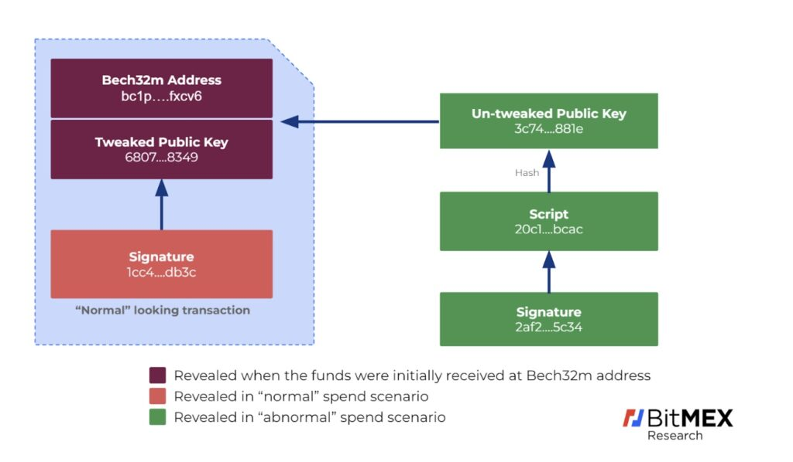
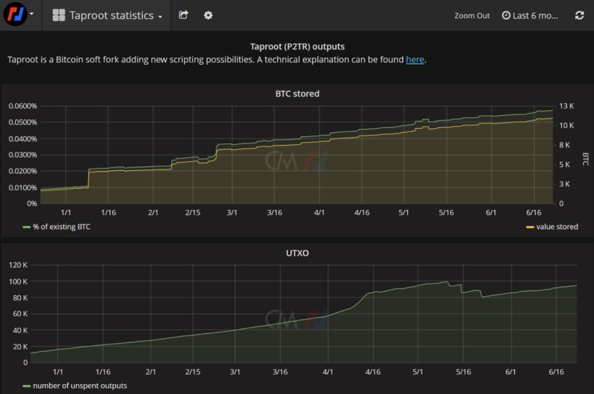
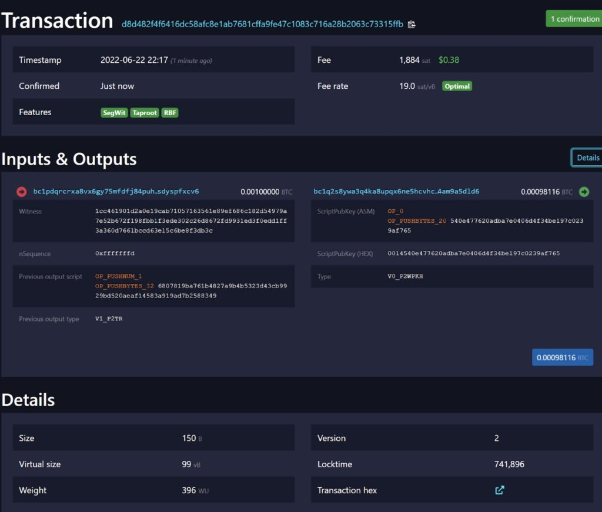
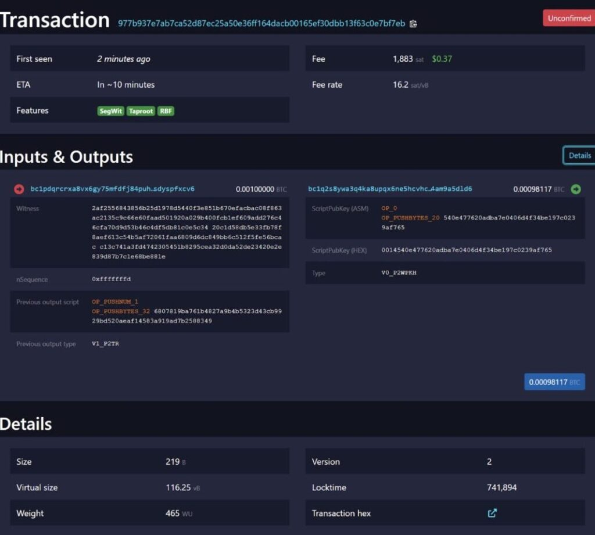
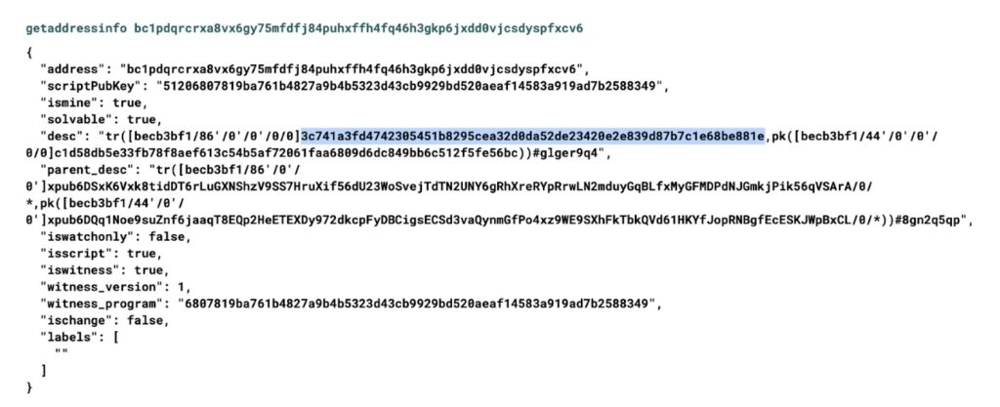

> *作者：BitMEX Research*
> 
> *来源：<https://blog.bitmex.com/taproot-demonstration/>*


**摘要**：本文将继续介绍 Taproot。我们以比特币主网上的两个 Taproot 交易为例解释了 Taproot 的运作机制，包括如何通过两种不同的方式将比特币发送至同一个地址：（1）使用 Schnorr 签名；（2）使用 Tapleaf 和所谓的未调整的公钥。



## 概述

Taproot 是（通过软分叉激活的）比特币协议升级，我们最早在[ 2019 年 5 月](https://blog.bitmex.com/the-schnorr-signature-taproot-softfork-proposal/)就介绍过。Taproot 在区块高度 709632（2021 年 11 月 14 日）完成激活。自激活以来，Taproot 的采用率一直很低。据 TXStats.com（由 BitMEX Research 和 CoinMetrics 网站联合推出）的数据显示，只有 0.05% 左右的比特币存储在 Taproot 输出中。尽管单看采用率很低，但是使用量一直在稳步增长。这种渐进式采用率增长与之前的软分叉升级（例如 SegWit）如出一辙，而且符合开发者社区中很多人对于新功能激活的期望：缓慢、平滑、渐进、平和的采用。



<p style="text-align:center">- 来源：<a href="https://txstats.com/dashboard/db/taproot-statistics?orgId=1">TXStats.com</a> -</p>


## Taproot 使用示例

我们决定尝试在最新版本的 Bitcoin Core（[23.0](https://bitcoincore.org/en/download/)）中使用 Taproot。我们不只想尝试 Taproot 的最基础用法（使用 Schnorr 签名），还想展示 Taproot 的主要创新功能，即，使用 Tapleaf 方法赎回比特币。这个流程做起来比我们预想的要更难，而且需要耗费几个小时，但最终我们还是成功了。以下是整个流程的分步拆解：

### 生成 Taproot 地址和 Taproot 支出条件

第一步是生成一个钱包，可以使用 Bitcoin Core 的图形界面来完成。然后，我们前往控制台输入 RPC 命令。运行下方命令：

```bash
listdescriptors
```

然后，我们会看到一个包含 8 个 xpub 的列表。xpub 是分层确定性钱包的主公钥，可以用来生成一组公钥。除了 8 个 xpub 之外，这个列表还包含派生路径和其它用来表明每组公钥如何生成的详细信息。这个列表之所以包含 8 个 xpub，是因为 Bitcoin Core 支持 4 种分层确定性（HD）钱包方案，每个方案都有一个用于收款的版本和一个用于找零的版本。例如，公钥哈希（P2PKH）、见证公钥哈希（P2WPKH）和我们如今感兴趣的 Taproot（P2TR）。我们可以通过 tr() 找到用于 Taproot 的 xpub。本例中的 Taproot xpub 如下所示： 

```bash
tr([becb3bf1/86'/0'/0']xpub6DSxK6Vxk8tidDT6rLuGXNShzV9SS7HruXif56dU23WoSvejTdTN2UNY6gRhXreRYpRrwLN2mduyGqBLfxMyGFMDPdNJGmkjPik56qVSArA/0/*)

```

接下来我们还需要主私钥。运行下方命令就可以看到私钥：

```bash
listdescriptors true
```

与我们的 Taproot xpub 对应的主私钥如下所示：

```bash
tr(xprv9s21ZrQH143K2VuTba4fXmpA6yjZjaTGh5q2oaGerWMeCozTKAQXRQAkMEAYnKL8Bw6geeFW4EsLNaEYacbVWe6zB4MtnXSFmoAEMh6nSk8/86'/0'/0'/0/*)
```

为了使用通过 Tapleaf 实现的“高级”Taproot 支付功能，我们还需要获取另一对主 HD 密钥。我们使用了以下这对密钥：

```bash
[becb3bf1/44'/0'/0']xpub6DQq1Noe9suZnf6jaaqT8EQp2HeETEXDy972dkcpFyDBCigsECSd3vaQynmGfPo4xz9WE9SXhFkTbkQVd61HKYfJopRNBgfEcESKJWpBxCL/0/*
```

```bash
xprv9s21ZrQH143K2VuTba4fXmpA6yjZjaTGh5q2oaGerWMeCozTKAQXRQAkMEAYnKL8Bw6geeFW4EsLNaEYacbVWe6zB4MtnXSFmoAEMh6nSk8/44'/0'/0'/0/*
```

有了上述信息，我们可以使用两个 xpub 来生成 Taproot 支出条件和一个 Taproot 地址。生成方式具体如下所示： 

```
deriveaddresses "tr([becb3bf1/86'/0'/0']xpub6DSxK6Vxk8tidDT6rLuGXNShzV9SS7HruXif56dU23WoSvejTdTN2UNY6gRhXreRYpRrwLN2mduyGqBLfxMyGFMDPdNJGmkjPik56qVSArA/0/*,pk([becb3bf1/44'/0'/0']xpub6DQq1Noe9suZnf6jaaqT8EQp2HeETEXDy972dkcpFyDBCigsECSd3vaQynmGfPo4xz9WE9SXhFkTbkQVd61HKYfJopRNBgfEcESKJWpBxCL/0/*))#8gn2q5qp" "[0,1]"
```

生成的 Bech32m 地址如下所示：

[bc1pdqrcrxa8vx6gy75mfdfj84puhxffh4fq46h3gkp6jxdd0vjcsdyspfxcv6](https://mempool.space/address/bc1pdqrcrxa8vx6gy75mfdfj84puhxffh4fq46h3gkp6jxdd0vjcsdyspfxcv6)


### 从Taproot 地址支出比特币

别忘了，我们已经设置好了，有两种方式可以从 Taproot 地址赎回比特币。

1. 在“正常的”支出场景中，我们只需提供 Schnorr 签名
2. 在所谓的“非正常”支出场景中，我们需要提供未调整的公钥、赎回脚本，当然还有签名。

在我们的例子中，为避免过于复杂，我们的树上只有一个分支。为了测试比特币赎回，我们向我们的 Taproot 地址发送了 0.001 BTC。接着，为了控制比特币赎回，我们创建了一个新的 Bitoin Core 钱包。之后，我们为我们的第一个 Taproot xpub 导入私钥，再为第二对主 HD 密钥中的 xpub 导入私钥，如下所示。

**支出场景 1 —— “正常”支出场景 —— 导入密钥**

```bash
importdescriptors '[{ "desc": "tr(xprv9s21ZrQH143K2VuTba4fXmpA6yjZjaTGh5q2oaGerWMeCozTKAQXRQAkMEAYnKL8Bw6geeFW4EsLNaEYacbVWe6zB4MtnXSFmoAEMh6nSk8/86h/0h/0h/0/*,pk([becb3bf1/44h/0h/0h]xpub6DQq1Noe9suZnf6jaaqT8EQp2HeETEXDy972dkcpFyDBCigsECSd3vaQynmGfPo4xz9WE9SXhFkTbkQVd61HKYfJopRNBgfEcESKJWpBxCL/0/*))#z6cqpzlk", "timestamp":1655925204, "internal": false, "active": true, "range": [0,2] }]'
```

将这些详细信息导入 Bitcoin Core 钱包不仅具有挑战性，还容易让人困惑。另外，支出条件越复杂，难度越高。[Miniscript ](https://bitcoin.sipa.be/miniscript/)有望解决这一问题，因为它可以将这些脚本编译成你所需的格式。

导入上述密钥和 Taproot 方案后，我们会在 Bitcoin Core GUI 中看到转入的 0.001 BTC（需要重启）。然后，我们就可以使用 GUI 和上述交易信息来花费这笔比特币。

**正常支出场景**



<p style="text-align:center">- 来源：https://mempool.space/tx/d8d482f4f6416dc58afc8e1ab7681cffa9fe47c1083c716a28b2063c73315ffb  -</p>


交易见证约为 64 字节大小，其实就是 Schnorr 签名。构建这笔支出交易不需要其它信息。我们还可以看到“调整后的”公钥，开头是 6807....

等到这笔比特币花费出去后，我们再发送 0.001 BTC 到同一个[地址](https://mempool.space/address/bc1pdqrcrxa8vx6gy75mfdfj84puhxffh4fq46h3gkp6jxdd0vjcsdyspfxcv6)上。然后我们另外创建一个空的 Bitcoin Core 钱包，再使用同一个 RPC 命令导入另一组密钥。现在，我们来尝试另一种赎回方法。我们先导入第一个 Taproot 主密钥对中的 xpub，再导入第二个密钥对的私钥，如下所示：

**支出场景 2 - “非正常”支出**

```bash
importdescriptors '[{ "desc": "tr([becb3bf1/86h/0h/0h]xpub6DSxK6Vxk8tidDT6rLuGXNShzV9SS7HruXif56dU23WoSvejTdTN2UNY6gRhXreRYpRrwLN2mduyGqBLfxMyGFMDPdNJGmkjPik56qVSArA/0/*,pk(xprv9s21ZrQH143K2VuTba4fXmpA6yjZjaTGh5q2oaGerWMeCozTKAQXRQAkMEAYnKL8Bw6geeFW4EsLNaEYacbVWe6zB4MtnXSFmoAEMh6nSk8/44h/0h/0h/0/*))#4erxc8tf", "timestamp":1655925204, "internal": false, "active": true, "range": [0,2] }]'
```

现在，我们可以看到 0.001 BTC 入账，还能花费它，但这次用的是 Tapleaf 方法。



<p style="text-align:center">- 来源：https://mempool.space/tx/977b937e7ab7ca52d87ec25a50e36ff164dacb00165ef30dbb13f63c0e7bf7eb  -</p>


这笔交易比起前一笔交易更大也更复杂。其见证包含三个要素：

|              |                                                              |
| ------------ | ------------------------------------------------------------ |
| 签名         | 2af2556843856b25d1978d5440f3e851b670efacbac08f863ac2135c9c66e60faad501920a029b400fcb1ef609add276c46cfa70d9d53b46c4df5db81c0e5c34 |
| 脚本         | 20c1d58db5e33fb78f8aef613c54b5af72061faa6809d6dc849bb6c512f5fe56bcac |
| 未调整的公钥 | c13c741a3fd4742305451b8295cea32d0da52de23420e2e839d87b7c1e68be881e |


我们可以在有两个相关 xpub 可用的钱包中使用 Bitcoin Core 中的 getaddressinfo 调用来验证已调整和未调整的公钥，如下图所示。已修改的公钥叫作“scriptPubKey”，未调整的公钥位于“desc”字段。



<p style="text-align:center">- 来源：Bitcoin Core -</p>


## 支出条件概要

下图反映了上文列举的两例 Taproot 支出交易。左边是“正常”支出，右边是使用 Tapleaf 和未调整的公钥的支出。


## 结论

鉴于上述流程较为复杂，还有潜在风险，我们暂不建议使用 Tapleaf 方法，除非你是专业的钱包开发者。但是，上述交易示例或许能够增进你对 Taproot 的理解，帮助你想象如何将 Taproot 与闪电网络或其它钱包系统结合起来发挥作用。

感谢 [Sjors Provoost](https://blog.bitmex.com/sjors-provoost/) 对本文的贡献。 

（完）