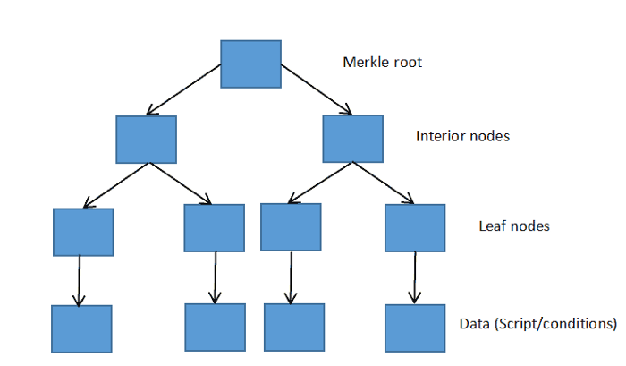
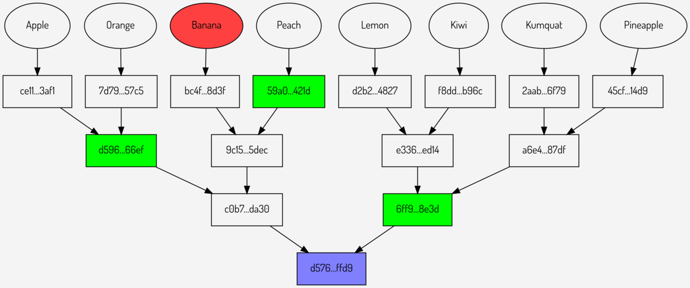

> *作者：Anony*

*文章题目来自 Bitcoiner 熊越。*

*标题图片来自 [SatoshiLabs](https://blog.trezor.io/how-taproot-will-benefit-hardware-wallets-fa43c0b6123e)*。

比特币的 Taproot 软分叉升级将于比特币区块高度 709632 处（预计是 2021 年 11 月 15 日）激活。此次升级包含了许多重要而精彩的内容，然而，在中文世界里却缺乏足够的重视。本文将从技术角度简要介绍 Taproot 的升级内容，并以此体现比特币的发展方向。

常见的说法是，Taproot 提升了比特币的隐私性、智能合约功能性、同质性，云云。但是，要想理解 Taproot 升级的内容和想象空间，我们得先了解一些比特币。

## 比特币上的智能合约

许多人不了解的是，比特币也支持编程智能合约 [2](#note)，只不过其智能合约的类型与其他区块链（比如以太坊）的不同。详细解释这种区别需要专门的一篇文章，这种区别在这篇文章里也不重要。这里仅仅介绍比特币智能合约编程的几个常见的模块 [3](#note)，方便大家理解其应用场景：

- **多签名合约**。比特币支持多签名授权使用资金：在 N 个记录好的公钥中，必须有 M 个公钥所对应的私钥（对同一个操作的）签名，该笔资金才可动用。比特币支持最多 15 个公钥的多签名合约。
- **时间锁**。用户可以使用两种类型的时间锁来规定一笔资金的可用时段：（1）CLTV，绝对时间锁，以具体的时间或具体的区块高度来定义，过了这个时间才可动用；（2）CSV，相对时间锁，比如生成该项资金的交易上链的 1000 个区块后，该笔资金才可动用。
- **多条件编程**。即在脚本中使用 “IF ... ELSE ...” 式的语句，为同一笔资金设定多个解锁条件，任一条件满足即可使用该资金。比如：“A 公钥所对应的私钥可解锁，或者，在区块高度 XXXX 以后，B 公钥所对应的私钥可以解锁，或者，在该交易上链的 YYYY 个区块以后，A、B、C 三个公钥中任意两个所对应的私钥可以解锁”

如读者可以想象的，这几个模块看起来非常简单，组合起来可能性却非常多：多签名合约定义了不同主体的权限，可以适应极为丰富的应用场景，从公司运营，到家庭金库；时间锁则规定了不同主体在不同时段的权限。而多条件则显著放大了这些权限控制的组合效果。

你甚至仅凭几个条件，就可以做出一个支持社交恢复、带遗产分配效果的合约：“我（A 公钥）可以控制这笔资金；如三个月无人动用，我（B 公钥）和四个朋友，五取其三可以一起控制这笔资金；如果一年无人动用，我的妻子可以控制这笔资金”。

但是，这些合约要实际上派上用场，两个因素就不能忽视：效率性和隐私性。

效率性的意思是，比特币交易的手续费是根据交易的体积来计算的，更多条件的脚本会占用更大的空间（以字节数计），交易费也会更高。

隐私性的考量是，脚本曝光会使其他人知道某些公钥之间是有身份关联的，更容易分析出公钥主人的真实身份。

在当前，比特币的合约体现为 P2SH “地址”（实际上就是一条哈希值）。其特点是，在生成合约时，脚本可以不公开，有需要的直接给脚本的哈希值支付；但是，这些资金在花费时，与这个哈希值对应的脚本就要完全公开出来放到交易中（否则无以验证这个脚本的哈希值正是这个哈希值）。以多签名合约为例，其他人可以直接给这个多签名合约脚本的哈希值支付，但是，当多签名合约的参与者要使用这些资金时，就必须把整个脚本公开 [3](#note)。

此外，在 SegWit 升级以前，单签名的个人钱包与合约钱包是泾渭分明的，前者是 P2PKH 地址，后者是 P2SH 地址，仅从地址上就可以看出来，这又是一个对隐私不利的因素。在 SegWit 升级之后，支持隔离见证的个人钱包也可采取 P2SH 的形式，但原生隔离见证地址（P2WPKH）和合约地址（P2WSH）仍然是泾渭分明的 [4](#note)。

了解了这些以后，让我们来看看 Taproot 升级的三大部分（MAST、Schnorr 签名、Taproot）如何做得更好。

## 默克尔抽象语法树（MAST）

默克尔化抽象语法树（Merklized Abstract Syntax Trees, MAST）[5](#note) 的含义是，在比特币的脚本验证中支持验证默克尔证据。

默克尔树是将多个数据元素哈希成一个哈希值的密码学方法。其结构和哈希函数的特点决定了，可以提供一些证据（哈希值）来证明，某个数据元素参与生成了这个哈希值。如下图所示：我们将（相邻的）数据元素两两不断哈希，最终生成一个默克尔根。

- <a href="https://www.btcstudy.org/2021/09/29/bitcoin-taproot-a-technical-explanation/">来源</a> -

同理，如下图，当我要证明红色数据 “Banana” 参与生成了紫色的哈希值（默克尔根）时，我只需提供红色数据和三个绿色的哈希值就可以了，无需曝光实际上共同生成了默克尔根的其余 7 个元素。这就是默克尔树和默克尔证据的作用。

- <a href="https://www.wealdtech.com/articles/understanding-sparse-merkle-multiproofs/">来源</a> -

聪明的读者一定想到了，有了这个功能，合约的编写者就可以把多个条件划为不同的数据元素，哈希出一个默克尔根值来；在需要以某个条件来解锁比特币时，只需证明这个条件在这棵默克尔树上即可，无需公开所有其他条件。

没错，这正是 MAST 的妙用。如下图所示，这笔资金的解锁条件有两个，而编写者把它们分割了开来，用默克尔树抽象成了一个哈希值，在以任一个条件解锁使用时，都不需要公开另一个。

- <a href="https://www.btcstudy.org/2021/09/07/what-is-a-bitcoin-merklized-abstract-syntax-tree-mast/">来源</a> -

MAST 在 P2SH 的基础上迈出了一大步，其提升效果首先体现在隐私性上：原本在 P2SH 中，合约在使用时就一定要公开全部的脚本内容，不论那些内容用到没用到，都必须公开；现在，有了 MAST，用户就只需要公开需要用到的解锁条件，无需公开全部内容了；同时，别人也根本不知道你还有多少个条件。

其次，它还在效率上有所提升：用户只需提供需要用到的部分脚本，及其默克尔证据，在整个脚本比较庞大时，这种体积节约的效果会非常明显。

由此，未来的比特币用户可以编写条件非常多的合约，获得更好的控制效果而只需支付更少的手续费；甚至，可以有意包含一些垃圾条件来充实默克尔树，获得隐私提升的效果。

这也是本篇副标题 “哈希即银行” 的由来：比特币的脚本实际上全部围绕着资金的控制，实现这种控制的关键一环正是多条件，而有了 MAST，即使是极多条件的资产管理脚本，也可以压缩成一个哈希值，在使用时仅需暴露一部分。成本的降低可以打开非常多的可能性，等待钱包开发者去一探究竟。

## Schnorr 签名

Taproot 升级之后，比特币将不仅支持基于椭圆曲线的密码学签名，还支持 Schnorr 数字签名方案 [6](#note)。

Schnorr 签名的构造方法在此不提，我们仅介绍其重要属性：签名/密钥 聚合 —— 多个私钥的签名，可以聚合成一个签名，看起来仿佛是一把私钥签出的。签名时，仍然是各私钥持有者各自签名的；验签时，却仿佛这些签名是一把对应于已知公钥（当然就是这些参与者的公钥聚合而成的公钥）的私钥签出的。 

也就是说，有了 Schnorr 签名，其他人就无法分辨一个签名到底是单人签出的，还是多人共同签出的了；多签名的解锁条件，可以用一个聚合公钥来替代。所有 n-n 的多签名合约，都可以享受到 Schnorr 签名提供的隐私保护。其最显然的应用就是闪电网络通道，因为闪电网络通道是一个 2-2 的多签名合约；此后，其他人就无法凭借签名的数量来分辨支付通道和个人用户了。

至于 m-n 的多签名合约，也不用担心，别忘了我们有 MAST：我们可以把所有可能解锁的情形都化成一个分支，在使用某个分支时，所提供的签名也只需是聚合签名。例如，假设我们要做一个 2-3 的多签名合约，在公钥 A、B、C 中三取其二，这个多签名合约效果等同于 “要么（A、B）解锁、要么（B、C）解锁、要么（A、C）解锁”，这可以理解为一个多条件的脚本，每个条件都是一个 2-2 多签名，因此也都可以用相应的聚合公钥来定义解锁条件（而无需以多签名来定义）。所以，当我们需要以某种组合解锁资金时，只需用 MAST 暴露一个分支、提供一个签名，他人依然不知道这到底是一个人，还是两个人，还是多个人。

还没完呢。

## Taproot

按我们这种理解的路径，Taproot 升级的最后一个部分就是 Taproot，是其名字的由来。在提出这个概念时，Gregory Maxwell 写道 [7](#note)：

> 在讨论默克尔化脚本时，一个大家常常提起的问题是，我们能否实现一种精巧的合约，使其与最常见、最无聊的支付没有分别。不然的话，使用这些时髦技术的输出的匿名集，也就是另一个小众集合而已，在实践中没有多大的意义。

在这里，Maxwell 敏锐地抓住了问题的要点：比特币的隐私保障来自于 “大隐隐于市”，最好所有的资金单元（UTXO）看起来都一个样，这样用户的真实身份、真实构成才最难把握。但是，在引入新的功能时，总免不了要提出新的 “地址” 类型，如果使用这种功能的用户很少，则每一个用户暴露真实身份的可能性都会大大增加，而这一点可能导致这些新功能根本不会被使用，从而失去意义。

而且，尽管 MAST 在合约的隐私性上有重大作用，但如果还像过去那样，个人钱包是个人钱包，合约钱包是合约钱包，一目了然的话，就不能不说，这样的隐私性仍然是有瑕疵的。

人们亟需一种办法，来终结这种 个人钱包/合约钱包 的区分，为比特币的隐私性补上点睛之笔。为此，最起码要实现的一点是，这种带有合约的钱包，在用户个人日常使用中，其代价与普通的个人钱包没有区别（经济性）。

Taproot 就是这样的一种办法，它利用了密钥聚合的特点，提出了自带两种使用路径的脚本模式：一种是 n-n 的多签名合约；另一种是用户自定义的合约脚本。

> 沿用 Maxwell 原文中的例子：
>
> 假设两个用户各有公钥 A、B，两人聚合公钥 A + B = C，再生成最终公钥 P = C + H(C||S)*G，其中 S 为自定义的脚本。就以这个最终公钥 P 来定义资金的解锁条件。
>
> 假设两个用户都在线，他们很容易可以共同使用这笔资金，只要其中一方在签名时在自己的私钥里加上 H(C||S) 即可；
>
> 如果只有其中一方在线，比如 S 定义了 B 可以花费资金的条件，Taproot 的规则使得公钥 B 用户可通过揭示聚合公钥 P 以及 H(C||S) 并提供可以满足 S 的条件来使用资金。

这里用的是 2-2 多签名合约，但用户可以想到，只要密钥聚合的技术可用，1-1 也就是单签名同样可以利用这种编写脚本的办法。重要的是：（1）尽管这是一个带有自定义合约的资金，但在不动用合约、仅使用 n-n 多签名时，其手续费成本与单签名解锁的资金没有区别！（2）在 n-n 多签名使用时，他人完全不知道这笔资金还可以用其他方式来解锁使用！

这样一来，个人用户和合约用户都可以统一在一种脚本模式（P2TR “地址”）下，个人用户放心给自己的资金加上合约，无需担心日常会付出更高的手续费代价；合约用户与个人用户因为使用同一种 “地址” 而享受到更大的匿名集，甚至于在大部分情况下都无需暴露自己使用了合约。皆大欢喜。

总而言之，在 Taproot 之后，他人将无法从地址形式上分辨一个 P2TR 地址到底是个人用户还是合约用户；由于 Schnorr 签名的效果，当这个地址里的资金使用单签名来解锁时，他人将无法分辨这到底是一个人在使用，还是 n 个人一起使用，也无法知道这个地址是否还有自定义的脚本；由于 MAST 的效果，当用户使用自定义的脚本来花费资金时，只需暴露需要用到的部分脚本；他人虽然知道了这个地址有自定义的脚本，但整个脚本到底包括哪些条件，仍然是不可知的。

因此，尽管有人质疑 Taproot 可能反过来给比特币的隐私性带来损害 [7](#note)，但我完全不这么担心。因为 Taproot “地址” 在便利性、隐私性、经济性上，都已毫无疑问是比特币史上最佳，它完全有希望可以统一比特币的 “地址” 类型，形成比特币有史以来最大的匿名集。

## 结语

对于了解一些密码学技术的人来说，学习比特币的开发和升级是很愉快，乃至令人眼界大开的事。在其升级中，你可以看到人们孜孜不倦地使用密码学来不断优化这个系统 —— 得益于这个系统本身的模块化特性，这些优化都真实可感。Taproot 正是其中的代表。

我相信，学习比特币（尤其是 Taproot）的过程会告诉读者，什么才是真正的 “密码学货币”。

Taproot 可能是比特币历史上最重要的一次升级，将造就有史以来最纯粹的密码学货币 —— 将密码学利用到极致、最轻量、生命力最顽强的货币。

## 致谢

感谢 @hou123，@曾汨 对本文的富有教益的反馈。

<h3 id="note">脚注</h3>

1. 比特币升级提案 Taproot 技术解读，<https://www.btcstudy.org/2021/09/29/bitcoin-taproot-a-technical-explanation/>
2. Bitcoin Wiki·智能合约，<https://en.wikipedia.org/wiki/Smart_contract>
3. 精通比特币中译本·第七章：高级交易和脚本，<https://github.com/tianmingyun/MasterBitcoin2CN/blob/master/ch07.md>
4. Types of Bitcoin transactions - Part II Segwit，<https://blog.susanka.eu/types-of-bitcoin-transactions-part-ii-segwit/>
5. 什么是比特币默克尔化抽象语法树，<https://www.btcstudy.org/2021/09/07/what-is-a-bitcoin-merklized-abstract-syntax-tree-mast/>
6. Schnorr 签名如何提升比特币，<https://www.btcstudy.org/2021/09/09/how-schnorr-signatures-may-improve-bitcoin/>
7. Taproot: Privacy preserving switchable scripting，<https://lists.linuxfoundation.org/pipermail/bitcoin-dev/2018-January/015614.html>
8. 用大白话解释 Taproot 对隐私性的影响，<https://www.btcstudy.org/2021/09/23/explain-like-im-not-a-developer-taproot-privacy/>

