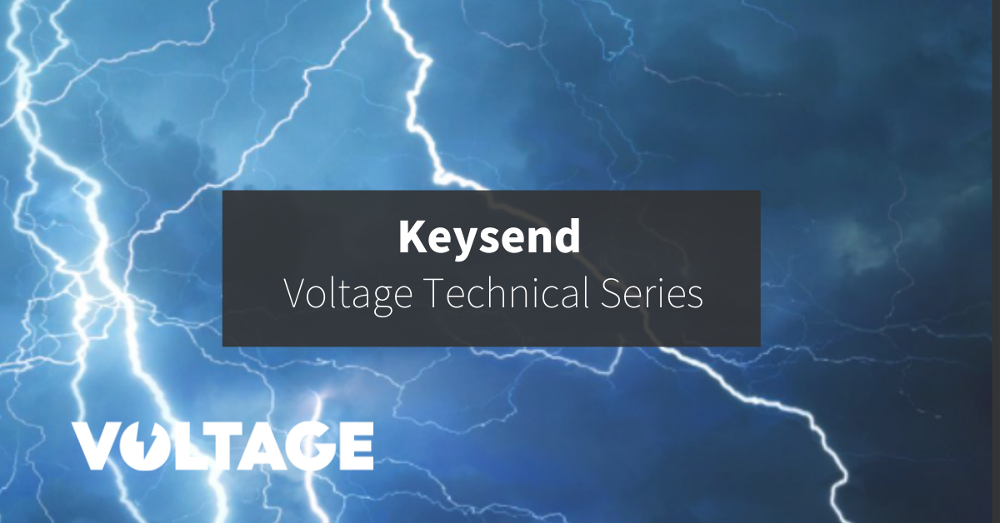
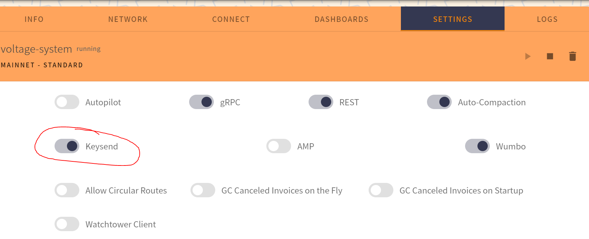
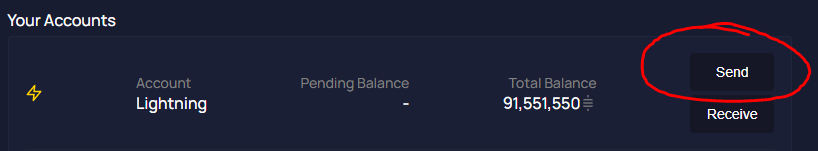
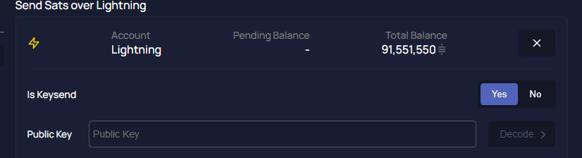
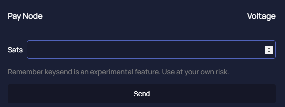

> *作者：Nate G*
> 
> *来源：<https://blog.voltage.cloud/technical-series-what-is-keysend/>*




各位好！这是 Technical 系列的第一篇文章，我非常高兴能够深入聊聊许多节点运营者和闪电网络用户都曾经听过、但不了解其含义和用途的一些话题。我们在这个系列中讨论的许多话题都不需要你运行一个闪电网络路由节点或用过闪电网络，但对于想一探究竟的读者，我相信你会在这里得到很多。本周我们来讨论 Keysend。

首先我们先讲一点背景知识。闪电网络的支付机制一直围绕着所谓的 “[BOLT 11](https://github.com/lightningnetwork/lightning-rfc/blob/master/11-payment-encoding.md)” 来开发，BOLT 11 详细描述了闪电网络发票（Lightning invoice）的技术特性。闪电网络用户在想要接收支付时，可创建一个 BOLT 11 型发票来表达自己的需要。

举个例子，如果我帮 Bob 清理了草坪，想让 Bob 用闪电网络给我支付，我需要创建一个发票并发给 Bob，既可以通过文字信息，也可以通过二维。

但是，如果 Bob 可以直接使用闪电网络给我支付，无需我先行创建一个发票呢？那他就只需知道我的公钥，就可以给我无限次支付了。这就是 “Keysend”。

## Keysend 还有别的用途吗？

大多数闪电网络实现（包括 LND 和 c-lightning）都实现了 Keysend。有了 Keysend，闪电网络的用户就更容易接受捐赠、报告收益，开发只适用于 Lightning 的 API 也更简单。进一步的创新有聊天（例如 [ Sphinx Chat](https://sphinx.chat/)）和川流式支付（如 [Podcasting 2.0](https://podcastindex.org/)、[Breez](https://breez.technology/)），也可以通过在封装支付信息的洋葱数据包中加入额外的信息来实现。

## Keysend 支付长什么样？

发送到闪电网络中的支付数据包含了必要的信息。这部分信息包括一个编码后的支付数额、一条消息和一个原像。在支付到达目的地、接收支付的节点接受该次支付后，原像公开，支付完成。Keysend 支付是端到端加密的，因此没有任何居中转发消息的节点能够完全解开数据包并揭示原像。只有最终的接收方有能力揭开原像。

## 数据是怎么发送的？

在基于发票的常规闪电网络支付中，接收方选择一个原像，然后使用密码学哈希算法得出该原像的哈希值，将该哈希值包含在发票中、交给支付者。在支付完成时，这个原像就充当了支付证明，因为发票是接收者签名过的。

而在 Keysend 支付中，支付者选出原像，然后使用洋葱消息封装它，然后路由给接收者。

洋葱封装后的数据沿着一条路径转播，但完整的路径对路径上任一转发该支付的节点都是不可知的。因为，数据是在沿着这个路径达到最终目的地的过程中，被路径上的一个一个节点逐步解封的（译者注：也即每一个节点都只能解封一层。这就是为什么它叫 “洋葱”）。

## 我如何接收 Keysend 支付？

如果你在使用 Voltage，请确保你在设置面板中打开了 “Keysend” 功能：



如果你在使用本地的 LND 节点，请确保在你的 .conf 配置文件中写入了下面一行：

```go
accept-keysend=1
```

这样做的时候，你是在表示愿意接受 Keysend 支付。

## 如何发送 Keysend 支付？

想要通过 Thunderhub 发送 Keysend 支付，请点击 “发送（Send）” 按钮：



确保打开了 “是否 Keysend（Is Keysend）” 的选项：



下一步，粘贴你的支付对象节点的公钥到 “公钥（Public Key）” 输入框中。你不需要填入完整的 URI 字符（不需要包含 “@” 和 “@” 之后的所有字符）。

点击 “解码（Decode）”。



输入你想发送的聪的数量，点击 “发送（send）”。当当的当，你已经发了一笔 Keysend 支付啦！

如果你在使用 [LNCLI](https://api.lightning.community/) 客户端，使用下列命令行来发送一笔 Keysend 支付：

```go
lncli sendpayment --dest=<pubkey of destionation> --amt=<amount in satoshis> --keysend
```

如果你成功了，你会看到一个 “Payment Successful” 的信息，以及原像。

如果你用的是的 [C-Lightning](https://lightning.readthedocs.io/) 客户端，你需要使用 *pay* RPC 命令下面的 *keysend* RPC 命名，带上接收方的公钥和你想发送的数额。想了解更多信息，你可以看这个[正式的文档](https://lightning.readthedocs.io/lightning-keysend.7.html)。

## Keysend 的缺点

### 没有支付证明

原像是随着支付一起发送的，但只有接收方可以知道。接收方后面可以使用这个被洋葱消息封装过的原像来结算支付。但因为这个原像是支付方选择的，所以支付者无法证明他们支付了什么，即时在支付完成之后也无法证明，因为没法获得新信息。

### 没有路由提示

使用 Keysend 时，你的支付可能会因为你不知道你的支付对象的通道而使用一条效率较低的路径。而且你始终有权拒绝支付。

### 增加了复杂性

闪电网络中没有强制性的共识机制。因为每一种实现都开发出了自己独特的功能，网络的复杂性会趋于增加。以这种视角来看，闪电网络变得越是复杂，越难以在所有实现中建立一个标准。

### 隐私性

在你看是接受 Keysend 之前，一个重要的问题是，你要想清楚，你是否希望整个世界知道你所有公开的通道和容量？你的公钥会暴露你和你的节点许多的信息，包括通道的总容量、你的对等节点、手续费率，等等。

虽然没人知道你的通道总容量中有多少属于你，你可能也不希望这些信息公开并与你直接关联起来。不过，普通的 BOLT 11 型发票也可以被解码来发现你的公钥。

## 结论

Keysend 让支付者可以自行指定支付的数额。不过，支付的接收者必须先手动打开这个功能。这是因为接收者也许不想要面临洪泛攻击的风险或不希望缺少收款证明。商家使用的节点可能没有充分的理由要启用 Keysend。不过，布道者或者开发者可能希望启用 Keysend 来接收广告支付或捐赠。

（完）


