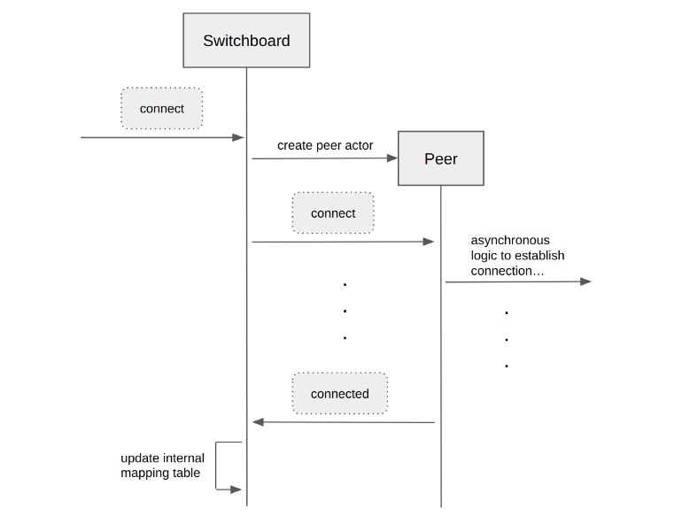
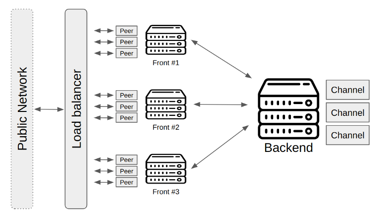

> *作者：ACINQ*
> 
> *来源：<https://medium.com/@ACINQ/the-architecture-behind-eclair-ca0c99880962>*


> 长话短说：eclair 客户端的架构基于 “Actor 模型”，让开发可靠且可扩展的软件变得更加简单。它支持着闪电网络中最大的节点，已经可靠地运行了接近 5 年。

## 一个网络，多种实现

闪电网络是一种去中心化的支付网络，围绕着一套共享的开源规范 —— [闪电网络 BOLT](https://github.com/lightning/bolts) —— 发展起来。

许多公司都对这套规范有所贡献，最积极的一些是 ACINQ、Blockstream、Lightning Labs 和 Spiral。改变规范需要花时间，也许多这许多团队的共识；这保证了被接受的特性都经过了彻底的审核，并且让闪电网络更高效、更安全，也更易于使用。

但是，规范只是一个起点：它需要被转化成实际上有用的软件。上面提到的四家公司都有自己的实现了 BOLT 的软件：[eclair](https://github.com/acinq/eclair) (ACINQ)、[cln](https://github.com/ElementsProject/lightning/) (Blockstream)、[lnd](https://github.com/lightningnetwork/lnd) (Lightning Labs) 和 [ldk](https://github.com/lightningdevkit/rust-lightning) (Spiral)。虽然每一种实现都有区别，但它们都遵循了同一种规范，而且是可以互通的，这也是为什么尽管节点们运行的软件各有不同，但我们能形成一个闪电网络。

每一种实现都有自己的优点和缺点，这对整个网络是好事：用户可以根据自己最适应的取舍、自己希望使用闪电网络的方式，选择合用的软件。在本文中，我们关注 eclair，这是当前闪电网络中最大的节点 ——  [ACINQ 节点](https://mempool.space/lightning/node/03864ef025fde8fb587d989186ce6a4a186895ee44a926bfc370e2c366597a3f8f) —— 所用的软件。我们的节点从 2018 年初开始就平滑地运行，开启了几千条通道、转发过无数的交易，并且通过流动性服务为非托管的移动钱包（曾用名 “eclair-mobile”，现用名 “Phoenix”）用户提供了良好的体验。

人们常常问我们：在生产环境中运行这么大的节点，一定非常难，有没有什么秘诀？我们的回答常常让人失望 —— 这并不是很难。Eclair 从一开始就是为并发、稳定性和横向可扩展性而设计的，所以部署和管理大量任务都非常简单。来看看让我们能做到这些的技术抉择。

## Actor 模型

“Actor 模型” 是一种并发计算的模式，既可以集成到一种编程语言中（例如 [Erlang](https://www.erlang.org/) 和 [Elixir](https://elixir-lang.org/)）、也可以作为已有语言的一个库来实现（例如 JVM 的 [Akka](https://akka.io/)）。发明它是为了在许多机器的集群或者多核心的机器上高效且安全地运行高度并发的任务，办法是移除整个并发错误类型（不设共享的可变更状态）。

“演员” 是非常轻量级的进程，既不绑定到具体的线程，也不通过异步的消息传递来交互，所以不需要 “锁”。演员有可变的内部状态，但并不向彼此公开。在接收一条消息时，一个演员会运行一个同步消息处理器，这个处理器可能会更新其内部状态、向其它演员发送有限数量的消息并创建有限数量的新演员。一个演员一次只处理一条消息，这可以防止数据竞争进入。



<p style="text-align:center">- 演员交换消息 -</p>


上图展示了对等节点连接逻辑的一个简化版本：单个演员（图中的 “switchboard”，总机）接收 “connect” 消息以初始化对其它闪电节点的连接、创建子演员以实际处理 TCP 连接逻辑，并在稍后 —— 收到 “connected” 消息，表明连接已经建立时 —— 更新自己的内部状态。在转发 “connect” 消息给对等节点演员后，总机就可以去处理别的、不相关的消息了。

这种编程模式迫使开发者异步地处理每一个操作，并思考易于被忽略的罕见情形，例如：要是我发送一条消息之后一直得不到响应，那会怎么样？这种模型非常适合于实现有限状态机，而有限状态机完美适配闪电网络。乍看起来很难，但现实中编译器很有用，所以开发体验很舒服。最终生成的代码也很容易测试，而且微妙的罕见情形也很容易复现。

Actor 模型最重要的特性之一是位置的透明性：因为演员是通过信息来交互的，所以演员在哪里运行并不重要。它们可能在同一个进程中，也可能在同一台机器的不同进程中，甚至在远端的机器上。这是通过 Actor 模型的实现直接处理的：应用逻辑在发送消息时使用演员 “引用”，而且不需要关心信息如何送达目的地（保证最多只需要一次分发）。我们后面会看到 eclair 是如何利用这一点轻易实现横向扩展的。

## Scala，一种函数式编程语言

Eclair 客户端是用 Scala 语言实现的，这种函数式编程语言运行在 JVM（Java 虚拟机）上。我们使用 [Akka](https://akka.io/) 库来结合演员模型和函数式编程。这两种编程模式相得益彰，而且很容易从简单、可组合的模块创建出复杂的系统，同时保证正确性和高效并发。

函数式编程帮助开发者专注在小型的、严格限定的模块上：数据不可变更性以及对副作用的严格控制，保证了这些模块不会因为竞争进入或者高级模块的误用，而以未预期到的状态结束。它也提供了非常丰富而且有表达力的类型系统。在现实中，这意味着开发者可以专注于寻找正确的架构和解决问题的数据模式，然后，因为有编译器的帮助，实现也会变得轻而易举。它使我们能轻而易举地解决复杂的问题，这也是我们的代码库比别的闪电网络客户端实现小得多的原因。

下面这张代码截图显示了我们是如何创建洋葱加密的支付消息的：注意模板匹配（pattern matching）和功能性组合是如何帮助创建简洁、易于检查正确性的实现的。

```scala
/**
 * @param cmd             command to send the HTLC for this payment.
 * @param outgoingChannel channel to send the HTLC to.
 * @param sharedSecrets   shared secrets (used to decrypt the error in case of payment failure).
 */
case class OutgoingPaymentPacket(cmd: CMD_ADD_HTLC, outgoingChannel: ShortChannelId, sharedSecrets: Seq[(ByteVector32, PublicKey)])

/** Helpers to create outgoing payment packets. */
object OutgoingPaymentPacket {

  case class NodePayload(nodeId: PublicKey, payload: PerHopPayload)
  case class PaymentPayloads(amount: MilliSatoshi, expiry: CltvExpiry, payloads: Seq[NodePayload])

  sealed trait OutgoingPaymentError extends Throwable
  case class CannotCreateOnion(message: String) extends OutgoingPaymentError { override def getMessage: String = message }
  case class CannotDecryptBlindedRoute(message: String) extends OutgoingPaymentError { override def getMessage: String = message }
  case class InvalidRouteRecipient(expected: PublicKey, actual: PublicKey) extends OutgoingPaymentError { override def getMessage: String = s"expected route to $expected, got route to $actual" }
  case class MissingTrampolineHop(trampolineNodeId: PublicKey) extends OutgoingPaymentError { override def getMessage: String = s"expected route to trampoline node $trampolineNodeId" }
  case class MissingBlindedHop(introductionNodeIds: Set[PublicKey]) extends OutgoingPaymentError { override def getMessage: String = s"expected blinded route using one of the following introduction nodes: ${introductionNodeIds.mkString(", ")}" }
  case object EmptyRoute extends OutgoingPaymentError { override def getMessage: String = "route cannot be empty" }

  sealed trait Upstream
  object Upstream {
    case class Local(id: UUID) extends Upstream
    case class Trampoline(adds: Seq[UpdateAddHtlc]) extends Upstream {
      val amountIn: MilliSatoshi = adds.map(_.amountMsat).sum
      val expiryIn: CltvExpiry = adds.map(_.cltvExpiry).min
    }
  }

  /** Build an encrypted onion packet from onion payloads and node public keys. */
  def buildOnion(packetPayloadLength: Int, payloads: Seq[NodePayload], associatedData: ByteVector32): Either[OutgoingPaymentError, Sphinx.PacketAndSecrets] = {
    val sessionKey = randomKey()
    val nodeIds = payloads.map(_.nodeId)
    val payloadsBin = payloads
      .map(p => PaymentOnionCodecs.perHopPayloadCodec.encode(p.payload.records))
      .map {
        case Attempt.Successful(bits) => bits.bytes
        case Attempt.Failure(cause) => return Left(CannotCreateOnion(cause.message))
      }
    Sphinx.create(sessionKey, packetPayloadLength, nodeIds, payloadsBin, Some(associatedData)) match {
      case Failure(f) => Left(CannotCreateOnion(f.getMessage))
      case Success(packet) => Right(packet)
    }
  }

  private case class OutgoingPaymentWithChannel(shortChannelId: ShortChannelId, nextBlinding_opt: Option[PublicKey], payment: PaymentPayloads)

  private def getOutgoingChannel(privateKey: PrivateKey, payment: PaymentPayloads, route: Route): Either[OutgoingPaymentError, OutgoingPaymentWithChannel] = {
    route.hops.headOption match {
      case Some(hop) => Right(OutgoingPaymentWithChannel(hop.shortChannelId, None, payment))
      case None => route.finalHop_opt match {
        case Some(hop: BlindedHop) =>
          // We are the introduction node of the blinded route: we need to decrypt the first payload.
          val firstBlinding = hop.route.introductionNode.blindingEphemeralKey
          val firstEncryptedPayload = hop.route.introductionNode.encryptedPayload
          RouteBlindingEncryptedDataCodecs.decode(privateKey, firstBlinding, firstEncryptedPayload) match {
            case Left(e) => Left(CannotDecryptBlindedRoute(e.message))
            case Right(decoded) =>
              val tlvs = TlvStream(OnionPaymentPayloadTlv.EncryptedRecipientData(firstEncryptedPayload), OnionPaymentPayloadTlv.BlindingPoint(firstBlinding))
              IntermediatePayload.ChannelRelay.Blinded.validate(tlvs, decoded.tlvs, decoded.nextBlinding) match {
                case Left(e) => Left(CannotDecryptBlindedRoute(e.failureMessage.message))
                case Right(payload) =>
                  val payment1 = PaymentPayloads(payload.amountToForward(payment.amount), payload.outgoingCltv(payment.expiry), payment.payloads.tail)
                  Right(OutgoingPaymentWithChannel(payload.outgoingChannelId, Some(decoded.nextBlinding), payment1))
              }
          }
        case _ => Left(EmptyRoute)
      }
    }
  }

  /** Build the command to add an HTLC for the given recipient using the provided route. */
  def buildOutgoingPayment(replyTo: ActorRef, privateKey: PrivateKey, upstream: Upstream, paymentHash: ByteVector32, route: Route, recipient: Recipient): Either[OutgoingPaymentError, OutgoingPaymentPacket] = {
    for {
      paymentTmp <- recipient.buildPayloads(paymentHash, route)
      outgoing <- getOutgoingChannel(privateKey, paymentTmp, route)
      onion <- buildOnion(PaymentOnionCodecs.paymentOnionPayloadLength, outgoing.payment.payloads, paymentHash) // BOLT 2 requires that associatedData == paymentHash
    } yield {
      val cmd = CMD_ADD_HTLC(replyTo, outgoing.payment.amount, paymentHash, outgoing.payment.expiry, onion.packet, outgoing.nextBlinding_opt, Origin.Hot(replyTo, upstream), commit = true)
      OutgoingPaymentPacket(cmd, outgoing.shortChannelId, onion.sharedSecrets)
    }
  }

}
```

## JVM，一种被严重低估的运行环境

Eclair 运行起来非常快：[我们所知的最新一份独立性能基准测试](https://github.com/bottlepay/lightning-benchmark#results)（虽然现在已经过时了），将 eclair 评为处理支付最快的闪电实现。这可能会让那些认为 JVM 很慢的人感到意外，但现在应该澄清对这种被低估的运行环境的误解了。

虽然基于 JVM 的程序通常比别的编程语言消耗更多的内存，但其运行时性能通常都跟竞争对手打平甚至更好（甚至在没有垃圾回收的程序中也是如此）。这是 JVM 及其垃圾回收器的数十年优化的结果。JVM 也让我们容易跟原生的代码交互（如果有必要的话），感谢 JNI（Java Native Interface）：eclair 使用这个为所有的密码学操作调用 [libsecp256k1](https://github.com/bitcoin-core/secp256k1) 库。

JVM 已经被大量的成熟企业项目使用，并且提供了非常丰富而且经过考验的库和工具（集成开发环境、调试器、代码分析器、过滤器、监控器，等等）。流行的 java 库都有几百万用户（甚至不止），而且已经应用了数十年，这保证了我们不需要重新发明轮子，而且在必要时可以使用可靠的现成模块。


<p style="text-align:center">- 罕见图片：功能编程师使用简单模块开发出复杂的系统 -</p>


## 插件

Eclair 提供了一个非常强大的插件系统：插件接收来自系统的主演员（main singleton actor）的演员引用，而且 可以发送自己想要的任何消息给任何一个演员。它们也可以注册到事件流中的某个事件中，从而允许它们响应重要事件（通道创建、对等节点连接、支付转发，等等）。这给插件的作者创造了无穷无尽的可能性！

但是，这种广泛的可能性也有缺点，就是缺乏易于使用的文档：我们没办法用简单、好读的文档介绍每一次演员的交互。开发者必须关注演员们收到的消息以及什么消息可能被返回，然后发现哪些东西是可以通过数据模式来浏览的。这给新进入的开发者带来了不小的门槛，我们准备通过提供正式的、可以作为样品的插件代码，来帮助插件作者起步。

## 集群模式

默认情况下，eclair 会在同一个 JVM 实例上创建所有的演员：这对于不需要扩展到几万条通道和 TCP 连接的节点来说，更加高效。但我们也支持一种[集群模式](https://github.com/ACINQ/eclair/blob/master/docs/Cluster.md)，可以在分散的 “前端” 机器上运行一些演员，这可以用来扩展更大的节点。

这些前端及其处理连接管理（使用 BOLT8 流量加密）以及 gossip 管理（BOLT7），同时后端及其处理通道和支付。这保证了使用最多流量和最容易遭遇 DoS（拒绝服务式攻击）的模块可以放在负载均衡器后面，甚至基于实时使用量自动扩展（如果有需要的话）。

我们的节点当前使用了三台前端机器。这些机器不是满负载运行的，但是使用多一些机器是验证集群模式的架构、找出优化点的好办法。



<p style="text-align:center">- ACNIQ 节点的架构 -</p>


当然，我们可以更进一步：eclair 创建的许多其它演员可以分散在多台机器上，这就使得单个逻辑节点可以拓展到几十万甚至几百万通道（如果有需要的话），而不需要复杂的操作设置。

## 结论

因为许多原因，Eclair 是知名度最低的实现：我们使用一种可以说有点小众的编程语言（但它真的很棒）、有些人就是不喜欢 JVM、我们也没有花时间来解释我们做了什么和为什么要这样做，而且人们常常以为我们只关心手机钱包（Phoenix）的开发。但桃李不言，下自成蹊：eclair 的可靠性使之成为了最大的闪电网络节点，解释了我们在网络中的重要位置。我们从一开始就参与闪电网络的开发，而且一直致力于创建干净、可以派上用场的软件，以让比特币的点对点支付更加快捷、安全、可靠，并且易于使用。

我们希望这篇文章能分享关于 eclair 工作原理、我们的节点何以如此可靠、eclair 如何设计以应对大型商务需要的洞见。如果你也在运行大型节点，或者你准备这样做，我们很希望能听到你的反馈，我们想知道如何能帮助你更简单把事情做成。为了帮助闪电网络成长，我们要帮助节点扩展。[试试 eclair 吧](https://github.com/ACINQ/eclair/blob/master/README.md#installation)，继续创造吧！

（完）