> *作者：Elle Mouton*
> 
> *来源：<https://www.ellemouton.com/posts/ark-forfeits-and-connectors/>*


在上一篇文章中，我们解释了 “虚拟交易树”：一个 VTXO 如何放在树的叶子中、整棵树如何放在一笔批次交易中、这笔批次交易的输出如何携带一种超时机制，使得运营者可以清扫资金。

这种超时机制，使得本文要解释的东西成为必要的 —— 因为，持有 VTXO 并不是一劳永逸的。

VTXO 持有者可能想采取几种动作，都需要参与 Ark 协议的 “回合”。

- **离开 Ark**

  这需要将手上的 VTXO 换成 UTXO 。换句话说，用户要放弃一个（或一组） VTXO，换成一个（或一组）常规的 UTXO（批次交易的普通输出）。

  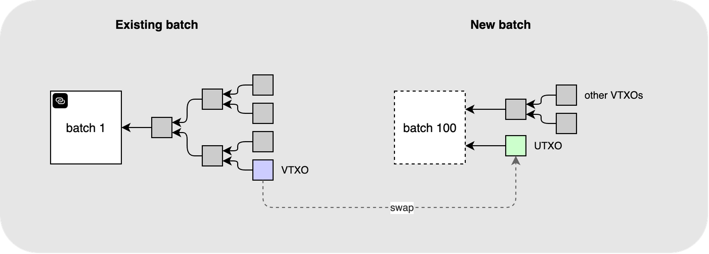

- **刷新 VTXO（批次切换）**

  如我们所见，支付到一棵 VTXT（虚拟交易树）的批次输出带有超时机制。一旦超时，运营者就能单方面清扫这个输出中的所有资金。所以，在一棵基于即将超时的批次输出的树上持有 VTXO 的参与者，将希望确保自己（在该批次输出超时后）还能拿回自己的 VTXO 。这需要执行一次批次切换 —— 用户放弃自己的较老的 VTXO ，换来位于一个新批次的 VTXO 。

  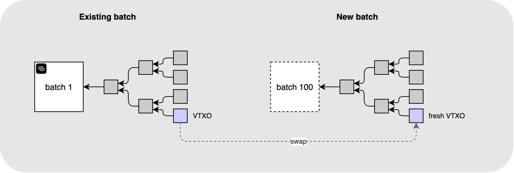

如你所见，这两种操作都需要弃权一个 VTXO、换来依靠新的批次交易来实现的承诺（不论是 UTXO 还是 VTXO）。这个弃权的过程非常重要，所以，我们现在就要详细分析这个过程。到最后，你应该能够理解弃权交易是什么、连接器树的用意何在，以及两者的结合如何让 离场/刷新 过程是原子化且免信任的。

## 批次切换案例

### 设定场景

为了演示弃权的过程，我将使用一个批次切换的案例。在批次切换中，一个用户尝试将现有的一个 VTXO 换成一个新的批次中的更年轻的 VTXO 。所以我们当前的情形是这样的：

- 一个有效的 VTXO A，位于一个已经存在、已经得到区块确认的批次（记为 “批次 1” ）中
- 一个有效的 VTXO B，位于一个新的、构造中的批次（记为 “批次 100”）中

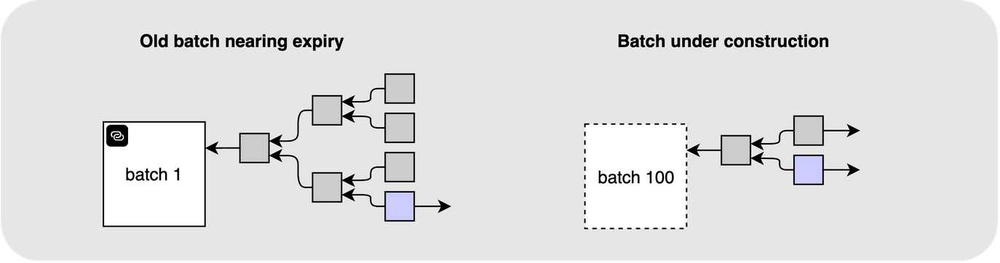

### 我们 *想要* 的结果

我们希望这个过程具备以下属性：

- VTXO A 应该 失效/弃权 ，不能再被原来的主人使用。这个主人不应还能通过单方面退出机制来取走这个 VTXO 。
- VTXO B 应该位于一个新的、得到确认的批次中，并且可以被 UTXO A 的主人使用。

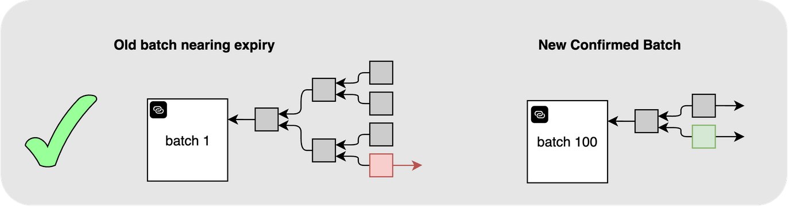

### 作为 Ark 运营者，我们 *不想要* 的结果

作为 Ark 运营者，我们不希望看到这样一种情形：用户最终拿到了两个有效的 VTXO，他们可以成功单方面取走这两个 VTXO 的价值而不会有任何后果。

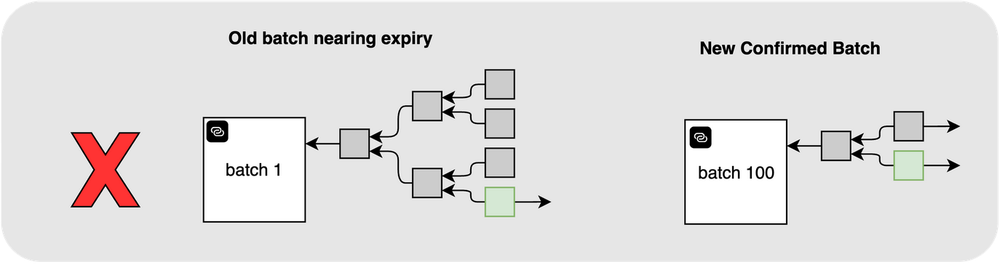

### 作为用户，我们 *不想要* 的结果

作为用户，我们不希望是这样一种情况：我们已经弃权了旧的 VTXO A，但带有 VTXO B 的新批次却一直得不到确认，也就是不再拥有任何活着的 VTXO 的所有权。

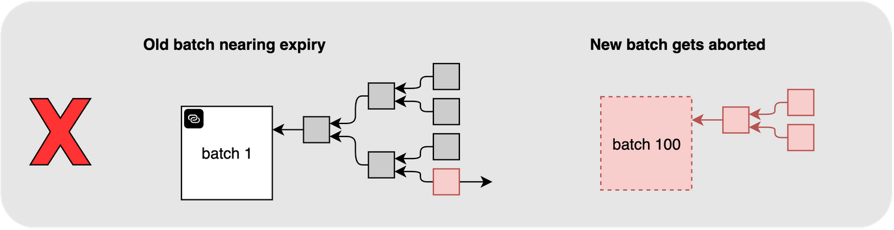

换句话说，我们需要这两件事是原子化（同时生效）的：

```
如果 新批次 得到确认：
	那么 旧的 VTXO 就 离开主人，并且 新的 VTXO 激活
或者，如果 新批次 被放弃：
	那么 旧的 VTXO 保持有效
```

那么弃权交易和连接器输出登场！

## 连接器

弃权交易是这种的一笔交易：用户和运营者一起花费一个 VTXO、将这个 VTXO 的全部价值发送给运营者。让弃权交易变得原子化、从而能满足上述所有条件的关键是，弃权交易不止花费相关的 VTXO ，*还* 花费来自新的批次交易的输出。换句话说，如果新的批次交易没有得到区块确认，这笔弃权交易就 毫无意义/是无效的 ，因为它的一个输入是无效的。

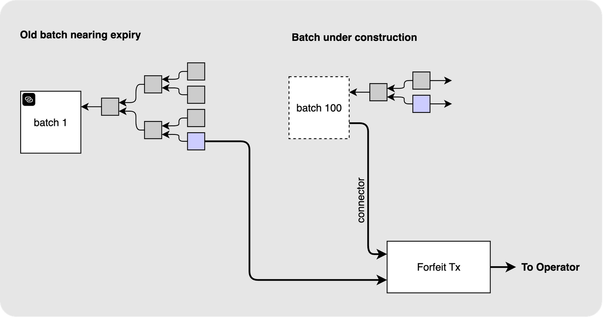

我们再走一遍前面的两个例子，看看这种构造如何同时保护运营者和用户。

在第一种情形中，在新的 VTXO B 已经在批次 100 中激活后，用户尝试展开其已经弃权的 VTXO，那么运营者可以直接 “纠正” 这个状态：通过广播该用户已经签名的弃权交易，将 VTXO A 中的资金交给运营者，该用户只能保留新的 VTXO B 。

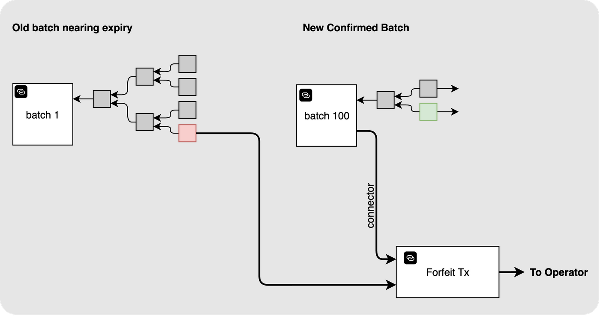

至于第二种情形，用户已经弃权了 VTXO A，但新的批次一直没有确认，那么这个用户依然是完全控制着这个 VTXO 的，因为目前，批次 100 尚未得到确认，弃权交易是没有意义的。

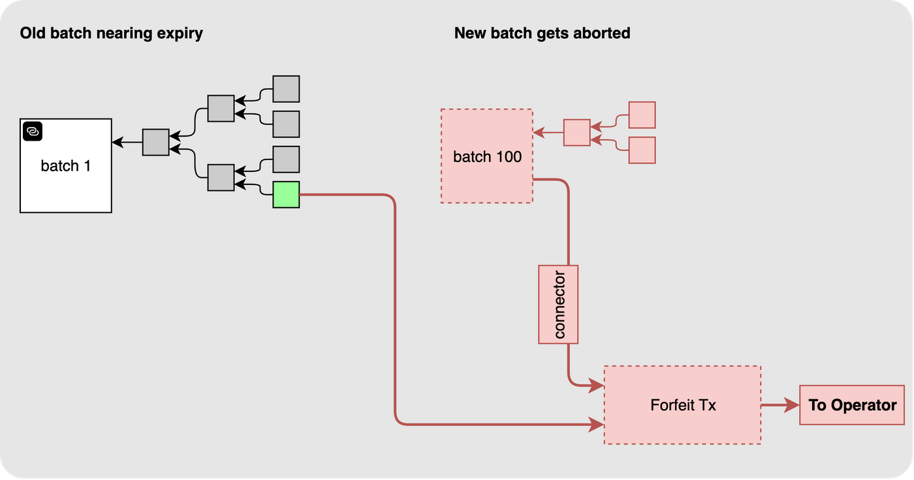

## 连接器树

理所当然，虚拟交易树构造的用途不止嵌入 VTXO ！连接器输出，从这种安全模式来看，是必要的，但在绝大部分情况下，我们都不希望用上它（它们的存在本身更重要），因此，在批次交易中放置显式的连接器输出、以备每一笔弃权交易使用，是一种浪费。幸运的是，我们可以复用 VTXT 构造来包含这些输出！唯一的区别在于，连接器树的所有输出都由运营者持有（而 VTXO 虚拟树不是）。

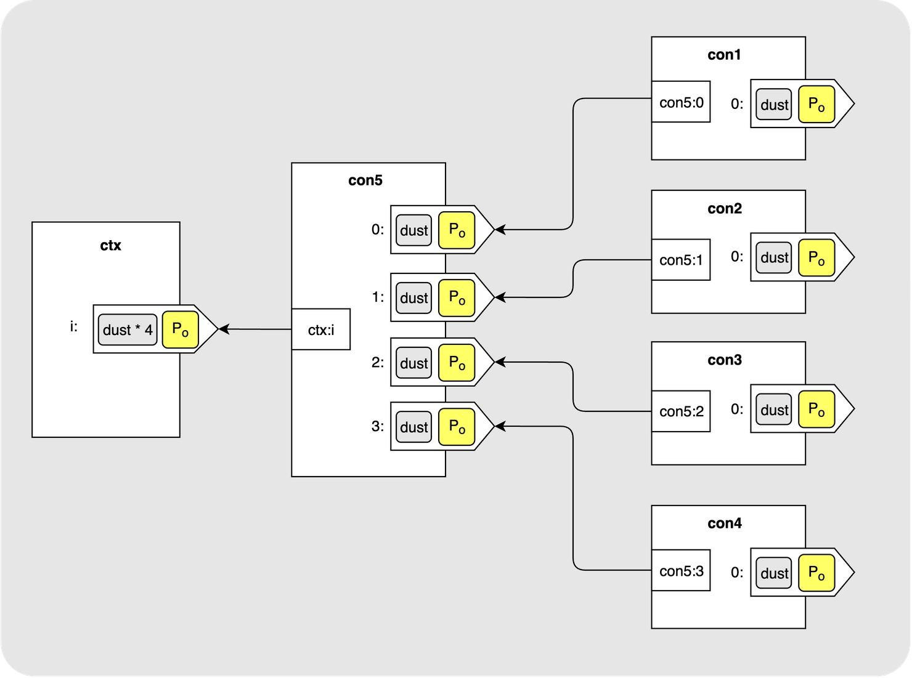

也就是说，最终，一笔批次交易会携带两棵交易树。批次输出支付给新的 VTXT，该树持有每个用户的新 VTXO ；连接器输出则支付给连接器树，持有为每一笔弃权交易准备的连接器。相同的构造，两种不同的用途。

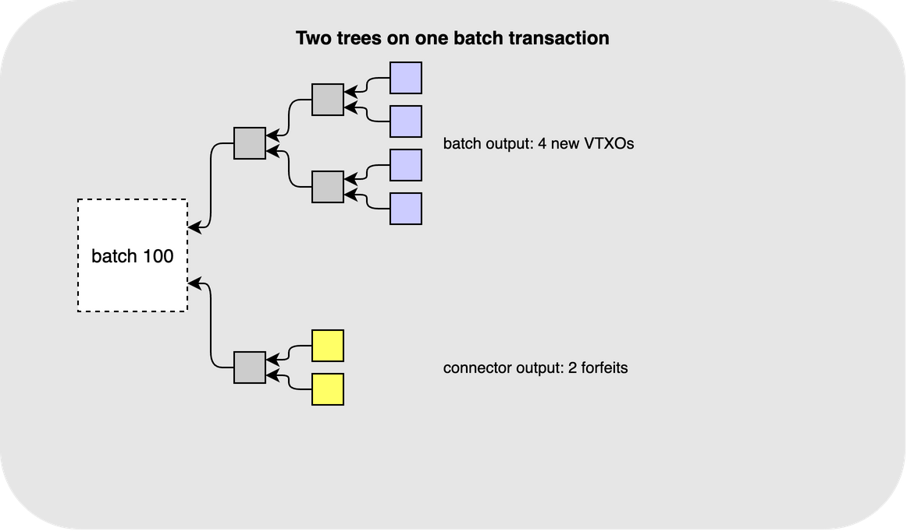

值得一提的是，这两棵树的规模没有必然关系。VTXT 的叶子数量由这个批次要创建的新 VTXO 的数量决定；而连接器树的叶子的数量则是由要处理的弃权交易的数量决定。这是两批不同的用户在做不同的事情，所以没有理由认为两者一定会匹配。一个回合甚至可以不包含弃权（每个人都是刚刚入场的新资金），因此没有连接器树；或者，可以没有创建新的 VTXO（人们都想离场），所以没有 VTXT 。而且，被弃权的 VTXO 可能来自多个不同的较老批次：一棵树上的所有 VTXO 都同时刷新的概率是很小的，协议本身也不作此要求。

我们可以讲得具体一些。假设我们有 4 个用户，都在这一回合提出了弃权。那么运营者可以这样一栏目一棵连接器树，每个叶子对应着一个弃权交易：


这棵树上的每一个输出，都只是一个普通的小面额输出，支付给运营者的公钥 `Po`。脚本之中没有其他东西，既没有清扫路径，也没有时间锁，因为其中没有需要保护的东西。运营者持有树上的每一个输出，从树根一直到叶子，所以不需要赛跑，也不需要领取。

就像 VTXT 一样，这些图也省略了一些东西。连接器树上的每一笔虚拟交易都带有一个零价值的临时锚点输出。这些交易都没有携带手续费，锚点输出就是运营者通过 CPFP 来追加手续费的办法（如果有需要让这些交易得到区块确认的话）。

输出的数额也值得一提。连接器并不携带任何真实价值。它的唯一作用就是成为一笔弃权交易的第二个输入，从而，如果批次交易得不到区块确认，弃权交易就没有意义。因此，每个叶子都是一个 “粉尘输出”，其面额仅仅是比特币网络愿意转发的最小面额。同时，批次交易中的连接器输出必须持有足以为所有叶子注资的资金：既然有四笔弃权交易，那就需要四个连接器，所以批次交易中的连接器输出的面额就是四倍于粉尘。因此，每多处理一笔弃权交易，连接器树都会让运营者多付出一个固定的小额代价。 

不过，这笔钱并不是丢了。因为连接器输出是直接支付给运营者的，所以运营者可以重新把它转移到别的地方。只是不能马上这样做，因为花费连接器输出会毁灭整棵连接器树，连接器叶子也消失了，那么运营者手上的弃权交易也失效了、无法广播了。所以，运营者必须等待，等到不再需要任何一笔相关弃权交易时 —— 也就是被弃权的 VTXO 所在的批次都过期了，可以清扫其中的资金时 —— 这棵连接器树也就失去意义了，那么运营者可以回收其中的价值，通常老说，会积累许多这样的输出、一次性花费，以使其经济价值值得付出一笔交易费。

此外，连接器树的叉数不必与 VTXT 相同。这两棵树是为不同的目的而构造的，规模也不尽相同，所以运营者可以自由选择适合的叉数，主要看这个回合处理的弃权数量。

现在，这四个用户，每个人都需要一个叶子。所以运营者会给每个人交付一个虚拟交易链条，从批次交易到他们各自的连接器，不多也不少。比如，对于第一个用户，这个交易链条是 `ctx`、`con5` 和 `con1` ：

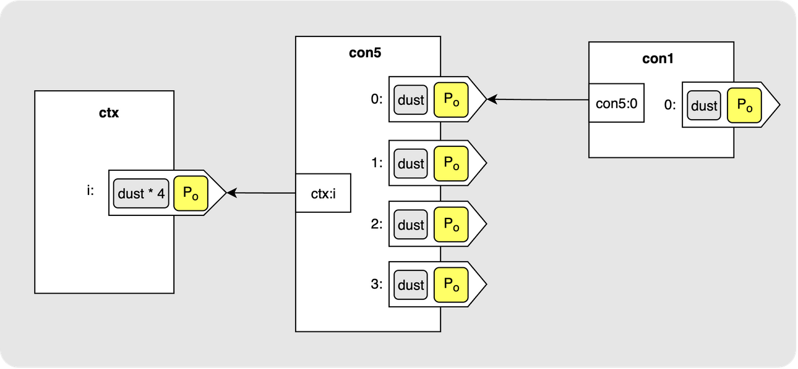

这个链条可以向用户证明，他们得到的连接器真的是从他们的批次交易中派生出来的。如果连接器真的需要发布到链上，这就是用户需要广播的交易链条。

现在，用户可以构造自己的弃权交易了。弃权交易有两个输入：`vtx_a:0`，是 TA 要放弃的 VTXO，用合作路径花费； `con1:0`，是连接器叶子，也就是刚刚交给用户的东西。弃权交易只有一个输出，将旧 VTXO 的价值全数交给运营者。

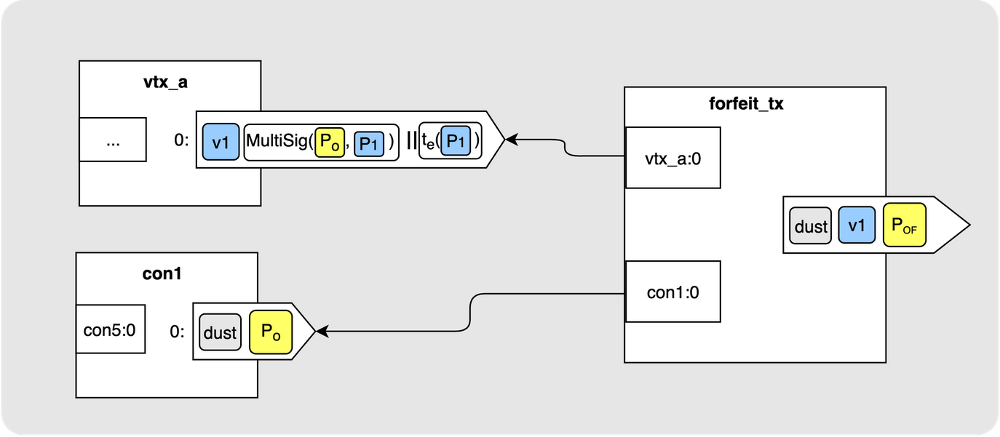

## 离场请求

上面的解释都以批次切换作为例子，但离场请求也是完全一样的。唯一的区别是运营者在批次交易中为你提供的东西不同。

在批次切换中，你得到的是一个新的 VTXO，是新的 VTXT 的一个叶子。而在离场请求中，你得到的是批次交易的一个普通输出，其作用是给你支付，并且对你的收款地址（脚本）没有任何约束。

其它一切都没有什么区别。你依然要弃权旧的 VTXO，弃权交易依然要花费这个 VTXO 以及一个来自新批次交易的连接器叶子，并且原子性也是一样的：一旦批次交易得到确认，你在区块链上的钱币也就诞生，并且运营者可以领取旧的 VTXO；如果它得不到确认，那么你的旧 VTXO 就还是你的。

## 总结

弃权交易和连接器是回合的资金移动背后的机制，不论是你完全离开一个 Ark ，还是仅仅要刷新一个即将到期的 VTXO 。弃权交易是运营者的保险，连接器则让这个保险在新的批次交易得到区块确认之后才会生效。一个依赖，让切换对于两方都变得安全。

本文中的内容都与批次之间的切换有关。下一篇则要讲到，如果不想等待批次交易，你可以在 Ark 中做什么。