> *作者：Elle Mouton*
>
> *来源：<https://www.ellemouton.com/posts/ark-oor-transactions/>*
>
> *[前篇见此处](https://www.btcstudy.org/2026/09/07/the-ark-protocol-forfeit-transactions-and-connector-trees-by-elle-mouton/)*

我们已经介绍了在一个 Ark 实例中如何建立一个 VTXO、如何离开这个 Ark 实例、如何通过运行批次切换来保持一个 VTXO 的活性。这些活动都需要回合式交互，也就是，用户必须加入一个 “回合” 并等待该回合的批次交易得到区块确认。再换句话说，我们已经介绍的东西都是 “回合内” 的。如果只有回合内的操作，那么算不是非常有用。让 Ark 有用的地方在于它能执行 *回合外*（缩写为 “OOR”）的交易。这些交易会花费已有的 VTXO、创建出新的 VTXO，且不需要等待新的 回合/批次。OOR 交易有时候也被称为 “Ark交易”。OOR 交易让 VTXO 的主人能够像使用链上 UTXO 那样使用 VTXO，并且无需担心手续费和区块确认。在这篇文章中，我们会深入了解 OOR 的过程，以及相关的多种信任假设。我们也会介绍 “检查点交易（checkpoint transactions）” 以及它们的必要性。

事先介绍我们将要使用的术语，应该会有帮助：从一个回合中派生、作为一棵虚拟交易树（VTX）的一个叶子的 VTXO，我们称为 “**回合内 VTXO**” 或者 “**已经确认的 VTXO**”。而从一笔 OOR/Ark 交易中产生的 VTXO 叫做 “**OOR VTXO**”，或者 “**待确认的 VTXO**”。“已经确认” 和 “待确认” 这个术语上的区别，是非常重要的，在我们讲解这些 VTXO 的信任假设时就能看出来。

## OOR 案例

首先，我想用一些图片来展示 OOR 交易的样子，好让读者建立一些直觉。请注意，这些是简化的案例，将帮助我们理解为什么后面需要加入检查点交易。

核心的含义是，一笔 OOR 交易，就是取一个（或一组）VTXO 作为交易的输入，创建出一个（或一组）新的 VTXO，*就像普通的比特币交易那样*（因为 Ark 中的交易如有需要都可以广播到区块链）。这两张图展示了一个从回合中产生的 VTXO（VTXT 的一个叶子）如何被一笔 Ark 交易花费、创建出两个新的 VTXO 。

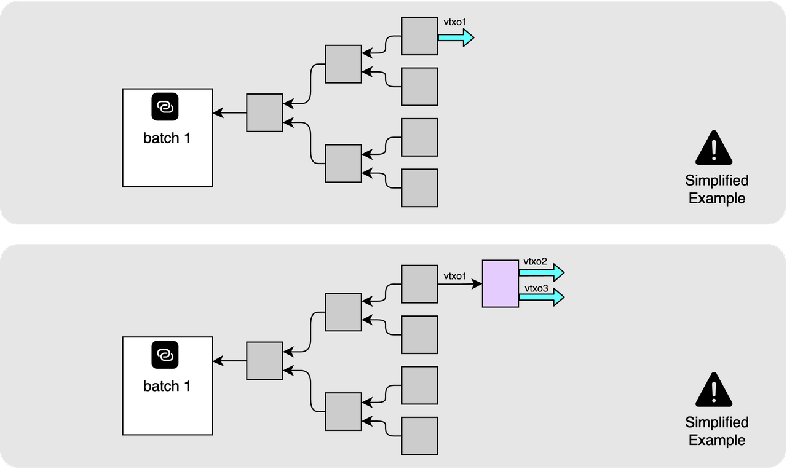

从技术上来说，这个花费的链条能延伸多长，并无限制，所以，我们可以用另一笔 Ark 交易，花费这两个新的 VTXO、再创建一个新的 VTXO 。

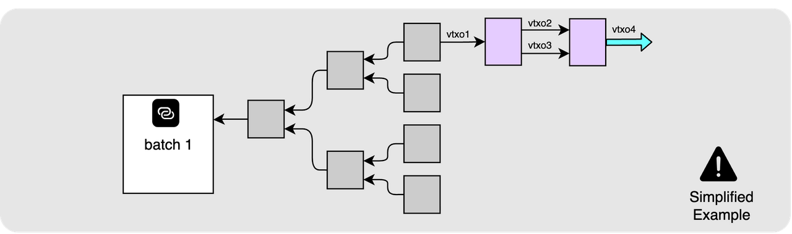

同样地，也没有什么能阻止我们同时花费来自两个不同 VTX 树的 VTXO，只要它们属于同一个 VTXO 集合。所以下面这个场景也是我们想要支持的：

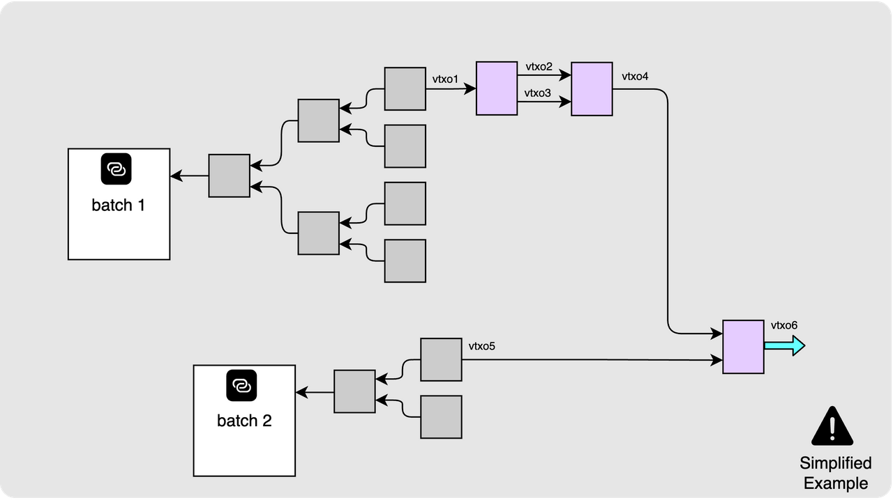

## 交易的细节

Ark/OOR 交易是以合作方式执行的，运营者和主人一起通过合作路径花费一个 VTXO（这条路径并无时间锁），然后创建出具有相同结构的 VTXO 。需要来自 VTXO 主人和运营者两方的签名才能创建出有效的 Ark交易。

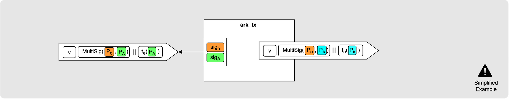

## 几个重要的问题

既然我们已经了解了这种交易方式尝试支持的场景，现在来回答几个重要的问题。

### 我要保存哪些数据？

如果你持有一个回合内的 VTXO（一棵 VTXT 的一个叶子），你必然拥有从批次交易到你的 VTXO 的整条树路径的所有交易。在完成回合协调流程之前，你就已经拿到所有这些数据的。但是，如果你得到的是一个从 OOR 产生的 VTXO，你就必须确保自己得到了从批次交易到你的新 VTXO 的整个交易链条，包括从叶子 VTXO 到你的 VTXO 之间的全部 Ark 交易。如果你得到的 VTXO 有来自多个批次交易的血统，那么你也需要全部收集过来。请注意，OOR 链条越长，你想要单方面退出时，需要在区块链上得到确认的交易就越多，你为了让它们得到确认而需支付的手续费也就越多（这部分费用可能增长得很快）。

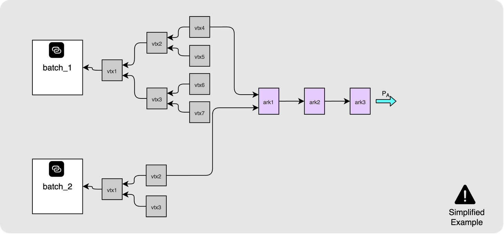

### 在区块链上我该观察什么？

如果你持有的是一个回合内 VTXO，那么你处在一个最安全的位置上，只要你记得在批次过期之前刷新 VTXO，就不会遇到什么问题。即使其他人在区块链上广播了你的 VTXO 的血统，你的资金也不会遇到危险，因为你依然掌握着决定却，可以单方面花费你的 VTXO（哪怕它被发布到区块链上，也不会有别人能够花费它的风险）。一旦你花费了这个 VTXO ，你也无需再观测它的任何输出。

但是，如果你收到的是一个 OOR VTXO，情形就完全不同了，你脚下并无如此坚实的土地。如果你收到的是 OOR VTXO ，你必须持续观察区块链，看看你的 VTXO 的任何祖先 VTXO 的主人会不会尝试展开交易树。如有这种情形，而你没有作出响应，那么他们将能凭借超时路径盗走资金。但只要你注意到了他们的举动，那么你需要做的只是 “纠正” 这个状态：广播 Ark 交易、花费那些 VTXO，不让它们的时间锁分支能够启用（Ark 交易本身是通过合作路径花费的）。

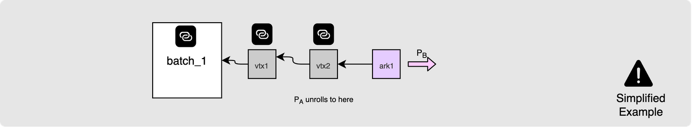

### 什么能够抵御重复花费？

有一个地方，是真正需要信任的。OOR 交易是通过一个 VTXO 的合作路径来花费的（运营者也参与其中），所以， 如果运营者不同意你花费一个 VTXO 的方式，就无法创建 Ark 交易。这也意味着，如果 VTXO A 的主人与运营者合作、创建了一笔 Ark 交易、花费了 VTXO A 并创建了一个 VTXO B 给你，那么，你必须信任运营者会拒绝 VTXO A 的主人重复花费该 VTXO 的请求。所以，当你进入 OOR 领域时，你需要理解这种信任假设的存在。幸运的是，如果一个运营者这样做了，你很容易能够证明这件事 —— 展示两笔完全签名的交易花费了相同的 VTXO  —— 这就能向公众证明，这个运营者是不值得信任的、摧毁 TA 的声誉。

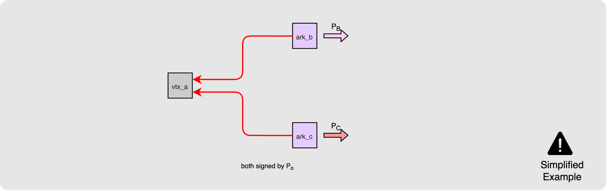

### 作为收款方，最好的习惯是什么样的？

因为前面提到的所有理由，如果你收到了一个 OOR VTXO（待确认的 VTXO），那么除非你计划立即花掉它（通过另一笔 OOR 交易），那么最好的办法就是执行一次批次切换、放弃这个 VTXO、换成一个回合内的（得到确认的）VTXO 。这样一来，你就不需要担心运营者会重复话费你的 VTXO 输入，并且你（在单方面退出时）需要展开的交易链条也是最短的。这样也避免了你的 VTXO 血统中的一个花费过 VTXO 的用户尝试单方面退出（给你带来的风险）。

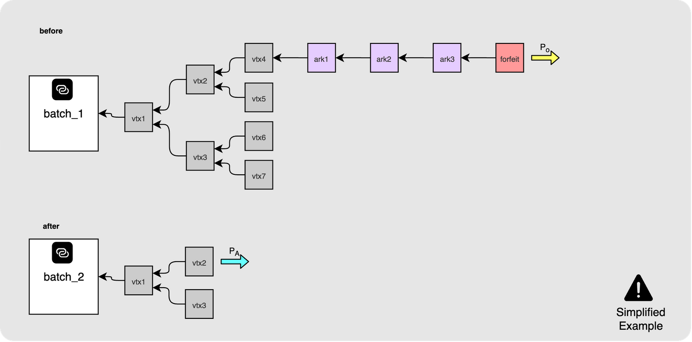

## 捣乱攻击

现在，我们已经理解了 OOR 交易的基本原理，我们可以来了解一种攻击：如果我们坚持这种简化方法，就有可能遭遇这种攻击。这将帮助我们理解检查点交易的意义。

**步骤 1**

假设我们有如下一棵虚拟交易树，Alice 是一个参与者，得到了一个 VTXO，由她的公钥 `PA` 来控制：

**步骤 2**

那么她可以创建一笔简单的 Ark 交易（OOR），花费这个 VTXO、创建一个新的，依然使用相同的公钥（换句话说：她是左手倒右手）。

**步骤 3**

她可以反反复复这样做，创建出任意长的 Ark 交易链条。

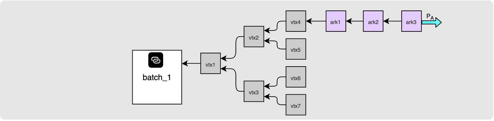

**步骤 4**

最后，Alice 执行一次批次切换，弃权自己的待确认的 VTXO，换成新批次的一个得到确认的 VTXO：

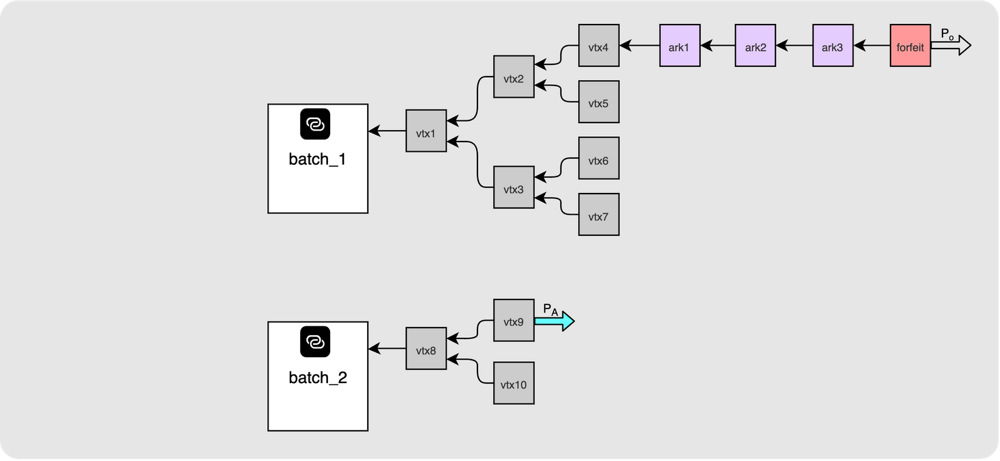

**步骤 5**

现在，Alice 可以尝试同时领取这两个 VTXO 。她先展开批次 1 的交易树，一直到 `vtx4`，将最初的 VTXO 广播到链上。

**步骤 6**

这将迫使运营者广播并确认剩余的 Ark 交易以及 Alice 的弃权交易，以防止 Alice 盗窃资金。运营者自己要负责让这个交易链条得到区块确认。与此同时，Alice 是可以自由使用她刷新之后的 VTXO 的。

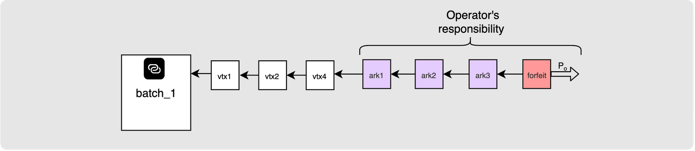

幸好，我们可以使用检查点交易来保护运营者。

## 检查点

我在前面展示了这个简化的 Ark 交易的例子：它花费了一个 VTXO、创建了一个新的。

使用检查点，我们可以使用下述构造。我会先解释这种构造，然后再用案例来说明它如何帮助我们抵御气馁攻击。

我们依然使用这样这一种场景：VTXO A 的主人 Alice 想花费自己的 VTXO、给 Bob 创建一个 VTXO B 。但是需要运行下列步骤：

如果你觉得这个过程看起来很眼熟，那你的感觉是对的。这个[签名顺序](https://www.ellemouton.com/posts/ark-vtxos-and-trees#the-signing-order)与构造批次交易时相同：先准备好待签名的输入、让另一方构造成型的交易、然后你来检查、检查通过才签名。

**步骤 1**

Alice 将创建两笔交易，并发送给运营者。

- 一笔**检查点交易**，花费 VTXO A 并支付给一个由运营者 “拥有的” 轻松脚本（其多签名路径使用 Alice 和运营者的公钥；而一个超时路径支付给运营者）。Alice 并不签名这笔交易的输入。
- 一笔 **Ark交易**，花费检查点交易输出的合作分支，并创建新的 VTXO，支付给由 Bob 拥有的 VTXO 脚本。 Alice 为这笔交易的输入提供签名。 

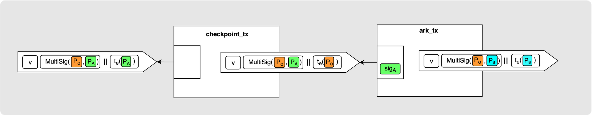

**步骤 2**

运营者验证这两笔交易，签名这两笔交易并将签名发回给 Alice 。

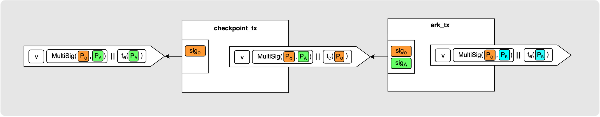

**步骤 3**

Alice 验证运营者的签名。现在，她可以安全地签名检查点交易了（从一定角度看，这是放弃自己的 VTXO、将所有权交给运营者——，因为完全签名的 Ark 交易可以花费她的检查点交易，满足 Alice 的支付愿望。

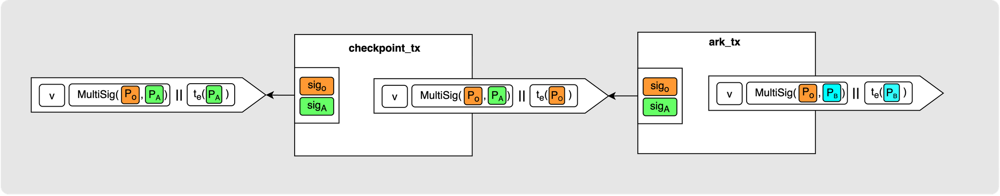

## 捣乱攻击尝试 2

现在，我们再次尝试捣乱攻击，看看检查点交易如何改变局面。

**步骤 1**

我们再次从拥有一个已确认的 VTXO 的 Alice 开始。

**步骤 2**

她再次花费这个 VTXO，支付给自己，但现在她必须建立一个检查点：

**步骤 3**

她再次反复玩这个把戏，延长交易链条：

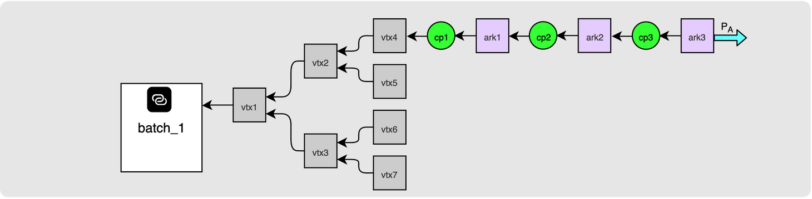

**步骤 4**

最后，她在链条的末尾弃权，换回新批次的一个新 VTXO：

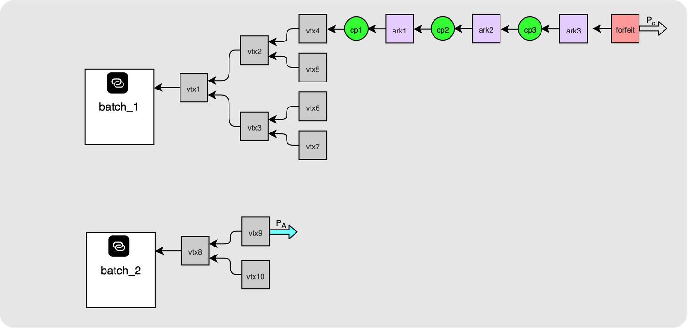

**步骤 5**

攻击开始，Alice 尝试展开她的第一个 VTXO 到链上：

**步骤 6**

这一次，运营者只需要广播接下来的一笔检查点交易（花费 `vtx4`）就可以了。

如果 Alice 不响应，那么运营者就能在超时后花费这个检查点交易的输出，因为运营者拥有它的超时分支。所以运营者不再需要赶忙让整个链条得到确认。

**步骤 7**

现在，Alice 被迫让花费 `cp1` 的 Ark 交易得到区块确认，以便拿回这笔资金的所有权：

**步骤 8**

又一次，运营者只需广播接下来的一笔检查点交易，就可以了。这个过程可以一直重复，直到交易链条终结，弃权广播被广播出去。

将这两个攻击流程放在一起，就一目了然了，因为其中一个标签发生了变化，这就是重点。在第一个版本中，运营者为了追回资金，需要自己确认整个交易链条，Alice 什么都不用做。而有了检查点，推进这个链条就成了用户的责任，Alice 支付一次只能推进一步。

所以，使用检查点交易，用户被激励不要尝试这种攻击，因为他们不再能轻易给运营者捣乱，而且真要捣乱，也需要花费很多手续费，才能推动交易链条的一环得到区块确认。

## 检查点交易的缺点

你应该也想到了，检查点这种解决方案并不是非常优雅。它意味着，为避免欺诈，运营者和 VTXO 的主人都要存储长得多的交易链条。展开交易链条也变得昂贵许多。所以，再说一次，最好的办法是执行批次切换，将待确认的 VTXO 换成经过确认的 VTXO ，从而你可以把漫长的检查点交易和 Ark 交易链条丢掉。

## 总结

Ark 交易让 Ark 在日常交易场景下变得有用。只需交换一些签名，你就能给其他人支付，不需要等待批次交易，也不需要等待区块链确认。收款方最终得到的是一个待确认的 VTXO，本文的大部分内容都是在讲解 “待确认的” 这个词的意义：收款方必须观测发送方有无展开虚拟交易树和花费链条、运营者会不会跟前任 VTXO 主人串谋；并且，一个钱币背后的交易链条只会越来越长。

检查点交易通过让客户支付来推动链条展开（而不是迫使运营者展开整个链条）解决了捣蛋攻击。这让花费链条变得更长。解决办法就是本系列的另一篇的内容：批次切换，将待确认的 VTXO 换成经过确认的 VTXO，然后丢掉这个链条。

本系列这样就结束了。现在你应该已经完整掌握了 Ark 协议：如何构造一个 VTXO、虚拟交易树如何共享链上的一个输出、如何退出，以及如何花费它们。

（完）