> *作者：Elle Mouton*
> 
> *来源：<https://www.ellemouton.com/posts/ark-vtxos-and-trees/>*

你可能听过 Ark 协议，但对于它的原理有许多疑问。我的目标是逐步解释这套协议的运行（有人在期待我画图吗 ^-^），从而解决你可能会提的所有问题。我也会提许多案例来帮助理解。我将把整个系列分为几篇文章：

**Ark 系列**

1. VTXO 与虚拟交易树*（你正在阅读的就是这一部分）*
为什么需要这里技术，以及虚拟交易树和批次交易的概念
2. [期权交易与连接器树](https://www.ellemouton.com/posts/ark-forfeits-and-connectors)
如何离开一个 Ark 实例，如何保持一个 VTXO 的活力
3. [回合外交易](https://www.ellemouton.com/posts/ark-oor-transactions)
也称为 “OOR 交易” 或 “Ark 交易”，以及 “检查点交易”

这里的想法并不是新的，许多灵感来自 [Ark Labs 所撰写的 Lite Paper](https://docs.arklabs.xyz/ark.pdf) ，后面我还会多次引用该论文的内容。

## 全景

简单来说，Ark 允许比特币的用户 *共享* 一个 UTXO 。每一个参与 Ark 协议的用户都会拥有一个或多个 “VTXO（虚拟的 UTXO）”，他们可以将这些输出用作交易的输入，从而创建出新的 VTXO —— 就跟我们所知的 UTXO 的原理完全一样，只是在顺利的情形下，这些 VTXO 会在链外环境中生存，创造它们的虚拟交易（VTX）也永远不需要区块链确认。所以，一个 Ark 实例就是一个虚拟世界，它由一些真实的、得到区块确认的 UTXO 来支撑，共同容身于这些 UTXO 的用户可以照常使用自己的比特币，但无需让每一笔交易都得到区块链确认。这就意味着，交易速度可以更宽、更便宜（相比普通的 UTXO）。Ark 的用户但凡不想退出 Ark、获得普通的 UTXO ，就只需支付低得多的手续费，因为批次交易所创造的新的 UTXO，是由许多用户以及 Ark 运营者共同分享的，所以，即使如此，手续费还是会大幅低于普通 UTXO 在使用过程中的手续费（即矿工费）。

我知道，光读这些文字，你一定会有许多疑问：它的信任模式到底是什么样的？它的取舍呢？我们将在文字的冒险中解决所有这些问题。虚拟 UTXO 的概念应该是个好的起点。它是形式是什么样的？为什么这个概念允许多个用户 “共享” 同一个 UTXO ？马上开始吧。

## VTXO 与虚拟交易树（VTXT）

我们这里要解决的根本问题是：一个 UTXO ，怎么能被多个用户分享，同时依然允许这些用户保管自己的资金呢？

这是靠着一些预先签名的交易（它们形成了树的形状，因此称作 “虚拟交易树（VTXT）”）、使用一个中心运营者（TA 协助用户构造和签名这棵交易树）来做到的。在顺利的情形中，树上的交易都不需要发布到区块链上。

### VTXO

我们先来看树上的一个 VTXO 。如果你是虚拟交易树的一个参与者，那么你会得到一个由你控制的虚拟交易输出。这个输出是一个 Taproot 输出，有两种花费方式（如果你需要复习 Taproot 脚本的知识，请看我的[上一篇文章](https://www.ellemouton.com/posts/taproot-prelims)（[中文译本](https://www.btcstudy.org/2023/04/27/taproot-and-musig2-recap-by-elle-mouton/)）。

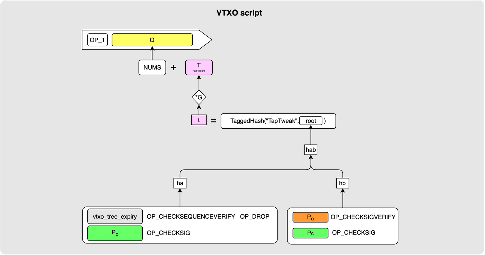

这两种花费路径是：

**合作花费路径**

这套路径是马上就可以使用的，只要 VTXO 的主人（`Pc`）和运营者（`Po`）能够一致同意花费这个输出的交易：这是一个 2-of-2 多签名花费路径。它也是用在顺利情形中的路径。

**单方面花费路径**

这是一条带有时延的路径，可以由这个 VTXO 的主人在一个 CSV（脚本相对时间锁）时延后使用（注：CSV 时间锁是一个倒计时，从父交易得到区块确认的时间开始倒计时，所以说它是一种 *相对的* 时间锁）。设置这条路径，是为了在参与者想要单方面退出这个 Ark 实例时， 无需运营者的配合就能执行，这也是让参与者保持对资金的控制的方法。如果一个客户决定单方面退出，TA 会把这个输出发布到区块链上，等待 CSV 解锁，然后按自己的意愿花费这笔钱。

两者合在一起，到底是什么样子的呢？其实，就像所有的 Taproot 输出一样，实际的输出脚本就是一个普通的 `OP_1` ，表示支付到 Taproot 输出公钥 `Q` 。这个 `Q` 由一个 NUMS 点作为内部公钥，以及（通过默克尔树根）承诺上述两种脚本，通过 Tap Tweak 调整而成。（译者注：“NUMS 点” 是无人知晓其私钥的公钥。）

从现在开始，我会用下图来表示 VTXO 输出，这样更加简洁：

这里的 `v` 是这个输出所承诺的价值（比特币）。这个 `MultiSig(Po, Pc)` 则表示合作花费路径， 而 `te(Pc)` 表示相对时间锁路径。

这里要马上指出的一点是，我们在 VTXO 脚本使用的是 MultiSig 多签名。也就是说，在花费这个输出时，所涉及的两方可以独自创建自己的签名，而不像 MuSig2 那样必须在线交互才能创造签名。MuSig2 算法将用在树构造的其它脚本中（我们下面会介绍）。 从技术上来说，两者都可以实现多签名的功能，但都有取舍。使用 MuSig2，我们获得的是一个很好的属性：可以使用 Taproot 输出中的密钥路径花费，只需发布一个 Schnorr 签名，无需将脚本发布到链上，自然也无需为这些字节付费，但取舍在于，它需要交互构造签名。使用 MultiSig ，双方就不需要交互了（也不需要额外的通信回合），但我们必须为额外揭晓的 taproot 脚本和脚本包含证据支付手续费。

好了，现在我们知道一个 VTXO 输出长什么样了。但我们知道，我们真正想到的是这样一个构造，可以将许多这样的输出 *嵌入* 到一个 UTXO 中。所以，现在来看一个案例，我们由四个 VTXO，分别表示四个不同客户。因此，我们有四个参与者，各有各的输出价值和独特的花费脚本：

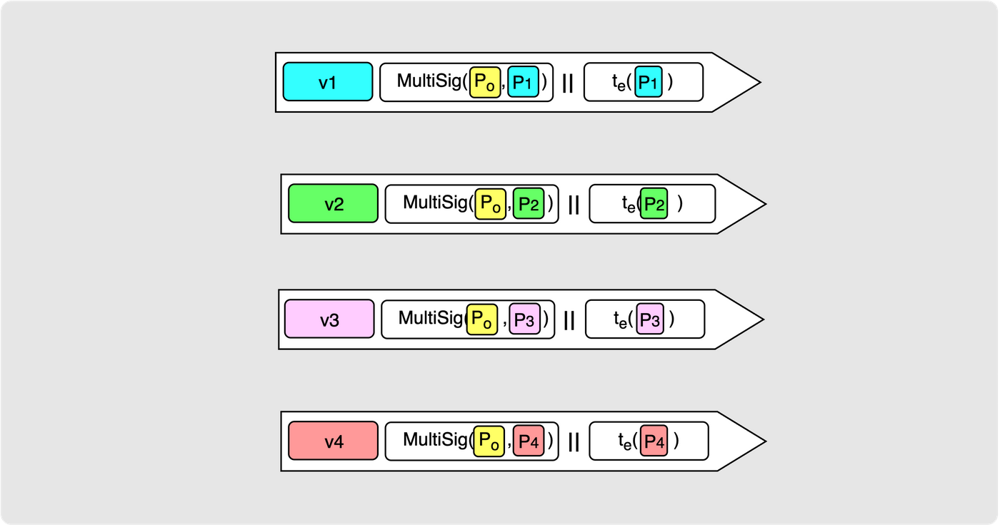

但这些还只是输出脚本。它们需要放到交易中，才是有意义的。所以，我们，我们为每一个输出配一笔虚拟交易（VTX）。这些虚拟交易最终会成为我们的虚拟交易树（VTXT）的叶子。请注意这些交易的标签：`vtx1`... `vtx4` 。

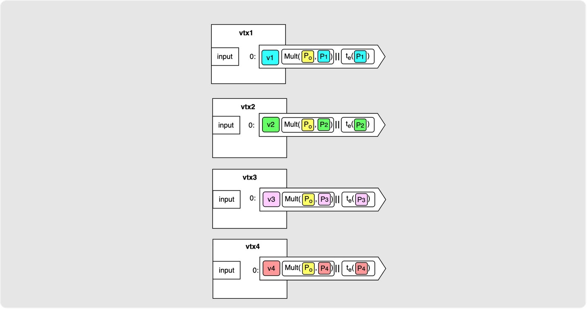

你可能会问：“为什么要搞这么麻烦呢？不能把它们都放在一笔交易里面吗？”理由是，我们希望当有参与者希望单方面退出 Ark 时，不会迫使同一 Ark 实例的其他参与者退出。如果用一笔交易来生成所有 VTXO ，那么一旦一个客户想要把自己的输出退出到区块链，就会开始 CSV 倒计时，并迫使分享同一交易的其他参与者都退出这个 Ark 实例。因此，每一个 VTXO 都属于一笔单独的交易。要指出的一个细节是，所有这些交易都使用了 “[临时锚点](https://bitcoinops.org/en/topics/ephemeral-anchors/)”（但我在图示中省略了它们）。这是为了允许交易们在广播时再通过 “[CPFP](https://bitcoinops.org/en/topics/cpfp/)（子为亲偿）” 来支付手续费。（译者注：临时锚点是一个小面额的输出，用于被子交易花费，从而允许子交易所携带的交易手续费来提高确认父交易的吸引力。）

好了，我们有了第一组 VTXT 叶子交易，代表了我们的四个 VTXO 。现在，我们需要进一步向后推导，看看如何有一个链上的 UTXO 来表示它们。我们的下一步是创建一层虚拟分支交易，产生用作这些叶子交易的输入的输出。

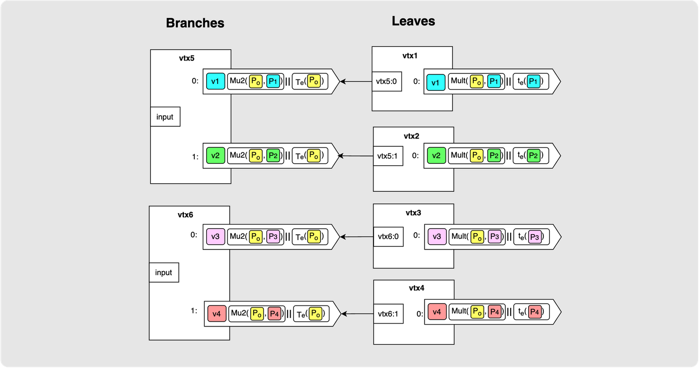

关于上图，我们要作些解释：

- 在这里我选择了 2 作为基数 —— 每一笔分支交易会分出两个输出。但我们也可以选择 4 作为基数。其中的取舍是树的深度和交易的体积：更大的基数，意味着树会更窄，所以即使你要在区块链上展开这棵树（让 VTXO 退出到区块链），也只需要广播更少交易，但每一笔交易的体积（字节数量）都会更大。从这个例子本身触发，我们选择了 2 叉树。
- 如果你把分支交易输出的脚本看得仔细些，你会发现它们与 VTXO 是不一样的，有两方面的不同：
  - 在这里的合作路径中，我们使用 MuSig2 多签名。
  - 这里的超时分支是可以被 *运营者* 花费的，所以这些输出是由运营者 “拥有” 的。这是一个重要的区别。如果其中一笔分支交易广播到了区块链，但花费它的叶子交易并未广播，那么它们对这个 Ark 的参与者就没有意义，也不会保护他们原来放在在这个 Ark 的 VTXO 中的余额；它们只意味着，在给定的时延之后，运营者将能扫走这些资金。注意：树上的参与者会在运营者可以扫走资金之前 *刷新* 自己的 VTXO —— 这个我们后面再说。

所以，现在我们有了这两笔分支交易，可以说叶子交易 “嵌入” 了其中。这些叶子交易的输入具体地指向了这些分支交易，所以，这些叶子交易也仅在这些分支交易能够得到区块链确认时才有意义。那么，参与者们如何确定这些分支交易的输出不会被其它方式花费、只能用他们所知的叶子交易（给他们支付 VTXO 的交易）花费呢？这是因为，在这棵树的建立流程中，所有这些树上的交易都需要参与者和运营者预先签名，并且这些参与者只会被激励去签名有效的叶子交易（以花费分支交易的输出）。这是唯一一次他们将乐观地签名合作路径的时候。并且，因为用在分支交易中的 Tap Tree（脚本树），花费这些输出的唯一一种别的办法就是运营者广播这些分支交易并等待时间锁分支解锁。

我们用另一层交易来重复上述的嵌套流程。在我们这个案例中，恰好，只需再上溯一层，就得到了树根交易：

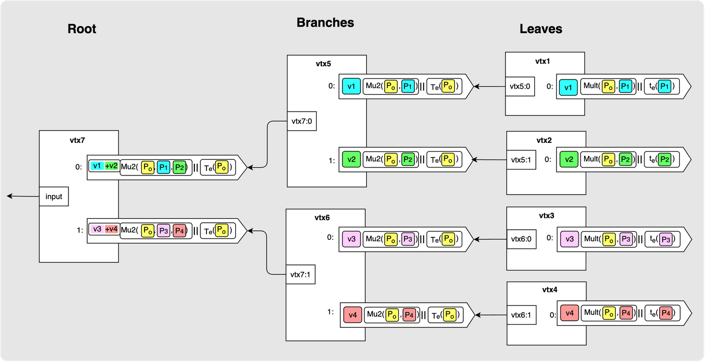

这里要指出的重点是，树根交易的输出汇总了两笔分支交易所需要的价值。所以，`vtx7` 的 0 号输出支付了总计 `v1` + `v2` 的价值，并且其合作分支必须要有参与者 `P1`、`P2` 以及运营者 `Po` 的 MuSig2 签名才能花费。超时分支依然由运营者持有。

最后一步是构造实际上会出现在区块链上的 UTXO 的脚本，它将表示整棵树：

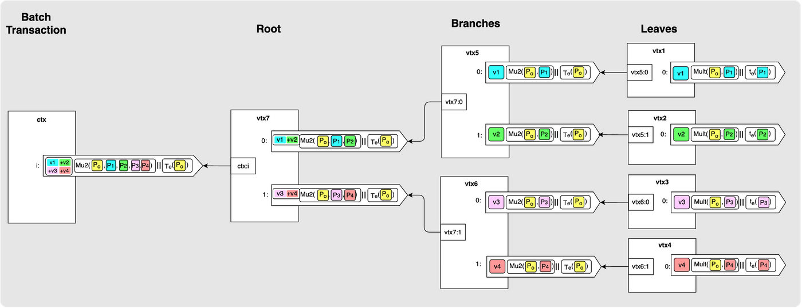

再次提醒这个输出所包含的东西：它的价值是树上所有 VTXO 单体的价值之和，其 MuSig2 密钥路径包含了每一个参与者的公钥以及运营者的公钥。并且，其超时分支也是由运营者持有的。由运营者持有的超时分支（包括树上其他输出中的由运营者持有的超时路径）有一个专有名词：“清扫分支”。这个最终的输出叫做 “批次输出”，并且，在经历时延 `Te` 之后，运营者就可以独自清扫这个输出中的资金。

没错，最终出现在区块链上的一笔批次交易，带有一个批次输出，就像这样：

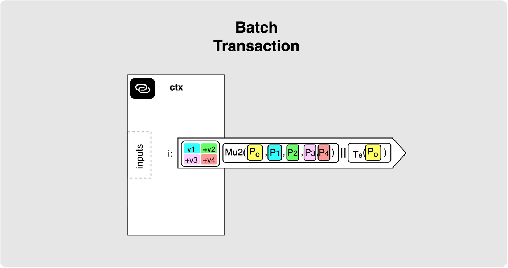

## 单方面退出/展开

这里，要理解的重点是，如有需要，那么完整的交易树是可以出现在区块链上的。在构造这棵树的时候，参与者们和运营者会提供所需的所有签名，从而任何一位参与者都会得到一个交易链条，从批次交易一路走到带有 TA 的 VTXO 的叶子交易，其中每一笔交易都是完全签名的。这就意味着，任何时候，一个用户，只要自己想，都可以通过广播这个交易链条来退出这个 Ark 实例。他们只需负责支付手续费来让这些交易得到确认，就可以了。我们这就来看一个例子，看看一个参与者如何完成整个过程，以及这会如何影响其他参与者以及运营者。

以下是对完整交易树的回顾。

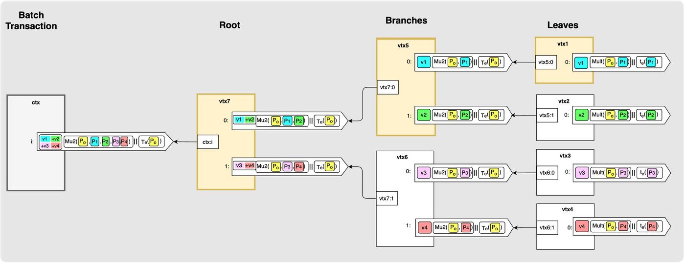

我在图示中用黄色标记出了 1 号参与者需要在意和保留的交易链条：

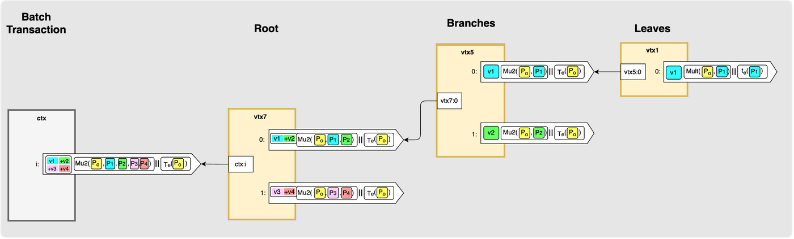

所以，为了退出，1 号参与者只需逐一广播这个链条上的交易。TA 随时都可以这样做，因为链条上的所有交易所花费的都是前序输出的合作分支。当最终的叶子交易出现在区块链上时，1 号参与者只需等待相对时间锁解锁，就能清扫这个输出。这里没有被运营者清扫输出的风险，因为这个参与者还没有用这个输出的合作路径签名任何花费它的交易。这个参与者唯一需要记住的事情是，批次交易已经得到确认，所有虚拟树交易都有一个由运营者持有的清扫路径；清扫路径带有时间锁，在解锁之前，所有虚拟树交易都只能通过化作路径来花费，而在解锁之后，运营者可以清扫资金。

此外，请看，一个参与者的单方面退出并不需要让其他参与者的叶子交易得到区块确认！所以，其他参与者依然生活在这个 Ark 中。方舟（Ark）并未搁浅！

## 批次过期

再来看批次过期的情形。这可以分为两种情形：顺利情形，没有任何一笔虚拟交易出现在区块链上；某个参与者退出了 Ark 的情形。

### 顺利情形

在顺利情形中，只有带有批次输出的批次交易出现在区块链上。一旦这个输出超时，运营者就能用一笔交易将资金转移给自己，并且，这无需任何一位参与者的配合。

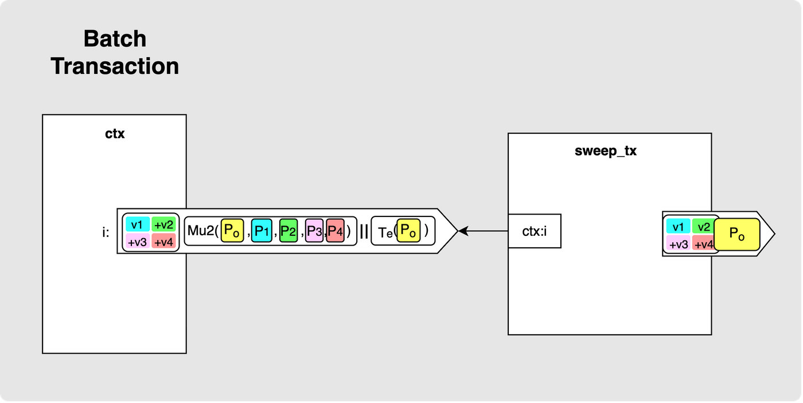

### 出现退出之后的情形

在 VTXT 上的一些交易出现在区块链上的情形（也就是一个或多个参与者尝试单方面退出的情形）中，运营者可以这样清扫还没被花费的输出：

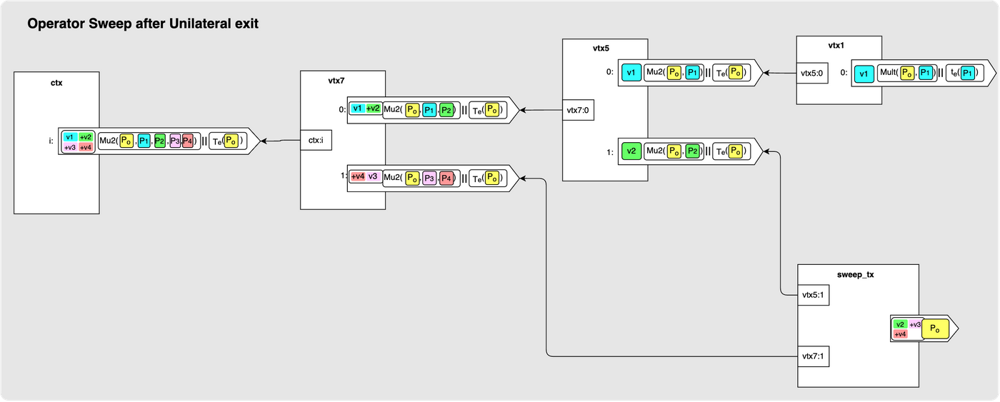

不论是哪一种情形，对于参与者来说，结果都是一样的：一旦运营者清扫了资金，这个批次就结束了。任何此刻还未被花费的 VTXO 都毁灭了。这没有什么好说的，因为过期是一开始就写在脚本中的，每个人都能看到它到来。所以，持有一个 VTXO 就意味着一种持续的一位：在 `Te` 到来之前做些什么。

这一点也值得我们三思。因为，一棵树并不是全部。实际上，可能在同一时间存在多个批次，共同形成一个 VTXO 集合。每个批次都有自己的过期时间，也许 `batch_0` 已经过期了，而 `batch_1` 和 `batch_2` 还在运行。

一个 VTXO 也并不必然只对应着一个批次。它的血统可能来自多个批次，每个批次都有自己的过期时间，而展开它就意味着要让所有这些交易都得到区块确认。所以，必须是它的血统中的每一个批次都依然未过期，它才有价值 —— 它毁灭的时间是其血统中最早过期的那个批次的过期时间。

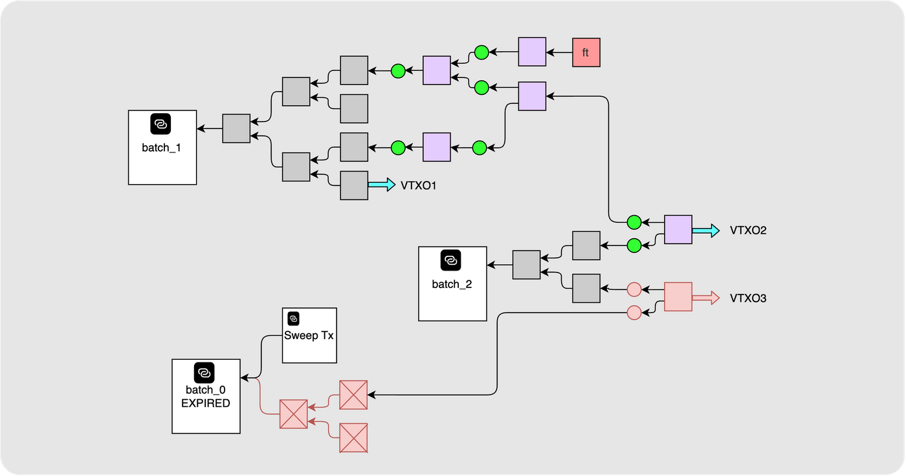

*这张图所包含的信息稍微超出我们已经解释的部分。这里的 `ft` 方形表示一笔弃权交易，一个 VTXO 如何从一个批次迁移到下一个批次是我们本系列接下来的两篇要解释的内容。目前为止，唯一需要明白的地方是，各个批次是分别到期的，而一个 Ark 实例总是包含多个批次。*

## 签名的顺序

在讲解一笔批次交易如何构造之前，值得指出一种模式，因为你会多次看到这种模式。它会在我们即将介绍的 “回合” 机制中出现，并在本系列第三批文章讲解 “回合外交易” 时再次出现。用户与运营者之间的几乎每一次交互，都遵循相同的四个步骤。

1. 用户准备自己的输入，但**不签名**。
2. 用户提交自己的输入。运营者构造好交易的最终形式（不论是什么交易），也不签名，将用户的输入用作交易的一个输入（或者说一个依赖）。
3. 用户检查结果。如果结果没问题，那就签名，当然，只是对自己的输入。
4. 运营者加入自己的签名并广播交易。

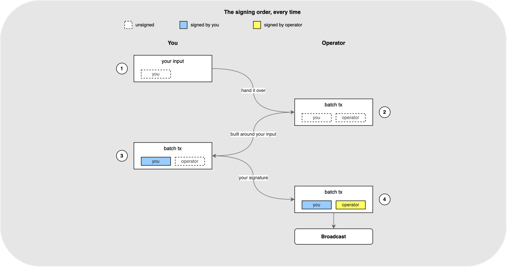

这个顺序具备两种属性，这是这两种属性使得这个流程是免信任的。

1. 在用户能看到自己将得到什么之前，绝对不需要付出任何东西。在他们进入第三步、需要签名的时候，最终的交易已经摆在他们眼前了。
2. 他们交出的签名是跟一笔交易绑定的。如果运营者永不广播这笔交易，或者下线，或者构造出不一样的交易，那么这个签名就失去价值，用户依然持有自己最开始拥有的东西。

所以，双方都无需信任对方。用户不能被骗去为自己不知道的东西付钱，运营者也不能被施加自己无法兑现的承诺。

请记住这个模式，因为我们接下来要讲的 “回合” 机制就是这种模式，只是参与者数量更多。

## 构造批次交易

我们已经看过了 VTXT 的结构。但还没有回答的是，如何进入这种状态。许多互不信任、也不信任运营者的用户，该如何进入这种状态，从而最终能让所需的批次交易出现在区块链上、且所有参与者都持有证明自己拥有一个 VTXO（存在于这个批次输出中）所需的证据、可以随时取回自己的钱？在这一节，我们就要解答这个问题。

我们要讲解的构造 VTXT 的案例，与前文所用的案例相似。我们将从 Alice、Bob、David 和 Carol 四个用户开始，他们分别使用公钥 `P1`、`P2`、`P3`、`P4` 。各参与者的最终目标是得到一个 VTXO，价值分别为 `v1`、`v2`、`v3` 和 `v4` 。在这个案例中，我们就假设还没有任何人参加过 Ark  ，所以所有的参与者都只有区块链上的 UTXO 。

**步骤 1：运营者广告使用条款**

运营者开启一个注册阶段。其公钥 `Po` 会提前公布，所有希望加入的参与者都会知道它，以及这个运营者的使用条款，比如一个批次的过期时间、单个 VTXO 可允许的 最小/最大 价值，以及 VTXT 构造将使用的叉数。

一个客户在一笔批次交易中可以执行多种动作，但目前，我们只关注 Ark 的用户进入流程：客户全都拥有链上的 UTXO ，他们希望换成 Ark 内的 VTXO 。

**步骤 2：每个参与者都创建一个入场输出**

每个参与者首先要创建一个链上的 “入场输出（boarding output）”。这个输出看起来非常像一个 VTXO ，因为它是由用户 “拥有” 的（可以在一个时延后由该用户单方面花费），但也有一个合作分支，该用户可以和运营者一起花费。一旦该输出获得足够多的区块确认，用户就会发送一个 “加入请求” 给运营者，告知一些细节，比如到哪里寻找这个入场输出、想要交换的 VTXO 的细节。其中的主要信息就是该用户想为自己的 VTXO 使用的公钥，以及想要获得的价值。用户也可以将一个入场 UTXO 换成多个 VTXO 输入，只要输入（入场 UTXO）的价值超过所请求的 VTXO 的价值之和。每个参与者都已经在这个注册阶段以前知晓这个运营者的使用条款（运营者的公钥，以及可预期的 CSV 超时时间）。

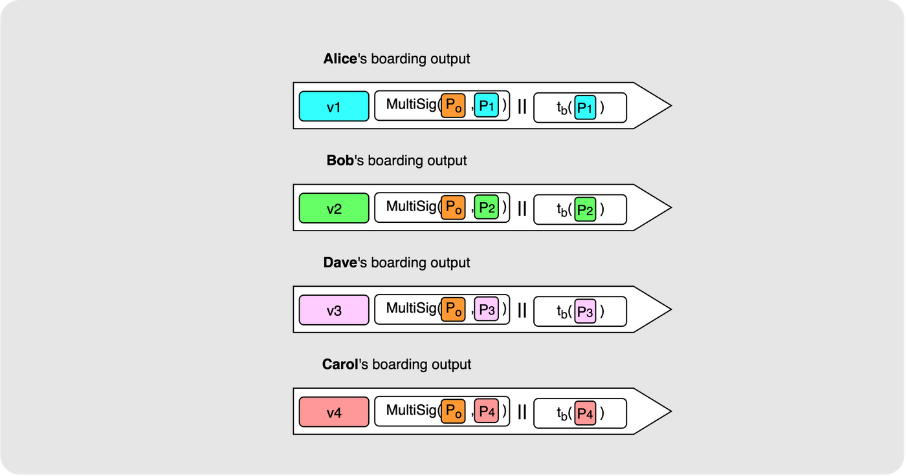

“加入请求” 是参与者说明自己的需求的地方。在这个案例中，每个参与者都只请求一个 VTXO ，但事实上也可以请求多个，只要入场输出的总价值超过所请求的 VTXO 的价值之和。

**步骤 3：封闭回合**

形成一个表示一棵 VTXT 的批次交易的过程，叫做 “回合”。在前面的注册阶段，一个回合依然在形成过程中，但到了某个时候，运营者会决定 “封闭” 这个回合，意思是不让新的参与者再参与到这个回合中来。这个时候，这个运营者就可以构造出完整的批次交易结构。首先要做的是构造出 VTXT 模版。这需要取得从参与者处收集的所有 VTXO 请求，并使用它们来构造整棵树（即，计算出树上所有的虚拟交易）。

这个时候，运营者已经知道了批次输出，所以可以构造出批次交易的剩余部分。TA 会使用来自用户的入场交易作为输入。TA 也会添加自己的输入，为交易提供更多资金，还会加上找零输出。

以下是完整的模版，用虚线框起来的空格是一笔批次交易可以填充的部分：

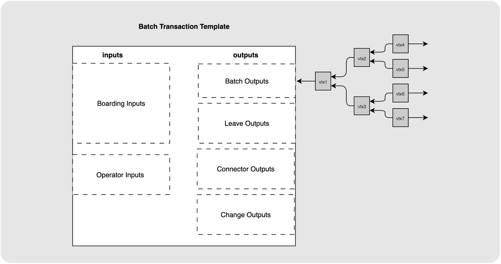

目前为止，这些空格我们只用到了一部分。“离场输出” 和 “连接器输出” 是人们要离开这个 Ark 实例或要刷新自己的 VTXO 时用到的输出，这是我们[下一篇文章](https://www.ellemouton.com/posts/ark-forfeits-and-connectors)的话题。

请注意，在这个时候，批次交易以及 VTXT 的结构已经为各方知晓，但还没有任何东西得到签名。用户不会愿意签名他们的入场 UTXO 的合作路径，除非他们确定自己将得到所请求的 VTXO 。所以，这个时候，运营者给每一位用户发送与其有关的待签名的交易。我们就以 Alice 为例，Alice 将得到：待签名的批次交易（该交易以 Alice 的入场 UTXO 为其中一个输入），VTXT 上的所有交易（从树根输出到 Alice 的 VTXO）。在签名之前，Alice 将验证这个通往她的 VTXO 的路径。

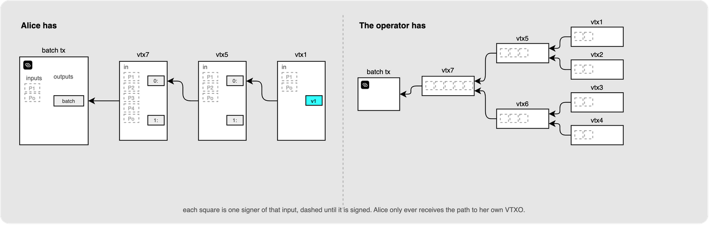

**步骤 4：签名交易树**

在一致同意这个模版之后，参与者们为这棵交易树运行签名会话，他们使用 MuSig2，这也是为什么分支交易输出和树根交易输出要切换成 MuSig2 合作路径。如果你想要回顾一下 MuSig2 的工作流程，请看我[以前的文章](https://www.ellemouton.com/posts/taproot-prelims)（[中文译本](https://www.btcstudy.org/2023/04/27/taproot-and-musig2-recap-by-elle-mouton/)）。

每一个参与者都只参与从批次输出到自己的 VTXO 的这个链条上的交易的签名会话。比如， Alice 只签名 `vtx7`、`vtx5` 和 `vtx1`，不会触碰 Dave 和 Carol 在意的分支交易。一旦所有会话都完成，树上的每一笔交易都得到了一个有效的签名。

这是一个对 Alice（以及任何参与者）非常重要的环节。持有从批次输出到她的 VTXO 的完全签名的交易链条，正是她以后能独自在区块链上展开交易树的能力的来源，所以在此之前，她没有理由交出任何东西。

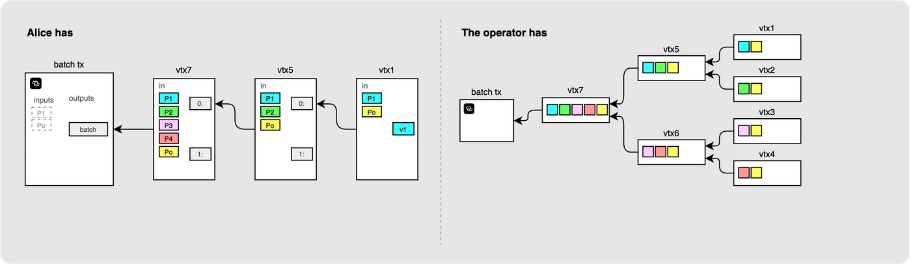

这些图简化了两个东西。每个输入都给每个签名人画了一个单独的卡片，这样你就可以看出谁参与了，但事实上，他们的签名会聚合成一个 Schnorr 签名，而不是每人一个单独的签名。此外，每次使用 MuSig2 生成一个签名，都需要额外的一轮交换 nonce 的回合，然后众人才能签名，这个我也没有画出来：就当它已经隐含在签名步骤中。

**步骤 5：签名输入并广播**

现在，她满意了，她可以签名批次交易的输入（花费她的入场输出）。她只签名自己的输入，这个签名也只对应这一笔批次交易。

运营者收集来自每一个参与者的输入签名、加上自己的输入的签名，然后广播这笔批次交易。当这笔批次交易得到确认，所有四位参与者就都得到了其中的 VTXO，并且这篇文章前半部分所说的交易树，就得到了这个真实的、得到区块链确认的 UTXO 的支持。

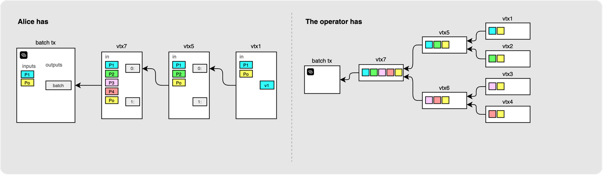

## 总结

我们从单个 VTXO 以及它的两种花费路径开始，延伸到一棵预先签名的交易所组成的交易树，并将这棵交易放到一笔链上的批次交易里面，并且走完了生成这笔批次交易的回合。

这就回答了我们文章开头提到的信任问题。运营者无法侵夺你的资金：每一个 VTXO 都有单方面退出路径，并且，在回合结束的时候，你将获得一串完全签名的交易，让你可以无需任何人配合就退出到区块链。运营者能做的不过是拒不合作，并且无论如何批次输出会过期。所以，取舍就是，你无法一劳永逸。

还剩下两个问题：

- 在我的 VTXO 过期的时候，会怎么样？运营者就这么拿走我的钱？
- 这么一来，我是有了 VTXO ，但它能用来做什么呢？

这两个问题留待后续文章来回答。

跟往常一样，如果你有任何问题、评论或纠正，尽情在评论区留下评论 ：）

