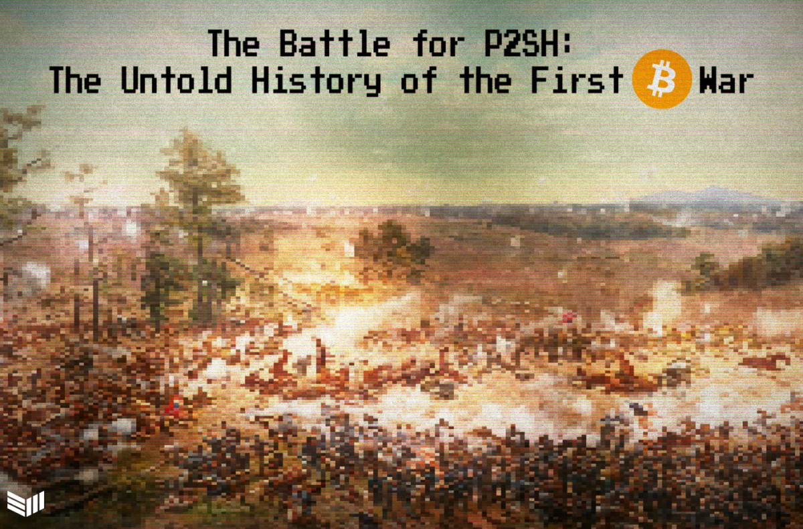

> *作者：APete Rizzo 和 Aaron van Wirdum*
>
> *来源：<https://bitcoinmagazine.com/technical/the-battle-for-p2sh-the-untold-story-of-the-first-bitcoin-war>*
>
> *原文出版于 2020 年 10 月。*

- P2SH 的传奇故事，展现了比特币独特的开发者社区、推动这种大变动的艰难，以及未来协议变更辩论的基调。 -

> “将时间倒退两个月。OP_EVAL 就是还没准备好。”

这是 Gavin Andresen 努力想避免的判决。随着 Russell O'Connor 敲击键盘发出这一声指责，为期数月的比特币升级 —— 也是比特币创始人中本聪离开之后的第一次升级 —— 在实现前夕陷入停顿。

如同 O'Connor 指出的，这个新提议的指令 —— Andresen 赞叹其为实现更安全的比特币钱包的 “最快路径” —— 可以被用来创建出特殊的交易，让尝试验证这笔交易的软件陷入无尽的计算循环。

简而言之，OP_EVAL 可以用来让比特币节点 —— 同时也就意味着比特币网络 —— 宕机。

“我花了 70 分钟的时间来发现这个 bug”，O'Connor 写道。他谴责这个流程将糟糕的代码合并到了人们正在使用的软件中 —— 甚至已经快要发布了。“你们这些人应该停止正在担任的工作，好好理解比特币。”

这是比特币项目的新带头人 Andresen 遭遇的第一次挫折，他也很快提出了抗议。在他看来，抛弃 OP_EVAL 不仅会浪费几个月的开发和审核，也会让用户失去保护自己的数字钱包免遭木马和病毒的工具。

这就是 OP_EVAL 提议的核心 —— 更容易实现的多签名钱包可以让用户即使弄丢了备份也能找回比特币；服务商在检测到欺诈和偷盗之后，可以像银行一样发起警报；而且，更好的是，这些都可以在交易中实现，其外观和行为都像用户已经知道的那样。

但 O'Connor 的警告已经足以让那些担心日渐加速的开发活动的人证实自己的担忧。

“我想提醒每个人，我们正在搞砸一个 2000 多万美元的项目”，开发者 Alan Reiner 写道，“它关系到的不仅是一个软件而已 —— 不管要加什么东西进去，都必须跟钻石一样坚不可摧才行。”

但 OP_EVAL 的失败还有更大的影响。中本聪推出了世界上第一种去中心化的数字货币，这是事实，但它的承诺还远远没有实现。到了 2011 年末，只有少数人能理解比特币的代码，而具备技能和熟悉度来保护它的人就更少了。

这些开发者应该怎么组织起来？他们对用户负有什么样的责任？如果不清楚谁 —— 哪怕是任何人都好 —— 可以最终拍板，他们如何为比特币激活变更呢？

在围绕比特币软件的第一次战争中，这些问题很快会被推到风口浪尖。

## 一个非正统的继承

自由和开源项目通常是由创始人领导的，而创始人反过来也必须跟他们的工作所依赖的贡献者保持一致。当然，在产生方向上的争议时，他们也拥有自然的权威来扮演他们的造物的决策者。

比特币在早期的时候也不例外。在它诞生的头两年里，中本聪扮演了开发主管和仁慈独裁者。作为比特币不争的带头人，他在没有大范围讨论的情况下推行了多达 8 次的协议变更 [[1](https://blog.bitmex.com/bitcoins-consensus-forks/)] 。这种情形一直持续到他逐渐退出这个项目。

在 2010 年底，中本聪将自己的化名从 Bitcoin.org 网站上删除，使得资深的 3D 图形开发者 Gavin Andresen 得以声称自己是这个项目 “事实上的领导者”[[2](https://soundcloud.com/twistartups/bitcoin-discussion-with-gavin)]。

Andresen 的措辞是很讲究的，因为这场转换的氛围不同寻常，总共分成三部分：公开消息的发布，私下里的责任移交，以及一把私钥的移交（该私钥可以发送覆盖整个网络的警告消息）。

当然，那时候，这对于比特币不断扩大但仍属小规模团体的开发人员来说不算什么。大部分人关心的依然是关键 bug 的修复，而 Andresen 是一位终身教授的配偶，他有时间和热情来领导这些工作 [[3](https://sourceforge.net/p/bitcoin/mailman/bitcoin-development/thread/BANLkTimZ5j7%3D1G89uRO9f7fHPdmDMpLMqg%40mail.gmail.com/#msg27661223)]。

确实，有许许多多急迫的需求 —— 更快的同步速度，更好的测试流程 —— 但 “日渐增加的钱包被盗报告” 以及由盗窃引发的 “糟糕的公关”，很快成为了热门话题。

有一段时间，这似乎是这套新的比特币贡献者团队共同认可的目标 [[4](https://sourceforge.net/p/bitcoin/mailman/bitcoin-development/?style=flat&limit=250&viewmonth=201106&viewday=13)] 。

## 裸露的多签名

幸运的是，中本聪早就提出了一个解决方案的蓝图。如 Andresen 后面发现的，比特币的代码已经允许用户创建只有被多个私钥签名才能花费的安全交易 [[5](https://bitcointalk.org/index.php?topic=38903.0)] 。

有了多签名（缩写为 “multisig”），相关的私钥就可以分散在多个设备中存储，而这些设备也不必放在一起；还可以在用户和钱包服务间分享。这意味着黑客要攻破多个目标才能盗窃一笔钱。

Andresen 被这个想法迷住了，他成为了第一个拥护者，在邮件组中发布了一份激情洋溢的情缘，号召贡献者一起行动。

“我最大的担忧是，我们嘴上说着‘当然，只需要几天我们就能对怎么正确实现它达成共识’，但半年后我们还是没有共识”，他写道 [[6](https://sourceforge.net/p/bitcoin/mailman/bitcoin-development/thread/CAJ1JLttqEnCjALadESmpntxSobD8Lj1zcXL4S7ghqdhyBrwVNw%40mail.gmail.com/)] ，“而人们的钱包依然在丢失、被盗窃。”

这种担忧不是没有来由的 —— 在中本聪的实现中，多签名有巨大的缺点。最大的问题是，这些交易与比特币的标准地址格式不兼容，必须使用长的多的地址。

因此，为多签名钱包提供资金的交易（体积）会大得多，因此需要更高的手续费。而且，这些手续费 *不是* 由收到比特币的人（多签名钱包用户）来支付的，*而是由发送比特币的人来支付的*。

因为这些不够理想的属性，多签名交易在软件中被定义为 “非标准的”，意思是它们不必然能传遍整个网络，有些节点可能会直接忽略这些交易。类似地，也无法保证矿工会在区块中打包这些交易。

如果这些交易被打包了，那么节点也会接受它（最根本来说，多签名交易也是有效的交易）。但实际上，这种定名使其几乎不可能被打包。

## OP_EVAL 到来

为了释放他看到的起立，Andresen 开始鼓吹一个新的 “操作码”。所谓操作码，就是节点用来确定一笔交易是否有效的指令。

为了适应更高级的交易比如多签名交易，OP_EVAL 从哈希函数中吸取了许多经验。哈希函数是一类密码学算法，可以将输入的数据确定性地打乱和压缩成一个独一无二的字符串，并且是不可还原的。

匿名开发者 ByteCoin 提出的[第一个提议](https://bitcointalk.org/index.php?topic=46538.0)是，用户可以将指定一笔资金的花费条件（包括存入多签名钱包和从多签名钱包中花费）的指令化为哈希值，而在交易中包含这个哈希值之后，资金的解锁条件也就用这个哈希值指定了。本质上来说，资金是 “发给了” 一个哈希值。

这个日后花费该笔资金所需满足的条件，只会在这笔资金 “从” 这个哈希值中花费的时候才会公开。因此，多签名的用户将在自己花费资金时为额外的交易体积付费，而且所需的额外数据对网络造成的负担也较小。

这个提议得到了正面的反馈，Andresen 没有浪费任何时间，表示希望 OP_EVAL 尽快部署。

“安全性是非常重要的；我希望能在一年内看到人们的论坛签名中出现安全的比特币地址”，他说 [[7](https://sourceforge.net/p/bitcoin/mailman/bitcoin-development/thread/CAJ1JLttqEnCjALadESmpntxSobD8Lj1zcXL4S7ghqdhyBrwVNw%40mail.gmail.com/)] 。

但并不是所有人都跟 Andresen 一样急迫。OP_EVAL 是对一个已经在运作的、承载着几百万美元价值的系统的一次重大升级。在 Andresen 的大洋彼岸，年轻人 [Amir Taaki](https://bitcoinmagazine.com/articles/bitcoin-technology-worth-nothing-interview-dark-wallet-front-man-amir-taaki-1412722833) 建议开发者花些时间来审核这个提案。

“乍看起来没什么问题”，Taaki 写道 [[8](https://bitcointalk.org/index.php?topic=46538.msg553903#msg553903)]，在“但快速将它加入区块链中可能不是什么好主意 …… 比特币不会明天就崩溃，所以推迟这样的重大变更也不会有重大的损失。”

让事态更加复杂的是，开发者们假设为协议加入 OP_EVAL 在协作会面临重大挑战。激活这样的变更必定会给区块链带来风险：区块链是对所有比特币交易的确定性记录，而这种形态是由整个网络对软件规则具有广泛的共识来保证的；引入这样的变更，可能会使网络分裂成互不兼容的部分。

这意味着，当 OP_EVAL 要激活的时候，每一个用户都要切换成一个新的软件版本（或者说一个新的区块链网络），如果我们用的是所谓的 “硬分叉” 升级方法的话。

如果不能全体一致升级，矿工可能会在不知不觉中生产 “无效的” 区块。更糟糕的是，用户也可能在不知不觉中接受 “无效的” 交易。 

## 新型的软分叉

不过，很快，Andresen 就意识到可以安抚那些批评者。

作为一个俏皮的技巧，他揭露 OP_EVAL 可以通过重新定义由中本聪引入的几个不会触发动作、为了未来的指令预留的占位操作码来部署。

令所有人（包括 Andresen）意外的是，那些不升级的节点也能与这种升级方式兼容。因为这些节点只会检查哈希值是否与新指令相匹配，而不会执行这些指令，相反只会默认接受这笔交易（作为有效的交易）。

只要大部分矿工都实施这个新规则，那么新的区块链对升级的和没升级的节点就都是有效的。升级后的节点会接受这条区块链，因为新的规则没有被违反；而没有升级的节点也会接受这条区块链，因为它们根本不知道新规则是什么样的。

这种后向兼容的升级，或者说 “软分叉”，中本聪已经操作过，但随着网络规模的增大，开发者才开始担心升级需要覆盖的人群的绝对数量。

不出意外，Andresen 的这种理解在他跟一些资深的贡献者分享之后，得到了他们的欢迎。

“哇，Gavin 说 OP_EVAL 不必造成分裂就可以出欻吗，实在出乎我的意料”，Gregory Maxwell 立即对这个发现作出评论 [[9](https://web.archive.org/web/20131201200245/http://bitcoinstats.com/irc/bitcoin-dev/logs/2011/10/02)]，“值得干一杯（Bring out the [sic] champaign）！”

以此为基础，开发者继续推出了更安全的激活软分叉的方法。他们的理论是，我们可以开展类似于民意调查的活动，来确定一个特性是否得到了来自矿工的足够广泛的支持，从而确保安全升级。

矿工被请求在自己挖出的区块中包含一个比特的数据，来表态自己是否会执行新规则。如果大多数矿工都已经准备好了，相关的变更就会被激活 [[10](https://sourceforge.net/p/bitcoin/mailman/bitcoin-development/?style=flat&limit=250&viewmonth=201112)] 。

## 致命的错误

但所有的工作都因为 O'Connor 的发现 [[13](https://sourceforge.net/p/bitcoin/mailman/message/28617066/)] 而失去了意义。

开发者因此分裂成了两派，一派认为推迟发布 OP_EVAL 是没有必要的，而另一派认为，前者提出的快速修复提议会伤害比特币的脚本编程语言的一些良好特性 [[14](https://sourceforge.net/p/bitcoin/mailman/message/28617066/)] 。

包括 Luke Dashjr、Pieter Wuille 和 Maxwell 在内的开发者建议使用一种替代方案，它很像 OP_EVAL，使用了 “向一个哈希值发送资金” 的想法。但让这个逻辑 —— 他们开始称其为 “给脚本哈希值支付” 或 “P2SH” —— 作为软分叉进入比特币、避免区块链分裂的挑战依然存在。

现有的操作码只能走这么远。但未升级的节点要在不理解新规则的前提下，接受从哈希值中花费资金的交易。

又是 Andresen 发现了前进的道路，而且他的 P2SH 解决方案根本不需要使用一个新的操作码。相反，Andresen 的想法是，比特币可以被编程得识别初特定格式的交易，然后以非传统的方式来解释它、用新的指令来验证它。

任何没有升级的节点都会使用传统的逻辑来解释这种非传统的格式。就像 OP_EVAL 一样，交易将总是被不升级的节点理解为有效的交易。这就意味着 P2SH 可以被部署为一个软分叉：只要大多数的算力都执行这个新规则，无论新老节点，都可以对同一条区块链达成共识。

Andresen 的提议似乎让绝大多数人满意了。“一眼看去，感觉 …… 可以接受”，O'Connor 回复 [[15](https://sourceforge.net/p/bitcoin/mailman/message/28617230/)] 。 Taaki 引用了代码的非传统方法，说：“这个想法非常大胆 …… 但我喜欢。”

在后来的一场开发者会议上，这种观点占据了主导，而与会者都同意实现  Andresen 的 P2SH 提案。矿工将在 2 月 1 日的一周内投票，如果大多数算力（超过 55%）都表态支持，一个新版的客户端就会发布，在两周后激活这个软分叉。

和平只持续了几天。

## 你怎么不用美元呢？

打破共识的是 Dashjr，他在那场会议开始后不久就离场了，后来才知道 Andresen 的 P2SH 提议成为被接受的折衷方案。

Andresen 方案的非传统特性刺激了 Dashjr，他认为这使协议变得更加复杂，而且带来了不确定的后果。他向 Andresen 提出了这个问题，但后者不认为这种担忧值得改变整个计划 [[16](https://bitcointalk.org/index.php?topic=58579.msg690145#msg690145)] 。

在自己的建议遭到拒绝后，Dashjr 于 1 月中旬在公开的 BitcoionTalk 论坛上开炮，痛斥 P2SH 并指责 Andresen “一意孤行” 支持这一变更 [[17](https://bitcointalk.org/index.php?topic=58579.0)] 。

“Gavin 正在强迫每个人使用最新的比特币代码来为【P2SH】投票”，他写道，“如果你想要反对这个疯狂的协议变更，你需要改变自己的 BitcoinD 源代码，不然你会默认投出**支持票**。”

因为他的反对意见与其它反对意见的幽微差别，以及他发言时候的傲慢态度以及他对 Andresen 的谴责，这篇帖子的回应并不热烈。一些人认为 Dashjr 没有让技术争论限制在开发者内部，而是试图发起群众斗争。

Dashjr 是这个项目最理想主义的贡献者之一，因为给另类的数字系统作长篇大论的辩护和强烈的基督教信仰而知名。但这些都无济于事。一个论坛用户说，Dahjr 的评论让他自己显得 “精神不正常” [[18](https://bitcointalk.org/index.php?topic=58579.msg690009#msg690009)]。另一个用户则说自己完全不想纠结于这些细枝末节的问题，自己就是相信 Andresen [[19](https://bitcointalk.org/index.php?topic=58579.msg690009#msg690009)]。

作为回应，Dashjr 从哲学层面对 P2SH 提议展开了持续的反对，不仅列举了它的技术特性，还争论了它在治理上的影响。

“如果你只是想要一种君主制的货币，你怎么不去用美联储的美元呢？” Dashjr 质问他的批评者，却遭到其他人的纠缠，声称他只是在争权 [[20](https://bitcointalk.org/index.php?topic=58579.msg690042#msg690042)] 。

Dashjr 没有退缩，他编写了 P2SH 者一个替代版本，叫做 “CheckHashVerify（CHV）”。CHV 本质上是另一种 P2SH 实现 —— 但它不需要对交易输出的非传统解释。相反，CHV 就像 OP_EVAL 一样加入了一个新的操作码，可以被 “伪装” 成占位符操作码。

但对 Andresen 来说，现在才来辩论已经太晚了 [[21](http://azure.erisian.com.au/~aj/tmp/irc/log-2012-01-14.html)] 。除了对公众的情绪感到愤怒，他代表自己个人，回应道：

“Luke，你是在挑战我的耐心。我会先离开几天，好让自己冷静下来，不去干什么蠢事。”

## Genjix 出现

随着 Andresen 的 P2SH 设计（以下简称 “P2SH”）被普遍认为是得到了这个项目的领头开发者推崇的一个足够好的解决方案，Dashjr 发现自己辩护者寥寥。

现在轮到 Taaki 成为少数派的代表，要求人们严肃对待边缘化的意见了 —— 但这不一定是因为他反对 Andresen 的方案或者支持 Dashjr 的。

这个开发者只有 20 岁出头，已经是比特币最外露的贡献者之一了，虽然那时候他还没有新闻头条中的无政府主义者、在监狱里发起黑客攻击、与使用 3D 打印技术制造枪支的人一起混，但他对软件的愿景是成为一项反建制的运动，这已经把他挤出了比特币项目开发的核心圈子。

但是，这反过来加深了 Taaki 对整个项目日渐加速的开发流程的不信任。他更希望整个过程可以花费更多时间、容纳更多用户的意见。

在 Taaki 看来，一小群开发者自作主张并不会让比特币变得更好。他强烈感觉到，任何对比特币感兴趣的人都应该知道开发中的取舍，并尽可能参与到决策制定中。

“我更希望普通人也有发言权，即使这会让开发者更难解释自己的决定”，他告诉其他开发者 [[22](https://buildingbitcoin.org/bitcoin-dev/log-2012-01-14.html)]，“如果你只是告诉用户软件会变成什么样，而且他们没有发言权，还比划了一个中指，我很担心后果。”

Takki 也同意，Andresen 的 P2SH 和 Dashjr 的 CHV 提议的区别很小，但他依然认为，让用户参与到开发过程中，是一个重要的活动。

“我的担心是有一天比特币会腐化掉。请把这种额外的审查看作是建立开放文化的机会”，他是这么说的。

为了尽自己的努力，Taaki 写了一篇博客来介绍 P2SH 和 CHV 升级，以及两者之间的区别 [[23](https://bitcointalk.org/index.php?topic=61705.20)]。

在 Takki 的信息中，用户是可以选择的，而且， “投票将基于算力”。

## 极为难搞的情形

Takki 的遣词造句已经点出了房间里的大象（译者注：指极为明显，但被视而不见的事物）。没错，中本聪是激活过软分叉，但是到了 2011 年底，网络已经不再像早期那样运行了。

在中本聪发表白皮书的时候（2008 年），他假设了工作量证明将由在个人电脑上运行软件的贡献者来提供。他说过，“工作量证明就是一 CPU 一票”。

在这种设计下，任何用户都可以是矿工，都可以通过生产区块、验证对等节点传播的交易和执行开发者编写的代码来保护网络。

但在比特币软件发布后的几年里，这个模式已经被具备企业家精神的人抛弃掉了。自从 Lazlo Hanyesz（没错，就是用[比特币买比萨](https://bitcoinmagazine.com/articles/the-man-behind-bitcoin-pizza-day-is-more-than-a-meme-hes-a-mining-pioneer)的哥们）发现了如何用更强力的图形处理单元来生产比特币之后，技术专家们就一直在尝试把挖矿从业余爱好变成一个小型企业。

与此同时， Marek “Slush” Palatinus 发明了一种方法，可以让矿工把算力汇集成矿池并按比例分享收益。这从本质上让挖矿变得更不像彩票，而更像一种稳定的收入源。

到了 2011 年底，三大矿池 —— DeepBit、Slush Pool 和 BTC Guild —— 就控制了超过一半的全球算力。这已经不是 “一 CPU 一票” 了，“票” 都控制在少数几个矿池的运营者手中，就好像他们是自己的网络选民的代表。

对一些人来说，这就是比特币网络已经跑偏的证明。“我认为，【一个矿池】就能决定网络要怎么走，就是一场披着投票外衣的闹剧”，早期矿工 Midnightmagic 指责道 [[24](https://buildingbitcoin.org/bitcoin-dev/log-2011-12-20.html)] 。

对于其他人来说，挖矿的中心化是朽木拐杖 —— 当然不好，但也让软分叉变得更容易管理、理论上风险更小。（毕竟，只有几个矿池运营者支持就能做到安全发布）。

比如，Maxwell 就更乐于接受眼前令人不满的现实 [[25](https://buildingbitcoin.org/bitcoin-dev/log-2011-12-19.html)]。

“如果出现了重大阻力，开发者和矿池都会退缩，但现在没有人在哪个场合看到了这么大的反对意见”，他回复道，“这是一个未来可以使用的良好机制 —— 只要我们幸运，不会出现比特币不再去中心化的极为糟糕的情形”。

## 投票还是不投票？

Andresen 和 Dashjr 的提议针锋相对，也让对比特币治理的不同观点浮现出来，事情于是更加复杂。

在此之前，开发者一直把即将到来的软分叉升级视为一种投票：矿工内部会形成一个多数派，表示执行 P2SH（或者 OP_EVAL）列出的新规则，所以，投票是为了评估出现这些结果的可能性。

但是，虽然这些术语都已经烂大街了，它们在技术上的细微差别被省略了。在开展调查时，开发者实际上并没有询问矿工对这些新规则的看法，相反，他们只把这个当成一种检查矿工是否已经准备好确保安全升级的办法。

这样来看，对开发者来说，合理的做法当然是只把一种用户和矿工最终会支持的提案加入到软件中。

“比特币**不是**一个遵循多数决的系统。不是看算力的多数，也不是看人口的多数，更不是看钱的多数”，Maxwell 说。他对 Takki 把这个决策过程说成是投票感到恼火 [[26](https://bitcointalk.org/index.php?topic=61922.msg723476#msg723476)] 。

Maxwell 强烈坚持，矿工的 “投票” 应该仅局限于他们在软件运行中的位置，也就是保证交易的排序 —— 而不能延伸到投票表决整个网络的规则。

“要是绝大多数 —— 甚至是 100% —— 的矿工都决定把区块奖励永远固定在 50 BTC，你怎么办？没有任何所谓。从比特币网络的视角来看，改变了规则的矿工就是从此消失了而已”，Maxwell 这么说。

Dashjr 并不是不同意 Maxwell，但实事求是，他很难想象，如果开发者不考虑矿工的支持，直接推出变更，比特币如何保持安全性。

“矿工可以直接拒绝打包 P2SH 交易，从而不受 ‘开发者团队的决定’ 的影响”，他回复道 [[27](https://bitcointalk.org/index.php?topic=61922.msg723520#msg723520)] ，“如果 ‘开发者’屏蔽所有矿工，你猜接下来很发生什么事？很容易就会出现 50% 攻击，网络就不安全了！”

从这个角度来看，你就很容易理解为什么 Dashjr 认为 Andresen 单独推动 P2SH 是在滥用自己作为开发者领导的角色。如果矿工都使用标准的软件来挖矿，他们不知不觉中就会成为一个支持 P2SH 的 “投票”[[28](https://bitcointalk.org/index.php?topic=58579.0)] 。作为回应，Dasjr 编写了软件的补丁，将他自己喜欢的提议加入到算力 “选举” 中，并为矿工加入了同时支持或同时反对 P2SH 和 CHV 的选项。

虽然很少矿工使用这份代码，Dashjr 的反对产生了效果。当时全网最大矿池 DeepBit 的运营者 Tycho，开始感觉自己是在评估相互竞争的代码，并对这样的角色感到不舒服。

他表示，显然开发者们还没能达成共识：“我不想做决定这件事情的唯一人选”[[29](https://bitcointalk.org/index.php?topic=61125.msg714231#msg714231)] 。

## 僵局

在拒绝一个矿池可以（甚至是出于便利）左右升级决策的想法时，Tycho 也为这场辩论增加了一道转折，因为，他的支持意味着超过 30% 的算力；没有他的支持，P2SH 将很难激活。

在 1 月底，第一轮的 P2SH 投票接近尾声，而且看起来无法达到所需的阈值。升级不得不推迟，这不仅让 Andresen，也让其他开发者感到沮丧。

在 IRC（互联网在线聊天室）中，Maxwell 公开表示，这种僵局似乎永远没有尽头。

“那个 ‘加油（hurry）’ 的表情包就是垃圾，Gavin 从什么时候开始搞这个【支付到脚本哈希值】路线的？10 月份，没错吧？”，他写道 [[30](http://azure.erisian.com.au/~aj/tmp/irc/log-2012-01-22.html)] ，“要我说，除非谁能划定一个终止时间，不然这个过程永远不会结束，因为永远会有**下一个**人说自己的好想法被忽略了。”

Andresen 则认为，导致推迟的不是矿池，而就是 DeepBit 的掌门人 Tycho 本人。他说：“现在看来，某个人的算力已经多到足以否决任何变更了。”[[31](https://bitcointalk.org/index.php?topic=61125.0)] 

Andresen 因此感到很不舒服，他认为 Tycho 的立场是不道德的：“我觉得，你利用自己作为最大矿池营运者的身份来反对普遍的共识，是错误的。”[[32](http://azure.erisian.com.au/~aj/tmp/irc/log-2012-01-23.html)] 

实际上，即使 Andresen 开始诉诸公众压力，敦促矿池的用户要求矿池升级 —— 并且提出，如果 P2SH 导致任何资金损失，愿赔偿所有的损失 —— Tycho 也不愿意 “投票” 支持 P2SH [[33](http://azure.erisian.com.au/~aj/tmp/irc/log-2012-01-23.html)] 。

于是 Andresen 尝试召集大众参与进来。他坚持认为，选择 P2SH 还是 CHV  对用户几乎没有什么影响。

他写道：“所有的【P2SH/CHV】讨论，都只是工程师们在争论到底该用钉子还是胶水来固定两块木板。不论怎么做，都不失为合理的办法，而且普通用户几乎感觉不到有什么差别。”[[34](https://bitcointalk.org/index.php?topic=61125.msg712822#msg712822)]

从帖子的回复来看，比特币的用户接受了 Andresen 的意见，指责 Tycho 阻碍了分叉并催促他激活。

但 Tycho 反过来强烈反对 Andresen 的指责。他知道，即使自己掌握着  30% 的算力，剩下的矿工也有能力否决他，而且他不想成为那个决定性的因素。

## 第二回合

因为 P2SH 一直没能积累到足够的算力支持，Andresen 被迫越来越多地在公开场合讨论他的提案如何前进，而且令人瞩目的是，他开始接受 CHV 作为打破僵局的潜在选择。

当然，那些认为选择应该交给矿工的人，和那些更倾向于精英决策的人，给出的回复依然是泾渭分明。

“最终来说，矿工是**唯一**对这个问题有决定权的群体”，比特币论坛的用户 dooglus 说，“只有他们能决定一笔交易能不能打包进区块。”[[35](https://bitcointalk.org/index.php?topic=61922.msg722860#msg722860)] 

论坛的主管 Theymos 完全反对这种想法。“非矿工可以拒绝区块。只要有足够多的人这么做，这个矿工挖出的币就会化为乌有。”[[36](https://bitcointalk.org/index.php?topic=61922.msg722874#msg722874)] 

他反过来建议由一些专家组成一个核心圈子，参与一个为期两周的讨论，最终投票表决 [[37](https://bitcointalk.org/index.php?topic=61922.msg722833#msg722833)] 。不知是因为这个提议还是巧合，Dahjr 很快创建了一个 Wiki 页面，一些受人尊敬的开发者可以在其中表达自己的偏好。

接下来一段时间，Maxwell、Thomas 和 Wuille 都表示，无论是 P2SH 还是 CHV，他们都可以接受，但他们都清楚表示自己更喜欢 P2SH。O'Connor 和 Dashjr 同意 P2SH 也是可以接受的，但更喜欢 CHV [[38](https://en.bitcoin.it/w/index.php?title=P2SH_Votes&oldid=23259)] 。

也许并不令人意外，Andresesn 为了确保得出支持 P2SH 的结果，对 CHV 提议发出了大声的反对。

更重要的（也许）是，很少的矿工支持 CHV。到了 2 月中旬，P2SH 已经得到了超过 30% 的算力的支持，而 Dashjr 的提议只有约 2% 的算力支持。

在 IRC 的一场会议上，Dashjr 表示他正在考虑是否要完全撤回 CHV，勉强地接受 P2SH 的主导地位 [[39](https://buildingbitcoin.org/bitcoin-dev/log-2012-02-14.html#)]。在同一场会议上，与会者都同意设置第二次投票的截止日期为 3 月 1 日。

日子一天天逼近截止日期，越来越多矿工开始支持 P2SH，将支持的算力占比推到接近 55%。很快，Tycho 和 Dahjr 也只好接受同侪的偏好 [[40](https://bitcointalk.org/index.php?topic=68677.0)] 。

然后，Andresen 宣布软分叉会在 10 天内（2012 年 4 月 1 日以前）激活，新的共识规则将得到实施 [[41](https://bitcointalk.org/index.php?topic=71226.0)]。

P2SH，中本聪离开后的第一个协议升级，被激活了。

## 小题大做

整个艰难的政治流程最终推出了 P2SH，但在软件之外，它的余波还在荡漾。

最终，Andresen 得以部署他所设计和偏爱的解决方案。如果说在此期间他的领导能力受到了质疑，那么最后，他的领导地位得到了巩固。

不关心具体细节的公众，大部分都联合起来反对 Dashjr，然后是 Taaki，认为他们是无事生非 [[42](https://bitcoin.stackexchange.com/questions/2682/why-are-the-majority-of-miners-not-voting-on-on-p2sh)] 。Andresen 甚至要求 Dashjr 不再向比特币贡献代码，虽然最终他似乎放弃了威胁，或者 Dahjr 直接无视了他 [[43](http://azure.erisian.com.au/~aj/tmp/irc/log-2012-01-31.html)] 。

与此同时，Maxwell 成了比特币的 “核心开发者” 之一，与 Andresen 和贡献者 Wladimir van der Laan 和 Jeff Gzrzik 共享对这个项目的代码更新权限。

而且，升级的基调已经定下：建设性的、务实的态度会得到嘉奖，而违反多数意见的贡献者会被排斥。虽然意识形态的差别已经浮出水面，他们维持了程序上的和平（也可以说被程序压制住了）。

随着越来越多用户涌向比特币，P2SH 很快就成了传说，但它会继续成为开发者之间分歧的导火索。

在一年后应对另一场新的危机时， Andresen 回顾了整个事件，并以各种方式自夸。这表明他相信 P2SH 证实了他的领导能力和对这个项目的愿景 [[44](https://bitcointalk.org/index.php?topic=189792.msg1967890#msg1967890)] 。

“区块大小会提高的”，在 2013 年初，他这么回应开发者 Peter Todd 为了反对提高区块大小的限制而制作的一个视频 [[45](https://bitcointalk.org/index.php?topic=189792.msg1967890#msg1967890)] ，“你的视频只是让大家杞人忧天，就跟 Luke-Jr 的【CHV】提议一样，只是小题大做，没有任何意义。”

在第一个去中心化的数字货币中，到底该怎么做决定呢？人们最终问出这个问题时，又打了另一场更大的战争、花去了几年时光，才得到答案 ……

（完）

