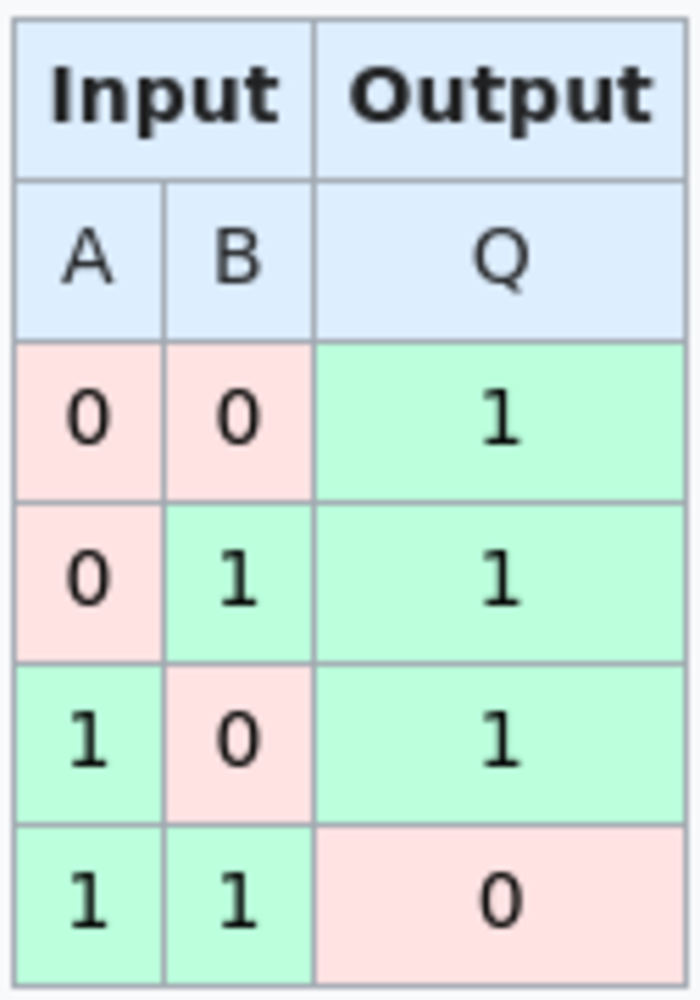

> *作者：Shinobi*
> 
> *来源：<https://bitcoinmagazine.com/technical/the-big-deal-with-bitvm-arbitrary-computation-now-possible-on-bitcoin-without-a-fork>*

敬畏巫师。我说的不是那些巫师，是真正的巫师。（译者注：作者这里应该是在讽刺一些打着 “Taproot Wizards（Taproot 巫师）” 旗号的人：真正的创造并不来自这些装腔作势的人。）

今天，ZeroSync（一个为使用零知识证明拓展比特币而成立的协会）的开发者 Robin Linus 提出了 “[BitVM](https://bitvm.org/bitvm.pdf)”，为将来的比特币应用开发打开了非常有趣的可能性。它可以启用几乎所有的任意计算，并使用这些计算来执行在比特币链上发生的事情。

而且，它完全不需要共识变更。其中的诀窍是，将所有的逻辑都放在链下，并在其他人断言了不诚实的结果时，在链上用少数几步计算来挑战这些结果。换句话说，BitVM 将以可以强制执行的方式，为比特币带来任意的图灵完备的计算 —— 就现在。

## 逻辑门基础知识

为了完整理解这个提议背后的机制，我们需要理解计算的一些物理基础和逻辑基础。

大家都知道，在你的电脑机箱里面，电流只是在不断地传递一些 1 和 0，来实现计算机的所有功能，这是怎么做到的呢？这有什么启示？

构成你的计算机的每一块芯片，实际上都是由数百万、数十亿的叫做 “逻辑门（logic gates）” 的东西组成的。

逻辑门会接收一个或两个 “比特” 的信息，每个比特都要么是 1，要么是 0，然后执行一个简单的逻辑运算，产生出一个结果（输出），这个结果也要么是 1，要么是 0。执行完之后，再将结果传递给下一个逻辑门。

有许多种逻辑门，有一些只接收一个比特，然后输出相同的数字（缓冲门）。有一些会接收一个比特，然后输出跟输入相反的数字（非门，也叫 “转换器”）。还有一些逻辑门会接收两个比特，如果这两个比特都是 1，那就输出 1，否则输出 0（与门）。最后，至少在这个案例的列表中，它算是一种门，它会接收两个比特，如果两个比特都是 1，就输出 0，否则输出 0（与非门，也称 “反和门”）。

- 与非门的输出输出关系 -

与非门的有趣之处在于，只需与非门，你就可以开发出任意类型的逻辑门。当然，它不可能有其它专用类型的门那么高效，但还是能做到的。所以，给定你可以用与非门构造任意类型的逻辑门，你可以用它来开发用于任意计算的电路。

## 在比特币上构造与非门

那么，现在，我们怎么在现有的比特币脚本上构造与非门？哈希锁和另外两个你可能不熟悉的操作码：OP_BOOLAND 和 OP_NOT。

首先，我们来看哈希锁。你可以创造一种分支脚本，可以用两种方式之一来花费，要么，向哈希锁 A 揭晓原像，要么，向哈希锁 B 揭晓原像。路径 A 将输出数字 1 到堆栈，而路径 B 将输出数字 0 到堆栈。

所以，通过选择向某个哈希锁提供原像，你可以 “解锁” 1 个比特，用作我们要构造的 NAND 门的一个输入。你只能满足其中一个脚本，而不能同时满足两个，我们后面会简单解释其中的原因。这个简单的元件只是为了允许与非门脚本的用户一次只提交一个比特。

现在，回想与非门是什么样的，它取两个比特，输出一个比特。如果两个输入的比特币都是 1，就输出 0。如果输入是其它组合，就一律输出 1。你可以使用两个上述的哈希锁技巧来提交这两个输入，还可以用来提交输出，只需一种办法来验证输出是正确的。这就是用到 OP_BOOLAND 和 OP_NOT 的地方。

在你选定哪个数值作为输入、要验证的输出值是什么的时候，你就可以利用这里的技巧。OP_BOOLAND 的动作跟与非门刚好相反，如果两个输入都是 1，那么输出也是 1；任意其它输入都会产生输出 0。而 OP_NOT 则会输出跟输入相反的数值，比如输入是 1，输出就是 0；反过来也一样。所以，结合两者，你就可以 *在脚本堆栈内* 取两个输入并做一次反和操作。然后，你可以使用 OP_EQUALVERIFY 以及上述的哈希锁技巧，验证所断言的输出。如果堆栈内实际上的与非操作所产生的输出，跟用户所断言的输出不一致，脚本运算就无法通过。

现在，我们已经在比特币脚本种实现了与非门，*实际上，这是用比特币脚本来强制一个虚拟的与非门正确运行*。

## 如何实现任意计算

好了，现在，可以在比特币脚本中实现一个与非门了，但这有什么用？你可以创建一棵巨大的 taproot 脚本树（tapleaf tree），覆盖任何一组任意计算的每一个步骤，就像实现计算机处理器的逻辑门一样。

为了实现复杂的计算，人们将逻辑门按顺序连在一起，所以，一旦你在第一个门传入初始输入，每一个门都会将输出传递给下一个门，作为输入。在这里，适当地使用门将哈希锁绑定在一起，就可以实现同样的事情。即，如果在一个门脚本中，不同的原像输入会产生输出值 C1 或者 C2，那么下一个门将使用在相应的输入中使用相同的哈希锁数值。这样一来，想要谎报上一个门的结果，就只能揭晓另一个 C 哈希锁。我们可以使用它作为一种惩罚机制。

两个用户选定他们想要参与的某一组计算，然后将这组计算分解成一个只有与非门构成的电路，在这条电路上，串联的一个又一个与非门接力计算，最终实现完整的计算。然后，他们取得并编码电路上的每一个与非门、为它们选定合适的哈希锁，然后将它们编码进一棵用来锁定 UTXO 的脚本树。脚本树的一个版本用来让某个用户尝试证明自己正在正确地执行承诺，而另一个版本则让另一方可以验证程序被正确执行了。现在，两个用户预先签名一系列的交易，以备用于可以在链上执行的挑战和响应游戏中。理想情况下，完整的计算应该在链下执行和验证，然后用户根据计算的结果一起结算这笔资金，让资金在双方之间合理分配。但是，如果证明者停止合作，验证者可以在链上挑战 TA。

第一步是为这个方案充入资金。一个脚本路径将让证明者可以在一个时间锁之后单方面提取资金。下一个脚本路径，将让验证者可以立即提取资金，只要他们能揭晓当前的门的任一输入的可能数值以及相应的结果。第一个脚本路径，将让验证者可以强迫证明者在链上执行某一个门合约（即，自证明者在链下停止合作起的下一个门）。这个路径要求验证者释放另一个哈希锁原像，这些原像只有验证者知道，用作对证明者的每一个门挑战的锁。这保证了证明者只能执行验证者指定的那个门。验证者的预先签名的、使用这个路径的交易，将把资金发送到带有下列脚本路径的输出中：验证者可以在一个时间锁之后取走资金，或者，证明者执行相应的门，然后将资金发回类似于初始脚本的脚本中（证明者可以在时间锁之后取款；验证者可以立即取款，条件是揭晓任意一对哈希锁的两个原像；又或者，验证者可以再次挑战证明者）。

只需几轮交互，就可以保证合约会正确结算。要么验证者不断挑战证明者，而证明者证明了每一个门的正确结果，最终验证者用尽预先签名的交易，让证明者可以取走资金；要么，证明者不响应挑战（这会让他们受到惩罚），然后验证者在一个时间锁之后取走资金；又或者，证明者在链上错误地执行一个门，那么验证者可以立即拿走资金。理想情况下，一切都在链下发生并且双方合作结算，但如果合作破裂，双方动用链上的挑战游戏，那么少数几轮之后，也只有合约得到正确结算这一个结果。

## 然后呢？

显然，这种规模的提议会在接下来的几周持续得到讨论。

这个提议需要处理和生成的数据量 *非常庞大*。需要用到的 taproot 脚本树的叶子可能有数十亿个，而相应的预先签名的交易至少需要几个小时来处理，才能保证准确的结算。

链下数据的保存成本也绝对是非常高的。

另一个重大限制在于，这种方案仅能用于两个参与者，一个扮演证明者，证明执行准确，另一方扮演验证者，挑战前者的声明。

虽然有可能未来的研究将找出办法，使之能容纳更多参与者，但至少我还看不出有什么办法可以做到。此外，即使解决了这个问题，也无法改变这是一种交互式协议的特性 —— 在合作结算的情景中，所有参与者都必须在线。

尽管如此，这是一个非常有趣的提议，展示了比特币上如何使用复杂的程序来执行条件式控制。当然还有优化的空间，比如，有多少逻辑可以放在脚本树的单个叶子上，以及不同的操作码如何让整个方案更高效。对基本操作的简单解构，以及博弈理论上的平衡，就足以在比特币上强制执行任意计算。

这才是真正的巫师杰作。

（完）