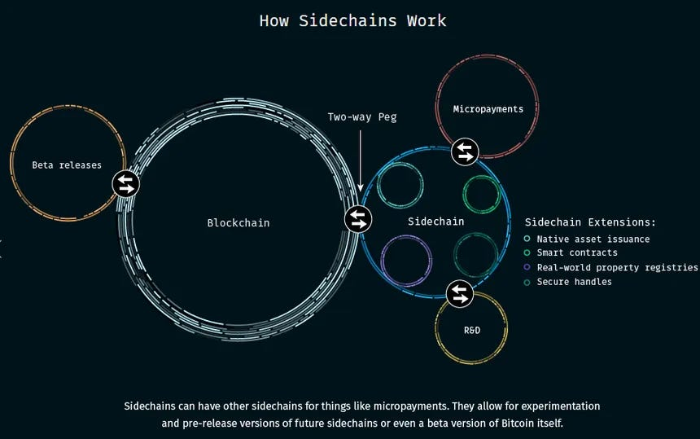
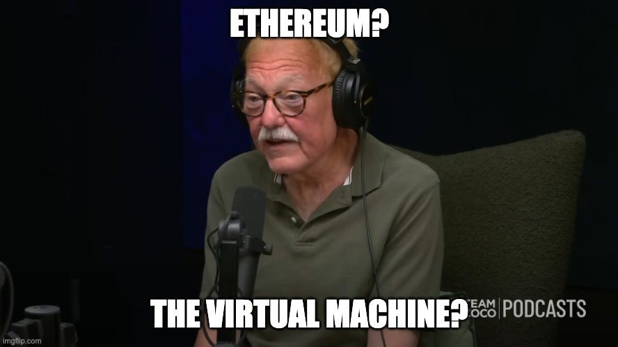
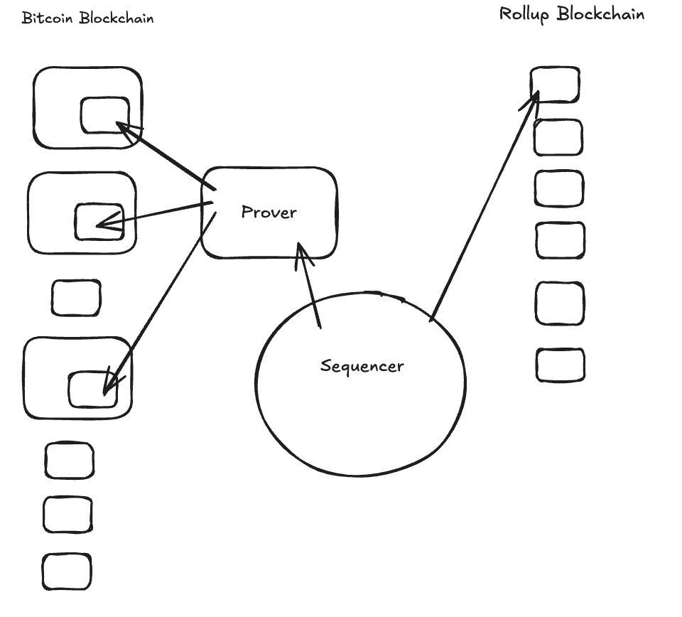
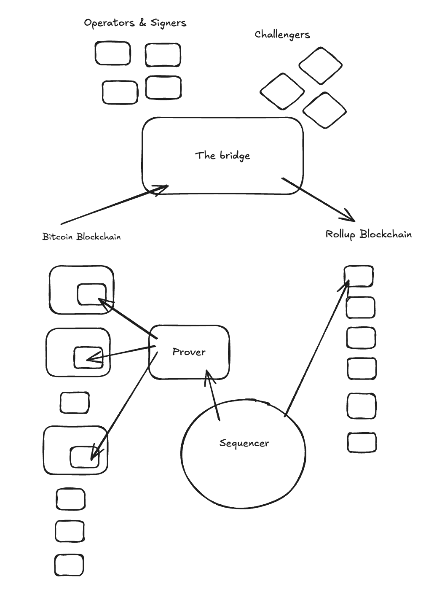

> *作者：stutxo*
> 
> *来源：<https://insider.btcpp.dev/p/the-bitvm-bridge>*

在上一个时代，2014 年左右，Blockstream 公司最初的[愿景](https://blockstream.com/sidechains.pdf)（传说中的 “BSV”？）就是通过多条侧链来扩大比特币网络的吞吐量，它们与比特币网络通过所谓的 “双向锚定” 来连接，从而比特币可以在多个区块链之间来回移动。然而在实践中，开发出这样的桥接合约，同时让用户无需信任一个第三方就能退出侧链，被证明比预想中要难得多。

另一种说法是，像以太坊（Ethereum）和 Zcash 这样的山寨币，只能算得上科学实验，用来测试最终会回归比特币的想法。这种预言基本上是落空了。

直到 2023 年，唯一一种源自其它区块链但回归到比特币的应用场景是：炒作小图片和 token，以 “[铭文](https://rodarmor.com/blog/how-ordinals-came-to-be/)” 和 “[符文](https://docs.ordinals.com/runes.html)” 的形式。这些协议构成了过去几年中比特币交易的多数，而更为传统的货币用途无法在区块空间的竞拍中持续胜过它们。

这很重要，因为对区块空间的需求是比特币的长期安全模型。以太坊的支持者们一直在[质疑比特币的安全预算](https://x.com/drakefjustin/status/1928025981270519924?s=20)，以及当区块补贴在 114 年后终止时，矿工的激励因素会发生什么变化。虽然他们连自己喜欢的那个区块链在 3 个月之后会怎么样也不知道，这是一个值得我们认真考虑的批评。

比特币网络的区块是满载的，但矿工的手续费收入不高。到 2036 年（区块补贴再减半 3 次以后），区块补贴将只剩下 0.390625 BTC（按照今天的价格来算，就是每年只有 17 亿美元，对于它要保护的全球经济来说，实在是杯水车薪）。这部分补贴是否足以保护比特币，还是一个悬而未决的问题，尤其是如果比特币继续被视为仅仅是 “电子黄金” 的话，链内交易活动（所带来的收入）也许无法让我们的辛苦工作的矿工满意。

幸运的是，还有一个理由对矿工激励不会改变表示乐观：对区块空间的一种新的需求，正以 “rollup” 的形式出现，它是 Blockstream 的愿景（可用的双向锚定）的真正继承者。

## Rollup

从 2020 年以来，以太坊项目就一直在沿着一个把 rollup 当成首要扩容解决方案的[路线图](https://ethereum-magicians.org/t/a-rollup-centric-ethereum-roadmap/4698)前进。与此同时，比特币的开发者们则专注于基于通道的扩容方案（闪电网络）、侧链（Liquid、Rootstock）以及中心化的托管解决方案（eCash、比特币银行）。最近，又出现了联合签名协议（Ark/statechain）的复兴，它们允许比通道更加集中的流动性管理，同时保管属性上的牺牲更少（相比托管方案）。

绝大部份比特币人，包括我自己，都缺乏对 rollup 的清晰理解，这很大程度上是因为，人们一直以为 [rollup](http://bitcoinrollups.org/) 在比特币上是无法实现的。[BitVM](https://bitvm.org/) 的出现改变了这一点，所以是时候该投以关注了。

结合了 BitVM 的 rollup 是一种扩大比特币吞吐量的提议，也有它自身的取舍。我来解释一下它是怎么工作的，以及它牺牲了什么。在比特币上开发有一套高标准。那么 rollup 设计能满足这些要求吗？

## 怎么区分 Layer 2 和非 L2 ？

很简单：

（在一个系统中）每一个用户，哪怕其他参与者是恶意的（装死、尝试盗窃或其它不轨行为），也能把钱退回到 L1（底层区块链）上，（这个系统）就算 L2 。

### **当前有哪些设计满足这个标准？**

- [闪电网络](https://lightning.network/)
- [Ark](https://ark-protocol.org/)
- [Statechains](https://bitcoinops.org/en/topics/statechains/)

### **那么一个基于 BitVM 的 rollup 是否满足这两个要求？**

还不能完全满足 …… 但别失望！不远了！在一个基于 BitVM 的 rollup 中，你只需要至少 1 个桥接合约运营者是理性行动的，你就可以取出资金（后文将详细说明）。

## 建立在比特币网络上的 rollup

一个 Rollup ，就是一个区块链，它在底层区块链（主链）以外的网络中执行交易，并提交状态转换的证据到底层区块链上，以供验证。Rollup 会在 L1 上承诺状态差异（或者说最后一批交易所造成的变化的总结）。在 L1 上公开状态差异，使得任何人都可以从初始状态开始按顺序应用每一个状态差异、重构出这个 Rollup 的最新状态。

我们先来了解创造一个 Rollup 所需的所有元素，然后转到 BitVM 这种图灵完备的脚本编程虚拟机如何参与其中。存在不同的方法和设计（Citrea、Alpen），但我们会得到一个通用的概述。

一个 Rollup 由以下几个元素组成：定序器、证明者、全节点和一个 “数据可得性（Data Availability）” 层。在我们分析的情形中，比特币区块链就是它们的数据可得性层。

### 定序器

定序器是 rollup 设计的核心。定序器收取所在 Rollup 的交易并组装成区块，也就是决定是否包含一些交易以及它们在区块中的排序。

你可以理解成一个使用秘密交易池的矿工。

定序器也设定所在 Rollup 的区块生成的速度。区块会按照 Rollup 的设计所决定的速度生成，并且是可以配置的。在实践中，出块时间通常是几秒钟（Citera 的出块时间是 2 秒钟）。

比特币的区块生成速度很慢，而且区块空间比较稀缺，所以定序器不会把每一个 Rollup 区块都发布到比特币区块链上，他会 “卷起（roll up）”区块并集体提交。一批区块还包含了状态差异以及一小部分叫做 “证据” 的数据，它们证明这些区块遵守了所在 Rollup 的规则。

一些 Rollup 会在证据就绪之前发布数据到底层区块链上，以预先承诺结果（例如 [Citrea 的 “承诺交易（commitment TX）”](https://mempool.space/tx/47865de7e8de80adbee4f69991b2d10302085c1767604697661cc70f6cb7ecc5)）。另一些则会发布 “检查点”，既包含对 Rollup 区块的承诺，又包含这些区块有效的证据（例如 [Citrea 的 “证据交易（Proof TX）”](https://mempool.space/tx/26516042296b5ab634beda701db6c0a939dca63d426ffaf0e02a0c340501cba1)）。这就让这个 Rollup 的这组区块在 L1 上有了锚点。

Rollup 批数据的大小也是可以配置的。批数据的提交可以是在积累一定数量的区块之后，也可以是整体的状态差异达到一定规模以后。

在这些设计中，rollup 区块会得到定序器的签名，并且 全节点/证明者 会验证这些签名。只有 状态差异/证据 会发布到比特币区块链上；rollup 的全节点们依然是从定序器或其他同在一个 Rollup 的对等节点处获取 Rollup 区块数据。不过，使用发布在比特币区块链上的状态差异来同步一个 Rollup 全节点，也是完全有可能的。

随附的证据的主要用途是让轻客户端或者桥接合约的运营者验证一笔 Rollup  交易已经被包含到了一个 Rollup 区块中，并且在比特币区块链上敲定。

### 证明者

在比特币网络中，一旦一个区块被挖出并传播到各个全节点，这些全节点就会验证这个区块遵守了比特币的全部共识规则。节点会执行区块中的每一笔交易（其中的每一个脚本）、检查签名和数额。这是相对快速而且容易的。

在一个 Rollup 区块链上，全节点做的也是相同的工作。只不过，为了得到一个全局同意的状态、让轻客户端和桥接合约运营者可以快速验证交易，一个证明者要在 L1 上发布执行了这些区块的证据。任何人都可以创建这样的证据，只是需要专门的软件和大量计算，可能要花费一些时间。所以绝大部分系统都使用一种定制化的设备来生成证据。

为了生成证据，证明者要从定序器处取得一个 Rollup 承诺，以及该承诺所涵盖的区块，重新执行这些区块，然后生成一个可以发布到比特币区块链的证据，一般来说要通过一种类似于铭文的外壳。一旦证据被发布到 L1 并得到足够多的区块确认（6 次或更多），Rollup 节点们就会接受它作为已经终局化的状态转换。普通的比特币交易得到 6 次区块确认就被当成是不可逆转了；一个 Rollup 证据发布到  L1 之后，它所涵盖的交易就被当成是不可逆转了。

用于 Citrea 和 Alpen 的证据是一种零知识证据，但我们不会追究其中的细节。你可以人为，这些证据的作用是让 桥接合约/轻客户端 可以验证 Rollup 状态，而无需重新执行一切（以得出最新状态）。不过，全节点依然会自己重新执行所有区块。 

### 全节点

所以，事实证明，“精通以太坊” 只是一本比特币书籍 :) Alpen 和 Citrea 都使用 “以太坊虚拟机（EVM）” 作为他们的 Rollup 的执行环境。

Rollup 上的手续费是用比特币支付的，并且是用已经进入 Rollup 链环境的比特币。它有点像 [WBTC](https://www.wbtc.network/) 。因为这些 Rollup  使用了以太坊虚拟机，所以手续费是以 “gas” 的形式计算的，只不过，使用的货币不是 ETH，而是已经桥接过去的、封装了的比特币。

用户和钱包把交易提交给定序器，通常是通过一个全节点的 PRC 界面。全节点向定序器获取新区块、验证它们（就像以太坊节点一样），然后更新自己本地的状态。出块时间是由定序器决定的。

因为所有的状态变更都随着证据承诺到了比特币区块链，全节点可以完全用比特币 L1 上的数据同步出来：遍历 L1 的区块数据、找出该 Rollup  的所有已经发布的状态变更，然后按顺序应用到该 Rollup 的初始状态上。最终的结果将跟这个 Rollup 的最新状态一致。不需要依赖于定序器。

在一个证据被发布到 L1 并得到 L1 的区块确认之前，相关的 Rollup 还只是由定序器 “软确认” 的。它们会被局部接受，但在其证据得到 6 次确认之前，相关的状态还不被人为是终局化的。

运行在 Rollup 上的许多应用都能从直接使用 Rollup 区块中获得好处。比如说，如果你的合约是一个游戏，那么也许你可以信任定序器，这样你的应用获得非常快的处理速度。不过，如果你是在一个去中心化交易所合约上完成一个大额买卖，那么也许你会想等待相关区块的证据被提交到比特币区块链上。

### 风险因素

中心化的定序器可能是 rollup 用户面临的最大安全风险。在以太坊的世界里，数十亿美元在信任类似的中心化装置；我觉得这对他们来说没什么问题。但比特币人要昧着良心才会认可这样的风险模型。所以我不认为人们会接受它。

也许我有偏见。不管怎么说，我自己就在开发 [char.network](https://x.com/char_btc)，它本质上是基于比特币的 rollup 可用的一种去中心化的定序器。而且，绝大部分 Rollup 都明确生命，将转向去中心化的定序器作为自己的路线图的一部分。

一些项目，比如 [Starknet](https://www.starknet.io/blog/starknet-grinta-the-architecture-of-a-more-decentralized-future/)，已经在使用去中心化的定序器架构了。在 Stacknet 上，这意味着有 3 个运营者运营着 3 个节点，只不过他们的名字都以 “Stark” 开头，以 “Net” 结尾。

这也会影响桥接合约的操作（我们接下来会讲到）。定序器可以总是拒绝你从桥接合约取款的交易。而如果这笔交易一直没有进入一个 Rollup 区块，你就没有办法让你的比特币回到主链上。

以太坊上的 rollup 尝试使用所谓的 “[强制交易](https://docs.optimism.io/op-stack/transactions/forced-transaction)”（绕过定序器、依然进入区块）来缓解这个问题。对于比特币上的 rollup 来说，强制交易还是一个开放的研究问题。

还有一点要指出的是，无论是谁，只要获得了运行中心化定序器的特权，都将能够从交易手续费和 “[MEV](https://ethereum.org/developers/docs/mev/)” 赚到许多钱。你可以说他们会被激励保持诚实，但他们依然可以轻易地审查交易和从桥接合约取款的请求。

用户在这套 rollup 架构下要承担的最后一种风险是向 L1 承诺状态变更和发布证据的成本。谁知道区块空间手续费市场在几年后会怎么样？向比特币区块链发布这些证据可能会变得非常昂贵。付得起高手续费的 Rollup 对比特币网络来说是个好事，但如果没有人使用这些 Rollup ，那么支付高费用来发布数据就在经济上无法持续，而用户将不得不承担退出资金的高昂费用。

定序器、证明者、Rollup 全节点和 EVM，解释了一个 Rollup 是如何运转起来的。那它与 L1 的 “双向锚定（2-way peg）” 呢？如何在两个系统之间来回移动比特币？

## 桥接合约

当前，比特币上的绝大部分桥接合约（Liquid、WBTC，等等）都依赖于一套联盟化的多签名装置，需要达到阈值数量的签名人同意，你才能取出你的比特币。我们将这种模式称为 “单向锚定（1-way peg）”，因为你可以把你的比特币发送到合约中，但需要足够数量的签名人的帮助，才能将它们取出来。

一个 BitVM 式的桥接合约，也是单向锚定，只是所需的参与者数量不同：只需要一个主动的运营者，按规则行事，就能取出你的比特币。理论上可以有 100 个运营者 —— 这下，你看出事情有趣在哪里了吧，只要其中一个运营者是理性行事的（并且依然在线），你就能取出你的比特币。也许我们可以称之为 ”1.5-way peg“。

你还依赖于一个挑战者，可以在某一个运营者尝试欺诈之际介入进来、证明欺诈。

在 BitVM 桥接合约 中，有运营者、签名人和挑战者\* 几个角色。

- 签名人的作用是在启动阶段 “锁定” 桥接合约 的规则。签名人通过预先签名唯一有效的花费路径然后销毁密钥，创造出一种 “模拟限制条款（*emulated covenant*）” 。只要哪怕一个签名人是诚实的（销毁了自己的密钥），以后就无法再创建出另一条取款路径、把钱发送到别的地方。
- 运营者在 Rollup 运行期间完成日常工作：观察 Rollup、提前取款，然后向桥接合约请求报销。
- 挑战者通过观察发布在 L1 的证据、挑战恶意的请求来确保运营者行事正派。

\* Citrea 使用了 “[瞭望塔](https://docs.citrea.xyz/glossary/glossary#challenge-and-dispute-transactions)” 的概念，这是一组得到许可的挑战者；不过我们不会细究了。

出于简化，我会假设桥接合约的签名人和运营者是同一群实体，虽然在概念上他们的任务不同。如果比特币升级了某种[限制条款操作码（比如 CTV）](https://utxos.org/) ，可以完全移除签名人这个角色。Citrea 确实使用了一种稍微不同的安全模型，使得签名人群体可以[更新](https://docs.citrea.xyz/advanced/clementine-signers#security-model)。

运营者创建和管理 BitVM 实例。他们在链外运行一个 SNARK 证明其，并使用预先签名的比特币交易（加上一个挑战窗口），强制执行一种围绕证明者输出的 “欺诈性证明（fraud-proof）” 游戏。

### 存款，或者说锚定

对每一笔新的存款，创建一个新的 BitVM 实例。一笔存款的数额预计在 0.5 到 100 BTC 之间。普通用户更大可能是通过 原子化互换服务/流动性提供者 来 进入/退出（类似于当前 Liquid 侧链/闪电网络 的用法），而有实力的用户将直接向桥接合约存入或从中取出大额的比特币。

首先，一位用户将自己的比特币存入一个中转地址中。这个地址允许桥接合约运营者将比特币清扫到桥接合约中。如果他们一直没有启动存款操作，该用户可以在一个时间锁解锁后独自取出自己的资金。

桥接合约运营者通过创建 L1 交易，将存款锁进比特币区块链上的一个 BitVM 桥接合约（或者说 UTXO）中。 这个 UTXO 的关键属性在于，在构造这个地址的时候，就将它预先锁定到一串交易中；如前所述，只要至少一个签名人诚实地执行了自己的任务，就只有这串交易能够花费这个地址。换句话说，除非 100% 所有的签名人都是骗子，否则这些比特币就只能按照预先定义的 ”桥接合约规则“ 来转移；而这些规则使得，当运营者被怀疑打破了规则时，挑战者可以挑战他们。

一旦存款交易在比特币区块链上得到确认，用户或者运营者就可以调用 Rollup 上的一个模拟了比特币轻客户端的智能合约，验证这笔存款已被包含到一个比特币区块，就此挖出封装后的比特币，放到用户在 Rollup 上的地址。

### 取款，或者说退出

取款也简单，只要一个运营者还活跃，以及，如有必要，至少一个参与者愿意挑战运营者。

以下是一个想从 Rollup 取回自己的比特币的用户要经历的步骤。

1. **在 Rollup 上燃烧**：这名用户在 Rollup 上烧掉自己的封装比特币（使它在 Rollup 上无法花费）。 

2. **运营者提前取出比特币**：用户使用 ANYONECANPAY 类型的 sighash，创建一笔不完整的比特币取款交易 输入，从而一个运营者可以为之增添输入（附加资金）。运营者们会相互竞争垫付比特币，并发布完整的取款交易（这样做的时候他们能赚取一笔手续费）。其中一个运营者胜出，这名用户就直接收到了比特币。

3. **运营者从桥接合约请求报销**：这就是 BitVM 游戏开始的时候。

   一旦运营者垫付了取款，它就会广播一笔领取交易，从桥接合约的存款中给自己支付同样的数额。这就开启了一个挑战期。

4. **运营者创建一笔比特币债券作为担保品**：各实现有不同的做法：有些是在领取过程中创建的，也有些是在创建 BitVM 实例的时候创建的。这些债券可以被罚没。

- 任何人（包括其他运营者、用户、发现了情况的第三方）都可以验证这名运营者是否正确处理了取款请求，也就是先发生了 Rollup 上的燃烧行为，然后出现了对应的比特币取款。
- 如果在窗口期内（1 ~ 2 周）无人挑战，那么取款就算敲定，运营者也得到报销。
- 如果取款数额少于最初桥接的数额，那么剩余的比特币会回到桥接合约中（运营者们将需要为这些资金创建一个新的 BitVM 实例）。
- 如果有人挑战，并且该运营者被证明行为不轨，那么该运营者的债券将被罚没：一定比例将被发送到无法花费的输出中（实际上就是通过一个 OP_RETUEN 输出烧掉）；剩余的部分将被支付给 发布/完成 了证否交易的人（通常是挑战者）作为奖金。

### BitVM 游戏

与以太坊不同，比特币区块链无法直接验证证据。这就是我们需要 BitVM 的地方。

运营者运行一个证明器程序（类似于一个比特币轻客户端），并向其传入以下输入：

- 一个以往已知的比特币区块哈希值
- 在取款交易被广播之后，出现的一个比特币区块哈希值
- 用来垫付取款的 L1 交易
- 一个承诺到比特币区块链的 Rollup 证据，证明一些封装的比特币已在 Rollup 上被烧掉

这个程序的输出是一个证据，用来验证这个运营者的取款已被这两个哈希值之间的 L1 区块确认，并支付给了用户。

然后，这位运营者在比特币网络中发布报销请求，附带这个证据。

- 如果没有人在窗口期内挑战 TA，那么该运营者获得报销
- 如果有人挑战，这个运营者就必须提供更多细节（`Assert TX` 断言交易），而挑战者会在链上利用 BitVM 检查一段验证逻辑（`Disprove TX`证否交易）；如果验证不通过，说明这个运营者说谎，会被惩罚（失去他们放在债券中的比特币）。

在 BitVM2 中，发布到链上的交易的体积是非常大的。断言交易有 2 MB，证否交易是 4 MB（近乎占满一个区块）。不过，最近的发现利用 ”混淆电路（Garbled Circuits）“ 和 ”有条件公开的秘密值（Conditional Disclosure of Secrets）“ 有望将这些交易缩减到仅仅 80 KB（参看 Delbrag、Garbled Locks、BitVM3、BABE 和 Argo）。

## 接下来呢？

结合了 BitVM 的 Rollup 让我们可以创建出非常接近于 Blocksteam 团队最初设想的双向锚定的机制。虽然依然有所牺牲（中心化的定序器、运营者协助取款）使其不能称为比特币扩容方案的圣杯，但新得发现和突破一直在发生。

Citrea 在本周[推出了](https://x.com/citrea_xyz/status/2016149582942495044?s=20) 他们得 BitVM2 Rollup。Alpen 正在开发一个 BitVM3 实现，还有其他几支团队在开发 BitVM 桥接合约。

只要这些 Rollup 中有几个可以流行起来，它们对区块空间的需求会极大地提升比特币在可预见的未来的安全性。

针对前述风险的缓解措施也在开发中。多个团队 —— 也包括 Char Network —— 明确聚焦于消除定序器信任假设，这可能是让 ”有趣的实验“ 成为真正的比特币 L2 的最终一步。

我们越接近免信任的双向锚定，就越接近于获得隐私、可扩展的电子现金。这是迈向这个目标的激动人心的步伐。使用 EVM 的 rollup 只是一个例子。一旦我们实现了一种免信任的桥接合约，可能性就有无限多。比如说，[ZKcoins](https://gist.github.com/RobinLinus/d036511015caea5a28514259a1bab119) 是一种隐私的、基于客户端验证的扩容方案，非常有前景，它就需要 BitVM 类型的桥接合约。

不管怎么说，我希望这篇文章能帮助你理解 rollup 设计以及 BitVM 在其中的角色。

总之，让我们激活 drivechain 吧 :)

- - -

感谢 Niftynei、SuperTestnet、Otaliptus、Ponzini、ecurrencyhodler、Liran、Janusz 和 Jeremy Rubin 阅读本文的草稿。并专门为结语感谢 Paul Sportz 。

（完）