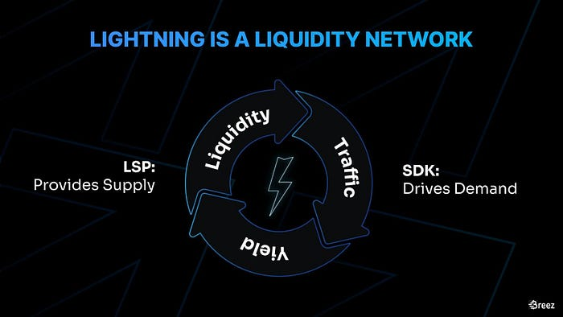
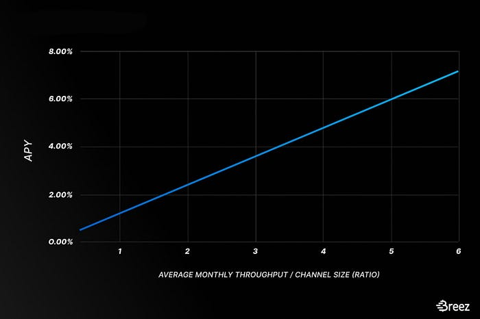
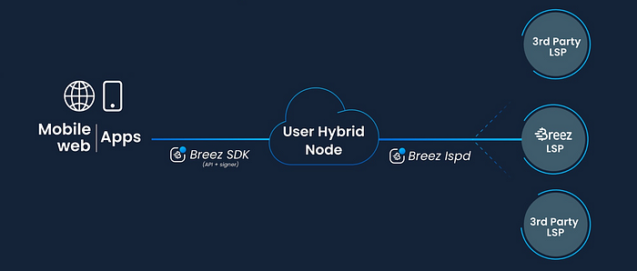

> *作者：Roy Sheinfeld*
> 
> *来源：<https://medium.com/breez-technology/the-breez-open-lsp-model-scaling-lightning-by-sharing-roi-with-3rd-party-lsps-e2ef6e31562e>*

显而易见，“[Fintech](https://www.investopedia.com/terms/f/fintech.asp)”是“financial technology（金融技术）”的缩写，无非就是把“货币与机器”说得高大上一点罢了。毋庸置疑，闪电网络就属于 Fintech，它是一种使用机器转移货币的技术。

Breez 正在开发闪电网络即服务（Lightning as a Service, LaaS），因为货币和机器这两样东西很快会变得复杂莫测。我们热爱比特币，我们相信闪电网络。我们致力于让所有人都能轻松使用它们，无论是消费者、企业家还是开发者。LaaS 最主要的两大模块力求将这两个问题化繁为简：机器与货币。

第一个模块是我们的 [Lightning SDK](https://medium.com/breez-technology/lightning-for-everyone-in-any-app-lightning-as-a-service-via-the-breez-sdk-41d899057a1d?source=collection_home---2------0-----------------------)，主要聚焦于机器方面，即，让机器相互合作并在人类面前表现良好。我希望通过本文告诉你 LaaS 是如何利用闪电网络服务提供商（Lightning Service Provider, LSP）解决货币问题的，以及货币与机器、供应与需求如何像发条装置那样合拍的。

- 来源：<a href="https://unsplash.com/@_staticvoid?utm_source=unsplash&utm_medium=referral&utm_content=creditCopyText">Lucas Santos</a> -

## LSP

当我们提出“LSP”这一概念时，我们非常希望它能够成功。当然，我们已经 [得](https://bitcoin.design/guide/how-it-works/lightning-services/) [偿](https://docs.lightning.engineering/the-lightning-network/liquidity/lightning-service-provider) [所愿](https://bolt.fun/guide/lsp)。我们的想法是，连接至闪电网络的复杂程度超出了很多终端用户的接受范围，因此用户对闪电网络相关服务的需求会催生出一个市场。此类服务包括为用户开通支付通道、确保用户有充足的入账流动性、路由付款、确保网络连接稳定，等等。

这就好比大多数人更喜欢通过 ISP 连接网络，将大多数技术问题交由 ISP 解决并为此支付费用。许多闪电网络用户也想如此。

总的来说，实际情况正是如此。很多[闪电网络支付应用](https://medium.com/breez-technology/there-is-no-such-thing-as-a-lightning-wallet-dc9ac46d32)已经开始成为用户的 LSP（[中文译本](https://www.btcstudy.org/2022/07/23/there-is-no-such-thing-as-a-lightning-wallet/)），此外还有[专门的 LSP](https://voltage.cloud/)。我们可没有能够预测未来的水晶球，只是做足了[网络扩张](https://medium.com/breez-technology/comparing-two-revolutionary-networks-lightning-and-the-internet-d6043768e217)方面的功课罢了。

然而，一个问题是：除了技术基础设施之外，LSP 还需要以入账流动性的形式为用户提供资金。现有的闪电网络支付应用还不足以满足资金需求、让网络迅速扩张、吸引新用户加入。闪电网络需要更多第三方 LSP 来缓解迅速扩张背后的资金压力。

## 供需的良性循环

我们的 SDK 可以让开发者轻而易举地将闪电网络付款功能添加到任何类型的应用。巨大的需求已经呈现在我们眼前。闪电网络不仅欢迎大批新用户，还可支持全新 *应用场景*。

现在，闪电网络需要第三方 LSP 来作为供应方，确保将足够多的流动性预先加载到网络上，以应对所有新加入的用户和其付款需求。但是，仅靠志愿者或忠实爱好者的支持是不够的。人们在决定将钱放在何处时总离不开投资考量。能够在一个 LSP 节点放上数千万 satoshi 的人当然会期望获得收益。这点无可非议。扩大网络规模需要以良好的投资回报率（ROI）作为激励，因此闪电网络需要一个 LSP 模型来激励投资者提供网络扩张所需的流动性。

ROI 可以用来将资金压力转化成机会。

提高 ROI 就是 SDK 和第三方 LSP 合拍的秘诀所在。路由费始终是闪电网络的变现模型。为了将手续费维持在较低水平，提供流动性和付款路由服务的 LSP 需要交易量。为便于新用户和应用采用闪电网络付款，Lightning SDK 可以满足这一需求。随着闪电网络的用户量和付款场景增多，LSP 为闪电网络提供的流动性能够被重复用来传递更多付款，产生更多收益。

闪电网络的金融逻辑开始呈现以下面貌：

1. 随着网络的资金容量增加，我们可以将更多用户引导到 SDK 上。

1. 用户量和付款量增多，带来更高的 ROI。

1. ROI 越高，吸引的 LSP 越多。

1. LSP 越多，网络的资金容量越多。

1. 回到 1。

Lightning SDK 拉动需求。LSP 负责供应。这很经济学！

这个逻辑也带来了重要影响：闪电网络可以让 LSP 在利用比特币赚取收益的同时无需将比特币交由他人保管。没有质押，（据我所知）没有任何东西被证券化，也没人拿着别人的钱去冒险、亏本。如今，我们可以通过成为 LSP [利用比特币来赚取收益](https://medium.com/breez-technology/lightning-is-the-better-way-to-hodl-72f1ee50aa06)，而不只是单纯地持有比特币，盼望币价上涨。这是自托管方式下保有对比特币的完整主权获得的收益：*这不只是比特币领域，而是整个密码货币领域的圣杯。*

我们实际上已经进行了一些计算。我们将 [APY](https://www.investopedia.com/terms/a/apy.asp) 作为 ROI 的衡量指标，并研究了它是如何随 月平均吞吐量/通道大小 之比（对 LPS 运营商来说至关重要的变量）变化的。实际上，此变量衡量了一条通道上同一批 satoshi 被重复用来传递付款和产生收益的频率与 LSP 运营商必须在通道内投入的资金量之间的关系。

正如你预期的那样，这种关系是线性的，而且呈正相关：随着 吞吐量/通道大小 比率增高，APY 也会增加。这是完全合乎逻辑的，因为这意味着通道内被重复用来传递付款和产生收益的 satoshi 越多，运营商获得的收益就越多。通道未必越大越高效，因为会降低该比率，但是通道需要达到一定规模来满足绝大多数付款传递需求。

APY 与 月平均吞吐量/通道大小 之比的曲线非常漂亮，如下图所示：



## Breez 的开放式 LSP 模型

这可是巨大的商机！在不放弃主权和自托管的同时获得 APY 正是大型交易所和新型银行想要向用户承诺却又无法做到的。这里面究竟有什么难题？我们会如何帮助你克服？

就像与闪电网络相关的很多东西那样，阻碍人们成为 LSP 的是复杂性。有的人只是因为持有一些比特币就想成为 LSP，但是这并不意味着他们具备足够的技术知识，能够找到对的节点开通所有必要通道，保持通道平衡，找到并连接用户，等等。就像 Lightning SDK 为那些了解应用却不了解闪电网络的人降低了门槛，Breez 的开放式 LSP 模型为那些拥有比特币却不了解闪电网络的人降低了门槛。

我们对于 LaaS 的愿景也包括了即将加入的 LSP。我们的 Breez LSP 包为即将加入的 LSP 运营商提供了以下有利条件：

- 我们的 SDK 为 LSP 提供了下游用户，通过引流为 LSP 带来 ROI，一举解决了需求、使用和付款问题。

- LSP 可以获得一条连接到 Breez 节点的通道。Breez 节点与网络上的所有主要节点连接，以解决连接和公共通道管理问题。

- LSP 可以获得软件来运行他们的 LSP 节点，而且享有我们用来管理自己的节点的所有功能。这实际上是在帮助 LSP 开通与终端用户之间的通道。

所有新加入的 LSP 只需要确保他们的节点永远在线，并且有充足的支出流动性（即，对于用户来说是入账流动性，对于 Breez 节点来说是支出流动性）。

## 介绍我们的 LSP 之一 LQwDity 

Breez 的开放式 LSP 模型是 LaaS 中非常重要且可靠的组件。以我的立场，我当然会这么说，所以不用信我的话。看看 LQwD 就知道了。[LQwD Fintech Corp](https://lqwdfintech.com/) 是首家与我们签约的第三方 LSP。

LQwD 是一家上市闪电网络公司。就像我们喜欢在家运行闪电网络的爱好者一样，LQwD 是一家由专业人士组成的公司，他们既懂金融也懂技术。他们是货币和机器方面的专家。

LQwD 的加入是对我们工作的肯定，我们也准备尽我们所能开发最好的 LSP 产品作为回报。对于其他信任我们的用户也是如此。

## 让世界更美好

很多大众话语似乎都基于这样一个假设：当个成功人士和当个心系天下的人只可选其一，不可兼得。就好像帮助他人的人都衣着朴素，而剥削是致富的唯一方式。

我们的开放式 LSP 模型表明这并非二选一问题。比特币可以造福人类。闪电网络可以帮助比特币实现成为主流货币的愿景。我们正是要通过它们将开放式金融服务带给所有人。我们欢迎大家参与和共享我们的成果，以此扩大闪电网络的规模。

LaaS 连同开放式 LSP 模型将加速闪电网络的发展。它采用非托管模式，让所有人都能共享发展成果。比特币让世界更美好，闪电网络让比特币更强大，LaaS 让闪电网络更易用。

（完）