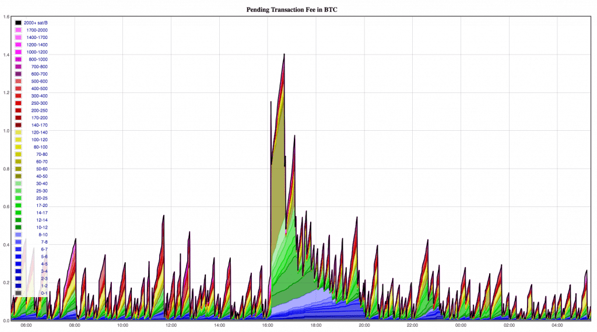
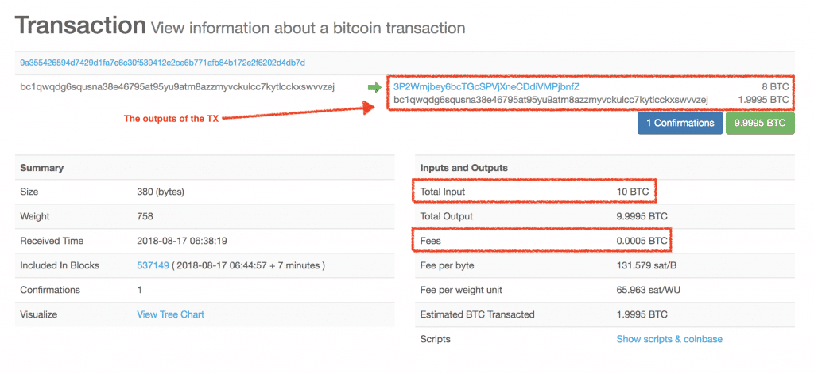
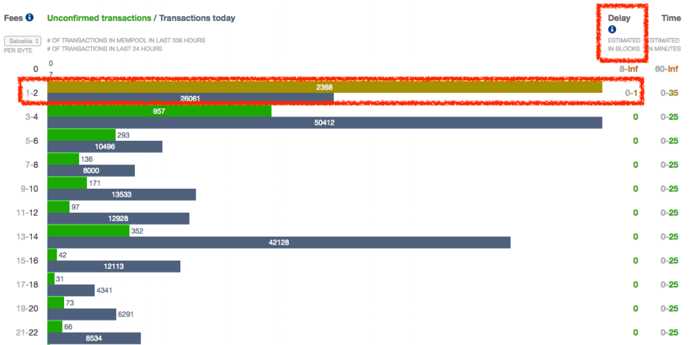
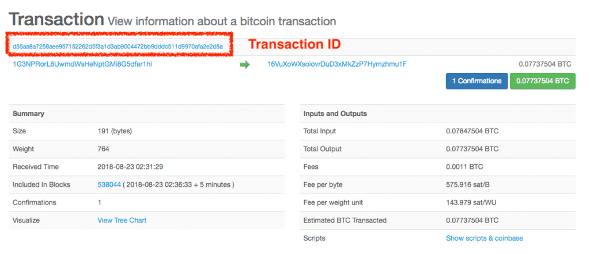

> *作者：Ofir Beigel*
> 
> *来源：<https://99bitcoins.com/bitcoin/fees/>*

本文将介绍比特币交易费的基础知识，包括交易费是如何计算的，以及未支付足够交易费时该怎么办。

## 概要

比特币交易费（又称挖矿手续费）可以让用户获得交易优先权，让自己的交易能够先人一步被记录到比特币账本（[区块链](https://99bitcoins.com/what-is-blockchain)）上。

在将交易打包到区块链上之前，为了确定这么做是否对自己有利，矿工会看哪笔交易提供的交易费最高。交易费不足的交易有时会卡很长时间。

不喜欢阅读？欢迎观看我们的[视频指南](https://youtu.be/waP7n8crMhg)！

比特币交易费的概要就到此为止。想要了解详细内容，请继续阅读下文。

## 1. 比特币交易费是什么

交易费是比特币所有者向另一个比特币地址转账时支付给[比特币矿工](https://99bitcoins.com/bitcoin-mining)的费用。但是，要想透彻理解交易费，我们首先要知道当你向另一个比特币地址发送比特币时会发生什么：

1. 每个持有比特币区块链副本的计算机会验证该交易是否有效（这些计算机又叫作[节点](https://99bitcoins.com/step-by-step-guide-firing-up-bitcoin-node)）。

   从根本上来说，在该阶段，节点是在验证比特币的交易历史，证明你确实拥有足够的余额来支付这笔交易。

2. 被视为有效的交易会进入 Mempool（即 “Memory Pool” 的缩写，直译为 “内存池”，也叫 “交易池”）。Mempool 有点像是“等候室”，交易都在里面等待被矿工选中，然后被打包进交易块。

   在该阶段，交易被视为“未确认交易”或“零确认交易”。[点击此处，即可查看 Mempool 的当前状态](https://jochen-hoenicke.de/queue/#1,24h)。

3.  一旦有矿工选中该交易，将其打包进区块，并成功[挖出对应区块](https://99bitcoins.com/bitcoin-blocks-confirmations)，该交易就会被视为已确认。

观看这个短视频，可了解整个流程：https://youtu.be/adDTkjffN1U 。

一个区块只能容纳有限数量的交易（目前，平均值是 2500）。当网络发生拥堵且大批交易等待矿工确认时，矿工会优先选择交易费高的交易打包。

- Mempool 中待处理交易的交易费 -

因此，你可以通过交易费向矿工释放信号，告诉他们你想达成交易的心情有多迫切。如果你希望自己的交易能早一点被确认，就会提供较高的交易费。如果你对时效性的要求没那么高，可以提供较低的交易费。

请注意，交易费始终由交易的付款方支付。

### 交易费在链上如何显示

比特币区块链不会明明白白地将每笔交易的交易费罗列出来。想要推测出付款方支付了多少交易费，唯一的方法是用交易发送的比特币数量减去付款方收到的比特币数量和作为找零返还给付款方的比特币数量而得到的差值（详见[第三部分](https://99bitcoins.com/bitcoin/fees/#tx-size)）。



## 2. 比特币交易费是如何计算的？

每笔比特币交易都要提供交易费才能被挖出来。

计算合理的比特币交易费并不像看起来那么简单。我先简单介绍一下计算方法：

每笔交易都有体积，就像计算机里文件的大小。在利益最大化的驱使下，矿工会优先选择 费用/体积比（即，费率）较高的交易。

这里举一个更日常的例子来帮助你理解。

当你购买或租赁公寓时，通常会按面积付款。公寓售价就是你需要支付的总价，但是衡量公寓价格高低看的是你要为每平方米支付的单价。

**费率就是比特币的“每平方米价格”。**

费率的单位是 satoshi/字节，意思是你愿意为交易的每字节（每单位体积）支付多少 [satoshi](https://99bitcoins.com/satoshi-usd-converter)（比特币的最小记账单位）。

你随时都可以[点击此处](https://bitcoinfees.earn.com/)查看将你的交易打包进下一个区块中预估需要多少费率。费率取决于交易池的拥堵程度。

- 如上图所示，当网络不拥堵时，你的交易可以在下一个区块中确认 -

## 3. 计算交易大小

交易大小本身取决于多种因素，其中最重要的因素包括：

### 输入的数量

从本质上讲，你拥有的每个比特币都是对之前发送给你的交易的引用，全部比特币加起来就是你的余额。这些引用被称为[输入](https://99bitcoins.com/inputs-outputs-bitcoin-change-explained)。

当你将比特币发送给其他人时，你其实是在选择过往发送给你的不同输入，然后作为输出转发给收款方。包含的输入越多，交易就越大。

假设你拥有 1 BTC。这 1 BTC 实际上由过往发送给你的多笔交易的引用组成（假设这多个来源的资金汇总起来是 1 BTC）。

当你将这 1 BTC 发送给其他人时，你的交易将包含所有这些引用。你也可以观看这个短视频：https://youtu.be/BuUPKC6rFlE 。

### 输出的数量和找零

简而言之，输出就是接收付款的地址数量。

例如，如果你只向一个地址转账，极有可能会生成两个输出，一个发送给收款地址，另一个作为找零返还给付款地址（具体参见上方视频）。

**注**：如果你的输入总额恰好等于你的付款额，就不会生成找零输出。

### 脚本复杂性

一些交易采用了[多签](https://99bitcoins.com/multisig-a-beginners-guide)之类的特殊功能。这类功能会增加交易的大小。

尽管如此，根据这些因素计算交易大小对普通用户来说还是很难。幸运的是，你的[比特币钱包](https://99bitcoins.com/bitcoin-wallet)会根据发送交易时的平均费率帮你算好，并提供关于交易费的建议。

## 4. 减少交易费 —— 最优方法

有一些方法可以帮助你避免支付高昂的交易费。我们来探索其中几种：

### 避免在网络繁忙时发送交易

比特币网络非常繁忙时（例如，比特币价格暴涨，吸引大批人蜂拥[购买](https://99bitcoins.com/buy-bitcoin)），用户会争相出高价，让自己的交易优先被打包上链。

这种情况会导致天价交易费。如果你可以将交易推迟到网络拥堵没那么严重时，你就有望省下一大笔交易费。

### 使用支持 SegWit 的钱包

[SegWit](https://99bitcoins.com/what-is-segwit-segregated-witness)（隔离见证）是比特币协议升级，让交易数据也能像文件一样被压缩。许多钱包已支持该功能，能够大幅降低成本。

### 整合你的输入

创建交易时用到的输入越多，你的交易就越大，你需要支付的交易费就越多。如果你想要将交易费维持在较低水平，可以每隔一段时间整合你的输入。

为此，你可以在交易费低时，一次性将多个小额输入发送至你的某个地址。通过将多个输入合并成一个，你可以大幅降低未来的交易费。

### 整合你的输出

除了整合输入，你也能将多个输出（付款）整合到同一笔交易中。并非所有钱包都支持该功能，但是如果你的钱包支持该功能，你就能通过一笔交易将不同的付款发送至不同的地址，从而减少交易费。

## 5. 比特币钱包如何处理交易费

比特币钱包会基于比特币网络的当前和近期活动情况给出合理的交易费建议。一些交易费管理不当的钱包和服务会给出过高的交易费建议，导致整个交易费市场水涨船高。

大多数钱包可以让你调整交易费，或至少设置一般交易费偏好（低、中、高）。正如我在前文所言，你需要先知道交易大小才能选择恰当的交易费。

如果你的钱包提供交易大小信息，你可以使用费率预估表计算将交易打包进下一个区块所需支付的交易费。

这里举一个例子：

如果你的交易大小是 1.6 万字节，且当前打包交易的平均费率是 10 satoshi/字节，你需要支付 10 × 16000，即 16 万 satoshi 作为交易费，这样你的交易就有很大概率被打包进下一个区块。

## 6. 常见问题

### 我的比特币交易为什么会被卡住，或得不到确认？

虽然阅读本文能够让你对比特币交易费建立一定的了解，但是大多数比特币用户并非“交易费专家”。因此，通常情况下（尤其是当价格暴涨且网络拥堵时），你会听到有人抱怨称自己的交易因“未确认”或“未处理”而卡住。

是什么原因会导致交易“卡住”？不外乎以下两个：

1. 你没有支付足够高的交易费，因此矿工优先选择了其它交易。

1. 你尝试将其他人转给你但还未确认到账的比特币发送出去（没错，有些钱包确实能这么做）。

### 面对这种情况，你可以采取哪些措施？

**方法一：等待**

等待有时是最好的选择。如果你的交易不是十万火急，不妨休息一下，至少在 72 小时内暂时忘却它。你的交易大概率会自己脱离困境。

**方法二：交易费替换**

交易费替换（RBF）功能可以让钱包重新广播交易费更高的交易。请记住，只有极少数钱包支持 RBF 功能。在部分钱包里，RBF 是可选功能。

如果你的钱包支持 RBF，可以帮你省去不少关于交易费的麻烦，而且使用这类钱包确实没有坏处。

**方法三：交易加速器**

有些[矿池](https://99bitcoins.com/bitcoin-mining/bitcoin-mining-pools)运行不同类型的交易加速器。交易加速器会在力所能及的情况下将你的交易添加到下一个区块内。

有些交易加速器是免费的，有些只有超过一定大小上限才会收费，有些会预收费，有些会收取小费。

你需要供交易 ID 才能使用交易加速器。交易 ID 是交易的唯一标识符，通常可以在钱包内的交易列表中找到。

这里推荐几个交易加速器：

1. [ConfirmTX ](https://confirmtx.com/)加速器可以免费处理低于 250 字节的交易。超出这一大小的交易会收取 5 美元的手续费。

1. 处理被卡住的交易时，你也可以试试论坛上的 [Coolwave](https://bitcointalk.org/index.php?topic=2204426.0) 加速器。你必须先在 BitcoinTalk 论坛上注册账号才能提交交易。

1. [ViaBTC 的加速器](https://pool.viabtc.com/tools/txaccelerator)是免费的，但是经常不可用，因为它每小时只接受 100 笔未确认交易。因此，要想让你的交易被接受，你很可能得在每小时开头反复提交你的交易 ID。ViaBTC 同样提供付费加速器，但是只针对[ BCH](https://99bitcoins.com/buy-bitcoin-cash)。

**双重花费（万不得已的办法）**

以更高的交易费重复发送同一笔交易。这一方法与 RBF 差不多，但是有一个主要区别。

RBF 交易符合既定的协议规则，而且已被纳入一些钱包设计。相较之下，双重花费被明确定义为不应该做的事。

实际上，双重花费就是比特币旨在解决的主要问题，也是所有钱包极力避免的问题。

**子为父偿（万不得已的办法）**

子为父偿（CPFP）可以让你花费即将到账但是尚未确认的比特币，这也是我之前建议不要采用的办法。

子为父偿背后的想法是，发起一笔提供高昂交易费的转账交易。该交易费不仅是为这笔转账交易支付的，还有能让这笔交易达成的未确认交易。

矿工会在利诱下挖出之前未确认且交易费较低的交易，然后挖出新的交易费较高的 CPFP 交易（因为只有旧的交易得到确认后，新的交易才能被确认）。

最后两个办法非常难，可能会让你的资金处于风险之中，而且不适合普通用户。因此，本文不展开介绍这两个办法。欲知详情，可参见这篇[比特币维基百科](https://en.bitcoin.it/wiki/Fee_bumping)。

### 我的比特币交易会永远卡住吗？

简言之，不会。

严格来说，可能性很低，但是视情况而定。在上文，我提到交易都在 Mempool 里等待被矿工选中。

然而，Mempool 不是只有一个。参与交易验证的每个计算机（或节点）都会贡献出一部分硬盘容量专门负责存储待处理交易。因此，不同节点有不同版本的 Mempool，取决于它们知道且记住了哪些交易。

如果交易长时间没有被确认，最终会从节点的 Mempool 中抹去。当前默认超时时间是 72 小时，但是节点可能会自定义超时时间。

交易费最低的交易也会被 Mempool 剔除，因为交易费较高的交易会进入 Mempool，而且 Mempool 的大小是有限制的。

因此，等待至少 72 小时大概率会导致两种结果：你的交易要么会得到确认，要么会从全网所有 Mempool 中抹去，然后资金返还至你的钱包。

尽管如此，或许会有某个节点永远都不会忘记你的交易，甚至偶尔重新广播你的交易，从而提醒其它节点这笔交易的存在。在这种情况下，你的交易会永远卡住。

### 发送比特币是免费的吗？

不是。过去，交易费的[规则](https://en.bitcoin.it/wiki/Transaction_fees#Historic_rules_for_free_transactions)与现在的大相径庭。如果你的交易足够小或有“优先权”，你甚至可以免费发送交易。如今，每笔比特币交易都需要交易费。

### 比特币交易费给了谁？

将比特币交易成功打包上链的矿工会获得相关交易的交易费。

### 比特币交易费为什么这么贵？

很多人同时发送比特币时，会形成未确认交易队列。

希望交易尽快确认的人会提供更高的交易费。因此，这些参与者之间打响了“交易费竞赛”。

尽管如此，当网络没那么活跃时，发送比特币会便宜得多。

### 每笔比特币交易收取多少钱？

合理的交易费是通过将交易大小乘以打包进区块所需的费率计算得出的。

但是，虽然最低费率可以根据[该页面](https://bitcoinfees.earn.com/)推断出来，但是交易大小无法提前查看。

## 结论

如你所见，交易费问题非常复杂，可能会引起诸多争议。

事实上，BCH 的主要目的就是解决区块大小限制问题。比特币区块交易处理量受区块大小的限制，这反过来会生成一条很长的待处理交易队列，导致天价交易费。

将交易费维持在低水平很重要，因为价格低廉的点对点支付系统是比特币想要实现的目标之一，但是除了低价交易费之外，还有很多其它因素需要考虑（具体请参见另一篇文章）。

随着比特币越来越出圈，更多用户会蜂拥而至，同时比特币网络需要找到新的解决方案来满足用户需求。其中一个有潜力的解决方案是[闪电网络](https://99bitcoins.com/bitcoin-lightning-network)。

虽然闪电网络尚未成为主流应用，但是它承诺会为所有比特币用户提供近乎即时、免手续费的交易。

（完）