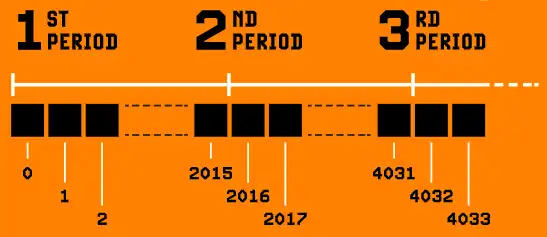

> *作者：Antoine Poinsot*
> 
> *来源：<https://bitcoinmagazine.com/print/the-core-issue-consensus-cleanup>*

关于比特币的未来，比特币的协议开发者们通常比绝大部分比特币人更加悲观。每天都接触比特币的不完美之处，当然会带给他们更加清醒的视角，但这也映照出比特币的成就。世界上的任何一个人，不论其种族、年龄、性别、国籍乃至其它任何标准，都可以在一个中立的货币网络上保存和转移价值，并且这个网络还在日复一日壮大。虽说如此，比特币还是有一些许多比特币人都没有注意到的问题，如果不妥善解决，可能威胁比特币的前景。由 “共识规则清理（Consensus Cleanup）” 修复的漏洞，就是这样的例子。

“共识规则清理”（BIP  54 <a href='#note1' id='jump-1-0'>1</a>）是一个软分叉提议，意图修补比特币共识协议中长期存在的几个漏洞。与本期刊（Bitcoin Magazine 的 “The Core Issue”期刊）提到的绝大部分 `Bitcoin Core` 开发工作性质不同，它是一个软分叉提议。虽然这个提议在历史上曾由多位参与 `Bitcoin Core` 项目的开发者领衔， 实际上，它属于 “比特币协议开发” 这一广义类别。

本文将介绍这项提议中的全部四项措施，介绍它们意图解决的问题所造成的影响以及修补措施的发现。我们将说明，这些缓解措施是如何在吸收反馈意见、解决新发现的漏洞中提炼的，最后，我们会概要介绍这个软分叉提议的现状。

## 比特币工作量证明机制中的一个漏洞

比特币网络通过调节其挖矿难度来保持平均每 10 分钟挖出一个新区块的速度。但是，在这个难度调整机制的实现中，有一个 “差一错误”（编程中的常见错误），让一种叫做 “时间扭曲” 的攻击有机可趁：占据大部分挖矿算力的矿工可以通过调降难度、任意地加快区块生产的速度。

幸运的是，这种攻击需要控制 51% 以上的挖矿算力，但是，任意加快区块生产的速度是致命问题。它意味着，全节点将不再能控制资源的使用量，而攻击者可以显著加快比特币区块补贴（新货币）的发放速度。

虽然这种攻击需要 “51% 的矿工”，它还是跟比特币所面临的标准威胁模型显著不同。传统意义上的“51% 攻击” 然一个矿工可以阻止一笔交易的确认（只要 TA 能保持自己的算力优势）。但这个漏洞却让攻击者可以通过迅速降低挖矿的难度，在 38 天以内瘫痪整个网络。

但是，攻击者有可能不会瘫痪整个网络，而是小幅度地利用这个 bug 。当前的矿工们可以串通起来让区块生产速度变成 4 倍（也就是每 2.5 分钟挖出一个区块），同时让比特币网络保持看起来正常的状态，实质上，就是让可用的区块空间变成 4 倍、从未来的矿工手上盗窃区块补贴。短时的用户可能会被激励去支持这种攻击，因为更多可用的区块空间意味着在区块链内确认交易的手续费会更低（暂时假设其它条件不变）。当然，这是以全节点运营者的开销为代价的，而且会降低网络的长期稳定性。

时间扭曲攻击利用的事实是：难度调整周期并不重叠，所以，新周期中的区块的时间戳，可以设为比刚刚结束的上一周期中的最后一个区块更早。因为让难度调整周期重叠将变成一雌硬分叉，所以退而求其次的最好办法，就是难度调整周期边界上区块的时间戳关联起来。BIP 54 规定了，一个难度调整周期的第一个区块的时间戳，不得比上一周期的最后一个区块早两个小时以上。

此外，BIP 54 还规定了，一个难度调整周期必须花去正数时间。也就是说，在一个难度调整周期中，最后一个区块的时间戳不能比第一个区块的时间戳还要早。你是不是很惊讶，怎么比特币一直没有这个规定？我们也曾惊讶，这居然是必要的。现实表明，这是对一种聪明的的攻击的简单修复措施；这种攻击跟时间扭曲有关，由化名为 “Zawy” 的开发者和 Mark “Murch” Erhardt 在审核共识规则清理提议时发现。

## 需要几个小时来验证的区块

任何矿工都能利用一些验证起来很费劲的操作，创建出需要很长时间来验证的区块。虽然一个普通的比特币区块只需要 100 毫秒这个量级就能验证，但这些 “用来攻击的区块” 的验证时间可以长到在高端的计算机上超过 10 分钟、在树莓派上超过 10 小时（后者是常见的用于运行全节点的硬件）。

一个别有用心的攻击者，可能会利用这种攻击来摧毁整个网络；而在这种攻击的一种更能带来经济利益的变种中，一个矿工可以用这种攻击来拖延自己的竞争对手、提升自己的收益，而不让崩溃在网络中蔓延。

历史上，为解决这个问题而作出的尝试都充满波折，因为解决措施需要在比特币的脚本编程能力上施加限制。这样的限制有可能造成 “没收”，在任何严肃的软分叉设计中都应绝对避免。

（译者注：此处说的 “没收”，指的是因为禁用脚本的一些用法，而让脚本中包含了这些用法的钱币无法再花费。）

Matt Corallo 最早在 2019 年提出的 “Great Consensus Cleanup”，提议在非隔离见证脚本（常常被称为 “老式脚本（legacy script）”）中禁用一些罕见的操作，来解决这个长验证时间问题。一些人就担心，虽然使用这些操作的交易，已经多年不被默认配置下的 `Bitcoin Core` 转发和挖出，也许还是有一些人、在某些地方使用它们，只是不为人知而已。当然，这种风险也必须跟一个利用这个漏洞的矿工就能给所有比特币用户带来的风险相权衡。

虽然这种对没收的担忧几乎只是理论上的，这也是一个哲学问题：在比特币协议开发中，如何设计出既能解决漏洞、造成没收的可能性又最小的妥善缓解措施。后来，我对共识规则清理提议的改进，通过加入一个能够精确界定有害行为的限制、不禁用任何具体的比特币脚本操作，解决了这种顾虑。

## 伪造支付证据

比特币区块头包含了一个默克尔根，它承诺了该区块内所有交易。这使我们可以制作出一种紧凑的证据，证明某一笔交易已被一条具备一定工作量证明的区块链确认。 这就是我们常说的 “SPV 证据”。

但是，因为这棵默克尔树在设计上的弱点，如果区块中包含了一笔精心定制的长为 64 字节的交易，攻击者就有可能为一笔虚假的（不存在的）交易伪造出 SPV 证据。这可能会被用来欺骗 SPV 验证器（通常来说，它会被用来验证入账支付或进入一个子系统的存款）。已经有缓解措施，能让验证者拒绝这样的无效证据；不过 ，它们常常被忽视 —— 哪怕密码学家也不例外 —— 而且在某些情况下可能很麻烦。

共识规则清理提议通过（在共识规则中）禁用序列化体积恰好为 64 字节的交易，来解决这个问题。这样的交易首先无法具备安全性（只能用来烧掉资金，或是让任何人都能花费），而且从 2019 年开始，默认配置的 `Bitcoin Core` 就不再转发和挖出这样的交易。其它方法也得到了讨论，比如提升现有缓解措施的迂回方式 a，但是提议的作者们选择修复问题的根源，既消除软件开发者们应用缓解措施的炫耀，也消除他们知晓这种漏洞的需要。

注释 a：在区块头的版本号字段中承诺默克尔树的深度。

## UTXO 分身：重合交易

“小型…中型…大型通货膨胀 —— 经济过热” 是 Russell O'Connor 发布于 2012 年 2 月的博客的标题。在这篇文章中，他介绍了比特币交易重合的可能性。这曾经是比特币的一个致命缺陷，会打破交易标识符（哈希值）独一无二的基础假设。问题的源头在于，矿工的 coinbase 交易只有一个空的输入，也就是任何带有相同输出的 coinbase 交易都有一摸一样的交易标识符。

（译者注：coinbase 交易是一个区块中的第一笔交易，用于让出块的矿工获取交易手续费和区块奖励，它可以不花费任何 UTXO。）

当时，`Bitcoin Core`（那时候还叫 “Bitcoin”） 的开发者们用 BIP 30 <a href='#note2' id='jump-2-0'>2</a> 修复了这个漏洞，该 BIP 要求全节点在收到区块时执行额外的验证。这种额外的验证并不是绝对必要的，在同年实施的BIP 34 <a href='#note3' id='jump-3-0'>3</a> 中就被绕过了。不幸的是，BIP 34 中的修复措施并不完美，20 年之后我们将需要重新引入 BIP 30 验证。除了并非绝对必要之外，这种验证措施也无法被另类的比特币客户端（比如 Utreexo）执行，而且实际上会阻止它们完全验证区块链。

共识规则清理提议加入了一种更加可靠、更经得起时间考验的修复措施。所有比特币交易，也包括 coinbase 交易，都包含一个用来决定该交易的 “生效日期” 的字段。这个字段的数值代表的是该交易尚属无效交易的最后一个区块高度。BIP 54 规定所有 coinbase 交易都必须将该字段设为其区块高度（减一）。

结合来自 Anthony Towns 的一个明智的建议、确保时间锁验证总是运行，就能确保以往区块的 coinabse 交易不可能使用相同时间锁数值。反过来，这就确保了不会有两笔 coinbase 交易拥有相同的交易标识符（哈希值），而且不再需要 BIP 30 验证。

## 预防胜过治疗

由共识规则清理（BIP 54）解决的漏洞，并非比特币迫在眉睫的生存威胁。虽然其中有些有可能瘫痪整个网络，至少目前不太可能被利用。虽说如此，情况可能会变化，我们主动缓解比特币网络的长期风险，是绝对必要的，即便为此必须承担协调软分叉的短期负担。

共识规则清理提议上的工作起源于 Matt Corallo 在 2019 提出的原创提议。6 年以后，随着我发布 BIP 54 以及 Bitcoin Inquisition（一个比特币共识变更的测试网）的相应软分叉实现，这个提议终于结出果实。在这段时间里，这项提议收到了大量反馈，我们讨论了许多替代方案并加入了对其它弱点的缓解措施。我认为，现在它已准备好分享给比特币的用户了。

共识规则清理是一个软分叉。比特币协议开发者们选择优先实现哪些提升，并公之于众。 但是否采用一项对比特币共识规则的变更，最终决定权在用户。选择权在你手上。

（完）

## 参考文献

1.https://github.com/bitcoin/bips/blob/master/bip-0054.md <a href='#jump-1-0'>↩</a>

2.https://github.com/bitcoin/bips/blob/master/bip-0030.mediawiki <a href='#jump-2-0'>↩</a>

3.https://github.com/bitcoin/bips/blob/master/bip-0034.mediawiki <a href='#jump-3-0'>↩</a>

4.https://r6.ca/blog/20120206T005236Z.html