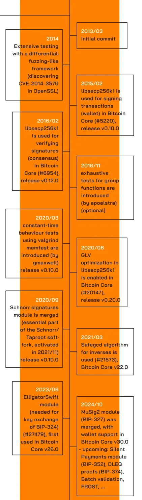
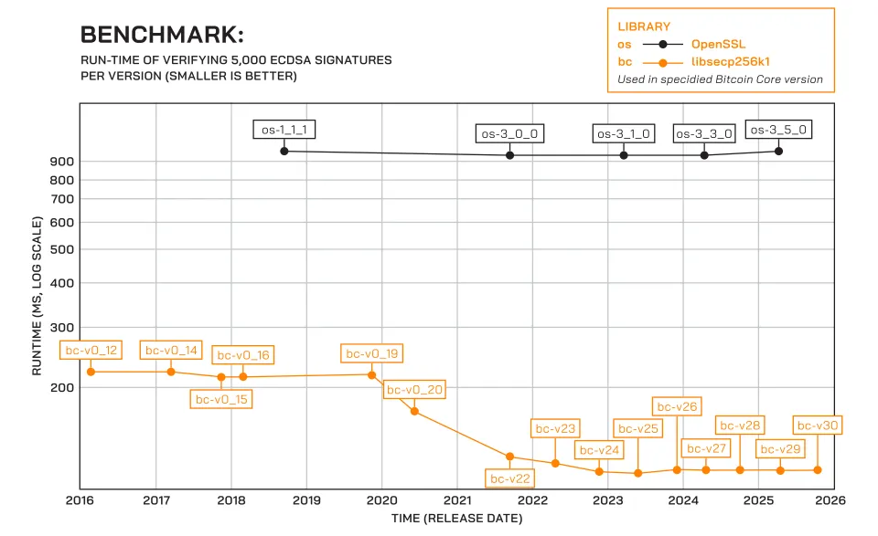

> *作者：Sebastian Falbesoner*
> 
> *来源：<https://bitcoinmagazine.com/print/the-core-issue-libsecp256k1-bitcoins-cryptographic-heart>*

“别信任，去验证”、“没有私钥，等于没币”，是比特币人的口头禅；甚至一些人还会说，比特币 “是用数学背书的”。这些黑话是真的有什么意义的吗？说比特币跟数学有关，究竟是哪一部分跟哪一些数学有关系？

大部分读者应该都注意到了，比特币的设计有一个基本元素，是 “*公钥密码学* ”，再说具体一些就是 “*数字签名* ”，正是它，使我们可以证明所有权而无需设立一个中心机构。不过，要说比特币软件的哪一部分是真正让椭圆曲线数学动起来的、人们倾注了多少努力来确保整个过程最安全也最高效、还要持续不断地优化，那可能就比较少人知道了。本文要讲的就是 “secp256k1” 这个代码库的历史：这个代码库从一个小小的玩具项目开始，历经多年的进步，变成了保护价值数百亿美元的资产的共识规则的不可分割的部分。

## 起点

出于一些我们无法确定的理由，中本聪挑选了一款名为 “secp256k1” 的椭圆曲线来创建和验证用于比特币协议的数字签名。最早放出的比特币（`Bitcoin`）客户端软件版本使用广为人知的 “OpenSSL” 代码库来签名和验证交易。这种依赖于第三方代码库的做法，从软件工程的角度看似乎是一种合理的方法（如果是椭圆曲线密码学这样专门又复杂的领域，那就更是如此了），但是，这个选择事后被证明是有问题的，因为它的签名解析代码有不一致的地方。在最坏的情况下，它甚至可能导致意料之外的区块链分裂。那段时间还带给我们一个教训：像 OpenSSL 这样的代码库，并不适合像比特币这样共识至上（consensus-critical）的系统。这个问题后来由 BIP66 修复了，它规定了 ECDSA 签名的的严格编码形式。在那之后，对 OpenSSL 的依赖，在 `Bitcoin Core` 0.12 版本（发布于 2016 年初 <a href='#note1' id='jump-1-0'>1</a>）中被替换成了对 libsecp256k1 的依赖。

但寻其根本，启动 libsecp256k1 这个项目的动机主要是对潜在加速效果（性能）的好奇。在 2012 年的某个时候，`Bitcoin Core` 的开发者 Pieter Wuille（昵称是 “sipa”）在 bitcointalk 上偶然发现了由 Hal Finney 发出的帖子（Hal Finney 因为是中本聪在 2009 年发出的第一笔交易的收款人而知名）。

在 “加速签名验证” 这个题目下，该帖子讨论了利用所谓的 “endomorphism”（更具体来说，使用的是所谓的 “GLV 方法”）的优化效果。这种方法只有部分椭圆曲线能够使用，而 secp256k1 恰好是其中之一。Hal Finney 自己使用 OpenSSL 的原语实现了它；后来，这一实现作为一个 PR，提交给了 `Bitcoin Core`  <a href='#note2' id='jump-2-0'>2</a>。虽然这个实现展现出了可靠的大约 20% 的加速，它最后没有合并到比特币软件中，因为担心它会增加代码的复杂性，而且相关的密码学是否可靠也没有保证。

（译者注：“GLV 方法” 是一种加速椭圆曲线点乘法的算法，由[最早提出这一方法](https://www.iacr.org/archive/crypto2001/21390189.pdf)的三位学者 Gallant、Lambert、Vanstone 的姓氏命名。）

Pieter Wuille 往前再走了一步，决心从头开始启动一个新的代码库，这个 “secp256k1” 代码库的第一次提交可以追溯到 2013 年 3 月 5 日。仅仅一周之后，这个库就已经能够验证整个区块链（当时的区块高度大约是 225000）（译者注：也即实现了验证签名的功能），又过了一周，它实现了签名功能。又经过一些时间和测试工作，这个库准备好了用在 `Bitcoin Core` 中作为 OpenSSL 的替代。第一次用在钱包的签名模块中是版本 v0.10，发布于 2015 年；最终开始用于共识中的 ECDSA 签名验证是版本 0.12，发布于 2016 年。

这些努力绝对是值得的，根据 `Bitcoin Core` 中的 PR 描述，使用 libsecp256k1 库之后，签名验证的速度 “快了 2.5 倍到 5.5 倍不等”。讽刺的是，这还不包含前面提到的 endomorphism 优化，因为担心专利诉讼，该功能默认不会打开。这个功能直到 2020 年（相关专利过期之后）才激活，发布于 v0.20 版本，产出了额外大约 16% 的显著加速。

慢慢地，这个项目吸引了另外几位贡献者。这自然包括在 Blockstream 公司的起步阶段与 Pieter Wuille 密切合作的人，也就是当时的 CTO Gregor Maxwell 和研究员 Andrew Poelstra 。在 2015 年，Jonas Nick 加入了；几年后 Tim Ruffing 也加入；他们都是 Blockstream 公司雇用的研究员，现在已经担任  libsecp256k1 代码库的维护者多年了。因为他们既负责详细描述新的密码学协议（包括细致的安全证明）、又通过实现和审核它们来将它们变成现实，所以称他们为 “全栈密码学家” 是非常准确的（Tim Ruffing 就喜欢这样介绍自己）。

偶尔，甚至比特币圈子以外的密码学家也会给 libsecp256k1 作贡献。一个著名的例子是 Peter Dettman，他的著名身份是 C#/Java 密码学代码库 “BouncyCastle” 的维护者之一，时至今日，仍然经常提出各种性能改进建议。他的主要贡献之一是在 2021 年使用 “safegcd” 算法，安全地提升了模逆运算（modular inversion）的性能（参考了 Daniel J. Bernstein 和 Bo-Yin Yang 的一篇论文）。

## 为什么要重新发明轮子？

libsecp256k1 的目标是为 secp256k1 曲线上的密码学运算提供最高质量的代码库，同时，其主要意图实在广大的比特币生态系统中发挥作用 —— `Bitcoin Core` 只是使用它的主要客户端。libsecp256k1 的应用程序接口（API）被设计称健壮而且难以误用，以防止用户执行在最坏情况下可能导致资金损失的不安全的操作（例如，用来推出他们自己的密码学方案）。通过只关注椭圆曲线、将功能性限制在与比特币相关的操作（主要就是签名和验证交易），代码可以既快速、审核起来又简单，从而产生更低的维护负担和更高的整体质量（相比于其他实现）。libsecp256k1 是用 C 语言写的，而且不依赖于任何其它代码库，所以，它 *只使用* 专门为这个项目而编写的内部代码。因此，它也被设计成可以在资源有限的设备上运行，比如微控制器，那是硬件签名器中常用的模块。

## 三思而后行

从一开始，libsecp256k1 就非常重视质量控制，并且在多年中不断改进和磨砺。现在，它的测试的代码覆盖率接近于 100%，而且新的代码仅在能够满足同样的要求时，才有机会合并。除此之外，还有一种特殊的手段叫做 “穷举测试”。基本想法就是使用曲线上所有可能的数值来运行代码库中的功能。这在真正的 secp256k1 曲线上是不可能做到的，因为这条曲线包含了接近 2^256 个点；但可以使用特殊的、小得多（阶数只有两位数或三位数）并且非常相似的曲线，可以很容易在合理的时间内执行完成。测试的另一个重要部分是保证动作的耗时为常量（constant-time behavior），这跟签名操作尤其关系重大，我们后文会详说。

## Schnorr 签名：一个全新的世界

我们再说新特性的事。在 libsecp256k1 过去的十年中（其实比特币协议亦然），一个重大里程碑是加入 Schnorr 签名。Schnorr 签名是 2021 年末激活的 Schnorr/Taproot 软分叉的核心部分，提供了多种优于 ECDSA 签名的特性，包括在标准的假设下 *可以证明的安全性*、更加紧凑，并且在此之上，还可以带来许多其它构造，比如实现更高效多签名方案的公钥和签名聚合。（关于用于比特币的 Schnorr 签名）BIP340 中的详述和实现都是由 libsecp256k1 当前的三位维护者（Pieter Wuille、Jonas Nick 和 Tim Ruffing）实现的。

## libsecp256k1 对你的节点和网络都好

不言自明，验证数字签名就是比特币共识引擎中最重要也最安全敏感的代码路径（之一？）。不论一个锁定脚本中包含多么复杂的脚本路径和额外的花费条件，最终可能都需要至少一个签名检查来确保一笔交易真的是由被花费的钱币的主人创建的。对于这样一种根本的操作，我们希望处理它的代码是尽可能健壮、经过尽可能充分的测试并且高性能的。快速的签名验证，对于交易和区块的快速传播也极为关键， 对于刚刚加入网络的参与者（需要执行初始化区块下载（IBD））也一样重要。我们前面已经提到，在 libsecp256k1 提到刚刚替代 OpenSSL 的时候（大概十年前），就已经提供了大约 5 倍的加速；还来，又实现了进一步的性能提升。近期的研究表明，在 ECDSA 签名验证上，使用两者的最新版本，libsecp256k1 会比 OpenSSL 快大约 8 倍 <a href='#note3' id='jump-3-0'>3</a>。

## 签名是风险操作，所以要正确处理

行文至此，我们关注的都是 libsecp256k1 的签名验证功能，因为它对节点运营者和矿工的性能至关重要。但硬币的另一面是 *签名*，也就是为一笔花费资金的交易创建一个数字签名的过程。 这个过程之所以棘手，是因为（显然）它需要私钥材料。如果这个材料会被泄露，不管到底怎么泄露的，都可能导致资金的灾难性后果，所以，在实现层面必须特殊照顾。libsecp256k1 尝试通过回避依赖于数据的分支（ data-dependent branches）—— 根据喂入的是什么数据来决定执行哪一段代码的实例 —— 来防御所谓的 “侧信道攻击”（side-channel attacks）。这不是一个容易的事情，而且面对先进的编译器要付出额外的努力 —— 这些编译器有时候会 “过于智能”，在将代码编译为软件的时候会尝试用节约资源的分支来优化代码，这显然是我们不想要的。这可不仅仅是个理论问题，而是一再发生的事情，需要发布补丁来弥补（例如，0.3.1 和 0.3.2 版本）。重要的常量处理时间属性也使用一种叫做 “valgrind” 的工具来测试，这个工具最初是为调试内存问题而开发的。通过使用它来发现所有操作私钥数据的代码分支，我们可以检测出是否有侧信道泄露的可能性。

私钥材料泄露的另一种可能是意外地将它留在内存中。覆写一段内存区域来确保擦除了它，听起来很简单，但还必须防止编译器在编译过程中的代码优化干扰我们。需要格外小心来保证不会出现意外。

## 一些令人开心的意外

在这个项目开发的过程中，令人意外的有趣之事一再发生。在 2014 年，Pieter Wuille 和 Gregory Maxwell 已经在开发这个代码库的全面测试套件。实现更高质量的策略之一是使用特殊的随机输入，来对比库内函数与其它实现的动作。这种策略揭晓了一种情形，OpenSSL 会在求一个数的平方时出错 —— 这是一个严重的安全 bug ，后来以 “CVE-2014-3570” 编号归档（“Bignum 的平方可能会产生不正确的结果”）。

另一个案例出现在几年以前，Pieter Wuille 提出了一种新方法来计算前文提到的 “safegcd” 算法（用于计算模逆）所需的迭代次数的一个边界（或者说极限）。这允许我们收缩这个边界，从而实现更快速的计算。但事情还没完。很可能是意外，Gregory Maxwell 发现了 Bernstein 和 Yang 的算法的另一个变种，使用更低的边界，产生了签名和验证两个场景的另一次显著加速。

还值得一提的是，这个 “safegcd” 实现的正确性（相应地，其安全性），已经通过一种特殊的定理证明软件（叫做 “Rocq”，曾用名 “Coq”）以及 “可验证的 C 语言” 程序逻辑 <a href='#note4' id='jump-4-0'>4</a> 得到了形式化验证。这项了不起的工作是由 Russell O'Connor 和 Andrew Poelstra 完成的，后者还声称，整个libsecp256k1 的正确性都可以用同样的方式得到验证。

## 密码学依然在进步

我们已经看到，libsecp256k1 主要用来创建和验证用于比特币交易的数字签名；它采取了格外的谨慎来确保它最安全又最高效；但它不止于此。只要别的提议也涉及 secp256k1 曲线上的密码学运算（理想情况下是能形成一个正式的 BIP），并且可以看到符合比特币生态系统的整体利益，那么有相当大的概率，其必要的代码会被认为处在这个库的目标范围内。这时候，如果有足够多的开发者投入时间来实现和审核，这些代码就有可能进入 libsecp256k1 的发行版本。一个之前发生的值得注意的案例就是 “ElligatorSwift” 模块，它是加密节点的 P2P 通信的必要部分【详见BIP324；深度的讨论见[此文](https://bitcoinmagazine.com/print/the-v2-transport-bitcoin-p2p-traffic-goes-dark)（[中文译本](https://www.btcstudy.org/2026/02/11/the-v2-transport-bitcoin-p2p-traffic-goes-dark/)）】；最近的一个案例则是 “MuSig2”，一种基于 Schnorr 签名 的密钥聚合方案，允许以节约空间且保护隐私的方式创建 n-of-n 多签名。还有一项正在开展的工作，是为 “静默支付”（Silent Payments）添加一个新模块，这是一种保护隐私的静态可复用地址，发送方和接收方在支付之前不需要交互。而且，还有许多东西即将到来：Schnorr 签名的批量验证、DLEQ（离散对数相等）证据，FROST，等等。敬请期待 libsecp256k1 的下一个十年！

对 libsecp256k1 感兴趣的读者，请了解并试用 libsecp256k1ab，这是 secp256k1 曲线的一个 Python 语言实现，致力于成为原型、用于实验 <a href='#note5' id='jump-5-0'>5</a>。

## 脚注

1.https://gnusha.org/pi/bitcoindev/55B79146.70309@gmail.com/  <a href='#jump-1-0'>↩</a>

2.#2061, https://github.com/bitcoin/bitcoin/pull/2061 <a href='#jump-2-0'>↩</a>

3.https://delvingbitcoin.org/t/comparing-the-performance-of-ecdsa-signature-validation-in-openssl-vs-libsecp256k1-over-the-last-decade/2087?u=thestack <a href='#jump-3-0'>↩</a>

4.https://www.arxiv.org/abs/2507.17956 <a href='#jump-4-0'>↩</a>

5.https://github.com/secp256k1lab/secp256k1lab/ <a href='#jump-5-0'>↩</a>