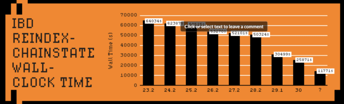

> *作者：willcl-ark, l0rinc, hodlinator*
> 
> *来源：<https://bitcoinmagazine.com/print/the-core-issue-outrunning-entropy-why-bitcoin-cant-stand-still>*

## 初始化区块下载

让一个全新的节点同步到网络的最新状态，要经历几个不同的阶段：

- 对等节点发现，和区块链挑选：节点连接到随机挑选的一些对等节点，然后确定拥有最多工作量证明的链。
- 区块头下载：节点从这些对等节点索取区块头，然后前后连接、形成完整的区块头链。
- 区块下载：节点从多个对等节点处同时请求属于这条链的区块。
- 区块和交易验证：验证完一个区块的交易，才会验证下一个区块的交易。

虽然区块验证天然是讲顺序的 —— 每个区块都依赖于前一个区块所产生的状态，但许多周边工作是可以并行处理的。区块头同步、区块下载和脚本验证，全都可以在不同的线程中各自运行。一个理想初始化区块下载流程要尽可能运用所有的子系统：网络线程下载数据、验证线程验证签名、数据库线程写入产生的状态。

没有持续的性能提升，未来也许配置较差的节点就无法再加入网络了。

## 引言

比特币的 “别信任，去验证” 文化，要求这个账本可以被任何人从头重新建构出来。在处理完所有历史交易之后，对于每个人的资金的状态，应该每个用户都能得到跟网络上的其他人完全相同的结果。

这种可复现性，是比特币的信任最小化设计的灵魂，但它也是以巨大的代价换来的：在比特币区块链诞生 17 年以后，这个日渐膨胀的数据库，让新加入网络的人必须比前人消耗更多资源来执行使用它的准备工作。

要从头启动一个新节点，它必须下载、验证和持久化保存从创世区块到当前链顶端的每一个区块 —— 这项消耗大量资源的同步过程，就叫 “IBD（初始化区块下载）”。

虽然消费级硬件持续升级，让初始化区块下载保持低负担依然对中心化至关重要：要确保每个人都能验证比特币区块链，从低功耗的设备（比如树莓派），到高功耗的服务器。

## 基准测试

性能优化的起点是理解软件组件、数据模式、硬件和网络条件，以及它们的互动如何产生出性能瓶颈。这需要大量的测试，其中绝大部分不会产生什么成果。除了常规的要在速度、内存使用量和可维护性上取得平衡，`Bitcoin Core` 开发者们还必须选择 低风险/高回报的变更。有效但微小的优化，常常会因为风险大于收益而被拒绝。

我们有一套重要的微小基准测试套件，以保证现有的功能不会出现性能下降。这对于捕捉回归效应（即单段代码中的性能倒退）非常有用，但并不必然代表初始化区块下载的整体性能。

提议优化措施的贡献者们提供了不同环境中的可复现性和指标：操作系统、编译器、存储器类型（固体硬盘 vs. 机械硬盘）、网络速度、数据库缓存空间、节点配置（剪枝模式 vs. 归档模式处）、索引组合（index combinations）。我们编写了单一用途的基准测试，并使用编译浏览器来验证哪种设置在哪个具体场景下会表现更好（例如，使用 哈希集合/有序集合/有序向量 来实现跨区块的重合交易检查）。

我们也会定期为初始化区块下载运行基准测试。测试方法有：从本地区块文件中重新索引区块链状态（chainstate）（还可同时要求重新索引区块）；或者，从一个内网的对等节点或从广大的点对点网络执行一次完整的初始化区块下载（使用内网的对等节点可以避免网络连接较慢的对等节点影响计时）。 

初始化区块下载的基准测试显示出来的提升，常常比微型基准测试所显示的更小，这是因为网络带宽或者硬盘读写常常是瓶颈所在；在全球平均网速下，光是下载整个区块链就要花去大约 16 小时。

为了最大化可复现性，我们通常更喜欢重新索引链状态的测试方法，它会展示处优化前和优化后的内存和 CPU 使用情况，并且验证这些变更会如何影响其它功能。

## 历史上的以及开发中的优化

早期的 `Bitcoin Core` 版本是为小得多的区块而设计的。最早的由中本聪编写的原型只是打下基础，如果没有来自 `Bitcoin Core` 开发者们的持续创新，它早就无法应对这个网络的前所未有的规模了。

最初，区块索引会存储每一笔历史交易以及它们是否已被花费，但在 2012 年，开发者 “Ultraprune”（PR #1677）创建了一个专门的数据库，用于跟踪未花费的交易输出，这就形成了 “UTXO 集” 的概念；这个数据库会预先缓存所有 *可以花费* 的铅笔的最先状态，从而为区块验证提供一个统一的视角。再加上从 Berkeley DB 到 LevelDB 的数据库实现迁移，验证速度得到巨大提升。######

不过，这一数据库实现迁移也导致了 BIP50 <a href='#note1' id='jump-1-0'>1</a> 链分叉：一个包含许多交易输入的区块，被升级后的节点接受，却被未更新的节点拒绝（因为区块过于复杂）。这凸显了 `Bitcoin Core` 开发工作与常规的软件工程的区别：即使是纯粹的性能优化，也可能导致意料之外的链分裂。

在接下来的一年，（PR #2060）启用了多线程的签名验证。几乎同一时间，专用的密码学库 [libsecp256k1](https://delvingbitcoin.org/t/comparing-the-performance-of-ecdsa-signature-validation-in-openssl-vs-libsecp256k1-over-the-last-decade/2087/2) 诞生，并在 2014 年集成到了 `Bitcoin Core`。在接下来的十年里，经过持续的优化，它已经比通用的 OpenSSL 库中的相同功能快上 8 倍。

“区块头优先同步”（Headers-first sync，PR #4468，2014）重构了初始化区块下载流程：先下载累计了最多工作量的链的区块头，然后从多个对等节点处同时索取区块。除了加速 IBD，它也让节点不会在不归属于主链的孤儿区块上浪费带宽。

在 2016 年，PR #9049 移除了一个似乎是多余的重合输入检查，带来了一个允许通货膨胀的共识 bug 。幸运的是，在被利用之前，它就被发现和打上补丁了。这个意外推动了大规模的测试资源投资。现在，有了[差分模糊测试](https://bitcoinmagazine.com/print/the-core-issue-keeping-bitcoin-core-secure)（[中文译本](https://www.btcstudy.org/2026/03/13/the-core-issue-keeping-bitcoin-core-secure/)）、广泛的代码覆盖和严格更的审核纪律，`Bitcoin Core` 发现和解决问题的速度都快得多了，而且自那以来再也没有报告过同等严重的共识漏洞 <a href='#note2' id='jump-2-0'>2</a>。

在 2017 年，`-assumevalid`启动标签（PR #9484）将普通的区块有效性检查与昂贵的签名验证分离开来，让后者对于 IBD 的绝大部分变成可选项，从而让 IBD 的时间减少了大约一半。区块构造、工作量证明和花费规则，依然是完全验证的：`-assumevalid` 模式只是完全跳过了签名检查（在抵达特定高度以前）。

在 2022 年，PR #25325 将`Bitcoin Core` 的普通内存分配器换成了一个定制化的、基于池子的分配器，而且专门为钱币缓存做了优化。通过专门为比特币的分配模式设计，它减少了内存浪费、提高了缓存效率，让 IBD 的速度加快了大约 21%，同时，在相同的内存用量上塞进了更多钱币。

虽然代码自身不会变异，但它寄身的系统在不断变化。每隔 10 分钟，比特币的状态的改变一次 —— 使用模式一改变，瓶颈也就发生变化。维护和优化并不是可有可无；没有持续的改进，比特币积累漏洞的速度会快过静态的代码库所能抵御的速度，而初始化区块下载的性能性能会迅速下降，哪怕硬件还在不断进步。

UTXO 集的不断膨胀的规模，还有区块平均重量的增加，都放大了这些变化。曾经，软件的任务只是 CPU 密集的（比如签名验证），现在常常是硬盘读写密集的，因为更多的链状态访问（必须在磁盘中检查 UTXO 集）。这种变迁已经推动了新的优先级：优化内存缓存、减少 LevelDB 刷写频率，以及并行化磁盘读取，从而让新型的多核 CPU 保持忙碌。

- 不同 Bitcoin Core 发行版的 IBD 时间一览 -

### 近期优化

软件设计的基础是对使用模式的预测，而这种预测必然随着网络的演变而偏离实情。比特币的确定性的工作负载，让我们可以度量实际行为并时候纠正，确保性能跟得上网络的增长。

我们持续地调整软件的默认设置，以更好地适应真实世界的使用模式。举几个例子：

- PR #30039 提高了 LevelDB 的最大文件体积 —— 仅此一个参数改变，就让 IBD 加速了接近 30%， 因为它更好地匹配了实际访问链状态数据库（UTXO 集）的模式。
- PR #31645 倍增了刷写批次的体积，减少了初始化区块下载的最密集写入阶段的碎片化磁盘写入，还加快了初始化区块下载被打断时候的进度保存。
- PR #32279 调整了内部预向量（prevector）的存储体积（主要用于内存内的脚本的存储）。旧的隔离见证前阈值，会偏向较老的脚本模板，牺牲较新的模板。通过调整它的容量以覆盖新式的脚本体积，避免了零碎的分配，减少了内存碎片化，脚本执行也受益于更好的缓存定位。

全部都是微小的变化，但带来了可观的影响。

除了参数调整，一些变更还要求我们重新思考现有的设计：

- PR #28280 改进了剪枝节点（为节约磁盘空间而放弃旧区块的节点）处理频繁的内存缓存刷写的方式。原本的设计要么是丢掉整个缓存，要么是扫描它以寻找修改后的条目。有选择地跟踪修改后的条目，为使用最大缓存（`dbcache`）的剪枝节点带来了超过 30% 的加速，在默认设置上也产生了大约 9% 的加速。
- PR #31551 引入了区块文件的 读取/写入 批处理，减少了许多小规模的文件系统操作的开销。这个 4 到 8 倍的区块文件读取加速，不仅让初始化区块下载受益，也让其他 RPC 受益。
	- PR #31144 优化了现有的可选的区块文件混淆（用于确保数据并非以明文存储在磁盘上），通过按 64 比特的分块来处理而非按字节处理，带来了又一项 IBD 加速。随着混淆变得几乎免费，用户不再需要在安全存储和性能之间二选一。

其它微小的缓存优化（比如 PR #32487）启用了以往被（PR #32638）认为是过于昂贵的额外的安全性检查。

类似地，现在我们可以更加频繁地刷写缓存到磁盘（PR #30611），确保在宕机事件中，节点绝不丢失 1 个小时以上的验证工作。这个微小的开销是能够接受的，因为更在的优化已经让初始化区块下载快了很多。

PR #32043 当前是 IBD 相关的性能提升的一个跟踪帖。它归纳了十多项正在开展的工作，从硬盘和缓存的调整，到并发的强化措施，并且提供了一个框架来度量每一项变更会如何影响实际场景中的性能。这种方法鼓励贡献者们不仅给出代码，也给出可复现的基准测试、使用量数据和多种硬件的比较。

### 未来的优化建议

PR #31132 让区块验证期间的交易输入索取并行化。当前，每个输入都是按顺序从 UTXO 集中索取的 —— 如果缓存中没有找到，就需要磁盘通信，从而产生读写瓶颈。这个 PR 在多个工作线程之间引入了并行化的索取，在 `-reindex-chanstate`（重新索引链状态）中实现了大约 30% 的加速（在使用 450MB 数据库缓存的树莓派 5 电脑上，只花费大约 10 小时）。它的副作用是，缩小了使用高低 `-dbcache` `配置的性能差距，让内存不多的节点同步起来可能跟高内存的节点一样快。

除了初始化区块下载，PR #26966 还使用可配置的工作线程，并行化了区块过滤器和交易索引编制。

让持久化存储的 UTXO 集保持紧凑，对于节点的经济性至关重要。PR #33817 通过移除一个可选的 LevelDB 特性（可能并非比特币应用场景所需），实验出了稍微减少它的效果。

[SwiftSync](https://delvingbitcoin.org/t/swiftsync-speeding-up-ibd-with-pre-generated-hints-poc/1562) <a href='#note3' id='jump-3-0'>3</a> 是一种实验性的方法，利用了我们对历史区块的后见之明。已知实际的结果，我们可以为每一个遇到的钱币按其在目标高度的最终状态分类：依然未花费的（就要存下来），和在那高度前已经花费掉的（就要忽略，仅仅验证它们出现在匹配的 创建/花费 配对中，具体位置则不必理会）。预先生成的提示可以编码这种分类，让节点可以完全跳过短命钱币的 UTXO 操作。

## 比特币对所有人开放

除了合成的基准测试，[近期的一项实验](https://x.com/L0RINC/status/1972062557835088347) <a href='#note4' id='jump-4-0'>4</a> 也在一个降频的树莓派 5 上运行了 Swiftsync 原型；这个树莓派 5 用一个电池包供电，通过 WiFi 联网，在 3 小时 14 分钟内就重新编制了 888,888 个区块的链状态。使用等效配置的实验，在较新的 `Bitcoin Core` 版本上显示出 [250% 的完全验证加速](https://x.com/L0RINC/status/1970918510248575358) <a href='#note5' id='jump-5-0'>5</a>。

多年积累的工作转化成了巨大的影响：完全验证接近 100 万个区块，在便宜的硬件上也能在 1 天之内完成；尽管区块链在持续增长，还是保持了经济性。

自我治理比以往任何时候都更加容易。

## 参考文献

1.https://github.com/bitcoin/bips/blob/master/bip-0050.mediawiki <a href='#jump-1-0'>↩</a>

2.https://en.bitcoin.it/wiki/Common_Vulnerabilities_and_Exposures <a href='#jump-2-0'>↩</a>

3.https://delvingbitcoin.org/t/swiftsync-speeding-up-ibd-with-pre-generated-hints-poc/1562 <a href='#jump-3-0'>↩</a>

4.https://x.com/L0RINC/status/1972062557835088347 <a href='#jump-4-0'>↩</a>

5.https://x.com/L0RINC/status/1970918510248575358 <a href='#jump-5-0'>↩</a>

本文列出的所有 PR，都可以通过编号在这里查找：https://github.com/bitcoin/bitcoin/pulls