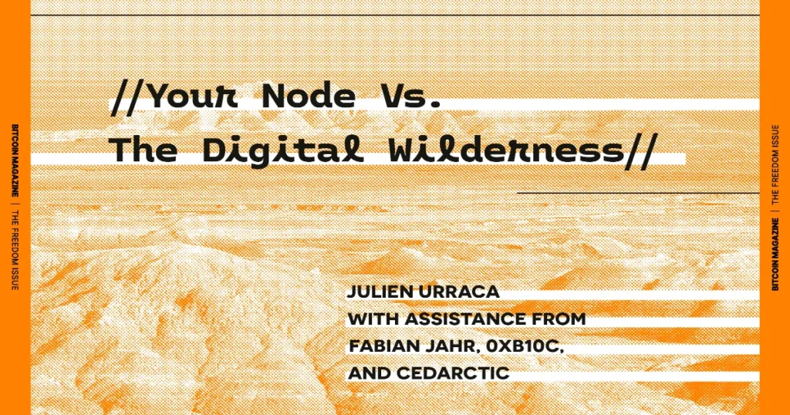

> *作者：Julien Urraca, Fabian Jahr, 0xb10c,  CedArctic*
> 
> *来源：<https://bitcoinmagazine.com/print/the-core-issue-your-node-vs-the-digital-wilderness>*

五十年前，互联网的第一条消息发送成功；然而，点对点网络一直是稀罕物种。比特币提供开放货币系统的能力， 建立在它的点对点网络架构之上；同时，这个联网层 —— 对等节点发现以及彼此连接 —— 也正是它的受攻击面上最为脆弱的部分。出现问题的主要位置有两个：比特币自身的对等节点协议，以及位于比特币协议之下的互联网协议。从这个角度看，`Bitcoin Core` 承担双重使命：既要防范可能被对等节点滥用的 “拒绝服务式攻击（DoS）” ，又要让节点们能在广阔的敌意环境（也就是互联网）中安全地沟通。

## P2P

> 政府很善于砍掉那些中心化控制的网络（比如 Napster），但纯粹的 P2P 网络（比如 Gnutella 和 Tor）似乎还能自行其是。
>
> —— 中本聪，2008 年 11 月 7 日  <a href='#note1' id='jump-1-0'>1</a>

比特币的 P2P 协议规定的是节点们交换关于交易、区块以及其它对等节点的信息的方式。 这种信息交换，是任何交易能够传播、共识能够验证的前提，因此是重中之重。

在这些年间，这个领域也出现过多个 bug 。举个例子，2017 就修复并且披露了一个恶意的 SOCKS 服务端漏洞  <a href='#note2' id='jump-2-0'>2</a>。2020，有人报告了一个高危漏洞：一个远端的对等节点可以让本地节点禁止跟一些 IP 地址的连接，并让这个禁止清单平方级增长，因此是对节点的一种 DoS  <a href='#note3' id='jump-3-0'>3</a>；这个漏洞在当年就被修复，但一直到 2024 年才披露。这个 bug 被合情合理地标记为 “高危”，是一这我这种攻击很容易实施，而它的结果是受害者节点丧失功能，而且成功攻击所需要的前提很少。这就是那种会让 `Bitcoin Core` 开发者通宵工作的 bug ，也是为什么我们非常建议你将软件升级成还在维护的版本（过于老旧的 `Bitcoin Core` 版本不会再得到积极的 维护/升级）。

这个我们称为 “比特币” 的分布式网络，还算比较小：它的清网（clearnet）节点数量还在 20k 上下徘徊，甚至，即使我们假设有 100k 个 Tor 节点，这个网络依然是一个比较小的、容易被监控的网络。最近，Daniela Brozzoni 和 naiyoma 证明了：如果一个节点同时运行了清网端口和 Tor 端口，那很容易就能把它的 IPv4 网络地址与 Tor 网络地址关联起来  <a href='#note4' id='jump-4-0'>4</a>。情报机构和区块链分析公司很可能已经在这样做了。节点们的网络地址都搞清楚之后，就很容易注意到哪些节点最先发布了哪一笔交易，也就是各交易的出发点 IP，然后凭借 IP 找出交易者的地理位置。虽然这并不算一个 bug ，因为节点不会崩溃，也不会偏离轨道，但可以认为是一种漏洞，因为它形成了一种方法，可以将一个 IP 地址与一笔交易关联起来。

如何防范这种方法，到目前还是一个开放问题。

## 万维网沙漠

> 我们打造计算机就像建立城市。一砖一石，漫无计划，不舍废墟。
>
> —— Ellen Ullman  <a href='#note5' id='jump-5-0'>5</a>

比特币运行在互联网（Internet）上，它保持一个分布式去中心化系统的能力也取决于互联网自身的属性。不幸的是，互联网的架构，如我们所知，直到今天依然是非常不安全的，各种已知的攻击还在轮番上演。绝大部分这些攻击都不为人知，直到造成真实损害，就更不用说如今互联网上无处不在的监视了。

需要担心的最著名也最实用的攻击手法，叫做 “日蚀攻击（eclipse attack）”，就是一群恶意节点完全包围一个受害者节点、向它提供网络和区块链的一种特性视角。 这种攻击根生于分布式系统，只要你控制了一个节点的所有对等节点，你就控制了它对网络的理解。Ethan Heilman 和协作者们在 USENIX 2015 上就演示了最早的实用型日蚀攻击之一  <a href='#note6' id='jump-6-0'>6</a>；在 2018 年，Erebus 攻击论文描述了通过一个恶意的自治系统（AS）发起的一种 “隐秘的” 日蚀攻击  <a href='#note7' id='jump-7-0'>7</a>。

这些攻击，很大程度上是利用了组成互联网的网络们彼此沟通的方式中的弱点，比如自治系统路由拓扑，或是通过一种叫做 “边界网关协议（BGP）” 的协议。虽然有一些开发中的保护 BGP 协议的项目 —— BGPsec、RPKI —— 它们都有众所周知的局限性，因此互联网的管理者们还在渴望更强大的解决方案。在那之前，互联网仍将是狂野的大西部。

最近，来自 Chaincode Labs 的 cedarctic 的一项分析发现，比特币的节点只分布在 4551 个自治系统中，只是组成互联网的单元网络中的很小一部分。他们介绍了一组攻击，可以通过爆破这些节点所在的上游自治系统来发动日蚀攻击 <a href='#note8' id='jump-8-0'>8</a>。这些节点在匿名系统中的稀疏分布，以及这些匿名系统的具体关系，产生了一种独特的攻击界面。虽然存在补救措施，尚不清楚这些攻击界面会被比特币人还是敌手先理解。

任何需要攻破一个乃至多个自治系统的攻击，都需要资源、协作和技巧。虽然还没有人报告对比特币节点的这种攻击成功案例，这样的攻击在矿工 <a href='#note9' id='jump-9-0'>9</a>、钱包软件 <a href='#note10' id='jump-10-0'>10</a>、互换平台 <a href='#note11' id='jump-11-0'>11</a> 和桥接合约 <a href='#note12' id='jump-12-0'>12</a> 上都成功过。 虽然我们没法修复互联网，但我们可以给节点提供在这样的敌意环境中生存的工具。

## 网络武备

以下是 `Bitcoin Core` 已经开发出、或者已经集成了支持的一些特性和功能，可以保护用户应对网络层面的攻击：

**TOR（洋葱路由）**是最早集成到 `Bitcoin Core` 的隐私保护性覆盖层网络。它在对等节点的网络中创造出随机的跳跃来混淆流量。

**v2transport**  <a href='#note13' id='jump-13-0'>13</a> 加密对等节点之间的连接，向监视者和审查者隐藏流量的内容。 它的目的是阻止被动的网络观察者窥探你跟其它节点之间通信的内容。

**I2P（不可见的互联网）** <a href='#note14' id='jump-14-0'>14</a> 是 `Bitcoin Core` 的一个可选的特性，它会给连接启用一个额外的、隐私的、加密的层。它是一种类似于 Tor 的匿名网络网络，依赖于对等节点来混淆客户端与服务端之间的流量。

**ASmap** <a href='#note15' id='jump-15-0'>15</a> 是 `Bitcoin Core` 的另一个可选特性，实现了对 Erebus 攻击的一种缓解措施（已被作者概述在论文中，并且适用所有基于自治系统的攻击）。通过让比特币的对等节点机制意识到其对等节点所在的自治系统并保证对等节点的多样性，日蚀攻击将变得困难许多，因为攻击的将需要攻破多个自治系统，这是很难（甚至不可能）不被发现的。从 20.0 版本开始， `Bitcoin Core` 支持取得一个从 IP 网络到其自治系统的映射（一个 AS 映射），而 Kartograf 项目让任何用户都能轻松生成这样的 AS 映射。

互联网可能会还会有许多弱点，我们可以做的事情之一是观察我们的对等节点的动作、尝试侦测恶意动作。这就是 0xb10c <a href='#note16' id='jump-16-0'>16</a> 发起的 “**对等节点观察者项目**” 的初衷。它提供了一套完整的基于 eBPF 观察点的日志系统（从而观察运行在一个操作系统上的一个程序的最细微动作），以观察一个节点的活动，也包括对等节点的行为。它也提供了定制你自己的日志系统所需的一切。

## 比特币必须坚强

保护连接到对等节点和交换消息的能力，是让比特币得以运转的拱顶石。

比特币生活在一个多维度的敌意环境中，许多威胁是由互联网架构自身的局限性带来的。比特币要生存和发展，其开发者和用户就必须学着乘风破浪。

开放网络的代价就是不能放松警惕。

## 脚注

1.https://web.mit.edu/gtmarx/www/connect.html <a href='#jump-1-0'>↩</a>

2.https://satoshi.nakamotoinstitute.org/emails/cryptography/4/ <a href='#jump-2-0'>↩</a>

3.https://bitcoincore.org/en/2019/11/08/CVE-2017-18350/ <a href='#jump-3-0'>↩</a>

4.https://bitcoincore.org/en/2024/07/03/disclose-unbounded-banlist/ <a href='#jump-4-0'>↩</a>

5.https://delvingbitcoin.org/t/fingerprinting-nodes-via-addr-requests/1786/ <a href='#jump-5-0'>↩</a>

6.https://en.wikiquote.org/wiki/Ellen_Ullman <a href='#jump-6-0'>↩</a>

7.https://www.usenix.org/system/files/conference/usenixsecurity15/sec15-paper-heilman.pdf <a href='#jump-7-0'>↩</a>

8.https://ihchoi12.github.io/assets/tran2020stealthier.pdf <a href='#jump-8-0'>↩</a>

9.https://delvingbitcoin.org/t/eclipsing-bitcoin-nodes-with-bgp-interception-attacks/1965 <a href='#jump-9-0'>↩</a>

10.https://www.theregister.com/2014/08/07/bgp_bitcoin_mining_heist/ <a href='#jump-10-0'>↩</a>

11.https://www.theverge.com/2018/4/24/17275982/myetherwallet-hack-bgp-dns-hijacking-stolen-ethereum <a href='#jump-11-0'>↩</a>

12.https://medium.com/s2wblog/post-mortem-of-klayswap-incident-through-bgp-hijacking-en-3ed7e33de600 <a href='#jump-12-0'>↩</a>

13.www.coinbase.com/blog/celer-bridge-incident-analysis <a href='#jump-13-0'>↩</a>

14.https://bitcoinops.org/en/topics/v2-p2p-transport/ <a href='#jump-14-0'>↩</a>

15.https://geti2p.net/en/ <a href='#jump-15-0'>↩</a>

16.https://asmap.org <a href='#jump-16-0'>↩</a>

17.https://peer.observer

18.https://github.com/asmap/kartograf