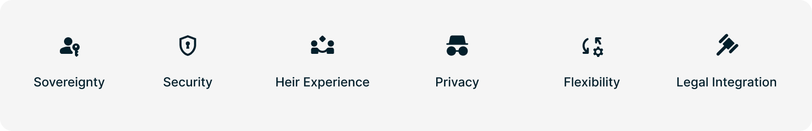
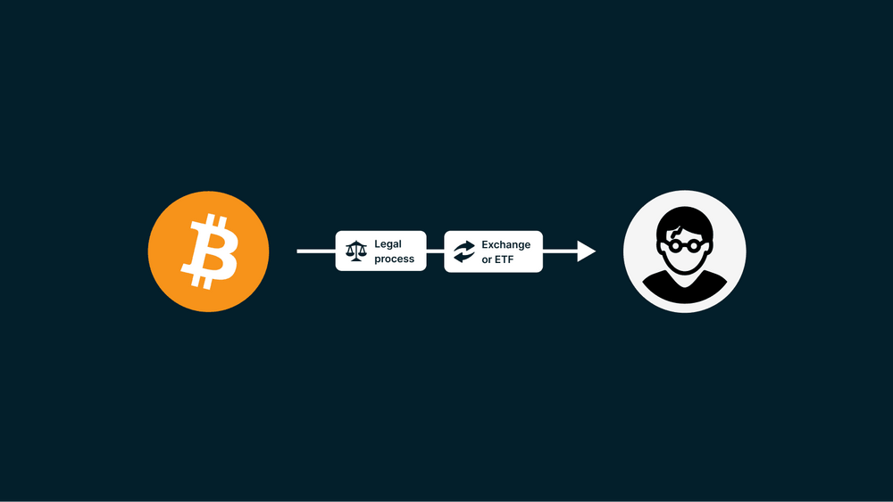

> *作者：Nunchuk*
> 
> *来源：<https://nunchuk.io/blog/bitcoin-inheritance-guide>*

## 摘要

- **自治的悖论**：最大化安全性，通常意味着让拿到你的比特币变得更难，但继承的需求刚好相反。解决这个问题而又不重新引入受信任的中介，是数字遗产的中心挑战。
- **托管风险**：依赖于第三方的托管人（例如，交易所，或者比特币 ETF）会带来单点故障和隐私泄露（因为它们都是 “蜜罐”），并且会增加人身威胁（“扳手攻击”）或资产没收的风险。
- **DIY 风险**：完全自主设计和执行的方法通常是脆弱的，伴有出现技术故障或者用户误操作的风险，可能会导致资产永久锁定。
- **评估框架**：一个可靠的计划，必须平衡六个维度：自治、安全性、继承人体验、隐私性、灵活性，以及法律兼容性。
- **黄金标准**：最优的解决方案结合了 “带有助手的合作式托管”（为继承人提供指导）以及一项 “自动化的区块链故障保险”（保证执行，即使供应商出了故障）。

## 引言：自治的悖论

比特币为世界带来了真正的数字化自治。有史以来第一次，个人可以安全地持有财富，无需依赖于银行、政府和托管商。这种力量浓缩在一句俗语中：“无私钥，即无币（Not your keys, not your coins）”。

然而，这种深沉的责任，在计划未来时产生了一种独特的挑战：**自治的悖论**。

你如何保证，你的比特币会在你去世之后，安全地转移给你的继承人呢？你的方法会不会牺牲今日的财产安全性，或者重新引入受信任的第三方（这是比特币本来要剔除的东西）？

- 如果现在你就直接给你的继承人一份私钥的拷贝，那就提高了在你有生之年遭遇盗窃的风险。
- 如果你把私钥藏得太好，那你的继承人可能就找不到它们。
- 要是你依赖一家公司来管理财产转移，那要是这家公司破产了，或者被迫冻结你的资产，要怎么办？

一着不慎，可能满盘皆输。区块链分析公司们估计，已经有数百万 BTC 已经永久丢失了 —— 再也无法使用了，因为控制它们的私钥已经因为硬件丢失、忘记口令或所有者的死亡而不见了。虽然不可能知道其中有多大比例是因为继承计划的失败，但是，缺乏妥当的继承计划，是一种巨大的风险，会威胁到比特币持有者的时代财富。

但是，这也是一种可以防范的风险。本指南提供了一份全面的框架来应对这一挑战。我们将探索比特币继承解决方案的领域，评估它们的取舍，并提出一种为你的家族保护比特币的新兴标准。

## 第一章：比特币继承的挑战

要理解比特产继承的难点，你得先理解比特币是什么。

比特币是一种 “不记名的资产”，类似于黄金。不管是谁，只要拿到了私钥（通常表示为 12 个或 24 个词的一组词语，称为 “种子词”），就能用这些私钥控制对应的资产。比特币网络不知道什么是身份、死亡证明、法庭命令。它只知道由私钥提供的密码学证据。

这就给继承带来了几项关键的挑战：

1. **安全性/易得性 的矛盾**：为了在你有生之年保管号比特币，你希望别人难以拿到你的私钥。而要保证继承，你又希望（当你大限到来时）你的继承人可以轻松用上这些私钥。如果你的继承计划让你的继承人可以很容易就拿到私钥，那么可能也防不住攻击者。
2. **复杂性障碍**：许多安全装置（比如多签名钱包）需要大量技术知识来复原。继承人们通常既没有技术知识，又过度悲伤，也许无法走完复原过程、导致资金丢失。
3. **“扳手攻击” 风险**：比特币的价值提升，人身威胁和勒索（也即所谓的 “5 美元扳手攻击”）的风险也随之增加。[安全数据](https://github.com/jlopp/physical-bitcoin-attacks)表明，已经出现了瞄准已知的密码货币持有者的暴力犯罪和有组织犯罪。简单的继承计划，比如在家用保险箱里留下私钥，创造了一种单点故障，同时会让你和你的家人暴露在上述针对性攻击中。
4. **寿命问题**：在计划代际财富时，你面对的时间以 10 年为单位。你如何相信，协助你执行继承计划的公司能够运营 30 到 50 年？

强健的继承计划必须能够同时解决所有这些问题。

## 第二章：评估继承解决方案的框架

并不是所有的继承解决方案都一样好。为了选择正确的道路，我们需要一个框架，来评估它们的取舍。我们提出了 6 个本质指标：

### 1. 自治（信任最小化）

这个解决方案是否依赖于一个第三方（一家公司、一位律师或政府）的持续运营或许可来执行继承计划？一个真正自治的计划要最小化信任，确保即使供应商消失，继承计划也能执行。

### 2. 安全性

这个解决方案能不能在持有者有生之年好好保护 TA 的比特币？它必须能抵御电子盗窃、人身威胁和意外损失。多签名技术（拥有多个密钥才能转移资金的保管装置）是高安全性的标准。

### 3. 继承人体验（易得性）

对于目标继承人来说，复原过程有多复杂？如果继承人无法执行，那这个计划是无用的。解决方案的范围从完全自助（需要技术知识）到完全被动（由专家指导）。

### 4. 隐私性

解决方案是否要求你或你的继承人揭示敏感的个人信息（KYC）？继承是一件敏感的事情；最好的解决方案建立在密码学证据而不是身份上。

### 5. 灵活性

更新整个计划是否容易？生命状态时时变化。你可能需要变更受益人、替换已经暴露的密钥，或调整继承的时机。

### 6. 法律兼容性

解决方案能否配置成加入一个信托人，或者与现有的法定遗产计划（遗嘱和信托）相结合，如果所有者希望的话？

## 第三章：继承计划的光谱

继承解决方案也有一个光谱，从完全中心化到完全自助。我们可以将已经出现的解决方案大致分为四个类别。

### 3.1 托管解决方案（遗产方法）

**详情**：在中心化交易所（比如 “Coinbase” 和 “Kraken”）、比特币 ETF（股票指数型基金）或专门的数字资产托管商那里持有比特币。

**机制**：托管商控制着私钥。继承完全依赖于传统的法律程序、身份验证和托管商的用户条款。

| **维度**       | 评估                                                         |
| -------------- | ------------------------------------------------------------ |
| **自治**       | **非常低**。对手方风险最高（“无私钥，即无币”）。托管商可以冻结或没收你的资产。 |
| **安全性**     | **中等**。难以抵御大规模黑客攻击、银行倒闭和政府没收，虽然受到制度控制的保护。尤其是，绝大部分比特币 ETF 都重度依赖于相同的中心化托管商，这就创造了一个巨大的系统化的故障点。 |
| **继承人体验** | **低**。虽然交互流程是熟悉的，继承人将面临 “双重中介问题”：他们必须在交易所的严格合规官僚主义 *以及* 传统的遗嘱认证法庭制度之间游走。整个过程会很漫长，通常要几个月甚至数年。此外，遗嘱认证记录通常是公开的，有可能向犯罪者暴露你的继承人的身份，以及遗产的价值。 |
| **隐私性**     | **非常低**。强制性 KYC/AML 合规。此外，中心化的数据库，对于黑客来说是巨大的 “蜜罐”。这种事情一再发生：保存有敏感客户信息（[身份](https://www.coindesk.com/markets/2019/08/07/binance-customer-data-has-leaked-what-we-know-and-what-we-dont)、[家庭地址](https://www.theblock.co/post/65709/blockfi-says-it-suffered-a-data-breach-but-no-customer-funds-were-lost)、[财产数量](https://bitcoinmagazine.com/business/why-celsius-exposed-users-and-what-you-can-do)）的[托管商数据库](https://proton.me/blog/coinbase-breach)被爆破、泄露给犯罪分子，增加针对性人身攻击的风险。即使大的 ETF 发行人也很脆弱；在 2024 年，一个 [Fidelity 数据库](https://finance.yahoo.com/news/fidelity-says-data-breach-exposed-114841294.html)爆破泄露了超过 77000 位客户的社会安全号码和驾照。 |
| **灵活性**     | **中等**。虽然比特币 ETF 通常允许指定受益人（死亡时转移），绝大部分密码货币交易所都不允许。这迫使资产进入遗嘱认证，除非账户从一开始就被注册为信托 —— 这个特性通常只开放给高净值账户和机构账户。 |
| **法律兼容性** | **高**。与传统的法律系统完全兼容。                           |

**结论**：非常便利，但缺乏自治。这种方法牺牲了比特币的核心优势，换取熟悉的继承系统。

### 3.2 DIY 解决方案（完全自治）

**详情**：持有者完全自己负责建立和管理遗产计划，不引入专业助手。

**机制**：DIY 方法有好多种，每一种都有自己的取舍和故障模式：

- **简单备份/克隆私钥集合**：提供种子词的完整拷贝或者硬件签名器给继承人。
  - *故障模式*：在持有者有生之年遭遇盗窃的高风险；因为攻击界面增加了。针对持有人和继承人的人身攻击（勒索）显著风险。
- **预签名交易（“失能开关”）**：制作一笔有效的比特币交易，将资金发送到继承人的地址，但交易是带有时间锁的（通过 `nLockTime`），所以只能到时间再广播。
  - *故障模式*：**操作脆弱性**。这种方法被广泛讨论过，但因为下面三个原因，在实践中很危险：
    1. *UTXO 失效*：一旦你 *从* 该钱包中支出比特币，预签名的交易就有可能失效；或你使用该钱包来 *接收* 比特币，预签名的交易就无法转移所有的余额。你必须持续重现签名新的交易。
    2. *手续费波动*：你必须为几年后才广播的交易设定挖矿手续费。如果手续费飙升，这笔交易就会卡住、得不到区块确认；如果手续费大幅下降，你就会过度支付。
    3. *目的地刚性*：你必须今天就指定继承人的目的地地址，无法更改）。如果继承人的钱包暴露，或者在 10 年后丢失，你必须重新创建整个流程，才能改变资金的流向。
- **Shamir 私钥分割（SSS）**：将种子词分割成几份并分散开来。
  - *故障模式*：正确执行是极其复杂的。SSS 缺乏一个通行的行业标准：使用某一款 SSS 工具创建的碎片通常无法用另一款工具来汇合，这就给你的继承人创造了一种 “供应商锁定” 风险。在创建和复原中出现误操作的高风险。
- **DIY 的多签名/时间锁**：使用开源工具建立高级的协议。
  - *故障模式*：技术复杂性高。继承人缺乏支持。

| **维度**       | 评估                                                         |
| -------------- | ------------------------------------------------------------ |
| **自治**       | **非常高**。最小化对第三方的依赖。                           |
| **安全性**     | **不确定**。用户误操作的高风险。简单备份对于盗窃和人身攻击是非常脆弱的；专业装置是非常安全的。 |
| **继承人体验** | **非常低**。继承人高负担，要在没有指导的情况下执行复杂的复原流程。 |
| **隐私性**     | **高**。不需要 KYC 。                                        |
| **灵活性**     | **低**。安全地修改计划是较为复杂的。                         |
| **法律兼容性** | **低**。如无专业的技术指导，则难以正确实现。                 |

**结论**：最大化自治，但也最大化了复杂性和风险。这条路需要持有者和继承人都精通技术；而且常常带有误操作的高风险。

### 3.3 带有助手的合作式托管（链外解决方案）

**详情**：对 DIY 和托管方案的显著提升。这些服务会帮助用户建立一个多签名钱包：供应商持有其中一个密钥，而用户持有其它密钥。

**机制**：继承的逻辑 —— 比如要求等待期（时间锁）或存活检查 —— 都由供应商的平台在区块链外管理。在领取遗产时，供应商必须主动参与，要么是联合签名交易，要么是在验证申请或持有人失能之后释放密钥。

**案例**：Nunchuk（链外协议）、Casa、Unchained Capital、Bitkey 。

| **维度**       | 评估                                                         |
| -------------- | ------------------------------------------------------------ |
| **自治**       | **中等**。虽然用户控制着多数密钥，但遗产转移流程还是完全依赖于供应商的主动参与。这就是 “**弹性间隙**”：如果供应商出了问题，遗产计划可能也会出问题。 |
| **安全性**     | **高**。多签名钱包提供了健壮的安全性，消除了单点故障。       |
| **继承人体验** | **高**。供应商为继承人提供指导性支持（“平滑路径”），显著降低了复杂性。 |
| **隐私性**     | **不确定**。虽然这项技术自身不会强制要求 KYC，但许多供应商都实现了强制性的身份验证（例如 Unchained）或为加速复原要求条件式 KYC（例如 Casa）。不过，完全无 KYC 的解决方案也是存在的（比如 Nunchuk）。 |
| **灵活性**     | **高**。因为逻辑在区块链外处理，计划容易更新，也不昂贵。     |
| **法律兼容性** | **高**。易于选择性集成信托和遗产计划。                       |

**结论**：在安全性和便利性之间取得了良好的平衡，但依然依赖于供应商的长期存活。重视隐私性的用户必须谨慎挑选一家承诺无 KYC 要求的供应商。

### 3.4 自助的合作式托管（链内方法）

**详情**：[比特币继承领域的最新范式](https://nunchuk.io/blog/autonomous-inheritance)。这种方法结合了辅助合作托管的便利性和安全性，以及自主通过比特币网络来强制执行的可靠性。

**机制**：使用高级的比特币技术（比如 [Miniscript](https://bitcoinops.org/en/topics/miniscript/)），继承的逻辑（时间锁）可以直接嵌入比特币区块链。当时间锁过期，转移资金的要求就自动变更，允许继承人获得资金，无需供应商介入。

这创造了一种 “**平滑路径 + 故障保险**” 模式：

- 平滑路径（带有辅助）：只要供应商还在运营，他们就能为继承人提供带有指引的帮助和支持，实现平滑的复原流程。
- 故障保险（完全自主）：如果无法联系到供应商，或供应商已经停止运作，链上的时间锁保证了继承人依然可以使用开源的工具自主复原资金。

案例：[Nunchuk（链内协议）](https://nunchuk.io/blog/autonomous-inheritance)。

| **维度**       | 评估                                                         |
| -------------- | ------------------------------------------------------------ |
| **自治**       | **非常高**。最高程度的信任最小化。继承计划的设计寿命超过了创建它的公司。 |
| **安全性**     | **高**。建立在健壮的多签名钱包架构上。                       |
| **继承人体验** | **高**。提供了 “平滑路径” 的便利性（指导性协助），又有 “故障保险”（自主复原）的保证作为后备。 |
| **隐私性**     | **高**。可以无 KYC 实现（如 Nunchuk 所做的），依赖于密码学证据而不是身份。 |
| **灵活性**     | **中等**。因为计划在链内强制执行，修改它（例如，改变时间锁的持续实践）需要将资金迁移到新的钱包，将需要支付网络手续费。 |
| **法律兼容性** | **高**。可以配置为选择性加入信托，并与遗产计划结合。         |

**结论**：最优的平衡。这种方法消除了链外解决方案的 “弹性间隙”，提供了最高程度的自主性和隐私性，而无需牺牲安全性和继承人体验。

### 比特币继承领域一览

下表总结了不同方法之间的取舍：

| 特性           | 托管（交易所/ETF） | DIY（完全自主） | 辅助合作托管（链外） | 自主合作托管（链内） |
| -------------- | ------------------ | --------------- | -------------------- | -------------------- |
| **自治**       | 非常低             | 非常高          | 中等                 | 非常高               |
| **安全性**     | 中等               | 不确定          | 高                   | 高                   |
| **继承人体验** | 低                 | 非常低          | 高                   | 高                   |
| **隐私性**     | 非常低             | 高              | 不确定               | 高                   |
| **灵活性**     | 中等               | 低              | 高                   | 中等                 |
| **法律兼容性** | 高                 | 低              | 高                   | 高                   |

## 第四章：最优平衡：当自主遇到辅助

比特币继承解决方案的进化，就是以更大的信任最小化为目标，同时提升易用性。

自主合作式托管（第 4 类）的出现，代表了一场范式转移。它解决了需要辅助和要求自治之间的中心矛盾。

“平滑路径 + 故障保险” 模式承认：虽然必须有可能自主复原，但辅助复原更受喜爱。

- **平滑路径**提供了稳定的情绪。它保证了在困难时刻，继承人能够获得专业指导、减少焦虑和误操作的风险。这种持续的援助，是合作式托管的供应商的主要价值。
- **故障保险**则提供了韧性。它保证了，不论发生什么事，你的遗产都是受到保护的，由比特币网络的不可篡改的规则来强制执行。

这种双路径方法，可谓集两者之所长：今天的高质量服务的便利性，以及明天的自主执行保证。

## 第五章：集成传统的遗产规划

比特币最强大的方面之一是，它可以协助私密的、直接的财富转移。因为比特币网络完全运行在密钥上 —— 它不理解法庭命令，也不知道用户身份 —— 它带来了技术上的资产直接转移，绕过了传统的遗嘱认证以及与之伴随的公开披露和时延。

然而，一些人可能倾向于将自己的比特币储备与正式的遗产计划（比如遗嘱或信托）相结合。强壮的比特币继承解决方案也应该提供支持这些选择的灵活性。

### 信托与受托人的角色

你可能会希望资产受控制地移交，而不是一次性全部移交；或者，你可能希望由一个受信任的顾问来管理这个过程。这就是受托人的作用。

合作式托管解决方案（包括链外和链内方法）可以协助这种集成：

1. **加入一个受托人**：受托人可以被设计为执行领取过程的主要受益人（而不是最终的继承人）。然后，根据法律，受托人有一位根据信托的条款分发资产。
2. **分割私钥**：你可以构造继承装置，使得继承人掌管必要的私钥，而一个法律专家（比如遗产律师或者受托人）掌管必要的说明书或配置文件（通往保险柜的 “地图”）。双方必须合作，才能获得这些财产，这就保证了整个流程符合遗产计划的结构。

### 税务影响

虽然比特币是一种去中心化的协议，继承在绝大部分司法辖区，都是要交税的。合理的规划对财务利益有显著的影响。

- **Setp-up in Basis**：在美国这样的司法辖区，[继承一项资产通常会将该资产的成本基础重设为持有者死亡时刻的公允市场价值](https://www.investopedia.com/terms/s/stepupinbasis.asp)。如果你的继承人日后会售出，这可以显著减少 TA 需要支付的资本利得税。
- **遗产税**：如果你的遗产（包括比特币）的总价值[超过了特定的阈值](https://www.irs.gov/businesses/small-businesses-self-employed/estate-tax)，可能要支付遗产税。

健壮的继承规划要确保你的继承人不仅能获得私钥、领取财富，还能将一定比例变现（如有必要），以在法律规定的时间内支付这些税务。

## 结论：继承的演化

为下一代保管你的比特币，是你走向金融自治的冒险的最后一步。

比特币继承的解决方案，已经得到极大的发展。我们从高风险的托管方案和非常复杂的 DIY 方案，走向了均衡的合作式托管。

今天，自主的、链内解决方案的出现，标志着一个新的标准。通过利用比特币协议的力量，我们可以创建出真正信任最小化的继承方案 —— 设计成能够经受时间的考验、超过开发这些方案的公司的寿命。

通过为你的继承人选择既能提供带有指导的 “平滑路径”、又有自主的 “故障保险” 托底的解决方案，你可以保证，你辛苦挣来的财富，会为你的后代带来保障。

*免责声明：本指南所提供的信息仅能用作一般的信息用途。它不应被当成金融、投资、税务和法律上的建议。比特币的所有权和继承涉及大量的技术，以及因司法辖区而异的法律复杂性。在作出任何关系到你的遗产规划的决定之前，你应该先咨询有资质的专业人士。*

（完）