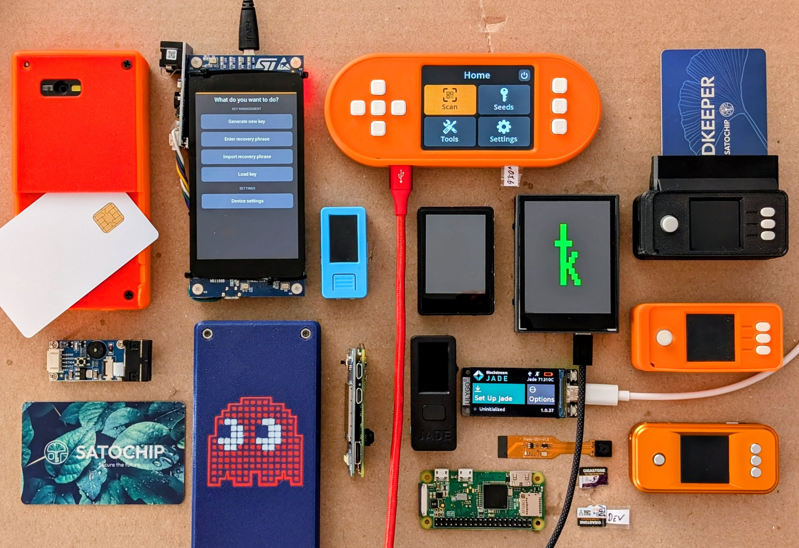
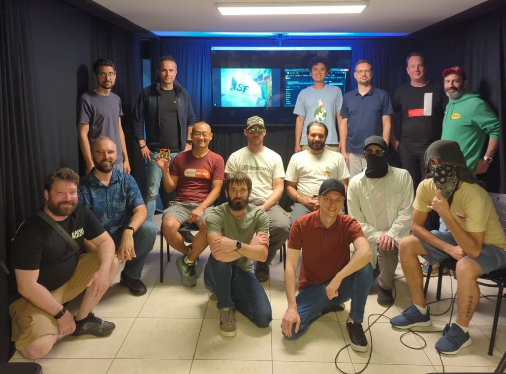
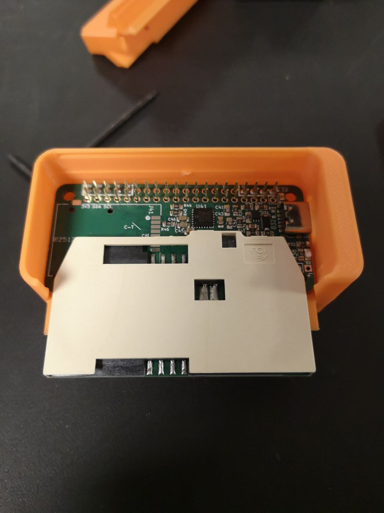
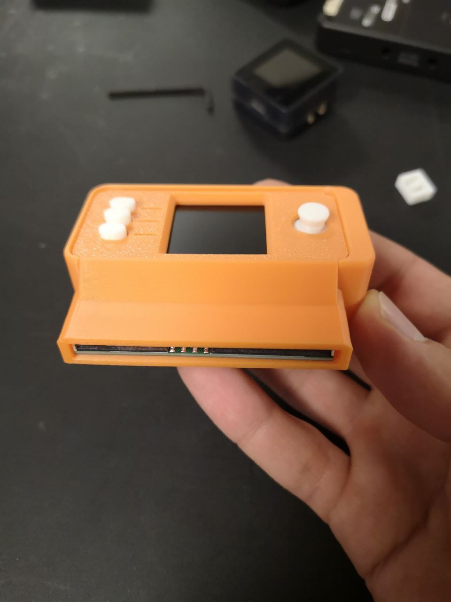
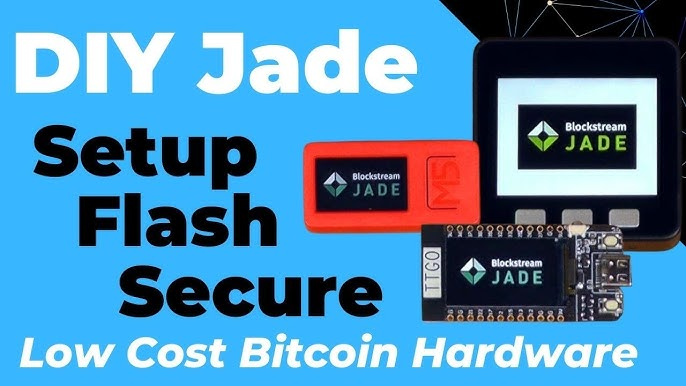

> *作者：kdmukai*
> 
> *来源：<https://github.com/kdmukai/article-diy-signing-device-summit/tree/main>*

*从左上开始，按顺时钟方向：使用 “Shield Lite”智能卡读卡器的 Specter DIY、Specter DIY、SeedSigner+、Krux (M5StickV、TZT、Wonder K)、CryptoGuide 的 SeedSigner + Satochip 复刻（带有智能卡读卡器）、SeedSigner（普通外壳、拉丝金属外壳）、Jade DIY、原版 Jade、SeedSigner 模块、SeedSigner 瘦身版、老款的 Blinky Specter DIY 外壳、Satochip Javacard、Specter DIY 二维码扫描器模块。*

鉴于这个时代，读者的注意力都很难集中，我就先摆结论：

Specter DIY、SeedSigner 以及 Krux 团队（加上 Satochip 和 Jade DIY 项目的专家、自主保管习惯的教育者）聚集在巴西的  São Paulo（圣保罗），这是他们的第一次聚会，他们相互切磋，并开展了更加深度的合作。我们将携起手来，齐头并进。使用 DIY（用户自制的）签名设备来实现比特币自主保管的未来一片光明。我们会征服世界。

## 为什么要把人凑在一起？

这三个项目的比特币运算都依赖于同一个 “embit” 代码库。这个库是由 Stepan Snigirev 创建的。随意，虽然这几个项目有很多不同，但我们一直将彼此视为共享同一个核心代码库的兄弟姐妹。

但是几年前，Stepan 经历了一次长达半年的残酷开发冲刺。结果是他精疲力尽，离开了比特币领域。我们中的许多人都担心再也见不到他了。

如果你不了解 Stepan ，就很难明白这是多么大的损失。他的技术头脑是超越常人的，这毫无疑问。但正是他的耐心和友好，才引导我从 2019 年末开始为开源项目贡献。

过去几年中，embit 一直屹立不倒，只需要偶尔的、微小的更新。但大部分时间里，Stepan 都不在场。

所以，当得知 Stepan 答应参加巴西会面时，我们全都激动不已。

Stepan 出席活动的首要优先级是将 embit 库的共同托管移交给新得负责人。他不想成为我们的集体进步的瓶颈。他也希望让自己从绝大部分的监护负担中解放出来 —— 这是人之常情。

Specter DIY、SeedSigner 和 Krux 团队各出一名代表，成为 Github 上的 embit 库的联合维护者。这次交接是意义重大的里程碑，就像转递火炬。Stepan 的筚路蓝缕为我们的项目打下基础，使我们得以存在和生长。于是，每个团队都愿意接过重担。

顺带提一句，Stepan 离开比特币之后，在忙什么呢？是他的初恋：（字面意义上的）建造量子计算机（没错，我问了他，他说比特币在接下来 20 ~ 35 年时间里应该是安全的）。

## 手足相残？

人类真是愚蠢。我们有时会莫名其妙地小气、嫉妒和自私。

所以你可以想象，这三个 DIY 签名设备项目之间可能会有一些尴尬、矛盾的关系。我们是一个小众领域中的小众领域，所以，稀缺性思维会暗示我们氧气有限。在一个零和的世界中，要是某人取得成功，其他人就全都受损。

Specter DIY 最早提出这个想法（让用户自己制作签名器），但 SeedSigner 建立了最强大的社交媒体声量、吸引了最多播客的关注。

Krux 则得到了比特币生态系统中一些拒绝 SeedSigner 的项目的指出。

SeedSigner （固执地？）拒绝了其他人都已经拥抱的特性。

那么好，我们就把这几支团队都凑在一起，看看会发生什么事！

当然，我这里的表述有点夸张哈。就我自己看来，每个项目都很尊重其他人。但是，在真正会面之前，你还是不知道会怎么样。

结果是：气氛融洽极了。

我们都不太确定如何开会，但 Stepan 挑起了大梁。第一天，我们先规划了在未来如何合作维护 embit 库。这就确定了基调。我们在什么事情对这个库最好上，想法非常一致。没有人担心自己是不是缺乏影响力。没有争抢，没有政治斗争，也没有愚蠢的人类小聪明。

相反，我们都对每个项目的 embit 共同维护者提名人非常尊敬。每个提名人都实力强劲。Embit 交到了很棒的人手上。

在峰会剩下的四天里，我们有许多次共进午餐、晚餐、咖啡，还一起搭 Uber，游览圣保罗。我们发现，哪怕是我们这样的书呆子，也是能像正常人一样建立友谊的！（握拳）

## 不止我们！

除了这三支 DIY 团队，[CryptoGuide](https://www.youtube.com/@CryptoGuide) 也带来，他开发了迄今为止[最成功的 SeedSigner 复刻](https://github.com/3rdIteration/seedsigner)。这个复刻给 SeedSigner 加入了 [Satochip](https://satochip.io/) 智能卡片功能。他甚至还开发了自己定制的附加主板来读取卡片。

 

因为 SeedSigner 没有安全芯片（不能长期存储私钥），许多人都犹豫不前。而 Satochip 智能卡自身就是一个安全芯片，但它没有屏幕来给用户交互。将 Satochip 与 SeedSigner 组合到一起，似乎是天作之合。不过，话说回来，哪怕在这一点上，Specter DIY 也是真正的先驱，因为它多年前就可以自选使用智能卡。

还有 [Lawrence Nahum](https://github.com/greenaddress)，他是 Blockstream 公司的前 CTO ，给我们分享了 Blockstream 公司的 Jade 签名器背后的技术专业知识。顺带一提，虽然 Jade 是一款零售的产品，但跟我们峰会是十分相衬的，因为你可以自制 Jade DIY ！

- 来自 CryptoGuide 的<a href="https://www.youtube.com/watch?v=PeqP6oVnlIs">制作指南</a> -

还有许多教育者、自主保管的鼓吹者，以及技术专家（miniscript！）前来分享他们的洞见。

我后来才知道，SeedSigner 团队的四位核心成员，是参会者中仅有的美国人。Krux 团队主要是巴西人，而 Specter DIY 的创始人是俄罗斯侨民。这也许解释了为何不同的项目有如此不同的核心理念。其他参会者来自加拿大、德国、意大利、瑞士。有一个非常注重隐私性的开发者远程参与了会议 —— 甚至没有人知道 TA 在哪儿。

## 给予 vs. 索取

因为我们所有的项目都是 FOSS —— 自由且开源的软件 —— 来自任何一个团队的任何创新，都可以移植到另一个项目中。不需要许可、不需要授权。我们可以尽情复制粘贴。

但在这次巴西峰会以前，因为我是一个愚蠢的、有缺陷的人类，我感觉在复制来自其他团队的代码时我会感到犹豫。一个重大但实际上非常愚蠢的原因就是自大（ego）。还有就是懒惰；因为要深入一个新的代码库来理解其工作原理要花好一些力气。这当然也有一些夸张，但不是瞎编的。而且，“akshually”，SeedSigner 已经有一个 python 文件是从 Krux 复制的。

（译者注：“akshually” 是带有口音的 “actually”（实际上），这里是使用其搞笑效果来自嘲。因为作者是 SeedSigner 项目的开发者。）

随着峰会进入各团队的成员轮番展示的环节，主旋律变成了：“这里有一些很酷的东西，我希望你们都用它，我很愿意提供帮助。”

这对我来说是巨大的突破。部分原因是，其他团队提供的东西毫无疑问是非常酷的，但从个人角度看，这让我以前不确定的感觉变得非常清晰。他们的创新是提供给我们所有人的。他们有理由为自己的成果自豪，但这不是虚荣心或者吹嘘的资本，这只表明我们的项目都可以通过利用其他人的成果而变得更好。

你想必会说，“废话，这是 FOSS 团队合作入门课啊” ，但有时候，你就是需要有人当头棒喝，才能明白。

好了，空泛的讨论到此为止，我们来点细节。

## 精挑细选

**Specter DIY，老炮儿，是由技艺精湛的大师们打造的**。[Mike Tolkachev](https://github.com/miketlk) 详细展示了他们的 secure bootloader 是如何工作的。有了这个，就意味着，他们的基于 STM32 的硬件可以拒绝用户可能被诱骗去安装的任何 “邪恶” 固件。这可能是一个签名设备可以提供的最重要的安全保障。

（译者注：在签名器这样的电子设备启动之前，需要先有一个程序，将需要运行的主程序（在这里就是签名器的固件）加载到内存中，然后再启动，这个程序就是 “bootloader（引导加载程序）”；secure bootloader 是增加了安全检查、加固了安全性的引导加载程序。在签名器领域，一种常见的方法是检查固件有无特定公钥的电子签名。）

我的工作有一个重点，是将 SeedSigner 从树莓派 Zero 移植到一个微控制器。Krux 首席维护者 [odudex](https://github.com/odudex) 则正在尝试将 Krux 从 K210 微控制器移植到别的地方。但我们都不太可能考虑 STM32。幸运的是，Mike 在他们的 bootloader 中内置了灵活性，从而可以移植到其他微控制器。所以，Krux 和 SeedSigner 可能最后会一起开发，为我们未来的微控制器环境护航（没错，未来的 SeedSigner 会使用一个 secure bootloader ；颤抖吧 FUD 制造者们！）

**SeedSigner 是使用体验方面的王者**。 我们的志愿者使用体验设计师 [easyuxd](https://github.com/easyuxd) ，演示了它开发 SeedSigner UX 的方法，我认为这就是整个签名设备领域最好的，算上所有那些昂贵的零售硬件签名器。他的演讲已经启发了 Krux 贡献者 [tadeubas](https://github.com/tadeubas) 尝试为 Krux 推出一些新的使用体验强化措施。没有人希望所有的项目看起来都跟 SeedSigner 一个样。这更多是说，可以把 easyuxd  的设计原则用在已有的框架下，既能兼容它们的实际情况，又能优化它们。

**Krux 是身怀十八般武艺的书呆子**。Krux 贡献者 [jdlcdl](https://github.com/jdlcdl) 创造了一个天花乱坠的加密多签名谜题，要求我们峰会的参与者使用 Krux 独有的最高级特性来解开一个谜题的各个部分，最终一起签名一笔共同的交易。这是一个理想远大的继承协议的展示。显然，它对普通人并不友好，也还没有准备好进入真实场景，但确实展示了，一个小小的 Krux 如果落入疯狂的天才手中，神通会多么广大。

**CryptoGuide 的智能卡复刻是开发者梦寐以求的东西**。[CryptoGuide](https://github.com/3rdIteration) 已经给它的 SeedSigner 版本增加了许多开发者友好的便利措施，还有支持测试的非常强大的自动化工具。我迫不及待想给 SeedSigner 主代码库加入这些优化。

**除此之外**：Odudex 在一个用 C 语言编写的实验性项目上（[Kern](https://github.com/odudex/Kern)）上的工作，可能会给我的 SeedSigner  移植版本带来许多帮助。比如说，Kern 的 QR 码扫描功能，可能会直接用到下一代的 SeedSigner  代码中作为一个功能模块。这也将激励 SeedSigner 团队反过来审核 Odudex 的代码并提供优化。

## 下一步

现在，我们转向我们所有人最擅长的东西：**开发**。但是我们不再单打独斗。相当于每个项目的人才储备都翻了三倍。我们的集体专业知识足以媲美、甚至超过营利公司有望达到的水平。在我薄弱的领域，其他人正好可以发挥他们的优势。

接下来的 12 到 18 个月可能是比特币签名设备领域的一个重大的、令人兴奋的转折期。

我认为，即将出现一种共同的架构性核心。我们将不止共享 embit 库，还会有共享的操作系统类型（这是对微控制器的不当用词，但你懂的）。我们依然会有不同的使用体验、特性和设计哲学。但我们不会需要三种不同的 QR 码解码实现。相反，我们会一起创造出最好的 QR 码解码实现。

我们会有一个完全 FOSS 的开发平台。而且，当然，任何新来者都可以加入这个派对，理由现有的成果来启动他们的项目，并给这个领域带来他们自己的创新。

不是说这些都将手到擒来。只是说，这是一个飞跃，让许多事物成为可能。

## 总结

在 BB（前巴西）时代，这个领域一直被零售硬件签名器公司主导，他们相互竞争、花钱买下最显眼的会议资助者身份、让播客主持人给他们打广告。这一切都只是让你付更多的钱。

现在是 AB（后巴西）时代，我认为，我们将见证 DIY 项目的传奇大爆发和繁荣。在 AB 时代，依然会有多种多样的昂贵的零售产品。但当更便宜、完全自治的 DIY 选项存在时，你为什么还要选择零售产品呢？尤其是，当这些 DIY 产品能提供更好的用户体验、更多的特性时。而且，DIY 产品与零售产品项目，将没有任何妥协之处。

改变即将到来。

## 感谢 Lucas、Vinteum 和 HRF

[Lucas Ferreira](https://x.com/lucasdcf) 是 [Vinteum](https://vinteum.org/)（巴西的一个非营利机构，专注于训练和资助拉丁美洲的比特币开发者）的执行长官，是他大力推动这个峰会举办。想法是他的（我刚听到的时候也觉得异想天开）。他获得了所有团队的支持，包括说服 Stepan 加入峰会。

Lucas 和 Vinteum 组织了所有行程：旅行协调、住宿、会议议程，甚至请了厨师来烹饪传统的巴西美食。他们保管了来自 [Human Rights Foundation](https://hrf.org/) 的资助，让这个活动拥有经济支持。他们也准备了场地：Vinteum 的 [Casa 21](https://x.com/casavinteum) 黑客小屋就在申报罗。

感谢你们！

## 彩蛋环节

恭喜你，你拥有不凡的专注能力和求知欲望！我为了让上文尽可能简洁，不得不省略了一些细节。如果你想了解得深入一些，请阅读：

## 黑话

首先，我们来讲解一些核心术语：

- **FOSS**：自由且开源的软件。源代码（以及任何定制化的硬件设计）都可以由任何人自由获得、审核以及进一步开发，无需许可，无需授权。也就是完全的公共资源。
- **DIY**：自己制作（Do-It-Youself）。使用现成的零件，自己组装出设备，无需任何人知道你在组装什么。在许多情况下，甚至完全无需组装；只需要从零售商买一个适配的通用设备，把 FOSS 代码刷进去就行了。
- **签名设备**：一种运行比特币数学的工具。创建密钥、建立新钱包、签名交易。零售的硬件签名器也是签名设备。主要区别在于，这里提到的 FOSS 项目通常并不在设备中存储你的私钥。

### 为什么要使用 DIY 的签名设备？

为什么不直接买一个零售的、来自著名品牌的硬件签名器呢？ 

> 【零售的】硬件签名器市场会推你走向便利性、手机 app、蓝牙连接以及 “轻松的” 复原服务。这些特性被包装成优化，但实际上全都有所牺牲。每一个便利性都是一种攻击界面。
>
> —— [@GoBrrr\_me](https://x.com/GoBrrr_me/status/2021472481094111373)

**隐私性**：已有先例：从一家零售商购买一个 比特币/密码货币 设备后，个人信息遭到泄露。然后你就能享受到各种 “服务支持” 电话和来自诈骗犯的邮件。甚至更糟，因为你的收货地址也被泄露了：有人来敲你的门；你问是谁；答曰劫匪。

**获取途径**：在美国，你很轻松就能买到各种零售设备。但在许多地方，要么无法买到，要么因为上面提到的理由，购买零售设备太过危险。并且，大多数零售设备都面向西方市场，对其他地区的语言支持很有限。“比特币是给每一个人的 …… 前提是你会说这 7 种语言之一。”

**谁是真正的掌控者**：零售设备可以设计成吸引你留在他们企业的生态中，比如，要求（或者让你以为这是必要的）使用他们专有的钱包软件，这样的软件可以刺探你的比特币余额、交易历史、IP 地址。然后，他们还可以不让你使用某些特性、要求你登记身份、强迫你更新固件，或者在他们不再提供技术支持时让你的设备变成砖头。他们最关心的是卖更多设备给你。

**成本**：有一些零售产品比较便宜。但从营利企业的角度出发，他们就是要从小众产品中收取溢价。一个价格 200 美元的硬件签名器也许是值得的（🤔），但绝大部分地区的人都需要更便宜的选择。

**尽可能降低供应链攻击和冒牌风险**：使用现成的零件，意味着制造商、零售商以及整个链条上的其余人等，都不知道你在做什么。你躲藏在使用同样的设备来开发机器人、应付高中 STEM 课程、为花园的湿度传感器安装 WiFi 功能（等等）的庞大人群中间。但如果你从一家公司 X 下单一个零售的硬件签名器，那么每个人都知道这个设备是做什么的，包括可能尝试给你发送假冒产品、预先注入私钥的攻击者。

**自治的乐趣**：组装自己的签名设备很有成就感。而且，只要你有这个技能或者有这个学习的意愿，改变设备的代码、使之适合你自己的需要，本身就是最大的自由。喜欢钻研的人总有得钻研。

**最佳选择（？！）**：普通人可能难以理解，一个由志愿者运营的非营利的 FOSS 项目，也许实际上在很多方面都比昂贵的零售设备更好。因为他们没有获利动机，那么唯一的重心就在什么对用户更好上。而且许多创新都是来自 DIY 领域，后来被零售公司采用。我当然有偏见，但我们真的做得很棒。

## FOSS DIY 签名设备全明星

### Specter DIY：始祖

[github.com/cryptoadvance/specter-diy](https://github.com/cryptoadvance/specter-diy)

Specter 团队在 2019 年就推出了这个 DIY 签名设备项目，由 Stepan Snigirev 领头。在一开始，他们就坚持一切都要 FOSS ，在那个时代，这是罕见的，因为他们实际上也是一家营利公司（后来被 Swan 收购，再到后来又被当成一个独立的项目，回馈给 FOSS 世界）。

Specter DIY 使用现成的高端开发板，配有一个可与 iPhone 4 相媲美的触摸屏。它率先使用 QR 码实现完全空气隔离（air-gapped）的通信，也就是说，不使用实体的 USB、也不使用 WiFi/蓝牙 连接到联网的设备）。它也是 “无状态操作” 概念的先驱 —— 你自己将私钥导入设备，执行你想要的设备之后，设备会永久从内存中删除密钥。 签名设备只是一个灵活的工具，完全与你如何保护私钥、在哪里保护私钥无关。

但签名设备光靠自身是什么也做不了的，你需要协调器软件来与比特币网络通信。这是由他们配套的 Specter Desktop 软件钱包来完成的，它是第一款实现了仅靠 QR 码通信的钱包。Specter 生态系统具有开创性意义，它让用户能够轻松使用任何 DIY 或零售设备的组合来形成多签名装置。Y

此外，从一开始，Stepan 就将核心的比特币功能放到了一个单独的、可以复用的 embit 库中。他的远见卓识为今日的 DIY 签名设备领域的繁荣打下了基础。

### SeedSigner：用户体验冠军

[seedsigner.com](https://seedsigner.com/)

化名为 “SeedSigner” 的创始人（也就是 “那个人”）利用了 embit 库，并且，依靠来自 Stepan 自己的许多帮助，在一个 5 美元的树莓派 Zero 上开发出了一个概念验证原型，时值 2020 年 12 月。从此，这个项目吸引了许多新的贡献者，并迅速开发出了许多新特性，其中有一些是领风气之先，如今已被吸收到许多设备中（比如，可以选择通过摄像头数据来生成新的私钥、SeedQR 开放标准，手动转录 QR 码的使用体验）。

我坦白承认，在所有的 DIY 项目中，我们的技术水平垫底，但正因如此，我们专注于让 SeedSigner 的使用体验尽可能友好。

而且，在所有的 DIY 项目中，SeedSigner 建立了最成功的社交媒体声誉。提到这一点或许令人诧异，但是，喝彩和眼球，对于依靠志愿者来运行、无望获取收入也没有营销预算的项目来说，是无价之宝。

### Krux：十八般武艺

[selfcustody.github.io/krux/](https://selfcustody.github.io/krux/)

Krux 利用了 K210 微控制器现有的强大生态系统。有许许多多不同大小、不同特性的 K210 设备，都可以运行 Krux 固件。它们全都不需要组装；这些设备都自带屏幕、摄像头和按钮，都是开箱即用的。

这个项目启动于 2021 年，但创始人把这个项目交给了其他贡献者，从而，他自己可以像中本聪那样，逐步退出最后完全消失。

Krux 也是围绕 embit 库开发的，并且最近已经成为了更新这个共享代码库、加入更新更高级特性的领导力量。

- - -

*作者 Keith Mukai 是 SeedSigner 的志愿者开发主管，Krux 的新贡献者，Specter Desktop 的长期贡献者，也是早期的 Specter DIY 的开发者。他毫不掩饰因为向 Bitcoin Core 提交过两个微不足道的 PR 而自豪。他的 FOSS 工作由法币贷款和来自 HRF 的奖金支持。* 

*本文最早出版于 [github.com/kdmukai/article-diy-signing-device-summit](https://github.com/kdmukai/article-diy-signing-device-summit)。欢迎再出版，无需许可。*

（完）