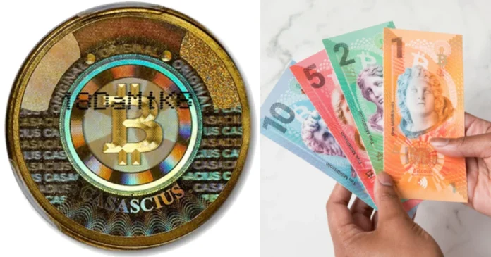
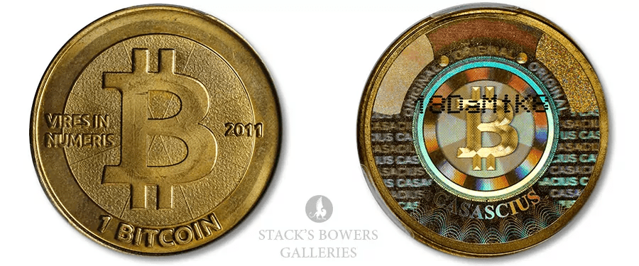
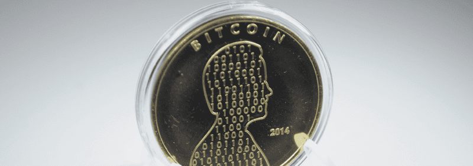
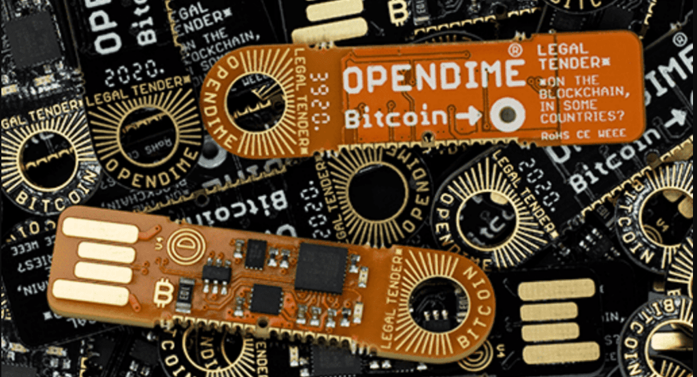
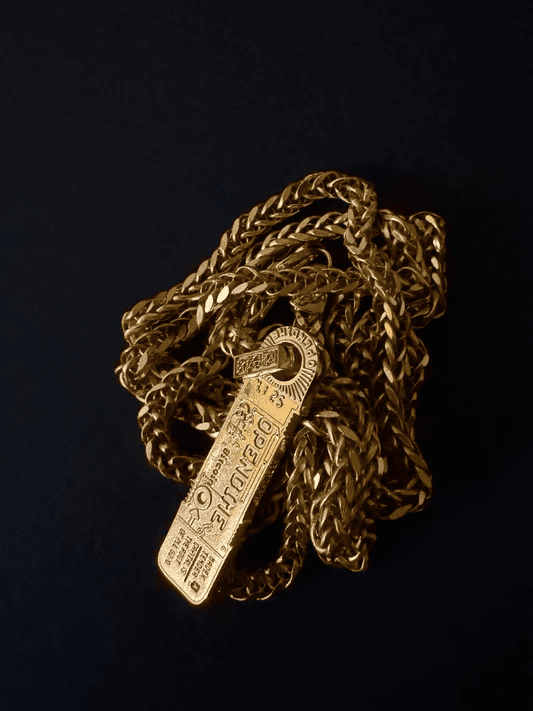
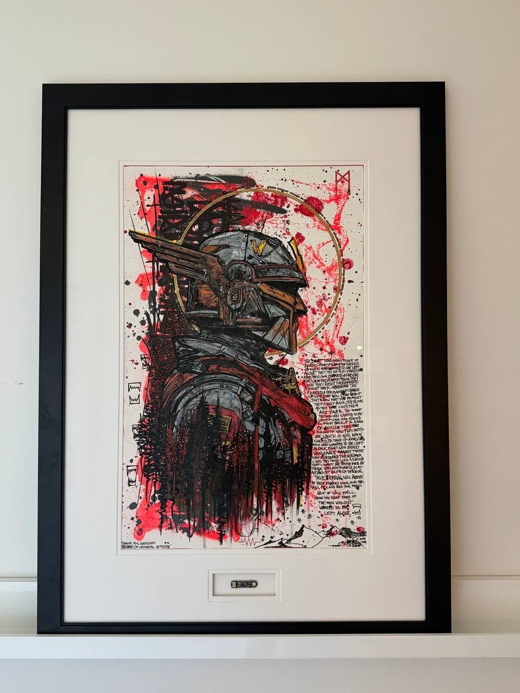
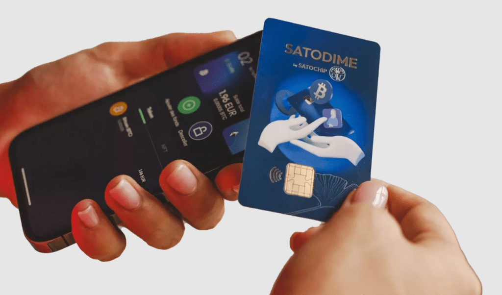
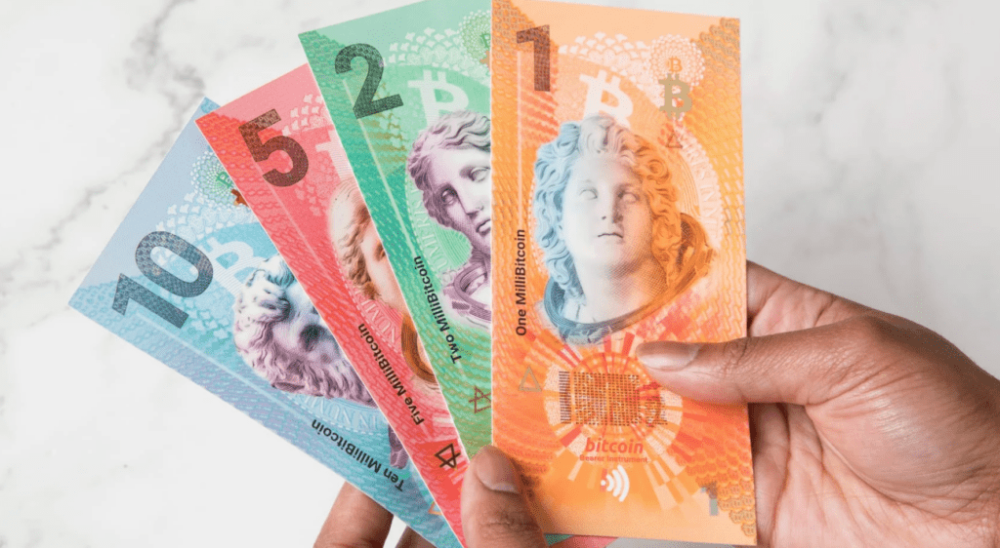
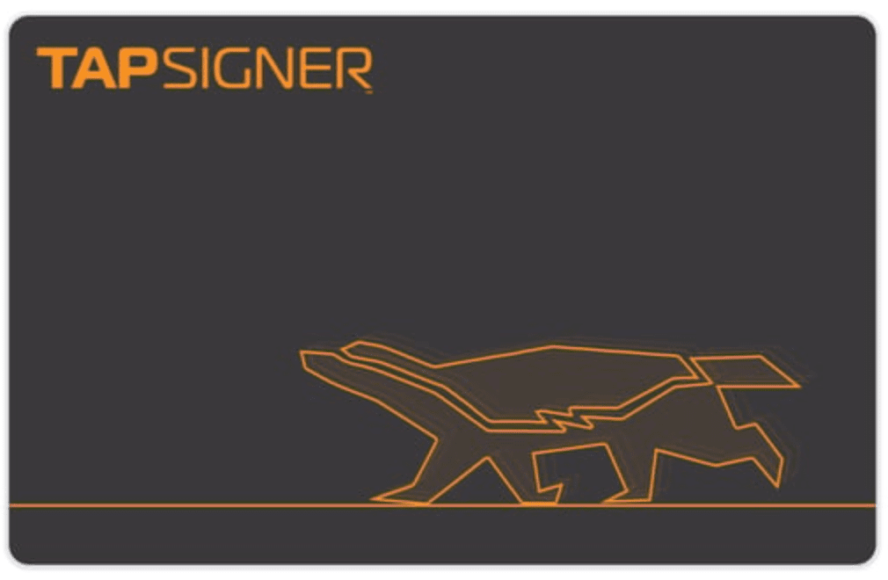

> *作者：Juan Galt*
> 
> *来源：<https://bitcoinmagazine.com/business/the-history-and-future-of-physical-bitcoin>*

比特币的电子性带来了其大部分优势。因为它是可以编程的，所以可以创造一些自主保管装置，让偷盗和没收难以得手。因为它是电子的，它可以按光速移动，所以价值可以在几分钟内跨越地球并结算。

不过，有时候，比特币还是被人批评难以抓住（字面意义）。因为，它在自然状态下，就是无法触摸的，更没有办法拿在手上；它只能被想象和理解。对于许多人来说，这是一个巨大的障碍；并且它也启发了许多让这种货币变得有触感的尝试 —— 只是这并不简单。

企业家和艺术家们，在超过十年时间里，一直想要让比特币变成实物，并且还要保持它最有价值的类似现金的属性。虽然没有人完全解决了这个问题，还是有重大进步，而且留下了许多精美的工艺品。

## Casascius 硬币

- <a href="https://stacksbowers.com/landmark-casascius-double-error-1-bitcoin-featured-in-our-summer-2022-auction/">图片来自 Stacks Bowers Galleries</a> -

早在 2011 年 9 月 6 日就问世了，那时候比特币的价格只有 8 美元，Casascius 硬币毫无疑问就是比特币历史上最具代表性的实物比特币工艺品，还有许多模仿者。它的名字来自 Mike Caldwell 在 Bitcointalk 论坛中的昵称，似乎是 “直言不讳” 的意思。Casascius 硬币发展出了许多用法，被后来的实物比特币沿袭和创新。

将比特币制成实物，要面对的一个问题是私钥的处理。因为比特币本身是电子化的，它只能生活在一对密码学公私钥中 —— 一个秘密值用来生成一个公钥，然后使用比特币兼容的密码学。在 Casascius 硬币上，Caldwell 在一台无线缆连接（airgapped）的设备上生成私钥，然后打印出它们、将它们粘到这些有标志的贵金属硬币上；然后，据说会摧毁留在他的电脑上的所有备份。他还在自己的网站上向潜在买家介绍自己所采取的安全措施。

这些大约出来的私钥会用专门的防篡改贴纸覆盖；一旦揭开这层贴纸，就会留下 “蜂窝状” 的明显印迹。因此，硬币的买家可以知道一个 Casascius 硬币上的私钥是否在到手之前已经暴露。

密钥管理问题是实体比特币创造过程中的最大风险 —— 而在 Casascius 硬币这个例子中，解决办法就是信任他不会骗我们。以当时的眼光看，他一向都非常真诚而且谨慎。直到今天，他的名声都很好（即时算不上传奇），所以，这些买家算是信对了人，他们从这些收藏品获益颇丰 —— 它们在今天的价格远远高过它们所代表的比特币加上制造它们的贵金属。

Casascius 硬币在 2013 年 11 月[停止发行](https://bitcoinmagazine.com/culture/promise-and-regulatory-challenge-physical-bitcoins)，因为美国 “金融犯罪执法网络（FinCEN）”（财政部的一个部分）通知开发者  Mike Caldwell，铸造实物比特币会让他被界定为一家货币服务企业，受到严厉的监管。生成私钥的过程所涉及的信任因素，可以说是一种中心化因素，一直让他饱受批评。

## RavenBit 硬币

Casascius 硬币停止发行的一年之后，[RavenBit 出现了](https://bitcoinmagazine.com/technical/a-review-of-ravenbit-the-diy-physical-bitcoin-1408521825)，它尝试将实物比特币铸造过程中的信任因素去中心化。RavenBit 硬币的外形与 Casascius 硬币非常相似，只是它没有预先生成的私钥；相反，这些硬币出厂时，防篡改贴纸都是没有开封的，所以用户可以自己生成密钥对，贴到空白的硬币上之后，再贴上防篡改贴纸。

在一定程度上，这就去中心化了铸币厂，从理论上来说是个突破，但在实践中，它只是带来了不计其数的受信任的铸币厂，没有品牌也没有声誉，可能就使用办公室里感染过恶意软件的打印机。如果你从某人那里得到了一个 RavenBit 硬币，你怎么知道这个人没有保留私钥的备份、并且采取了合理的防范措施呢？

到今天，RavenBit 项目已经被抛弃了，但它也许给这个行业带来了一个有趣的教训。为了让比特币变成实物，我们需要更高的科技。

## Opendimes

为了绕过前面说的信任铸币厂问题 —— 不管是大牌铸币厂还是小作坊，硬件签名器厂商 CoinKite 设计出了 Opendime ，一种专门为成为不记名的比特币资产而设计的微型计算机。CoinKite 的联合创始人 NVK 在回顾自己的创业动机时，告诉 Bitcoin Magazine 说：“比特币是一种电子货币。我们只能做出拟物的备份。也许未来有一天，有人能发现手算 secp256k1 的办法”。意思是，至少在目前，你总是需要某种计算机来生成有效的比特币密钥；（你用来生成密钥的）这台计算机就是铸币厂。

Opendime 是围绕这个根本性的事实来设计的。它有一个计算机芯片，可以生成一对公私钥，并且可以安全地存储私钥，放置基于硅的防篡改机制后面。

在启动时候，用户必须喂入一个文件，或者某种输入，以提供熵；芯片会部分使用它来生成比特币钱包；这进一步保证了随机数生成逻辑（本身是开源的）在生成这些比特币密钥时拥有更好的熵输入。

完成初始设置之后，只要连接它到一台电脑（就像连接一个 U 盘），你就能看见其中的钱包的公钥；钱包的余额可以在区块浏览器网站查看。

然后，用户可以发送比特币到这个 Opendime 钱包。那他们想取出比特币的时候怎么办呢？必须刺穿这块电路板，才能解锁一条电路、读取其中的私钥，但也会留下明显的使用痕迹。

Opendime 代表了比特币不记名资产技术上的重大突破。今天，一个 Opendime 要卖 20 美元，略微高于 2016 年时候的 13 美元。因此，它也成了一种标志，艺术家们将它们嵌入[奢华的比特币艺术作品](https://madex.art/products/warfawkes-05-original)中，让它也成了比特币模因文化的一部分。

虽然 13 美元也好，20 美元也好，对一款硬件签名器来说都是非常便宜的，而且信任铸币厂的问题也因为由用户自己向设备存入资金的做法得到了解决，但这个价格和外形都与现金相去甚远。单说价格，20 美元的价格就很成问题。如果说 Casascius 为自己铸造的硬币收了 20% 的溢价，那么至少要保存价值 100 美元的比特币，才值得专门购买 Opendime 这么一个硬件；在用作一种通货时，它已经超出了绝大部分日常消费的价格。

最后，这个硬核的密码朋克 U 盘的外形虽然很酷，却无法告诉用户里面是什么东西，所以，各个 Opendime 是无法互换的（不是同质的），这就不像现金。我们需要一种更便宜、应该更容易互换的方案。

## Satodime

比利时的硬件签名器制造商 Satochip 沿用了 Opendime 的概念，转化成了一种更加温和的外形，创造了一款开源的、看起来像银行卡的比特币钱包，并且其特性与 Opendime 非常相似。它可以生成比特币公私钥对，并且甚至可以签名交易（这要看版本）。用户可以使用手机 app，通过 NFC 与它交互。还有其它形式的外形，比如戒指、硬币，里面的芯片是一样的，功能也是一样的。

这款 Satochip 硬件的价格最低可以做到 13 欧元（取决于你的捆绑购买），这比 Opendime 要更便宜，所以离日常的现金用途更近了一步，但也不多。Stochip 卡片还是希望成为一个非常安全的硬件签名器，而不是日常使用的现金皮夹子。这些强大且迷你的计算机芯片并不便宜，所以从目前来看，价格想要做到 10 美元以下是很困难的。

## 太贵了？基本的限制

所以，实物比特币硬件到底要做到多便宜，才有商业上的意义呢？还是完全没意义？

[根据美联储的报告](https://www.federalreserve.gov/faqs/currency_12771.htm)，制造 1 张美元纸钞的成本在 4.1 美分到 11.3 美分之间。纸币的面额越小，成本占比就越高，比如 1 美元纸币，要花费 4.1% 在制造成本上。

|    面额    | 可变的印刷成本 |
| :--------: | :------------: |
| \$1 和 \$2 | 每张 4.1 美分  |
|     $5     | 每张 7.1 美分  |
|    $10     | 每张 6.8 美分  |
|    $20     | 每张 7.3 美分  |
|    $50     |      N/A       |
|    $100    | 每张 11.3 美分 |

- 上表为译者所加，采集自原文所链接的美联储网站 -

这意味着，如果把它当成一个价值 20,000 聪的支票 —— 按今天的价格，大概是 16 美元 —— 硬件成本要低于 1 美元 才行。绝大部分能够运行比特币密码学的芯片都美元这么便宜，但有一款芯片演示了可以做到什么程度： [NXP NTAG X DNA](https://www.nxp.com/products/NTAG-X-DNA) 芯片。

这款 NXP 芯片采用贴纸天线的外形，只有几毫米厚，可以运行多种密码学原语，比如 ECDSA 和椭圆曲线运算。它可以创建私钥、签名甚至加密消息。不过，虽然很强大，它没有包含比特币所用的密码学曲线（secp256k1），所以它天生是没办法操作比特币的。

不过，这个 2025 年款的 NTAG 可以用 3 美元买到，只要你能找到卖家。这表明了一款能够执行密码学运算的芯片可以便宜到什么程度。

令人丧气的是，全世界最广泛使用的现金外形 —— 可以弯折的纸币，可以放在皮夹子里的那种 —— 对于计算机芯片来说可能非常危险， 这是 NVK 自述从经验中学到的教训，他们试验过比特币不记名资产硬件的各种外形。

我们能找到最接近现金外形的东西是 [OfflineCash](https://x.com/offlinecashco) 公司的产品，是一套漂亮的、值得收藏的比特币计价的纸币，带有一个 NTAG 那样的 NFC 芯片，可以存储一个用户生成的密钥，然后这家公司会在自己的服务器中生成第二个密钥，从而创建出一个 2-2 的[多签名](https://bitcoinmagazine.com/tags/multisig)钱包。这个服务器密钥有一个时间锁，最后会将这个多签名地址降级为单签名钱包，那时候把用户就能取出其中的比特币了。他们尝试接近受信任铸币厂问题，最终还是重蹈多铸币厂问题的覆辙。虽然它们的现金外形确实非常漂亮。

研发一款比特币原生的 NTAG 芯片的成本轻松超过几百万美元，并且这样实现比特币密码学可能会有很多故障，如果制造商并非这个领域的专家的话。而且，它也必须是开源的，以保证其中没有后门。

实体的比特币不记名资产还有一个更加根本的问题。即使你可以找出一款足够便宜的芯片、还能做到纸币一样的外形，你还是需要联网来验证它的真实性 —— 里面真的有比特币 —— 因为这种资产，无可逃避，就是电子的。这个问题可以通过直接信任一家发行这种比特币计价的现金工具的铸币厂、相信他们会承兑纸币的面值来解决，但这也就丢失了可以自主保管、可以信任的现金的理想。虽然这在欢迎比特币的司法辖区也许行得通。

所以，虽然 OfflineCash 公司创造的这种比特币纸钞（带有不记名资产安全芯片，没有信任铸币厂的风险）很酷，我们还没走到重点。而且，这可能是过度设计了，因为现在没有人会需要比特币计价的零钱，最终大家都会用法币纸钞，也许有一天，在[超级比特币化](https://bitcoinmagazine.com/hyperbitcoinization)之后，这种情况会改变。NVK 就相信会有一种解决方案比纸币外形更好，至少在可以预见的未来，这就是 Coinkite 创造 Tapsigner 的原因。

## Tapsigner

[Tapsigner](https://tapsigner.com/faq) 建立在  Coinkite 比特币 NFC 芯片之上 —— 这种技术类似于 NXP 公司的 X DNA NTAG 芯片，只是可能更强大，因此也更贵 —— 采用了类似于银行卡的形式，带有安全芯片，只需接近 NFC 设备就能支付，还可以选择酷炫的外形设计。不过，在芯片内，是一个功能完整的比特币钱包，能够运行 scep256k1 密码学操作，所以它可以创建比特币密钥、足够安全地存储私钥，还能在内部签名交易、再通过配套的手机广播交易；这个配套的手机也为用户验证交易提供了极为重要的视觉辅助。

Tapsigner 可以作为一种不记名资产，但也许还是更适合作为一个可以重复充值的硬件签名器，可以花费一定数量的比特币（就像信用卡一样） ，从而解决找零问题，并且还可以向支持这种已经非常流行的特性（NFC）的钱包一触支付。

有了 Tapsigner 这样的卡片（大概 20 美元一张），比特币计价的支付问题回到了老派的小商户普及模式，并且要集成主流的商业会计和支付软件，Cashapp 和 Square 就走在这条路上。

（完）