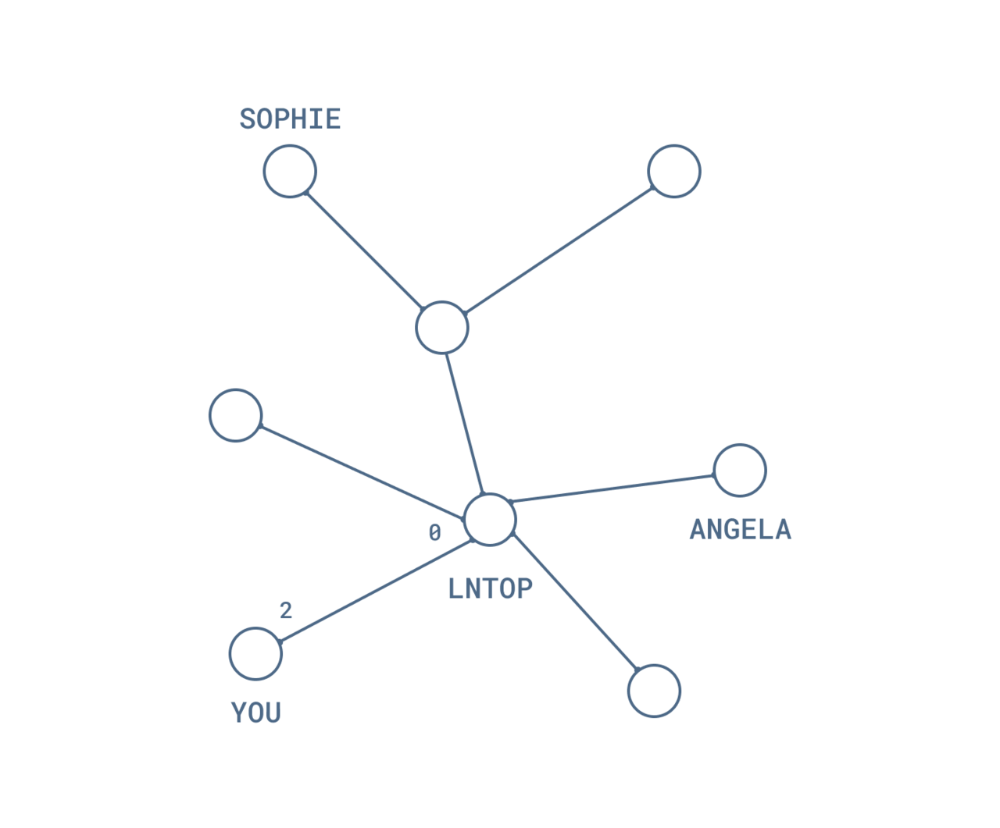
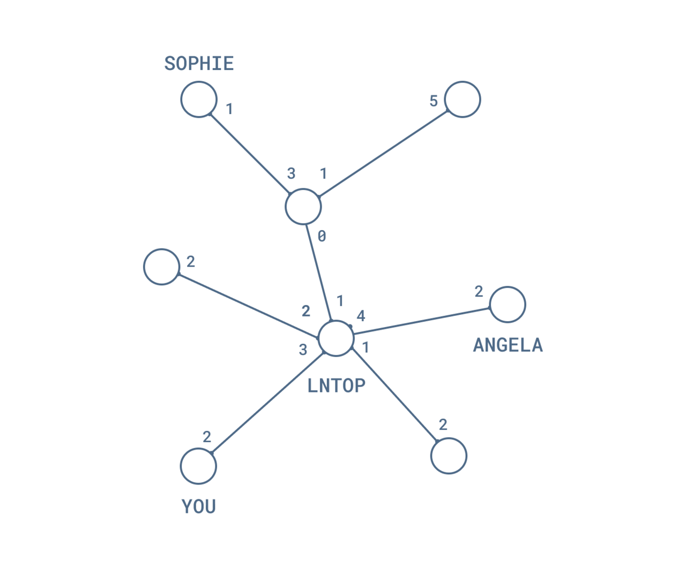
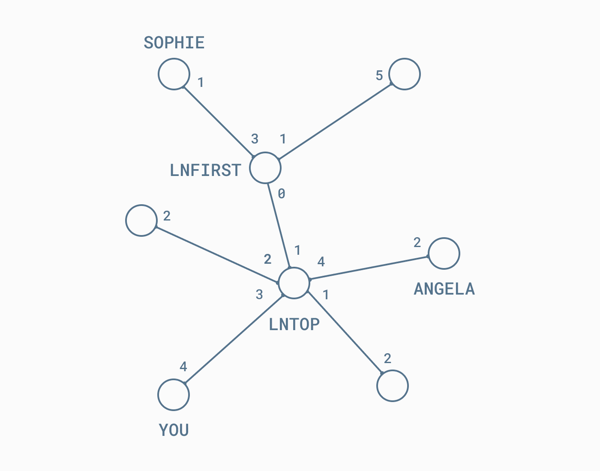

> *作者：Florencia Ravenna*
> 
> *来源：<https://blog.muun.com/the-inbound-capacity-problem-in-the-lightning-network/>*

几个星期以来，比特币社区的很多人一直在讨论闪电网络（Lightning Network）的 inbound capacity 问题。[越来越难以收到闪电火炬](https://www.coindesk.com/its-getting-harder-to-send-bitcoins-lightning-torch-heres-why)，加上 [Bitrefill 启动了 Thor](https://www.bitrefill.com/thor-lightning-network-channels)，还有 [LND 放出了 Lightning Loop](https://blog.lightning.engineering/posts/2019/03/20/loop.html)，都让人们更加关注这个问题。在本文中，我会解释这个问题的形式及其根源。我们也会分享一些很容易被忽略的洞见。

## 本地和远端的余额

要理解入账容量，我们得先深入了解闪电网络的第一个基本模块：支付通道。这个概念可能你在之前也听过了，所以我们直接跳到跟入账容量有关的部分。

我们先考虑一个单独的通道，然后慢慢提高思考的复杂度。

一个支付通道开通后，它就锁住了恒定数量的一些 btc，这个数量叫做 “ *通道容量* ”。参与支付通道的双方各自拥有这个容量的一部分。在你自己这边的余额，我们叫 “ *本地余额* ”，而在你的交易对手那边的余额，叫 “*远端余额* ”。你的本地余额和远端余额在关闭通道之前可以更新任意次，但通道容量，如果你不关闭通道或者拼接通道，是无法改变的。

- 支付通道就像沙漏：虽然沙子的总量是恒定的，你可以任意把沙子移动到其中一端。但如果你想改变里面沙子的数量，那就非打破这个沙漏不可 -

- 你跟 Robert 的通道里面有 8 btc，你的本地余额是 5 btc，你的远端余额是 3 btc -

每次支付，都是把你的本地余额转一些给你的交易对手，也就是减少本地余额，增加远端余额。类似地，当你收到一笔支付时，你的本地余额增加，数额恰好等于你的远端余额减少的数额。

- 当你给 Robert 支付 1 btc 之后，你的远端余额增加了 1 btc -

## 入账和出账的容量

现在，我们更清楚地理解了什么决定了通道的容量，以及本地和远端余额是怎么更新的，现在来想想，如果你是一个闪电网络的节点，是网络的一部分，将有何区别。

两个交易方并没有直接相连的支付通道。但是，他们可以通过 *路由节点* 来支付。在整个支付路径上，每一次中转都要用到一个双向的支付通道。因此，我们刚刚讲到的支付通道特性适用于每一次中转。

假设你想通过闪电网络来卖贴纸。那么，你需要与至少一个闪电网络节点建立连接。你仔细挑选了一个节点，保证这个节点可能跟你的潜在客户 Sophie 和 Angela 相连。我们把这个节点叫做 “lnTop”。

- 你跟 InTop 开启了一个通道，锁入了 2 btc。你的本地余额是 2 btc，远端余额是 0 btc -

现在，Angela 想要买一些你的贴纸，并通过 lnTop 来支付。但是，你跟 lnTop 的通道中，你的远端余额是 0 呀，lnTop 并不能给你支付。因此，lnTop 无法路由这笔交易。

在一个时间点上，**你可以收到的 btc 数量**（也就是 “入账容量”），是由你的远端余额决定的。很简单嘛，如果你相连的节点只能发送 1 btc 给你，你是没法收到比 1 btc 更大的数额的。类似地，**你可以发送的 btc 数量**（“出账容量”）是由你的本地余额决定的。

在你决定跟 lnTop 开启一个通道时，你需要确定自己想锁定多少 btc 进去，也即你初始的本地余额是多少。lnTop 也一样，他们的选择决定了你初始的远端余额。这就有了一个重要影响。虽然你能够决定自己的初始本地余额（自己的初始出账容量），**但你没法控制自己的初始远端余额（和入账容量）**。

如果你今天要启动一个自己的闪电网络节点，并且只是随随便便地选了一个节点来开启通道，你可能会发现，你根本没有入账容量可用，即，你压根没法通过闪电网络来收到支付。听起来对商人很不友好，对不对？

好消息是，你有很多办法来提高自己的入账容量，比如自己先发起支付，或请求其他节点提供容量（并付钱给他们）。[这篇文章](https://medium.com/lightningto-me/practical-solutions-to-inbound-capacity-problem-in-lightning-network-60224aa13393)讲解了入账容量问题的不同解决方案。

## 就这么简单？

嗯 …… 也不是。即使你知道了自己如何能提高远端余额，可能也没法解决入账容量问题。关键在于：**并非所有通道的入账容量都相同**。要理解这一点，你要先理解，在支付路由的过程中，闪电网络的其它部分，发生了什么事情。我们把上图所示网络的通道容量都划出来，这样更好理解了。

- 这是 lnTop 往通道里充值了 3 btc 之后的情形。在网络中，所有节点都跟自己相连的节点有专门的本地和远端余额 -

你从 lnTop 那里获得一些入账容量之后，Angela 最多也只能给你发 2 btc，因为你在 lnTop 那里的入账容量超过了 2 btc，但 lnTop 在 Angela 处的入账容量只有 2 btc。

- Angela 给你发送了 1 btc，路径上所有节点的余额更新。她还能再给你发 1 btc -

但是，在这个网络里，Sophie 就没法给你发送 1 btc。你可以看看 Sophie 给你支付的路径上的通道容量状态，你的确有 3 btc 的入账容量，但 lnTop 没有 lnFirst 的入账容量。

- lnFirst 没法路由 1 btc 的支付给你。所以 Sophie 没法给你支付 -

对于支付，每个参与路由的节点和你（接收方）都必须跟上一个节点有足够的入账容量。所以，虽然你能解决跟相邻节点 lnTop 的入账容量问题，但 lnTop 可能跟相邻的节点没有足够的入账容量。Lightning Labs 的闪电网络基础设施总监 Alex Bosworth 几周以前指出了这个问题。

还有一个事实，让这个问题很难解决。那就是，“揭示所有节点的本地和远端余额” 这件事，在闪电网络上是做不到的。作为网络中的一个节点，你只知道通道容量，并不知道这部分容量在两个参与者之间是如何分布的。

## 谁会受这个问题影响？

闪电网络中，并非所有的节点都有相同的需要。从上面的例子中，我们可以辨认出至少 3 类节点。

### **商家节点**

我们用 “商家节点” 来称呼那些主要是收账的节点。在上面的例子中，“你” 就是一个收账节点，因为你最关心的就是收到贴纸买家的支付。因此你需要入账容量。记住：不仅你要有足够的入账容量，买家到你的整个支付路径上的节点都必须有足够的入账容量才行。

### **终端用户节点**

这些节点主要使用闪电网络来发账。偶尔他们会从朋友或者闪电应用处收到钱。Sophie 和 Angela 都是终端用户。对于这个群体，关键是要连上资金充足而又与商家相连的节点。他们既需要入账容量，也需要出账容量，全看他们在特定时间的需要。

### **路由节点**

这些节点是路由支付并从中赚取手续费的节点。LnTop 和 lnFirst 都是这样的节点。他们的工作是发现有需要的收款方，比如你，小镇上最大的贴纸商家。对终端用户，他们需要足够的入账流量；对商家，他们需要出账容量。此外他们还得跟市场上的其他服务商竞争，要确保自己总是在线。赚点钱不容易，对吧？

## 结论

我们从单一通道开始讨论，讲解了网络内通道的特点，最终使用 “节点信息全公开” 的假设讨论了入账容量问题。

**我们将入账容量定义为给定时间点在闪电网络中你可以收到的 btc 数量**，并推论了它依赖于你的远端余额。

入账容量问题可能是闪电网络在启动阶段会遇到的问题。因此，如果流动性在整个网络中的分布更充分、更好，问题将减轻。我们会继续撰文探讨闪电网络在早期会遇到的问题。

（完）
