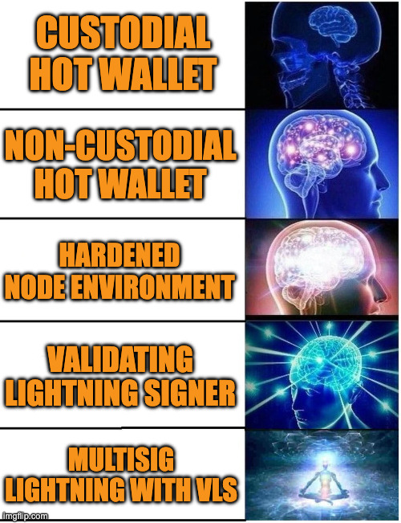

> *作者：Jack Ronaldi*
> 
> *来源：<https://vls.tech/posts/lightning-security-spectrum/>*

## 长话短说

“非托管” 无法作为闪电钱包的安全模式描述。因为签名的时候必须联网，真正的问题是：**如果联网的节点被攻陷，那会发生什么事**？绝大部分闪电钱包都是联网的钱包（热钱包）。如果只是为了花钱消费，那没什么问题，但风险会随着资金体量增加而迅速上升。等级 3（强化的环境）可以降低被攻陷的概率。等级 4（VLS）则通过在节点外部强制执行一些支出条款来限制爆炸范围，所以即使节点被攻陷，也无法盗窃资金。如果你是开发者、节点运营者或是持有大量闪电通道资金的服务端，这其中的区别不可小视。

（译者注：作者的思路是将一个功能完整的闪电节点分成两个模块：一个是负责联网、通信、管理闪电通道的 “节点”，另一个是在通道状态转换（收款或支付）时负责签名的 “签名器”；这两个模块在不同的闪电钱包实现中可能是合并的，也可能是隔离的。）

### 安全光谱一瞥

- **等级 1：无验证签名**。无意义，别开发。 
- **等级 1：完全托管的热钱包**。服务商持有你的密钥。 
- **等级 2：非托管的热钱包**。你自己持有密钥，只是密钥存放在联网设备商。 
- **等级 3：强化的节点**。使用了安全飞地（enclaves）、硬件签名设备（HSM），带有更强的隔离措施。 
- **等级 4：带验证的闪电通道签名器（VLS）**。隔离的签名器，并强制执行支出条款。
- **等级 5：VLS + 门限签名**（未来）

### 一个有用的区分

- **等级 3**：让节点更难被攻破。
- **等级 4**：让节点爆破更不危险（节点无法使用支出条款不允许的行为来盗窃资金）。

### 追问你的钱包的开发者或服务商

- 如果节点被攻陷，它能否获得签名来盗窃资金？
- 签名的支出条款是在节点之外，由一个单独的模块来执行的吗？
- 最糟的情况下，损失有多大？什么东西能够阻止失血？
- [检查你的钱包的现状](#钱包现状)

*如果签名器本身被攻陷，那任何措施都无济于事。所以，我们的目标是让它比节点更加难以攻破。*

## 闪电网络的承诺和问题

你仔细研究，挑选了一款 “非托管的” 闪电钱包，因为你笃信 “无私钥，即无币”。你谨慎低保管你的种子词，你自己持有私钥。

某日清晨，你醒来发现自己的闪电通道已经被关闭了，你的聪被发到了你不认识的地址上。软件的日志显示你的节点允许了所有操作。就这样，你的比特币不翼而飞。你的闪电钱包抽走了你的凳子。

闪电网络承诺要在即时支付上保持比特币的安全性和自主保管原则。可是，似乎哪里出了问题。

## “非托管” 不算一种安全模式

在比特币基础层上，“非托管” 很明显跟安全性是配对的：私钥放在不联网的设备（冷存储）中，只在你选择的时候才签名。闪电钱包改变了这种约束。支付、哈希时间锁合约（HTLC）和通道更新，都是有响应时限的，所以签名密钥必须联网，要么在你的手机上、要么在一个服务商那里，再要么，在两者之间。在闪电钱包里，“我持有私钥” 并不天然意味着 “我的资金是安全的”。

- **“非托管” 当然还是必要的**。它意味服务商不能随意转移你的资金。
- **但单纯 “非托管” 还不够**。因为签名时候是联网的，你需要一种灾备模式。假设一个攻击者控制了你的闪电节点，什么东西能够阻止他们获得你的签名、盗走你的资金？

（译者注：攻击者无需盗窃私钥、控制节点就可能盗窃资金的原理在于，闪电通道的状态变更本身就要求获得签名，也即节点申请、签名器许可；如果签名器不验证申请的内容，那么自然只需控制节点，就可以将受害者在通道中的资金都转走。）

重要的是：

**如果你的闪电节点被劫持了，攻击者接下来能做些什么？**

我们先来看看常见的闪电钱包。

## 闪电钱包安全性光谱

这个光谱是用一个简单的测试排列出来的：**攻击者盗窃受害人的资金有多难**？

我们在光谱上移动的时候，是在牺牲简洁性、换来更小的攻击节点和更强的灾备保障。

### 无验证签名（坏模式）

**它是什么样的**：签名器与节点分离，但它会许可节点发来的任何请求，不会独立地验证请求的安全性。

**节点被劫持会发生什么事**：只要节点（或任何可以影响它的模块）被攻破，它就可以欺骗签名器去授权有害的动作。

**为什么它不好**：它比标准的热钱包更复杂，却更不安全，因为你现在承受了两个攻击界面（节点和签名器），而不是只有一个攻击界面。

**案例**：今天的主流产品中没有这样做的。这里提醒开发者：**不要去开发这样的产品**。

### 托管热钱包

**它是什么样的**：服务供应商控制密钥，并代你运行闪电节点。

**节点被劫持会发生什么事**：供应商的违规行为或内部人可以转移你的资金。

**取舍**：最好的使用体验、用户责任最少、最高的信任和商业责任。

**最适合**：小金额和新手入门。

**案例**：[Cash App](https://cash.app/)、[Strike](https://strike.me/)、[River](https://river.com/)

### 非托管的热钱包

**它是什么样的**：你自己持有密钥，但它存放在运行你的闪电节点（钱包）的联网环境（设备）里

**节点被劫持会发生什么事**：如果节点被劫持，资金可能会被盗走。

**取舍**：自治，但是安全性严重依赖于你的节点运行环境有多安全。

**最适合**：日常消费。

**案例**：[Phoenix (ACINQ)](https://phoenix.acinq.co/)、[ZEUS](https://zeusln.app/)、[Voltage](https://voltage.cloud/)

**本地 vs 云**：非托管的钱包可以运行在用户自己的设备上（本地），也能运行在由某个团队运行的服务器上（云）。云并不必然更安全或更危险。它可以减少用户错误，并且专业团队可以提升操作效率，但通常会增加远程攻击界面，并让风险集中在基础设施访问权上。

### 强化的节点环境（安全飞地/HSM）

**它是什么样的**：标准的闪电节点模式，但运行在一个强化后的环境中（安全飞地、HSM、鉴权驱动（attestation-driven）的秘密分发）。

**它强化了什么**：让 “服务器劫持” 和 “管理员权限” 难以转化成密钥抽取，办法是隔离敏感内存以及加强对密钥的管理。

**节点被劫持会发生什么事**：如果攻击者成功在节点中执行了恶意逻辑（比如说通过软件漏洞或劫持软件更新源），节点将许可盗窃。强化措施可以减少被劫持的可能性，但并不限制爆破范围。

**取舍**：通常来说，强化措施的成本很高，需要专门的基础设施、工具链和运营操作（鉴权、私钥注入、受控的软件部署）。甚至全球顶级的运营者也说花费了许多年才取得一个可以接受的局面。

**最适合**：大体量的运营者，且（a）暂时无法改变基础设施；（b）拥有专门的安全和运营预算。这是普通热钱包的合理 “起点”，但如果你想要很强的保证，这就不是终局。

**案例**：[LEXE (Intel SGX)](https://www.lexe.app/)、[ACINQ: Securing a ~$100M Lightning node (Nitro Enclaves)](https://acinq.co/blog/securing-a-100M-lightning-node)（[中文译本](https://www.btcstudy.org/2023/08/21/securing-a-100M-lightning-node/)）

### VLS（带验证的闪电通道签名器）

**它是什么样的**：一个隔离的签名器，在签名之前会验证请求并强制执行支出条款。

**它强化了什么**：改变了故障模式：节点被劫持也无法通过支出条款不允许的操作来盗窃资金。

**节点被劫持会发生什么事**：节点被劫持也没有什么影响。签名器才是关键的安全边界。

**取舍**：要求软件预先集成，并且需要持续维护，换来更加强大的安全保证。

**最适合**：你会介意的金额，尤其是放在云环境中的钱包。

**案例**：[Blockstream Greenlight](https://blockstream.com/lightning/greenlight/)、[Blockstream App](https://blockstream.com/green)

### VLS + 门限签名（未来）

**它是什么样的**：需要 N 个签名器中任意 M 个来授权签名闪电通道状态变更（比如 3-of-5）。

**现状**：还不是现在的闪电节点的标准模式，但如果有需求，也是一个可行的方向。

**取舍**：最强的安全保证，但也最复杂（可能有更多的运营负担）。

**最适合**：财库式的闪电资金，为实现多方控制，值得克服摩擦。

**案例**：还没有，但[人们的兴趣在增加](https://stephanlivera.com/episode/711/)

**需求信号**：一些闪电节点运营者希望闪电通道的签名流程可以跟企业内部的财务管理（比如多人许可）相匹配。[Flowrate](https://www.flowrate.com/) 最近联系了 VLS 项目，表示对使用门限许可来保管客户资金的兴趣。目前还在探索节点，还没有出现能够进入生产环境的 “闪电通道多签名签名器” 架构。

### 如何选择正确的安全等级

闪电钱包的安全性有两个关键：**被攻破的可能性**（有人能黑进去的概率）和**爆炸范围**（如果真有人黑进去，损失会有多大。

实用的选择办法是：**在它真的出问题的时候，你能接受多少损失**？

用较为简单的模式保管较小的金额。随着金额增加，变得不能忽视了，或者对你的企业举足轻重，那就要选择能够减少最坏情况下损失的设计，而不仅仅是降低灾难概率的设计。

**安全性是一个产品抉择。正确的等级取决于你要保护多少东西、你能忍受多大风险，以及你能应对的故障模式。**

## 强化的节点环境（安全飞地/HSM）

等级 3 是一种常见的思路：如果节点运行环境有风险，那就强化它。更强的隔离、收紧访问权限，还有依靠硬件的保护措施，可以降低 “服务器被攻破” 演变成 “密钥被盗” 的概率。

这样做可以大幅提高阈值，尤其适合具备成熟的安全和部署经验的运营者。但它依然是一个联网的系统，所以最坏情况没有改变：被攻破的节点会签名什么东西？

以下是等级 3 在现实中的样子：

> **真实世界案例**：ACINQ 团队的博客文章《[保护一个价值 1 亿美元的闪电节点](https://acinq.co/blog/securing-a-100M-lightning-node)》](https://acinq.co/blog/securing-a-100M-lightning-node)（[中文译本](https://www.btcstudy.org/2023/08/21/securing-a-100M-lightning-node/)）介绍了他们的经验。他们在 **AWS Nitro 安全飞地**里面运行自己的节点（隔离 + 鉴权），并使用 **Ledger 硬件签名器**来手动确认敏感操作（比如软件部署）。这大大减少了运营者风险和服务器权限风险。
>
> ACINQ 也强调，这并非 “终极” 安全性：
>
> - **安全飞地并不让倚赖项变得可以信任**。应用依然要验证自己在跟正确的服务端通信。
> - **你依然有一个在线的节点**。严重的节点软件漏洞依然可能滥用签名授权。
> - **重度依赖于运营**。非常复杂的安全工程，带来了真实的运营负担。

## 真实事故和已经披露的漏洞

有一些跟闪电网络相关的真实事故（其中一个还揭晓了允许盗窃的漏洞），表明资金损失可以在没有 “打破闪电网络密码学” 的条件下发生。它们的共性是一样的：如果攻击者可以影响得到签名的东西，他们就能偷盗资金。

### LNBank（BTCPay Server 插件）：并发取款的赛跑吸干了大约 4.07 BTC

LNBank 的余额处理中的一个竞争条件（race condition）允许一个攻击者在数据库反映真实的减计之前，触发许多并发的取款，通过向外支付吸干一个闪电钱包。

- **光谱位置**：对运营者来说是等级 2 。注意：LNBank 自身对用户来说是一个托管层（等级 1）。
- **影响**：据称转移了 407,361,805 聪（大约 4.07 BTC）。
- **问题根源**：在并发条件下，余额检查可能使用已经过时的状态。
- **问题的重要性**：“节点需要任何事情” 可以是危险的，即使没有抽取私钥。

**资料来源**：[受害者报告](https://stacker.news/items/347361) 、[维护者回顾](https://d11n.net/lnbank-vulnerability-recap)

**更多细节**：

- **机制**：攻击者提交了许多并行的 取款/支付 请求，让软件的状态在 “接受请求” 和 “数据库更新” 之间来回跳跃。
- **观察到的动作**：迅速发生一连串的闪电网络出账支付，导致余额用尽。
- **响应**：曝出问题之后，修复版本迅速发布；也发布了公开报告。

### LNbits：恶意路由费吸走 >0.1 BTC

一份公开的报告（以 LNbits 代码库的一个 Issue 形式发布）声称，攻击者通过迫使取款经过一个收取高昂手续费的节点，吸干了一个以 LNbits 为后端的钱包。如果没有严格的单笔支付手续费限额，这个钱包会因为路由费而完全清空。

- **光谱位置**：等级 1 和等级 2 之间（热钱包逻辑，加上手续费支出条款限制，取决于 LNbits 是如何部署的）。
- **影响**：报告声称损失 “总共超过 0.1 BTC”。
- **问题根源**：缺少单笔支付手续费限额和 “支付数额 + 手续费” 把关（或有漏洞）。
- **问题的重要性**：在闪电网络上，手续费就是价值。手续费限额也是安全边界的一部分。

**资料来源**：[LNbits Issue](https://github.com/lnbits/lnbits/issues/440)

**更多细节**：

- **机制**：攻击者影响了支付路径选择，所以唯一可行的路径包含了一个由攻击者控制的、收取昂贵路由费的节点。
- **观察到的动作**：支付会成功，但钱包的余额中有一大部分都变成路由手续费付了出去。
- **响应**：报告是公开的；该 Issue 随后被关闭了（修复措施和部署手段各不相同）。

### LND “替换交易停滞”（已经披露的允许盗窃的漏洞）

一份 LND 漏洞的披露（“替换交易停滞”）介绍了一种允许盗窃的情形：强制关闭通道，触发受害者节点清扫未结的 HTLC 并在此过程中发送替换交易；报告还建议了升级办法。

- **光谱位置**：等级 2 和等级 3 之间（热节点；基础设施强化无法消除这种风险）。
- **影响**：允许盗窃的漏洞（公开披露并不总是包含已确认的损失）。
- **问题根源**：实现层面的故障，出现在清扫资金的罕见情形中。
- **问题的重要性**：即使有更强的基础设施控制，软件的 bug 依然可能带来损失。

**资料来源**：[披露报告](https://morehouse.github.io/lightning/lnd-replacement-stalling-attack/)

**更多细节**：

- **谁会受到影响**：使用受影响的 LND 版本运行节点的人。
- **重要性**：围绕强制关闭和链上清扫的敌意条件。
- **缓解措施**：升级到修复后的版本。

**这些都不是罕见的攻击。它们是常见的软件和操作故障，会变成事故，是因为被攻破的节点是一个热钱包，拥有批准所有操作的权限。**

## VLS：攻击界面更小的单独签名器

VLS 希望通过改变架构（而不仅仅是强化原有的架构）来应对劫持。

它同时做了三件事：

1. **隔离**：私钥和签名决策从节点中移出，放到一个专门的签名器中。
2. **缩减**：签名器要做的事比节点少得多；更少依赖项，攻击界面也就更少。
3. **强制**：在签名之前，签名器会根据一套支出条款来验证请求，所以被劫持的节点也无法执行有害的动作。

它的承诺是：

**即使节点被攻破，攻击者也无法让违反支出条款的动作获得签名。**

支出条款例子：

- 关闭通道时，资金只能发送到白名单地址
- 手续费总量以及费率限制
- 支付数额限制以及频率限制
- “紧急按钮”（如果有些东西看起来不对劲，就停止签名功能）
- [还有更多](https://vls.tech/docs/latest/security/policy-controls/)

### VLS 在行动

|                  | 标准热钱包                       | VLS                                                          |
| ---------------- | -------------------------------- | ------------------------------------------------------------ |
| **攻破节点环境** | “关闭通道，把资金发到攻击者地址” | “关闭通道，把资金发到攻击者地址”                             |
| **签名器**       | “允许”                           | “支出条款允许这个动作吗？状态有效吗？手续费在限额内吗？如果不是，就拒绝” |
| **结果**         | 劫持可能导致盗窃                 | 劫持被签名器化解了                                           |

### 实战证据：Greenlight

[Greenlight](https://blockstream.com/lightning/greenlight/) 是等级 4 模式的一个真实案例：云节点便利性，搭配一个基于 VLS 的带验证签名器。

这回答了一个常见的质疑：

“隔离和验证当然是好事，但你怎么证明它不会破坏使用体验？”

Greenlight 证明了，你可以拥有云节点的便利性，而无需让 “服务器热私钥” 变成更大的生存风险。

## 如何检查你正在使用的装置

绝大部分闪电钱包产品都可以告诉你它是托管的或非托管的。但几乎没有一款会清楚地告诉你，*如果某个模块被攻破会发生什么事*。以下是一个检查清单，可以质询出真实回答。

> **问题 1：”如果节点环境被攻破了，攻击者能够偷走我的钱吗？“**
>
> **有力回答**：“节点劫持也是可以应对的。因为签名器会在节点之外强制执行花费条件。”
>
> **无力回答**：“用户自己持有私有，这是一个非托管的钱包。”
>
> **诚实回答**：“是的。如果节点被攻破，资金可能会被转走。”（把它当成等级 2 或等级 3。）

> **问题 2：“签名权限放在哪里？”**
>
> “在 app/节点 进程中 ”，意味着你需要信任整个运行环境。
> “在一个单独的签名器中，它会强制执行花费支出条款”，表明了不同的安全性边界。

> **问题 3：“在节点 *之外* 强制执行了具体哪些支出条款？”**
>
> - 通道关闭时，只能取款到白名单地址
> - 支付数额限制和频率限制
> - 手续费限额和安全默认设置
> - 紧急锁定，或者说停止签名的 “紧急模式”
>
> “我们有安全设置的”，但无法举出细节，通常等于 “你就信我吧，兄弟”。

### 深入探究：更多问题

最坏情况的分析、可观察性、内部人风险，还有复原计划。

> **问题 4：”如果出现问题，最坏情况下，我的损失有多大？“**
>
> 好的团队会用一个长段落来回答你，介绍能够止血的措施。
>
> 如果他们无法描述最坏情形，你就当成回答是：“钱全部丢失”。

>  **问题 5：“如果有个攻击者尝试偷我的钱，我在日志里能看到什么？”**
>
> 清晰的审计线索，记录下被拒绝的尝试，警告违反了支出条款。
>
> “我们不知道”，或者 “这要分情况”，意味着可观察性较差。

> **问题 6：“如何防止监守自盗？”**
>
> 责任分割、受控制的部署流程、管理员动作受限、危险操作需要人工确认。
>
> 如果一个管理员密钥就能做任何事情，那算不上一种安全模式！

> **问题 7：“如果出现劫持，要如何复原？”**
>
> 有详细说明的事故响应计划、紧急锁定步骤、通道关闭策略，以及密钥轮换或重置计划。
>
> 没有明文计划，意味着你是小白鼠。

**如果你得到的保障仅仅是 “这是非托管的钱包”，其实你没有得到答案。**

## 开发者们行动起来

在回答这个艰难的问题时，别再用 “非托管” 来搪塞。请推出明确的保障措施。

1. 定义最坏情况下的劫持模式（要写下来）。
2. 说明什么措施能够防止未经授权的通道关闭和违反支出条款的动作。
3. 撰写复原、可审计性和操作性安全措施的文档。
4. 如果你希望获得云服务体验，请瞄准带验证签名器模式，这样节点被劫持不会导致资金越过支出条款被转走。

安全性是一种架构选择，不是一个待办事项。

## 现状：你的钱包有多安全？

以下是主要的闪电钱包和闪电网络服务商在安全性光谱上的实际位置。

**注**：分类基于在 2026 年 2 月 11 日可得的公开信息。欢迎供应商们验证和更新自己的状态。

| 产品                   | 类型   | 安全等级                    | 保管模式 | 密钥/节点位置                     |
| :--------------------- | :----- | :-------------------------- | :------- | :-------------------------------- |
| Alby                   | 钱包   | 等级 2：非托管热钱包        | 非托管   | 用户设备                          |
| Bitkit (Synonym)       | 钱包   | 等级 2：非托管热钱包        | 非托管   | 用户设备                          |
| Blockstream App        | 钱包   | 等级 4：带验证签名器（VLS） | 非托管   | 密钥：用户设备（VLS）节点：供应商 |
| Blockstream Greenlight | LSP    | 等级 4：带验证签名器（VLS） | 非托管   | 密钥：用户设备（VLS）节点：供应商 |
| Blocktank (Synonym)    | LSP    | 等级 2：非托管热钱包        | 非托管   | 用户设备                          |
| BlueWallet             | 钱包   | 等级 2：非托管热钱包        | 非托管   | 用户设备                          |
| Cash App               | 钱包   | 等级 1：托管热钱包          | 托管     | 托管商                            |
| Electrum               | 钱包   | 等级 2：非托管热钱包        | 非托管   | 用户设备                          |
| IBEX Mercado           | LSP    | 等级 1：托管热钱包          | 托管     | 托管商                            |
| Phoenix (ACINQ)        | 钱包   | 等级 2：非托管热钱包        | 非托管   | 用户设备                          |
| River                  | LSP    | 等级 1：托管热钱包          | 托管     | 托管商                            |
| Strike                 | 钱包   | 等级 1：托管热钱包          | 托管     | 托管商                            |
| Voltage                | LSP    | 等级 2：非托管热钱包        | 非托管   | Provider Cloud                    |
| ZEUS                   | 钱包   | 等级 2：非托管热钱包        | 非托管   | 用户设备                          |
| Blink (Galoy)          | 钱包   | 等级 1：托管热钱包          | 托管     | 托管商                            |
| Blixt Wallet           | 钱包   | 等级 2：非托管热钱包        | 非托管   | 用户设备                          |
| Coinos                 | 钱包   | 等级 1：托管热钱包          | 托管     | 托管商                            |
| Flash                  | 钱包   | 等级 1：托管热钱包          | 托管     | 托管商                            |
| LEXE                   | LSP    | 等级 3：强化运行环境        | 非托管   | Intel SGX                         |
| Machankura (8333.mobi) | 钱包   | 等级 1：托管热钱包          | 托管     | 托管商                            |
| Pouch.ph               | 钱包   | 等级 1：托管热钱包          | 托管     | 托管商                            |
| Speed Wallet           | 钱包   | 等级 1：托管热钱包          | 托管     | 托管商                            |
| ZEBEDEE                | LN App | 等级 1：托管热钱包          | 托管     | 托管商                            |
| Zero Hash              | LSP    | 等级 1：托管热钱包          | 托管     | 托管商                            |

（完）