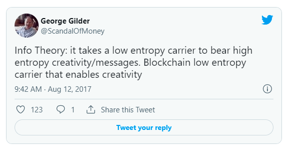
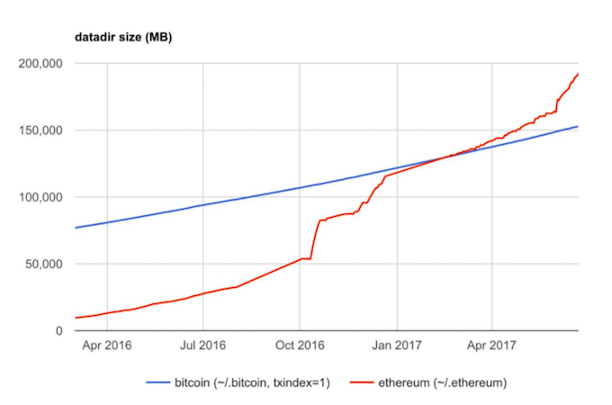
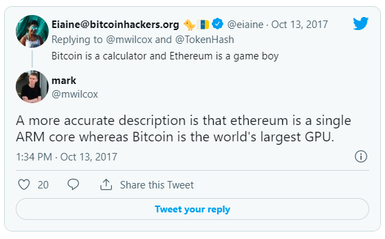
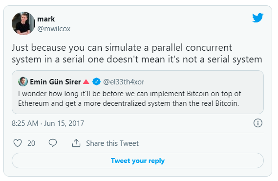
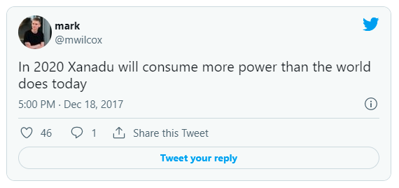
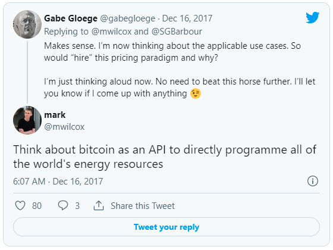
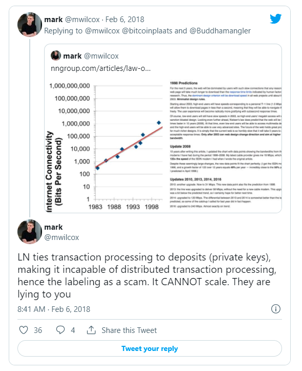
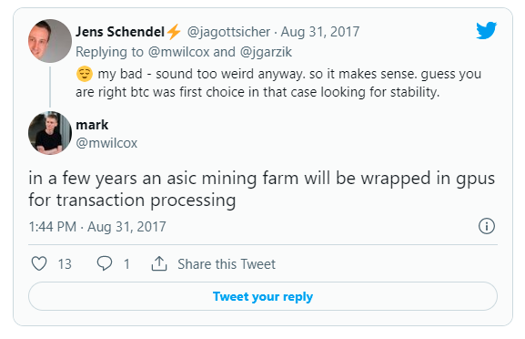
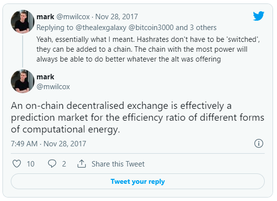

> *作者：[Adam Taché](https://twitter.com/adam_tache) & [Murad Mahmudov](https://twitter.com/muststopmurad)*
>
> *来源：<https://medium.com/@muradmahmudov/the-many-faces-of-bitcoin-d144601050c6>*
>
> *原文首发于 2018 年 4 月 11 日*。
>
> *原文中部分插图已不可获得*。

对于[非持币者](https://www.urbandictionary.com/define.php?term=nocoiner)、金本位拥趸和凯恩斯主义者而言，用寄生虫来比喻密码学货币再合适不过了，它们让千禧一代感染了技术癔症，大放经济学谬论，甚至做起了[密码学无政府主义社会](http://groups.csail.mit.edu/mac/classes/6.805/articles/crypto/cypherpunks/may-crypto-manifesto.html)的白日梦。对于密码学货币技术的信仰者来说，密码学货币是逃离传统金融系统牢笼的出口，摆脱他们生来就在遭受的通货膨胀、货币增发、不当投资和负债等酷刑折磨。他们相信，密码学货币是在无国界、无政治的去中心化系统之间重新建立诚信、重新定义价值尺度的起点。

最著名也是最强大的密码学货币社区 —— 比特币社区 —— 已经分裂成了不同的派系，因为不同的项目想要推动比特币协议向着不同的方向发展，推行部落主义。本文旨在解释这些意识形态背后的动机并揭露导致社区分裂的原因。

本文主要分为 4 个部分，但是不同意识形态的支持者在思想上必然有重合之处。我们首先介绍两大公认的主流思想流派 “比特币首先是，并且永远是价值贮藏物” 和 “BCH 是数字现金”，以及两种比较小众的思想流派 “比特币是约翰·纳什（John Nash）口中 ‘理想货币’ 的催化剂（即，日后可以使用比特币为法币背书）” 和 “从信息论的角度看待比特币”。

## 关于比特币的四种理论

比特币是有史以来第一个去中心化的密码学货币。它于 2009 年问世，是[密码学朋克](https://en.wikipedia.org/wiki/Cypherpunk)社区之前 20 年来重要概念的结晶。其匿名创始人中本聪（Satoshi Nakamoto）[承认](https://bitcointalk.org/index.php?topic=342.msg4508#msg4508)，比特币从[尼克·萨博（Nick Szabo）](https://unenumerated.blogspot.com/2005/12/bit-gold.html)的 [Bitgold ](https://unenumerated.blogspot.com/2005/12/bit-gold.html)和 [Wei Dai](http://www.weidai.com/) 的 [B-Money](http://www.weidai.com/bmoney.txt) 中汲取了灵感。这是密码学社区中两位知名成员在创建功能性电子货币上的早期尝试。

大多数比特币社区成员设想的未来是，比特币最终会得到大规模采用，既充当价值贮藏物又充当交换媒介。在他们眼中，比特币最终会成为占据主导地位的全球货币。然而，他们在如何实现这一设想以及如何决定优先级上产生了严重分歧。

## 比特币是货币

比特币为我们提供了重新发明黄金、为数字未来重新定义货币的机会。许多经济学家认为，根据 *货币性（moneyness）*的量级来评估某物能否充当货币可能更合理。按照这个思路，这世界上的东西没有货币和非货币之分，只有哪个能更有效地发挥货币职能之分。在很多方面，比特币的货币性程度都很高。相比黄金和法币，比特币在便携性、耐久性和稀缺性上都更胜一筹。

迄今为止，对比特币最恰当的描述是具有货币属性的数字商品。根据比特币至上主义者对货币史的[解释](https://twitter.com/NickSzabo4/status/954225789129469952)，很有可能会出现一种新型稀缺货币形式大致沿着以下方向发展：

1. 具有收藏价值
2. \+ 价值贮藏物
3. \+ 交换媒介
4. \+ 记账单位

“比特币是数字现金” 论的支持者认为，效用在初期应比价值贮藏物更重要，应该尽可能降低支付的成本来，以优先实现交换媒介而非价值贮藏职能。

那些相信比特币未来将成为全球货币标准的人将当前的波动性归因于比特币正在经历货币化过程，全球范围内的认知转变是缓慢发生的。在他们看来，尽管波动性很大，但是比特币的价格长期以来呈抛物线上涨，证明越来越多人相信比特币未来将得到广泛采用。

认同罗斯巴德的奥地利学派密码学货币支持者，如作家塞夫狄恩·埃莫斯（[Saifedean Ammous](https://twitter.com/saifedean)），认为抗通胀性和发行上限使得比特币成了有史以来最健全的货币。他们相信，拥有固定发行总量的比特币是唯一公平的货币形式，同时也是让个人实现最高效的资本分配、市场整体实现最高效的价格信息的货币。

在这个群体中，很多人都反对部分准备金银行制度，认为它具有欺骗性。他们相信，部分准备金银行制度不太可能在比特币上建立起来，因为比特币不像黄金那样集中分布。集中化给结算和清算带来了瓶颈，让政府可以完全控制货币的供应、流动乃至整个货币体制。政府手中的权力过大，以至于可以抛弃金本位（这是市场经历几个世纪做出的自然选择），自行制定无商品背书的法币标准。

这些人相信，由于缺少最终贷款人（比特币天生没有最终贷款人），部分准备金制度从长期来看不具备可持续性，人们不会愿意接受市面上的比特币替代品。

奥地利学派中的 “[自由银行制度](https://www.alt-m.org/2015/07/18/hayek-and-free-banking/)” 支持者，如乔治·塞尔金（[George Selgin](https://www.hillsdale.edu/wp-content/uploads/2016/02/FMF-2014-Bitcoin-Problems-and-Prospects.pdf)）和劳伦斯·怀特（[Lawrence White](https://soundcloud.com/cryptovoices/show-40-lawrence-white-money-banking-bitcoin)）认为，比特币的固定发行总量和缺少最终贷款人严格来说无法阻止在比特币上（或一个以比特币作为实际货币标准的经济体中）建立起另一个有竞争力的部分准备金制度。

显然，比特币至少有可能成为一种波动性较低的数字商品、类似数字黄金的价值贮藏物。然而，比特币能否超越原始价值贮藏物这一角色，将波动性降至足够低的水平，成为全球交换媒介和记账单位，人们仍有所怀疑。

有些人认为，由于严格的无弹性供给机制，比特币的购买力不可能在短时间内稳定下来，但人们更喜欢使用购买力稳定的商品作为日常通货。他们已经表达了对更灵活且内置自我调节货币政策的密码学货币的期待。例如，[稳定币](http://juliankohtx.com/stablecoins-and-the-story-of-money/)旨在使用算法央行来将其市场价值与其它价值形式（如美元或一篮子商品）挂钩。

其他人[认为](https://medium.com/@rextar4444/a-neo-gold-standard-bitcoins-optimal-use-case-62d7fbb2f76f)，尽管比特币实行了严格的无弹性供给机制，比特币是约翰·纳什苦心研究 50 多年的 “理想货币” 的完美解决方案。纳什是诺贝尔经济学奖得主，他[提出](http://web.math.princeton.edu/jfnj/texts_and_graphics/Main.Content/IDEAL_MONEY.../Campus_for_Finance_of_2010/)央行可以将货币的通胀与无关政治的指数挂钩，实现各国货币的相对稳定性。一些人相信，随着人们对比特币的需求日益增长，央行会将他们的通货对比特币的价格作为货币价值标准化的一个基准。

## 通货紧缩的死亡螺旋

主流经济学家、凯恩斯主义经济学家和货币主义经济学家都表示过对比特币的固定发行总量的担忧。他们担心如果比特币通过所谓的 “[超级比特币化](https://nakamotoinstitute.org/mempool/hyperbitcoinization/)” 成了占据主导地位的货币，就有可能出现严重的通缩压力。

他们担心如果无法扩大供应量，比特币的购买力就会每年上涨 2% 至 3%，与全球经济产值的增速相近。一些人担心通缩经济政策可能会减少当前和近期的总需求量，导致储蓄过剩和货币囤积，以及个人的消费、投资和创业冒险精神下降。

奥地利经济学家认为，人们对于通缩货币形式的担忧被[过分夸大](https://mises.org/library/deflationary-spiral-bogey)了，“通缩螺旋” 实属谬论。奥地利经济学家反驳了凯恩斯主义经济学家和货币主义经济学家对于消费延迟的担忧，称这种延迟并非永久性的，消费只是被推迟到了将来。使用比特币之后，人们会有较低的时间偏好，还会将注意力转移到长期生产力上，而不是视不断贬值的钱为烫手山芋，挥霍着去购买 “不实用的” 东西。 

他们还相信，企业利润率不会受到影响，因为不仅是商品价格，企业成本也在同步降低，利润率得以保持不变。奥地利经济学家认为，通货紧缩是完全正常的，如果货币供应量不受中心化控制，资本主义和技术本质上都会导致通货紧缩。监管相对宽松的电子行业就是个例子，存储/内存和算力的价格逐年下降。

奥地利经济学家认为，正是 *央行增印货币* 加剧了经济衰退，延长了经济周期，因为持续贬值的货币让人们长期处于焦虑和压力之下，做出不够理性的投资和消费决策（统称为 “不当投资”）。这些不当投资行为通常是低效的资本配置，不太可能创造个人利益、社会利益、生产力或资本存量。

## 理论一：BTC 是抗篡改的价值贮藏物

**信条**：健全货币；不可更改的货币政策；低廉的全节点运行成本；主权级抗审查性；最高程度的去中心化和安全性。

“比特币是健全货币” 思想阵营的人通常将比特币视为唯一合法的密码学资产，其它代币要么一无是处，要么就是纯粹的骗局。这类人通常被称为比特币至上主义者，他们眼中的 “健全货币” 必须符合奥地利经济学派的定义，即，能够抵抗通货膨胀和强制没收。没收的情形并非杞人忧天，例如，美国总统富兰克林·D·罗斯福（Franklin D. Roosevelt）于 1933 年签发了[第 6102 号行政令](https://en.wikipedia.org/wiki/Executive_Order_6102)，禁止在美国境内囤积黄金的行为。

比特币至上主义者相信，在可预见的未来，比特币的目标不是应用于买咖啡这样的小额支付，而是成为 “高能” 货币 —— 一种超越黄金的货币形式。他们声称比特币是一种优于实物黄金的数字资产，因为它的总供应量确实是有上限的，而且增发量是不断缩减的。他们还表示，如果使用得当，比特币是无法被没收、攻破、任意增发的，代表了一种更高级的货币形式的设计尝试。在相关讨论中，一个常见的观点认为比特币是一个[结算网络](http://nakamotoinstitute.org/mempool/economics-of-bitcoin-as-a-settlement-network/)，其原始区块空间不是用来促成小额个体交易的，而是用来结算大额交易的（就后者而言，交易费问题要小得多）。这种大额交易可以是次级支付方案的低频结算交易，例如，通过一笔比特币链上交易结算数百万笔闪电网络付款交易。

虽然比特币开创性地融合了很多精妙的想法，但是很多比特币至上主义者认为挖矿难度调整这一想法可能是最天才的，因为它在数字世界实现了与外部物理世界相绑定的真正稀缺性。[塞夫狄恩·埃莫斯](https://twitter.com/saifedean)是最常发声的知名比特币至上主义者之一。在他的新书[《比特币本位》](https://www.amazon.com/Bitcoin-Standard-Decentralized-Alternative-Central/dp/1119473861/ref=sr_1_1?ie=UTF8&qid=1523228272&sr=8-1&keywords=the+bitcoin+standard)中，他指出极高的[存量-流量比](http://goldstandardinstitute.net/2011/07/16/stock-to-flow-ratio-a-primer/)和不可更改的货币政策使得比特币成为了最具吸引力、最健壮的价值贮藏物。

到目前为止，大多数比特币持有者都是 “守币奴” ，他们最常说的话是：“比特币的价格还能再涨 100 倍以上，傻子才花呢。” 很多人非但不花，还在坚持囤积比特币，也就是圈里人常说的 “[hodling](https://bitcointalk.org/index.php?topic=375643.0)”。 对于这些人来说，在比特币达到[引爆点](https://en.wikipedia.org/wiki/The_Tipping_Point)之前，“hodling” 是最主要的用例。“hodling” 的正反馈循环和币价上涨激励越来越多人加入了 “hodler” 大军。这个群体又推动了比特币的价值上涨，增强了人们的囤币意愿，因为市面上可以买到的比特币数量已经越来越少。

[皮埃尔·罗查德（Pierre Rochard）](http://nakamotoinstitute.org/mempool/the-bitcoin-central-banks-perfect-monetary-policy/)的图解很好地诠释了上述逻辑：囤币可能会创造一个正反馈循环，来促使比特币的价格上涨，从而提高挖矿的收益率、算力、用户采用率等。

- 比特币市场构成 -

比特币至上主义者认为，比特币的核心要素在于其货币性，而非技术性。他们援引比特币的 “完美货币政策（如下图所示）” 以及其先发优势带来的[林迪效应](https://en.wikipedia.org/wiki/Lindy_effect)，解释为什么比特币会成为主导货币。关键是：比特币必须保持本色，必须是一个点对点的、去中心化的系统，其新区块会随机挖出，只不过大概每 10 分钟出现一个。比特币至上主义者相信，只要做到这一点，[超比特币化](http://nakamotoinstitute.org/mempool/hyperbitcoinization/)终将出现，使比特币成为有史以来最具主导地位的货币。

[img](../images/the-many-faces-of-bitcoin/OXZFh4-six.)

在货币政策方面，比特币至上主义者认为没有哪个资产的货币政策优于比特币的超通缩发行机制，而部分准备金银行制度已经病入膏肓。他们将储蓄和资本积累的优先级置于浅层消费之上。和奥地利派经济学家一样，他们相信政府干预（尤其是对货币供应量的干预）会导致不当投资、人为压低利率，以及贫富差距拉大。

比特币至上主义者认为，要想让比特币成为健全货币，必须实现系统中的集体和个体安全性最大化。单从算力来看，比特币是迄今为止最难篡改的密码学货币。据估计，截止 2018 年 4 月，比特币交易经过了算力达 29 exahash/s 的网络的确认。这个速度是基于挖矿难度估算的，过去 6 个月来增长了大约两倍，自 2009 年比特币诞生以来每年都在增长。

- 比特币算力（截至 2018 年 4 月） -

比特币至上主义者认为，矿工受雇于比特币网络完成特定的工作：挖出（被全节点判定为）有效的区块。因此，他们认为是用户掌控着比特币网络要验证什么，而非矿工。为此，比特币至上主义者强调用户应该亲自保管私钥并运行全节点来验证交易，从而实现自我主权。通过最大程度减小区块体积和链上数据存储量，用户在低带宽环境中依然能够运行全节点。目前，比特币区块链的副本存储在全网 10 万个全节点上，其中[超过 9000 个全节点是可](https://coin.dance/nodes)用服务点。

Bitcoin Core 是使用比特币协议的主流开源项目。目前负责 Bitcoin Core 的开发者将主要精力放在了[闪电网络](http://www.lightning.network/)等支付通道上。此外，他们还支持隐私技术 CoinJoin，并正在增加对侧链（作为未来的 Layer 2 乃至 Layer 3 解决方案）、[MAST](https://bitcointechtalk.com/what-is-a-bitcoin-merklized-abstract-syntax-tree-mast-33fdf2da5e2f)、[Schnorr 签名](https://bitcoincore.org/en/2017/03/23/schnorr-signature-aggregation/)[和签名聚合](https://bitcoincore.org/en/2017/03/23/schnorr-signature-aggregation/)的支持，以尽可能提高比特币区块链的区块空间利用效率。他们还在研究如何实现[私密交易](https://www.elementsproject.org/elements/confidential-transactions/investigation.html)，有可能会使用 Blockstream 的 [Elements 项目](https://www.elementsproject.org/elements/confidential-transactions/)。也有人提议使用隔离见证通过[软分叉](https://lists.linuxfoundation.org/pipermail/bitcoin-dev/2016-January/012194.html)的形式实现私密交易。

## 理论二：BCH 是点对点数字现金

**信条**：点对点；抗审查、无国界、无中间人的低成本价值转移方式；链上吞吐量和链上效用；不可更改的货币政策。

BCH 社区的成员认为特币不应该对区块体积设限，以便实现无国界的点对点支付。他们相信中本聪的初衷是创造一个点对点电子货币，而非数字黄金。他们通常会引用比特币[白皮书](https://bitcoin.org/bitcoin.pdf)的标题和摘要以及中本聪关于如何[逐步](https://bitcointalk.org/index.php?topic=1347.msg15366#msg15366)[提高](https://bitcointalk.org/index.php?topic=1347.msg15366#msg15366)[区块体积](https://bitcointalk.org/index.php?topic=1347.msg15366#msg15366)上限的论述和其它文章来证明自己是对的。这些支持者普遍相信，比特币系统不应该只作为那些负担得起日益增长的交易费的交易者（例如，银行和其它富有的实体）的结算层。出于技术和意识形态的原因，他们强烈反对这种路线，希望看到大多数活动都发生在链上。

这些人推崇的比特币实现叫作 BCH（Bitcoin Cash）。BCH 旨在将区块体积扩大到足以容纳近乎无限的交易，以便先作为交换媒介而非价值贮藏物得到广泛采用。BCH 的目标是让所有用户都能在链上进行交互，包括那些银行服务没有覆盖到或低度覆盖的人群，其中一些人每天只有 2 美元的微薄收入。

比特币之所以会分叉出 BCH，是因为社区成员在比特币的技术和社会发展方向上意见分歧愈发严重。其中一个例子是知名开发者们对 2016 年 2 月实行的协议变更（即 “费用替换（replace-by-fee）”）意见不一。比特币支持者和 BCH 支持者争论的焦点在于：一部分人认同迈克·赫恩（Mike Hearn）对 [“费用替换” 的抨击](https://medium.com/@octskyward/replace-by-fee-43edd9a1dd6d)，还有一些人支持[零确认交易](https://news.bitcoin.com/mini-pos-launches-zero-confirmation-bitcoin-cash-point-of-sale-terminal/)，通过即时支付实现比特币效用最大化，让比特币可以像现金一样使用。比特币现金论的支持者常引用中本聪的[自动售货机](https://bitcointalk.org/index.php?topic=423.msg3819#msg3819)例子来论证其观点是绝对可取的。尽管如此，其他人认为应该研究所有替代方案，而非依赖有争议的零确认交易。

BCH 支持者认为，只有在转账场景中成为最优选的密码学货币才能成为主导货币。因此，他们不鼓励社区内部囤币，坚持认为每人每月应当花费一定比例的 BCH。有的人还提倡不断补充已花费的 BCH。他们希望通过这么做来激励尽可能多的商家接受 BCH，让 BCH 作为支付系统得到采用。其底层思想似乎是为了粉碎国家对货币的垄断并创造一个闭环：人们拿着赚到的 BCH 去商家那里花掉，商家再拿着 BCH 付给供应商和雇员。 

BCH 选择不将 “[隔离见证](https://bitcoincore.org/en/2016/01/26/segwit-benefits/)” 引入其实现，并相信不参与挖矿、只接受和验证交易的全节点与系统的底层安全性无关。相反，他们认为算力是唯一能决定比特币方向的东西；矿工才是真正的全节点，因为只有它们作为实体参与竞争，达成状态共识并创建新的区块；大型矿场的出现是正常的（他们经常引用中本聪关于[服务器矿场的文章](http://satoshi.nakamotoinstitute.org/emails/cryptography/2/)作为佐证）。

在《[从企业论角度看待工作量证明](https://nchain.com/en/blog/proof-work-relates-theory-firm/)》中，BCH 支持者将 BCH 系统描述成多领导者-追随者的斯塔克伯格博弈（Stackelberg game），矿工在其中是控制算力的理性参与者。在这种博弈模型下，矿工们处于永恒的非合作型竞争关系中，每个矿工都掌握一定数量的算力来生产新区块，并通过优化效率来实现利益最大化。

在中期[路线图](https://www.bitcoinabc.org/bitcoin-abc-medium-term-development)中，BCH 开发者计划重新启用比特币交易的某些脚本（即，操作码，可以让[智能合约](https://en.bitcoin.it/wiki/Contract)实现更多功能）。他们还计划开办一场奖金达 500 万美元的[竞赛](https://coingeek.com/bitcoin-cash-bch-tokenization-contest-5-million-prize)、升级染色币（ [Colored Coins](https://en.bitcoin.it/wiki/Colored_Coins)）的版本，来推动链上代币化的浪潮。BCH 的目标是解锁比特币脚本的所有功能，在提高商家采用率的同时实现另类的智能合约平台用例。他们还计划通过 [Oblivious Transfer](http://www.livebitcoinnews.com/craig-wright-claims-bitcoin-cash-will-get-privacy-features-may-2018/)（不经意传输）来实现链上隐私性。

一篇研究如何让 BCH 成为互联网电商基础设施的[论文](https://papers.ssrn.com/sol3/papers.cfm?abstract_id=3065857)讨论了如何在不改变比特币底层协议的情况下将矿工分成特定的任务组。例如，一部分节点负责引用区块链的有限子集，一部分节点负责存储完整的区块链，一部分节点负责监控，还有一部分节点负责传播信息。这篇论文还引入了 “分布式自治公司” 的概念，将其描述为运行在附加层上的系统，可以实现更加高效的信息传播。第三方可以独立验证这些公司是否诚实。这篇论文还描述了一个快速支付网络的设想：这些网络由分布式自治公司运行，使用链上保证合同，让商家为 “优先传播交易” 付款。这篇论文还提议使用分布式自治公司来监控双重花费，让商家可以在几秒钟内拒绝消费者付款，或及时让自动售货机停止出货。

在 BCH 支持者眼中，这不是一个简单的支付系统。例如，一些人将比特币视为健壮的双堆栈[下推自动机](https://en.wikipedia.org/wiki/Pushdown_automaton)（2PDA），这里的双堆栈分别指的是比特币脚本语言中的替代堆栈（alt-stack）和主堆栈（main-stack）。正如这个 BCH 支持者会议[视频](https://www.youtube.com/watch?v=M6j-11H2O7c)中所言，从理论上来说，比特币有可能像通用图灵机那样运行。也就是说，比特币能够让任何可计算函数像脚本一样在链上执行。一些计算，如细胞自动机（cellular automata），需要多笔事务来完成。

在另一篇 BCH [论文](https://www.researchgate.net/project/Implementing-A-Church-Turing-Deutsch-Principle-Machine-on-a-Blockchain)中，BCH 支持者指出，不限长度的单带图灵机就像一条无限长的区块链，可以存储遗传算法，为任意数学问题提供图灵完备的解答。因此，该论文假设，BCH 最终将创造出一个丘奇-图灵-多伊奇原理机（Church-Turing-Deutsch Principle Machine），就像戴维·多伊奇（David Deutsch）在其 1985 年所著[论文](https://people.eecs.berkeley.edu/~christos/classics/Deutsch_quantum_theory.pdf)《量子论、丘奇-图灵原理和通用量子计算机》中所言 “每个物理过程都可由通用计算设备模拟出来”。

## 理论三：比特币是约翰·纳什口中 “理想货币” 的催化剂

**信条**：无关政治的价值贮藏物；将挖矿难度作为约翰·纳什理论上的工业消费者价格指数（Industrial Consumer Price Index）；作为发行了本国货币的央行之间的理想化结算层。

一小部分人（包括两位知名意见领袖 Juice（[Medium](https://medium.com/@rextar4444)）和 SoakerPatoshi（[Twitter](https://twitter.com/soakerpatoshi)））大致认同比特币至上主义者的观点：比特币很有可能成为新时代的 “金本位”，成为价值万亿美元的全球资产。但是，对于比特币的结局，他们持不同的看法。他们认为，即使比特币在市值上压过黄金，由主权国家背书的法币也不会消亡。比特币不会摧毁法币，反而会迫使央行以更负责的方式管理法币。

这一可能性最早由哈尔·芬尼（[Hal Finney](https://en.wikipedia.org/wiki/Hal_Finney_(computer_scientist))）提出。芬尼是早期比特币开发者，首个与中本聪进行比特币交易的人，以及安全通信法优良保密协议（Pretty Good Privacy，PGP）的开发者。2010 年，他在比特币论坛上发表了关于比特币银行的设想。

- 《比特币银行》（哈尔·芬尼） -

诺贝尔经济学奖得主约翰·纳什在博弈论研究方面做出了重大贡献，例如，[纳什均衡](https://en.wikipedia.org/wiki/Nash_equilibrium)（[Nash Equilibrium](https://en.wikipedia.org/wiki/Nash_equilibrium)）和[议价问题](http://www.eecs.harvard.edu/cs286r/courses/spring02/papers/nash50a.pdf)（[Bargaining Problem](http://www.eecs.harvard.edu/cs286r/courses/spring02/papers/nash50a.pdf)）。纳什认为，凯恩斯主义经济政策虽然在理论上有着崇高的目标，只服务于大众利益，但实际上只能让政府增印货币，通过增加货币供应量来征收铸币税。纳什常将凯恩斯主义者比作布尔什维克党，因为他发现这两个群体都接受中心化管理系统的概念，而且缺乏决策透明性，尤其是在主权国家货币发行方面。

纳什曾写道，从央行官员对通货澎胀目标的讨论中，我们可以看出，通过控制货币供应量来控制通货膨胀是有可能的。在计算通胀目标时，央行使用的是自己国家特定地区的国内商品价格组成的生活成本指数。纳什提出了一个叫作 “工业消费者价格指数（Industrial Consumer Price Index，ICPI）” 的概念，即，通过一个包含各地不同商品价格的公式为商品价值比较提供国际标准。

纳什认为，回归金本位是次优解，因为他相信技术变革会导致未来黄金生产成本的不可预测性。他还认为，金矿的位置既不具备政治吸引力，又不够理想化，回归金本位会随机提高部分地区的经济地位。

简而言之，纳什的 “理想货币” 论认为，尽管我们无法设计出一种绝对稳定的货币，但是我们可以设计出一种接近 “稳定” 的货币，足以媲美一篮子最优选商品价格。虽然 ICPI 朝着纳什的 “理想货币（[Ideal Money](https://en.wikipedia.org/wiki/Ideal_money)）” 愿景迈出了一步，但是将货币与 ICPI 挂钩并不能解决问题，因为重大技术突破可能会导致货币的价格波动，之后的重新调整也容易受到政治压力的影响。

目前，全球储备货币都面临 “特里芬难题（[Triffin Dilemma](https://en.wikipedia.org/wiki/Triffin_dilemma)）”，导致短期国内目标和长期国际目标之间的冲突，例如，通过提高通货膨胀来刺激经济增长与维持本国货币购买力稳定性之间的冲突。纳什认为，如果货币置身于需要提升自我才能生存的竞争环境中，它会日渐强大。然而，货币并没有争相与时俱进，而是争相贬值。纳什认为，对于货币来说，最重要的不是它在日常交易中的效用，而是让全球经济获得不受腐蚀的价值标准。

一些人认为，在比特币的催化下，全球货币系统会不断进化，在稳定性上媲美一篮子最优选商品的价格。一些人认为纳什早就在 20 世纪 60 年代的文章中预测到了会出现比特币之类的东西。纳什写道：“我在思考一种政治中立的技术工具形式的可行性。根据格雷欣法则，货币只需像其它会被囤积起来的物质商品一样好即可。”

巧合的是，过去几年来，对比特币本质的全球共识已经逐渐凝练成 “数字黄金” 之类的称号。比特币具备获取世界货币溢价所需的一切特质，就像黄金那样。稀缺性与增发量之间的关系实际上比供应稀缺性更重要。在接下来的几年里，比特币的存量-流量比（反映其稀缺性与增发量之间关系的指标）将高于黄金。比特币的通胀率将逐年降低。很多人相信，在这段时期，比特币作为一种对抗通货膨胀的手段将引起越来越多人的兴趣。

我们可以合理推测，如果比特币继续在基础设施上进行改进且市场地位得到提升，央行和法币将不得不与比特币竞争。主权国家的公民很有可能对其央行施压，迫使其印发量少质优的货币，从而降低通胀率。假使真的出现这种情形，比特币很有可能起到与 ICPI 篮子类似的效果，又不需要真的实现 ICPI。这就迫使法币向着纳什的 “理想货币” 愿景靠拢。一些人认为纳什的目标即将实现，因为比特币的出现代表几个世纪以来主权国家控制下的货币首次受到挑战。

## 理论四：比特币是一个信息和能源黑洞，将推动传统货币演化。

**信条**：完美的信息市场和计算市场；比特币是分形的，是所有分叉的总和；无需中间人即可实现抗审查、无边界且低成本的点对点价值转移；高链上吞吐量和链上效用。

> 比特币不是货币。它现在只是过去的货币，这是很可怕的，因为比特币实际上是一种新的范式。我们以前从未获得过完美的市场信息，因此货币的概念必须进化来适应现实，而不是囿于传统观念。 —— 佚名

- 比特币分叉 -

一小部分人主要基于克劳德·香农的信息论对比特币进行了探讨，其中最知名的有乔治·吉尔德（[George Gilder](https://en.wikipedia.org/wiki/George_Gilder)）（著有很多关于货币体系和资本主义的书）、安德鲁·德桑蒂斯（[Andrew DeSantis](http://www.twitter.com/desantis)）（比特币创业公司 [21.co](https://techcrunch.com/2015/05/18/what-is-21-co-really-doing-an-excerpt-from-digital-gold/) 的前工程师，现就职于 earn.com）和马克·威尔科克斯（[Mark Wilcox](http://www.twitter.com/mwilcox)）（[Nyriad](http://nyriad.com/) 的首席战略官）。简而言之，在信息论中，信息被定义为惊奇（surprise）。

- 信息论创始人克劳德·香农（Claude Shannon） -

这些人认为比特币为信息论带来了突破性进展，因为它让所有人都能在不依赖第三方的情况下进行可验证的、带有时间戳的、防篡改的、透明的交易。信息论认为创造力需要一个稳定的媒介才能实现分形增长。在他们眼中，比特币就是这样一个极度稳定的媒介。在《知识和权力》一书中，吉尔德指出：“（充满惊奇的）高熵信息需由（无惊奇的）低熵载体来承载。” 这部分人还认同比特币的通缩政策，因为他们认为资本主义和技术进步本质上会造成通缩。

和 BCH 支持者一样，这些人也喜欢挑战比特币的极限，使得这个开放数据层的效用最大化。他们不喜欢这样的比特币：为让所有用户都可以运行全节点来验证自己的交易而限制吞吐量。他们认为比特币可以用作断言[机](https://en.wikipedia.org/wiki/Oracle_machine)（oracle）来证明某个数据在某个时间点是存在的，且比特币脚本语言的动态性比以太坊的更强（相比比特币的[并行](https://www.rand.org/content/dam/rand/pubs/research_memoranda/2008/RM1361.pdf)执行特性，以太坊平台上的事务由智能合约强制串行执行）。

这些人将比特币视作重新构建计算机软件和网络的平台。例如，他们对泰德·尼尔森（[Ted Nelson](http://ted.hyperland.com/)）的超文本项目 “世外桃源计划（Project [Xanadu](http://xanadu.com/)）” 与比特币之间的相似性感兴趣。世外桃源计划的设想是，通过超文本创造出一个高度互联的平行文档宇宙，以供阅读、写作和学习。超文本就是 “非相续性著述 —— 分叉的、允许读者做出选择、最好在交互式屏幕上阅读的文本”，通过遍布全世界的分布式服务器运行，协助达成全网微交易。

正如[《区块链控制流》](http://markwilcox.com/articles/01/)中讨论的那样，以太坊的设计选择是让网络控制合约执行以及用户资金。威尔科特斯写道：“一个点对点网络若要实现政治上的去中心化，必须实现去中心化控制。为此，我们应该将控制权完全保留在个人手中。” 他还写道，维塔利克·布特林（Vitalik Buterin）在以太坊白皮书中指出的所谓比特币的 “局限性” 其实是比特币的护城河。

这些人通常对闪电网络和其它 Layer 2 解决方案持负面观点。德桑蒂斯称 “闪电网络让底层区块链变得僵硬、呆板”，通过限制实验空间和降低意外发现的概率削减了比特币的信息论价值。威尔科克斯认为闪电网络是 “一个骗局，其目的是成为用户和矿工之间的抽象层”。

威尔科克斯口中的交易处理指的是验证交易并通过哈希计算将其存储在默克尔树上。交易处理可以指几乎任何东西。他提出了一个论点：过去 9 年来促使比特币的算力呈指数级增长的经济激励措施也可以用来帮助交易处理实现指数级增长，交易处理目前只是以串行方式在 CPU 上完成的。

Nyriad（威尔科克斯是联合创始人之一）为全球最大的射电望远镜项目 “平方千米阵”（Square Kilometre Array，SKA）打造了 [Nsulate](http://www.nyriad.com/products/nsulate/)。Nsulate 创造性地使用 GPU 作为存储控制器，消除了数据处理和存储之间的差异。Nsulate 通过密码学哈希算法为区块链提供内置支持，让矿工可以并行处理交易。

因此，威尔科克斯的许多论据的出发点都是将比特币视为一个可以实现竞争性通用计算市场的平台。在这个市场中，用户和公司通过脚本提交交易难题，再由矿工使用 GPU 找到答案并写到链上以获取奖励。交易难题可以指从深度学习到 CRISPR 搜索等几乎一切东西。在比特币提供的计算市场中，想要将计算提交给矿工的用户将非常关心效率，希望自己在难题中包含的每单位奖励都能换来最多的计算量和算力，从而确保这个系统是尽可能安全的。



威尔科克斯和德桑蒂斯通常反对以传统的供需观来看待区块链的经济市场。威尔科克斯在其博客中讨论了工作量证明对交易处理和可扩展性的影响，例如，[《基本的错误概念》](http://markwilcox.com/articles/03/)。如果基于比特币的计算市场能够证明自己在计算成本和效率上优于行业巨头，它们极有可能实现扩张。

- 来源：<a href="https://twitter.com/mwilcox/status/915781401487671296">Twitter</a> -

## 结语

本文所述的 4 个比特币思想流派并不一定相互矛盾，而且通常是有交集的。理论一 “比特币是数字黄金” 和理论三 “比特币是纳什口中 ‘理想货币’ 的催化剂” 尤其相似。主要区别在于后者认为法币会存活下来并与时俱进，前者则认为超比特币化会彻底摧毁法币，每个人最终都要使用比特币来购买商品、服务和劳动力。

同样地，理论二 “BCH 是点对点数字现金” 和理论四 “比特币是推动信息论发展的要素” 背后有很多相同的观点和论据支持。主要区别在于，后者对分叉没有偏见，认为分叉是有可能且必将发生的，彼此之间存在竞争关系。

*感谢 [armor123123](https://twitter.com/armor123123) 等人对本文初稿的反馈。*

> *[续篇中文译本](https://www.btcstudy.org/2021/10/04/bitcoin-past-and-future/)*