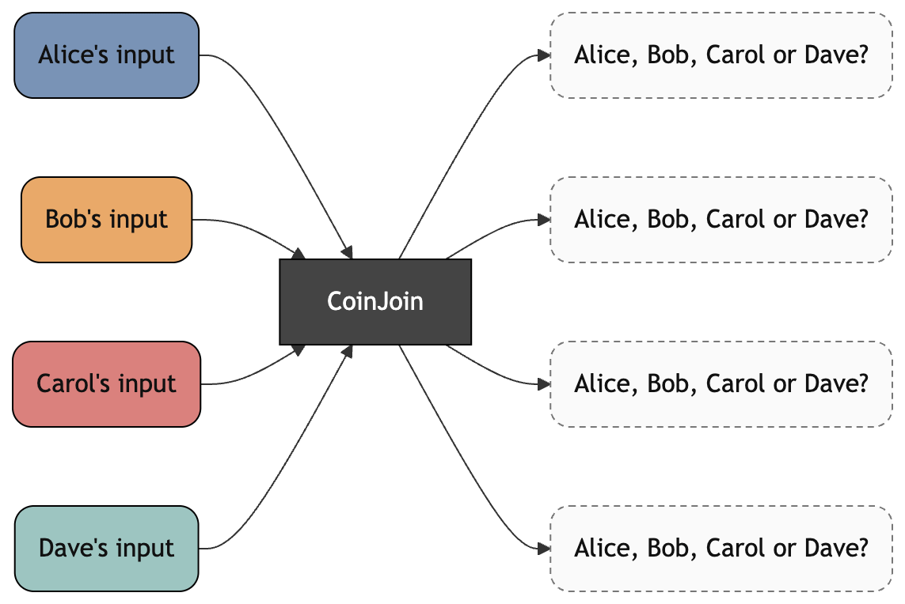
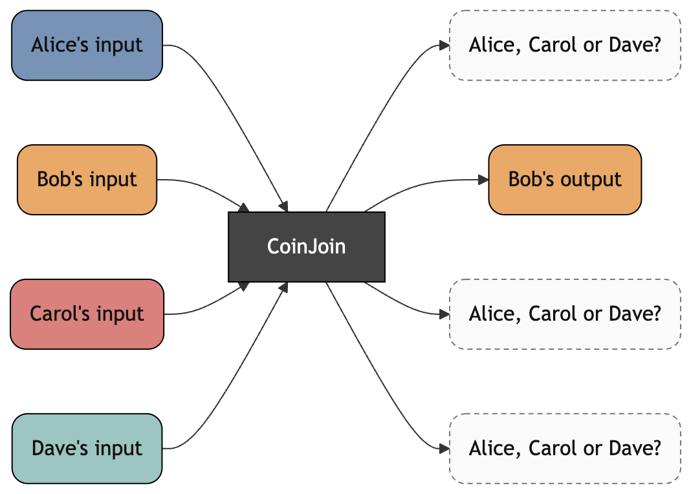
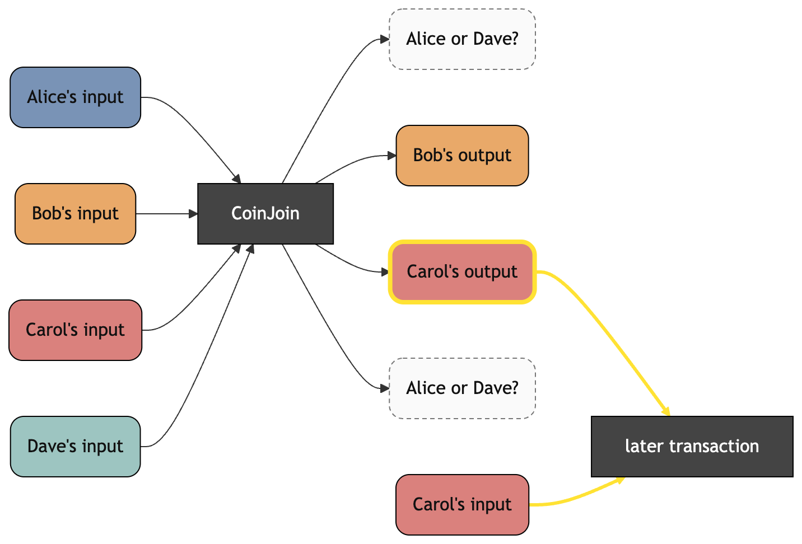
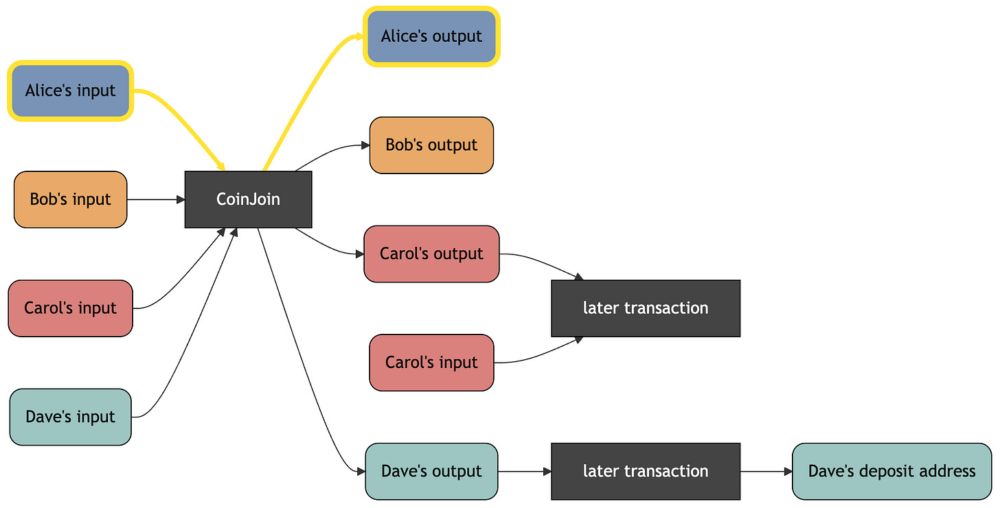
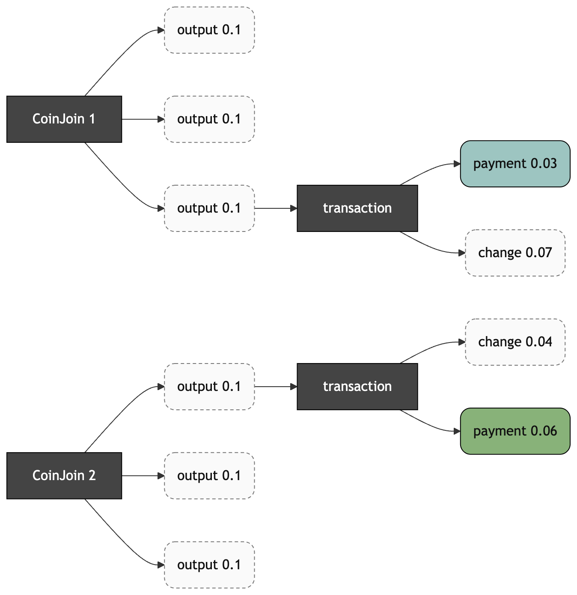
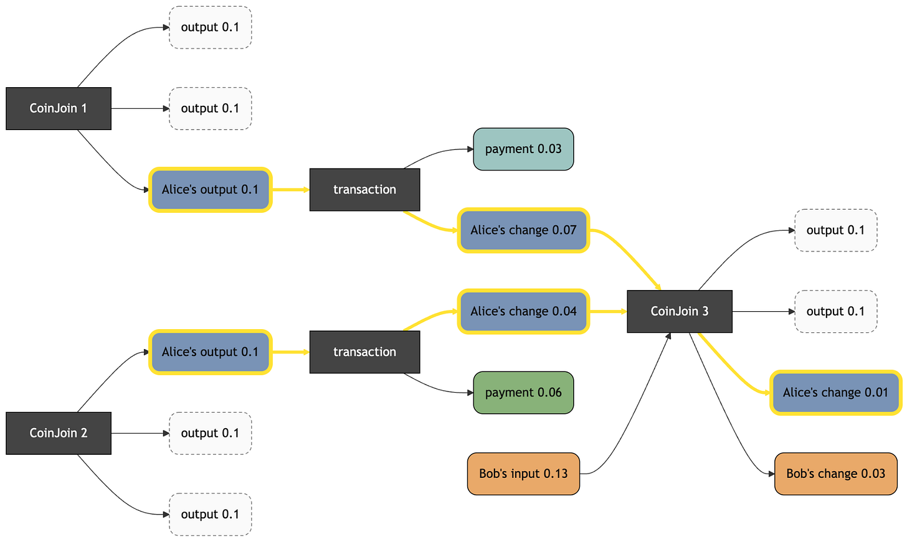

> *作者：Yuval Kogman*
> 
> *来源：<https://spiralxyz.substack.com/p/the-many-headaches-of-coinjoin>*

CoinJoin [有许多面向](https://spiralxyz.substack.com/p/the-scroll-5-the-many-faces-of-coinjoins)（[中文译本](https://www.btcstudy.org/2025/11/20/the-scroll-5-the-many-faces-of-coinjoins/)）。本文尤其关注的设计一种专门为隐私性而优化的 CoinJoin 结构时的 “丛集性头痛（cluster headache）”（此处是故意使用的一语双关！）。

（译者注：“cluster” 在分析区块链钱币隐私性时含义为 “集群”，指多个不同的 钱币/地址 可能属于同一个人。本文的主要内容就是介绍在考虑钱包集群时，CoinJoin 隐私性的局限性。因此这里说是一语双关。）

## 作为稻草人的匿名集

等面额输出的 CoinJoin 的匿名集的 “普遍” 版本，来自与 “混淆网络（mixnets）” 的类比；不幸的是，它建立在一些非常强而且通常没有详细说明的假设上。在理解真实世界中的敌手的能耐时，这些假设限制了这个模型的有用性。

在这个理解链上隐私性的概念中，一笔 CoinJoin 交易被类比为一个混淆网络中的一个混洗阶段。在每一笔这样的交易中，都有 *k* 个面额相等的输出，被假定混洗成功。因为它们的面额都相等，所以，当在区块链上找不到足够多的信息时，从表面上看，就没有办法将任何一个输出与输入所属的钱包集群关联起来。

但是，真实世界中的敌手可以结合这些输出在以后的花费模式、聚类技术和辅助信息；他们不会只看 CoinJoin 交易而不看其他交易。

如果你不想看这么多长篇大论，那么一句话总结：这些输出几乎不可避免会因为这种那种原因而变得更好区分。这里的讨论并未穷举。有时候，这些隐私性泄漏足以让敌手把 CoinJoin 后的钱币与 CoinJoin 前的祖先关联起来，但这是不是很容易，则难说。

## 敌手未必视野狭隘

普通匿名集模型的最明显的未言明的假设，就是认为 CoinJoin 结构可以完全独立于交易图的其它部分。

比特币用户在真实世界中的敌手可能是有虐待狂倾向的配偶、尝试盗窃或打劫的犯罪分子（有些甚至得到政府官员的协助）、由政府和广告公司发起的大规模监控，每一种都有不同的目的。一个比特币用户如果丧失了可抵赖性（deniability），或泄漏了关于其花费习惯、净资产、安全配置等等的信息，就有可能暴露在这些风险中。真实世界中的敌手们动机不同，并且可能投入数量不等的资源来监视受害者。那么，假设这样的敌手无法访问区块浏览器网站，是不合理的。

惯例将敌手视为一种算法，尝试输出其关于关系（输入输出关联）的最佳猜测。如果一种算法是受限的，并且只得到单独一笔交易作为输入、没有记忆，虽然这也许足以说明某一些敌手的能耐，但已经无法涵盖钱包聚类技术 —— 而它是这本书（比特币隐私性文献）中最古老的章节。

还有一个相关的误解是，一些破坏隐私性的交易是不可跟踪的，因为计算成本太高，因此它们仍然具有隐私性。但是，隐私性不应该依赖于不标准的计算困难性假设（而依赖于标准的计算困难性假设，则只是 “使用密码学” 的一种花哨说法）。

## 辅助信息，元数据隐私性

另一个未言明的假设是，只考虑链上的数据就足够了。但是，区块链以外的辅助信息显然也对去匿名化非常有用。

这样的信息包括保密的合规记录（例如，AML/KYC 数据可以从交易所、或者外包了其身份验证程序的公司处获取）或其它识别个人身份的信息（例如因为网站爆破而泄漏的邮箱地址或家庭住址）、临时指纹（例如表明活动规律的下场，比如时区，还有访问网络的时延）、IP 地址，以及可能泄露用户所用的钱包软件的专属 动作/外观。

还有一点，虽然很重要，但在本文中我们将假设传输层隐私性是一个黑盒子。

有一个更强的假设，但我们暂时置之不理：很容易设计出一种安全冗余，将所有跟链上结构相关的辅助信息都考虑进去。在本系列的下一篇文章中，我们将部分移除这个假设，但至少可以提供一个框架，将它处理未一个工程问题，而不是截然分明的问题。

我们将在本文的最后一章回到辅助性信息的话题。

## 女巫抗性

“ *n*-1 ”攻击，也叫女巫去匿名化攻击，让敌手可以知道用户 *不是谁*。如果只有一位是真实用户、其他所有参与者都在敌手的控制之下，那么这些参与者的输入和输出都可以排除在外，剩下的这个诚实用户其实毫无匿名性，但匿名集的外观并没有改变。

困难根源于，这是一个免许可的系统。这些 [“女巫” 用户](https://en.wikipedia.org/wiki/Sybil_attack) —— 来自同一实体的多个假名身份 —— 与诚实用户无法区分。因此，女巫抗性只能来自于对参与 CoinJoin 施加一些成本。一些成本是比特币内生的：交易手续费和货币的时间价值。额外的成本则可以通过机制设计来实现，但是，比如说，在使用 “协调手续费” 机制时，它就降低了被腐化的协调员发动女巫攻击的成本。不过，这很大程度上是一个理论问题，因为迄今为止，在比特币上运行的非常中心化的协调协议，都在协议层面要求对协调员的信任。

具体对比特币交易来说，也有可能诚实用户的数量很大但并不产生作用，因为这些诚实用户的动作并不支持彼此的隐私性。比如说，这些钱币的价值可能差别太大。

目前，我们将假设女巫抗性可以取得，办法是使用一些机制，强制让这样的攻击有代价，因为这是在免许可的环境下唯一一种可以使用的缓解措施。请注意，不论使用什么机制，都不应该导致诚实用户的隐私性降级。如果与区块链的结构有关，我们就会再次讨论，否则，女巫抗性就不在本文讨论范围内。

## 其他用户必须也行动起来

即使我们假设其他用户不在敌手控制中，如果他们因为粗心大意或其它原因而丢失了隐私性，那么最终的效果跟他们与敌手串通是一样的。与女巫攻击不同的是，有时候，可能很显然某个参与者会完全丧失隐私性。

- 在创建 CoinJoin 时，从 Alice 的角度看，它跟最好的隐私性状态是没有区别的：每一个输出都是相同面额的，看起来可能属于任何一个参与者。 -

一个简单的例子是在 CoinJoin 之后的交易中重复使用 CoinJoin 以前用过的公钥，从而明确地让一个输入和输出产生关联。如果 Alice 索引好区块链上所有已知的地址，她应该能注意到这一点，但是，这代价很高。不必说，对于攻击者来说，这样的成本是微不足道的，不构成重大障碍。从攻击者的视角看，这笔 CoinJoin 交易在广播时更像是这样的：

- 敌手可以发现 Bob 的输出重复使用了 CoinJoin 以前的公钥。请注意，在这个案例中，这并不需要敌手知道哪个是 Bob 的输入。但是，图示的重点依然成立：只要知道一个输出是 Bob 的，就可以排除它是 Alice f的。剩下的候选集合就从四个参与者收缩成了三个。 -

更微妙的案例是通过聚类启发式分析。这样的隐私泄露可以很显眼，比如上面说的地址复用，但通常来说会更难注意到，尤其因为它是源自多个数据点的泄露，而不是一次明确的错误。

- 在这个案例中，Carol 同时花费了她的 CoinJoin 输出和敌手已知是她的输入。根据输入来源同一性假设（详见本系列<a href="https://spiralxyz.substack.com/p/the-scroll-2-wallet-clustering-basics">第一篇文章</a>（<a href="https://www.btcstudy.org/2025/10/21/the-scroll-2-wallet-clustering-basics/">中文译本</a>）），就表明这个被花费的 CoinJoin 输出属于她，那么就只剩下 Alice 和 Dave 是无法区分的了。 -

总的来说，这样的隐私性损失甚至不会在链上显现，比如，另一个用户想一个交易所提供了 KYC 信息。甚至这是在很久以后发生的，但对其他用户的隐私性却有追溯性的影响。这样的去匿名化最令人震惊的例子，可能是，因为诉讼，Celsius 用户的交易没有得到充分的 “匿名化”（关于匿名化失败的讨论，请看[本系列前一篇文章](https://spiralxyz.substack.com/p/the-scroll-4-intersection-attacks)（[中文译本](https://www.btcstudy.org/2025/10/24/the-scroll-4-intersection-attacks-on-coinjoin-anonymity/)）），从而不止伤害了这场诈骗的直接受害者，还有他们互动过的人。

- 如果敌手有能够识别 Dave 的辅助信息，那么 Alice 的输出就可以确定性地与其输入关联起来，失去所有匿名性。 -

撇开这些危险不谈，我们假设其他用户也有能力保护隐私性并且小心翼翼。

## 找零输出是隐私性的毒药

基本上，要预测支付的数额以及未来的手续费数额，不可避免要考虑市场的投机活动。即使在这些东西都能合理预测，CoinJoin 的面额能够恰好满足支付的需要而不产生找零的概率是很小的。

假设 Alice 有两个钱币，面额是 *d*，来自两笔独立的 CoinJoin 交易，而 *d* 是常用的最小面额，并且这两笔 CoinJoin 交易都有 *k* 个这样面额的输出。然后，她发起了两笔独立的支付交易，每个的支付数额都小于 *d* 。这时候，这些支付交易的匿名集确实就像幼稚的分析那样。 

- 两个 CoinJoin 输出独立地花费：每一笔支付都是模糊的，链上没有什么东西能将这些支付跟同一个用户关联起来。 -

每个找零输出的价值都取决于 Alice 的经济活动，手续费也是如此，所以，除非它们在一定意义上完全提前确定的（并且是用比特币来计价），她将需要处理数额不定的找零输出。在 UTXO 模式下，这或多或少是不可避免的。

如果 Alice 尝试单独花费这些钱币（找零输出），每一笔后续交易都会跟前面的关联起来。更差的是，如果两个钱币是一起花费的，那么，这笔交易就会跟前面的支付关联起来，也会打消隐私性。

然后，假设这两个找零输出的面额之和恰好是 *d* 或更多，Alice 就能再次 CoinJoin，拿回这些找零输出的价值。不走运的是，在目前的 CoinJoin 实现中，这也会降低隐私性。

即使找零输出只在 CoinJoin 交易中花费，支付交易以及用户钱包的隐私性，也有可能因为尝试改进找零输出的隐私性而受损。

幸运的是，我们将看到，这并非 CoinJoin 交易的内在问题，但如果只使用混淆类型的交易，则是不可避免的。

## 钱币挑选

上一节讲到，产生找零是不可避免的。如果每笔交易都只有一个输入，那么其找零输出的价值必然小于这个输入的价值。如果一个钱包受到这种约束，那么随着时间推移，其余额会日益碎片化，直至没有用处。因此，通过花费超过一个输入来归集资金，也是不可避免的。碎片化越严重，归集的影响就越大。

这种不可避免，给 CIOH（输入所有权同一性）之所以高效，提出了一些直觉上的解释；但一种不那么符合直觉的危险是交集攻击。如[前一篇文章所讨论的](https://spiralxyz.substack.com/p/the-scroll-4-intersection-attacks)（[中文译本](https://www.btcstudy.org/2025/10/24/the-scroll-4-intersection-attacks-on-coinjoin-anonymity/)），交集攻击要强大得多。CIOH 只考虑单笔交易所暗示的情形，但考虑到敌手可以考察交易图到任意深度并寻找钱币历史的交集，钱币来源的共同点也许比人们以为的要容易识别得多。尤其是，如果 交集的目标是从辅助信息中获得的集群，而不是基于局部的启发式分析的话。

即使在我们作出的非常宽松的假设之下，我们依然可以看出，CoinJoin 交易有一些不可化约的摩擦，是必须要考虑的。

## 辅助信息（案例场景）

如果我们现在放过这些简化过的假设，回到辅助信息，如我们已知的，它可能有许多种形式。有了必须考虑的关于区块链的额外只是，现在我们可以详解一个案例场景，看看这些信息在现实世界中会如何使用。

假设 Alice 每个月都会收到来自雇主 Emily 的冷存储钱包的薪水。这可能会是一笔体积巨大的交易，带有归属于多个雇员的输出。如果我们假设所有雇员的薪水都是一样的，那么这笔交易可能看起来像是一笔 CoinJoin，但至少 Emily 知道哪个输出属于哪个雇员，而雇员自己只知道哪个输出属于自己，而第三方观察者知道的就更少了。

假设在后续的批量支付中，Emily 的来自上一笔交易的找零输出，有时会用来为下一笔交易注资。从第三方观察者的角度看，这就松散地把 Emily 的钱包集群与雇员们的关联起来。Emily 的钱币在历史上可能与所有这些集群有交集。如果是定期出现的，那么这些交易将很容易识别出来，尤其是如果绝大部分输出的数额都对应着一个固定的法币数额的话。

假设 Alice 在得到支付后，会 CoinJoin 她的每一个输出。尽管她的薪水不太可能恰好对应适合 CoinJoin 的面额，这在上一节已经讨论过，这里就先假设不是一个问题。请注意这些假设的强度；这或多或少已经算使用混淆型 CoinJoin 的最佳情形，但即便如此也还有难题。在现实中，所有这些摩擦都会产生隐私性泄露并互相放大（而不仅仅是叠加，虽然叠加也是坏事）。

然后，Alice 可能要来个大采买。也许现在她已经攒了一些钱了，需要买一艘船好好保护她的储蓄。她能私密地买下一艘船吗？如果她把自己的 CoinJoin 输出当成是 “匿名的”，并且把它们都放到一笔支付中，那么答案很可能是 “不行”。

比如说，船的卖家 Bob 可能会从交集中知道 Alice 的收入来源信息，因为 Emily 的钱币是 Alice 的所有钱币的上游。Alice 归集的钱币越多，从 Bob 的角度看这就越显然。

类似的，Alice 的同事 Carol 也可以看到自己的同事之一可能要买一些大件的东西。Craol 比 Bob 有更强的去匿名化 Alice 的能力，因为 Emily 的交易的结构对她来说是一清二楚的，而且她还可以进一步从中排除自己，比 Bob 看到的不确定性更少。

出于类似的原因，Emily 也可以看出 Alice 在买个大件的东西。虽然 Alice CoinJoin 了自己直接从 Emily 处收到的钱币，交集攻击的逻辑依然成立，因为 Emily 知道从自己的交易出发形成的 Alice 的钱币的集合。如果只有 Alice 一个人使用 CoinJoin，这个结论就显然是正确的，但即使其他雇员也使用 CoinJoin 、甚至绝大部分人都参与了同一笔交易，交集攻击的威力可能依然能让 Emily 辨识出自己的雇员，并知道这是 Alice 在买东西。

只有当其他一些同事也参与了 Alice 在购买之前的每一笔 CoinJoin 交易时，Alice 才具有对 Emily 的合理否认能力 <a href='#note1' id='jump-1-0'>1</a>。最后，如果 Emily 自己是一个船舶事故研究者，恰好跟 Bob 有过交易，而 Bob 又不会小心避免收到的钱币产生关联，那么 Emily 可以进一步知道 Alice 是在跟 Bob 做交易。

虽然这种情形有些刻意，但这是为了说明视角和特权信息有怎样的多样性，在现实中，对手方和第三方能获得类似的甚至更强的能力。

## 结论

在真实世界的交易图中，受制于 UTXO 模型的局限性，幼稚的匿名集大小估计基于统计等额的同辈输出，可能会误导人，甚至提供错误的隐私性理解，哪怕在非常宽松的假设下都如此。如果敌手能够访问高质量的辅助信息、能够同时攻击多个用户的隐私性（而非只有一个目标），那就更是如此了。

在下一篇文章中，我们会解释多种结构中存在的隐私性故障模式，从 PayJoin 到 CoinJoin 结构（采取与等额输出不同的方法）。当然，任何关于隐私性的说法、解决方案，想要令人信服，都必须考虑到文献中讨论的去匿名化攻击的最新形式（以及并非最新，但至少还没得到解决的）。所以，下一篇文章将尝试定义链上交易可以称得上隐私的必要条件（希望也是充分条件）。

- - -

1.如果 Emily 的冷存储装置使用多签名，这些钱币留下的指纹甚至更多，除非其装置基于 Taproot，在脚本花费路径中使用（比如说） MuSig 或 FROST。即使是多方 ECDSA 签名，有可能可以藏进 P2{,W}PKH 集合中，也不太可能符合签名大小的分布规律，所以还是可能与雇员的钱包指纹区分开来。 <a href='#jump-1-0'>↩</a>