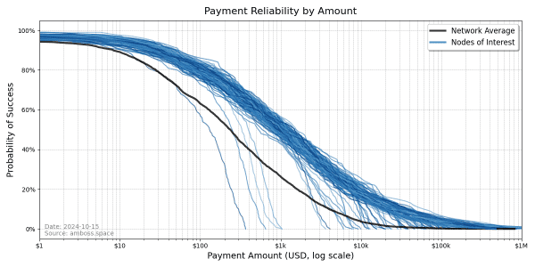
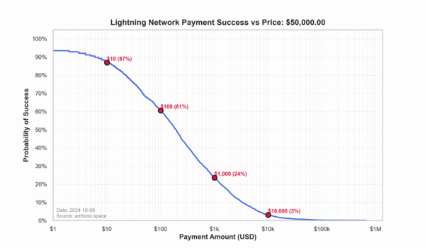

> *作者：Jesse Shrader*
> 
> *来源：<https://bitcoinmagazine.com/technical/the-metric-that-matters-for-the-lightning-network>*

闪电网络是比特币的革命性扩容方案，带来了快速且便宜的支付，让日常使用比特币支付成为可能。随着网络扩大，准确地度量其健康和效率、确保发挥其全部潜能，就成为绕不开的课题。

传统的指标，比如节点数量、通道数量、以及已经投入用于访问闪电网络的容量（通道容量总和），有其意义，但不能呈现全貌。为了真正理解这一二层解决方案的性能，我们需要关注流量 —— 尤其是 “最大流量（Max Flow）”，这是一个在复杂系统的优化上历史悠久的指标。

## 最大流量：理解闪电网络健康的关键

最大流量是一个强大的指标，它计算理论上有多少价值能够通过一个网络，给定通道容量和流动性的限制。它也是估计网络的效率和可靠性的核心工具，尤其对于平滑无障碍流动是其成功关键的系统。

最大流量指标在电信、物流等行业里已经使用了数十年。它已经被用来解决这些行业的问题：

- 电信网络：最大流量指标帮助高效分配带宽，保证数据可以平滑地穿过互联网。
- 供应链：企业们使用最大流量算法来优化商品在他们的全球分发网络中的移动，以减少延迟、尽可能提高效率。
- 物流系统：城市应用最大流量概念来管理交通，通过优化路口之间的流量，确保车辆会顺利经过道路网络。

这些案例展示了最大流量概念如何在复杂系统 —— 资源需要快速且高效地通过的系统 —— 中提高效率。现在，<a href="https://github.com/renepickhardt/Lightning-Network-Limitations/blob/paper/Limits of two party channels/paper/a mathematical theory of payment channel networks.pdf">来自 René Pickhardt 的最新数据科学研究</a>，讨论闪电支付成功率，也将这一概念应用到闪电网络上。紧跟最大流量概念，可以帮助我们保证比特币会在用户间平滑流动，即使网络自身在扩大。

最大流量概念不是要度量真实的价值流动，而是要理解支付通过闪电网络的可行概率。在关注最大流量时，我们会对闪电网络的真实健康度形成更准确的理解。它不是单纯统计通道和容量，而是展示支付成功的概率，让节点营运者可以改善自己的流动性分布并提高网络的整体性能。

- 传统指标有缺点 -

节点数量、通道数量、容量总和这样的指标，只能提供对闪电网络基础设施的一个快照。但就像统计一个城市中的道路和路口的数量一样，这些数字无法告诉我们车流是如何流动的。换到闪电网络中，真正重要的是比特币在整个系统中路由的效率。

只关注传统指标的城市，常常会得出对路网效率的片面结论。虽然了解基础设施的体量也有意义，但理解支付成功的概率要有意义得多。

最大流量概念提供了更深入的洞见。通过度量支付成功的概率，它帮助我们看到哪里的流动性已充分分布、哪里会面临瓶颈。这让运营者可以作出基于数据的决策，并提高网络的性能、保证支付得到可靠的路由。

## 最大流量证明了闪电网络的性能会随比特币价格而提升

闪电网络被设计成给比特币网络扩大吞吐量，提供快速且便宜的交易传递，而不要增加比特币区块链的负担。随着比特币价格的上升，闪电网络处理更大额支付的能力也会自然上升。

比如说，如果一条通道持有 0.1 BTC，而比特币的价格是 5 万美元，那么这条通道（最多）可以路由一笔 5000 美元的支付。但如果比特币的价格到了 10 万美元，那么同一条通道就能处理 1 万美元的支付，而且不需要改变其背后的基础设施。随着比特币电子经济体的扩大，闪电网络的容量也会扩大。比特币价格的提升叠加对闪电网络内的数据驱动型优化，可以帮助扩大闪电网络的容量。

在这里，最大流量扮演了一个关键角色。它提供了最根本的工具来监控支付的可靠性，并确保网络会随着对比特币交易的需求增加而保持高效。

- 最大流量统计是闪电网络监控的未来 -

最大流量是下一代的指标，可以推动闪电网络发展。它超越了通道容量和节点数量这样的肤浅指标，为节点运营者和投资者提供了关于闪电网络性能的更准确图像。这反过来又会帮助运营者和投资者更明智地调配流动性和路由支付。

对投资者来说，最大流量是网络健康度的更可靠度量，因为它反应了闪电网络的潜能。关注最大流量的人会得到对闪电网络可扩展性和效率的更深洞见，让自己处于更能捕获未来增长所带来的收益的位置。

对节点运营者来说，理解最大流量指标可以帮助他们优化通道、获得更好的表现。首先是更加高效地管理流动性、保证更可靠的支付流，然后就能提升闪电网络用户的体验。

## 结论：最大流量是关键

随着闪电网络成长，最大流量会变成反映其健康和性能的关键。传统的指标，比如节点统计和通道容量统计，只提供了片面的视角，而最大流量反映了价值流过这个系统的效率 —— 随着比特币成长、对可靠支付的需求增加，这会成为一种关键洞见。

最大流量不只是度量网络的一种新方法 —— 它是解锁闪电网络全部潜能的钥匙。通过关注更好的指标，节点运营者和投资者可以帮助网络更聪明地扩大，也就是保证比特币在全球经济中的影响持续显现。

**摘要**

1. 传统的指标，比如节点数量、通道数量、容量总和，并没有提供对闪电网络性能的全方位解读。
2. 最大流量是衡量网络健康度的正确指标，因为它会评估可行支付的概率。
3. 随着比特币价格上涨，闪电网络处理更大额支付的能力会自然增加，而最大流量概念可以帮助监控这个过程。
4. 在电信、供应链和物流等行业中，最大流量概念已经证明了其在复杂系统优化上的价值。
5. 最大流量指标，将在帮助闪电网络高效扩容的过程中扮演关键角色；所以，它是投资者和节点运营者的一个必备工具。

（完）