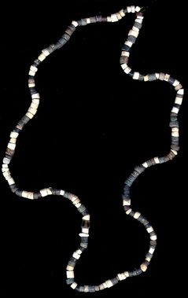
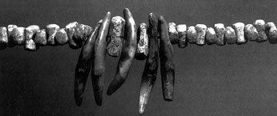
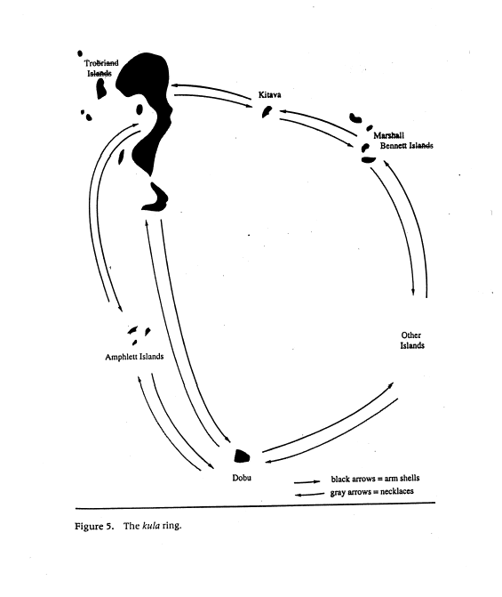
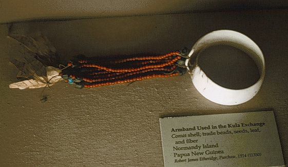
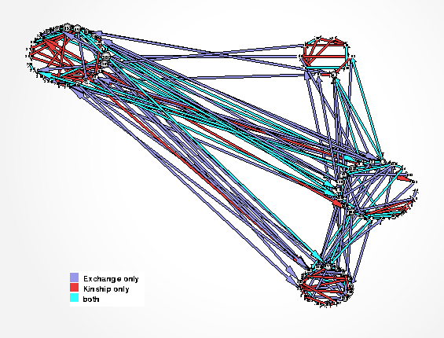
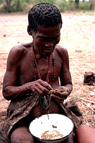

*作者：Nick Szabo*

*来源：<https://nakamotoinstitute.org/shelling-out/>*

*译者：阿剑（hongji@ethfans.org）*

## 摘要

货币的前身，连同语言，帮助早期的现代人种解决了其它动物所不能解决的协作问题，其中就包括如何实现互惠互利、亲属利他以及减少攻击性的问题。这些货币先祖与非法定货币同样具有非常具体的特征 —— 绝不仅仅是象征性物品或装饰品。

## 货币

英格兰在 17 世纪殖民美洲之时，在一开始便遇上了一个麻烦 —— 金属货币短缺 [[D94]](#D94) [[T01]](#T01)。英国的想法是利用美洲种植大量烟草、为他们的全球海军以及商船队提供木材，然后，换回为保证美洲土地保持生产所必须的补给品。实际上，早期的殖民者被指望着既为公司工作，也在公司的商店里消费。投资者和英国王室都希望如此，而不是按某些农民可能提出的那样，给农民支付金属货币、让他们自主备办补给并给自己留下一点，嗯，该下地狱的利润。

别的办法也有，而且就在殖民者眼皮底下，但他们用了好几年才发现这一点 —— 原住民有自己的货币，只不过与欧洲人素所使用的货币大为不同。美洲的印第安人使用货币已有上千年历史，而且事实证明这些货币对初来乍到的欧洲人非常有用 —— 就除了那些怀着 “印着大人物头像才是真钱” 偏见的人。最糟糕的是，这些新英格兰地区的原住民既不用金，也不用银，他们用的是生活环境中可见到的最合适的材料 —— 猎物骨头中可长期保存的部分。具体一点来说就是用 venus mercenaria 等硬壳蚌类的壳做成的串珠（wampum），串成项坠。

- 串珠项链。交易过程中，人们会点出珠子的数目、取出来并串到新项链上。美洲原住民的串珠有时候也会被串成腰带或其它有纪念或仪式意义的东西，表明财富或者对一些条约的承诺。-

这些蚌类在大海里才能找到，但这些串珠却远播内陆。美洲大陆的各个部落中都可以找到各种各样的贝壳货币。易洛魁人（Iriquois）从未到蚌类栖息地去搞过事情，他们所收集到的串珠财宝却冠于所有部落 [[D94]](#D94) 。只有少数几个部落，比如 Narragansett 人，才精于制造串珠，但几百个部落（大多都是 狩猎-采集 部落）都以串珠为货币。串珠项链的长度有很大差别，而串珠的数量与项链长度成比例。项链也总可以剪断或串联形成与商品价格相应的长度。

一旦殖民者们克服了他们对货币价值来源的疑惑，他们也开始疯狂买卖串珠。蚌类在美洲行话中也变成了 “钱” 的另一种表达。新阿姆斯特丹（即今所谓的 “纽约”）的荷兰州长向 English-American bank 借了一大笔钱 —— 借出来的是串珠。后来，英国当局被迫同意了，所以在 1637 到 1661 年间，串珠变成了新英格兰的合法偿债工具，殖民者也有了一种高流动性的交易媒介，殖民地的贸易也因此繁荣起来 [[D94]](#D94) 。

但随着英国开始运送更多金属货币到美洲、欧洲人开始使用他们的大规模制造技术，贝壳货币也逐步走向衰落。到了 1661 年，英国当局已经认输，同意用王国的金属货币来支付 —— 也就是黄金和白银，那一年，贝壳串珠被废止作为新英格兰的法定偿债工具。

但在 1710 年，串珠又被北卡罗莱纳作为法定偿债工具，它也就一直被用作交易媒介，甚至持续到 20 世纪；但由于西方的收割和制造技术，串珠的价值上升了一百倍，随后，因为金属货币时代的到来，它也步黄金和白银珠宝在西方的后尘，从精心打制的货币逐渐变成了装饰品。在美国人的语言中，贝壳货币也变成了奇怪的老词儿 —— 毕竟 “100 个贝壳” 已经变成了 “100 dollar”。“Shelling out” 变成了用金属货币或钞票来支付，现在又变成了用支票或信用卡 [[D94]](#D94) 。（译者注：Shell 就是贝壳的意思，即 “shelling out” 一开始是付出贝壳）

我们也没意识到，这已经触及到了我们这个物种的起源。

## 收藏品

除了贝壳，美洲大陆上的货币还有过许多形式。毛发、牙齿和大量其它东西都被广泛用作交易媒介（它们的共有属性我们会在后文讨论）。

12000 年以前，在今华盛顿州所在地，克洛维斯人（Clovis）制作出了一些令人惊叹的长形燧石刀片。唯一的问题是这些刀片太容易断裂 —— 也就是说根本不能用来切东西，这些燧石 “完全是为了娱乐” 而制作的，或者说是为了某些与切削东西完全无关的目的 [[G01]](#G01)。

在后文中我们会看到，这种表面上的轻浮，非常有可能，在他们的生存中扮演着实际上非常重要的角色。

美洲土著并不是第一群做出好看而无用的燧石器件的人，也不是第一群发明了贝壳货币的人；有必要加一句，欧洲人也不是，虽然他们以往也曾大量使用贝壳和牙齿作为货币 —— 更不用说牛、金子、银、武器和其它东西了。亚洲人用过所有这些东西，还有政府发行的假斧头（译者注：应指 “刀币”），但他们也引进过这种工具（贝壳）。考古学家已经发现了可追溯到旧石器时代（Paleolithic）早期的贝壳项链 —— 简直可以轻易替代美洲原住民所用的货币。

- 用海螺 Nassarius kraussianus 的贝壳制作的豌豆大小的串珠。这些海螺生活在入海口。发现自 Blombos 洞穴，南非。年代距今 75, 000 年前。<a href="BO4">[B04]</a> -

在 1990 年代晚期，考古学家 Stanley Ambrose 发现，在肯尼亚大裂谷的一座石头掩体中，藏着一些用鸵鸟蛋壳和贝壳碎片制成的项链。他们用（40Ar/42Ar）的氩测年法，将项链的年代确定为至少 4 万年前 [[A98]](#A98)。在西班牙发现的动物牙齿串珠也可以被追溯到这个年代 [[W95]](#W95)。在黎巴嫩（Lebanon）也发现了位于旧石器时代早期的穿孔贝壳 [[G95]](#G95)。最近，（预备作为串珠）的完整贝壳，在南非的 Blombos 洞穴被发现，可以推前到距今 7 万 5 千年前！[[B04]](#B04)

- 鸵鸟蛋壳串珠，发现于肯尼亚的东非大裂谷。距今 4 万年前。（感谢 Stanley Ambrose）-

这些人类的现代亚种迁移到了欧洲，而贝壳项链和牙齿也就出现在了那里，距今 4 万年前。贝壳和牙齿项链在距今 3 万以前出现在了澳大利亚 [[M93]](#M93)。在所有案例中，制作工作都极富技巧，暗示了此类实践还可被追溯到考古工作所揭示的更早以前。收藏品和装饰品的起源极有可能在非洲，即解剖意义上现代人种的起源地。收集和制作项链必然有某种极为重要的生存优势，因为它们都很奢侈——制造这些项链既需要大量技巧，也需要时间，而那时候人类还长期挣扎在饥饿边缘 [[C94]](#C94)。

基本上，所有人类文化，甚至那些没有参与大规模贸易或使用形式上更为现代的货币的文化，都制作、欣赏珠宝以及那些艺术或传承价值远胜于实用性的东西。我们人类收集贝壳项链和其它形式的珠宝 —— 只是为了愉悦。对于演化心理学家来说，所谓 “人类做某事只是为了愉悦” 根本就不是一个解释，而只是提出了一个问题。为什么那么多人会觉得收藏品和珠宝的光泽令人愉悦？更直白一点，问题是 —— 这种愉悦给了人类怎样的演化优势？

- 俄罗斯 Sungir 的一处墓穴里发现的项链，距今 28,000 年。是内部互锁并且可互换的串珠。每一颗猛犸象牙串珠可能都要一两个小时的劳动来制造 <a href="#W97">[W97]</a>。-

## 演化、合作与收藏品

演化心理学源自 John Maynard Smith [[D98]](#D98) 的一项关键的数学发现。Smith 借用共同演化基因（co-evolving gene）的种群模型（该模型来自已经充分发展的群体遗传学（Population Genetics）领域），指出基因可以对应行为策略，即在简单的策略问题（即博弈论意义上的 “游戏”）中编码好的或坏的策略。

Smith 证明了竞争环境可表达为策略问题，而这些基因要在竞争中胜出才能遗传到后续的世代中，因此基因会演化出相关策略问题的[纳什均衡](http://web.archive.org/web/20021028220635/http://www.chass.utoronto.ca/~osborne/2x3/tutorial/SGAME.HTM)。这些竞争游戏包括了[囚徒困境](http://www.chass.utoronto.ca/~osborne/2x3/tutorial/SGAME.HTM)（即合作博弈问题的典型）以及[鹰/鸽策略问题](http://web.archive.org/web/20020828234922/http://www.ucl.ac.uk/~ucbhdjm/courses/b242/Tuts/Tut2-02.html)（即进攻性策略问题的典型）。

Smith 的理论的关键在于：这些策略游戏，虽然看起来是在体型上展开的，在根本意义上乃是在基因间展开的——即基因的传播竞争。是基因（而不必然是个体）影响了行为，表现出似乎具备有限理性（在生物体形可以表达的范围内，编码出尽可能优的策略，当然生物形体也受到了生物学原材料和此前演化历史的影响）以及 “自私”（借用理查德·道金斯的比喻）的样子。基因对行为的影响乃是一种适应，对基因通过体形来开展的竞争的适应。Smith 把这些不断演化的纳什均衡称为 “[演化稳定策略](http://www.ucl.ac.uk/~ucbhdjm/courses/b242/Tuts/Tut2-02.html)”。

那些建立在早期个体选择理论中的 “经典理论”，比如性选择和亲选择理论，被溶解在了这种更普遍的模型中，它颠覆性地将基因而非个体置于演化理论的中心。因此道金斯用了一个经常被误解的类比 ——“自私的基因”—— 来描述 Smith 的理论。

**很少有其它物种在协作性上超过哪怕是旧石器时代的人类**。在一些案例中，比如蚂蚁、白蚁和蜜蜂等物种的孵化和殖民行为中，动物可以在亲属间展开合作 —— 就是因为这样可以帮助复制它们与亲属都具有的 “自私基因”。在一些非常极端的情境中，非亲属之间也可以有合作，演化心理学家称之为 “互惠互利主义”。正如道金斯所描述的那样[[D98]](#D98)，**除非交易是双方同时付出的，交易中的某一方就可以作弊（有时甚至即时交易也难以避免欺诈）**。而且如果可以欺诈他们通常都会这样做。这就是博弈论专家称作 “囚徒困境” 的游戏中通常会出现的结果 —— 如果各方都合作，那么每一方都可以得到更好的结果，但如果某一方选择欺诈，他就可以出卖别的傻瓜而自己获利。在一个欺骗者和傻瓜组成的种群中，欺骗者总能赢（因此很难开展合作）。但是，一些动物会通过重复的博弈以及一种叫做 “以牙还牙” 的策略实现合作：在博弈的第一轮选择合作，此后始终选择合作，直到对手选择欺诈，然后选择欺诈来保护自己。这种来自于报复的威胁会让双方继续合作。

但总的来说，在动物世界中，个体间在事实上发生合作的情形是非常局限的。**这种合作的一大主要局限就在于合作双方的关系：其中至少有一方是或多或少被迫靠近其它参与方的。最常见的情形就是寄生虫和宿主演化成共生体**。如果寄生虫和宿主的利益一致，那么共生就会比各行其是更合适（即寄生虫也会给宿主提供一些好处）；那么，如果他们成功进入了一个以牙还牙的博弈，他们就会演化成共生体，在这种状态下，他们的利益，尤其是从一个世代到下一个世代的基因退出机制，是一致的。他们会变成单个有机体那样。但是，实际上两者之间不仅有合作，还有剥削，而且还是同时发生的。这种情形很像人类发展出来的另一种制度 —— 进贡 —— 我们会在后文分析。

**还有一些不涉及寄生虫和宿主、但也分享同一个身体并且成为共生体的非常特别的例子**。这些例子涉及到的是非亲缘的动物，还有非常有限的领地空间。道金斯所举的一个漂亮的例子是清洁工小鱼，这些小鱼会在宿主口中游弋，吞吃其中的细菌，维护宿主鱼的健康。宿主鱼可以欺骗这些小鱼 —— 可以等他们做完工作之后再一口吞掉他们。但宿主鱼没有这么做。因为双方都是不断移动的，任何一方都可以自由离开这种关系。不过，清洁工小鱼演化出了一种非常强的领土意识，还有难以模仿的条纹和舞蹈 —— 很像难以伪造的商标。因此，宿主鱼知道要到哪里去找清洁服务 —— 而且他们知道如果自己欺骗了小鱼，就不得不去找一群新的小鱼了。这种共生关系的进入成本是很高的（因此退出成本也很高），所以双方能愉快合作而没有欺诈。此外，清洁工小鱼也非常小，所以吃掉它们所得的好处还比不上一小群鱼的清洁服务。

还有一个高度相关的例子是吸血蝙蝠（vampire bat）。名副其实，这种蝙蝠会吸哺乳动物的血。有意思的地方在于，能不能吸上血是非常难以预测的，有时候可以大快朵颐，有时候啥也没得吃。因此，幸运的（或者说更老到的）蝙蝠会跟那些不那么好运（机灵）的蝙蝠分享猎物：施者会把血吐出来，受者会感激地吃掉它。

大部分情况下，施者和受者都有亲缘关系。在忍耐力超强的生物学家 G.S. Wilkinson 观察到的 110 个此类例子中，77 个都是母亲哺育小孩，而大部分其它例子都涉及到基因上的亲缘。但是，仍有少数例子不能通过亲缘利他主义来解释。为了解释这部分互惠主义的例子，Wilkinson 将来自两个群体的蝙蝠混合在一起组成了一个种群。随后他观察到，除了极少数例外，蝙蝠一般都只照顾它们旧团体中的老朋友 [[D98]](#D98)。

这种合作需要建立长期关系，也就是伙伴们要频繁互动、了解对方，而且要跟踪对方的行为。洞穴有助于将蝙蝠限制在长期关系中，这样的合作才有可能形成。

**我们还会了解到，一些人类也像吸血蝙蝠一样，选择了高风险且不稳定的收成形式，而他们也会给没有亲缘关系的人分享生产活动的剩余**。实际上，他们在这方面的成就远远超过吸血蝙蝠，而他们如何达成的这些成就正是我们这篇文章的主题。道金斯说，“货币是一种延迟互惠利他的正式标记”，但随后他就不再推进这种迷人的观念了。这就是我们这篇文章的任务。

在小型的人类群体中，公开的声誉可以代替来自单个个体的报复，推动人们用滞后的交换达成合作。然而，声誉系统可能遭遇两类比较大的问题 —— 难以确认谁做了什么，以及难以评估行动所造成的价值或破坏。

记忆面孔和以及对应的恩惠是一种不小的认知障碍，但也是大多数人类发现相对易于克服的障碍。辨认面孔比较容易，但在需要的时候回忆起曾发生过一次帮助可能会更难。记住一场恩惠中给受助者带来一定价值的细节，就更难了。避免争论和误解是不可能的，或者说可以困难到让此类帮助无法发生。

**评估问题，或者说[价值计量](http://szabo.best.vwh.net/measuringvalue.html)问题是非常广泛的**。对人类来说，在任何交易系统中都存在这个问题 —— 无论是人情往来、物物交换、货币、信用、雇佣，还是市场交易。在勒索、征税、进贡乃至司法处罚中，这个问题也很重要。甚至，在动物的互惠利他主义中，这问题尤为重要。想象一下猴子之间的相互帮助 —— 比如用一片水果来换取背部抓痒。互相理毛可以驱除自己不能看到或抓到的虱子和跳蚤。但是，多少次理毛对应多少片水果才能让将以双方都觉得 “公平” 而不是敲竹杠呢？20 分钟的理毛服务价值一片还是两片水果？多大的一片？

**哪怕是最简单的 “以血换血” 的交易，都比看上去要更复杂**。蝙蝠要如何估计它所收到的血的价值呢？根据重量、体积、口味和饱腹感吗？还是其它因素？这种计量上的复杂性，在猴子的 “你挠我的背，我帮你挠” 的交易中也完全一模一样地存在。

虽然存在很多潜在的交易机会，但动物们难以解决价值计量的问题。即便是最简单的、记住面孔并将它与恩惠历史匹配起来的模式中，如何让各方在一开始都对恩惠的价值有足够精度的共识，也是动物们要发展出互惠主义的一个重要障碍。

**但是，那些旧石器时代的人类遗留下来的石头工具箱，对我们的大脑来说似乎都有点太复杂了**。（译者注：就是说，如果对现代人的大脑来说都是那么地复杂，旧石器时代的人类到底是用什么样的合作形式制造出这些东西的，又是为了干什么呢？）

要追踪与这些石头相关的恩惠 —— 谁，为谁，制造了什么质量的工具，以及谁欠了谁什么，等等 —— 要是跨过了部落的边界可能会变得非常复杂。此外，可能还有大量的有机物和一时的服务（比如美容）等等，都没有留存下来。即便只是将这些被交易的物品和服务中的一小部分记在脑子里，随着数量的增加，也会使人与事的对应变得越来越难直至不可能。如果合作还在部落之间发生了，如考古记录所暗示地那样发生了，那么问题就变得更难了，因为 狩猎-采集 部落通常都高度敌对、互不信任。

如果贝壳可以是货币，皮草可以是货币，黄金也可以是货币，等等 —— 如果货币不仅仅是硬币和政府在法定货币法下发行的票据，而可以是很多不同的东西 —— 那么货币的本质是什么呢？

而且，为什么人类，还经常处于饥饿边缘的那种，会花费那么多时间来制造、欣赏那些项链呢，他们本可以用这些时间来狩猎和采集的呀？

19 世纪的经济学家卡尔·门格尔（Carl Menger）[[M1892]](M1892) 首次描述了货币是如何自然演化出来的，而且会从大量的以物换物交易中不可阻挡地出现。现代经济学所讲的故事类似于门格尔的版本。

以物换物需要交易双方兴趣的巧合。Alice 种了一些胡桃，需要一些苹果；Bob 恰好种了苹果，想吃胡桃。而且他们还恰好住得近，而且 Alice 也信任 Bob，愿意在胡桃收成期到苹果收成期之间安静等待。假设所有这些条件都能满足，那以物换物就没啥问题。但如果 Alice 种的是橙子，即使 Bob 也想要橙子，那也没戏了 —— 橙子跟苹果不可能在同一种气候下生长。如果 Alice 和 Bob 并不信任彼此，又无法找到一个第三方来当中介 [[L94]](#L94) 或强制执行合约，那他们的愿望就都得落空了。

还可能存在更复杂的情况。Alice 和 Bob 不能完全兑现在未来卖出胡桃或苹果的承诺，因为，还有其它可能性，Alice 可以把最好的胡桃留给她自己，把次品卖给对方（Bob 也可以这么做）。比较质量（quality）、比较两种不同东西的质量，比起上述问题来还要更难，尤其是其中一种东西已经成了记忆。还有，两人都无法预测比如歉收这样的事件。这些复杂性大大增加了 Alice 和 Bob 所处理问题的难度，让他们更难确认，滞后的互惠交易是不是真的能达到互惠效果。**初始交易与回报交易的时间间隔越长、不确定性约大，此类复杂性也就越大**。

还有一个相关的问题（工程师们可能会意识到），物物交换 “无法扩展（doesn't scale）”。商品量很少的时候，物物交换还能行，但它的成本会随体量上升而逐步上升，直至昂贵到根本不值得去做这样的交换。假设有 N 种商品和服务，那么一个物物交换的市场上要有 N2 种价格。5 种商品就会有 25 种相对价格，还行；但 500 种商品就会出现 25 万种价格，远远超过了一个人可以跟踪价格的实际能力。但有了货币，就只需要 N 个价格 —— 500 种商品就是 500 种价格。在用于这个场景时，货币既扮演交换媒介，又是价值尺度（standard of value）—— 只要货币自身的价格不会大到记不下来或变动过于频繁。（后面这个问题，加上隐性的保险 “合约”，再加上缺乏竞争市场，也许可以解释为什么价格通常都是长期演化出来的，而不是以近期谈判来决定的。）

**换句话来说，以物换物需要供给（或者说技能）、偏好、时间、低交易费用的巧合**。这种模式的交易费用增长会远远快于商品种类的增长。物物交换当然好于完全不交易，也曾广泛出现过。但与使用货币的贸易相比，<strike>它就是个弟弟</strike> 它还是相当局限的。

在大规模的贸易网络出现以前，原始货币存在了很长时间。**货币在此前还有一项甚至更重要的用途。通过大大减少了对信贷的需求，货币大大改善了小型物物交换网络的效率**。偏好的完全巧合大大少于跨期的偏好巧合。有了货币，Alice 可以在本月蓝莓成熟时为 Bob 采集，而 Bob 可以在 6 个月后大型动物迁徙时为 Alice 狩猎，而无需谨记着谁欠了谁多少东西，也不需要信任对方的记忆和诚信度。一个母亲为育儿做的重大投资可以由赠送不可伪造的有价物品来保护。而且货币也将劳动分工问题从囚徒困境转化为简单交换。

狩猎-采集 部落所用的原始货币在外观上迥异于现代货币，与现代货币在现代文化中扮演的角色也不同；原始货币可能有些功能仅限于在小型的交易网络和本地机构中行使（我们会在后文讨论）。因此，我认为把它们叫成 “收藏品” 而非 “货币” 要更加合适。在人类学文献中，对此类物品的称呼也是 “货币”；这个定义比政府所发行的纸币以及金属货币要更广泛，但比我们在本文中所用的 “收藏品” 或更模糊的 “有价之物” 要更为狭窄（有价之物会用来指代那些在本文意义上并非收藏品的东西）。

选择 “收藏品” 而非其它术语来指代原始货币的理由会在下文逐渐显现。收藏品有非常具体的[属性](https://nakamotoinstitute.org/shelling-out/#attributes-of-collectibles)，绝不仅仅是装饰。**虽然收藏的具体物品和有价属性在不同文化中有所区别，但绝不是任意选定的。收藏品的首要功能，也是其在演化中的终极功能，就是作为储存和转移财富的媒介**。一些类型的收藏品，比如项链，非常适合用作货币，连我们（生活在一个经济和社会条件鼓励贸易的现代社会中的人）也能够理解。我也偶尔会用 “原始货币” 来替代 “收藏品”，讨论金属货币时代以前的财富转移。

## 贸易之所得

个人、氏族和部落自愿开展贸易，因为贸易双方皆认为自己有所得。他们的价值判断可能会在贸易后改变，比如他们因贸易而得到了对商品和服务的经验（因此改变了评判标准）。但是，在交易当时，他们的价值判断也许不能与交易物的价值准确相称，但在交易是否有利的判断上大体是不会错的。尤其是在早期的部落间贸易中，由于交易物仅限于高价值物品，各方都有强烈的激励要让自己的判断变得准确。因此，贸易几乎总是能够惠及各方。在价值创造上，贸易活动与生产制造等物理活动相比毫不逊色。

因为个人、氏族和部落的偏好各不相同，满足自己偏好的能力、对自身技能和偏好及其成果的认知也各不相同，所以他们总是能够从贸易中有所收获。至于开展贸易本身所需的费用 —— 即交易费用 —— 是不是低到让这些贸易值得开展，那就是另一个问题了。在我们这个时代，就有比以往大多数时代多得多的贸易可以发生。然而，我们下文将会谈到，某些类型的贸易一向值得人们付出交易费用，对于某些文化来说，此类交易甚至可以追溯到智人（homo sapiens sapiens）的起步阶段。

不是只有自愿的现货交易才能从更低的交易费用中受益。这一点对于理解货币的起源和演化来说至为关键。家庭的传家宝可以用作抵押品，消除跨期交易（delayed exchange）的信用风险。能从战败部落中收取贡品，对胜者部落来说是莫大的利好；而这种能力与贸易一样，也可以从同样的交易费用技术中获益；仲裁者评定违背风俗和法律的行为所造成的实际损害，乃至亲属团体安排婚姻，都是如此。在接受遗产时，若有可抵抗时间流逝且不依赖于他者的财富，亲属无疑会更加受益（Kin also benefited from timely and peaceful gifts of wealth by inheritance）。在现代文化中隔绝于商业世界的人类生活主要活动，从降低交易费用的技术中得到的好处丝毫不少于交易活动所得到的促进，甚至还更多。而这些技术，没有一项比原始货币 —— 收藏品 —— 更高效、更重要或者更早出现。

在智人取代尼安德特人（H. sapiens neanderthalis）之后，人类数量随后激增。欧洲的出土物，距今 3 万 5 千年至 4 万年前的文物，显示智人比之尼安德特人将环境承载力提高了 10 倍 —— 即人口密度提高了 10 倍 [[C94]](#C94)。不仅如此，新来者还有时间创造世界上最早的艺术 —— 比如漂亮的岩洞壁画、多样的精美雕塑品 —— 当然还有由贝壳、牙齿和蛋壳串成的项链。

这些物件不是无用的装饰。新式而高效的财富转移方式，正是由这些收藏品以及可能更高级的进步和语言带来的；如此创造出的新型文化工具，有可能在环境承载力的提升中扮演了重要的角色。

作为新来者，智人的脑容量与尼安德特人相当，骨骼更软，肌肉也没那么结实。他们的狩猎工具更加精巧，但在 3 万 5 千年前，工具基本上都差不多 —— 甚至连两倍效率都没有，更别说 10 倍了。最大的区别可能就是由收藏品创造出来乃至提高了其效率的财富转移工具。智人从收集贝壳并使用它们打造珠宝、展示珠宝乃至相互贸易中得到了愉悦。尼安德特人则没有。也许正是因为同样的机制，智人于几万年前在人类演化的漩涡中生存了下来，并出现在非洲的 Serengeti 平原。

我们应该按类型讲讲收藏品是如何降低交易费用的 —— 从自愿免费的遗赠，到自愿的相互贸易和婚姻，再到非自愿的司法判决和贡品。

所有类型的价值转移都曾经在许多史前文化中出现过，可能可以追溯到智人的起步阶段。一方或多方从人生大事的财富转移中得到的好处，大到可以无视高昂的交易费用。与现代货币相比，原始货币的流转速度非常低 —— 在一个普通人的一生中，可能只转手过寥寥几次。然而，一件可以长期保存的收藏品，也就是我们今天所谓的 “传家宝”，可以完好无损几代人之久，而且在每一次转手中都增加可观的价值 —— 通常可以让原本不能发生的交易成为可能。部落因此会花费大量时间在看起来没有意义的制造工作和探索合用的新材料的工作上。

## 库拉圈

- 前殖民时代，美拉尼西亚群岛上的 Kula（库拉）贸易网络。Kula 既是 “非常强大” 的货币，又是故事和传说的纪念物。可以相互贸易的商品（大多数都是农产品）分布在不同季节，因此物物交换是行不通的。库拉收藏品具有无可伪造的贵重价值，而且可以穿戴、可以流转；作为一种货币，它解决了需求的双重巧合问题。因为能解决这个问题，一枚手镯或一串项链，可以在几次贸易之后就获得比其制造成本更高的价值，而且能持续流转数十年。关于收藏品上一个主人的传说和故事，进一步提供了上游信贷和流动性的信息。在新石器时代的文化中，流通用收藏品（通常是贝壳）的形态往往更不规则，但目的和属性都是类似的。<a href="L94">[L94]</a>  -

- 库拉手环（mwali） -

- 库拉项链（bagi） -

对于任何一种将财富转移作为其主要职能的工具，我们都可以追问如下问题：

1. 两个事件（即所交易物品的出产与其应用）在时间间隔上必须满足某种巧合吗？巧合发生的不可能性会给财富转移带来多大的障碍？
2. 财富的转移可以只基于该工具形成一个收藏品的循环吗，还是说必需其它工具才能形成完整的循环？认真地研究货币流转的实际图景，对于理解货币的诞生来说至关重要。对大部分人类史前史来说，覆盖大量不同交易的货币流转不存在，也不可能存在。没有完整和重复的循环，收藏品就流转不起来，也会变得没有价值。一项收藏品，必须能够媒介足够多的交易来摊销其制造成本，这样才值得制造它。

我们首先来研究今日我们最熟悉、在经济上也最重要的一种财富转移 —— 贸易。

## 饥饿保险

Bruce Winterhalder [[W98]](#W98) 观察到了动物之间偶尔出现的食物转移模式：被容忍的窃贼、生产/乞讨/机会主义、风险敏感型生存状况、作为副产品的互惠、事后报答、非现货交换以及其它模式（包括亲属利他主义）。在这里，我们只看风险敏感型生存状况、延迟互惠以及非现货交易。我们所主张的是，用 食物-收藏品 的相互交易来替代事后报答（delayed reciprocity），可以提升食物共享的程度。这样做可以降低变动的食物供给所带来的风险，同时避免在团体（band）之间使用延迟互惠模式所无法克服的大部分问题。我们后面将在一个更大的背景下处理亲属利他以及窃贼问题（无论有没有被宽恕）。

食物对饥饿者的价值比对饱食者的价值更高。如果一个饥馑绝望的人可以用他最有价值的东西来拯救自己的生命，为那件宝物花掉的几个月劳动不也算物有所值吗。人通常会认为自己的生命比那件传家宝更有价值。那么，收藏品就像脂肪，提供了对抗食物短缺的保险。本地的粮食短缺所造成的饥荒可以通过至少两种方式来补救 —— 食物本身、觅食和狩猎的权利。

然而，交易费用一般来说都太高了 —— 群体之间更常见的是战争而非互信。找不到食物的群体经常会挨饿。但是，如果可以通过降低群体间相互信任的需要来降低交易费用，对一个群体来说只值一天劳动的食物，对饥饿部落来说也许价值几个月的劳动（而他们就可以相互交易）。

正如本文所说，小范围内可以实现、同时最有价值的交易，是在旧石器时代晚期，随着收藏品的出现而在许多文化中出现的。收藏品替代了要不然就必须有（但实际上并不存在）的长期互信关系。如果部落间或者不同部落的个体间已经存在长期的互动和互信，他们之间的信用发放无需担保，那就会大大刺激跨期的物物交换。**然而，这样的高度互信是让人无法想象的——就因为上面提到的关于互惠利他模式的问题，而且这些理论也都被经验证据证实了：大多数我们观察到的 狩猎-采集 部落之间的关系都是非常紧张的**。在一年中的大部分时间里，狩猎-采集 部落都会分散成小团体，偶尔汇成 “aggregates”，就像中世纪的集会一样，一年只有几周。虽然团体间没有信任，一项重要的产品贸易，如附图所展示的这种类型，几乎可以肯定发生在欧洲和几乎所以地方，比如美洲和非洲的大型猎物狩猎部落。

附图所演示的这种情景完全是理论上的，但如果实情不是如此，那反而会让人非常惊讶。虽然旧石器时代的许多欧洲人类都喜欢穿戴贝壳项链，许多生活在更内陆地区的人类会使用他们的牙齿而非贝壳来制作项链。燧石、斧头、毛皮和其他收藏品也非常有可能用作交易媒介。

驯鹿、野牛和其它猎物在一年的不同时间里迁徙。不同的部落擅长猎取不同的猎物，在欧洲旧石器时代的遗骸中，超过 90% 甚至 99% 的遗留物，都来自同一物种 [[C94]](#C94)。**这种情形暗示了至少在一个部落中存在季节性的分工，甚至存在一个部落对应一种猎物的完全分工**。要达成这样的分工程度，单个部落的成员不得不变成猎物专家，熟知那种猎物的行为、迁徙习惯以及其它行为模式，此外还得了解用于捕杀猎物的专业化工具和技术。近世我们观察到的一些部落是有分工的。一些北美的印第安人部落专门猎杀野牛、羚羊，也捕鲑鱼。在北俄罗斯和芬兰部分地区，许多部落，包括拉普人（Lapp），甚至直到今天，都只放牧一种驯鹿。

不怕人类的大型野生动物已经不复存在了。在旧石器时代，它们要么被推向灭绝，要么学会了害怕人类和人类的弹射类武器（projectile，此处指弓箭）。然而，在智人时代的大部分时候，野生动物群还是很多的，而且专业的猎人很容易抓到它们。根据我们的 贸易-生存 理论，分工程度在旧石器时代非常有可能更高，因为那时许多大型猎物（马、野牛、大麋鹿、驯鹿、大型树懒、mastadon、猛犸象、斑马、大象、河马、长颈鹿、麝牛，等等）成群结队漫游在北美、欧洲和非洲大陆。这种部落间的狩猎分工也与欧洲出土的旧石器时代考古证据相一致（虽然还不能说被可靠地证明了）。

这些迁徙的团体，跟随在猎物后面，经常有团体间的互动，由此创造了许多贸易机会。美洲的印第安人通过风干和制作干肉饼来保存食物，这种活动会持续几个月，但一般不会持续一整年。这种食物会与皮革、武器和收藏品相交换。通常来说这些交易都发生在一年一度的贸易活动中 [[T01]](#T01)。

**会迁徙的大群动物一年中只经过一片领地两次，而中间往往间隔一到两个月；要是没有别的蛋白质来源，这些专业化的部落就会饿死。只有贸易，才能让考古证据所反映的高度专业化成为可能**。因此，即便只能实现不同季节的肉类交换，那收藏品也值得一用。

那些项链、燧石以及其它用作货币的东西在一个封闭的环中往复循环，只要被交易的肉类数量大致相当，用于交易的收藏品数量也就大致相当。请注意，假设本文中建构的收藏品循环理论是对的，那么，只有单向有利的贸易就还不够。我们必须辨认出双向有利贸易的封闭循环，在这样的循环中收藏品不断地流通并摊薄其制造成本。

如上所述，我们从考古证据中知道，许多部落专精于猎杀单种大型动物。也就是说，狩猎者至少是按季节来猎杀不同动物的（部落内的季节分工）；如果存在广泛的贸易，那也可能是一个部落一年中也只猎杀一种猎物（部落间的完全分工）。虽然变成动物习性的专家、掌握最好的捕猎方法，一个部落可以获得巨大的生产利益，但如果要在一年中的大部分时候都一无所获，这种利益也是不可能实现的。

如果只在两个互补的部落间实现贸易，那么食物的总供给量可能差不多是两倍。但是，在 Serengeti 草原以及欧洲大草原，往往会有十多种动物（而非两种）经过。因此，对于一个专业化的部落来说，可以获得的肉类会因为贸易而超过两倍。更重要的是，额外的肉会在人们需要的时候出现。

因此，**即使是两种猎物以及两项不同期但互相补偿的交易所组成的最简单交易循环，也可以为参与者提供至少 4 种得益**（或者说 “盈余” 的来源）：

1. 在原本要挨饿的季节吃上肉；
2. 肉类总供给量的提升 —— 他们可以卖出自己眼下吃不掉也存不下来的肉类；毕竟不交易就只会被浪费掉；
3. 可以吃到不同的肉，带来营养多样性的提升；
4. 因为狩猎活动专业化获得更高的生产力。

制作或保存收藏品用于换取食物不是唯 一一 种对抗饥饿时节的保险措施。也许更常见的（尤其在那些无法猎取大型动物的地区），是领土上的可转让的狩猎权利。这一点可以从许多今日仅存的 狩猎-采集 文化中观察到。

非洲南部的  !Kung San 人，与现在所有残存的 狩猎-采集 文化一样，生活在边缘地带。他们没有机会成为专业狩猎者，而且必须利用仅有的贫瘠资源。可能他们因此不太像古代的 狩猎-采集 文化，也不像原始的智人（即从尼安德特人处夺取了最肥沃土地和最佳狩猎路线、很晚之后才把尼安德特人完全驱逐出边缘地区的人种）。但是，尽管他们生活在严苛的自然环境中，!Kung 人也将收藏品用于贸易。

与大多数 狩猎-采集 文化相似，!Kung 人在一年中的大部分时候的小而分散的团体，只有几周时间才会与几个别的团体汇集在一起。集会就像带有额外功能的市集 —— 实现贸易、巩固联盟、强化伙伴关系、买卖姻亲。集会的准备工作就是制造可交易的物品，一部分是实用的东西，但大部分都是收藏品性质的东西。这个交易系统，叫做 !Kung *hxaro*，涉及大量挂饰珠宝的贸易，包括鸵鸟蛋壳项链；而这些收藏品都非常类似于非洲四万年前的东西。

-  !Kung 人的邻居部落间的 <a href="http://www.mpi-fg-koeln.mpg.de/~lk/netvis/kunggenetic.html">hxaro 交易系统的模式和亲属关系</a> -

- 用于 haxro 交易的项链 -

!Kung 人用收藏品来买卖的一大物项是进入其它团体领土（并采集和狩猎）的抽象权利。在本地粮食稀缺时，这种交易尤为活跃，因为可借助在邻居的领土上觅食来缓解饥馑 [[W77]](#W77) [[W82]](#W82)。!Kung 人会用箭头来标示本团体的领土；没有购得进入和觅食的权利就擅自闯入，类同于宣战。就像团体间的食物贸易，用收藏品买入觅食权利也是一种 “对抗饥饿的保险措施”（借用 Stanley Ambrose 的话）[[A98]](#A98)。

虽然解剖学意义上的现代人都可以有意识地思考、说话并且具备一定的计划能力，**但产生贸易几乎不需要什么高妙的思维和语言能力，需要计划能力的部分就更少了**。因为部落成员并不需要推断出贸易之外的其它好处。要产生这种工具，只需人们遵循一种追求具备某种属性的物品的本能就够了（一如我们在准确评估这些属性的间接观察中所见到的）。**这一点也在不同程度上适用于我们要了解到的其它制度 —— 它们是演化出来的，而不是被有意识地设计出来的。没有哪个参与其中的人会用演化功能的角度来解释这些制度的作用；相反，他们会用许多不同的神话来解释这些行为，并且，神话更像是这些行为的直接激励措施，而不是关于其起源和终极目的的理论。**

食物贸易的直接证据早已湮灭在历史中，我们有可能在未来发现比现在更多的直接证据，通过比较现存的狩猎部落中一个部落中的狩猎模式与另一个部落中消费模式的比较 —— 最难的部分可能是辨识出不同部落或亲属团体的界限。根据我们的理论，这样的部落间肉类交换应该遍布于旧石器时代的大部分地区，那时候就出现了大规模的专业化狩猎活动。

现在，我们还有额外的间接证据，就是收藏品本身的转移。幸运的是，物件成为收藏品所需要的长期留存属性，与人工制品能够遗存至今被考古学家发现的属性，是同一种。

部落间关系的主流，在好的时候也是互不信任，坏的时候就是打打杀杀。只有婚姻关系或亲属关系能够让不同部落相互信任，虽然只是偶然的，而且范围也很有限。尽管收藏品可以戴起来或藏在精心隐藏的地窖中，脆弱的财产保护能力，意味着收藏品必须在少数几笔交易中就摊完其制造成本。因此，贸易一定不是唯一的财富转移形式，在人类漫长的史前史中，甚至可能不是最主要的那一种，因为那时候交易费用高到不可能发展出市场、企业以及其它我们今日认为理所当然的经济制度 [[L94]](#L94)。在我们伟大的经济制度之下，还有更古老的制度，同样涉及财富转移。所有这些制度，让智人从所有动物中脱颖而出。我们现在转向一种最基本的财富转移形式 —— 人类视作理所当然，动物却似乎并不具备的形式 —— 遗产。

## 跨越死亡的亲属利他主义

时间和地域上的供求巧合是极为稀少的，少到我们今日习以为常的大部分贸易类型和基于贸易的经济制度都无法存在。要说能够满足供给和亲属团体大事需要的三重巧合（比如新家庭的建立、死亡、犯罪、战胜或战败）那就更不可能了。所以我们会看到，宗族和个人都深深受益于在这些事件中的及时财富转移。而且，这样的财富转移更少浪费，因为其中只涉及可长期保存的财富储存物的价值转移，而不涉及消费品或用于其它目的的工具。这些制度对耐用且通用的财富储存物的需要，往往比交易对交易媒介的需要还要迫切。进一步地说，婚姻制选度、遗产、纠纷调解还有朝贡，也许比部落间贸易还要更早出现，也比贸易牵涉到更多的财富转移。因此，比起贸易，这些制度更强有力地促进了原始货币的出现。

在大多数 狩猎-采集 部落中，财富转移所采取的形式都会让我们这些 “富得流油” 的现代人感到琐碎：一套木制用具、燧石和骨制工具，还有武器、贝壳串，甚至是一顶帽子，或者在更冷的气候中，可能是一些长了藓的毛皮。有时候所有这些都是能戴在身上的东西。这些五花八门的东西就是 狩猎-采集者 的财富，无异于我们的房地产、股票和债券。对于 狩猎-采集者 来说，工具和暖和的衣服是生存必需。而财富转移中的许多物品都是非常有价值的收藏品，可用于对抗饥饿、购买伴侣，在战争和战败中还可以拿来救命。

**能将生存资本转移给后代，是智人对其它动物的另一种优势。进一步地说，技能丰富的部落成员或者宗族可以用过剩的消费品换来可持久留存的财富（尤其是收藏品），这样的交易只能偶尔发生，但他们可以在一生中不断积累。一种暂时的适应性优势，就这样被转成了留给后代的长久适应性优势**。

财富的另一种形式（也是无法被考古学家发掘出来的）就是官职。在许多 狩猎-采集者 部落中，社会地位都比有形的财富更有价值。这样的社会地位包括部落首领、军队头目、狩猎队伍带头，还有（与其他部落结成的）长期贸易伙伴关系中的成员、接生员、宗教领袖。通常收藏品不仅体现财富，也是一种部落责任和地位的符号。有地位的人死了以后，为了维持秩序，接替其位的人必须被迅速且明确地指定。延宕可能会滋生恶意冲突。因此，葬礼就成了一个公共事件，在其中死者受到礼遇，而他的有形无形的财富都会被分给他的后代，分配情形则由传统、部落决策人和死者的意志共同决定。

就像 Marcel Mauss [[M50]](#M50) 和其他人类学家指出的那样，**除了遗产，其它类型的免费礼物在前现代文化中是非常罕见的。看起来免费的礼物在实际上暗含了接收者的义务**。在合约法出现以前，“礼物” 的这种隐性义务，以及某人拒绝服从这种隐性义务时发生的群体谴责和惩罚，可能是延后交易可以来回进行的最常见动力，而且在我们现在为彼此提供非正式支持时也仍然很常见。遗产和其它形式的亲属利他主义，按照我们现代人对 “礼物” 的定义（即不会给接收者附加义务的礼物），只有遗产和其它形式的亲属利他主义，才是唯一获得了广泛实践的礼物形式。

早期的西方商人和传教士通常将原住民视为未发育完成的人种，有时候把他们的朝贡贸易称为 “礼物”、把贸易称为 “礼物交易”，认为这些行为更像西方儿童的圣诞节和生日礼物交换，而不是成人间的法律和赋税义务。这种观念一方面是偏见，另一方面也反映了一个事实：当时的西方，法律义务都是写下来的，而当地人没有法律文书。因此，西方人常常把原住民用来描述交易制度、权利和义务的词语都翻译成 “gift（礼物）”。17 世纪，在美洲的法国殖民者分散在几个人口更多的印第安部落周围，他们常常要向这些部落进贡。把这些贡品叫做 “礼物”，是他们在欧洲人那里保全面子的一种方式，因为其他欧洲人都不觉得有朝贡的必要，而且会视朝贡为怯懦。

不幸的是，Mauss 和现代人类学家都保留了这一术语。（这个术语暗示了）这些未开化的人仍像儿童，而且天真得像儿童，他们具有道德上的优越性，不会屈服于我们冷血的经济交易。不过，在西方，尤其是在交易相关法律中的正式用语中，“礼物” 指的就是不附加任何义务的交易。当我们遇上关于 “礼物交换” 的人类学讨论时，这些事项应该谨记在心 —— **这词在人类学家那里并不是指我们日常中所指的免费或非正式的礼物。他们指的是财富转移所涉及到的非常复杂的权利义务系统**。史前文化中唯一一种类似于现代礼物的交换形式，即礼物本身既不是一项被广泛承认的义务、也不用于为接收者附加任何义务，就是父母或者母系亲属给孩子的照料，还有遗产。（其中的例外是，继承头衔本身就将职位的责任和特权都强加给了继承人）。

一些传家遗产可能历数代而不间断，但它本身不能形成一个收藏品转移的闭环。只有在传家宝最终可用于其它用途时，它才会具有价值。它们通常会被用于宗族间的婚姻交易，这样就能形成收藏品的封闭循环了。

## 家族贸易

收藏品小型闭环交易网络的早期重要例子涉及到了人类为养育后代所作的更高投资（相比起我们的灵长类亲戚）以及相关的人类婚姻制度。

婚姻混合了交配和养育的长期匹配、部落间谈判、财富转移等安排，是人类的普遍现象，其历史可能与智人同样悠久。

为人父母的投资是长期性的，但又几乎是一锤子买卖 —— 没有时间来重复选择。从基因适应性的角度来说，与拈花惹草的丈夫或不忠实的妻子离婚，通常意味着被不忠者浪费了几年时光。对孩子的忠诚和承诺主要是由姻亲（也就是宗族）来保证的。**婚姻其实就是宗族间的合约，通常也包含着这样的忠诚和承诺，还有财富转移**。

男人和女人给婚姻作的贡献很少是平等的；在一个婚姻大事由宗族做主、族长又没有多少人好挑的时代，就更是如此。最常见的是，女性被认为更有价值，因此新郎所在的宗族要给新娘宗族付一笔费用。相比之下，新娘家族给新郎宗族钱就很罕见了。基本上只有一夫一妻制且高度不平等社会（比如中世纪欧洲和印度）中的上层社会才会这样做，而且，最终来说，这种情况也是被上流社会男子相比女子的巨大潜能优势激化出来的。因为大部分文献都是写的上层阶级，所以嫁妆往往在欧洲传统故事中有一席之地。这并不能反映出它在人类文化中的普遍性 —— 实际上嫁妆是很罕见的。

**家族间的婚姻可以形成收藏品的封闭循环。实际上，只要新娘们希望交换收藏品，两个交换了成员的宗族就可以形成一个闭环了**。如果一个家族在收藏品上更富有，他们就可以为儿子们（在一夫一妻制里）取到更好的新娘，或者（在一夫多妻的社会里）取到更多新娘。在一个只涉及婚姻的循环中，原始货币可以取代家族对记忆和信任的需要，使可再生资源可以赊账、很长一段时间后再偿还。

就像遗产、诉讼和朝贡，婚姻需要事件的三重巧合。没有可转移和耐久的价值储存物，新郎家族满足新娘愿望的能力就不太可能让人满意（这种能力同样也在很大程度上决定了新郎新娘间的价值错位，当然，婚姻也要满足匹配的政治和浪漫需要）。一种解决方案就是给新郎及其家族强加一种对新娘家族的长期持续的服务义务。这种方案在 15% 的已知文化中都出现过 [[DW88]](#DW88)。在 67% 的情形中，新郎或新郎的家族支付给了新娘的家族一大笔财富。有些时候，新娘彩礼是用现成的消费品支付的，也就是为婚礼而采集、收割的植物和为婚礼而宰杀的动物。在畜牧或农业社会中，大多数新娘彩礼都是用牲畜来支付的（这也是一种可以长期存在的财富）。剩下的部分 —— 通常也是无牲畜的文化中的新娘彩礼中最有价值的部分 —— 通常是用最有价值的传家宝来支付的：最稀有、最奢侈而且最耐用的项链、戒指，等等。在西方，新郎会给新娘一个戒指（求婚者会给女性其它形式的珠宝），这曾经是一笔大量的财富转移，在许多其它文化中也很普遍。在大约 23% 的文化中（大多数都是现代文化），没有大量的财富转移。6% 的文化会有男女双方互相的财富转移。只有 2% 的文化中，新娘家族要给新人提供嫁妆 [[DW88]](#DW88)。

不幸的是，一些财富转移与遗产这样的利他主义和婚姻的美好相去甚远，比如朝贡。

## 战利品

在猩猩族群乃至 狩猎-采集 文化（及其近似文化中），因暴力而致的死亡率远高于现代文明中的相应值。这种情形至少可以追溯到我们与黑猩猩的共同祖先那里 —— 猩猩族群总是处在对抗当中。

战争包括杀戮、致残、酷刑、绑架、强暴，还有以如此命运为要挟的、对贡品的敲诈勒索。**当两个相邻的部落处于和平状态时，通常都会有一方要给另一方贡献贡品。贡品也可以用于缔结连盟，在战争中实现规模经济。大多数时候，这就是一种剥削形式，给战胜者带来比施加进一步暴力更大的好处**。

通常来说，在战争中胜利之后，紧接着的就是战败者对胜者的即时价值转移。在形式上，这种转移通常表现为战胜者的大肆掠夺和战败者的拼命隐藏。更常见的是，战败者要定时向战胜者进贡。这时候又出现了三重巧合难题。有时候，这一难题可以通过复杂的方式调和战败者的供给能力和战胜者的需要来加以避免。但是，**即时如此，原始货币还是提供了更优的方法 —— 一种公认的价值媒介可以大幅简化支付条款 —— 这在条款无法被记录下来或者记住的时代，这是非常重要的**。在某些情况下，比如在 Iriquois Confederacy 的贝壳，收藏品也可以作为原始的纪念品，虽然做不到文字那么精确，但可以用来帮助回忆起条款。对胜者来说，收藏品提供了一种在收取贡品时尽可能接近拉弗最优税率的方法（译者注：拉弗是一位因提议减税而知名的经济学家，他的理论是，在一定范围内，随着税率的升高，政府收得的税款会上升；但越过了一定程度，税款反而会因为税率的上升而下降，因为人们不愿去劳动了）。对输家来说，因为收藏品可以藏匿起来，他们也就可以 “少报财产”，让胜者因为他们没有那么多财富，因此少征一些贡品。**藏起来的收藏品也提供了一种对抗贪得无厌掠夺者的保险**。就是因为这种可以隐匿的特性，大量原始社会的财富逃过了传教士和人类学家的注意。只有考古学家能发掘出这些隐蔽的财富。

**藏匿收藏品以及其它策略，给收藏品掠夺者提出了一个现代收税者同样面临的难题 —— 如何估计他们可以榨取的财富**。虽然在许多交易类型中，价值计量都是个难题，但若论棘手程度，则莫过于充满敌意的征税和纳贡。做了非常困难而且不直观的权衡、再加上一系列的探访、审计和收集工作之后，纳贡者终于使得收益最大化，即便这个结果对进贡者来说非常贵。

假设一个部落要向邻近几个战败部落征收贡品，他们必须估计可以从每个部落中榨取多少价值。错误的估计方式会让一些部落可以暗藏财富，同时过分压榨了另一些部落，导致受损的部落会逐渐萎缩，而受益的部落可以相对而言少交贡品。在所有这些情形中，战胜者都有可能通过使用更好的规则得到更多的收益。这就是拉弗曲线对部落财富的指导作用。

拉弗曲线由杰出的经济学家 Arthur Laffer 提出用来分析税收收入问题：随着税率升高，税收收入会上升，但会上升得越来越慢，因为会有越来越多的逃税漏税行为，并且，最主要的是，抑制了人们参与被课税活动的动力。因为上述理由，存在某个税率可以使得税收收入最大化。将税率提高到拉弗最优税率以上反而会使政府收入下降。讽刺的是，拉弗曲线常常被用来主张低税率，虽然它本身是一种关于政府税收收入最大化的理论，而非社会福利最大化或者个人满意度最大化的税收理论。

拉长尺度来看，拉弗曲线也许是政治史上最重要的经济学原理。Charles Adams [[A90]](#A90) 使用它来解释王朝的繁荣和衰亡。最成功的政府总是被他们自己的利益引导着、根据拉弗曲线来最大化他们的收入——他们的利益既包括短期收入，也包括对其它政府的长期成功。横征暴敛的政府，如苏联和后期的罗马帝国，最终都湮灭在了历史中；税率过低的政府则常常被更会融资的邻邦征服。在历史上，民主政府往往只需动用和平的方式、无需发动对外战争就可以维持高税收收入；他们是历史上第一批相对于外敌而言税收收入如此之高的国家，以至于可以把很多钱都花在非军事领域；他们的税收制度比此前绝大多数政府类型都要更接近于拉弗最优税率。（也有另一种看法，此种四处花钱的闲暇乃是由核武器的威慑力带来的，而不是因为民主政府日益增加的税收收入最大化诉求。）

当我们应用拉弗曲线来检视朝贡合约对不同部落的相对影响时，我们可以断定，最大化收入的愿望会导致战胜者希望准确地计算出被征服部落的收入和财富。计量价值的方式关键性地决定了进贡者如何通过隐藏财富、战斗或逃跑来逃避朝贡的负担；进贡者有很多办法可以骗过这些估计措施，比如把收藏品藏在地窖里。收集贡品，就是一个围绕价值估计的、双方激励不一致的博弈。

**有了收藏品，战胜者可以要求进贡者在（战略上）最合适的时间上贡，而不用迁就进贡者的可供给的时间或战胜者需要的时间。有了收藏品，战胜者也能自由选择某个时间来消费这些财富，而不用在接受贡品的同时就非消费不可**。

公元前 700 年，贸易已经很普遍了，货币的形式也还是收藏品 —— 虽然货币由珍贵的金属制成，但其基本特征（缺乏统一的价值尺度）还是和绝大多数自智人发端以来的原始货币非常相似。这种情形被生活在 Anatolia（现在的土耳其）、说希腊语的吕底亚人（Lydians）改变了。在考古和历史记录中，吕底亚国王是第一批金属硬币（coin）发行者。

从那时起到现在，政府自己给自己垄断权进而铸造货币，而非私人铸币，变成了金属货币的主要发行方式。为什么不是由私营企业（比如私有银行，他们从未缺席这些准市场经济体）来掌控货币铸造？人们提出的主要理由是只有政府才可以强制执行反伪造措施。但是，他们可以强制执行此类措施来保护竞争性的私营铸币者，就像你可以禁止伪造商标同时使用商标制度一样。

估计金属货币的价值就比估算收藏品的价值要容易多了 —— 交易费用要低得多。有了货币，贸易往来也可以比只有物物交换时多得多；实际上许多类型的低价值交易也因此成为可能，因为破天荒第一次这些交易的小额所得是大于相关交易费用的。**收藏品是低流通速度的货币，只参与少数的高价值交易；金属货币的流通速度更高，可以协助大量的低价值交易**。

考虑到我们看到的、原始货币为朝贡体系和征税者带来的好处，以及最优化强制支付过程中不可避免的价值估计问题，征税者（尤其是吕底亚国王）变成第一批金属货币发行者就不会让我们惊讶了。国王的收入来自税收，他有强烈的激励来更准确地估计他的子民所持有和交换的财富。另一方面，市场交易也从更便宜的价值计量手段中受益，这就创造了接近高效市场的制度，有史以来第一次，个人也可以参加大规模的市场；这些都是国王计划之外的副作用。随着市场而来的更大财富，也变成了可以征税的项目，国王由此得到的收入，甚至超过了在给定税收资源条件下减少计量失误所带来的拉弗曲线效应。也就是说，**更高效的征税手段，辅之以更高效的市场，结果就是总体税收收入的大幅提升**。这些征税者就跟开金矿一样，吕底亚国王 Midas、Croesus 和 Giges 富有的名声一直流传到今日。

几个世纪以后，希腊国王亚历山大大帝征服了埃及、波斯和印度大部分地区，就是通过洗劫埃及人和波斯人的寺庙来为自己的远征筹钱，**具体来说，就是把寺庙中藏匿的低流通性的收藏品拿出来，铸成高流通性的硬币**。他凭此召唤出了一个高效的经济体，还有更有效率的税收制度。

朝贡自身不能形成一个收藏品闭环。当且仅当战胜者可以拿收藏品换来其它东西（比如姻亲、贸易或是抵押品）时，这些贡品才会具有价值。不过，战胜者可以强迫战败者进入制造业来获得收藏品，即便这并不符合战败者的主动意愿。

## 纠纷和补偿

古代的 狩猎-采集 部落并没有我们现代的侵权法或刑法，不过他们有一种类似的调解纠纷的办法，即让宗族或部落首领，或者是投票来作裁判，而裁判覆盖了现代法律称为犯罪和侵权的范围。**通过惩罚或者罚金来解决争端，可以防止争议双方宗族陷入仇杀的循环中**。许多前现代文化中，从美国的易洛魁人（Iriquois）到前基督教时期的日耳曼人，都认为补偿措施优于惩罚。从小偷小摸到强奸再到谋杀，所有可实现的侵权行为都有一个价格（例如日耳曼人的 “weregeld” 和易洛魁人的 blood money）。可以使用货币的地方，补偿就会用货币来支付。畜牧文化中也会用到牲口。除此之外，收藏品是最为通用的。

在诉讼或类似投诉中为损害作补偿，再一次把我们引向了事件、供给和需要的三重巧合，恰如遗产、婚姻和朝贡中的问题一样。如无解决办法，判决就必须向被告支付赔偿的能力以及原告从中获益的机会和愿望妥协。如果补偿品是原告已经大量拥有的消费品，那虽然这些补偿也构成了一种惩罚，但可能也无法让原告满意 —— 因此无法阻止暴力的循环。这里，我们又可以用收藏品来解决问题 —— 让补偿总是能够解决纷争、结束复仇的循环。

如果补偿支付能够完全消除仇怨，那么自身就不能形成一个闭环。然而，如果补偿支付不能完全平息仇恨，那么紧接着收藏品循环的就会是一个仇杀循环。就因为这个，可能这种制度会达成一个均衡状态 —— 减少但不会消灭仇杀循环，直至联系更紧密的交易网络出现。

## 收藏品的属性

**自人类演化成小型的、基本自给自足而又相互仇杀的部落以来，对收藏品的利用减少了记录恩德的需要，并让我们在上文探讨过的那些财富转移制度成为可能**；在我们作为一种物种的大部分时间里，这些制度解决的问题要比物物交换的吞吐量问题重要得多。**实际上，收藏品为互惠利他主义的运行提供了基底性的提升，从而将人类合作的方式扩展到其它物种力所不能及之处**。对它们来说，互惠利他行为严格受制于它们不可靠的记忆。一些其它物种也有大型大脑，也会自己筑巢，也会制造和使用工具。但没有其它物种制造出了这样一种工具，能为互惠利他主义提供如此重要的支持。考古学证据表明，这一新的历史进程在距今 4 万年前就已发展成熟。

门格尔称此第一类货币为 “中介型财货” —— 也就是本文所说的 “收藏品”。一些对其它场景（如切割）有用的手工艺品，也可能被用作收藏品。然而，一旦跟财富转移相关的工具变得有价值，它们就只会因其收藏品属性而被制造。那么这些属性是什么样的？

要让一种特定的物品被选中成为价值不菲的收藏品，它必须具备下列属性（至少相对于那些不那么有价值的产品而言）：

1. **更安全，不容易遭受意外损失和偷盗**。从历史中的大部分时期来看，这一属性就意味着可以随身携带并且易于隐藏；
2. **其价值属性更难被伪造**。这一属性有一个重要子集，就是那些极度奢侈、几乎无可伪造的产品，这些物品会因为我们上文解释的理由而被认为极有价值；
3. **更容易通过简单观察或测量而估计出其实际价值**。即简单观察就可以获得更可靠的结论，而且更不用花力气。

世界上各个地方的人类都有强烈的动机去收集能更好地满足这些属性的物品。其中一些动机可能来自于随基因而演化的本能。这些物品会被收集起来纯粹是因为收集过程所带来的纯粹愉悦（而不是出于任何明确或实用的理由），而且这样的愉悦几乎普遍存在于人类文化中。其中一种直接动机就是装饰。根据亚利桑那大学的 Mary C. Stiner 教授的研究，“装饰品在所有现代人类祖先那里都是普遍现象” [[W02]](#W02)。对演化心理学家来说，这种除了愉悦之外没有实用理由的行为（打扮、装饰），可以从自然选择的角度找到一个很好的终极解释：装饰行为是演化的候选材料，它变成了随基因演化的愉悦，激发了收藏行为。如果本文的推理是对的，这就是为何人类会具有收集稀有物品、艺术尤其是珠宝的本能。

第 2 点还需要进一步解释。首先，仅仅因为一种物品是奢侈的就去制造它，似乎是非常浪费的。然而，这些无可伪造的奢侈物件可以通过媒介有价值的财富转移而不断地增加价值。**每当它使交易从不可能成为可能、或从极为昂贵变为可以承担时，一部分成本就得到了回收**。其制造成本一开始是完全的浪费，但会随着交易而不断摊销。贵金属的货币价值就是基于这个原理。对收藏品来说也同样适用，越稀有、越不容易制造，它就越有价值。对那些可以证明其中包含了技艺高超且独特的人类劳动产品（比如艺术品）来说，原理也是一样的。

我们从未发现或制造出一种产品，可以在三个方面都表现完美。艺术品和（现代文化中的）收藏品只能满足（2），不能满足（1）和（3）。常见的串珠只能满足（1），不能满足（2）和（3）。珠宝最初是由最漂亮、最少见的贝壳制造的，但在大部分文化中最终都转向了用贵金属来制造，它在满足三种属性的时候更为均衡。贵金属珠宝通常都比较薄（比如项链和戒指），这并不是巧合，因为这样的产品可以在任意地点接受便宜的检验。金属货币就更进一步了 —— 小而标准的重量和用作检验的标志，大幅减少了使用贵金属的小额交易中的费用。货币本身只是收藏品发展中的又一步。

旧石器时代的人类所造的可移动艺术品（比如小型雕像）也符合这些属性。实际上，旧石器时代的人类制造的东西要不就是很实用，要不就是契合上述三种属性。

与智人相关的文物中还有一些令人费解的物品：无用的或未被使用的燧石（比如上文提到的 Clovis 人的没法用的燧石）。Culiffe [[C94]](#C94) 讨论了欧洲中石器时代的几百件燧石，这些燧石刀片都制作精良，但仔细分析后发现它们从来没切过东西。

燧石也非常像第一类收藏品，即前述的专用型收藏品，就像珠宝一样。**实际上，最早的燧石可能是因其切割用途而被制造出来的；用作财富转移媒介、促成那些上文所提到的制度，这些附加价值都是意料之外的后果**。而这些制度，反过来推动了专用型收藏品的制造，先是没有实际用途的燧石，然后是智人发展出来的各式各样的珠宝。

- 来自苏美尔（Sumer）地区，公元前 3000 年的贝壳货币 -

**在新石器时代，中东和欧洲的许多地区，一些种类的珠宝变得更加标准化了——以至于标准大小和可测验性（assayability）比好看更重要**。商业领域所用的珠宝数量有时大大超过传统贮存起来的珠宝。这就是从珠宝到金属货币的中间阶段，一些收藏品越来越常采用可互换的形式。在公元前 7000 年，吕底亚国王开始发行金属硬币。有了标准重量的贵金属，市场主体如工人、征税人就可以（通过银币上的标志） “检验” 其无可伪造的昂贵属性，即通过信任铸造者的声誉来解决问题，而不再是在金属线圈上随便选个位置剪开看看成色。

收藏品与贵金属货币、大多数实物支撑型货币的储备商品具有同样的属性，这绝非巧合。只不过，比起在人类史前时代大部分时候所用的收藏品，货币以更纯粹的形式实现了这些属性。

- 公元前 2500 年苏美尔人使用的银环和线圈货币。注意其截面大小也是标准的。而且大部分此类物件的重量都是标准的，从 1/12 shekel 到 60 shekel。要测验一个银环或者线圈的价值，可借助称重以及随机选定位置切开的办法。（芝加哥大学，Courtesy Oriental Institute）-

20 世纪的一个新鲜事就是由政府发行的 fiat currencies（“Fiat” 意味着该货币没有任何实物储备作为支撑，与以往时代基于黄金和白银的货币正好相反）。虽然法定货币作为交换媒介表现非常好，但其价值储藏功能已被证明是非常差的。通货膨胀摧毁了很多人的 “存钱罐”。这就能解释为什么稀有物品和独特艺术品的市场在过去一个世纪中生机勃勃（因为它们具有上文所述的收藏品属性）。我们时代科技含量最高的市场之一，Ebay（易趣网），也充斥着此类具有原始经济属性的物件。收藏品市场也变得比以往更大，虽然我们投资收藏品的比重已变得比它们承担重要演化功能的时候要小了。

收藏品既能满足我们的原始冲动，又保持了它们作为安全价值储藏的古老角色。

## 结论

**许多类型的财富转移，无论单向的还是双向的、自愿的还是被迫的，都面领着交易费用问题**。在自愿交易中，双方皆有所得；完全不附带义务的礼物则常常是亲属利他主义的产物。这些交易都为一方或双方带来了价值，且毫不逊色于生产制造活动。朝贡给胜者带来了好处；对所造成损害的裁判则防止了进一步的暴力，也有利于受害者。遗产让人类变成了第一种可以向下一代亲属传递财富的物种。这些传家宝反过来又可以用作抵押品或支付手段，换来商品、抵御饥荒的食物或者姻亲。达成这些财富转移行为的费用 —— 即交易费用 —— 是否真的足够低、低到人们能成功传递价值，是另外一个问题。收藏品在这些交易诞生的过程中扮演了举足轻重的作用。

**收藏品放大了我们的头脑和语言作为囚徒困境解决方案的能力，使我们不至于像所有其它动物一样，无法通过事后报恩与非亲属合作**。声誉机制可能遭遇两个主要的问题 —— 可能记错了谁干了什么，可能错误估计了行为所创造的价值大小或侵害程度。在宗族（即小型且比邻而居的亲属团体，或者说扩大化的家庭，是部落的子集）内部，我们的大脑可以最小化这些错误，所以公开的声誉和强制性的制裁可以提供强大的动力，变成事后报答模式的主要推动力，使人们不必因交易对手的合作能力和背叛能力而疑神疑鬼、止步不前。尼安德特人和智人的大脑大小相当，（在这一点上可能是类似的，）很有可能每个当地的氏族成员都关注着其他所有人的人情网络。在小规模的亲属团体中，将收藏品用于贸易的情形可能是很少的。在一个部落的不同宗族间，收藏品交易和人情往来都有可能。但是在部落之间，收藏品就完全取代了声誉，成为了互惠主义的动力，虽然暴力仍然在强制施行权利方面扮演着重要作用，并且成为了大部分交易的主要障碍。

- <strong>当物品中凝结着无可伪造的昂贵消耗</strong>——用于贸易的玻璃串珠，16 或 17 世纪威尼斯制造，出土于非洲 Mali。这样的珠子在欧洲殖民者遇到新石器文化或者说 狩猎-采集 文化的地方都非常流行。-

要被用作一种通用的财富储藏形式和财富转移工具，收藏品必须嵌入至少一种能够形成收藏品循环的制度中，使得 发现 以及/或者 制造 收藏品的成本可以在多次交易中得到摊销。进一步地说，收藏品绝不仅仅是一种漂亮的装饰品。它必须具备几种主要的功能属性，比如可携带、易隐藏，以及，**凝结了无可伪造的奢侈耗费**。而且，这种奢侈属性是接受者能够验证的（验证技巧必须足够简单）—— 他们会使用今日许多收藏家仍在使用的相同技巧。

本文所展现的理论，可以由找寻经常在文化间交换的 “贵重物品” 所 具有/缺乏 的特征、计量贵重物品流通中所产生的经济收益、观察不同文化（包括现代文化）对具备这些特征的物品的偏好而得到检验。

有了这种前所未有的合作技术，人类已经成为了地球上最可怕的掠食者。他们适应了不断变化的气候，而许多被他们捕猎的大型动物则被美洲、欧洲和亚洲的气候变化和人类的捕猎活动赶入灭绝的境地。今天，大多数大型动物都害怕投射物 —— 这种适用只可能来源于一种狩猎者（人类）[[R96]](#R96) （译者注：此注的原文为 R97，然而参考文献中仅有 R96 条，故视作笔误，改为 R96）。更倚重采集而非狩猎的文化也从中大大受益。随之而来的是人口爆炸 —— **智人可以在更多地方繁殖，而且人口密度可达尼安德特人的十倍** [[C94]](#C94)，虽然智人的骨骼更软，而且脑容量也没有增加。这种提升的绝大部分都来源于由高效财富转移工具和语言而来的社会制度 —— 贸易、婚姻、遗产、朝贡、抵押，以及评估侵害和抑制复仇的能力。

原始货币不是我们常见的现代货币。它具有一些现代货币的功能，但其形式是传家宝、珠宝以及其它类型的收藏品。**原始货币的使用极为久远，以至于探索、收集、制作、展示、鉴定、妥善保管、相互交易收藏品的愿望变成了人类的通性 —— 甚至是某种程度的本能**。人类的这种收集欲望可以称为 “收集本能”。搜寻稀有的材料（比如贝壳和牙齿）、制作收藏品，占去了古代人类相当可观的时间，就像许多现代人把这些活动当成习惯、投入大量精力一样。**这样寻寻觅觅、敲敲打打的活动，对我们的祖先来说结果就是为迥异于实用性的价值赋予了第一种可靠的表现形式，以及，我们今日货币的前身**。

（全文完）

## 参考文献

<ul>
    <li id='A90'>[A90] Adams, Charles, For Good and Evil: The Impact of Taxes on Civilization</li>
    <li id='A98'>[A98] Tim Appenzeller, "Art: Evolution or Revolution?", Science 282(Nov 20, 1998), p. 1452. See also the home page of <a href="http://www.anthro.uiuc.edu/faculty/ambrose/">Stanley Ambrose</a></li>
    <li id='B04'>[B04] <a href="http://www.electrickiva.com/chs_spring_2004/Unit_Anthropology/blomboscave/project_site/!%20artifacts_beads.htm">The Blombos Cave Project</a> </li>
    <li id='C94'>[C94] Culiffe, Barry, ed., The Oxford Illustrated History of Prehistoric Europe, Oxford University Press 1994.</li>
    <li id='D89'>[D89] Dawkins, Richard, The Selfish Gene, Oxford University Press 1989.</li>
    <li id='D94'>[D94] Davies, Glyn, A History of Money, From Ancient Times to the Present Day, University of Wales Press 1994.</li>
    <li id='DW8'>[DW88] Daly, Martin and Wilson, Margo, Homicide, New York: Aldine (1998).</li>
    <li id='G95'>[G95] Gilead, I. 1995. "The Foragers of the Upper Paleolithic Period," in Archaeology and Society in the Holy Land. Ed. by T. E. Levy. New York, Facts on File.</li>
    <li id='G01'>[G01] [ref: http://www-geology.ucdavis.edu/~GEL115/115CH1.html]</li>
    <li>[Gr01] Graeber, David, Towards an Anthropological Theory of Value, Palgrave 2001.</li>
    <li>[I98] Ifrah, Georges, The Universal History of Numbers, John Wiley & Sons 1998, pg. 73.</li>
    <li>[K99] Kohn, M. and Mithen, S. "Handaxes: Products of sexual selection?", Antiquity, 73, 518-526.</li>
    <li>[K99] Kohn, M. and Mithen, S. "Handaxes: Products of sexual selection?", Antiquity, 73, 518-526.</li>
    <li id='L94'>[L94] Landa, Janet, Trust, Ethnicity, and Identity: Beyond the New Institutional Economics of Ethnic Trading Networks, Contract Law, and Gift-Exchange, The University of Michigan Press, second edition, 1998.</li>
    <li id='M1892'>[M1892] Menger, Carl, "On the Origins of Money" Economic Journal, volume 2,(1892) p. 239-55. translated by C.A. Foley, at http://www.socsci.mcmaster.ca/~econ/ugcm/3ll3/menger/money.txt</li>
    <li id='M50'>[M50] Mauss, Marcel, The Gift, 1950, English translation by W.D. Halls, W.W. Norton 1990.</li>
    <li id='M93'>[M93] (Morse 1993) via http://www.wac.uct.ac.za/wac4/symposia/papers/s095wht1.pdf</li>
    <li id='R96'>[R96] Riddley, Matt, The Origins of Virtue, Viking 1996.</li>
    <li id='T01'>[T01] Taylor, Alan, American Colonies – The Settling of North America, Penguin 2001.</li>
    <li>[P89] Plattner, Stuart, Economic Anthropology, Stanford University Press 1989.</li>
    <li id='W77'>[W77] Wiessner, P. 1977. Hxaro: a regional system at reciprocity for reducing risk among the !Kung San. Unpublished PhD thesis: University of Michigan.</li>
    <li id='W82'>[W82] Wiessner, P. 1982. Risk, reciprocity and social influences on !Kung San economies. In: Leacock, H. R. & Lee, R.B. (eds) Politics and history in band societies: 61-84. London: Cambridge University Press.</li>
    <li id='W95'>[W95] White, Randall, "Ivory Personal Ornaments of Aurignacian Age: Technological, Social and Symbolic Perspectives", Institute For Ice Age Studies, http://www.insticeagestudies.com/library/Ivory/Ivorypersonal.html</li>
    <li id='W97'>[W97] White, Randall, "From Materials To Meaning", Institute For Ice Age Studies, http://www.insticeagestudies.com/library/materialstomeaning/index.html </li>
    <li id='W98'>[W98] Winterhalder, Bruce, "Intra-Group Resource Transfers: Comparative Evidence, Models, and Implications for Human Evolution", http://www.unc.edu/depts/ecology/winterweb/intra_group.html</li>
    <li id='W02'>[W02] Wilford, John, "Debate is Fueled on When Humans Became Human", New York Times, February 26th, 2002</li>
</ul>

## 致谢

感激 Jerome Barkow、Andrew Odlyzko、Bruce Smith、K. Eric Drexler、Markus Krummenacker、Mark Wiley、Norm Hardy，以及其他予我神妙评论的诸君。