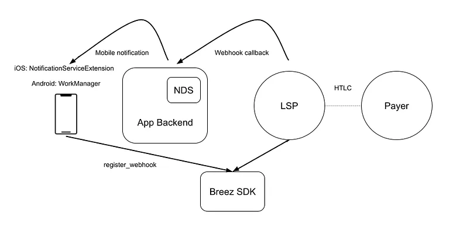
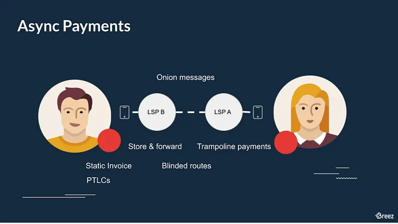

> *作者：Roy Sheinfeld*
> 
> *来源：<https://medium.com/breez-technology/the-past-present-and-future-of-offline-payments-1ddb46054e11>*

对闪电网络，爱之深者责之切。[我](https://medium.com/breez-technology/lightning-at-the-end-of-the-tunnel-overcoming-bitcoins-ux-challenges-5738171c759e)和 Ben Carman 都如此。在[最近一篇 Stacker 帖子](https://stacker.news/items/379225)（[中文译本](https://www.btcstudy.org/2024/01/12/rethinking-lightning-by-benthecarman/)）中，Ben 将流动性和离线支付列为闪电网络最影响用户体验、阻碍自主保管的方面。这似乎只是另一种 “未来怎么不像我们想的那样” 的抱怨。我们承诺会做出会飞的汽车，但我们只得到了互联网奇迹。[一切都很神奇，但没有人觉得开心](https://youtu.be/PdFB7q89_3U?t=18)。

但是，看得更仔细一些，Ben 其实说对了一些东西。我一直在讨论闪电网络的用户体验，好几年了，也包括离线支付的困难。我甚至[在 2019 年](https://medium.com/breez-technology/introducing-lightning-rod-2e0a40d3e44a)就为离线支付问题提出了一个解决方案（我下文会解释为什么我们从未实现它）。

这可能会让人觉得，我们承诺的未来永远也不会来了，但开发闪电网络就像登山。登山者自始至终看不到山顶在哪，直到他们真的到达山顶。他们甚至常常连下一段山脊在哪也看不见。计划路线当然很重要，但大多数时候你只能关心下一步踏在哪儿。但功夫不负有心人。就像在山顶俯瞰万物是对所有攀登努力的奖赏，更光明的未来货币也将是我们一点一点打造这个网络的奖赏。这也是闪电网络从一个想法变成一个持续运行的比特币支付网络的原因，也是我们走向未来的方式。

- 与登山相似的另一点是，没人能独来独往（图源：<a href="https://unsplash.com/photos/person-in-red-jacket-and-blue-pants-sitting-on-rock-mountain-covered-with-snow-during-daytime-m6wbWMF6p9s?utm_content=creditShareLink&utm_medium=referral&utm_source=unsplash">Sylvain Mauroux</a>） -

因为离线支付是一个长期存在的使用体验挑战，我们要回顾一下问题出在哪里、当前有什么技术可以处理这个问题，以及未来还有什么可能。（我会在后续文章中讨论 Ben 提出的另一个问题 —— 通道流动性。）

## 问题

只体验过法币、链上比特币和托管式钱包可能不会意识到 “离线支付” 的困难。法币和托管式钱包通过完全控制用户的资金来解决这个问题。银行/托管商 从其他用户的 银行/托管商 处接收 资金/借条，也在自己的用户要求的时候发送 资金/借条。如果用户从头到尾都没有真正保管过自己的资金，那他们在不在线就无关紧要。只有真正控制资金的人才需要在线。至于链上比特币，发送者只需要接收者的地址就可以了。

自主保管的闪电钱包面临更大的挑战，因为一笔交易所涉及的两方都需要同时在线。接收者需要给发送者提供一个闪电发票；发送者需要创建支付，接收者也要在线签名确认支付。这种安排回复了用户对自己的钱的控制权，但也可能成为用户体验中的痛点。

## 过去：试错阶段

在 Norgay 和 Hillary 最终成功以前，有记录的攀登珠穆朗玛峰的尝试[共有 11 次](https://en.wikipedia.org/wiki/Timeline_of_Mount_Everest_expeditions)。Breez 应对离线支付问题的第一次尝试叫做 “Connect to pay”，它会提醒发送者通知收款者，支付即将发送，收款者应该把闪电钱包应用打开。这背后的用户体验理念类似于打电话：让双方都同时专注于同一件事情。但是，不需要操心过程就能收到支付的心理预期实在是太根深蒂固了。没办法，这是我们都想要的体验，差一点都不行。（[人们甚至不喜欢打电话](https://leadferno.com/blog/survey-texting-is-the-preferred-way-to-communicate)。他们[编了歌曲](https://youtu.be/aL8TdgkNUDA)来嘲笑它。）

我们的下一个想法要更加复杂一些，我们称之为 “[Lightning Rod](https://medium.com/breez-technology/introducing-lightning-rod-2e0a40d3e44a)”。这个想法是使用 “[暂缓兑付发票](https://guide.bolt.fun/guide/invoices/hodl-invoice)”，让发送者和接收者之间的一个路由节点中断支付，直到接收者回到线上。因此，它[很像 Zeus 的 Zaplocker](https://github.com/supertestnet/zaplocker?ref=blog.zeusln.com)。

虽然 Lightning Rod 可以工作，我们从未让它进入实际使用，因为暂缓兑付发票对路由节点来说是不可扩容的。他们的资金会被冻结。当一个路由节点扣住一笔支付时，基本上相当于给接收方提供一笔免息贷款。但死水必腐。通过在路由中冻结流动性来解决异步支付问题，只会让流动性问题恶化。

我们遇上了一座对的山，但选择了错误的路线。

## 现状：现有的提供离线支付的方法

好消息是，处理离线支付的技术在不断进步。现有的方法中没有一个是十全十美的，但每一种都在某个地方很有用。

### LNURL-Withdraw

第一种是 “[LNURL-Withdraw](https://github.com/lnurl/luds/blob/luds/03.md)”。接收者可以扫描一个 QR 码或者输入一个 URL、指示自己的 app 请求来自一个发送者的资金。举个例子，希望从某个交易所取出资金的用户可以随时 “拉取” 自己的资金，而不是让交易所 “推送” 给自己（他们可能不在线）。

这种办法有两个重大缺点。第一，它要求发送者拥有一个节点，运行在一个持续在线的服务端上，所以对非托管的移动客户端和网页客户端来说，是不合适的。其次，“拉取” 模式仅在一种非常具体的情形中才有用 —— 你知道自己有钱可取。举个例子，它很难用在自发的打赏中。

### Breez SDK 方法：利用移动端的通知

手机通知是另一种支持离线支付的方法。在 iOS 和 Android 系统中，触发通知甚至可以给客户端 app 足够多的 CPU 时间来收取支付。使用手机通知来处理进入的支付，不需要接收方主动介入，也为这种同时性难题提供了一种自然的、不扰人的解决方案。这也是为什么[我们在 Breez SDK 中添加了一个新特性](https://sdk-doc.breez.technology/guide/payment_notification.html)，使用推送通知来协助离线支付。这对 SDK 的用户来说是一种重大的用户体验提升，而且只要求开发者付出少量工作。

Breez SDK 的方法是这样工作的：首先，开发者创建一个 webhook，互联网服务商可以在一笔支付还在路由中的时候调用它。只要一笔支付将这个 LSP 作为触达接收者的最后一跳，这个 LSP 就可以通过 webhook 调用一次通知分发服务（Notification Delivery Service，NDS），然后 NDS 会给用户的手机发送一条推送通知，并且带有指令。这只需要开发者做一些跑腿工作（建立一个 NDS），但结果是更好的用户体验，因为用户不需要将 app 保持在后台以接收支付。它也让移动端用户可以使用一种静态的地址（例如 Lightning address、LNURL-Pay 和 BOLT12）来接收支付。

手机通知是一项提升，但不是万灵丹。首先，它只能用在移动设备上；而且，要是设备关机了，或者用户禁用了通知，那就没法工作。而且，谷歌和苹果可以通过改变他们的操作系统处理通知的方式来削弱其作用。这就是为什么我们需要一种内置在闪电网络协议中的解决方案。

## 未来：在闪电网络协议中开发异步支付

[更高级的离线支付背后的想法](https://lists.linuxfoundation.org/pipermail/lightning-dev/2021-October/003307.html)很简单：让支付变成异步的。因为同时性问题对自主保管的移动端和网页端用户影响最大，而现实中几乎所有这些用户都会通过 LSP 连接到闪电网络，那么，为什么不利用这些永远在线的 LSP、在发送者或接收者离线时同步支付呢？

LSP 可以通过拦截 HTLC，适时地分解支付流，这就消除了同时性问题，或者说，将问题转移到了 LSP 层面 —— 对他们来说这个问题并不存在。一切将从嵌入发票中的一条消息开始：它表示接收者不在线，但连接到了一个 LSP。发送者将支付以及一条消息发送给自己的 LSP，让后者扣住它，在一段很长的超时窗口内等待进一步的指令。然后，发送者给接收者的 LSP 发送消息，请求 TA 在接收方回到线上时通知自己的 LSP（即依然扣住支付的那一个）。这时候，怎么做就取决于 LSP 了。当接收方回到线上时，他的 LSP 会给发送者的 LSP 发送信号、请求完成支付。

这种模式并不会牺牲网络在整体上的流动性，因为唯一会被冻住流动性的节点就只有发送者自己的 LSP，这也是用户实际上希望的。（译者注：一定程度上，本就使用 LSP 的发送者，因为可能经常不在线，而且只有跟 LSP 一条通道，本身就无法为网络的整体流动性作贡献。）

虽然听起来很简单，但这种办法需要更多的技术投入才能有好的效果：静态发票、[洋葱消息](https://lightningdevkit.org/blog/onion-messages-demystified/)、盲化路由、[蹦床支付](https://thebitcoinmanual.com/articles/btc-trampoline-payments/)，还有 [PTLC](https://bitcoinops.org/en/topics/ptlc/)。它是复杂的，但希望深入了解的读者可以看看[我在 Honeybadger 2023 上的演讲](https://youtu.be/ZsPqVqX5VJc?t=14164)。虽然一些闪电实现已经支持其中一些特性，但要让整个网络都采用它们需要时间，而采用率决定了互通性。

## 未来何时会来？

明天太阳还会升起，但今天已有光明。我的意思是，*我们已经* 拥有不同、可用的办法来处理闪电网络中的离线支付，而不需要牺牲保管特性，每一种都适合不同的应用场景。LNURL-Withdraw 已经可以在一些商业环境中使用了，而新的 Breez SDK 特性则为移动端用户启用了离线支付。

这很酷！我们不是一直都有这些东西，但至少现在已经有了。我们已经生活在昨天的未来中！

基于协议的解决方案还在开发中。许多实现，比如 Eclair、LDK、lndk 和 Core Lightning 都在所需特性的开发上取得了进展（没错，我看着你呢 lnd）。一旦实现，异步支付就会带来巨大的用户体验提升。这是值得追求的未来。

我确信，在我们到达那里之后，又会有其它挑战出现，需要我们的关注、挑战我们的耐心，但永远不要忘记，我们已经攀登了多高。

（完）