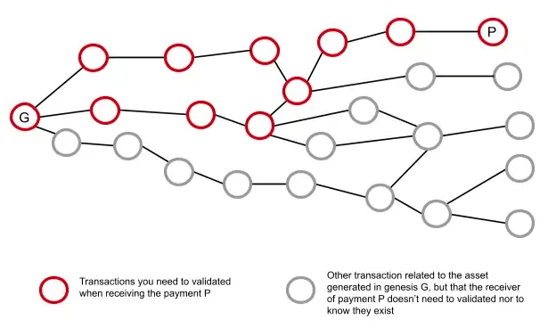

> *作者：阿剑*

本文尝试为比特币上的一种资产发行协议 **RGB** 提供一份简洁的描述（也可以将它理解成一种链外智能合约系统），并指出其迥异于其它旨在实现相同或相似功能的协议的地方，这些区别使得 RGB 协议的可扩展性远远超过它们，并且留下了更广大的编程空间。除了介绍 RGB 已经完成的设计，我们还会探讨这些编程可能性  <a href="#note1" id="jump-1">1</a>。

## 什么是 RGB 协议？

在比特币上发行资产的想法由来已久 <a href="#note2" id="jump-2">2</a> <a href="#note3" id="jump-3">3</a>。但比特币协议有自身的特性  <a href="#note4" id="jump-4">4</a>：其状态由且仅由比特币 UTXO（“未花费的交易输出”）来表达；一个 UTXO 仅携带两个数据：它自身的面额（比特币价值），以及一个 “脚本公钥”（也称为 “锁定脚本”），用于编程这笔资金的花费条件，例如：提供某个公钥的签名；允许用来编程锁定脚本的操作码由比特币的共识规则提供，它们不能用来实现任意的安全规则。因此，我们不可能在 UTXO 内部创造其它资产 —— 比特币脚本不能编程出这些资产的安全检查。这就意味着，所有在比特币上发行资产的想法，本质上都是**对比特币区块空间的创造性使用**。这意味着，我们需要设计一种**链外的智能合约系统**，并要求将改变合约状态的步骤 —— 例如，合约 A 改变了参数，B 将一定数量的某种资产转移给了 C —— 的信息上传到区块链，从而，可以通过收集这些信息，获得这个智能合约系统的最新状态。

一种粗糙的设计思路是，将改变合约状态的步骤的信息原封不动地上传到比特币区块链。这当然是可以工作的，但是，它会面临几个方面的问题：（1）由于上传了完整的信息，它可能会消耗较多的区块空间，当用户需要改变合约的状态（例如转账）时，也将需要付出更多的链上手续费。尤其是，当我们希望这样的链外合约系统具备比比特币更好的可编程性时，可编程性的增加可能以消耗更多的区块空间为代价；（2）区块内的几乎任何一处的信息，都有可能改变链外的智能合约，因此，用户必须获得所有的比特币区块数据，才能得出这个链外合约系统的最新状态，即它的验证成本更高；（3）取决于链外智能合约系统的设计，也许只能获得跟比特币相当的隐私性，甚至更差的隐私性；而如果可以提供更多的隐私性，又可能需要消耗更多的区块空间  <a href="#note5" id="jump-5">5</a>。

过去，一种使用量较大的协议叫做 “Omni”，它不会上传链外合约交易的完整信息，只会上传交易的哈希值。这种做法解决了上述问题 1，使链外合约交易的复杂性与其经济成本解耦；但用户依然需要获得全量的比特币区块数据，才能得出 Omni 协议的最新状态；此外，它也并没有专门加强隐私性。

而 RGB 则使用了一种新的范式，叫做 “**一次性密封**（single-use seals）”。它的用法很简单：RGB 要求每一个合约的每一个状态，都必须**附身**于某个比特币 UTXO；而一旦要变更这个状态，就必须花费这个 UTXO、让花费它的交易得到区块链的确认；此外，花费它的比特币交易还必须提供状态转换的内容的哈希值 <a href="#note6" id="jump-6">6</a>，以指明变更后的状态所附身的 UTXO。

在 RGB 开发者看来，这种设计跟带有编号的塑料密封条有类似的地方：很容易看出它是否被拆过，而且一旦被拆过，就无法再用了。但是，另一种角度是，将被附身的 UTXO 当成这个状态的**容器**或者说陶瓷存钱罐 —— 想要拿出存钱罐里的钱，就必须打破这个存钱罐，然后把里面的钱放到新的罐子里。

这种设计与此前的把整个区块都当成一个大写字板的协议形成了鲜明的对比：使用 UTXO 当容器，就意味着，不花费这个 UTXO 的交易对容器里面的合约状态不能构成任何影响，因此，要验证某一个合约的某一个状态，我们就不需要获得全部区块的数据了，我们需要的只是一连串的比特币交易、这些比特币交易在某个区块中存在在证据、这些比特币交易所承诺的 RGB 状态转换（跟相关的比特币交易一一成对），即可。这些可以串联成一个链条的数据，应该能让我们上溯到这个合约的初始状态，使我们能够辨认这个状态的实质。

对于熟悉链上智能合约系统（比如以太坊）的读者来说，这个过程难以理解的一个地方在于：如果不依赖于区块链的共识（它意味着合约的初始状态和每一次状态变更都会被每一个节点验证），这种智能合约系统的安全性是如何保证的？如何保证自己收到的资产就是自己想要的那一种，如何确保资产没有被非法增发？

答案也很简单，叫做 “**客户端验证**（client-side validation）”—— 你自己验证。在链上合约系统中，节点根据公开的状态转换规则，验证每一次状态转换操作、拒绝掉无效的操作，从而根据初始状态计算出最新的状态。但是，只要状态转换规则和初始状态是可知的，通过链上共识来验证就不是唯一的办法，用户可以根据支付方提供的资料，自己验证状态转换的每一步是否都遵循了最初定义的状态转换规则。通过这种办法，验证的一方（假设是资产的接收方）同样能检查出非法的状态转换，并拒绝接受。

最后，我们用一个例子来展现 RGB 协议的特点：

现在，Alice 拥有 UTXO A'，保存着依据 RGB 协议发行的 X 单位的资产 Y，她希望将 Z 单位的 Y 转移给 Bob。这批资产一共经历了 5 个前任所有者（包括资产发行者），才到达 Alice 手上。因此，Alice 要给 Bob 提供这 4 次状态转换的证据（这其中前面 3 次的证据都是由前任所有者提供给 Alice 的），包括合约的初始状态和状态转换规则、每一次转移所用的比特币交易、每一笔比特币交易所承诺的 RGB 交易、这些比特币交易得到某个区块确认的证据，一起发送给 Bob，Bob 将根据合约的状态转换规则，验证这 4 次转移没有违反规则，然后再决定是否要接受。当 Alice 构造 RGB 交易时，由于 Z 小于 X，她也要给自己安排一个 UTXO 来接收剩余的部分。最后，Alice 将这笔 RGB 交易的哈希值嵌入花费 UTXO A' 的比特币交易中，完成这次支付。

最终，由于使用了 UTXO 容器，一个 RGB 的合约的最新状态可以表示成一个有向无环图上还没有后代的点（每个点都表示一个存放在 UTXO 容器内的状态）。并且，对下图中的所有者 P 来说，他将只知道从合约的初始状态 G 到达他的过程，也即红圈标注的过程，而对灰色的点一无所知：

## RGB 的优势

### 轻量的可验证状态

如上所述，与此前在比特币上出现的资产发行协议（链外合约系统）相比，RGB 大幅降低了验证（一个合约的某一个状态）的成本。在交易的时候，接收者不再需要遍历所有区块来收集合约状态发生改变的信息，而只需获得一连串的比特币交易，以及这些交易所承诺的 RGB 交易、这些比特币交易的区块包含证据（依据区块头的默克尔证据），就能确信支付方真的拥有一定数量的某种资产。

这种验证成本的降低，也大幅度减少了用户对大型基础设施供应商的依赖（信任）。在以往的协议中，由于验证成本较高，用户难以自己计算出合约的最新状态，因此用户必须信任一些供应商（比如自己的钱包所使用的合约状态供应商）；同时，因为可以负担这样的计算成本的供应商较少，这也意味着供应商的中心化。但在 RGB 中，用户只需使用比特币轻客户端来检查与比特币交易的部分、使用 RGB 协议来检查 RGB 交易的部分，自己就可以负担。

跟一些链上合约系统相比，RGB 同样显得更为轻量。这体现在 RGB 可以针对性地验证一个合约的某一个状态；而在那些并不基于 UTXO 的系统上，由于缺乏 UTXO 这样控制准入的机制，任意一笔交易都可能改变任意状态，所以，你几乎不可能针对性地验证某一个状态，而只能在计算出所有最新状态的同时确定某一个状态 —— 在这个意义上，被表达为 “全局状态（global state）” 的特性实际上应该被称为 “整体状态（uniform state）”，虽然它提供了合约之间交叉访问的特性，但这也决定了其验证成本会更高、更难获得免信任性。

在这些链上合约协议上，一种重大的优化措施是要求区块头承诺最新状态（“状态根”），从而允许轻客户端依据这些承诺验证从全节点处得到的某个合约的某个状态。这是一种复用已经发生的计算（全节点已经运行过的计算）的方法，也非常高效，因此，如果不考虑免信任性，可以认为它比 RGB 更为高效。但是，它毕竟意味着：轻节点在交易基础验证以及合约状态计算上都依赖于全节点。而在使用比特币轻客户端的 RGB 钱包中，它所依赖的信任假设是相关的比特币交易是有效交易，而与合约状态相关的部分则是客户端亲自验证过的，因此免信任性更好。缺点是验证的时延更长，需要保管的数据更多。

### 可扩展性

RGB 的可扩展性体现在两个方面：

1. 嵌入比特币交易中的仅仅是一条哈希值，这意味着 RGB 交易的体积（除了合约自定义的规则之外）没有什么限制 —— 即使你把一份 RGB 资产分成了 100 份（RGB 交易本身将非常大），需要嵌入比特币交易中的也只有一条哈希值。如注 6 所述，嵌入这样的哈希值的方法有两种：一是使用 OP_RETURN 输出，这意味着它会消耗一个哈希值的链上空间；二是隐藏在 Taproot 输出的脚本公钥所承诺的脚本树上 —— 这不会消耗任何链上空间。这一点同样也意味着，用户不必为了可编程性而牺牲经济性 —— 仅考虑链上手续费的话。
2. RGB 合约的最新状态是一个有向无环图上没有后代的独立的点 —— 这意味着这些状态可以独立变更、互不影响，也就是允许并发。这实际上也是继承自 UTXO 的特性。这一点同样也意味着，在一个分支上发生的无效变更（无效交易），不会影响其它分支，更不会导致整个合约卡死，因此也可以视为一种安全性好处。

RGB 在可扩展性上被批评的一点是：每一次转移，都需要接收者验证从初始状态到支付者状态所涉及的所有交易 —— 随着资产转手的次数增加，后续的接收者的验证负担会越来越重。这个批评是真实的。而优化它则意味着我们也要找到一种方法来复用已经发生过的运算。证明系统技术（比如 SNARKs）有望提供这样的解决方案 <a href="#note7" id="jump-7">7</a>。

### 资产定义与保管机制的分化

最后一个好处依然跟 UTXO 有关，取决于我们如何理解 UTXO 的锁定脚本机制。

锁定脚本可以用来编程一笔资金的解锁条件，因此，它可以实现保管规则。例如，假设一个锁定脚本包含且仅包含了一把公钥，那就意味着只有对应的私钥的主人可以控制它。但是，这样的保管规则同样是比特币合约式协议编程的基础  <a href="#note8" id="jump-8">8</a>。例如，一个使用 2-of-2 的多签名锁定脚本的 UTXO 可以是一条闪电通道；在通道运行期间，双方可以发生几乎无数次相互支付，而资金的链上形式不会有什么改变。换言之，在此时，2-of-2 的多签名锁定脚本构成了一种价值转移机制，允许双方在不变动链上资金形式的前提下转移价值。

这样的机制可以用在 UTXO 所承载的比特币价值上，自然，也可以用在它所承载的 RGB 资产上。我们可以发行一种 RGB 资产，让它附身于一个 2-of-2 多签名 UTXO，从而利用闪电通道的机制，在双方间无限次相互支付这种资产 <a href="#note9" id="jump-9">9</a>。同理，RGB 资产也可以进入其它基于比特币脚本的合约。

在这里，UTXO 的脚本和 RGB 协议形成了功能上的分化：前者致力于实现价值保管和价值转移的规则；而后者专注于资产定义。从而，资产的保管和资产的定义可以拆分开来。这是一种重要的安全性提升，也是人们在一些别的链上合约系统中孜孜以求的东西。

## RGB 已经作出的设计

上述特性，实际上对所有基于 UTXO 一次性密封和客户端验证的协议都成立。但在此基础上，RGB 协议又做出了进一步的设计。

在当前的 RGB 协议的开发中，开发者们尤其关注协议的隐私性，因此 RGB 在两个方面加强了隐私性：

- 盲化 UTXO。在 RGB 交易中，接收方只需使用混淆后的 UTXO 标识符来接收资产，而无需暴露真正接收资产的 UTXO 的特征。这丝毫无损接收者向下一任所有者提供证据的能力，同时又使后续的资产接收者可以对抗前任资产所有者的窥探。
- Bulletproof。可用来隐藏每一次交易中的具体数额。但后续的资产所有者依然能验证此前没有出现过增发。

## 可待探索的空间

在这一部分，我将讨论 RGB 协议还可以继续探索的空间，主要跟可编程性有关。

当前，已经提出的 RGB 合约模板（*schema*）都集中在资产发行上。但是，由于 RGB 使用了 “客户端验证” 范式，实际上，我们可以给它添加任何可以用客户端验证来确保的特性 —— 仅受 UTXO 这种结构的限制。

### 限制条款

而在 UTXO 的基础上，一个可以拓宽可编程性的概念叫做 “限制条款（covenants）” <a href="#note10" id="jump-10">10</a>。限制条款的本意是限制一笔资金可以转移的目的地。有了这种能力，我们就可以编程许多有趣的应用，比如：

- 非交互式取款的资金池。我们可以让许多人的资金都汇集在同一个 UTXO 中，并使用限制条款保证他们任何人都无需其他人帮助，就可以取出属于自己的资金。这可以起到在区块空间需求高涨时以低成本帮助人们从高风险的地方退出的作用。
- 保险柜合约。让一笔资金必须先花费到某个地方、经过一个时间锁才能自由花费；而在时间锁期间，保险柜主人可以用一把紧急密钥打断这个过程、将资金立即转移到别的地方。这种装置可以为自主保管提供极大的帮助。

当前的比特币脚本并没有这种能力，因此，在比特币脚本上启用限制条款需要软分叉。

但是，只要我们愿意牺牲一些由 “资产定义与保管机制的分化” 带来的好处的话，我们就可以在 RGB 资产上实验这样的特性，我们可以在 RGB 合约层面实现这样功能 —— 虽然它只能对使用它的 RGB 资产生效（而不能对比特币生效），但无疑会开启一个有趣的空间。

已有的限制条款的研究表明，它可以拓宽基于 UTXO 的交易的编程空间，提供许多特性。但这些研究基本上是基于比特币的，而在比特币这样的协议上，我们会更加保守一些。而在 RGB 上，我们可以大胆地将限制条款的核心能力 —— 在脚本层面读取花费自身的交易的能力 —— 进一步泛化，从而提供更灵活的可编程性：交叉访问合约的能力。

### 交叉访问

最小的限制条款意味着一个 UTXO 在被花费的时候，其脚本可以读取花费交易的输出。但完全泛化的限制条款则意味着：它可以读取花费它的交易的所有部分。这就意味着，它也可以读取交易的其它输入，如果我们不限定其它输入必须来自同一个合约，那就意味着，它可以读取其它合约的状态。

在 RGB 中，我们默认每一个合约都是一个独立的宇宙，有属于自身的有向无环图。但是，依然有可能出现一个用户同时持有两个不同合约的状态的情况。如果 RGB 交易允许同时花费来自两种合约的资产，这样的交叉访问能力也许就有应用场景（尽管可以想象它会让交易的验证变得更加复杂）。

实际上，已经有基于 UTXO 类似结构的链上合约系统（例如：Nervos Network），使用这一点来实现合约的交叉访问能力 <a href="#note11" id="jump-11">11</a>。这是一个非常新的领域，开向以往的比特币研究很少触及的领域，也许埋藏着什么惊喜也说不定。

## 结论

在本文中，读者会发现，有个概念被频繁提及、贯穿了推理和幻想的所有过程：“UTXO”。这正是我的用意。如果你不理解 UTXO，你就无法理解 RGB 这样的协议的设计的起点，也不能理解 RGB 协议设计的优点，也无法想象人们使用它的方式。RGB 协议的特性在很大程度上正是由其 UTXO 这种一次性密封的形式塑造的。相应地，比特币研究领域积累的对 UTXO 的研究，也可以被我们化用到对 RGB 的研究中。

这也解释了，为什么不理解比特币的人，将很难理解 RGB。而喜欢比特币的人，会认可 RGB 已经作出的设计。

（完）

## 注

1.类似的理解亦可以应用在另一种协议 Taro 上，这是因为在最基础的层面上，RGB 和 Taro 基于相同的概念。 <a href="#jump-1">↩</a>

2.https://www.btcstudy.org/2022/11/10/counterparty-vs-rgb-vs-taro/ <a href="#jump-2">↩</a>

3.https://www.btcstudy.org/2022/07/17/dapps-or-only-bitcoin-transactions-the-2014-debate/ <a href="#jump-3">↩</a>

4.https://www.btcstudy.org/2023/04/18/interesting-bitcoin-scripts-and-its-use-cases-part-1-introduction/ <a href="#jump-4">↩</a>

5.敏锐的读者可能会意识到，许多链上的智能合约系统，比如以太坊，也具有完全相同的问题。在这些系统中，智能合约是以账户的形式持久地存在的，同时，也是任意交易都可以访问的。以太坊在设计上取舍了一些东西来缓解这一点所带来的影响，其中最重要的是：在区块头中安置整个协议最新状态的承诺（“状态树根植”）。 <a href="#jump-5">↩</a>

6.可以用 OP_RETURN 输出提供，也可以放在交易的第一个 Taproot 输出的脚本树内。见：https://www.btcstudy.org/2023/01/10/overview-of-the-main-concepts-and-features-of-the-rgb-design/#%E7%A1%AE%E5%AE%9A%E6%80%A7%E7%9A%84%E6%AF%94%E7%89%B9%E5%B8%81%E6%89%BF%E8%AF%BA <a href="#jump-6">↩</a>

7.https://www.btcstudy.org/2021/11/11/snarks-and-the-future-of-blockchains/ <a href="#jump-7">↩</a>

8.https://www.btcstudy.org/2023/04/18/interesting-bitcoin-scripts-and-its-use-cases-part-1-introduction/ <a href="#jump-8">↩</a>

9.https://www.btcstudy.org/2023/04/09/how-rgb-enables-altcoins-on-bitcoin/ <a href="#jump-9">↩</a>

10.https://www.btcstudy.org/2023/03/13/why-bitcoin-needs-covenants/ <a href="#jump-10">↩</a>

11.https://medium.com/nervosnetwork/https-medium-com-nervosnetwork-cell-model-7323fca57571 <a href="#jump-11">↩</a>

