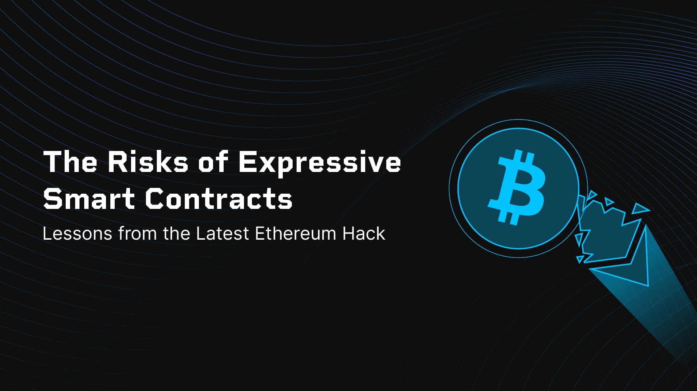
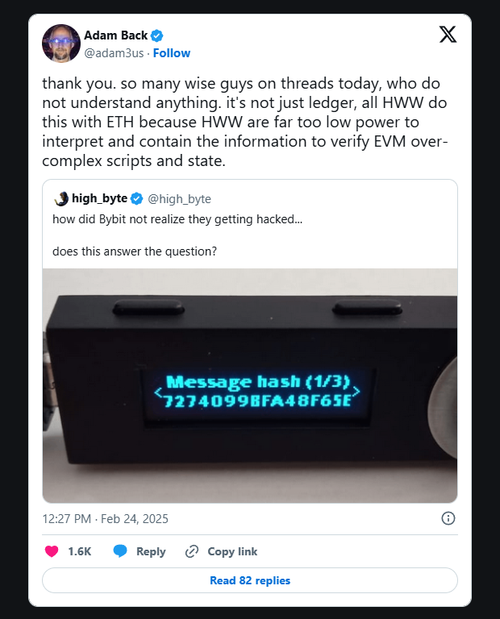

> *作者：Blockstream*
>
> *来源：<https://blog.blockstream.com/the-risks-of-expressive-smart-contracts-lessons-from-the-latest-ethereum-hack/>*
>
> *译者注：原标题为 “The Risks of Expressive Smart Contracts: Lessons from the Latest Ethereum Hack”，直译为：“富表达力的智能合约的风险：来自最近一次以太坊被黑事件的教训”。*

近期 Bybit 交易所在以太坊上的智能合约账户被[爆破](https://announcements.bybit.com/en/article/incident-update-unauthorized-activity-involving-eth-cold-wallet-blt292c0454d26e9140/?category=latest_bybit_news)的事件（译者注：[发生于 2025 年 2 月](https://learn.bybit.com/this-week-in-bybit/bybit-security-incident-timeline/)），令关于以太坊协议内置的安全取舍的长期争论再次复活。

这场新的事故使人们聚焦于 “以太坊虚拟机（EVM）” 的局限性，以及它对复杂的富状态性的智能合约的[依赖](https://cointelegraph.com/news/adam-back-evm-misdesign-root-cause-bybit-hack?utm_source=rss_feed&utm_medium=rss&utm_campaign=rss_partner_inbound) —— 尤其是在保护多签名（multisig）钱包的时候。

## 以太坊多签名保管模式的核心问题

多签名钱包是一种基础性的安全曾，它要求签名数量多于一个才能移动资金。在比特币和 [Liquid Network](https://liquid.net/?ref=blog.blockstream.com) 中，实现多签名是非常直接的，因为我们有原生的操作码（例如，OP_CHECKMULTISIG），或者我们可以始于基于 Schnorr 签名的交互式多重签名，这些都让代码的接触面更小，更不容易出 bug。

在以太坊上则不然。开发者必须创建定制化的代码来复制多签名的功能 —— 导致额外的复杂性和更大的风险。这些合约必须管理链上状态、处理重入问题（攻击者可以在一个合约执行期间调用令一个合约），还得保证多签名人的逻辑会被正确执行。

这些领域的失误可能都会带来致命的漏洞，就像我们在 2017 年 [Parity](https://cointelegraph.com/news/parity-multisig-wallet-hacked-or-how-come?ref=blog.blockstream.com) 钱包爆破事件中已经看到的那样。

## 以太坊涉及中的系统性挑战

### 缺乏原生的多签名保管

比特币的设计为多签名交易包含了内置的脚本命令。以太坊没有提供直接的对应物，所以你必须编写一个合约来处理多个签名人、跟踪链上的状态，并在得到多一个签名时更新合约状态。这种方法让审计变得更加困难，而且提高了出 bug 的可能性。

### 高表达力的脚本编程环境

EVM 允许几乎任意类型的计算：循环、任意函数调用，以及合约间交互。虽然这种灵活性带来复杂的去中心化应用（dApp），它也让形式化的安全审计变得更难。开发者必须考虑以下问题：

- **重入问题**：在某一个合约账户调用另一个的合约账户的时候，被调用的合约账户可以回过头来调用初始合约账户；有些时候，这种重入会发生在初始合约的状态更新敲定之前。
- **共享的全局状态**：许多合约共享同一个全局的键值对存储。一个合约或者库合约中的 bug 仅在可能打开影响所有不同合约的漏洞。
- **Gas 限制**：每一步操作都要消耗 “gas”。在错误的时间用尽了 gas 可能会冻结或打破合约逻辑。

### 全局的键值对存储

以太坊使用一种基于账户的模式，并使用一个全局状态树。每次合约账户更新都可能会影响其它合约使用的数据（或者与这些数据交互）。相反，比特币的 UTXO（未花费的交易输出）模式将状态变更局部化、限定在单笔交易内部，从而降低了一个合约的错误影响另一个合约的运行的风险。

- Adam Back：“谢谢你。这帖子汇聚了这么多聪明人，但居然完全不了解情况。不单 Ledger（图片中的硬件签名器）在处理 ETH 时是这么粗糙的，所有的硬件签名器都是这样的，因为硬件签名器的功耗太低，无法解析和记忆信息来验证 EVM 那些过于复杂的脚本和状态。” -

（译者注：如前所述，以太坊上交易的效果并不能从交易自身中看出，它是依赖于交易执行时刻的区块链状态的，如果你希望从硬件签名器这里知道自己待签名交易到底会造成什么效果，你需要向它送入大量数据（关于交易会触及的合约账户的状态数据）并期望它在足够短的时间内解析并验证出来。这就是为什么 Adam 说签名器根本做不到。）

## 为什么以太坊的多签名保管会出故障

尝试从多签名种获得强化安全性的以太坊用户通常会面临三种选择：

1. **单密钥管理**

   直接了当，但只要别人触碰到了你的私钥，他们就能控制你所有的资金。

2. **复杂的多方计算（MPC）**

   高级的密码学技术，比如基于 ECDSA 的门限签名，可以减少单点故障。然而，这通常需要专门的代码库，而且可能需要大量计算。

3. **定制化的智能合约账户**

   虽然是以太坊上最常见的方法，但也是最危险的。它将用户暴露在底层合约代码的风险之下，如果攻击者找出了一个漏洞，那就是灾难性的。

   相比之下，比特币的跃升多签名操作码让事情变得更简单。你只需要指定需要多少个签名（比如，3 个公钥中要有 2 个提供了签名），然后协议就会强制执行它，不需要复杂的合约账户逻辑。

## 关于富状态性智能合约的一个提醒

最近的以太坊多签名合约账户被黑强调了一个重要的教训：你的编程环境越复杂，你需要担心的潜在安全漏洞就越多。

以太坊的灵活性要求你在合约编程、审计和更新中保持警惕。而比特币的多签名解决方案是内置在协议中的，这就大大降低了因为编码错误而产生致命故障的可能性。

从区块链行业的角度看，有越来越多的[证据](https://blog.blockstream.com/why-bitcoins-utxo-model-is-best-for-blockchain-based-finance/)表明，安全性必须是一个顶层设计选择 —— 无法事后添加。

以太坊挣扎于基于合约合约的多签名保管，是一个绝佳的证据：协议层应原生提供健壮的安全性原语，而不是将负担交给开发者、让他们在每次需要安全的多签名解决方案时都重新发明轮子（同时承担重新发明漏洞的风险）。

（完）