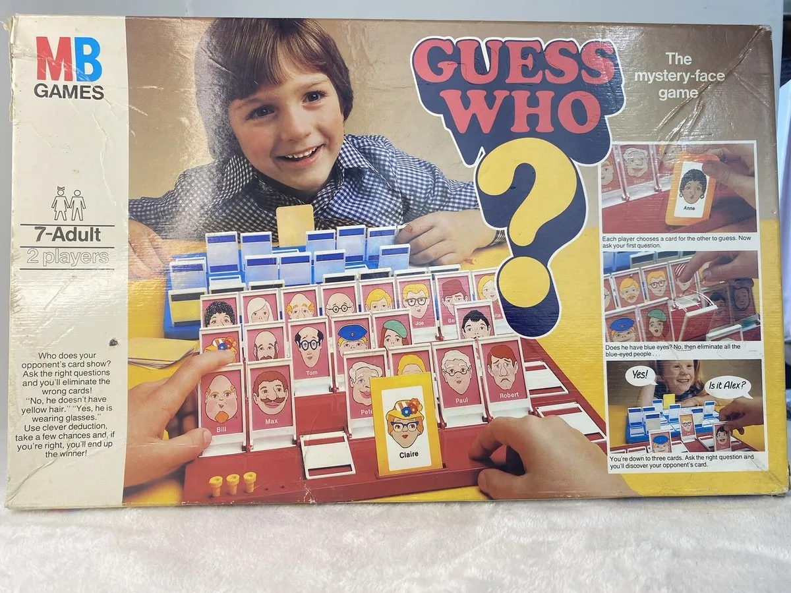
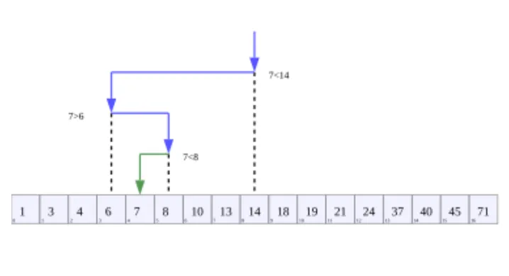
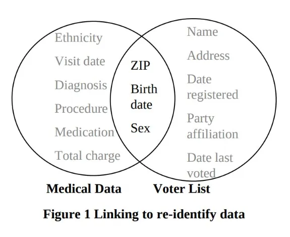
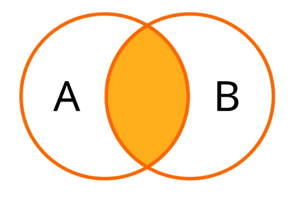
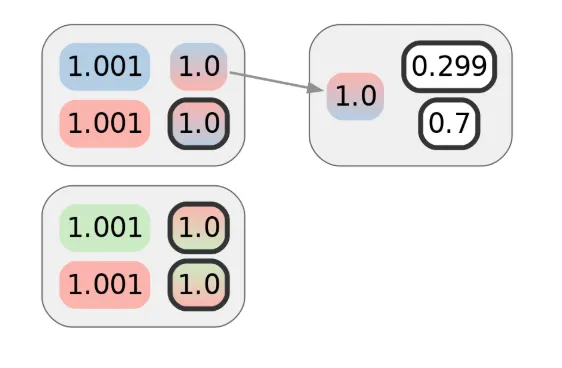
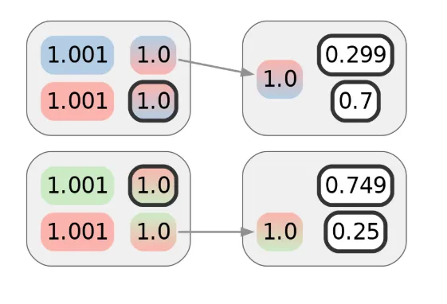
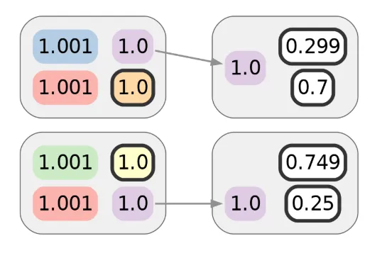
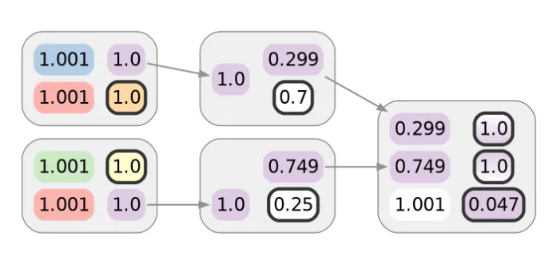
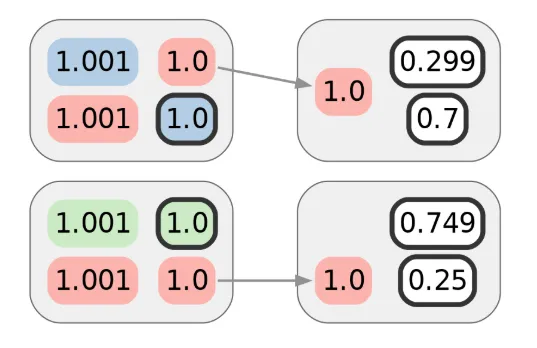

> *作者：nothingmuch*
>
> *来源：<https://spiralbtc.substack.com/p/the-scroll-4-intersection-attacks>*
>
> *原文使用 Creative Commons 许可 4.0 版本发布，共享和演绎该文须保留原作者署名并以相同的条件发布，因此本译本也使用相同的许可。*
>
> [*前篇见此处*](https://www.btcstudy.org/2025/10/23/the-scroll-3-a-brief-history-of-wallet-clustering/)

## 对抗性思考 20 个问题

在研究隐私性时，将去匿名化想象成一个游戏是很有用的。先想象一个敌手，TA 可以获得一些信息，然后 TA 会尝试猜测，系统中的一组候选人中的谁做了什么事情。为了阻止这个敌手胜出，我们需要让 TA 的猜测得不到结果，这又意味着，要么我们限制 TA 获得信息的渠道，要么，使用随机性来增加 TA 需要获得的信息量。

- 图片来源：<a href="https://www.youtube.com/watch?v=5ifCeqYdTG4">猜猜我是谁？1979 版本……开箱评测</a> -

许多读者可能熟悉“[猜猜我是谁](https://en.wikipedia.org/wiki/Guess_Who%3F)”的游戏。这种游戏可以说是更加底层的“[20 个问题](https://en.wikipedia.org/wiki/Twenty_questions)”的回合制对战版本。在“20 个问题”中，你会从一个集合中选出一个元素，而你的对手要猜出你选择的是什么东西，手段就是问你 20 个只能回答“是”或“否”的问题。在“猜猜我是谁”中，双方会轮流盘问对方，先猜出对方身份的人就赢。“猜猜我是谁”中的元素组合是固定的，有 24 个卡通人物，每个人物都有多方面的特征，比如头发的颜色和发型。每个人物都有一个专属的名字，不会重合。

“是”或“否”的回答可以用比特来表示：要么是 1，要么是 0 。20 个比特（用二进制）可以表示从 0 到 104 8575（220-1）之间的任何整数。如果一个集合是完全排序的，这个集合中的每一个元素都可以用其在序列中的位置来索引，这样的索引就能唯一地标识它们。所以，20 个比特可以在 100 万个元素中定位出某一个元素。

虽然 220 是使用 20 个是否问题确定有解所能允许的最大元素数量，但在真实世界的情形中，20 个问题能够问出的信息会少得多。对于绝大多数集合以及问题的组合，几乎肯定不会完美匹配，而且并不是每一个问题都能独立于其它问题、直接将候选元素分成两部分。有些问题的答案可能有偏倚；还有一些问题，它的答案可能会跟其它问题有关联。

假设你不是问“你的人物戴眼镜吗？”这样的问题，而总是问“你的人物的名字，按字母表的话，排在【剩余人物名字排序最中间的】那个名字前面吗？”，这就是一种“[二分搜索法](https://en.wikipedia.org/wiki/Binary_search)”，将最大化能够从一个答案中获得的信息量：每一个问题都使用一个名字将剩余的人物集合分成两半，而回答就会帮你排除其中一半。重复这样的提问可以按是否问题所能获得的最高效率来缩减搜索的范围（候选人物集合），从而只需要对数次提问，就能得出答案，比起线性扫描 —— 就是“是 Alice 吗？是 Bob 吗？”这样一个接一个地问 —— 要快得多。

- 来源：<a href="https://en.wikipedia.org/wiki/Binary_search#/media/File:Binary_Search_Depiction.svg">二分搜索 - 维基百科</a> -

不过，这个游戏的要点并不是尽可能快地获得你的对手的信息，如果你要赢，你要比对方更快猜出来；而且，已经证实的是，最大化每次提问可获得的信息量实际上[并不是最优策略](https://arxiv.org/pdf/1509.03327)，至少在玩家都诚实应答的时候是如此。类似地，在使用游戏来学习隐私性的时候，你必须假设，敌手是理性的（追求 TA 自身的偏好）；否则，你很容易在无意间为一个差之毫厘的结果而优化。敌手想赢。

最后，假设玩家并不总是诚实的，那么应该不难看出，一个人可以作弊而不被察觉 <a href='#note1' id='jump-1-0'>1</a>：你不必在一开始就选中其中一个元素，然后每个问题都诚实作答；你可以总是给出在剩余候选元素中排除尽可能少元素的答案。由此，见机选择的答案可以尽可能延缓你的对手获得有用信息、赢得游戏的速度。在这种所谓的“拜占庭”设定中，最优策略就跟玩家总是诚实的时候不一样。这时候，对手的最佳应对就是坚持二分搜索，这样可以限制见机选择的优势。

见机选择的“猜猜我是谁”是非常无聊的，类似于只要你有意为之，井字棋（三子棋）游戏就总是以平局告终。说得具体一些，如我们在下一节将看到的，你需要从对抗性最强的对手那里抽取 4.58 比特的信息，而游戏的规则可以用来迫使对方承诺这些比特。这就意味着，先提问的玩家总是能在问出 5 个问题之后就赢下比赛。在这样的游戏中，答案的文本应该总是由均匀随机的比特组成 <a href='#note2' id='jump-2-0'>2</a>；任何别的东西都会给你的对手优势。不幸的是，使用这样的见机选择和额外随机性的隐私保护措施是难以开发和理解的，所以实际的隐私软件通常比这些游戏案例要难以分析得多。

## 度量匿名性

### 香农熵

“猜猜我是谁” 游戏中的一个回答的[信息内容](https://en.wikipedia.org/wiki/Information_content)，也叫做它的 “香农熵（Shannon entropy）”，量化的是它学到了多少 “惊喜”。比如说，如果你已经发现了你的对手的人物是个光头，那么发现他没有黑头发就不会让你觉得惊喜，所以说，这个答案就没有包含额外的信息。它不让你惊喜，是因为，早在你得到这个答案之前，你就已经可以推断出他拥有黑头发的概率是零。

假设候选集合中只剩下两个选项，这差不多就是一种掷硬币游戏，这两个选项是最终答案的概率是一样的，所以答案带来的惊喜也是一样的。如果答案是 A ，那就表明它不是 B ，反之亦然，知道它不是 B 就表明它必然是 A 。所以只需要再提问一次（是否问题）就够了，得到 1 比特的信息，就可以消除所有的不确定性。

这个数值（香农熵）可以从概率分布中计算出来，在上面这个只剩两个选项的例子中是 p = 1/2 的[伯努利方程](https://en.wikipedia.org/wiki/Bernoulli_distribution)。

首先，计算任何一种情形的概率的对数（以 2 为底）的负数，等价于计算概率的倒数的对数（这样就可以消除负号）：

$$-log_2(p) = log_2(1/p)$$

不管是哪一种情形，

$$log_2(2) = 1$$

然后，通过将这些值乘以相应的概率来缩放它们，就像加权平均数一样：这里有两种情况，每一种的贡献都是 1/2 比特。两者的和是 1 ，这就是这种分布的香农熵。

超过两种选项的情形也不例外。如果你刚开始玩游戏，这样问：“你的人物是某某人【随便某个人物的名字】吗？”，最大概率是你只能学到

$$\frac{1}{24} \log_2(24) \approx 0.191$$

比特的信息（假设答案是“否”）。

得到答案之后，$log_2(23) \approx 4.52$ 比特，它就量化了剩余 23 个等概率选项的不确定性。换句话说，如果你足够幸运而且猜测正确的话，你将学到全部信息 $log_2(24) \approx 4.58$ 比特的信息，因为没有剩下任何不确定性了。

在 24 个人物中，将可能性收敛到 1 个人物，只需要不到 5 个比特。10 个比特就足以在 1024 种选项中找出最终的 1 个。20 个比特，足以在 100 万种可能中定位某 1 种。

香农熵非常通用，也能够量化不均匀的概率分布。名字在人群中就不是均匀分布的，有些名字更常见，有些名字更罕见，所以，一个有趣的问题是：[一个名字中有多少熵](https://altmode.org/2015/01/14/how-much-entropy-is-in-a-name/)？我链接的文章估计，美国人的姓氏大概有 15 比特。根据[另一篇论文](https://escholarship.org/content/qt46v58824/qt46v58824.pdf)，美国人的名字中包含大约 10 ~ 11 比特的熵。这些估计表明，一个全名最多只包含 26 比特的熵，但也请记住，常见的名字（比如 “John Smith”）比不常见的名字包含更少的熵。完全索引整个美国的人口需要 29 比特。

截至本文撰写之时，世界人口正在缓慢但确实地接近 233 。33 并不是一个非常大的数字。那么一个生日中含有多少比特？只算年龄呢？[居住城市](https://gwern.net/death-note-anonymity)呢？一个 IP 地址呢？[最爱的一部电影](https://arxiv.org/pdf/cs.CR/0610105)呢？浏览器的[画布实现](https://coveryourtracks.eff.org/)呢？一个邮政编码呢？字典中的词语呢？语法中的标点符号呢？这些都是棘手的问题。在前面说的游戏和现代密码学中，秘密值是随机的，而且优先使用一次性的值；但我们不能随机化、过期作废和轮换我们的真实人生的身份属性。

此外，这些个人身份信息常常会泄露，有时是出于必要，有时是不必要但无意中泄露了，这贯穿了我们的生活。我们常常不得不信任跟我们交互的人不会揭露这些信息 —— 不论是有意分享给第三方还是意外地泄露。也许，这跟我们必须把生命托付给他人，比如医生、职业司机和飞行员，并没有什么不同。当然，托付个人数据和托付其它东西的必要性是无法相比的。

### 匿名性的熵主义者视角

隐私强化系统让用户可以隐藏在人群中。比如说，如果你观察到一个来自 Tor 退出节点到你的服务器的连接，那么你能知道的不过是，可能是几千个 Tor 用户中的某一个建立了这个连接。从信息论来看，给定一个目标为去匿名化的敌手已经观察到了一些事件（比如说拦截到了在一个网络中的两个节点之间传输的一条消息 ），那么特定一个用户的 “匿名集” 就是这些事件所归属的可能用户的集合。如果一条匿名消息的接受方就是敌手，那么敌手对一组候选发送者作出的最正确猜测就是真正发送者的匿名集。在一个理论上完全匿名的系统中，（除了接收者）任何一位用户发送这条信息的概率都是一样的。

最近，两篇很有影响力的论文都提出了要用匿名集的熵来度量匿名性：《[迈向匿名性的度量](https://lirias.kuleuven.be/retrieve/333407)》，来自 Claudia Díaz、Stefaan Seys、Joris Claessens 和 Bart Preneel；《[迈向匿名性的一种信息论度量](https://bib.mixnetworks.org/pdf/serjantov2002towards.pdf)》，来自 Andrei Serjantov 和 George Danezis 。这些工作从这样一种假设开始：敌手可以从匿名集中猜测出正确用户的概率是有上限的；然后推广为一种模型：考虑匿名集内部的不均匀的概率分布。两篇论文都提议用熵的比特数量来量化匿名集的规模。

如果匿名集是完全对称的（perfectly symmetric），那就只有均匀分布是有意义的，从而，将匿名集的规模换算成熵的比特数量，就仅仅是计算  $log_2(n)$ ，其中 n 就是匿名集的规模。比如说，一个包含 1024 个等概率元素的集合，在其分布中就有 10 比特的熵。

当概率分布并不均匀的时候，熵就会下降。比如说，如果一块硬币可能出现正面，也可能出现反面，但正面出现的概率是 1/4 ，反面出现的概率是 3/4 ， 这种概率分布的总熵就只有

$$\frac{1}{4} \log_2(4) \ + \frac{3}{4} \log_2(\frac{4}{3}) = \frac{1}{4} 2 + \frac{3}{4} 0.415...=0.811...$$

比特，而不是 1 比特。这就量化了一种概率分布所代表的不确定性：与一块均质的硬币相比，抛掷这块扭曲的硬币所得到的结果是更加确定的。

香农熵是整个[“熵”定义家族](https://en.wikipedia.org/wiki/R%C3%A9nyi_entropy)中的一个特例。它刻画的是一条消息中的平均信息内容，这样的消息既可以是“是”或“否”的答案、也可以是更加广义的答案，并且，这种刻画是从消息可能性的概率分布中得出的。更加保守的估计可能会使用“[最小熵](https://en.wikipedia.org/wiki/Min-entropy)”，也就是只考虑出现概率最高的元素，而不是计算算术平均值、量化最坏的情形。在本文中，我们会坚持使用香农熵的概念。想要了解更加深入的讨论以及对熵主义者视角的更加精妙的解读，Paul Syverson 的《[何以我不是一个熵主义者](https://www.freehaven.net/anonbib/cache/entropist.pdf)》值得一读。

## 交集

在《[k-匿名性：一种保护隐私的模型](https://citeseerx.ist.psu.edu/document?repid=rep1&type=pdf&doi=2ab47454f59d9d8e55d4d8a69530562a3690794a)》中，Latanya Sweeney 从回顾她以往的调查结果开始；这些结果展示了“已经匿名化的”数据的身份再次识别。独立地看，跟一个数据集中的条目相关的每一种属性，比如生日日期，似乎都只揭晓了这个条目的主体的十分有限的信息。但是，就像游戏中的“是”或“否”答案，只需要对数数量的信息 —— 换句话说，结合极为少量的几个属性 —— 就足以再次识别出属性主体的身份：

> 比如说，这项研究中的一个发现是，美国人口中的 87%（2.48 亿中的 2.16 亿）都有已经报告的特征、并且这些特征使得，可能只需基于 {5 位数字的邮政编码、性别、生日日期} 三种属性，就足以将他们唯一地识别出来。显然，包含了这些信息的数据，在公开的时候就不应被视为匿名化的数据。

作一个粗略的估计，由 5 个数字组成的字符串最多拥有 $log_2(10^5) \approx 16.6$ 比特的熵，但邮政编码的数量并没有那么多，只有 $log_2(4.4 * 10^4) \approx 15.4$ 比特，而且别忘了，人口在不同邮政编码所覆盖的区域并不是均匀分布的，所以 13.8 就是[最佳估计](https://www.johndcook.com/blog/2018/03/02/bits-of-information-in-a-us-zip-code/)了。性别这一项，在绝大部分情况下会包含稍微多于 1 比特的信息，因为即使表示了非二元的性别，主要数值依然是“男性”或者“女性”。也就是说，在性别一项中使用了非二元数值的主体，在这个数值暴露时，对其造成的信息泄露会远远超过 1 比特。如果不了解年龄的分布，生日日期所包含的熵也很难估计。

不考虑“2 月 29 日”，假设人们的生日是均匀分布的，出生年份则用 2 位数字表示，那么出生日期的熵就是 $log_2(365 * 10^2) \approx 15.1$ 比特。同理，可以查到一个[更加现实的估计](https://www.johndcook.com/blog/2018/03/02/bits-of-information-in-age-birthday-and-birthdate/)是 14.9 比特。加总起来，更加保守的估计是，总共只有大约 29.7 比特。相比之下，如果此时的美国人口均匀分布，熵会是 $log_2(248 * 10^6) \approx 27.9$ 比特（或者，根据最新的图标，应该是 $log_2(342 * 10^6) \approx 28.4$ 比特）。（译者注：作者在这里的意思是，假设不考虑这些属性，而将当前的美国人口当成一个集合，这些个体出现的概率都完全相等，那么这种概率分布的熵是多少。因此，这里使用的数字是人口数字：2.48 亿，或者 3.42 亿。）

下面这幅取自该论文的图表，可能所有学过 SQL 的“inner join（直译为“内连接”）”关键字的人都觉得眼熟。它展示了另一个例子：Sweeney 使用相同的字段，将医疗数据与选民登记列表关联在一起，在一个“匿名化”的医疗记录中识别出马萨诸塞州州长 Willian Wild 的具体记录：

- 来源：《k-匿名性：一种保护隐私的模型》 -

- 来源：<a href="https://commons.wikimedia.org/wiki/File:SQL_Join_-_07_A_Inner_Join_B.svg">文件：SQL Join - 07 A Inner Join B.svg - 维基共享资源</a> -

这种类型的韦恩图（Venn digaram） —— 两个有重叠的圆形分别代表两个集合，而重叠的部分被突出显示 —— 通常用来表示两个集合的一个交集。集合是无排序的元素群，元素可以是一个数据库中的行、数字，也可以是其它任何可以有数学定义的东西。两个集合的交集就是同时出现在两个集合中的元素所构成的集合。比如，在选民登记列表中，我们可以让所有邮政编码为 12345 的选民构成一个子集合，也可以让所有生日为 1970 年 1 月 1 日的选民构成一个子集合；这两个集合的交集，就是所有既使用 12345 邮政编码、生日 *又是* 1970 年 1 月 1 日的选民所构成的集合。在州长这个例子中，在选民登记列表中、属性与他本人的属性相匹配的选民集合中，只有一个条目。

对于带有不同结构的数据集合，就稍微复杂一些：如果我们将它们看作是行的集合，那它们的交集一定是空集，因为这些行本身就有不同的形状。在计算两个数据库表格的 inner join 时，只有同时出现在两个表格中的列的数值会（可以说）取交集，具体办法是指定 `JOIN ON a.zip = b.zip AND a.dob = b.dob`，或者使用不那么可移植的 `USING(zip, dob)` 语法，但这些相交的值与它们所来自的行有关，所以关联两个数据集合的整体结构会更复杂一些。请注意：Sweeney 的图描绘的是两个数据集合的列的交集，强调的是更为主要的问题：包含在“匿名化”数据中的属性无意中跟其它公开可得的数据集合中的属性出现了非空的交集。

至于 k-匿名性模式的应用，该论文所描述的匿名化数据集已经失去关注了，因为后来 Aloni Cohen 的《[对去除标识防御措施的攻击](https://www.usenix.org/conference/usenixsecurity22/presentation/cohen)》发现了它的一些熔点。k-匿名性的核心观念是保证对于每一种可能的属性组合，在数据中都至少有 k 行包含这种具体的组合，从而需要额外的 $log_2(k)$ 比特信息从同类项中识别出一个条目。为确保这一点而建议的去除标识流程是以依赖于数据的方式进行编辑或概括，比如说，去除生日中的“日”信息、只保留“年”和“月”，甚至只保留“年”（如果效果还不够强力的话）。Cohen 的工作证明了，人们很容易低估隐私性的脆弱，因为即使是抛弃消息、直到每一种组合都有至少 k 个条目，这个编辑的过程自身也会泄露关于未编辑数据集合的统计学信息。这样的泄露，即便非常微妙，也会不仅在时间推移中逐渐累积，还会形成复合效应。使用比特（也就是对数指标）来度量隐私性损失，也许有助于为隐私性衰减速率（常常是指数）提供更加直观的理解。

## 交集攻击

在一个 [Mixmaster](https://en.wikipedia.org/wiki/Mixmaster_anonymous_remailer) 这样的混淆网络中（更近的 [Katzenpost](https://katzenpost.network/) 和 [Nym](https://nym.com/) <a href='#note3' id='jump-3-0'>3</a> 也是如此），参与者通过一系列的中继节点来发送消息，而每一个中继节点都会在转发到下一跳之前混洗消息（译者注：“shuffles messages”，指的是改变消息的先后顺序）。一个全局的被动敌手可以观察到所有节点收到的所有消息。“洋葱加密”用来保证混淆（mix）前和混淆后的消息是无法关联起来的，所以，只要至少一个中继节点是诚实的，敌手就无法从一个混洗后的包裹中分辨出任何一条消息。

但是，随着时间推移，依然能够观察到用户的活动模式，而且事实上是无法避免的。George Danezis 和 Andrei Serjantov 的《[对混淆网络的统计披露攻击](https://sci-hub.se/https://link.springer.com/chapter/10.1007/978-3-540-30114-1_21)》所依赖的以往的工作，在尝试关联起一个混淆网络中的发送者和接收者时，就已经在考虑可能接收者的交集。这篇论文所描述的攻击允许一位敌手通过对一个目标用户在传输消息的整个时段中收取消息的用户取交集，来推断这位目标用户最有可能沟通的接收者集合。请注意，我表述这个问题的方式隐藏着一个“组合爆炸（combinatorial explosion）”：这个输出要覆盖所有可能的接收者子集合，那么，如果有 n 个接收者，这些子集合的数量就是 $2^n$ 。哪怕接收者数量只是几十个，这个组合的数量也是处理不过来的。这份工作的一个主要成功是一种高效的近似技术，让这种交集攻击变得实用许多。

## 对 CoinJoin 匿名性的交集攻击

在论文《[当 cookie 遇上区块链：基于密码货币的互联网支付的隐私性风险](https://arxiv.org/pdf/1708.04748)》中，Steven Goldfeder、Harry Kalodner、Dillon Reisman 和 Arvind Narayanan 介绍了两种独立但相关的攻击。可能更重要的是，他们通过清楚地展示隐私泄露可以如何不断加速，为隐私性的脆弱性提供了一个非常令人信服的案例。

在比特币中，一个钱币的匿名集的自然定义就是这个钱币可能合并到其中的钱包集群的集合（“钱包集群”的概念见 [本系列](https://spiralbtc.substack.com/p/the-scroll-2-wallet-clustering-basics) [上一篇文章](https://spiralbtc.substack.com/p/the-scroll-3-a-brief-history-of-wallet)（中文译本 [1](https://www.btcstudy.org/2025/10/21/the-scroll-2-wallet-clustering-basics/)， [2](https://www.btcstudy.org/2025/10/23/the-scroll-3-a-brief-history-of-wallet-clustering/)））。只要不止一个候选的集群，这个匿名集就是不简单的（non-trivial），这时候，需要获得额外的信息才能决定合并到哪里。新的交易可能会带来不确定性、使聚类分析有必要为（还）无法合并到任何现有集群的输出创建新的集群。另一方面，新交易和台面下的信息也可能消除不确定性、协助集群的合并。更常见的是，如果多输入启发分析被认为在这样一笔新交易上成立，那么作为输入的钱币们所在的集群就会合并。而且，如我们在前面的文章中所见，有各种各样的启发式分析，其中有一些的准确性高得吓人。

假设 Alice 用自己控制之下的一个钱包收取了一些比特币，其中有一些是从一个交易所（可以假设带有 KYC 信息）取出的，还有从朋友那里收到的午餐分账，还有卖车得到的资金。在发起几笔交易之后，Alice 意识到，她的交易历史对所有人都是可见的，而且解读起来非常容易；但接下来，她又要发起两笔独立的交易（不是一笔哦），需要获得比目前更强的隐私性假设。

在学习了一番之后，Alice 决定使用一款支持 CoinJoin 协议的钱包软件。在多笔 CoinJoin 交易中花掉她现有的钱币之后，她获得了替换出来的钱币 —— 显然有一个不简单的匿名集。在参与 CoinJoin 之前，她的钱包可能已经被聚类了。但在 CoinJoin 之后，她现在拥有的每一个 UTXO 都无法归入某一个具体的集群，因为这许多笔 CoinJoin 交易也暗示了其他用户的钱包集群

CoinJoin 隐私性背后的直觉在于，因为多个输入属于不同的用户、输出却全都看起来一个样，那么就没有一个输出可以关联到某一个输入了。这就类似于一个混淆网络：每一笔 CoinJoin 交易都是一个中继节点，而被混淆的“消息”就是参加交易的钱币。这个类比是过度简化的，在实现 CoinJoin 时，许多复杂性可能导致它崩溃，但在本文中，我们会忽略这些细节，假设 Alice 所选的 CoinJoin 钱包软件是无可怀疑的，并假设 Alice 总是能在每一笔 CoinJoin 中花费仅仅一个输入，其结果是，她的资金将总是能够跟参与同一笔 CoinJoin 交易的其他人充分混淆。在这些假设之下，如果一笔 CoinJoin 交易有 k 个等价的输出，而输入来自 k 个不同的集群，那么这笔交易所创建的每一个输出的匿名集，都有 $log_2(k)$ 比特的熵。

### 后 CoinJoin 聚类分析

现在，这篇论文所介绍的第一种攻击，准备好登上舞台了。这种攻击是通过加入第三方资源而实现的，例如，在商家网页上的一个支付处理商的 javascript 程序。假设用在交易中的支付地址会揭示给第三方，那就会将 Alice 的互联网会话与其链上交易关联起来。这篇论文是 2017 年的，所以互联网相关的泄露情形的细节可以说已经过时了，但这种担忧背后的原理还是成立的。

Alice 使用自己的一个 CoinJoin 后的 UTXO 来制作她的第一笔需要隐私性的交易。假设没有语义泄露（比如跟某一次购物有关的账单地址）和元数据泄露（就假设她[使用了 Tor 来广播](https://github.com/bitcoin/bitcoin/pull/29415)自己的比特币交易吧），这笔交易应该能保持从以往的 CoinJoin 交易中获得隐私性。就像下图所画的，这份隐私性价值 1 个比特。输入和输出的颜色表示它们已经被划入的集群。Alice 的钱币用红色标记，渐变色则表示其在聚类分析中的模糊性：

虽然这第一笔交易自身并没有暴露什么信息，Alice 还要发起另一笔交易。假设这是在另一个商家那里买东西，但是，这个商家却使用跟上一个商家相同的支付处理商。乍一看，下图似乎可以表示 Alice 的支付交易的隐私性，敌手将需要 2 比特的额外信息（每笔交易 1 个比特）来将这两笔交易都归入 Alice 的钱包集群：

虽然 Alice 希望第二笔交易跟第一笔交易是无法关联的，她可能没有意识到，她的互联网浏览活动也被跟踪了。论文证明了，这种跟踪不仅是有可能的，甚至是完全可行的，因此可以向一个第三方揭示着两笔交易是可以聚类的，即使在链上它们看起来并不相关。用图形可以这么表示（使用额外一种颜色）：

如这篇论文所讨论的，互联网跟踪，只是泄露能够协助聚类分析的信息的许多方式中的一种。举个例子，网站的崩溃可能导致购物记录被公开，甚至是在购物行为的几年之后。在至少[一个案例](https://twitter.com/hdevalence/status/1578128350958059520)中，人们以为会保护受害者的法律程序，通过对交易数额的不合理编辑、毫无必要地泄露了关于客户的链上交易的信息，从而使他们更受其害。本系列上一篇关于钱包聚类分析史的文章，提供了更多的案例。

在 CoinJoin 的语境下，产生这种关联性的一种常见方式是，后 CoinJoin 支付交易的找零输出，又一起参与了后续的 CoinJoin 交易，导致它们在分析输入集群时被关联起来。这也被称为“有毒找零问题”<a href='#note4' id='jump-4-0'>4</a> ，从下一个图中可以看出。注意，在这个案例中，白色并不表示一个集群，只是表明缺乏聚类信息。

如果被假设是“免信任的”CoinJoin协议的协调员是恶意的，那么，甚至[尝试参加 CoinJoin 交易](https://groups.google.com/g/bitcoindev/c/CbfbEGozG7c)也会导致交易被关联起来，即便在链上看起来并不明显。这跟这篇论文所述的攻击的后果是一样的，只是一个 CoinJoin 协调员能够假装一些参与者没有及时提交签名，从而隐蔽地破坏回合、主动收集更多聚类分析信息 —— 至少，他们是可以抵赖的。

### 祖先集群的交集

不幸的是，对于 Alice 来说，故事还没结束。论文继续证明，给定后 CoinJoin 交易的这些关联，无论这种聚类分析（在此之前）是如何建立的，一种对 CoinJoin 交易自身隐私性的交集攻击都会从此成为可能。

这就像敌手在玩“猜猜我是谁”，给定一笔支付交易，TA 尝试猜测资金来自哪里。考虑每一笔 CoinJoin 交易的输入的集合。每一个被花费的钱币都已经被划分到某些集群。Alice 所参与的每一笔 CoinJoin 交易，都可以关联到 *她的* 其中一个集群。这样的交易的隐私性，来源于它可以关联到大量此前没有关系的集群。结合“后 CoinJoin 交易关联起了多个 CoinJoin 交易输出”的知识，敌手可以计算（这些 CoinJoin 交易的输入的）相关集群的集合的交集。随机的某个用户，*每次* 都跟 Alice 一起参与 CoinJoin 交易的概率是多大？多个用户（每次都跟 Alice 一起）呢？很罕见吧？假设这些集合的交集就只有一个集群 —— 最后常常就是这样 —— 这时候，敌手就能将 Alice 的这两笔支付交易与她的 CoinJoin 前交易关联起来，也就是消除 CoinJoin 交易的混淆效果。

从图形上看，这结合了前面的图表的推论。对于上面两张图中紫色集群中的每一个钱币，我们都可以对此前图表中出现的渐变色取颜色的交集：

$$\{ \textrm{Red}, \textrm{Green} \} \cap \{ \textrm{Red}, \textrm{Blue} \}$$

只有 Alice 的红色集群在交集之中，所以紫色的集群就可以合并到红色集群中。不仅 Alice 的集群会合并，因为这个案例中，只有两个用户使用了这些 CoinJoin 交易，所以剩余的集群也可以跟它们的曲线合并（已经消除了不确定性），所以，Alice 的交易可关联，可能也会让其他交易（在这个案例中，是我们假设的 Bob 和 Carol）去匿名化：

这表明，即使 CoinJoin 交易像一个完美的搅拌器那样工作 —— 它们并不是，不过这是下一篇文章的主题 —— 不完美的后 CoinJoin 交易隐私性，可能也会额外打消以往的 CoinJoin 交易的隐私性，而且速度比直觉以为的快得多。

隐私性顾虑常常被淡化，这可能是因为在防止乃至控制隐私泄露的挑战面前，人们常常有一种失败主义的态度。希望是，人们的意识会提高，事物会发展（就像密码学在过去几十年中那样），不会有人再交付弱的[“出口版”密码学产品](https://en.wikipedia.org/wiki/Export_of_cryptography_from_the_United_States#PC_era)；[时间侧信道](https://en.wikipedia.org/wiki/Timing_attack)在最开始也被广泛地忽视了，但现在被广泛知晓是可以实用爆破的，而且不将它考虑在内的软件实现会被认为是不安全的。也就是说，（攻击/保护）总是会变得更难；在密码学中，我们总有机会通过使用临时密钥（而非长期密钥；或者至少是定期轮换长期密钥）来限制意外泄露所造成的伤害。令人难过的是，在隐私性中，我能想到的与轮换密钥最接近的东西就是“见证保护程序（witness protection program）”，这是一种非常极端且昂贵的办法，而且远远谈不上完美有效。

在未来的篇章中，我们会了解 CoinJoin 交易隐私性在现实世界中的一些挑战、何以我们能够解决第三方发起的交集攻击，以及如何应对包含在威胁模型中的不受信任的对手方。

## 脚注

1.密码学“承诺-揭晓”方案可以用来防止使用这种见机选择策略。 <a href='#jump-1-0'>↩</a>

2.除了倒数第二个问题，如果这个游戏有 32 个人物（而不是 24 个）那么就会是均匀分布的。 <a href='#jump-2-0'>↩</a>

3.注意，Tor 并不是一个混淆网络，它处理长期保活的连接，而不是一条一条的消息，也不会像混淆网络那样转发和混洗跟单条连接相关的包裹。 <a href='#jump-3-0'>↩</a>

4.这个术语有许多含义，并不总是指向这个定义。 <a href='#jump-4-0'>↩</a>