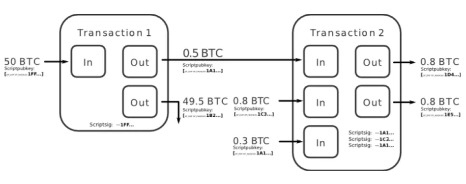

> *作者：not_nothingmuch*
> 
> *来源：<https://spiralbtc.substack.com/p/the-scroll-5-the-many-faces-of-coinjoins>*

“ CoinJoin ” 到底是什么意思？长的答案是：“这要看你的语境。” 而短的回答是：它意味着所有类型的多方交易，因此从技术上说，闪电通道也是一种 CoinJoin 。;-)

## 等输出数额的 CoinJoin

2013 年，Greg Maxwell 在 Bitcoin Forum 论坛上发出了一篇帖子：“ [CoinJoin： 从真实世界出发的比特币隐私性](https://bitcointalk.org/index.php?topic=279249.0)”。虽然这并不是有史可考的第一个使用抵御盗窃的多方参与交易来打破 “输入所有权同一性” 启发式分析的想法 <a href='#note1' id='jump-1-0'>1</a>，但就我所知，它是第一种要求输出面额相同的多方交易的具体描述 <a href='#note2' id='jump-2-0'>2</a>：

> *为了使用这种办法来提高隐私性，N 名用户要同意一个统一的输出面额，然后提供大于等于这个价值的输入。这样的交易会有相同面额的 N 个输出，而且可能会有最多 N 个找零输出，因为某些用户所提供的输入的价值可能超过了输出的面额目标。所有用户都会签名交易，然后这笔交易就可以传递出去。（构造交易的）任何时刻都没有失盗风险。*

该文也附了一张图，虽然它的原本 URL 现在已经损坏了，[相关的 Bitcoin wiki 文章](https://en.bitcoin.it/wiki/CoinJoin)中还存有一个副本：

注意，在上图中，地址 “ 1A1 ” 被使用了两次，强烈暗示同一个主体拥有 “交易 2” 的第一个和最后一个输入。该文继续说：

> 在图示中，“交易 2 ” 的输入来自 “ 1A1 ” 和 “ 1C3 ”。假设我们相信 1A1 是 Alice 的一个地址，1C3 是 Charlie 的一个地址。那么，1D 和 1E 这两个输出分别属于谁呢？

这种交易结构的对称性，让相同价值的输出的每一种排列都是同样似是而非的，至少仅仅看交易的表象就是如此。如果将一笔交易视作 “ k-匿名性”论文意义上的 “数据发布”，那么，假设对于这 k 个输出来说，所有的属性（数额和输出类型）都是一样的，那它就满足了 k-匿名性的定义。不幸的是，如我们[上一篇文章](https://spiralbtc.substack.com/p/the-scroll-4-intersection-attacks)（[中文译本](https://www.btcstudy.org/2025/10/24/the-scroll-4-intersection-attacks-on-coinjoin-anonymity/)）所述，它没有充分考虑来自多笔交易（它们如何相互关联）的隐私泄露。

如果我们将整个区块链视作持续不断的数据发布的话，k-匿名性也许是 CoinJoin 隐私性在原则上的合理模拟。不幸的是，因为交易是在一个图结构（graph structure）中相互连接的，所以属性集还必须描述每一个钱币跟图中的其它每一个钱币是什么关系，比如说，某一个钱币是另一个钱币的 “祖先” 在？这可能会首先引发属性数量的平方膨胀，但更糟糕的是，可能的准标识符（quasi identifiers）的数量也会随着属性数量的增长而呈指数增长。如果不考虑一个钱币被创建的语境、以及它被花费或者未来花费它的语境，对具体一个钱币的 k-匿名性是否达到了某个阈值，就不可能作出严谨的陈述。证明 k 值大于某个阈值，即使在相关的准标识符剧增的条件下，在某一些交易图结构中是可以做到的。但是，总的来说，在任何有意义的阈值上，这套理论都很难应用。

## 多方批处理和次级交易模式

Maxwell 的文章显然不止于仅仅提出这种高度对称的方法。文中的另一个例子是，用户们通过聚合多笔独立的支付（或者叫 “次级交易”）、形成批量处理的交易：

> *这种想法可以更加随意地应用。在你想要发起一笔支付的时候，找到同样希望发起支付的人，一起制作一笔合并的交易。这样做并不能提高许多隐私性，但确实会让你的交易体积更小、因此网络负担更小（交易手续费也更低）；额外的隐私性只是锦上添花。*

这就是 “ SharedCoin ” 或多或少实现了东西，虽然 [Kristov Atlas 已经证明](https://www.coinjoinsudoku.com/)，它[并不能提升多少隐私性](https://www.coindesk.com/markets/2014/06/10/blockchains-sharedcoin-users-can-be-identified-says-security-expert)。这一分析背后的想法是，即使一笔批处理交易的输入和输出被混洗了，通过假设每一笔次级交易中的输入和输出或多或少总是平衡的，批处理交易中的输入和输出也常常可以唯一地[分组](https://en.wikipedia.org/wiki/Partition_of_a_set)。输入所有权同一性启发式分析，可以认为是这种广义理论的降级特殊情形，也就是仅对一笔次级交易作分组；这表明，所有东西都相互关联。

LaurentMT 在 “ [Boltzmann](https://medium.com/@laurentmt/introducing-boltzmann-85930984a159) ” 中使用了一种概率性方法，它会考虑什么时候有超过一种分组可以满足前述的平衡要求。通过枚举和考虑不同的可能性，然后将这些计数标准化为一种概率分布，它就产生了一种估计：输入和输出们会有多大概率被关联起来。在这项工作中，考虑到 “ JoinMarket ” 这样的市场还有做市商费用，次级交易可以只是大致平衡。

[Maurer 等人](https://sci-hub.se/https://ieeexplore.ieee.org/abstract/document/8029483)后来的工作，则引入了一种对重复计数的纠正措施：它区分所谓的 “派生次级交易” 和 “非派生次级交易” 配对（mappings，这是他们用于整体上的 “分区” 的术语），并且只统计后面一种。这项工作完全忽略了交易手续费，仅在一种更理想的环境下有用。

虽然一个元素数量为 n 的集合的[分组](https://en.wikipedia.org/wiki/Partition_of_a_set)的总数量 —— 等于第 n 个 “[贝尔数](https://en.wikipedia.org/wiki/Bell_number)” —— 会迅速增长，能够满足数额平衡条件的分组，可能是非常稀少的。迅速增长的空间、从这样广大的空间中找出解的稀疏集合；以为这足以保护隐私，虽然听起来很吸引人，却是不正确的。

这种误解之所以吸引人，在于，它跟 “子集和（subset sum）问题是 NP-完全的（NP-complete）” 密切相关，也就是说，要构造出能够找出一个解的具体子集和，不仅仅跟（举个例子）找出一个具体哈希值的 SHA256 原像一样难，还是[等价的](https://en.wikipedia.org/wiki/Karp%27s_21_NP-complete_problems)。但是，NP-完全性并不保证所有（甚至大多数）子集和问题实例都是困难的。这就是为什么 [Merkle-Hellman 的 knapsack 密码系统](https://en.wikipedia.org/wiki/Merkle%E2%80%93Hellman_knapsack_cryptosystem)会崩溃，而其它 [Knapsack 密码系统](https://en.wikipedia.org/wiki/Knapsack_cryptosystems)则依赖于子集和的困难特殊情形。线性规划（linear programming）常常适合枚举比特币交易的次级交易配对，即使交易的体积相当大。

可以提供有意义确信的东西是，知道求解 *具体的* 次级交易配对是不定的（underdetermined），也即，存在超过阈值的看似有效的非派生的次级交易配对，或者更准确地说，每个输入和输出都许多其它输入和输出同时出现在数量不定、但都同样似是而非、却又不相似的次级交易中，它们分布在整个次级交易配对的范围中。

## PayJoin

至于 “ [Payjoin](https://payjoin.org/) ”，Bitcoin Wiki 将它[描述](https://en.bitcoin.it/wiki/PayJoin)为 “一种特殊的 CoinJoin ”：一笔支付的发送者和接收者都为这笔交易贡献输入。

虽然下面这段来自 Maxwell 文章的、关于多方批处理交易的论述是过于乐观的，但 Payjoin 尝试实现的正是这里的不可区分属性：

> *这样一笔交易，从外部来看，跟通过常见用法创建的交易是 无法区分的。也正因此，如果这些交易变得很广泛，它们甚至可以提升从没用过它们的人的隐私性，因为输入汇集不再是控制权同一性的有力证据。*

这一段论述若要为真，所谓的 “不必要输入启发式分析”【<a href='#note1' id='jump-1-1'>1</a>、<a href='#note2' id='jump-2-1'>2</a>】在这样的交易中必须也为真。举个例子，一笔交易花费了两个钱币，一个面额为 10 ，另一个面额为 4 ，它创建了两个输出，一个面额为 8 ，另一个面额为 6 ；看到它，人们想必会问，为什么不直接使用面额为 10 的钱包创建 8 和 2 ，或者 6 和 4 —— 不管想要支付的数额是 8 还是 6 ，这都足够了。虽然也有例外，但考虑到绝大多数钱包会创建的交易的分布，这样的交易还是不寻常的 —— 通常来说，钱包软件会避免使用不必要的第二个钱币，因为这会导致更高的交易手续费。

这种类型的分析可以延伸到数额属性之外。如本系列的[前前篇文章](https://spiralbtc.substack.com/p/the-scroll-3-a-brief-history-of-wallet)（[中文译本](https://www.btcstudy.org/2025/10/23/the-scroll-3-a-brief-history-of-wallet-clustering/)）简要提到的，“钱包指纹识别” 在钱包聚类分析的语境下，可能并没有得到它应有的充分研究。虽然这还是一个开放问题，但钱包指纹识别似乎可以用来攻击 PayJoin 的隐私性；不过，应该也有办法可以缓解。这就是我们在 “ [PayJoin Dev Kit](https://payjoin.org/) ” 的开发中寻找的东西之一，如果你有兴趣，请[加入我们的 Discord 频道](https://discord.gg/6rJD9R684h)！

另一种描述 PayJoin 这种隐写属性的方式是，如果使用次级交易模型来解读这些交易，就几乎一定会将发送者和接收者的输入和输出都归入同一笔次级交易中。这是因为，支付者和接收者之间的大额净转移会打破 “交易平衡不变性（balance invariant）”，从而，次级交易匹配情形的定义就排除了真实发生的情形。

打破 “次级交易不变性” 有助于隐私性，即使我们假设了一种理论上的 PayJoin 交易聚合机制、让多个发送者和接收者可以合作构造单笔交易 —— 其概率分布绝对不会像 “常见用法” 那样 —— 也依然如此。虽然这样的多方 PayJoin 交易可能无法再称为 “隐写”，因为它们是如此突出，但关于参与者之间支付的信息的却是，依然会让钱币聚类分析难得多。这种活动的内在关联越多，次级交易理论的粗糙运用就越有可能导致聚类分析崩溃。

## 严肃地说：闪电通道也是一种 CoinJoin

在开篇词中，我将这话当成一个玩笑；而且，虽然我在别的地方也这样[说过](https://spiralbtc.substack.com/p/the-scroll-3-a-brief-history-of-wallet#footnote-5-161437359)（[中文译本](https://www.btcstudy.org/2025/10/23/the-scroll-3-a-brief-history-of-wallet-clustering/)），现在，我们还是要稍微更严肃、更全面地考虑一下它，因为它强调了闪电通道还没有得到充分讨论的侧面，并且，在使用更加朴素的思维模式来理解闪电通道的工作原理时，这一侧面并不明显。

一条闪电通道是一个多签名的 UTXO ，由共享这条通道的两方持有。创建这条通道的交易是它的 “注资交易”。一些通道仅由一方注资，但也有双方注资的 —— 也就是在通道的初始状态中，双方都拥有余额。闪电网络协议保证了，在任何一个时刻，通道的任何一方都能单方面关闭它（不依赖于对手方的配合）。关闭通道意味着这个多签名的 UTXO 被一笔交易花费，该交易会在两方之间公平地 —— 根据双方都同意的状态 —— 分割通道资金。支付通道的价值在于，只要双方达成一致意见，就能更新通道内部的余额，并且这种更新是在链外发生的、无需花费这个共享的 UTXO ，也就意味着，这是一种便宜且即时的转移比特币的方法。闪电通道的价值比之更甚，因为它还允许转发支付：通道就是图谱中的边，将一对对连接起来；经过由这些边连接而成的一条路径，支付就能送达，即使路径的头尾之间并无直接的边。

如果一切顺利，通道会被合作关闭。在这种情况下，花费通道 UTXO 的交易只会创建两个余额，就足以结算。单方面通道也能达成结算，但却会揭晓更多信息、形成不一样的链内足迹。我们会暂时忽略这一点。就假设现在是这样一个时刻：我们担心的敌手看不见在链外发生的事情、所有的路由支付都拥有对抗这个敌手的完美隐私性。如果这个敌手只能看到最终在区块链内确认的交易，那么 TA 会看到一笔注资交易花费了一个乃至多个钱币、创建一个多签名钱币（可能还有找零输出）。然后，这个多签名钱币被花掉，产生了两个输出；这两个输出的面额可能跟进入注资交易的输入不同，并且都属于不同的钱包。如果不是中间有个多签名钱包，那么整个过程看起来就有点像一笔 “常规的” 支付交易，或者，如果通道是双向注资的，那就像一笔 PayJoin 交易。

在现实中，任何敌手都能够同时收集闪电网络的 gossip 数据（闪电网络图谱）。支付若要得到路由，节点就必须拥有一个网络图谱视图，这就是 gossip 的作用。公开宣告的通道会将一对节点明确关联起来。虽然多签名钱包的聚类会比我们之前讨论过的更加微妙，你可能会说，一个闪电网络节点的 ID，会关联到 TA 的通道 （U）TXO ，就是一种地址复用；这确实没有夸大太多。对于一笔通道关闭交易的两个输出，有了两个跟节点 ID 相关的集群，那么决定要将这个输出分别分配到哪个集群，是相对简单的，因为其它通道的开启和关闭也会跟其它节点关联起来，而且，每一个集群都可能因为以前或者以后的交易而得到延伸。

换句话说，如果我们坚持认为闪电通道一种奇怪形式的 CoinJoin 或者 Payjoin，那么，从钱包聚类分析的角度看，它的隐私性保证不是很强。请不要误会我的这句话，它讲的不是闪电支付的隐私性 —— 从各个角度看，闪电支付的隐私性都比链内支付要好。但是，我补充的这句话也并不意味着闪电网络的隐私性是完美的。不管怎么说，将闪电通道理解为一种奇异的两方 Coinjoin 交易，以及这样引起的具体顾虑，只跟节点开启和关闭公开通道的链内踪迹有关、跟这些资金可能因为非通道交易输出而被聚类的程度有关。这也是一个很好的例子：跟钱包聚类分析有关的信息也许并不直接记录在区块链，但依然是公开可得的。

## 考虑所有的相关性理论

进一步推广，在每一笔交易内，我们可以将输入和输出理解为在一个带有权重的、完全二分图（[complete bipartite graph](https://en.wikipedia.org/wiki/Complete_bipartite_graph)）中相互连接，甚至把它们理解为一个完整的图（即：也允许展现输入与输入的关联、输出与输出的关联）。这些边的权重表示这两个钱包的相关性。实际上，没有理由自限于单笔交易 —— 所有的钱币，理论上，都跟所有其它钱币有关；这是对钱包聚类分析和交易间相关性的概率概括，而不仅仅是次级交易模型和交易内相关性。

对这些权重的具体赋值，可以根据任何其它理论来进行，比如本系列[前一篇文章](https://spiralbtc.substack.com/i/165670336/intersection-attacks)（[中文译本](https://www.btcstudy.org/2025/10/24/the-scroll-4-intersection-attacks-on-coinjoin-anonymity/)）所提到的 “交集攻击”、外部数据源（比如[泄露的拓展公钥](https://x.com/SamouraiWallet/status/1271155297495781376) <a href='#note3' id='jump-3-0'>3</a>）、KYC 信息以及不公开的聚类标签，甚至是地址复用这样不起眼的事情。

也可以反过来。比如说，如果人们普遍认为 “[CoinSwap](https://github.com/citadel-tech/CoinSwap)  ” 交易模式正在得到采用 <a href='#note4' id='jump-4-0'>4</a>，即使事实并非如此，任何知道该观念已经深入人心、诚心尝试在有关联的图谱中分配权重数字的人，都将被迫考虑这种偶然性、承认一定程度的不确定性，以及在提出相反观点时背负举证义务。 Malte Möser 和 Rainer Böhme 在他们 [2017 年的论文](https://informationsecurity.uibk.ac.at/pdfs/MB2017_AnonymousAlone.pdf)中，估计了一个更为局限的设计的 Coinswap 的使用量上限。Chris Belcher 的 [CoinSwap 设计](https://gist.github.com/chris-belcher/9144bd57a91c194e332fb5ca371d0964)迫使分析将网撒得更广。虽说如此，Coinswap 还没有得到完全实现。也许 P2TR MuSig2 签名算法和多方 ECDSA 签名算法支持会在未来显现出意义，因为即使这些脚本类型没有得到许多使用，所有类型的钱币的可互换性都会提高。所有收到钱币的人都知道这个钱币可能来自一次 CoinSwap（即使概率并不高）—— 这种 “知道” 越是广泛，区块链分析的理论就会变得越弱势。想想这样一种情形：一次网站爆破泄露了家庭住址和比特币支付的信息，而其中一笔支付用到了一个大额的钱币；对于这个钱币的不幸的主人来说，如果这个钱币有可能属于一个 CoinSwap 做事商，那么 TA 会更加安全，即使 TA 从未使用过 CoinSwap 。安全多少呢？取决于这种以为有多普遍。

这就要说到，关于输入和输出相关性的荒谬理论（我甚至会说是宗教理论）也有人提出，比如 [FIFO](https://archive.is/e7FsM)  <a href='#note5' id='jump-5-0'>5</a> 和 “序数理论”。这些模因魔法的不幸后果是，有些时候，这些理论会仅仅因为它占据了人们的头脑、最终塑造了人们的行为，而成为好理论：受到影响之后所留下的交易行为，可以用这些理论来 “正确” 地解释。这就像，如果有人告诉你比特币是隐私的，但没有论证，那么你不该严肃对待；但如果有人断然告诉你比特币无法隐私，你也不应该相信 TA 。到底隐不隐私，主要取决于在商业活动中使用比特币的人是否按照保护隐私的方式来使用它。也许应该称作不幸的是，这（按照保护隐私的方式来使用它）并不容易做到，至少在当前绝大部分钱包软件的状态下，如果你不有意为之，就更难做到，但我感觉，破坏比特币隐私性的最令人尴尬的方式就是 —— 让每个人都因为一些愚蠢的迷信而 “知道” 比特币没有隐私性。

## 下一篇讲什么？

在这篇文章中，我们了解了 CoinJoin 隐私性的更加理论性的一面，因为它跟这个术语的不同概念有关，然后，了解得比 CoinJoin 三明治图更深入一些，从而看出这些想法如何帮助理解更加广义得比特币隐私性。这里采用得理论倾向于强调攻击者得视角，因为，通过理解攻击者的能耐来思考打破隐私性有多么难（容易），然后找出弱点，通常是有用的。虽然在理论层面还有许多东西可以说，下一篇文章将更多关注防御者视角，并讨论在设计一种隐私保护的 CoinJoin 交易结构时面临的一些实践挑战。

## 脚注

1.[这个评论](https://bitcointalk.org/index.php?topic=12751.msg315793#msg315793)是我所知关于这种想法的最早描述。 <a href='#jump-1-0'>↩</a> <a href='#jump-1-1'>↩</a>

2.虽说如此，同一帖子中的[这个更早出现的评论](https://bitcointalk.org/index.php?topic=12751.msg232155#msg232155)，确实提到了输出面额的非统一性，所以，这两种想法的综合似乎在 Maxwell 的帖子之前就出现了。 <a href='#jump-2-0'>↩</a> <a href='#jump-2-1'>↩</a>

3.“只要他们只用过 dojo（就不会有事）” —— 这句话常常被用来表示对用户的诚实性的怀疑，但即便如此，这句话也仅在一个狭窄的技术意义上为真。因为 whirlpool 协议在各种大大小小的标签攻击（tagging attacks）下都很脆弱，而且 “ Samourai ” 自己运行着服务器、最近重新发布的软件又控制着哪个输入能进入一个输出，所以不论是 dojo 用户还是非 dojo 用户，都有许多理由担心他们的 CoinJoin 隐私性。（译者注：Samourai 是一家以 CoinJoin 服务而知名的钱包软件供应商，强调自身的隐私性，但也有人指出他们的服务器会收集用户的拓展公钥，这是明确的有害隐私性的行为。可能正是因此，作者将这个讨论放在 “泄露拓展公钥” 的脚注中。） <a href='#jump-3-0'>↩</a>

4.注意，截至本文撰写之时，依然不推荐在主网上使用。 <a href='#jump-4-0'>↩</a>

5.这份[已经出版的学术成果](https://www.cl.cam.ac.uk/archive/rja14/Papers/making-bitcoin-legal.pdf)似乎严肃表明，在普通法（common-law）的基础上，钱包软件在交易输出的排序上要受到一定的限制。它使用 “精确（precise）” 这个词的准经验用法来给这个荒谬的主张辩护，我只能称之为巧舌如簧。如果这能成立，那就意味着这些年来出版的所有其它关于找零识别启发式分析的论文都是毫无意义的。而且事实上，作者就是这么说的：“研究金融匿名性却不关注【FIFO 的普通法先例】的人一直都在使用错误的指标。” <a href='#jump-5-0'>↩</a>