> *作者：Justin Moore*
> 
> *来源：<https://www.unchained.com/blog/the-ticket-to-understanding-extended-public-keys>*

如果你正在了解多签名钱包，你可能会接触到 “xpub” 这个词。这个东西 —— xpub（扩展公钥）—— 是比特币钱包软件用来生成比特币的。

扩展公钥是比特币专属的概念，所以，对于刚刚接触比特币的人来说，可能特别难以理解。为了帮助你加快理解，我准备用一个类比来解释 xpub 在单签名钱包和多签名钱包中的作用。这个类比，博过彩的人应该都能理解。

（译者注：扩展公钥的概念来自 BIP32 “确定性层级式钱包”，后者已经成为密码货币钱包的行业标准。只是其他密码货币的用户很少会接触到这个概念，原因包括：使用硬件签名器的习惯、使用多地址的习惯以及密码货币协议对多签名钱包的支持。）

事先声明：但凡是类比，总是无法天衣无缝；这个类比的作用仅仅是帮你理解 xpub 的基本原理以及它的用法。若要一个非常准确的技术解释，没有比《[精通比特币](https://www.amazon.com/Mastering-Bitcoin-Programming-Open-Blockchain/dp/1491954388)》更好的了。

## 一卷彩票

虽然关于 xpub 已经有了很多类比，我还是要提一个新的。大家应该都看过那种彩票卷，在狂欢节、市场或者慈善活动上。我觉得彩票卷就是理解 xpub 的一个很有用的类比。

仔细观察彩票卷，你会发现它是双层的。有人要买一张彩票的时候，组织方就撕下一张来，上面这层的票子（印着 “TICKET”）由组织方留着，而下面这一层的票子（印着 “KEEP THIS COUPON”）就由投彩人留着，作为根据。彩票的价格具体是怎么决定的，对我们这里的解释不重要，重点只是：在某个票子中奖时，投彩人可以通过出示下层这个票子来证明这张彩票是他的。

## 彩票卷遇上比特币

在这个类比中，*上层卷整个就是一个 xpub* ；这个卷上的每一个票子都被你的比特币钱包软件用来生成一个地址。

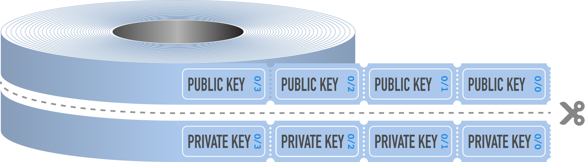

*而下层卷上的每一个票据都是一个私钥*。在彩票卷上，下层的 “KEEP THIS COUPON” 票子可以在你中奖时证明是你买了这张彩票。而在比特币钱包里，你用私钥（签名交易）来证明你对某个地址上的比特币的所有权，并将它们花费出去。

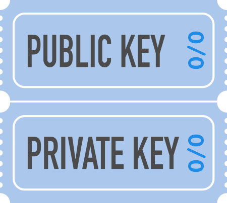

## 硬件签名器与扩展公钥

你可以把比特币钱包（不管是软件钱包还是硬件签名器）想象成有一种能力，可以生成无数这样的彩票卷。只要你有要求，它就会给你提供某一卷的详情，或者是从某一卷上取出一个票子来 —— 只要你能打开钱包、输对 PIN 码。

绝大部分用户在一个比特币钱包中只会使用一 “卷” 密钥 —— 在钱包界面中显示为 “main account（主账户）”。但是，只要你在同一钱包中创建一个新账户，它用的就是另一卷密钥 —— 它的私钥也是由同一个硬件签名器保护的。

## 分享扩展公钥

如果你使用的常规的、单签名的比特币钱包，你的 Xpub 代表的是整整一卷公钥，也就是通往一个账户里所有的比特币地址的路标 —— 当然，用我们的类比来说，它只是彩票卷的上面一层。

如果你用的是多签名比特币钱包，那么每个账户都用到了多个 xpub —— 为了生成一个账户中所有的比特币地址，所有相关的 xpub 你都得知道。

任何人，只要知道了你用来生成一个账户的所有 xpub（不论是一个还是多个），就能立即看到你的这个账户内的所有地址的余额，并且能分析你的花费行为；因此，你应该只跟自己信任的人和软件分享一个 xpub 。

以下是你可能向一个服务商递送 xpub 的行为： 

- 为了建立一个联合保管的多签名钱包（比如在 “Unchained” 软件钱包）
- 为了在一个第三方平台上显示你的比特币余额（比如，一个投资组合管理器）

虽然你分享一个 xpub 并不会交出花费你的比特币的权限，但你应该确保这个组织是信得过的，并且由严格的隐私策略。

## 单签名钱包中的扩展公钥

在一个单签名钱包中，一个 xpub 可以生成你想要的任意多个地址，这些地址在表面上看起来毫无关联，它们的关联只有你（以及知道你这个 xpub 的人）知道。比特币网络上的其他人不会知道它们有这些关联。

还是类被。比特币软件钱包就相当于一个售票机，你把一个 xpub（彩票卷的上层）放进去，每次你启动它，它都会吐出一张票子；每当你收取一笔比特币交易，它都会吐出一张新的票子。

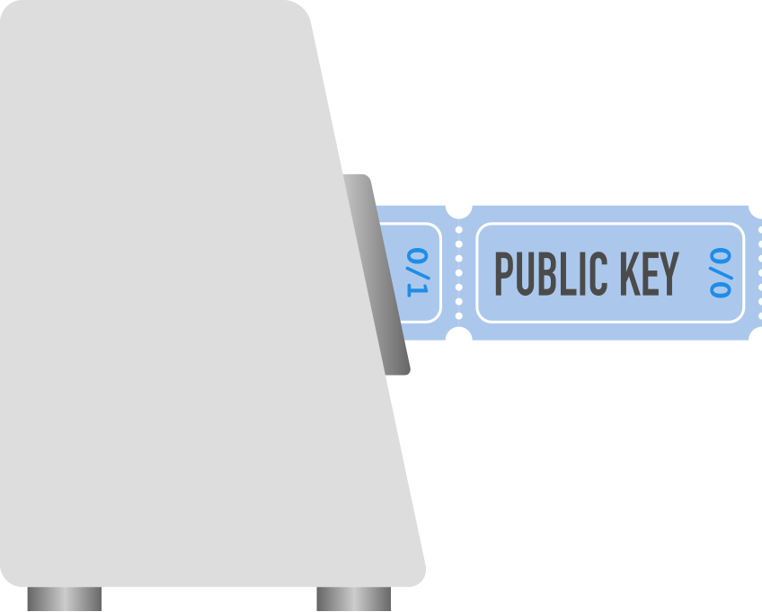

在软件钱包中，第一个吐出来的票子（第一个出现的公钥）的编号是 “0/0”，这个公钥会打包成更容易识别的格式 —— 比特币地址，比如 1BvBMSEYsfWetqTFn5Au4m4GFg7xJaNVN2 。

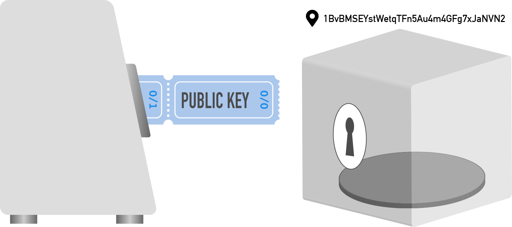

这个地址就能用来接收比特币，因为钱包（不论是硬件签名器还是钱包软件）会保护这个地址对应的私钥（就是那张 “KEEP THIS COUPON” 票子）。

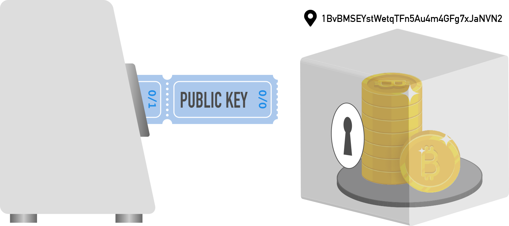

当下一次你需要收取一笔交易时，这个售票机（钱包软件）就会吐出一个新的公钥、形成一个新的收款地址，编号为 “0/1”。

从一个旧地址花费之后，出于安全性和隐私性考虑，不应该再次使用它。

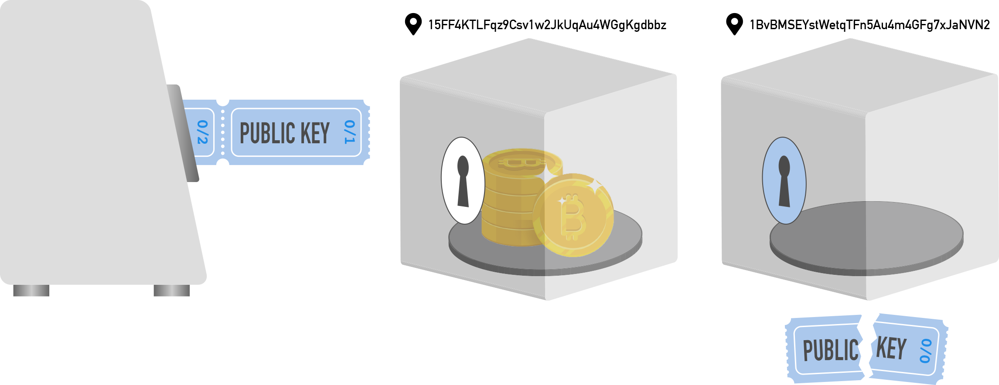

## 多签名钱包中的扩展公钥

钱包软件的单签名钱包模式通常会向用户隐藏 xpub ，但使用多签名钱包时， xpub 就会从幕后转到台前（[为了额外的安全性，你确实应该使用多签名钱包！](https://unchained.com/blog/why-multisig/)）。 处理多个 xpub，是搭建一个多签名钱包的必经阶段，并且你需要保管这个钱包的所有相关 xpub，以确保意外发生的时候你能复原出这个多签名钱包。

假设我们要创建一个 2-of-3 的多签名钱包（总共使用 3 个密钥，凑齐其中 2 个是签名交易的充分必要条件）（[Unchained 的联合保管金库模式](https://unchained.com/vaults/)也使用这种配置）。在创建这种多签名钱包时，我们需要使用 3 卷公钥（3 个 xpub）。

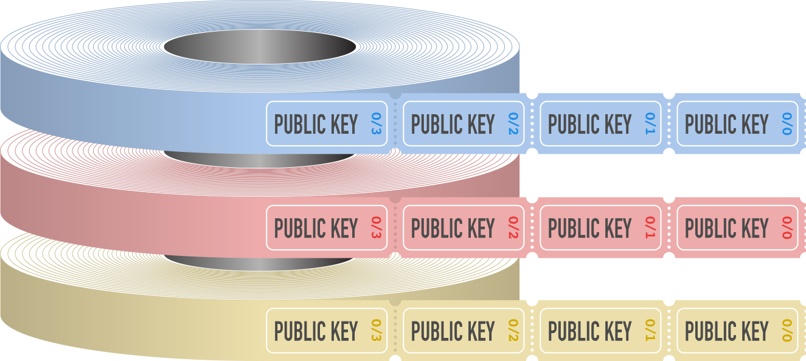

在这个多签名钱包中，3 卷公钥（3 个 xpub）会一起用于生成钱包中的地址。这就相当于把 3 卷公钥（3 个 xpub）同时放进一种更加复杂的售票机。

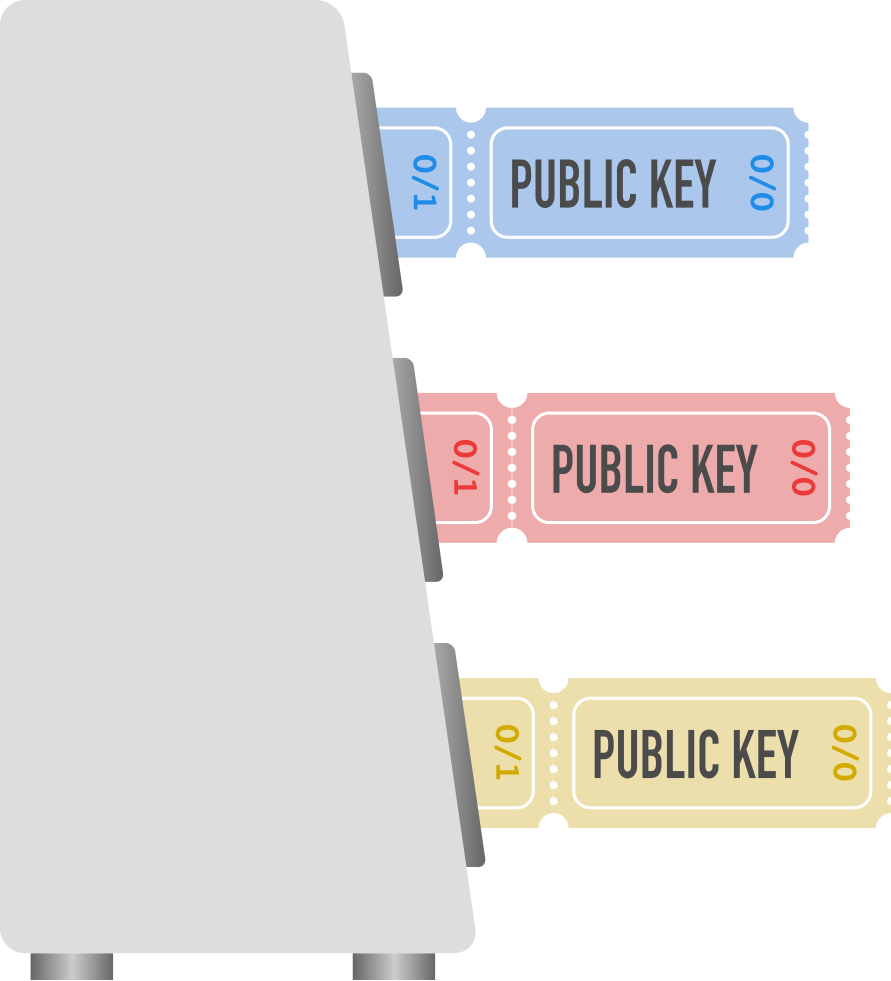

要生成第一个多签名地址时，售票机（你的钱包）会吐出各卷公钥的第一个票子（编号为“0/0”），然后，使用更复杂的流程，基于所有三个公钥产生出一个地址。

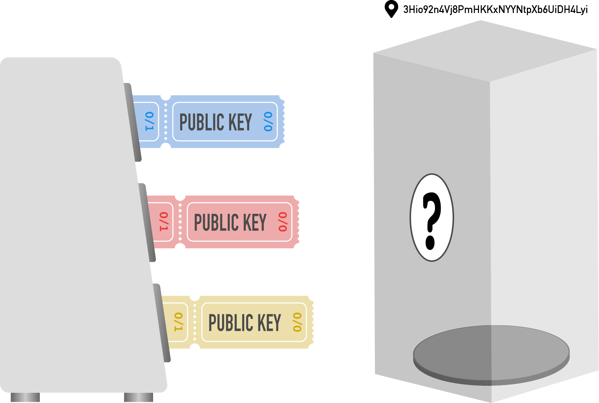

构造好这个地址之后，你就可以向这个地址存入比特币，就跟其他比特币地址没有区别。

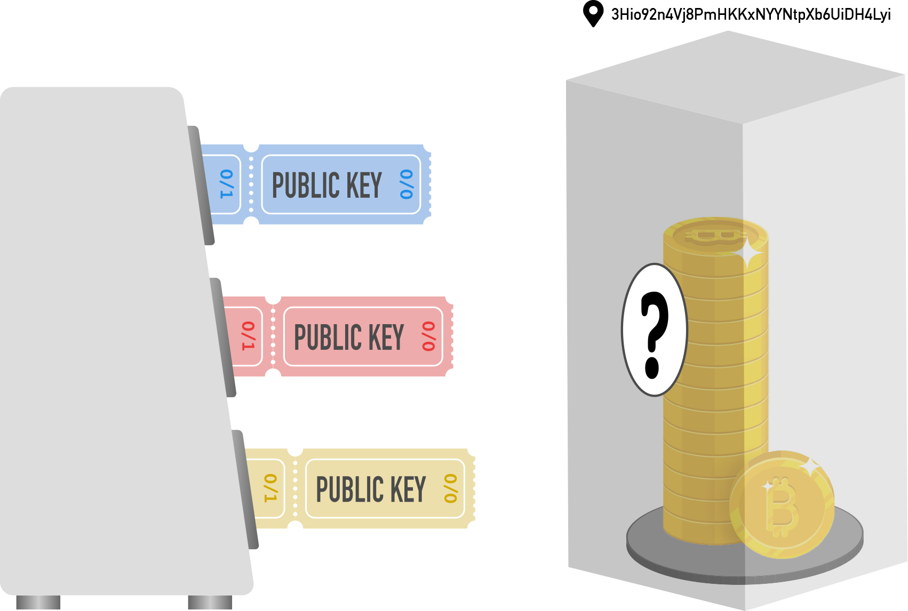

要从这个 2-of-3 多签名地址中花费比特币，你需要证明对这些比特币的所有权，办法就是使用对应的 2 个私钥（2 张 “KEEP THIS COUPON” 票子）来签名交易。 同样地，比特币从这个地址花费之后，你也就不该再次使用它（来接收比特币）。

下一次，你需要一个新地址时，机器会使用下一组三个公钥（各卷公钥上编号为“0/1” 的公钥）来生成新地址。任何人，只要拿到了这三个 xpub ，就能按完全相同的顺序得到完全相同的地址。

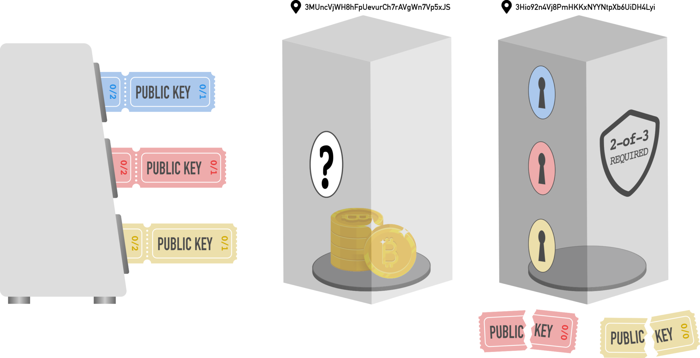

## 亲身实践扩展公钥和多签名钱包

希望这篇文章能帮助你理解 xpub 的实质，以及它如何用来生成一连串的地址（不论是单签名钱包，还是多签名钱包）。

当然，纸上得来终觉浅。你可以试着[用 Unchained 软件建立一个多签名钱包](https://www.youtube.com/watch?v=tEopXRuzEcQ)。[我们的指引](https://www.youtube.com/watch?v=cOZfTP2z-IY)会带你走完整个流程：从硬件签名器中导出 xpub 、导入 xpub 到 Unchained 软件，然后存入你的第一笔资金。

（完）

