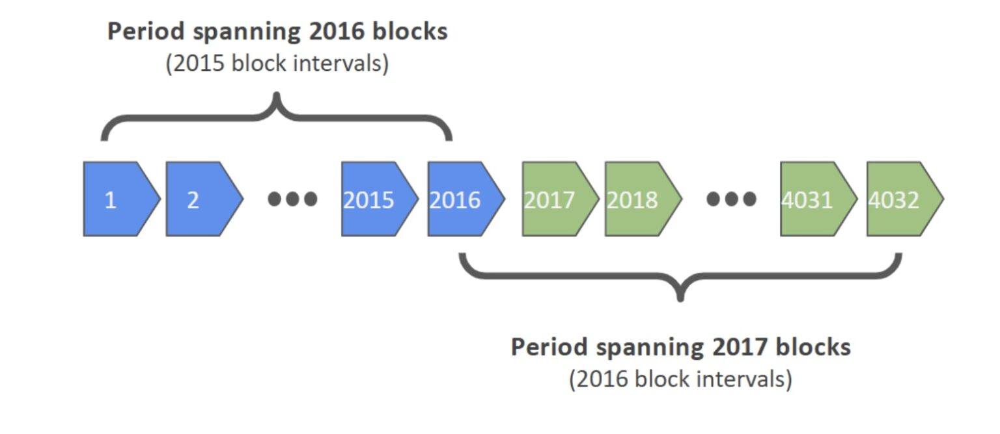
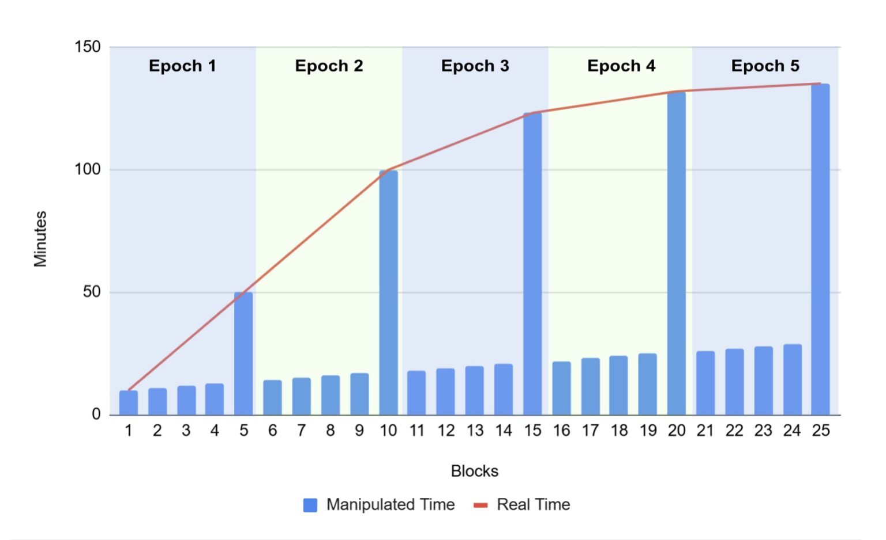

> *作者：BitMEX Research*
> 
> *来源：<https://blog.bitmex.com/the-timewarp-attack/>*


**摘要**：我们分析了比特币的一种安全漏洞，称作 “时间扭曲攻击”。这种攻击允许占据算力多数的敌意矿工操纵区块时间戳，从而可以任意调降出块难度、以至于几秒钟就可以挖出一个区块。这一弱点首次被发现是在大约 2011 年，可以通过 “共识清理软分叉” 来修复。我们还探讨了所提议的修复措施的部分细节。


2025 年 3 月 26 日，比特币开发者 Antoine Poinsot 公开了一个新的[比特币升级提议](https://github.com/bitcoin/bips/pull/1800)。该软分叉提议叫做 “共识清理（The Great Consensus Cleanup）”。这一升级修复了多项比特币协议中存在已久的 bug 和漏洞。其中一个是 “重合交易” 问题，我们在近期一篇[文章](https://blog.bitmex.com/bitcoins-duplicate-transactions/)中已经讨论了。另一个可以修复的 bug，也是更加严重的一个，叫做 “时间扭曲攻击”，就是我们这篇文章的主题。

## 比特币的区块时间戳保护规则

在我们讨论时间扭曲攻击之前，不妨先回顾以下当前的时间戳操纵保护[规则](https://blog.bitmex.com/bitcoins-block-timestamp-protection-rules/)：

- 过往时间中值（MPT）规则：一个区块的时间戳必须大于过去 11 个区块的时间戳的中值。
- 未来区块时间规则：根据 MAX_FUTURE_BLOCK_TIME 常量，区块的时间戳不能超过本地时钟 2 小时以上，这个  “本地时钟” 是来自节点的对等节点的当下时间的中值。（译者注：此一实现的细节似乎已经更改。）另一个保护装置是，来自对等节点的时间，与节点的系统时钟的时间，相差不能超过 90 分钟。

MTP 规则是为了确保区块的时间戳不会倒拨到许久以前；未来区块时间规则用于防止时间戳拨到太遥远的未来。请注意，类似于未来区块时间规则的做法不能用来防止区块时间戳倒拨，因为这会影响初始化区块链同步。时间扭曲攻击涉及到假的时间戳，以及倒拨到许久以前的时间戳。

## 中本聪的 “差一错误”

在比特币中，一个难度调整周期的长度是 2016 个区块；配合上 10 分钟的出块时间目标，意味着一个周期大约长两个星期。为了计算[挖矿难度的调整量](https://blog.bitmex.com/mining-incentives-part-1-the-difficulty-adjustment-and-mining-profits/)，协议会计算最近一个难度调整窗口的第一个区块和最后一个时间戳的差值。在由 2016 个区块构成的窗口中，包含了区块间 的 2015 段出块间隔（没错，就是 2016 减 1）因此，合理的挖矿目标时间应该是 60 秒 * 10 分钟 * 2015 个间隔，也就是 120 9000 秒。然而，比特币协议使用的间隔数量是 2016，使目标时间定义成了 120 9600 秒。这就是一个差一错误。这是一个很容易犯的错误，中本聪似乎搞混了区块数量与区块间隔的数量。

**中本聪的代码**

```c
const unsigned int nTargetTimespan = 14 * 24 * 60 * 60; // two weeks
```

<p style="text-align:center">- 来源：https://sourceforge.net/p/bitcoin/code/1/tree//trunk/main.cpp%23l687 -</p>


这个错误让目标时间比应该的长了 0.05%。因此，比特币的目标出块间隔并不真的是 10 分钟，而是 10 分钟又 0.3 秒。这个 bug 并不那么要紧，因为自比特币启动一来，出块间隔平均值是 9 分钟又 36 秒，远远低于 10 分钟。这是因为自 2009 年以来，平均来说挖矿算力一直在增长。这也是为什么最近一次比特币货币增发减半发生在 2024 年 4 月，而不是预期的 2025 年 1 月。我们赶在了日程表前面。不管怎么说，中本聪犯的这个 0.3 秒的错误在宏观层面上是无关紧要的。也许许多年以后，当比特币的价格和哈希率都停止增长的时候，这个 bug 会让我们回到预想的货币发行日程表。



虽然 0.3 秒的 bug 自身并不算什么，一个相关的问题就变成了可以说严重的漏洞。难度调整量的计算基于每一个长为 2016 个区块的窗口中的第一个区块和最后一个区块。这也是不对的，从我们的视角看，合理的周期应该是本窗口最后一个区块与上一个窗口的最后一个区块的差值。这显然是计算难度调整周期长度的最符合逻辑的方式，关键之处是它会让时间区域与不同的难度调整窗口重叠。如果一开始就是这样做的，那么 2016 也会成为用于计算目标出块时间的正确间隔数量。

也许，中本聪犯下这个错误的理由在于，他必须考虑第一个难度调整窗口 —— 没有更早的难度调整窗口，也就无所谓上一个窗口的最后一个区块。

## 时间扭曲攻击

对比特币的时间扭曲攻击第一次被发现是在 2011 年，也利用了中本聪在难度计算中的错误。为了理解攻击，我们假设挖矿是 100% 中心化的，所以矿工可以设置协议所允许的任意时间戳。在攻击中，对挖出的所有区块，矿工都将时间戳设为比上一个区块多一秒，因此区块链的时间是向前的，也满足了 MTP 规则。要想时间戳挪动得尽可能慢，矿工可以为 6 个一组区块使用完全相同的时间戳，然后为下一组使用增加了一秒的时间戳，以此类推。这意味着每挖出 6 个区块，最新区块的时间戳只会正着往前拨动一秒。

这种攻击意味着，区块链最新区块的时间戳会逐渐落后于真实时间，而且，由于时间戳差值太小，难度就会上升，让挖矿变得越来越困难。但是，我们继续给攻击加料 —— 在每一个难度调整窗口的最后一个区块，矿工将时间戳设为真实世界的时间数值。到了下一个区块，也就是下一个难度调整窗口的第一个区块，矿工又将时间倒拨，拨到仅仅比上一个难度窗口的倒数第二个区块多一秒。这依然满足 MTP 规则，因为一个异类并不影响过往 11 个区块的时间戳中值。

在发动这样的攻击的时候，第一个窗口的难度并不会受影响。然而，在攻击开始的第二个难度调整窗口之后，难度就会下降。然后矿工就可以用极快的速度创建区块，也许能创造大量的比特币，甚至可以全部卖出获利。

### 精心设计的图解

因为一个难度调整窗口是 2016 个区块，所以很难在一张图中演示这样的攻击。因此，我们设计了如下场景来解释时间扭曲攻击。

- 每一次难度调整窗口只有 5 个区块
- 目标出块间隔是 10 分钟
-  MTP 规则只考虑过去 3 个区块
- 每一个区块的时间戳都只多 1 分钟，除了每个窗口的最后一个区块，它会使用真实时间



<p style="text-align:center">- 图解时间扭曲攻击 -</p>


如上图所示，有两种线条：

1. 红色曲线表示真实时间，在每一个难度调整周期的最后一个区块，与表示区块时间戳的蓝色直方线相交。这条曲线会变得越来越平缓，因为矿工的出块速度（随着难度降低而）越来越快。
2. 蓝色的直方线，表示被操纵的时间戳。

### 时间扭曲攻击的计算

下图展示了在最极端的情况下，矿工使用时间扭曲攻击可以让挖矿难度多么快速地下降。

| 难度调整窗口数量 | 难度下降幅度 | 累计难度降幅 | 出块间隔（分钟） | 单窗口时长（天） | 累计时长（天） |
| ---------------- | ------------ | ------------ | ---------------- | ---------------- | -------------- |
| 1                | None         | None         | 10.00            | 14.00            | 14.00          |
| 2                | 2.0x         | 2.0x         | 10.00            | 14.00            | 28.00          |
| 3                | 2.5x         | 5.0x         | 5.00             | 7.00             | 35.00          |
| 4                | 2.7x         | 13.5x        | 2.00             | 2.80             | 37.80          |
| 5                | 2.8x         | 37.4x        | 0.74             | 1.04             | 38.84          |
| 6                | 2.8x         | 104.7x       | 0.27             | 0.37             | 39.21          |
| 7                | 2.8x         | 294.1x       | 0.10             | 0.13             | 39.35          |
| 8                | 2.8x         | 826.8x       | 0.03             | 0.05             | 39.39          |
| 9                | 2.8x         | 2325.6x      | 0.01             | 0.02             | 39.41          |
| 10               | 2.8x         | 6541.3x      | 0.00             | 0.01             | 39.42          |
| 11               | 2.8x         | 18398.0x     | 0.00             | 0.00             | 39.42          |

注意：协议所允许的单窗口最大难度调整幅度是 4 倍，但上图并没有达到。

单周期的难度调整降幅只稍微高于 2.8 倍。这是因为随着每一个周期的时长变得越来越短，难度下降得也越来越慢。

在上表的第 11 个窗口，也就是攻击发动后的第 39 天，一秒钟可以生产超过 6 个区块，准确来说是 10.9 个。这时候，分配给区块的时间戳的作用就发生了变化。根据 MTP 规则，每 6 个区块，时间戳就必须正着往前拨，最小的增量是 1 秒钟。因此，这时候，基于我们理解，时间戳的移动会快于真实时间的移动，区块链时钟会开始趋向真实值，但依然会落在真实时间的后面。除此之外，攻击可以持续，直到难度降低到不能再低（到达允许的最小值）为止。

### 攻击的显著性

虽然理论上这种攻击是毁灭性的，但真要发动它也面临一些困难。执行攻击可能需要占据大多数算力。只要有诚实矿工发布诚实的时间戳，攻击的难度就上身。MTP 规则和来自诚实矿工的时间戳可能会限制恶意矿工的时间戳倒拨的程度。此外，只要诚实矿工生产出了任何一个难度调整窗口的第一个区块，攻击在该窗口就不会生效（会暂停）。另一个会让攻击难度上升的缓解因素是，这样的攻击对每一个人都是可见的。时间戳对所有人都是可见的；而在难度真的下降之前，需要操纵时间戳长达 4 个星期；我们也许能够在此期间推出一次紧急软分叉来阻止它。

## 解决方案

修复这个漏洞不难，虽然可能需要一次软分叉协议变更。改变难度调整算法、计算另一个 2016 个出块间隔的区块时间戳差值、完全修复差一错误，可以直接修复问题，但是非常复杂，可能需要硬分叉。另一种修复方法是摒弃 MTP 规则、要求每一个区块的时间戳都必须大于上一个区块的，虽然这可能意味着时间戳会跑到真实时间前面去，而且也意味着使用自己的操作系统时钟的矿工会吃亏，因为其他矿工都把时钟拨快了几秒钟（从而他的时间戳就成了无效时间戳）。

幸运的是，还有一种非常简单的解决方案。为了防止时间戳攻击，我们只需让难度调整窗口的第一个区块的时间戳不能比上一个窗口的最后一个区块小太多。这个限度的具体数值（分钟数）一直在被讨论，人们的提议从 10 分钟到 2 小时都有。从缓解时间扭曲攻击的角度看，不论哪个似乎都可以。

Poinsot 的共识清理提议的当前版本决定使用 “[2 小时](https://delvingbitcoin.org/t/great-consensus-cleanup-revival/710/67)”。2 小时只是一个难度调整窗口目标时间的大约 0.6%，因此，操纵难度调降的能力会大大受限。我们已经总结了关于宽限期长度的讨论：

**10 分钟**

支持意见：

- 此数值有非常吸引人的特性：它刚好对冲了差一错误的影响。如果有人发动攻击，效果会刚好被中本聪的错误抵消。

反对意见：

- 如果一个矿工使用真实时间来设定时间戳，有变成无效区块的额外风险。
- 这个规则是更为巨大的协议变更，可能在常规情形中比 MTP 更为严格，增加额外的复杂性。

**2 小时**

支持意见：

- 这个宽限期足够长，尽可能降低了意外开采出无效区块的风险。
- 这是 Fabian Jahr 在测试这一提议时为 testnet4 选择的数值。
- 这个数值匹配了未来区块时间戳规则，因此总是允许矿工在一个区块内纠正最大允许未来时间错误。
- 相比于当前的规则集，这是一种更加保守的变更，可能比常规情况下的 MTP 规则更轻松

反对意见：

- 这依然允许发动攻击的矿工在每个窗口中将难度调降大约 0.6%；不过，这会是一次性的变更，不能倍乘。

（完）