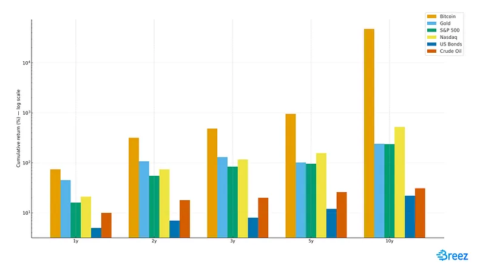

> *作者：Roy Sheinfeld*
> 
> *来源：<https://blog.breez.technology/the-utility-of-bitcoin-moving-value-like-information-2513eae84676>*

如果你认为技术发展的轨迹就像宿命，那也不能怪你。在过去数十年中，我们看到了个人计算机、互联网、移动设备依次兴起，而现在，出现了比特币。

人们已经充分认识到，比特币是最好的资产。这只关乎你的金融知识素养，如果你可以阅读图表，那证据就是很清楚的。

- 投资回报率比较（2015 ~ 2025）：比特币 vs. 主要资产；Horizon 计算
资料来源：CaseBitcoin & Market Data (2025)【制图：<a href="https://chatgpt.com/">ChatGPT</a>】 -

不那么明显的是比特币的功用，以及在未来的数十年中，它会如何塑造我们的经济生活。

除了是一种资产（这正在获得最多的关注和理解），比特币还是一种转移价值的方法。这是它的核心功用。因为它是一种被设计成在互联网上生存、服务于互联网的货币，零售行业的采用可能要在它成为互联网行业的主流 *之后* 才会到来。那么它如何在互联网上成为主流呢？通过将价值传输商品化 —— 让任何人都能随时随地、为任何目的转移价值，无需中介。

转移价值是我们生活的一个无比重大的部分，扩大这个领域的可能性就意味着改变我们的行为、塑造我们的社会。当比特币用于转移价值，边界将消失、传统机构（比如银行）会萎缩，而新的联系会萌芽，就像春天一样。这种转变的规模将堪比互联网自身。

实体书籍很难获得，也很容易查禁（有时候会被焚毁）。而互联网解放了信息，让多得多的人能够获取比以往时候的人多得多的思想。传统的货币被锁在围墙花园和受到市场参与者偏爱的路径里。比特币则代表着这种系统的终结、另一种系统的起点。

**互联网杰解放了信息；比特币解放了价值。**

## 支付 不等于 价值传输

要了解当前这场转型的潜力、把它跟鼓吹比特币的陈词滥调区分开来，请把它理解成一场范式转移：从基于法币的支付范式，转变为基于比特币的价值传输范式。这听起来抽象，但实际很简单。

首先，回顾一下我们都熟悉的东西：支付。传统的**支付是 “结算债务的指令”**，这是职业经济学家们不断[重复](https://doi.org/10.1016/j.jfi.2008.09.001)的定义。如果某人要卖给你一杯咖啡，或者帮你理发，那么你就欠他们一些东西，然后通过支付金钱，你就偿还了这笔债务。请注意，在现实中，给他们支付需要指示中介 —— 银行、手机 app、信用卡、中间人 —— 来实际转移价值。

这跟价值传输完全相反。两者有两个关键区别。首先，如我们提出的概念，价值传输是直接的。价值传输不是一个让中间人来执行某个动作的指令，它就是这个动作本身。其二，价值传输不需要结算债务。支付是一种交换条件（quid pro quo），价值传输则是东西本身。你可以随心所欲地发送价值，尽管这可能是一场买卖，但并不必然如此。

现金（cash）让支付和价值传输之间的区别更加明显。如果你使用现金给某人支付，你并不是在申请许可。你就是把价值从一个人手上交到另一个人手上。而现金也能做到比结算债务更多的事，也即，它不仅仅能用于支付。在街头艺人的帽子里放一些零钱，或者给你的小孩零花钱，都是简单的价值转移，无需先有一笔债务。你可以用现金来 “推送” 价值，而不是只能用它来交易。

- 一个人向另一个人推送价值 —— 一种老派的方法。【制图：<a href="https://chatgpt.com/">ChatGPT</a>】 -

只不过，现金正在被金融当局[边缘化](https://www.ecb.europa.eu/stats/ecb_surveys/space/html/ecb.space2024~19d46f0f17.ga.html)，而且很不适合我们的电子世界，所以我们正在失去传输价值的能力。我们信任这些第三方中介，比如银行、信用卡公司、金融服务提供商，会尊重我们的支付指令并满足我们的请求，但支付指令也常常被拒绝或推迟。

更重要的是，这些支付指令被限定在预先定义好的模式上、受到这些中间人的数据库结构的支配（例如，顾客给商家支付、雇主给雇员支付、一个银行账户给另一个账户支付（*假设* 这些银行使用同一种电汇协议）。这可能听起来有点夸张，但你想想看 Uber、OnlyFans、AirBnB 和 Spotify 这样的平台。从表面上看，他们看起来全是去中心化的：平台知识连接服务供应商和顾客；但是两者之间的支付却都要走平台预先决定的路线、路上遍布贪婪的中间人 —— 银行、金融科技 app、信用卡公司，等等。每多一个中间人，就多一部分费用、多一些故障概率，以及权限摩擦、监管，等等。

这跟价值传输形成鲜明对比。简单来说，价值传输浓缩了现金支付的免许可性、即时性和灵活性，而且没有需要持有和转移实体物件的约束。

但是，在电子世界中，如何重新设想出一种现金？如何从支付的局限性中走出、获得价值传输的力量？如果我们有一种办法可以点对点地发送和收取电子现金 ……

比起电子支付，比特币更好编程、更灵活、更易于采用。比特币让用户可以存储和转移价值，就像用手机来存储和分享一张截图一样流畅和简单。通过将价值处理为另一种形式的信息，比特币为特定用法的整个生态系统开启了经济活动的新范式。

没错，只能是比特币。

## 只有比特币可以协助价值传输

价值传输 —— 发送者直接向接收者移动价值 —— 代表着对传统支付范式的颠覆。那么，为什么金融科技产业无法做到呢？这不正是 “稳定币（stablecoins，尝试与法币保持汇率稳定、靠区块链网络来转移的 token）” 的目的吗？为什么比特币是基于价值传输的经济体的必要基础？

简短的答案是：支付已经深度嵌入的法币系统的架构中，也包括金融科技产业。

一笔金融科技支付设计无数的中间人。每一个中间人都要从这笔交易中赚取回报，他们需要一种计费模式。而他们选择了基于离散的支付，因为这是受到监管的汇款公司可以合法采用的做法。感谢 “KYC（了解你的客户）”、“AML（反洗钱）”和风险评估，汇款公司成了一门昂贵的生意，所以他们的手续费也相对比较高。

除了开销，中间人也必然会带来摩擦。每一个中间人都受制于监管约束，而且这些约束在不同的国家和司法辖区还有许多不同，这就限制了他们的市场和触达能力。他们还有额外的商业考虑，比如某个领域的大客户因为另一个领域的无关交易而取消业务的风险。而且，这些支付的可编程性也不会超出这些中间人可以合法采用的范围，并且它们既不是不可逆转的，也做不到即时交付。这些中间机构可以等到闲暇时再处理这些支付，而支付者也通常可以在时候撤销支付。

稳定币经常被吹捧为一种解决方案，但仅仅是将一种基于法币的承诺替换成另一种。如 MiCA 和 GENIUS 法案所示，稳定币在通货管制之下是非常脆弱的。一种稳定币可能在今天能用于跨国交易，但下个季度就不行了。因为新的监管法律，USDT 和其它 9 种稳定币在 2025 年开头就从欧洲的交易所下架了。稳定币的发行者跟金融科技供应商面临相同的外部顾虑，而且他们也都只在权威机构允许的时候才能编程。稳定币只是通过区块链有色眼镜看到的法币。实际上，稳定币和金融科技产业都只是这只传统支付猪唇上的电子口红。

- 没错，稳定币和金融科技都只是这只传统支付猪的电子口号【制图：<a href="https://chatgpt.com/">ChatGPT</a> 和 <a href="https://www.flickr.com/photos/empics/2846078511">Mick Coulas</a>】 -

比特币会在金融科技和稳定币失败的地方成功。那些昂贵的中间商要求支付，比特币却支持价值传输。他们的操作性约束会限制访问和用法，**比特币则是一种开放的、去中心化、中立的货币网络，为任何时区、任何地方的任何人服务**。他们会受到监管机构的审查、成为地缘政治的棋子，比特币却提供尽可能少的监管踪迹，而且天生不隶属于哪个司法辖区。当他们限制可编程性来保护已经建立的范式和特权时，比特币哺育了创新以及这些创新所需要的可编程性。

如果我们能够回到互联网诞生的时刻，设计一种专门为电子时代而优化的货币，那么设计出来的东西将与比特币相似。它 *就是* 比特币。

## 比特币无处不在

App（应用程序）是变革的载体。它们是我们的稳定数据流的节点，也是重要的工具，改变了我们工作、迁徙、恋爱和思考的方式。App 定义了我们人类正在适应的电子环境，我们也开发 app 来适应我们的环境。价值传输使支付相形见绌，而 app 就是价值传输的管道。

为了理解 app 如何集成及培育价值传输，请回想数码相机的演化。第一款 “没有胶片” 的相机在 1970 年代中期进入市场，但在接下来的 20 年里，它们只是单一用途的设备。甚至连早期的手机上的摄像头也 “仅仅” 只是相机。它们能够用来拍照，但也仅此而已。

数码相机可以做的事情以及我们跟它们的关系，在 2007 年，随着第一台 iPhone 的发布而产生了革命。它开始不仅仅是一台相机了，相机与 app 的结合改变了一切。开发者们很快集成相机到他们的 app 种，让用户能够拍照片、修改照片、分享照片。

数码相机与 app 的协同改变了我们的现实和我们的行为。TikTok（抖音）、Instagram 和 Pokemon Go 这样的 app，让 20 年前看起来荒诞不经的动作成为主流（比如，给汉堡包拍照、在公园里追逐看不见的妖怪、把自己呛到晕过去，等等），甚至成为人们梦寐以求的东西。通过手机 app 和照片，我们持续地记录自己的生活、欣赏其他人的生活。甚至 Meta 公司的 AI 眼镜，基本上也只是连接在一个万能应用程序上的相机。

比特币做的事情是将价值传输商品化，让它具有通用性和自由适应性，就像手机上的数码相机。开发任何类型 app 的任何开发者都可以集成价值传输。即时通信 app 可以让用户在自己的消息种附加价值。社交 app 可以让用户筹集资金和分摊账单，就像点赞一样简单。开发一个平台 —— 比如 Uber、Spotify、AirBnB、OnlyFans —— 不再需要几百万美金，也不需要在围起来的支付花园的迷宫中穿行；任何开发者都能开发出来。

支付需要银行家和律师。商品化的价值传输只需要比特币和定法这。

比特币正在从它的青春期走向壮年。具体来说，比特币需要闪电网络来提高吞吐量并加强它的互操作性。在这一方面，闪电网络需要找准自己的位置，成为基于比特币的价值传输的[通用语言](https://bitcoinmagazine.com/technical/lightning-is-the-common-language-of-the-bitcoin-economy)（[中文译本](https://www.btcstudy.org/2025/06/12/lightning-is-the-common-language-of-the-bitcoin-economy/)）。

但我们已经做到了。一个由许多比特币子网络 —— 包括 Spark、Ark、Liquid、Fedimint、Botanix 和 Cashu —— 组成的生态系统已经出现，每一个自网络都有独特的优势。SDK 现在已经可用，任何开发者都能将价值传输特性添加到自己的 app 中。用数码相机的类比来说，现在就是 2007 年，iPhone 第一次面市的时刻，也是开发者们开始跟相机 API 玩耍的时刻。

这是一个机会窗口。技术已经成熟，但市场还没有给这场转型定价。价值即将能够像信息那样移动。如果你想先人一步预测未来，现在已经太晚了；但如果你想利用这场变革，却还来得及。**基于比特币的价值传输与 app 的融合是无可阻挡的，因为它就像给智能手机加上一个摄像头**。

## 给后人留下传奇

- 当价值能够像信息那样传递，所有事情都会改变。【制图：<a href="https://gemini.google.com/">Google Gemini</a>】 -

支付是我们这个时代的便携录像机，是下一种即将过时的技术。即将开始的新时代会有质的不同，就像 Dorothy 走出她的只有黑色和白色的世界，走进[五彩斑斓的 Oz 国](https://youtu.be/x6D8PAGelN8?t=37)一样。**当价值能像信息一样自由流动，经济产业会发生变化，社会也会随之发生变化**。国界变得更不重要。财富和价值的流动将像微风（breeze）（此处是一语双关，“Breeze” 是作者所创办的企业的名字）。跨越政治和阶级障碍的全球交互将从特殊变为寻常。

万事俱备。比特币正在迅猛成长、打败其它资产。闪电网络允许任何一个比特币端点跟另一个端点交行是。出现了多种多样的协议来服务不同用法和偏好。开发者正在探索能够简化集成比特币价值传输特性的开发工具，他们也正在彼此切磋应用和利用价值传输功能的新方法，这些方法将让他们的应用像 ChatGPT 和谷歌地图一样不可或缺。

我们正生活在一个时代的末端，我们的子孙会认为这是原始时代，就像电力和自来水发明以前的世纪。我们也生活在另一个时代的开端，他们会认为那是天翻地覆的时代，就像文艺复习和互联网的诞生。做一些让他们感到骄傲的事情吧，同时，给他们一些惊讶：没有我们手创的工具，日子究竟是怎么过的呢！

（完）