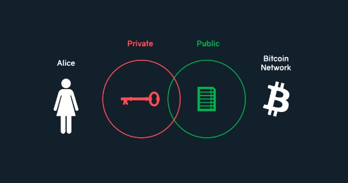
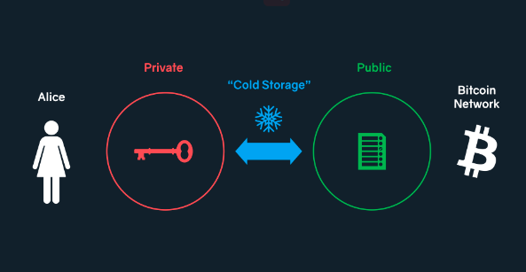
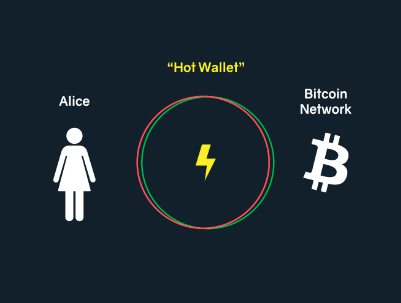
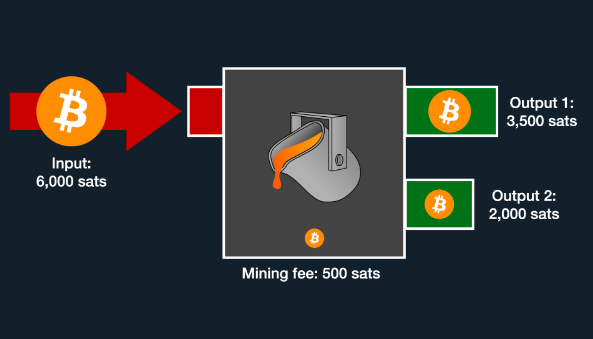
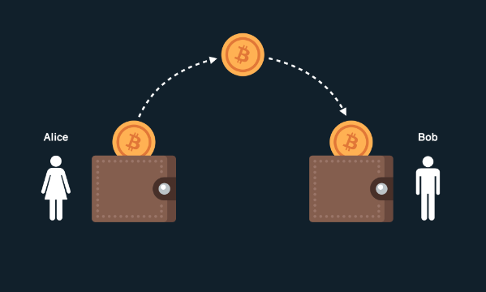

> *作者：Gigi*
>
> *来源：<https://dergigi.com/2022/06/27/the-words-we-use-in-bitcoin/>*
>
> *原文使用 [CC BY-SA 4.0 许可](https://creativecommons.org/licenses/by-sa/4.0/)，只要保持原作者署名并以同样的许可发布成品，即可自由分享和改编。本译本也采用同样的许可。*
>
> *This work is published with [CC BY-SA 4.0 license](https://creativecommons.org/licenses/by-sa/4.0/).*

有句话怎么说都说不够：比特币真让人困惑。但是，比特币毕竟不是戈德堡机械（译者注：一种有意把简单的任务复杂化的机械）。它只是非常陌生，因此不容易理解 —— 它是全新的东西。就像中本聪自己在[某一篇文章](https://satoshi.nakamotoinstitute.org/posts/bitcointalk/167/)中说的，“没有什么能拿来类比”。

因为没有东西可以类比，所以我们都要花很长时间才能理解它的各个方面。如果我们希望言之有物地讨论它，就需要使用词语，而词语正是我在这里想探讨的东西。

我想要讨论两件事：（1）比特币世界里使用的语言；（2）用来攻击比特币的语言。

## Part-1：比特币世界里使用的语言

我们先讲一件事：比特币自始至终都跟数字有关。比特币就跟所有计算器一样，只做两件事：一是获得特定的数字作为输出，运行计算；二是将运算的结果显示给其他人。在比特币里面，这个 “其他人” 就是网络中的另一个 —— 准确点说是另外几个 —— 节点。当我们剥掉外围的东西，我们会发现它的核心就是：数学和消息。

因此，我们必须使用比喻，而且是大量的比喻。钥匙（key）、钱包（wallet）、地址（address）、合约（contract）、挖矿（mining）、粉尘（dust）、叉子（fork）、神谕（oracle）、孤儿（orphan）、种子（seed）、目击者（witness） —— 多得数不完。

但是，关于比喻，有这么一句话，George Box 说的：“所有的比喻都是错的，只不过有些是有用的”。毫无疑问，许多人正是因为这些比喻的缺点而感到困惑。我们给比特币的许多概念贴的所有标签都或多或少是错的。一些则错得离谱。每个尝试向眼中有光的新人解释 “你的比特币实际上并不存在于你的比特币钱包” 的人都知道我在说什么。

不幸的是，这样的困惑无法轻易消除。更糟糕的是，这种困惑正被立法者、政客和评论家们利用。这些鄙视比特币的人想通过法案和洗脑来贬低比特币的工作方式，同时污染我们用来描述其工作原理的语言。因此，让我们的语言变得更加直接，是有好处的。毕竟，要是我们用来描述事物的词语是不充分的，又如何能深入理解这些事物呢？

首先，我们先讲讲用在比特币世界里的一些词语，看看它们的短处在哪里。我们都知道这些词语，但通常都不会仔细思考它们。就从 “钱包（wallet）” 开始。

### 钱包（wallet）

所谓钱包，就是一套软件或硬件，可以帮助你更容易、更安全地保管 以及/或者 花费你的比特币。很容易看出，钱包的种类很多而且不容易定义；只要看看我们这么多年提出来的钱包形式就可窥见端倪：纸钱包、脑钱包、硬件钱包、手机钱包、多签名钱包、闪电网络钱包、观察钱包，等等。

最终来说，我们要想理解钱包的实质，就要理解比特币运作的原理。这里是一个简介：要想创建一笔比特币交易（花费比特币），你需要使用一个私钥来签名一条消息。因此，对钱包来说，两个东西是最关键的：私钥的存储和签名。但一般来说这是不够的。为了跟比特币网络交互，你需要跟一个比特币节点交互。你需要一种方法来获得公开的信息，也即通常被金融机构和密码货币爱好者常常提到的 “分布式账本”。

所以，我们以前叫做 “比特币钱包” 的东西，就是一些软件，它可以管理和存储用户的私钥，让用户可以容易地使用这些私钥来签名和广播消息。为了提高安全性，这样的软件可能会嵌入到一个专门的硬件设备中。其实，你花费自己的比特币越难，资金被盗和丢失的风险就越低。一个钱包也可能完全没有签名的功能，脑钱包、纸钱包和观察钱包都是如此。 这就引入了一个问题：“钱包” 这个术语到底有什么用？

有趣的是，提到种子词的存储时，我们已经换了一套术语。讲到私钥存储时，我们不会说那是 “金属钱包” 或者 “金属私钥”；我们会说 “[种子词存储](https://jlopp.github.io/metal-bitcoin-storage-reviews/)”，金属种子词，或者种子词轮盘。

（译者注：这里的 “种子词” 跟大家平常说的 “助记词” 是一个意思，它是随机数转译成的有序词组。在比特币世界里，为了避免地址复用，钱包会用一个随机数生成许多的私钥，这就是为什么它叫做 “种子词”。）

而且，现在我们也把许多带有多签名和时间锁结构的钱包叫做 “金库” —— 一个强力而且清楚的区分。金库这个比喻使人一目了然：无论里面存放的是什么，都是为了长期保存而放进金库的。里面的东西是不能轻松快捷地花费的。

我希望在未来我们能设法抛弃掉 “钱包” 这个术语的通用意义。在硬件钱包领域，术语的变革已经在进行。因为一个硬件钱包就只是一个用来签名交易的小型设备，所以更准确的用词是 “[签名设备](https://signingdevice.com/)”，这个词正获得越来越多的关注（感谢深入理解比特币技术的人们）。

也许，词语的用法会发生改变，变成人们一说起 “钱包”，就知道那是一个没有存放可观价值的东西，而且其中的价值是可以轻松快捷地花费的，就像 “闪电网络钱包” 一样。说到底，“钱包” 这个比喻是错得很要命的：你的钱包并不存放你的比特币。比特币不是这样工作的。它存储的是你的私钥。所以我们进入下一个词。

（译者注：刚听说比特币的人可能不知道 “你的比特币并不存放在你的钱包里” 的意思。其实，比特币是记录在一个又一个的公钥名下的；这样的记录，在整个比特币网络成千上万的计算机节点里都有完整的一份；而跟这些公钥对应的私钥，则是有权使用对应公钥名下资金的凭证；钱包所做的，不过是存储你的私钥（或者种子词），帮助你签名转账消息，这样的转账消息可以在网络中触发余额记录更新的效果，仅此而已。）

## 钥匙（key）

在现实世界中，钥匙就是能打开某个东西的东西。门的钥匙、箱子的钥匙、锁的钥匙，莫不如此。钥匙也用可能用来启动一些东西：汽车、摩托车、核弹 —— 反正你懂我的意思。

前面已经提到了，要创建一笔比特币交易，你需要使用自己的私钥来签名一条消息。比特币世界里的钥匙是密码学钥匙，这样的密码学钥匙可以用来生成电子签名。

这个理解，只在密码学的世界里才有意义。通常来说，一把钥匙就是能用来上锁和解锁的东西。要是你想签名，你得用钢笔。这个令人困惑的比喻不仅出现在比特币世界里。许多其它软件也使用密码学钥匙来签名，这也是为什么在 2010 年出现了这样一个讨厌的表情包：“用钢笔上锁的” 的挂锁。

结果是，比特币世界里的一个 “私钥” 更像是一支钢笔，而不是一把钥匙。当然，你可以用你的私钥来 “解锁” 一笔比特币，而且这笔资金也正是你自己或其他人 “锁住” 的，但是，无论你使用什么喻体，都会有它的缺点。它的缺点在于，比特币世界里的钥匙是数据。你的私钥是一串秘密的信息 —— 只有你知道，别人都不知道的信息。要是某人知道了你的私钥，你的比特币就将不翼而飞。

为了尽可能降低盗窃和意外花费的可能性，可以动用大额资金的私钥被放在 “冷（cold）” 存储里面。意思是，这些私钥会放在特殊的签名设备中，这样的设备不与互联网连接，因此私钥也永远不会触及通用的计算设备。

与冷钱包对应的是 “热钱包”，它让你的私钥跟互联网尽可能接近，从而方便你移动资金。如果你想频繁地花费，你的私钥就得随时待命。举个例子，一个闪电网络钱包，就是一个 “热” 钱包；你用来花费资金的私钥是全时段连接到互联网的。要是你的计算机或智能手机被攻破了，你的资金也就处于风险之中。这就是 “热钱包” 和 “冷钱包” 的取舍。

当然，“热” 和 “冷”，依然是比喻。热钱包之所以是 “热” 的，就跟录影棚里的麦克风是 “热” 的一样，意思是它通电了，启动了，需要小心对待了，并不是说它的温度真的升高了。

我们可以看到语言既不是单一的，也不是静态的。所以有用的隐喻和公然的语言攻击也不是界限分明的。

举个例子，“钥匙” 这个比喻，也不是完全错误的。我们确实可以将签名理解为解锁。负责花费资金的底层元素叫做 “[锁定和解锁脚本](https://learnmeabitcoin.com/beginners/output_locks)”，而且这是有充分理由的。这些脚本就是微型的计算机程序，定义了移动特定的一笔资金所需满足的条件。你可以这样理解：那些想要动用一笔资金的人必须解决一个密码学难题。通常来说，私钥就是满足这个花费条件的所需：这把钥匙就是这个谜题的钥匙。所以，如果我们的联想是 “钥匙与谜题”，就并不算离谱。而且，我恐怕我们也只能这样了。

还有两件事：私钥之所以能表示成有序词组，是因为它就像比特币世界里的其它事物，它就是一段信息。而我们之所以管这些词组叫 “种子词”，是因为这个私钥是产生所有其它私钥的种子；这些其它的私钥，最终推导出地址。下一个词，“地址”。

### 地址（address）

这个比喻可能是最糟糕的。[引用 Luke Dashjr](https://nitter.net/LukeDashjr/status/1509306158800338945)：“真的太糟糕了，我们做了一个 BIP 来驱逐它”。他说的是 [BIP 179](https://github.com/bitcoin/bips/blob/master/bip-0179.mediawiki)，一个纯粹为了提出新词语来替代 “地址” 这个词的提案。它所用的新词是 “发票（invoice）”，闪电网络就默认使用这个词，而且确实更准确 —— 从技术上来说。说它更准确是因为比特币的交易没有一个 “寄件地址”，虽然你可能认为它有，尤其是当你的头脑被 “地址” 这个比喻毒害之后。

“[寄件地址](https://en.bitcoin.it/wiki/From_address)” 的概念只是一种习惯说法。在比特币中，只有收件地址。交易并不包含寄件地址，它只包含上面说到的那些脚本，那些脚本分别代表问题和解。只要你能解决问题，你就可以移动资金。

而且，对这个属性的正确理解是 “流水”，而非 “硬币”。假设你从一个湖中舀了一大勺水，而且这个湖是由许多河流汇成的。这是一个山区的湖泊，你装满一瓶水，坐下来美美地喝了一口，然后不禁沉思：我瓶子里的水是从哪里来的？

当然是从湖里来的，但它是从哪条河来的呢？有没有一些是从天上来的呢？即使在理论上也没法断定吧？上帝没准知道，因为水是由分子组成的，而上帝可以追踪这些分子。

比特币和比特币交易也可以这样理解：一笔交易可以有多个输入和多个输出，按照我们的流水的比喻，它有流入和流出。但是，这里有一个重大区别：比特币里没有原子；有的只是会计。你没法无孔不入地追踪这些东西，你只能做有根据的猜测 —— 这就是所谓的 “线索分析（heuristics）”，而且很多时候也是完全错的。

比特币中没有分子，因为每一笔交易都 “破坏”了所有的输入并创建全新的输出。如果你非要理解成硬币 —— 也就是说，如果你把每一个 UTXO 都理解成不同面额的硬币 —— 那么可以把交易理解成熔铸。所有的输入都放到一个大熔炉中，熔铸成新的硬币。

这就带到我们的最后一个比喻：“硬币”。

### 硬币（coin）

我一直都很吸引引用 Peter Van Valkenburgh 的这句话，他是来思考比特币的 “[位置](https://21lessons.com/3/)” —— 或者说它不在哪里：

> “流动不息的它，此刻在哪里？……首先，世间并没有比特币。没有东西是比特币。比特币不存在。比特币只是账本上的条目，而且这是一个共享的账本 …… 比特币没有物理位置。实际上，账本参在于每一个物理空间。地理学在此处失去了意义，因为它无从帮助你搞清楚情况。”
>
> —— [Peter Van Valkenburgh](https://21lessons.com/3/)

我们叫做 “币” 的东西，也只存在于习惯中。比特币协议根本不管什么币不币。它只知道已花费和未花费的交易输出，以及这些输出的面额计量单位 —— 聪。已花费的输出就是过往交易的输入。要是某个或多个输出的面额总和达到了 1 亿聪，我们就管它叫 “1 个比特币”。

当然了，用 “币”、“地址” 和 “钱包”这样的说法总是比较简单，因为我们凭借现实世界的经验了解了这些事物。我们对这些比喻有直觉的理解，所以 “一个币从一个钱包发到了另一个钱包” 听起来就很清楚 —— 至少我们是这么认为的。

虽然这种 “一个币从一个钱包移动到另一个钱包” 的印象很符合直觉，也很容易理解，也很方便，但它也是错的。真正发生的事情更精彩、更优雅，也比 “从一个皮夹子里抓起一把金币放到另一个皮夹子里” 要更神奇。必须如此。比特币是信息，不是有形之物。它是以光速移动的，不是搬来搬去的。所以说，它是一种[神奇的互联网货币](https://21-ways.com/3/)（[中文译本](https://www.btcstudy.org/2022/01/04/magic-internet-money/)），而且，恐怕我们都得在一定程度上了解它的内在运作原理，尤其是如果我们想合理地武装自己，对抗现在和未来的语言污染的话。

## Part-2：用来攻击比特币的语言

比特币一直被攻击。货币本身就带有敌意，因为货币是在一开始就无法完全相信彼此的人们之间使用的。因此，一套货币系统也天然就是一个对抗性的系统。

每个人都想不劳而获；都想欺骗系统然后逃之夭夭。每个人都是一个骗子 <a href="#note1" id="jump-1">1</a>；每个人都想拿到免费的聪。

比特币是有史以来最大的蜜罐，每个人（以及 TA 的七舅老爷）都想打破它。而且，当权者之所有有权力，至少在一定程度上是因为法币印钞机；而这台印钞机还被比特币这种橙色的硬币打破了。要是你的整个生存都受到了比特币的威胁，攻击它就成了一个必要的策略。

但是，攻击比特币的哪一部分呢？我们很难一开始就搞清楚比特币是什么，它有哪些组成部分。我喜欢将它想象成一个两部分软件和两部分硬件 —— 准确点说是神经系统 —— 组成的大杂烩。是技术与生物学的结合，再加上大量的经济学元素。

从这个角度看 —— 比特币是由[想法、人群、代码和节点](https://dergigi.com/2019/05/01/bitcoins-gravity/#loop)组成的 —— 可以看到，一些攻击会比另一些更加显眼。

一种明显的攻击是软件爆破，会导致大量比特币节点停机（举个例子）。还有一种更明显的攻击是对比特币的实体基础设施的大规模攻击。要是生产最新一代 SHA-256 ASIC 芯片的工厂被烧毁，或者许多大型矿场被毁于一炬，我们可以确信这是在攻击比特币。同样地，要是比特币的持有者被宣判为国家的敌人、遭到监禁甚至杀害，我们也知道这是在攻击比特币。

但是：如何攻击一种思想呢？那就是使用更坏的观念，就这么简单。[关于区块大小限制的内战](https://bitcoin-resources.com/books/the-blocksize-war)就是从内部发起的对比特币的攻击，最终结果是一场硬分叉 —— 两种思想各自形成自己的经济体。

除了从内部发起攻击，我们已经经历过许多从外部发起的攻击。几乎自比特币诞生始，它就被政客、中央银行家、趋附于法币传统的投资人以及经济学和技术上的文盲攻击。这样的话我们都听过：比特币是只有犯罪者会用的邪恶东西、比特币是没有价值的，比特币只有纯粹投机的价值、比特币是落后的技术、比特币太慢了、比特币是一个泡沫，等等。

请允许我重点介绍一些最近由那些挂着货币印刷商头衔的人 —— 可能是政客、特殊利益团体、密码货币圈内人 —— 凭空想象出来的词语和说法。

### 没有托管的钱包（unhosted wallet）

这两个词的目标只有一个：让用户远离健全货币和独立性，让用户回到我们在法币系统中知之甚详的东西：盲信和依赖。

这个说法毫不起眼，使人们看不出这是一种攻击。把一个常规的比特币钱包称为 “没有托管的”，让人以为它应该 “被托管”；让人以为它缺少了应该具有的部件，就像横梁没有支撑和谜题没有完成一样。

争议点一开始就不该放在 “托管（hosting）” 上。真正重要的是控制权。谁能访问你的资金？谁能冻结你的账户？谁是主人谁是奴隶？

就像 “云服务器是别人的电脑” 一样，一个 “有托管的钱包” 其实就是别人的钱包。应该很显然了，[控制权的中心化](https://21lessons.com/12/)就是带来所有货币系统问题的根源，但恐怕我们得一遍又一遍地复述我们从 Mt.Gox 交易所事件中学到的教训：持有和控制在别人手里的钱，就可以被操纵，也必然会被操纵。我们不想重蹈覆辙，这就是为什么我们形成了这样一句口头禅：*无私钥，非汝币*。

比特币钱包就应该是没有托管的 —— 或者，换用一个邪恶木偶师不会使用的词语：它应该是  *独立的*。比特币的目标是给给人带来完全的自主、移除对受信任第三方的所有依赖。没有官员、没有主人，也没有托管者。只有对等节点。

与其使用 “无托管钱包” 这样的词语，你可以将常规的比特币钱包称为独立钱包或者自由钱包。独立钱包的反面是托管服务，意思是你只有一张同意书，别无其它。使用了托管服务，你就破环了手中的比特币的价值。你回到了货币的许可模式中：也就是主人和奴隶之间的债务关系，也就是我们想要逃离的法币系统。一些人拥有全部权力，用户则什么也没有。

这样的托管服务，他们想让你管这种服务叫做 “托管钱包” —— 但最好是描述成 “奴隶钱包” —— 除了借条以外，什么都不给你：许可同意书、可以被撤销的债务凭证、倍增、再发行、随时崩溃。奴隶们什么也没有，奴隶主则什么都有。

别搞错了：这是一场叙事的战争，而且代价无比高昂。自由 vs. 依赖、控制 vs 个人所有权、依赖 vs. 责任。如果需要什么 “托管”，钱包就应该是自主托管的，而且自主托管不是一种原罪。但是，我们不应该在一开始就想到 “托管”。钱包不需要托管，因为我们前面也说了，钱包什么也不是，就是私钥 —— 一段秘密信息 —— 结合硬件或软件，就可以使用，比如推导出地址或签名。

记住 12 个有序单词并不会让你成为一个无托管的脑钱包的主人；这太荒谬了。你要记忆 什么，不需要得到别人的许可，而任何想让单词的记忆变成非法活动的法律都是极为愚蠢的法律。但即使我们忽略这种愚蠢，这样的法律也是不可能执行的。这样的法条一通过就会变成一张废纸。因为你没法证明我脑子里记住了 12 个单词的有序词组，就像我无法证明你是不是正在想象一头橙色的大象。持有一个私钥，就是知道一段秘密，而秘密的巧妙之处就在这里：只要你不说，就没有人会知道。

让别人来持有你的私钥，就摧毁了比特币带给你的所有好处。要是我们可以把钱托付给别人，那从一开始就不需要比特币。而要是没有人能承担起自主托管的责任，比特币就会被集中起来，就像黄金一样。

因此，“无托管钱包” 这个词语是一种对比特币的攻击，我们应该严肃对待，就像对待一个成功的禁令所产生的[影响](https://dergigi.com/2021/08/02/implications-of-outlawing-bitcoin/)一样。这是一种最巧妙而且凶险的攻击 —— 微妙但实质性地改变了钱包的内涵和理想形态。

我认为，有人能想出这样的说法，表明当权者开始理解了比特币是什么以及它的威力有多大，这也是为什么他们将想尽一切办法让你麻木、依赖和接受奴役。“他们只想让自己拿得更多，别人拿得更少”，引用 [George Carlin](https://youtu.be/3fGQ8pF3wYU)，“他们也不想让你充分知情、得到良好的教育、变成能批判性思考的人”<a href="#note2" id="jump-2">2</a>。

视频：https://dergigi.com/assets/video/carlin.mp4

- 视频原作：<a href="https://youtu.be/j800SVeiS5I">Lubomir Arsov</a>；剪辑：<a href="https://youtu.be/3fGQ8pF3wYU">The Outcome</a>；音频来自 George Carlin 在 2005 年的演讲 <a href="https://youtu.be/-54c0IdxZWc">Life is Worth Losing</a> -

问问你自己：连抛 256 次硬币违不违法？算数学呢？抱有某种特定的想法呢？你真的想活在一个记住了 12 个单词就会被判违法的世界里吗？

### #ChangeTheCode 运动

另一个词语，另一种含义。“#ChangeTheCode” 运动就是这么巧妙；你没法提出异议。它暗示了比特币的代码是不能更改的，这当然不是事实。

比特币是自由的 <a href="#note3" id="jump-3">3</a>、开源的软件，在 MIT 许可下发布 <a href="#note4" id="jump-4">4</a>。这意味着任何人都能改变代码，不论你来不来自 Greepeace 组织，不需要向任何人征求许可。

请允许我全文复制  MIT 许可的内容：

> 特此批准，任何获得本软件副本和相关文档文件（下文简称 “本软件”）的人，免费且不受限制地处理本软件，包括无限制的使用、复制、修改、合并、出版、分发、转发许可、以及/或者 销售本软件副本的权利，并向因此得到本软件的人保持授权，只要下列条件得到满足：
>
> 上述的版权提醒和本许可提醒，应被包含到本软件的所有副本和实质部分中。
>
> **本软件按原样提供，不提供任何形式的、无论明示或暗示的保证，包括但不限于对可销售性的保证、适合特定地区和不侵权的保证。在任何情况下，本软件的作者和版权持有者都不对任何因软件和软件的使用或软件内的其它操作而引起的、在软件之外的、跟软件有关的合约行为、侵权行为、其它行为中的求偿、损害赔偿和其它责任负责。**

任何人都可以，也永远可以自由改变比特币的代码，比特币的自由和开源属性正是我们拥有几千种分叉和克隆的原因，其中也包括实现  \#ChangeTheCode 运动所提议的内容 <a href="#note5" id="jump-5">5</a> 的分叉。

虽然 “change the code” 这个运动本身不必严肃对待，但它背后的战术显示了攻击者的动机以及尚未展现的攻击。\#ChangeTheCode 运动是由 Ripple 的创始人 Chris Larsen 自主的，Ripper 公司创建了山寨币 XPR。这样的山寨币没法在品质上跟比特币竞争，也没有可靠的货币政策（其它东西也不可靠）。因此，他们只能诉诸抹黑，雇佣声誉杀手。

货币问题的关键是，所有形式的货币都是相互竞争的，无论是直接还是间接。所有的货币都在竞争流动性、声誉、注意力、价值存储量，等等。因此，几乎所有山寨币的营销部门都在花钱以这样那样的形式贬低或攻击比特币，说比特币没法变化、用在非法活动中、太慢、太浪费能源，等等。

但是，比特币既不慢，也不浪费。如果你的目标是创造一个免受政治影响、在公开透明的环境下安全的货币系统，比特币是极为高效的。要是你不喜欢这样的系统，它就总是显得浪费。

巧合的是，这又将我们带向下一种攻击。

### 权益证明

我们先搞懂一件事：权益证明里面没有证明，也没有赌注（权益）<a href="#note6" id="jump-6">6</a>，它也远远不能跟名字相似的工作量证明相提并论。

过去，我写了很多关于[工作量证明](https://dergigi.com/pow/)的文章，所以，为了不自我重复，找人厌烦，我尽可能简洁一些：工作量证明解决了去中心化系统中的[报时问题](https://dergigi.com/2021/01/14/bitcoin-is-time/)（[中文译本](https://www.btcstudy.org/2021/09/29/bitcoin-is-time/)）、随机数选择问题、公平增发问题，以及在数字领域实现不可伪造的奢侈的问题。它为一个数据包直接嵌入了[客观的事实](https://dergigi.com/2022/04/03/inalienable-property-rights/#reify)，这也是它免信任和可靠的原因。就像中本聪说的，信息 “自己说出了真相”<a href="#note7" id="jump-7">7</a>。

权益证明则相反，没有客观事实，没有客观的时间，没有随机数选择，没有公平的增发，没有外在的成本，也没有运营成本，会不断中心化。它是共识机制领域的永动机，也就是说它根本就不是一个共识机制。它的核心就是腐朽的，因为它依赖于信任。

权益证明其实应该叫 “兄弟你信我就行”，因此这里面也隐藏着语言的诡计：通过命名为 “权益证明（proof-of-stake）”，别人就可能会认为它可以跟工作量证明相比：“啊，着听起来就像是另一个类似的东西！另一种共识机制，就像比特币的工作量证明一样”。不，你搞错了，权益证明是自欺欺人，它将不可避免产生法币系统的自欺欺人世界面临的所有弊病，以及这样的系统一次又一次出现的许多错误 <a href="#note8" id="jump-8">8</a>。

## 结论

词语拥有意义，这也是我们应该明智而谨慎地选择用词的原因。比特币不是浪费 <a href="#note9" id="jump-9">9</a>。比特币也不是闭源的 <a href="#note4" id="jump-4-2">4</a>。比特币也不是由神秘的天才黑客控制的 <a href="#note10" id="jump-10">10</a>。比特币不是战争。ASIC 矿机也不是枪。要说它是什么，比特币是一个[维特根斯坦式的语言游戏](https://dergigi.com/speech) <a href="#note11" id="jump-11">11</a>，利用词语和概率来[和平解决争议](https://dergigi.com/peace)。

分配遵循着民意（perception），公共政策也是。认识，而民意，是由我们的理解以及我们用来获得和描述这些理解的词语决定的。

在一个充斥着曲语和明目张胆的谎言的世界里，用合适的名字来称呼事物本身就是一种叛乱。比特币跟自由和个人主权有关，跟请求许可无关。它跟独立性和可验证的事实有关；跟极端的所有权和责任有关；跟希望 <a href="#note12" id="jump-12">12</a> 和人权 <a href="#note13" id="jump-13">13</a> 有关。

要抗击糟糕的想法和糟糕的术语，最好的办法就是好的观念和好的术语。因此，我们都应该努力用合适的名字来称呼事物，尝试理解它们的内在工作原理，并用简单的词语向他人解释它们。

比特币其实没有像它第一眼看上去那么复杂。它只是让人感到陌生，这就是我们用来描述它的比喻都会再某个场合力有不逮的原因。如我们所见，钱包、钥匙、地址、硬币，还有我们使用的其它词语，都不足以正确解释它的内在机理。

困惑还因为比特币的批评者使用和滥用的误解而不可避免地出现，无论他们来自 “法币” 的教廷，还是 “Crypto” 组织 <a href="#note14" id="jump-14">14</a>。

显然，对大部分攻击，“蜜獾都不在乎”。比特币不会停下脚步，但并不意味着我们应该屈服于那些想要控制和奴役他人的人（以及只想赚快钱的人）所建立的叙事和思维框架。比特币是由人群组成的，而每个人都可能遭受痛苦 —— 无论是由于短视的监管、意外的经济损失、有害的蛇油，还是由于踩到陷阱而脑震荡。

比特币是对理性的回归，在一个无限制量化宽松和负利率的世界里，这种回归是我们迫切需要的。我们现在这个金融系统的悲喜剧，读起来就像一个游戏表演的开场词：“谁在乎那些赤字？一个万物皆是编造的经济体，点数并不重要。”

但在比特币中，点数 *真的* 重要，我们用来描述它们的词语也重要。比特币的[宣言](https://dergigi.com/speech)是真实而精确的，我们也该努力做到。

## 脚注

1.M. Goldstein（2014）. *[每个人都是个骗子](https://nakamotoinstitute.org/mempool/everyones-a-scammer/)*  <a href="#jump-1">↩</a>

2.“政客的存在是为了给你一种你有选择权的印象。但你并没有。你没得选。你只有主人。他们就是你的主人。他们占有一切。他们占有所有重要的土地。他们占有且控制着企业。他们早就买下了参议院、国会、州议会和市政厅，并凭此牟利。他们将法官玩弄于股掌之中，而且拥有所有大型的媒体公司，所以他们控制着所有你能听到的新闻和信息。他们掌握着你的命脉。他们每年花几十亿美元来游说。游说以获得自己想要的。当然，司马昭之心路人皆知。他们想要自己占有更多而别人获得更少。但是，我来告诉你他们不想要什么。他们不想要公民有能力批判性思考。他们不想让你们充分知情、受良好的教育并具备批判性思考的能力。他们对此也不感兴趣。这对他们没有意义。这跟他们的利益相悖。”—— [George Carlin](https://youtu.be/3fGQ8pF3wYU) <a href="#jump-2">↩</a>

3.[什么是自由软件？](https://www.gnu.org/philosophy/free-sw.html)来自自由软件基金会（Free Software Foundation） <a href="#jump-3">↩</a>

4.比特币是并且一直是自由和开源软件。它是以 [MIT 许可](https://github.com/bitcoin/bitcoin/blob/master/COPYING)发布的。“开源意味着任何人都能独立审核代码。如果它是闭源的，就没有人能验证其安全性。我认为，一个具备这样特性的程序，就应该是开源的。”—— [中本聪](https://satoshi.nakamotoinstitute.org/posts/bitcointalk/17/)（2009） <a href="#jump-4">↩</a> <a href="#jump-4-2">↩</a>

5.三个历史上的分钟实现了 #ChangeTheCode 所倡导的内容：“Bitcoin Oil”、“Bitcoin Stake” 和 “Bitcoin Interest”。见 2018 年的 [BitcoinTalk 讨论](https://bitcointalk.org/index.php?topic=5064355.msg47645649#msg47645649) <a href="#jump-5">↩</a>

6.权益证明受困于所谓的 [“无利害关系” 问题](https://ethereum.stackexchange.com/a/2405)。“你不会因为行为不轨而有所损失，你可以签名每一条分叉，而且你的激励就是在能签名的所有地方签名，因为这没有代价。” <a href="#jump-6">↩</a>

7.“工作量证明有一个很棒的属性，它可以通过不可信赖的中间人转发。我们不需要一条通信的托管链条。谁告诉你最长链都无关紧要，工作量证明自己说出真相。”—— [中本聪](https://satoshi.nakamotoinstitute.org/posts/bitcointalk/327/)（2010） <a href="#jump-7">↩</a>

8.阅读 [dergigi.com/pos](https://dergigi.com/pos) 理解权益证明是什么，为何它永远是一种有缺陷的共识机制。 <a href="#jump-8">↩</a>

9.Parker Lewis（2019）.*[比特币并不浪费能源](https://bitcoin-resources.com/articles/bitcoin-does-not-waste-energy/)* <a href="#jump-9">↩</a>

10.Jonathan Bier（2021）. *[区块大小限制的战争](https://bitcoin-resources.com/books/the-blocksize-war)* <a href="#jump-10">↩</a>

11.Allen Farrington（2020）.*[维特根斯坦的货币](https://bitcoin-resources.com/articles/wittgensteins-money/)* <a href="#jump-11">↩</a>

12.Michael Saylor，[hope.com](https://hope.com/) <a href="#jump-12">↩</a>

13.Alex Gladstein（2022），*[看看你的金融特权](https://bitcoin-resources.com/books/check-your-financial-privilege)*。亦见 2022 年奥斯陆自由论坛的[视频汇编](https://nitter.net/gladstein/status/1539472491474694144#m) <a href="#jump-13">↩</a>

14.我们应该注意到， “crypto” 一词也是对比特币的语言攻击，它暗示了有许多其它项目跟比特币一样，也是有趣、可行、可以比较的。这跟事实相去甚远。几乎所有的 “crypto” 项目都是骗局。而 “crypto” 一词也忽视了缔造比特币网络的另一半要素，也就是 “econ（经济）” 元素。毕竟，比特币是一个[密码经济学](https://bitcoin-resources.com/books/cryptoeconomics)系统。 <a href="#jump-14">↩</a>

（完）