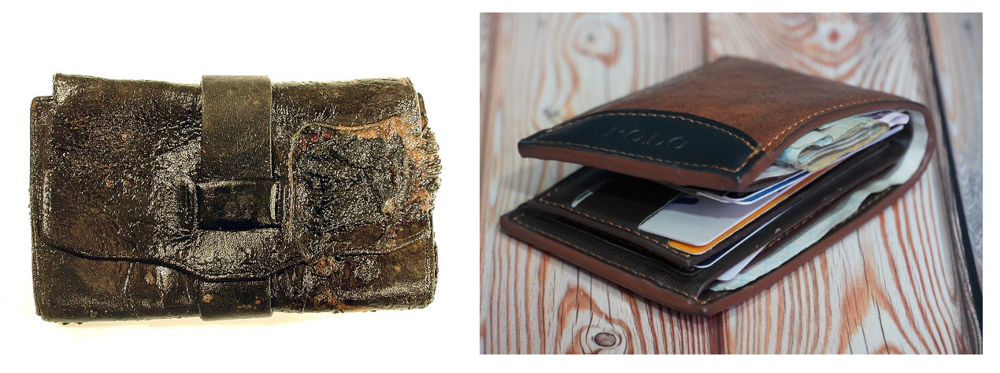
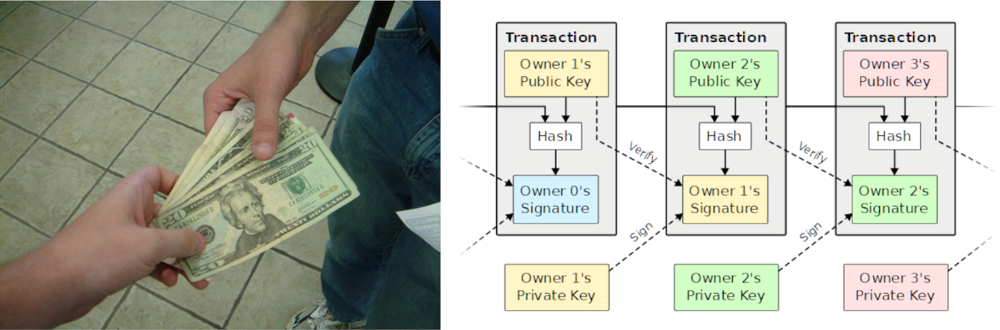

> *作者：Roy Sheinfeld*
> 
> *来源：<https://medium.com/breez-technology/there-is-no-such-thing-as-a-lightning-wallet-dc9ac46d32>*

虽然 Breez [经常](https://99bitcoins.com/bitcoin/lightning-network/wallets/)被[放在](https://academy.aax.com/en/introducing-the-4-best-lightning-network-wallets-for-sending-and-receiving-bitcoin/) “最好的闪电网络钱包” 榜单中，而且排名[很高](https://www.opennode.com/blog/best-lightning-network-wallets/)，敏锐的读者会发现我们从来没把 Breez 说成是一款 “钱包”。我们不是想故弄玄虚。相反，在比特币和闪电网络的语境下，“钱包” 这个词才是困惑的源头。

当你听到有人把法币支付类 app，比如 CashApp、Paypal 和 Venmo，也称作 “钱包” 的时候，你不会觉得奇怪吗？没有人，包括这些公司自己，会把这些产品称作 “钱包”。而且，虽然许多比特币和闪电网络公司和 app 都变得更加多功能，甚至进一步远离了我们通常认为是 “钱包” 的产品，我们依然这样称呼他们。

这是一种 *非常* 通行的误解，[Gigi 也关注到了](https://dergigi.com/2022/06/27/the-words-we-use-in-bitcoin/)并（独立地）揭穿了这种误解（[中文译本](https://www.btcstudy.org/2022/07/19/the-words-we-use-in-bitcoin/)）。所以我们要想想，钱包的实质是什么，比特币 “钱包” 是什么，闪电网络 “钱包” 又是什么，我们应该如何称呼它们。我们将竭尽全力追求真理，让自己解除 “引号” 的束缚。

## 什么是钱包？

“钱包是一种扁平的盒子或者袋子，通常用来携带小件的个人物品，比如纸币、信用卡；身份证明文件比如驾驶证、身份证；照片、护照、会员卡和其他纸质的或者塑料卡片。”就像 [Giacomo Zucco](https://giacomozucco.com/) 在最近一场跟我的一场聊天中说到的，钱包装着我们用来跟其他人交互的、小件的文件和信息。

我们现在叫做钱包的东西最早出现于[大约 17 世纪](https://www.padandquill.com/blog/post/wallet-origins-and-history)，是跟纸质货币一起出现的。因为制作可折叠的小袋子来装纸币的办法其实没有多少，钱包的形态从那时候开始也没怎么变过。看看这两者有啥区别：

- 图片来源：<a href="https://upload.wikimedia.org/wikipedia/commons/thumb/9/94/US_Navy_030221-O-0000O-001_Civil_War-era_wallet_was_discovered_by_Naval_Historical_Center_archeologists_during_their_excavation_of_the_Confederate_submarine_H.L._Hunley.jpg/800px-thumbnail.jpg">Wikimeda</a> & <a href="https://unsplash.com/@hamedtaha">Hamed Taha</a> -

左边的这个是考古学家在 160 岁的潜水艇残骸中发现的皮革钱包，而后面这种是我们今天可能每个人都有的钱包。

这两者的形式没有什么区别，有区别的是其中的内容。现代的钱包装着信用卡，这是在[上个世纪中期](https://en.wikipedia.org/wiki/Credit_card)才出现的。信用卡进入市场的同一时间，机器读取的标准开启了从实体货币到[电子货币](https://www.investopedia.com/terms/e/electronic-money.asp)的变革，这并非偶然。

然而，我们对电子货币（无论什么种类）依赖越深，对钱包的依赖就越少。现在[电子货币](https://www.investopedia.com/terms/e/electronic-money.asp)的数量跟实体货币的数量比[大概是 20:1](https://www.rankred.com/how-much-money-is-there-in-the-world/)，而且现代钱包中的每张卡片都可以携带数十倍于老式钱包所能携带的货币数量。

设想一下，假设你带着现代的钱包回到老式钱包所在的 160 年前，那时候的人们几乎肯定能认出你的钱包是什么、做什么用的。解释信用卡和借记卡也许有些难度，但依然有代表电子货币的实体物件。再下一步是解释法币支付应用，比如 PayPal。你的 曾-曾-曾祖母肯定不会看出有什么钱包了。等到你尝试解释你最喜欢的 比特币/闪电网络 “钱包” 时，他们甚至会怀疑你们说的还是不是同一种语言。

我们这些 21 世纪的人会想扩充钱包的定义。就像 Giacomo 说的，语言会演化，钱包是装着我们用来跟其他人交互的文件和信息碎片的东西。现在手机也可以存放[电子驾照](https://upgradedpoints.com/travel/digital-drivers-licenses/)（只要驾照还存在的话）、信用卡信息、所爱之人的照片、口令、合约信息、会员信息，等等。手机可以携带我们在皮革钱包中携带的所有东西的电子版本。

实际上，“钱包” 这个词也许比 “手机（phone）” 能更好地涵盖这些设备所执行的功能。（虽然我们是在讨论合适的称谓，但还是要说一句，“phone” 真的是一个过时的词了！在以色列，任何比 Methuselah 年轻的人都管这玩意叫 “移动设备（mobile device）”。以英语为母语的人加油吧。）（译者注：Methuselah 为圣经中记载的亚当第 7 代子孙，活了 969 年，是最高寿的人。此处代指长寿者。）因此，21 世纪跟皮夹子相关的东西其实是手机，对不对？

但是问题还在，你把一个专门的 app 叫做 “钱包”，有意义吗？许多 app 都存储对用户非常有用的信息。如果我们不把移动设备里的合约 app 叫做 “钱包”，即使它复制了传统的会员卡，为什么我们要管比特币 app（比如 BlueWallet 和 Wallet of Satoshi）叫 “钱包” 呢？手机自身就是一个钱包，*跟 app 没关系*。App 更多像是钱包 *里面* 的隔层。如果我们真的准备继续在这个超人类时代使用 “钱包” 这个词，这才是它的正确用法。

钱包没有改变，改变的是货币的形式、我们存储信息的方式，以及不再适合用 “钱包” 来称呼的事物。

## 什么是比特币 “钱包”？

比特币 “钱包” 和实体钱包都是存储媒介。实体钱包存储的是标记有信息模式的支票和卡片。具有正确模式的正确代币表示价值，而钱包在实体空间中移动这些代币。

比特币 “钱包” 也存储信息模式，但并不直接存储价值。比特币的价值仅仅是记录，保存在公开的区块链上。比特币的 “钱包” 也存储私钥，是用户用来代表自己、授权变更区块链上记录的工具。任何能存储一长串数字（也即私钥）的媒介 —— 一张纸、一个神经元、带有口令保护的闪存  —— 都可以算是比特币 “钱包”。在比特币中，具有正确模式的正确私钥间接地代表了价值，因为这些私钥允许你在虚拟空间中转移价值。

当人们用现金支付时，当支票从一个钱包转移到另一个钱包，价值也随之转移。当人们用比特币支付时，发送者使用接收者的公钥加密一笔交易，然后这些数字就会在区块链上移动，价值一直存留在区块链上，从未离开。

我们再来比较一下两种形式的交易：

- 来源：<a href="https://www.flickr.com/photos/quazie/578252290/">Quazie</a> & <a href="https://nakamotoinstitute.org/bitcoin/">Satoshi Nakamoto Institute</a> -

又一次，我们可以轻易看出钱包跟上图左边这种交易的关系：现在从钱包 A 中拿出，换到另一个人手上，进入钱包 B。但在比特币（上图右边）的情形中，我们叫做 “钱包” 的东西图中底部装着私钥的、带颜色的盒子。还有人没看出来这个比喻有点傻吗？因为，一张纸、一个神经元、一个 U 盘都可以叫做 “钱包”，即使这些东西没有装着任何实体有价值代币，*也没有装着比特币*（在任何意义上都是这样），这个比喻不是误导人而且没有用吗？

就像 Kiara Bickers 在他的著作《[厘清比特币](https://www.academia.edu/43197886/Bitcoin_Clarity_Chapters_1_2)》中说的那样：

> 实体钱包直接存放着具有价值的现金，但电子钱包并不直接持有价值，你只是用它来持有你对区块链的访问权。假使你穿越了国境，你的比特币就跟你一起转移了吗？并不如此 …… 。在你的比特币钱包中存储的私钥，仅代表移动资金的能力，而不代表资金本身。（P.18）

如果你想要一个更少误导、更准确的描述，“**签名器**”如何？相同的外延 + 极大改善的内涵 = 语义的帕累托改进。

（向 [NVK](http://signingdevice.com/) 和 [Conor Okus](https://twitter.com/ConorOkus) 致敬，他们帮助我思考了这个问题和术语。）

## 什么是闪电网络 “钱包”？

现在，“钱包” 这个词被用来指称所有类型的闪电应用。虽然这个词放在哪里都不对，但不对的理由各有不同。有趣的是，对闪电应用 *不同于* 钱包的反思，确实有助于让我们了解它们到底 *是什么*，所以我们就试试看。

### 托管的 “钱包” 就是账户

托管型的 “钱包” 并不传输有价值的代币，但它们在法币世界有一个类似物：银行账户。你看托管型钱包是怎么工作的：

1. 你把自己的比特币抵押给中介，授权他们代表你转移资金
2. 他们按照你的指示执行交易
3. 你只能祈祷他们会遵守你的指令、保管好你的钱，在你想关闭账户时钱还在。

实际上，无论是谁在运营这个托管型 “钱包”，那都是 “一个为托管【和】兑换货币 …… 并帮助资金转移的机构”。换句话来说，[他们是银行](https://www.merriam-webster.com/dictionary/bank)。而且，这可不是我说的，这是韦氏词典说的。上面的引用就是这个词的意思。而他们所提供的 “钱包”，是 “一种合约，[银行保管着你的钱](https://dictionary.cambridge.org/dictionary/english/bank-account)，但保证在你想要的时候就能动用” —— 即 *银行账户*（剑桥美国语词典）。

托管型 “钱包” 完全是这种账户的用户接口。它们指示提供了一种方式，让用户可以向托管中介发送指令，并从后者处接收消息。完全不是 “钱包”，不是吗？

- 托管型 “钱包” 在现实中会长什么样？看起来一点也不像钱包，对吧？（图片来源：<a href="https://www.westonweb.ca/another-bank-closes/">Adam Norman</a>） -

### 非托管型闪电支付应用

在现实中，真正的钱包存放着一些有价值的代币。比特币 “钱包”（或者说 *签名器*，还记得不？）则存放着你的私钥，可以签名交易并将交易发送到网络中。托管型闪电网络 “钱包” 实际上像是银行账户，价值是委托给代表用户的第三方的。

那么非托管的闪电网络 “钱包” 呢？（啊，我光打字都感觉尴尬。）

闪电网络由使用支付通道相连的节点组成。在这里签名也有重要作用，因为[闪电网络交易就是比特币交易](https://medium.com/breez-technology/lightning-btc-iou-62e3a712c913)。但是，闪电网络交易需要沿着支付通道、一个节点接一个节点地[路由](https://github.com/lnbook/lnbook/blob/develop/08_routing_htlcs.asciidoc)比特币，直到支付送达目的地。

问题在于，闪电支付应用并不只是管理 “钱包” 和 “账户余额” 的好看用户界面，它们真的需要通过一个实时变化的网络图来路由支付。而且，为了保证路由的成功率，还有许多的辅助任务。这些任务包括（举个例子）通道管理（跟网络中的其他节点开启和关闭通道）以及流动性管理（保证充足的出账和入账流动性）。

一些用户喜欢在自主托管的节点上手动管理流动性和可用的路由。但是，大部分用户都将这样的技术任务委托给了[闪电服务提供商](https://medium.com/breez-technology/envisioning-lsps-in-the-lightning-economy-832b45871992?source=collection_home---4------4-----------------------)，比如 [Breez](https://breez.technology/technology.html) 和 [Phoenix](https://phoenix.acinq.co/)。

看到这里，有人就会说了：“很简单！它们只是在描述钱包！对不对！” 问题就在这里。*世上根本就没有闪电网络钱包这回事。*

- 把这张网络图交给一个刚学会走路、手拿蜡笔的小宝宝，尝试一步一步找出你平时走的路线。这就是闪电网络路由。（图片来源：<a href="https://www.flickr.com/photos/anniemole/5574625240">Annie Mole</a>） -

### 从 “钱包” 到支付应用

如果一个比喻能帮助人们生动而简洁地描述一个复杂的现实，那它就是一个好的比喻。当 E.M. 福斯特写下 “生活犹如一场边学边演的小提琴公开演奏” 的时候，他说得恰如其分。它不需要额外的解释；它自身 *已经* 是对一个更大的东西的解释。“闪电网络钱包” 就远不是如此。作为一个比喻，它让人困惑，它误导人。

更好的方法可能是使用描述功能的术语（例如 “螺栓切割器”）。如果一个应用发送和接收支付，那就管它叫支付应用把。如果它是用来播放播客、川流支付给播主的，那就叫它播客应用把。还是你用它来管理金融，它不就是个金融应用吗？其实比特币应用和法币应用何尝不是如此呢（还记得 Paypal、Venmo 和 CashApp 吗）？应用的名字应该从它的功能中取出来，而不是从实现功能的原理中取出来。而且，如果我们必需使用比喻，这些比喻应该至少能反映我们的技术的真实状态。

我们知道，许多人会继续把闪电网络支付应用和托管账户称为 “钱包”，而且为语言立法 *从来* 都没有用（还是我们将会用世界语来写这篇文章[呢](https://en.wiktionary.org/wiki/rajto)？）。无论如何，言论自由。但仅仅使用一个词并不会使这个词变得更准确或有效。思考我们言说闪电网络的方式与思考闪电网络的方式之间的关系，前者对后者有何好坏影响，依然有重大意义。

我们的世界是由概念组成的（引用[康德](https://plato.stanford.edu/entries/kant/#TraIde)），而概念是由语言组成的（引用[维特根斯坦](https://plato.stanford.edu/entries/wittgenstein/#TracLogiPhil)）。因此，让语言正确，可以帮助我们理解和塑造这个世界。你怎么能指望只用一个 “钱包”，就能开启闪电网络革命呢？

（完）