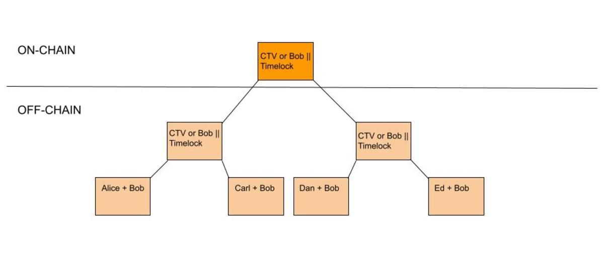

> *作者：SHINOBI*
> 
> *来源：<https://bitcoinmagazine.com/technical/timeout-trees-a-solution-to-scaling-lightning-network-lsps>*

闪电网络的最大的内在局限之一，便是（给定区块大小的限制）每一个区块可以开启和关闭的通道的数量是有限的。无论多少交易能在链下发生、有多便宜，可以合理地使用闪电网络的人数还是面临这个根本的瓶颈。甚至闪电网络白皮书也得出结论，在整个世界 70 亿人都使用闪电网络的情况下，每人每年只发起两笔链上交易，比特币也需要 133 MB 的区块大小，才能让闪电网络正常运作。这不是什么出人意料的问题，也不是不可预测的问题，这是从第一天开始人们就知道的它的局限性。

解决这个问题的部分计划总是会关联到一种叫做 “通道工厂（channel factories）” 的想法：一种超过两方参与的通道。这是在不提升区块体积限制的前提下扩展闪电网络我们必须要走的一条路，但问题在于，解决这个链上足迹的问题会带来一系列其它的问题。首先，如果某个对手变得没有响应，则需要强制执行一个中间状态，这个要求没有根本上的改变。这也会影响它能够创造的价值。通道工厂的用意在于，比如说，二十个人可以共享一个 UTXO，并按照他们的想法在内部重新安排流动性。一旦某人不合作地在链上关闭通道，就会影响这个目标。

如果我关闭了我在一个通道工厂里的一条通道，我就会让许多的人跟我一起脱离通道。把一个工厂理解为一棵默克尔树，最顶端有一个 UTXO，然后在链下分成两半；这些分成两半的 UTXO 又继续分成两半，等等，最底层的每一个叶子就是各个通道。一旦我让自己的通道脱离工厂，跟我一起建立工厂的每一个人都会回到链上、跟工厂中的其他人分开。即使每个人都愿意合作，他们也无法再一起重新组织流动性了。

另一个大问题是，在最开始，你就需要让每个人都在线，预先签名所有的交易。如果你希望在一个工厂中容纳 20 个人，那么每个人都必须在线，才能启动它。如果你想容纳 1000 个人，就得有 1000 个人在线，等等。

这让通道工厂变成了一个有许许多多问题要解决的广大设计空间。所以，通道工厂的概念为闪电网络解决了一个现存的问题，但产生了一大堆新问题。听起来就很像工程学 : ）

## 超时树

John Law 最近的一个提议 “超时树（[Timeout Trees](https://lists.linuxfoundation.org/pipermail/lightning-dev/2023-September/004092.html)）”，尝试为通道工厂的一个核心问题提供一个解决方案。我不太想把超时树叫成 “通道工厂”，它更像一个 “模型工厂”，但它提供了一种可能的方案，允许开启和关闭大量通道的同时，不会引入非合作式关闭通道导致其他用户被动退出工厂的问题。这个提议需要 CHECKTEMPLATEVERIFY (CTV) 和一个闪电服务供应商（LSP）。

超时树本质上是一种使用限制条款来保障的通道工厂，一旦建立，就无法在链下重新组织流动性，但带有一个特殊的免责条款。一个 LSP（姑且称为 “Bob”），扮演着将普通用户连接到广大的闪电网络的角色。Bob 可以用自己控制的资金创建一棵 CTV 树，以表达一个 UTXO 展开后的情形，从而，跟自己所服务的任意数量个用户开启通道。CTV 的一个好处在于，无需每个人都同时在线，就能完成这一切。Bob 可以直接让每个人都在某个时间签名自己的初始通道状态，然后保存这些状态，直到每个人都建立好了通道，然后将资金交给这棵 CTV 树，这就跟每个人都建立好通道了。

这就解决了每个人都必须同时在线才能建立 “工厂”、开始使用闪电网络的问题。因为 CTV，一旦 Bob 把资金付给了这棵跟每个人建立闪电通道的树，他就无法撤回，也（暂时）无法拿走资金。一旦这个 UTXO 在链上得到确认，每个人都可以认为自己的通道已经开启，不再需要担心自己被重复花费。

现在，只剩最后一部分了。虽然建立工厂只需在链上确认一个 UTXO（得益于 CTV），但关闭通道还是会让整个 CTV 树再链上展开，这样才能让每个人都能提交自己的通道状态，对吗？并不。这就要用到超时树中的 “超时” 了。超时树的每一个分支都有一个脚本路径，让 Bob 在一个时间锁到期之后扫走所有的资金。

- 超时树图示 -

我敢肯定，你现在一定会说：“这什么玩意？” 但这是让这个提议能够运转的真正天才之处。因为 Bob 可以在到期之后自己扫走链上的 UTXO，这些通道全部都是有寿命的，除非用户真的在链上展开整棵树并确认通道的形式。这使得 Bob 可以做一些巧妙的事情：在时间锁即将到期的时候，他可以跟现有的用户建立一棵全新的超时树，在链下让他们把现在这棵上的资金全部迁移到新的树上，然后就只需在链上清扫一个 UTXO（使用旧的那棵树的 UTXO）。

这允许在链上高效低关闭所有通道。剩下唯一的问题是在其他人停止合作时在链上强制执行一个 HTLC。在这里并不真的是一个问题，或者说，这是一个 “0 或 1” 的问题。通道必须关闭以强制执行一个 HTLC 的原因在于，你的通道对手在转发一笔支付期间停止响应。而在超时树上，每个用户的对手都是 Bob。所以，只要 Bob 是诚实的，在它不响应某一个用户的更新请求时，他也会不响应所有其它用户。这时候每个人都依然可以在超时前在链上关闭自己的通道，然后不再使用 Bob 的服务。

## 总结

用户依然要为链上的交互支付手续费，这无法避免；而且，整棵超时树非交互式地在链上展开，其体积是非常大的，而且会产生许多链上足迹，但这是任何一种多方通道系统都必须面对的问题。但是，对于合作式开启和关闭大量多方通道，超时树确实安排了令人信服的解决方案，而不会将系统的信任模型降级为托管模型。

甚至，在 Johun 的最新版本的论文中，他还提议出了一种方案，不合作关闭通道的用户会被惩罚，以承担 Bob 最终为了清扫大量碎片化的 UTXO 而需付出的代价。如果 Bob 的不在线或者不诚实导致了用户必须单方面关闭自己的通道，也许也有反向的方法可用。

但是，到目前为止，这是一个非常具体和精细的通道工厂设计提议，真的尝试解决使用和实现中的真实问题，而不是自娱自乐。这是在解决闪电网络的长期可扩展性局限性 上的一个巨大进步。

（完）