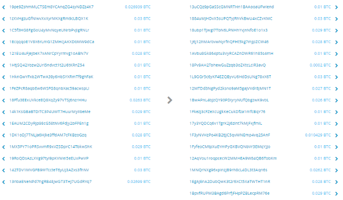
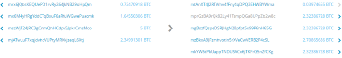
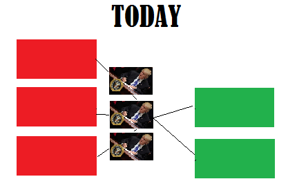
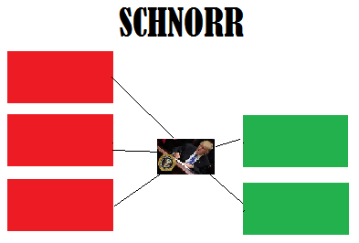

> *作者：nopara73*
> 
> *来源：<https://nopara73.medium.com/tumblebit-vs-coinjoin-15e5a7d58e3>*

很长时间以来，我一直在开发 [TumbleBit](https://eprint.iacr.org/2016/575.pdf)。它不像 [CoinJoin](https://bitcointalk.org/index.php?topic=279249.0)：CoinJoin 已经是一种古老的、被充分理解而且经过了产品测试的技术，而且有多种实现，比如 [JoinMarket](https://github.com/JoinMarket-Org/joinmarket)、[ShufflePuff](https://github.com/DanielKrawisz/Shufflepuff)、[DarkWallet](https://github.com/darkwallet/darkwallet) 和 [SharedCoin](https://github.com/sharedcoin/Sharedcoin)；甚至还有改进的协议 以及/或者 实现，比如 [CoinShuffle](http://crypsys.mmci.uni-saarland.de/projects/CoinShuffle/coinshuffle.pdf)、[CoinShuffle++](https://crypsys.mmci.uni-saarland.de/projects/FastDC/draft-paper.pdf)。但所有这些都跟 Tumble 无缘。Tumble 只是一种新技术，只有一种协议实现 [NTumbleBit](https://github.com/NTumbleBit/NTumbleBit)，而其前身概念验证实现是 [BUSEC/TumbleBit](https://github.com/BUSEC/TumbleBit)。实际上，迄今为止，我的主要工作都集中在理解其基本概念并向广泛的听众介绍它们，如：[Understanding TumbleBit 1](https://hackernoon.com/understanding-tumblebit-part-1-making-the-case-823d786113f3)、[2](https://hackernoon.com/understanding-tumblebit-part-2-the-endgame-instant-anonymous-scaleable-payment-system-on-top-479e7eb9ca24)、[3](https://hackernoon.com/understanding-tumblebit-part-3-not-even-the-tumbler-can-breach-your-privacy-how-8d49d89e3a0d)、[4](https://hackernoon.com/understanding-tumblebit-part-4-not-even-the-tumbler-can-steal-your-coins-482e7076ef22)、[5](https://hackernoon.com/understanding-tumblebit-part-5-try-it-out-65b7a8d21a96) ；然后是开发 Tumble 来赋能新技术如 [HBitcoin](https://github.com/nopara73/HiddenBitcoin)、[DotNetTor](https://github.com/nopara73/DotNetTor)、[HiddenWallet](https://github.com/nopara73/HiddenWallet)、[BreezeWalle](https://github.com/stratisproject/Breeze)；还有琢磨一些小问题。以前我不太确定这项技术在实践中的局限性。现在，我正在为 HiddenWallet 集成 TumbleBit，我感觉情形发生了变化，现在我已经能够写一篇考究的长文来探讨两种最受众望 以及/或者 最被炒作的比特币链上隐私性技术了：TumbleBit 和 CoinJoin。

## 链上隐私性

TumbleBit 有多种模式：支付中心模式（Payment Hub mode）和传统 Tumbler 模式。当前的 NTumbleBit 几乎完全实现了传统 Tumbler 模式，它也正是我要在这篇文章中集中讨论的。至于支付中心模式，顾名思义，它不是一个完备的链上隐私性解决方案。拿支付中心模式跟 CoinJoin 相比会有点傻，至少做起来很更难。

出于相同的理由，我也不会讨论 [Mimblewimble](https://github.com/ignopeverell/grin) 以及尚未实现的以隐私为中心的侧链实现、可以建立在[闪电网络](https://lightning.network/)上的二层隐私技术（译者注：Mimblewimble 协议已经于 2019 年得到了实现，但不是在比特币上。）。我也不会讨论 [CoinSwap](https://bitcointalk.org/index.php?topic=321228.0)，因为一方面，其基本形式没有获得太多的关注，另一方面，就我所知，尽管它的概念已经提出多年，但还是没有得到实现（译者注：CoinSwap 在翻译之时（2022 年）也已经有了搭配 Statechain 概念的实现）。我要指出的是，TumbleBit 至少有一部分基于 CoinSwap；而且，有了[隔离见证](https://github.com/bitcoin/bips/blob/master/bip-0141.mediawiki)以及一些新的操作码，大家回去重看 CoinSwap 协议可能也是个好主意。

当然，我也不会讨论传统的比特币 tumbler，因为他们可以盗走你的币并泄露你的隐私。

我会在最后提提[机密交易](https://elementsproject.org/elements/confidential-transactions/)和 [Schnorr 签名](https://www.elementsproject.org/elements/schnorr-signatures/)，因为它们对 TumbleBit 和 CoinJoin 都是互补的技术，我会告诉你它们如何能从中受益。

## 基础知识

### 比特币交易

一笔简单的比特币交易就如上图所示。你可以把一些币从一个地址发送到另一个地址，然后找多余的零钱给原来的地址。当然，这种模式下的隐私性是很糟的，因此 “[找零地址](https://bitcoin.org/en/glossary/change-address)” 的概念和方法应运而生。

### 找零地址

模式是相同到，不同的地方在于，你的钱包软件不是直接把零钱发回原来的地址，而是生成另一个地址来接收你的零钱。这就引发了另一个问题：你怎么在一个钱包软件里储存这么多地址呢？“[层级式确定性钱包](https://bitcoin.org/en/developer-guide#hierarchical-deterministic-key-creation)” 就是来解决这个问题的，不过这已经超出了本文的范围了。（译者注：所谓层级式确定性钱包，即一个钱包使用的所有地址都是从同一份主私钥中推导出来的，从而用户只需备份主私钥即可。）

那要是你一个地址上没有足够多的钱来支付怎么办呢？如果你的两个地址加起来才有这么多钱，你的钱包就会通过增加钱包地址来添加交易的输入：

*严格来说，我这里的解说是不准确的。因为交易的输入不是 “地址-余额”这样成对的数据，而是 “地址-数量” 这样的数据，更准确地来说，是 “签名-数量-索引” 这样的三元组，不过，我们暂时先别拘泥于这些细节。*

当前几乎所有的比特币钱包软件都使用这种模式。当然，它仍有许多隐私问题。

那么，要是多个人把彼此的输入结合起来、产生一笔大交易，会对隐私有帮助吗？

### SharedCoin

SharedCoin 是 [Blockchain.info](https://blockchain.info/) 所用的一种方法。至于效果，则既有好的，也有坏的。

它在理论上是很好的，因为它让区块链分析变得更加艰难，但是，简单数额分析方法 [CoinJoin Sudoku](http://www.coinjoinsudoku.com/) 可以辨别出许多关于 “谁向谁支付” 的信息。

它造成了坏的影响，则是因为某种程度上，它给公众造成了一种印象 “SharedCoin 就已经足够了” 但并未让用户知情：Blockchain.info 自己就能重建出支付关联。区块链分析并不是隐私考量的全部。

后来他们公司停止了这项服务，我估计跟法律原因有关。但[我向你保证](https://medium.com/@nopara73/privacy-and-schnorr-signatures-e2175d27f022)，在 Schnorr 签名引入比特币之后，他们又会重新提供这个服务，因为这类服务的手续费可以大幅下降。实际上，任何有足够流动性的钱包都会开始提供这项服务，以提供更便宜的交易，不过我这么说有点透露剧情了，这个是下文 Schnorr 签名的内容。

### CoinJoin

CoinJoin 的前提是，所有用户的支付额必须相同。举个例子，在一笔 CoinJoin 交易中，每个人都必须支付 1 比特币、组合成一大笔交易，这样就没人知道谁支付给了谁。当然，如果你只观察一笔交易而不观察整个交易链条，那自然发现不了；但如果可以观察整个链条，问题就没有那么简单了。CoinJoin 实现的隐私性有点牵强，但我先撇开这一点不提。考虑一下现实问题：找到足够多在同一时间发送交易的人就够难得了，还需要让他们都发送同样的数额？首先恐怕就没有一个钱包软件有这么多流动性。

“机密交易（Confidential Transactions）” 如果能在未来引入，将能解决这个问题，因为它掩盖了交易的数额。不过，这样会产生更大体积的交易，因此手续费也会更高。如果我没有搞错，机密交易的体积会是 CoinJoin 的 10 倍。唉，我这里又剧透了。我在这里想说的是，CoinJoin 提出了一系列全新的问题：参与者如何在私下里相互协调？这个我们后面再作分解。

### JoinMarket

后来就出现了 JoinMarket（JM） 的概念。在上图所示的交易中，有三个输出是 2.32386728 BTC 的数额。即使你能分辨出哪个输入对应哪个找零输出，你也无法分辨出支付关系。注意，在这笔交易中，你的匿名集是 3。

那么，JM 如何解决 CoinJoin 的流动性问题呢？它引入了 maker-taker 的概念，maker 等待有 taker 希望执行一笔 CoinJoin 交易并要求 maker 提供一些流动性，maker 可以获得一些手续费作为回报。你肯定可以想到，如果一笔普通的比特币交易需要支付 1 美元的手续费，若你想要通过 JM 来发送资金，带上 3 个 maker，那你就要支付 3 美元的手续费。你若想要大小为 100 的匿名集呢？你就只好支付 100 美元的手续费了。

### CoinShuffle, CoinShuffle++, ShufflePuff

 我必须承认，我并没有完全掌握这些概念，但介绍它们的基本前提是，它们以去中心化的方式解决了 CoinJoin 的协作问题。至少它们是这么说的。

CoinShuffle 是 CoinShuffle++ 的前身，而 ShufflePuff 是 [Mycelium](https://wallet.mycelium.com/) 钱包的实现。它从未投入到生产环境中，因为这个实现是他们完全失败的众筹的一部分，不过这是另一个故事了。基本上，他们从大众手上募得了很多钱，并承诺了要实现一大堆新功能。他们可能有，也可能没有把钱花在开发工作上，但总之是没能发布新功能。他们承诺的其中一个功能正是 ShufflePuff。不幸的是，他们的 [GitHub 页面](https://github.com/DanielKrawisz/Shufflepuff)的最后一次更新是在 7 个月以前，这基本上就是一个死胡同，除非某人又再把它捡起来。另外，我们不要忽略了，无论你想在上面开发什么样的隐私技术，Mycelium 都是一个糟糕的平台。如果你在[对付网络分析时先天不足](https://medium.com/@nopara73/bitcoin-privacy-landscape-in-2017-zero-to-hero-guidelines-and-research-a10d30f1e034)，你能对付区块链分析也意义不大了。

### TumbleBit：传统的 Tumbler 模式

TumbleBit 的想法跟 CoinJoin 完全不同。在传统的 Tumbler 模式中，在 Tumbler 验证你拥有两个完全不同的身份，但你其实是在跟你自己混币。

整个流程大概是：

1. 你使用 Alice 和 Bob 的身份分别与 Tumbler 开启一条支付通道
2. 密码学魔法
3. 关闭两条支付通道

注意，有两条支付通道，因此链上有 4 比交易。而在 “密码学魔法” 一步中发生的事情是，许多其他用户，开启通道来告诉 Tumbler 把钱转移到他们想要的输出中，但是，在这个过程中，Tumbler 是无法断定谁给谁转了钱的。听起来不可思议？你可以直接信任我，也可以看看[这篇文章](https://medium.com/@nopara73/understanding-tumblebit-part-3-not-even-the-tumbler-can-breach-your-privacy-how-8d49d89e3a0d)来验证。

 我们并不关心它的工作原理，因为这篇文章的目的在于比较，而不是介绍。我们来看看它的参数：

**它有多快？**

开启两个通道，关闭两个通道，也就是两个区块，20 分钟。很棒！

**它的费用几何？**

你需要发起 4 比交易。而且它们都比普通交易要大，如果普通的交易需要花费 1 美元，你可能就需要花费 10 美元。另外，你还需要支付 Tumbler 手续费，可能是 1%。这个可能才是大头，不过，考虑到这是更大的匿名集，也并不必然就偏高。

**它可以实现多大的匿名集？**

无可限量。不过，在白皮书提供的概念验证实现中，可以实现 800 的匿名集，因此我们就默认是这个数。

**这只是理论。给我们看看实际的。**

- 不幸的是，支付中心模式有一个很大而且很糟糕的缺陷，它必须持有许多比特币来应付混币需要。若是从比价来考虑，这是个好事，因为它会让币价上升；但另一方面，这也是个坏事，因为它会变成攻击的目标。
- 不幸的是，TumbleBit 需要使用固定的数额，跟 CoinJoin 一样，因此也面临同样的问题。
- 遗憾的是，如果 Tumbler 自己想击破用户的匿名，一些时序攻击（timing attack）是可以做到的。

幸运的是，所有这些问题都可以用 TumbleBit 来解决，因此你不需要担心它们。不幸的是，所有的解决方案都让一次 tumble 的流程变得更长，最好的时候需要两个小时，一般来说甚至是半天。最近有人提出了标准时长为 1 天的方案，但有待实现。

当然，我注意到了这个格外长的混币实践，但这些东西对我来说都没有意义，我只希望我开发出它的时候能提出一些东西，让它的流程尽可能地快。现在我无法使之变快，无论我采取什么方法，都会打破别的一些东西。我依然相信有优化能使之变快很多，但我已经知道了它不会像我想的那么简单。

这使我产生了一个问题：要是这个周期需要这么长实践，我们能期望产生多大的匿名集呢？

我没有答案，不过我猜测是 10 到 50。首先我们要获得初始流动性，我们越晚推出，比特币的手续费就越高，如我上面所述，要在 TumbleBit 交易商再乘以 10 倍。最糟糕的你甚至无法发送自己想发送的数额。而我还没提到要怎么解决这个问题。

想要比较一下的看，看我对 JoinMaker 解决方案的介绍（maker-taker 的概念）。当然，我们不能使用同样的模式，因为手续费将随着匿名集变大而上升，而 TumbleBit 的基础手续费就比较高。

我们上面说过，你可以跟自己混币，如果你想发送 8.3 BTC，而 Tumbler 的面额是 1 BTC，这样你就要参与 8 轮的 TumbleBit，而且剩下的 0.3 BTC 就没法混币了。

多轮次同样会增加手续费，假设普通比特币的手续费是 1 美元，那你的 8 轮混币可能就是 80 美元。不过幸运的是，你无需按顺序等待一轮又一轮的完成，各轮可以重叠。

*另一个注：一我不知道有谁像我一样，思考过在比特币手续费高涨的环境中 TumbleBit 传统 Tumbler 模式的经济模型（而高涨的手续费是我们必然走向的终局）。实际上，我一直假设的 1 美元的手续费是今天的现实，很难认为这已经是高手续费的环境了。*

*坦白说，我写下这些东西之后，我变得非常失望。*

# CoinJoin vs TumbleBit

比较两者是很难的，因为 CoinJoin 中的协作问题是很棘手的。同时，为了防止女巫攻击，又会有一系列全新的问题产生出来。因此，我把 NTumbleBit 的传统 Tumbler 模式与理想中的 CoinJoin 和 JoinMarket 相比较，后者是今天唯一可用的 CoinJoin 实现。不幸的是，我无法加入理想的 TumbleBit 作为比较项，因为我的想象已经实现了，而我看不到如何进一步克服它的局限性。

| 假设：                   | 普通交易的手续费为 1 美元       |             |                            |
| ------------------------ | ------------------------------- | ----------- | -------------------------- |
|                          | TB 和理想化 CJ 的面额都为 1 BTC |             |                            |
|                          | TumbleBit 传统 Tumbler 模式     | JoinMaket   | 理想化 CoinJoin            |
| 需要固定面额吗？         | 是                              | 否          | 是                         |
| 有多快？                 | 每一轮大于 2 小时，可重叠       | 3 ~ 10 分钟 | 每一轮 1 ~ 10 分钟，可重叠 |
| 匿名集：3，混币 1 BTC    | 10 （美元，下同）               | 3           | 1                          |
| 匿名集：300，混币 1 BTC  | 10                              | 300         | 1                          |
| 匿名集：3，混币 10 BTC   | 100                             | 3           | 10                         |
| 匿名集：300，混币 10 BTC | 100                             | 300         | 10                         |

虽然我用的是粗略估计，但我认为我是对的。

结论？如果存在理想化的 CoinJoin，那它是最优选。不过，因为它不存在，所以，对大匿名集的交易应该使用 TumbleBit，而小匿名集的交易可以使用 JoinMarket。

现在，我们该来谈谈未来了吧？

## 机密交易

CT 简单来说（也没那么简单）就是隐藏一笔交易的数额，理论上，如果比特币支持 CT，那 TumbleBit 和 CoinJoin 都可以利用它，代价是手续费提高 9 倍。不过，JoinMarket 不能利用它，或者说用了也没有意义，因为它已经解决了固定面额问题。那 CT 对它们的成本有何影响呢？

| 假设：                   | 普通交易的手续费为 1 美元   |             |                 |
| ------------------------ | --------------------------- | ----------- | --------------- |
|                          | TumbleBit 传统 Tumbler 模式 | JoinMaket   | 理想化 CoinJoin |
| 需要固定面额吗？         | 否                          | 否          | 否              |
| 有多快？                 | 大于 2 小时                 | 3 ~ 10 分钟 | 1 ~ 10 分钟     |
| 匿名集：3，混币 1 BTC    | 90（美元，下同）            | 3           | 9               |
| 匿名集：300，混币 1 BTC  | 90                          | 300         | 9               |
| 匿名集：3，混币 10 BTC   | 90                          | 3           | 9               |
| 匿名集：300，混币 10 BTC | 90                          | 300         | 9               |

如你所见，CT 在 TB 和 CJ 中都可以降低大量混币的成本，不过它会提高小规模混币的成本。

### Schnorr 签名

红色的块是输入，绿色的块是输出，现在特朗普要签名输入。Schnorr 签名让我们在一个交易中只需提供一个签名（译者注：这可能是对 Schnorr 签名的一种误解，作者期望的可能是 “跨输入的签名聚合” 功能）。不过，它没法显著优化 TumbleBit 的使用，只是有助于 JoinMarket 和理想化 CoinJoin。

那这些技术能得到什么好处呢？我在这里想给出一个粗糙的估计，数据源是这个 [Bitcoin Stackexchange 的回答](https://bitcoin.stackexchange.com/a/46379/26859)：

> 签名的平均大小是 71 字节
>
> 而 P2SH/P2PKH 交易的体积是：每个输入 146 字节 + 每个输出 33 字节 + 10 字节

我们最常用到的交易有 1 个输入和 2 个输出，就是 233 字节；其中签名的体积占到了 30%。假设 Schnorr 签名的体积与此相同（实际上并不相同），Schnorr 就可以节约至少 30% 的 CoinJoin 交易费。

| 假设：                   | 普通交易的手续费为 1 美元       |              |                             |
| ------------------------ | ------------------------------- | ------------ | --------------------------- |
|                          | TB 和理想化 CJ 的面额都为 1 BTC |              |                             |
|                          | TumbleBit 传统 Tumbler 模式     | JoinMaket    | 理想化  CoinJoin            |
| 需要固定面额吗？         | 是                              | 否           | 是                          |
| 有多快？                 | 每一轮大于 2 小时，可重叠       | 3  ~ 10 分钟 | 每一轮  1 ~ 10 分钟，可重叠 |
| 匿名集：3，混币 1 BTC    | 10 （美元，下同）               | 2.34         | 0.78                        |
| 匿名集：300，混币 1 BTC  | 10                              | 210          | 1                           |
| 匿名集：3，混币 10 BTC   | 100                             | 2.34         | 7.8                         |
| 匿名集：300，混币 10 BTC | 100                             | 210          | 7                           |

## 结论

TumbleBit 的传统 Tumbler 模式对大规模的匿名集很有用。今天我们能够实现的 CoinJoin：JoinMarket 无法应用在大规模匿名集上。TumbleBit 的传统 Tumbler 模式比较耗时，CoinJoin 则比较快。理想化的 CoinJoin 在大型匿名集上使用时会比 TumbleBit 的传统 Tumbler 模式更为实用。

*尚待解决的问题是：*

*投入生产环境的 TumbleBit 能够获得实现大型匿名集所需的流动性吗？CoinJoin 能解决其协作问题，实现大规模的匿名集吗？*

（完）