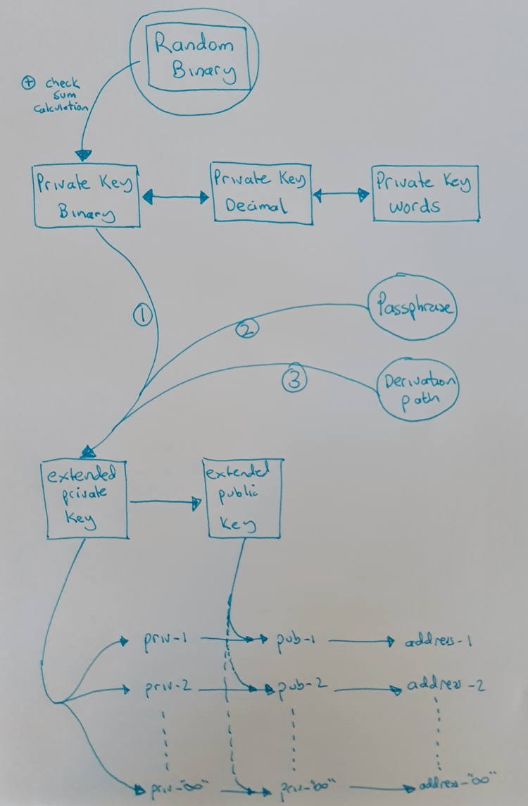
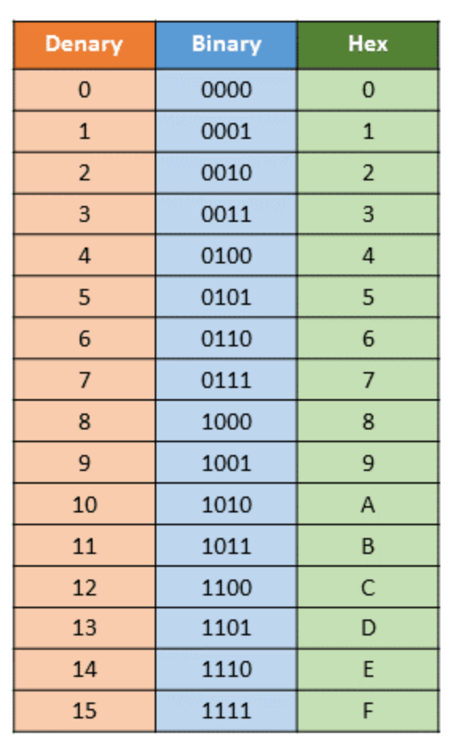
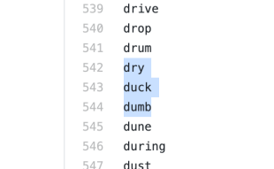
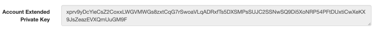

> *作者：Arman The Parman*
> 
> *来源：<https://armantheparman.com/public-and-private-keys/>*


凡是关心自己的比特币财产安全的人都应该试着理解下图：



## 数字

如果你完全理解二进制、十进制和十六进制，可以跳过这部分。

**十进制**指每一位数都有 10 种可能（0、1、2、3、4、5、6、7、8 或 9）。数字 “6.15” 有 3 位数（顺带一提，6.15 这个数字是有特殊含义的，即，每个人都应该努力拥有 6.15 个比特币）。第一个数是 “6”，第二个数是 “1”，第三个数是 “5”。这三个数可以是 0、1、2、3、4、5、6、7、8、9 中的任何一个。

在十进制中，我们从 “0” 数到 “9”（0、1、2、3、4、5、6、7、8、9）就没有新的数了，接下来就要在左边新增一位 “1”（即，逢十进一），得到 “10”，然后再从 “0” 开始数起 —— 原先的 “9” 进了一位，十位数变成了 “1”，个位数变成了 “0”。

**二进制**指每一位数只有两种可能（“0” 和 “1”）。

在二进制中，我们从 “0” 数起，然后是 “1” ，接着就是 “10”！看见没？如果你觉得跨度很大，那是因为你还没有跳出十进制思维。

在十进制中，“10” 就是普通人的手指数量 —— 因为我们有 10 个手指，所以我们人类常用 10 进制。

但是，在二进制中，“10” 就是一个人的大拇指的数量。想象一下用你的大拇指数数：1、10、11、100、101、111、1000、1001…… （译者注：这几个数字换算成十进制就是 1、2、3、4 ……）

如果这是你第一次了解二进制，可以用纸和笔自己算一下，可能会有帮助。这就像是第一次学习数数那样，而且还不能靠直觉。

**十六进制**指每一位数有 16 种可能（0、1、2、3、4、5、6、7、8、9、a、b、c、d、e、f）。其中，a=10、b=11、c=12、d=13、e=14 和 f=15。

就像扑克牌游戏一样，Jack=11、Queen=12、King=13、Ace=14 或 1。一个字母可以代表一个数字，这就是关键。

每一位数的可能性越多，表达一个大数字所用的位数就越少。例如，十进制下的 2047 ，写成二进制就是 11111111111（11 位数），写成十六进制就是 7FF。

总结：



## 随机二进制数、校验和、私钥

私钥首先是一个二进制数，可以转换成其它形式。但是，私钥本质上是二进制数，因为它是为了给计算机使用的。下面是二进制私钥的一个例子：

```
01000011111 10101110110 01001000001 01001101000 10000100011 10001011011 00100110111 11010000011 11001000001 10111110010 00010101000 00101110110 01100001101 11000010011 01101111001 11001010111 10011010000 01001110000 01000010010 00001110011 10011110101 11000110011 10101101110 00100111111
```


请注意，这个私钥由 24 组数字组成，每 11 个数字为一组，共计 264 个二进制数字（24×11=264）。

计算机看到的私钥虽然是同一串数字，但是没有空格：

```
010000111111010111011001001000001010011010001000010001110001011011001001101111101000001111001000001101111100100001010100000101110110011000011011100001001101101111001110010101111001101000001001110000010000100100000111001110011110101110001100111010110111000100111111
```

这是个很大的数字，写成十进制就是：

7,869,270,257,961,728,227,967,109,454,183,816,220,476,881,432,001,550,169,555,390,346,110,510,455,025,983

请注意这两个数的值是一样的，区别只在于十进制写起来更短。

总之，私钥有一部分是随机生成的，而最后 8 位（叫作**校验和（checksum）**）是以前面的随机部分作为输入通过一个公式计算得出的。这是一种（软件钱包共同认可的）工程设计：如果数据输入不正确，计算机就会发现校验和与输入数据不匹配，并警告用户。钱包会提示 “抱歉，您的输入可能有误” 。当然，用户可以强行选择继续。校验和并非比特币代码的一部分，是为了保障用户安全而引入的。

换言之……从数学设计上来讲，在创建私钥时，下面这个随机部分……

```
01000011111 10101110110 01001000001 01001101000 10000100011 10001011011 00100110111 11010000011 11001000001 10111110010 00010101000 00101110110 01100001101 11000010011 01101111001 11001010111 10011010000 01001110000 01000010010 00001110011 10011110101 11000110011 10101101110 001
```

只会生成下面这个校验和……

00111111

把二者结合起来就得到了最终的私钥。[点击此处，了解私钥是怎么来的，以及校验和是如何计算的。](https://armantheparman.com/bitcoin-seed-with-dice/)请注意，8 位数的校验和与末尾 3 个随机数字组合起来刚好是一组 11 位数字，与其它几组一样（在 BIP39 标准下，一个单词需要 11 位数表达，详见下文）。

不同的 *随机* 二进制数会产生不同的校验和。假设用户在钱包里输入私钥，并声称 “这是我之前生成的私钥，请显示我的地址”，只要有一位数字错误，软件钱包都会发现并发出警告。

请原谅我有些啰嗦，但是掌握这些背景知识真的很重要。

## 私钥转换

人类很难准确记录下一个二进制私钥并将其输入软件钱包。一旦发生错误，就有可能导致比特币丢失。手写无法使用校验和来检查错误，只有输入计算机才可以。

一种解决方案是将二进制数转化成十进制数，让私钥变得更短、更好记。

假设一个二进制数被切分成每 11 个数字一组，则每一组数最多可以表示 2048 个十进制数（可表示的十进制数范围是 “0” 至 “2047”）。“0” 至 “2047” 转化成二进制就是 “00000000000” 至 “11111111111”。

我们可以将这个私钥转换成 24 组十进制数，每组十进制数的范围是 “0” 至 “2047”。这样写起来容易，但还是容易出错。

**BIP39** 可以有效化解这一风险。这个协议建议比特币用户使用一列由协议定义过的单词表，我猜测这些单词是经过精挑细选的，以防被误读成其它单词。

BIP 39 单词表共包含 2048 个单词，按照字母顺序排列。[点击此处，查看列表。](https://github.com/bitcoin/bips/blob/master/bip-0039/english.txt)除了英文版，还有其它语言版本。每个单词都代表 “0” 至 “2047” 之间的某个数字。这样一来，私钥中的每个十进制数都可以被写成一个单词。数字和所对应的单词之间有什么特殊联系吗？没有，这只是由协议定义的，只要我们都使用这个协议，那么单词与数字之间就可以画上等号。

这就是助记词（seed words）的由来。你在软件钱包中输入助记词后，每个单词都会转化成 11 个二进制位，将它们组合起来就会形成一个 264 位的二进制数，也就是私钥（还记得吗？最后一个单词包含校验和，因此不是随机的）。如果是由 12 个单词组成的助记词，私钥的长度只有一半，也就是 132 位。

遗憾的是，原始的 BIP 39 单词表存储在 GitHub 内，代表的十进制数范围是 “1” 至 “2048”，而非 “0” 至 “2047”。这只是 Github 格式的问题，而非有意设计成如此。

为了清楚地说明这个问题，我们来举个例子。假设某个私钥的开头是 11 个 “0”，例如 “00000000000”，那么我们要用单词表上的第一个单词来表示这个二进制数。第一个单词是 “abandon”，表示的是 “00000000000”，但是被标记成了 “1”。这是不对的。十进制数 “1” 转化成二进制是 “00000000001”，这不是我们想要的。但是，由于格式的问题，单词表上所有单词的序号都比它们实际代表的十进制数大了 “1”。

我们还可以通过抛硬币来生成二进制数。计算机可以帮助我们获得使用斜体表示的最后 8 位数：

```
0100001111110101110110010010000010100110100010000100011100010110110010011011111010000011110010000011011111001000010101000001011101100110000110111000010011011011110011100101011110011010000010011100000100001001000001110011100111101011100011001110101101110001*00111111*
```

我们首先要做的，是将这个二进制数按照每 11 个数为一组进行切分：

```
01000011111 10101110110 01001000001 01001101000 10000100011 10001011011 00100110111 11010000011 11001000001 10111110010 00010101000 00101110110 01100001101 11000010011 01101111001 11001010111 10011010000 01001110000 01000010010 00001110011 10011110101 11000110011 10101101110 00100111111
```

接下来，我们将每一组数转化成十进制数：

543, 1398, 577, 616, 1059, 1115, 311, 1667, 1601, 1522, 168, 374, 781, 1555, 889, 1623, 1232, 624, 530, 115, 1269, 1587, 1390, 319

[然后，我们查询这些十进制数在单词表上对应的单词：](https://github.com/bitcoin/bips/blob/master/bip-0039/english.txt)



考考你：十进制数 543 对应的是哪个单词？Dry、duck 还是 dumb？

上图是从 Github 上截取的，因此这张单词表的序号是从 “1” 开始的。因此，每个序号都减去 “1” 之后才是每个单词真正对应的十进制数。 因此，序号 544 的单词 dumb 实际上代表的是 “543”，也就是我们要找的那个单词。

第二个数是 1398，对应的是单词表上序号为 1399 的单词。

全部转化为单词后就是：

```
dumb put else escape love merge cheap spare 

sight salad bench conduct giant second hundred 

slab old evoke drastic attack pact shoe punch child
```


请注意，所有单词都是按字母排序的，首字母越靠前的单词代表的数字越小，首字母越靠后的单词代表的数字越大。当你明白这些单词的排序规律之后，可以明显看出这点。

## 扩展私钥

再来看下面这张图：


扩展私钥是使用二进制私钥以及密语（passphrase）和衍生路径（derivation path），根据你我都没必要知道的数学公式计算得出的。

请注意增加密语是如何彻底改变下游扩展私钥的。修改衍生路径也会改变下游数据。不要小看了你的软件钱包提供的默认衍生路径，请务必把它写下来保存好。我会另外写一篇文章来详细介绍衍生路径。

扩展私钥最终用来生成一个钱包中的**所有**比特币地址，**而且**可以**花费**这些地址上的比特币。如上图所示，扩展私钥可以生成多个独立私钥（不是扩展私钥，而是普通的私钥），每个私钥会生成独立的公钥，每个公钥又会生成一个地址。

扩展私钥还可以用来生成接下来要详细讨论的扩展公钥。

我们无法根据单个独立私钥倒推出扩展私钥。这是我个人的理解，但是我不是密码学专家，因此不能确定，不过这么想很合理。但是，每个独立私钥有可能指向后一个独立私钥，当然这点我也不确定。因此，为确保万无一失，别向任何人泄漏你的任何一个私钥。

可以确定的是，任何一个公钥都不会泄漏其对应的私钥。明白这一点很重要。

我在 https://iancoleman.io/bip39/ 上生成了一个测试钱包。这个网站是练习生成虚拟钱包的好地方（千万别在联网的电脑上使用这种方式生成真的钱包）。

扩展私钥如下所示：



请注意，上图显示的是 “账户” 扩展私钥。我不知道这个网站为什么要这么标记。

再来看这个扩展私钥的开头是 “**x**”。这意味着使用这个私钥将生成以 “1” 开头的传统地址。传统地址也叫作 P2PKH（pay to public key hash，支付到公钥哈希值）地址。

使用以 “**y**” 开头的私钥（或公钥）会生成以 “3” 开头的地址。这些地址也叫作 P2SH（Pay to script hash，支付到脚本哈希值）地址。

使用以 “**z**” 开头的私钥会生成原生的 segwit/Bech32 地址。这类地址以 “bc1q” 开头。

最后，以大写字母 “X”、“Y” 或 “Z” 开头的私钥会生成多签钱包的地址。

## 扩展公钥

扩展公钥的用途不是很明显。如果你仔细看示意图的底部，你会发现使用扩展公钥通过钱包软件生成的比特币地址与使用扩展私钥生成的一样，而且地址顺序相同。使用扩展公钥和扩展私钥生成的钱包看起来完全一样。那么区别在哪儿呢？

使用扩展私钥生成的钱包能够进行支付。

使用公钥生成的钱包无法进行支付。这种钱包通常被称为 “观察” 钱包。你可以将这个钱包放在安全性低的计算机上，不用担心会丢失私钥，但可以用来查看你的钱包余额，或是复制地址发送给其他人。

但你还是应该注意保护好自己的扩展公钥。一旦泄漏，其他人就可以通过访问你的扩展公钥来查询你的钱包余额和你的所有地址。从今往后，他们都可以查询你的钱包余额，就好像查询你的银行账单一样。

保护好你的金融隐私，更要保护好你的金融密钥（比特币私钥）。

注：扩展公钥如下图所示：


如上图所示，公钥不是以 “xprv” 开头，而是以 “xpub” 开头，另外也可以 “ypub”、“zpub”、“Xpub”、 “Ypub” 和 “Zpub” 开头。（大写指的是多签私钥。）

## 总结

我希望这篇文章能帮助你理解比特币的公钥和私钥，进而让你更容易理解比特币的运作原理。

如果你有任何问题，请联系我，或[阅读我的辅导材料](https://armantheparman.com/mentorship/)。

读懂了这篇文章会让你更容易理解如何[通过掷骰子的方式生成助记词](https://armantheparman.com/bitcoin-seed-with-dice/)，[多签钱包的生成](https://armantheparman.com/how-to-store-your-bitcoin-detailed-instructions-part-2-multi-signature/)以及 [PGP 加密](https://armantheparman.com/gpg/)。

## 补充阅读

[点击此处，了解什么是衍生路径](https://medium.com/@harshagoli/hd-wallets-explained-from-high-level-to-nuts-and-bolts-9a41545f5b0)。

（完）
