> *作者：Samourai Wallet*
> 
> *来源：<https://medium.com/oxt-research/understanding-bitcoin-privacy-with-oxt-part-1-4-8177a40a5923>*

## 引言

在 2011 年，因为 Silk Road 的启动和极度缺乏捐赠的维基解密（Wikileaks）久旱逢甘露，人们开始意识到比特币作为抗审查支付手段的价值立场。

与此同时，一种危险而且不准确的说法开始兴起：比特币的交易是 “匿名的”。

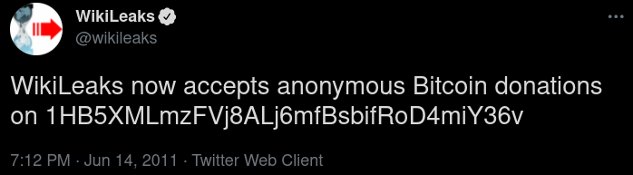

- 图 1.1 维基解密捐赠 <a href="https://twitter.com/wikileaks/status/80774521350668288">推特</a> -

这种看法大错特错，而且很大程度上是因为对比特币的底层功能模块缺乏了解。另一方面，也是因为在 2011 年，还没有多少人一直盯着区块链。但是，区块链是永存在，当时没有不代表未来没有。

今天，执法部门对区块链分析工具的运用，在许多高调的[取缔活动](https://www.coindesk.com/u-s-seized-more-than-1b-in-silk-road-linked-bitcoin-seeks-forfeiture-bloomberg)中派上了用场。一众区块链监控公司各自用博客抢先披露使用比特币支付的最新 “犯罪活动”。主流的传统媒体都在报道比特币的可追溯性。

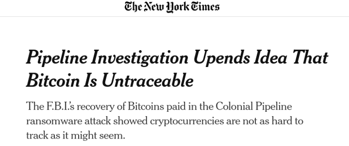

- 图 1.2 比特币是可以追踪的 <a href="https://www.nytimes.com/2021/06/09/technology/bitcoin-untraceable-pipeline-ransomware.html">头版头条</a> -

## 可追溯性占主导

比特币的隐私性，和用户在使用比特币支付时能做到的事，介于完全的匿名和完全可追踪之间。

大部分的追踪技术都基于对比特币流动情形的启发式研究和评估。比特币在协议层没有根本的隐私性加强措施，所以这些技术只能在应用层应对。

在比特币早期，随机的钱包指纹被用来击败启发式分析；custodial tumbler 之类的工具被用来防御财务流分析，只不过有资金损失的风险。今天的 coinjoin 和协作式交易（collaborative transaction）技术已经能支持一定的交易隐私，而且安全性比以往的方法都要强。但是，隐私增强技术在应用层的自动化，还有许多工作要做。

我们想要告诉大家还剩下哪些工作，以帮助用户获得（传统的金融网络一般能够提供的）基本的金融隐私。这是我们撰写这份文档的主要动机。在这篇指南里，我们会聊到以下内容：

1. “比特币可以跟踪” 到底式什么意思（包含案例）；
2. 可以用来击败追踪的防御措施以及它们是如何工作的；
3. 用户收发支付时候的实用考量。

## 问题陈述 —— 比特币是假名，而非匿名

比特币交易是假名的，但不是匿名的。用户的真实姓名和个人身份信息（PII）不包含在比特币协议内。它能提供非常基础的隐私性，因为交易活动必须追踪到个人才有意义。

不过，比特币的交易的金额和目标对象（地址）都是透明的。地址是假名，代表了一个真实用户的活动，或准确地说，一把私钥的活动。

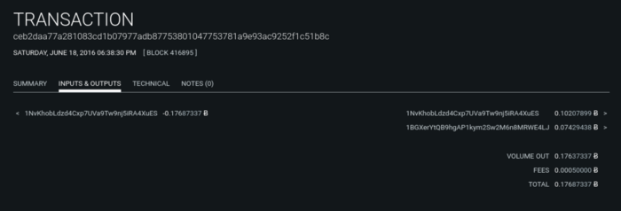

- 图 1.3 比特币交易 <a href="https://oxt.me/transaction/ceb2daa77a281083cd1b07977adb87753801047753781a9e93ac9252f1c51b8c">示例</a> -

比特币交易会被广播到比特币网络中并记录在比特币的账本上。这个账本，以及账本中记录的所有交易，对任何运行比特币节点软件的人和能够访问区块链浏览器网站的人都是可见的。

这种公开信息的透明度使得信息获取变得前所未有地便利，在传统金融系统中根本是无法想象的。

用户可以通过互联网浏览器来查看区块浏览器，看到整个区块链网络的全部历史交易。所以他们很容易就能跟踪比特币的流转情况。

广义地说，这种做法已经成了 “可追踪性” 和区块链分析的同义词。

最常见的区块链分析方法是瞄准交易的 “找零” 输出。整个过程就是基于一系列的启发式分析，这些分析方法可以用来跟踪一个用户在多笔交易中的活动。

如果链上的活动牵扯到了一个已经被识别出来的经济主体的钱包群，研究者就有可能获得这些交易的用户的个人身份信息。

**从这里我们就可以看出，有两大关键问题可以用来攻击用户的隐私：**

1. “找零” 输出可以用来跟踪用户在区块链上的活动
2. 这些活动，和已被识别个人身份信息的实体的交集，可以将观察到的活动与可能的真实个人关联起来。

虽然第二点是将区块链分析转化为现实世界强制执法的关键一环，但本文会集中在如何防范跟踪上。

## 启发式分析（Heuristics）

启发式分析是用于在不确定的条件下做选择的经验法则，往往基于实用的捷径。但既然是捷径，它就做不到 100% 准确。

大部分传统的区块链分析都基于启发式分析。主要的方法是根据公开的输入所有权线索来判定简单支付中的 “找零方向” 并归类地址。

孤立地来看，这些线索可能都是误导性的、不准确的。但如果跟额外的交易模式或外部数据（例如钱包聚类标签（wallet cluster labeling））相结合，这些短板对尝试性的跟踪来说就影响不大了。

## 未花费的交易输出（UTXO）

比特币的交易就是比特币在地址间流转的记录。

未花费的交易输出（UTXO）就是用来构造交易的 “比特块”。交易的结构可以分为输入和输出。

用户构造交易时可以指定目标地址（可多于一个）和支付金额。这些就是这笔新构建的交易的 *输出*。

一般来说，钱包软件会自动补全交易的结构，即通过算法来包含 UTXO（来源于以前的交易）作为新交易的 *输入*。

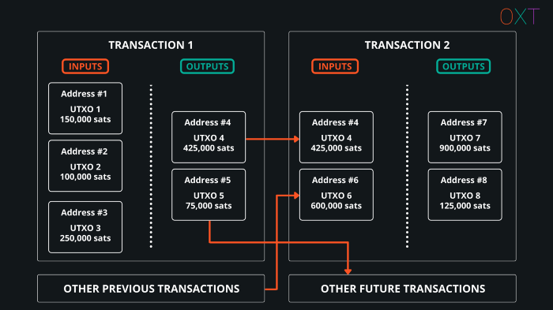

- 图 1.4 未花费的交易输出（UTXO） -

地址和 UTXO 之间是有区别的。UTXO 是支付给一个地址的 “成块的比特币”。最简单的认识方式是：一个地址可以收到多个 UTXO，一个对隐私有害的做法是 “重复实用同一个地址”。

## 交易示例

比特币的交易有几种常见的类型；这些类型是基于交易的输入输出以及我们的经验和已经观察到的聚类标签划分出来的。主要的交易类型示例如下。

### **简单支付**

简单支付可以说是最常见的交易类型，构成最近的比特币区块中的交易的大约 50%（来源：[transactionfee.info](https://transactionfee.info/charts/transactions-1in-2out/)）。

这些交易就是典型用户行为的证据：用户发起一笔支付、收回支付额以外的零钱。

**特征**：

- 输入的数量：1 个（或更多）
- 输出的数量：2 个
- 常见的解释：1 个输出是真正的支付；另一个输出是找零

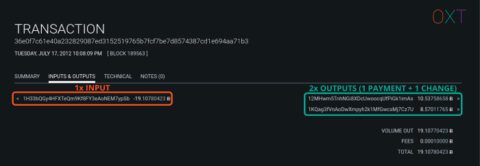

- 图 1.5 简单支付交易 <a href="https://oxt.me/transaction/36e0f7c61e40a232829087ed3152519765b7fcf7be7d8574387cd1e694aa71b3">示例</a> -

### **清扫**

“清扫” 就是把一个 UTXO 的全部资金转到一个新地址。

**特征**：

- 输入的数量：1 个
- 输出的数量：1 个
- 常见的解释：可能是一个人左手倒右手

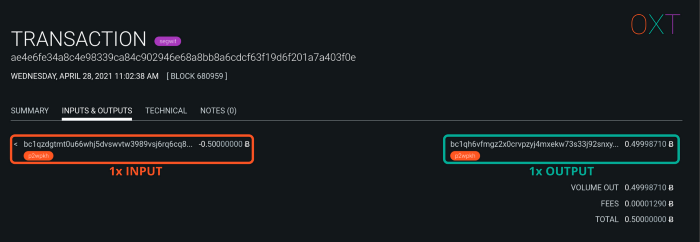

- 图 1.6 “清扫” <a href="https://oxt.me/transaction/ae4e6fe34a8c4e98339ca84c902946e68a8bb8a6cdcf63f19d6f201a7a403f0e">示例</a> -

### **整合支付**

整合支付就是把多个 UTXO 合并成一个 UTXO。这种行为很少是 “真实支付”，因为普通的支付一般都有找零。

**特征**：

- 输入的数量：多于 1 个
- 输出的数量：1 个
- 常见的解释：可能是一个人左手倒右手

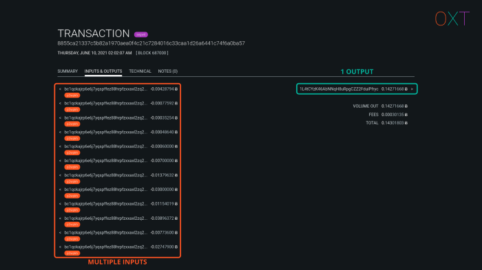

- 图 1.7 整合资金 <a href="https://oxt.me/transaction/8855ca21337c5b82a1970aea0f4c21c7284016c33caa1d26a6441c74f6a0ba57">示例</a> -

### **批量支付**

批量支付最有可能与交易所相关，往往包含一个或更多输入和许多输出。这些交易是为了节省矿工费而在一笔交易中塞入尽可能多的支付。

**特征**：

- 输入的数量：等于或多于 1 个
- 输出的数量：许多个
- 常见的解释：大型经济主体（比如交易所）的活动

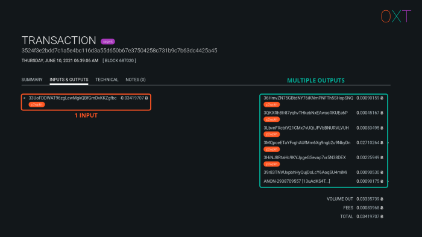

- 图 1.8 批量支付 <a href="https://oxt.me/transaction/3524f3e2bdd7c1a5e4bc116d3a55d650b67e37504258c731b9c7b63dc4425a45">示例</a> -

### **多方交易（Coinjoin）**

多方交易中包含了许多希望执行一笔交易的用户，而他们合作可以提高每一个参与者的隐私性。这些交易很容易识别出来，因为输入和输出的数量是相同的。

**特征**：

- 输入的数量：许多个
- 输出的数量：许多个
- 输出的组合：输出的数量也代表了参与者的数量

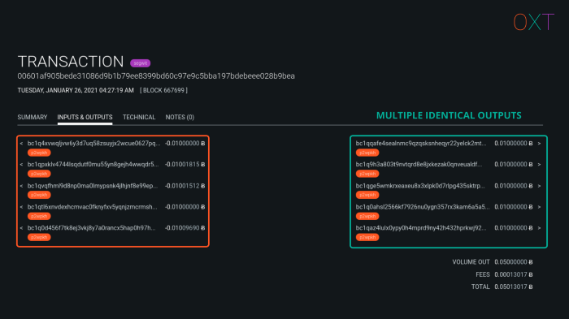

- 图 1.9 Coninjoin <a href="https://oxt.me/transaction/00601af905bede31086d9b1b79ee8399bd60c97e9c5bba197bdebeee028b9bea">示例</a> -

## 找零的方向 —— 简单支付的解释

本节我们会介绍简单支付（1 个输入，2 个输出）的解释。这里我们集中在这类交易最常见的解释上，即一个输出是支付，而另一个输出是找零（让资金回到交易发起人手上）。这种模式的完整解释会在本系列第三篇文章中列出。这里知识想让读者熟悉用来评估简单支付和检测找零输出的启发式分析。

在孤立地观察一笔交易时，我们能看到这笔交易内包含的有限信息，这些信息我们称为交易内部数据。

内部数据限于下面这些：

- 金额（输入、输出、矿工费）
- 输入地址的脚本类型
- 输出地址的脚本类型
- 交易版本号
- 交易锁定时间
- Replace by Fee 信号（表示在交易得不到确认时愿意以提高交易费来加速）

### **找零方向**

因为矿工费的存在，普通的比特币交易的总是需要你花费比你的意向支付数额更大的一笔资金。

而在你花用比意向支付金额更大的 UTXO 时，就自然会用私钥生成一个地址来接收找零 UTXO。

许多传统的链分析都基于检测这个找零输出。如果能够成功检测出哪个输出是找零，我们就能在一系列的交易中追踪同一个用户的行为。

本节中我们会基于交易内部数据来检测找零输出；所用的分析手段以准确度降序列出。每一种手段都会附带案例和带注释的截图，方便读者直观地理解这些概念。

### **地址重用**

地址是由私钥生成的；同一个地址多次使用，就表明了是同一个私钥的活动。

在简单支付中，如果一个输出是给一个新地址、另一个输出是返回输入地址的，我们就知道，这个重用地址的输出就是找零。

今天，大部分比特币钱包都会自动创建一个新地址来接收找零输出。不过，钱包软件也可以被配置成使用输入的地址来接收找零。这种情形通常表明该人使用了中心化的钱包服务，或使用了旧版本的 bitcoin core 软件。

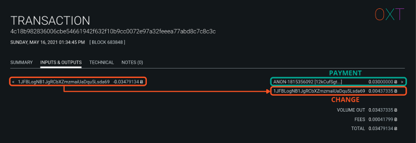

- 图 1.10 地址重用 <a href="https://oxt.me/transaction/4c18b982836006cbe54661942f632f10b9cc0072e97a32feeea77abd8c7c8c3c">案例</a> -

### **整数支付额**

在用户发起一笔支付时，他们在钱包软件中输入支付目标地址和支付金额，以及网络手续费；钱包软件会负责选择 UTXO 用作输入，并生成找零输入（如果有的话）。

找零的金额也很容易计算，就是：

> 输入的金额 - 支付额 - 交易的数据大小（以 vbyte 计量）* 网络手续费率（以 聪/vbyte 为单位）

那么，用户的找零输出金额很难做成 “整数”。在简单支付中，整数的输出更有可能是支付，剩下的那个才是找零。

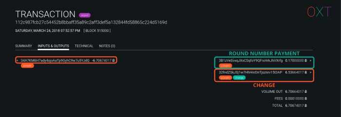

- 图 1.11 整数支付额线索 <a href="https://oxt.me/transaction/112c987fcb27c54452b8bbaff35a89c2aff3def5a132844fd58865c224d5169d">示例</a> -

### **不同的脚本类型**

比特币有许多种地址（脚本）类型。读者最熟悉的可能是以下几种：

- 支付到公钥哈希值（P2PKH）：地址以 1 开头
- 支付到脚本哈希值（P2SH）：地址以 3 开头
- 原生隔离见证（0 版本）（bech 32）：地址以 bc1q 开头

输入的脚本（地址）类型是给定的，如果一个输出的类型与输入的相同、而另一个输出给到了新的地址类型，那给到新地址类型的更有可能是支付，而相同类型的更有可能是找零。

换句话来说，给到不同地址类型的输出更有可能是支付输出。这个线索可以跟整数支付额结合起来。

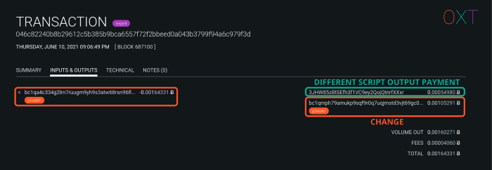

- 图 1.12 输出的脚本类型不同 <a href="https://oxt.me/transaction/046c82240b8b29612c5b385b9bca6557f72f2bbeed0a043b3799f94a6c979f3d">示例</a> -

### **最大的输出金额**

另一个简单的线索是，假设面额最大的输出就是找零。这种线索是最弱的，就其本身来说；但我们会在本系列第二篇讲到，这个线索在交易图谱分析里面是非常有用的。

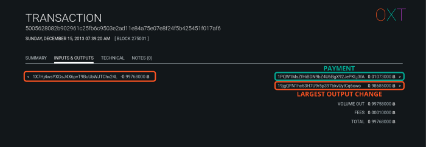

- 图 1.13 最大的输入线索 <a href="https://oxt.me/transaction/5005628082b902961c25fb6c9503e2ad11e84a75e07e8f24f5b425451f017af6">示例</a> -

## 复习和预习

在本篇中，我们介绍了围绕比特币隐私性的基本概念。准匿名的比特币提供了非常基础的隐私性，交易活动不直接与个人身份信息相关联。

不过，比特币协议的开放性使得第三方也能跟踪比特币的流动。这个概念通常被称为 “区块链分析”。区块链分析的一个核心是通过启发式分析来辨别找零支出。如果辨识成功，这些分析就能让在一系列的交易中跟踪同一个用户的活动。

**[本系列第二篇](https://medium.com/oxt-research/understanding-bitcoin-privacy-with-oxt-part-2-4-20010e0dab97)会介绍区块链分析的核心概念，例如**：

1. 交易外部数据（可以用来弱化交易的隐私性）
2. 交易图谱分析，跟踪比特币流转情形的主要工具
3. 常见输入所有权线索，也叫 “钱包聚类分析”，以及它对比特币网络的影响
4. **本篇也会介绍 OXT 交易图谱工具和钱包聚类方案的讲解和案例**

**本系列第三篇会讲解提高比特币活动隐私性的核心概念，包括**：

1. 随机化的钱包指纹，抵御找零检测
2. UTXO 流以及输入、输出之间的根本关联
3. 输入和输出数量相同的 coinjoin 如何解决确定性流动的问题
4. 交易熵
5. payjoin 如何抵御常见输入所有权的启发式分析

**第四篇将讨论**：

1. 分析需要一个 “起点”
2. 发送和接收支付对隐私性的影响
3. 现有的隐私技术如何缓解本系列教程介绍的隐私问题

（完）
