> *作者：Samourai Wallet*
>
> *来源：<https://medium.com/oxt-research/understanding-bitcoin-privacy-with-oxt-part-2-4-20010e0dab97>*
>
> *[前篇中文译本](https://www.btcstudy.org/2021/11/13/understanding-bitcoin-privacy-with-oxt-part-1/)*

## 简介

我们已经在 Part 1 中介绍了比特币的基本概念，接下来将分析范围扩大到 “外部” 交易数据来探究区块链分析背后的核心概念。

本文将聚焦于最重要的两个区块链分析工具：

1. 交易图
2. 共同输入所有权启发法（又称钱包聚类）

## 外部交易数据

通过额外的信息和模式，我们可以使用外部交易数据来提高找零检测的置信度（降低交易的隐私性）。

外部交易数据包含任何信息，并不仅限于每个比特币交易中包含的信息。一些例子有：

- 多个交易来自同一个地址
- 同一笔交易包含来自多个地址的支出（钱包聚类）
- 多签脚本（只有在 UTXO 被花费后才会显示）
- 一系列交易的钱包指纹
- 链下数据，例如，支付给带标记集群的输出和广播交易的节点的 IP 地址
- 交易量、交易时间和其它交易模式识别分析

## 交易图分析

交易图是反映多个交易的输入和输出之间关系的最简单方式。

OXT 使用的交易图是有向无环图（Directed Acyclic Graph，DAG）。DAG 图被用来映射两个不同对象之间的关系。就比特币而言，其 DAG 交易图映射的是 UTXO 和交易之间的关系。

### OXT 交易图的基础知识

交互是理解交易图的最佳方式。但是，在开始交互之前，我们先介绍一下 OXT 交易图的部分功能。

1. 如果你想访问交易图，输入或点击你感兴趣的交易 ID 进入 OXT 的 “**TRANSACTION**” 页面。
2. 点击界面左侧工具栏中的 “**TX GRAPH ICON**” 图标。

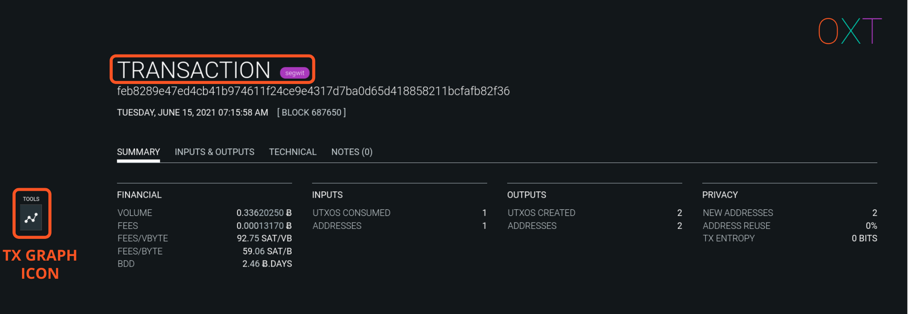

- 图 2.1 OXT 交易界面和交易图图标 -

你将看到起始交易。交易在图中表示为顶点（圆圈）。顶点通过显示一笔交易所消耗和创造出的 UTXO 之间的关系来表示 UTXO 集合的变化。

单击即可选中交易。交易被选中后，其顶点会从蓝色变为绿色，且（屏幕左侧）的工具栏上会出现更多选项。

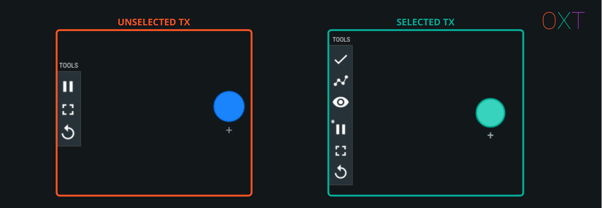

- 图 2.2 被选中的交易和工具栏 -

工具栏图标可执行如下操作：

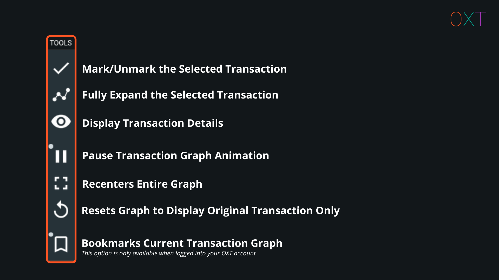

- 图 2.3 交易图工具栏中的操作 -

双击该交易可显示所有 UTXO。这些 UXTO 都表示为 “边（即，线）”，并使用箭头来代表输入（指向交易）和输出（背向交易）。图中还将显示创建输入或消耗输出的交易。如果某个输出没有被花费，该 UTXO 的顶端会显示一个空心方块。

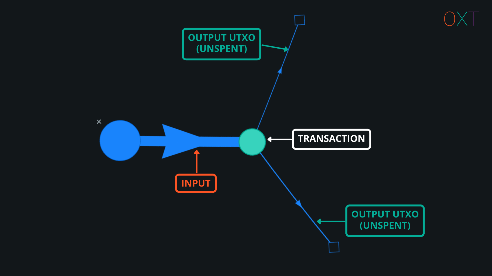

- 图 2.4 完全展开后的交易 -

双击或完全展开交易会让你的交易图变得杂乱难懂。为了尽可能避免这种情况，我们建议你有选择地展开 UTXO。具体操作是：选中一笔交易并打开交易详情窗口，再将鼠标移动到地址文本右侧选中对应的 “展开交易图” 图标，即可有选择性地展开交易输入和输出。

- 图 2.5 有选择性地展开 UTXO -

将鼠标移动到图中的某个输入或输出上，即可显示你感兴趣的输入或输出的额外信息，无需展开交易详情窗口。

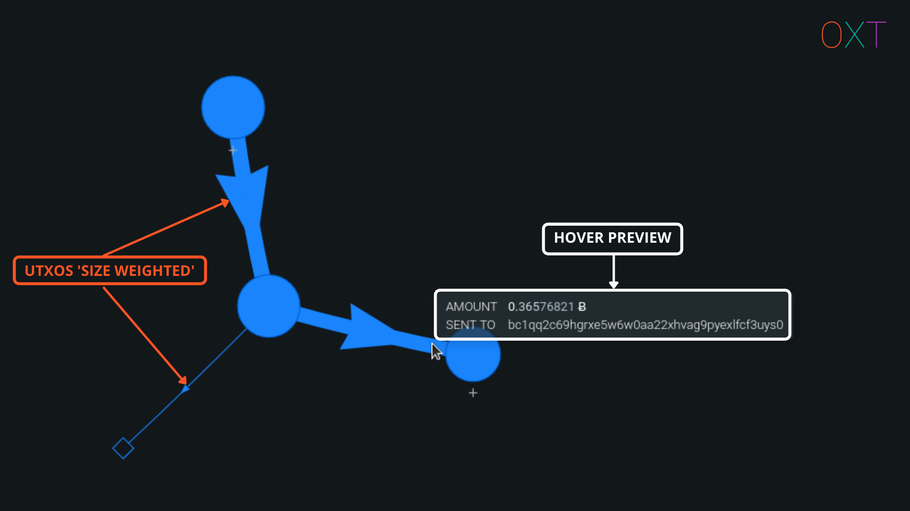

- 图 2.6 交易图的线宽和预览 -

OXT 交易图还有助于自动处理一些额外信息。交易和 UTXO 将根据其 BTC 数量进行相对加权。这有助于监测找零和图解 “peel chain（将一大笔 BTC 拆分成小额 BTC 通过一系列交易发送至新的地址）”，具体讨论请参见下文。

### OXT Peel Chain 交易图示例

下面来看一个简单的交易图示例。

1. 点击超链接前往[交易](https://oxt.me/transaction/351664e86e48c81ddd14f418893d4aede75546d16075dea47157144a30af687e)页面并展开交易图。
2. 单击选中交易。
3. 点击左侧工具栏的图标打开交易详情窗口。

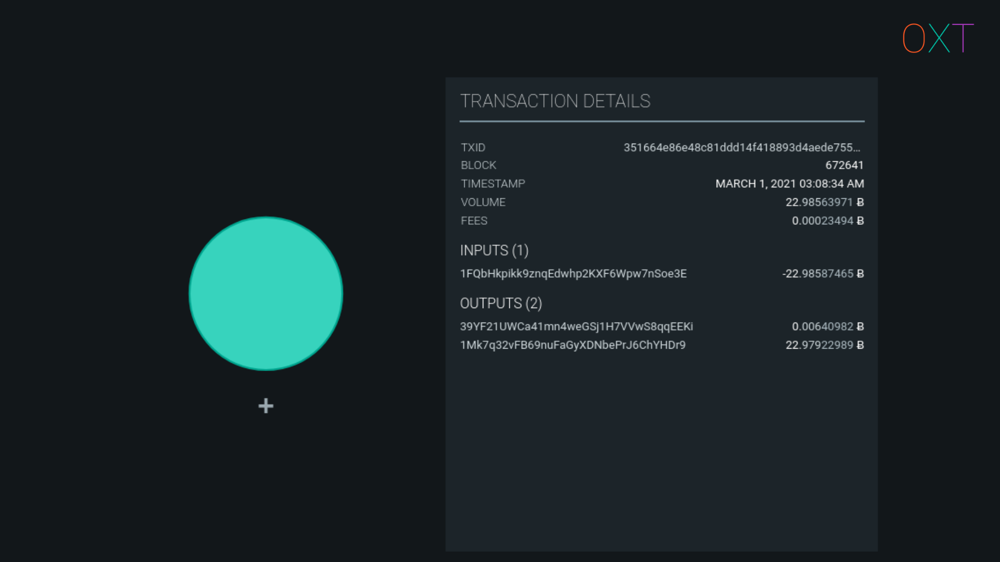

- 图 2.7 已选中的交易和交易详情 -

4. 双击起始交易，展开所有输入和输出。
5. 使用鼠标滚轮缩小页面，点击并按照你想要的顺序拖拽交易进行排序（从左往右），重新调整交易图。

如果我们试图追踪创建该交易的钱包的活动，这两个输出将一个问题摆在了我们面前：

我们该追踪哪个输出？

如果我们采用差异脚本启发法（见 [Part 1](https://medium.com/oxt-research/understanding-bitcoin-privacy-with-oxt-part-1-4-8177a40a5923)），我们会将第二个输出视为找零。

6. 双击下一个花费来自起始交易的第二个输出的交易。
7. 使用 Part 1 中介绍的启发法重复找零识别流程，再多扩展两个交易。

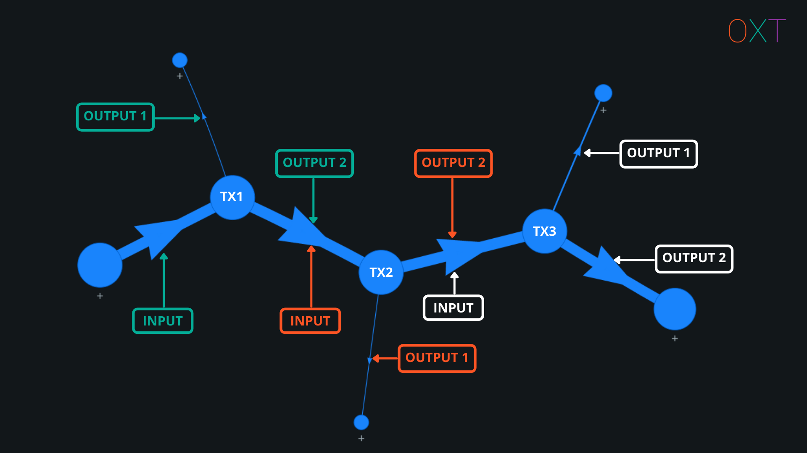

- 图 2.8 Peel Chain 示例（交易图<a href="https://oxt.me/BOOKMARK/60D3C389E5C165230824AF81">书签</a>） -

之后，交易图就如图 2.8 所示。若想强调找零 UTXO，你可以使用左侧工具栏按钮以橙色高亮显示找零 UTXO。显示来自同一个钱包的一连串简单支出的交易图通常被称为 “peel chain”。

区块链监控公司试图将 “peel chain” 界定为一种与 “结构化或洗钱” 相关的可疑活动。尽管如我们在 Part 1 中所述，大约有 50% 的比特币交易是只有 1 个或 2 个输出的简单支出，也就是完全正常的行为。

对于我们来说，“peel chain” 就是追踪一个钱包的多个交易活动的简单流程。

### 钱包指纹和交易图解读

如果你继续与示例 “peel chain” 交互下去，就会根据种种迹象越来越明显地察觉到钱包指纹的一致性。这些迹象包括：

1. 在 OXT 的自动线宽功能下显示的最大输出会让找零输出变得显而易见。
1. 找零输出永远支付给 P2PKH 地址。
1. 找零输出永远是两个输出中的第二个。
1. 有两个没有在交易图中显示但值得我们注意的地方是，交易版本号（2）和锁定时间（0）是否一致。要想看到这两个信息，点击交易详情窗口中的交易 ID 进入交易界面，然后选中 “TECHNICAL ” 选项卡查看交易版本号和锁定时间。
1. 展开该交易图的过去或未来支出记录将暴露更多类似交易。

上述每个迹象都可以用来描述被观察钱包软件的行为。这些行为统称为钱包指纹，采用了以下模型：

1. 输入和输出地址脚本
1. 找零 UTXO 位置一致性
1. 版本号和锁定时间

综合上述模型可以让分析师对自己的找零输入解读更加自信。我们已经通过与 “peel chain” 相关的服务交互确认了这些找零解读。示例 “peel chain” 展示了一个知名托管式混币机制的交易活动。你可以通过在交易图上回溯这笔交易的源头，找出与一场交易所被盗事件有关的币。

在下一章节，我们将讨论如何通过钱包聚合和监控流向中心化服务的输出来进一步优化交易图分析。

## 钱包聚类 —— 共同输入所有权启发法

还有一个重要的区块链分析工具被称为 “钱包聚类”。聚类就是根据共同支出模式和对正常钱包软件行为的假设，将多个地址归为同一主体。

如今，大多数比特币钱包都是分层确定性钱包（hierarchical deterministic wallet）。它们生成一个主私钥并由此派生出 子私钥/子公钥 和相关地址。

钱包软件通常会为每笔收到的付款（收到的 UTXO）创建一个新的地址。如果一个 UTXO 或一个地址的余额不足以支付一笔款项，钱包就会将不同 私钥/地址 控制的其他 UTXO/地址 包含进来，以便支付所需金额。大多数钱包无需用户输入即可自动进行该操作。

基于这个正常的钱包功能和 私/公钥密码学 的支持，分析师可以**假设**所有在同一笔交易中被用作输入的地址都由同一个私钥或钱包软件控制。

<strong><em>这种认为一笔交易的每个输入都由同一个钱包控制的假设叫作共同输入所有权启发法（common input ownership heuristic，CIOH），简称合并输入启发法。</strong></em>

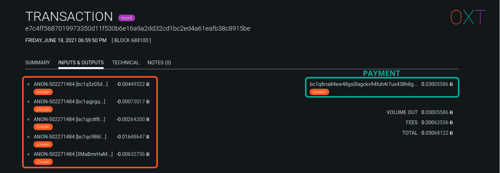

- 图 2.9 CIOH 和集群<a href="https://oxt.me/transaction/e7c4ff5687019973350d11f530b6e16a9a2dd32cd1bc2ed4a61eafb38c8915be">示例</a> -

与其它所有启发法一样，CIOH 在一些特定场景中并不成立。CIOH 尤其不适用于经过特殊构建的隐私增强型交易。我们将在本系列的后续文章中介绍 CIOH 不适用的场景以及 OXT 是如何处理这些特殊场景的。

### ANON —— OXT 的聚类方案

分析软件通常会为假设由同一个钱包控制的不同地址提供一个钱包集群 ID。由于比特币的伪匿名性，一个钱包集群有可能代表一名用户或一个中心化服务的活动。

但是，如果没有额外的信息，这个钱包依然是 “匿名的”，因为它没有与任何现实世界的实体活动联系起来。因此，OXT 会为每个新的集群提供一个 ANON 前缀并带上索引号。

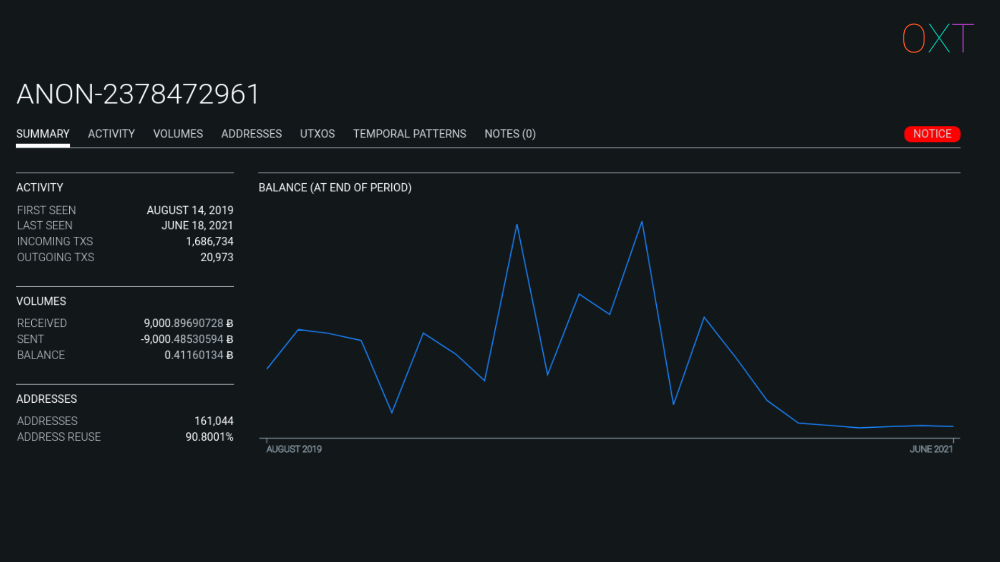

- 图 2.10 ANON 钱包集群<a href="https://oxt.me/entity/tiid/2378472961">示例</a> -

OXT 会计算多种集群活动，包括：

- 一般活动汇总（余额、交易量、活跃日期、地址数量）
- 每月交易活动和每日交易活动、BTC 的发送量和接收量、UXTO 的发送量和接收量和地址统计数据
- 按一周里的某天和某几个小时内创建的临时集群活动模式
- 一个注释部分，OXT 用户可以在调查期间往里添加注释，说明与未知集群交互的可能归因或上下文。

OXT 的一般集群统计数据无需通过账户即可查看。但是，有了免费的 OXT 账户（无需邮箱注册），用户可以访问额外的功能。登陆账户后，用户可访问集群统计数据，包括每日余额、每日交易量、交易列表、地址列表等等。

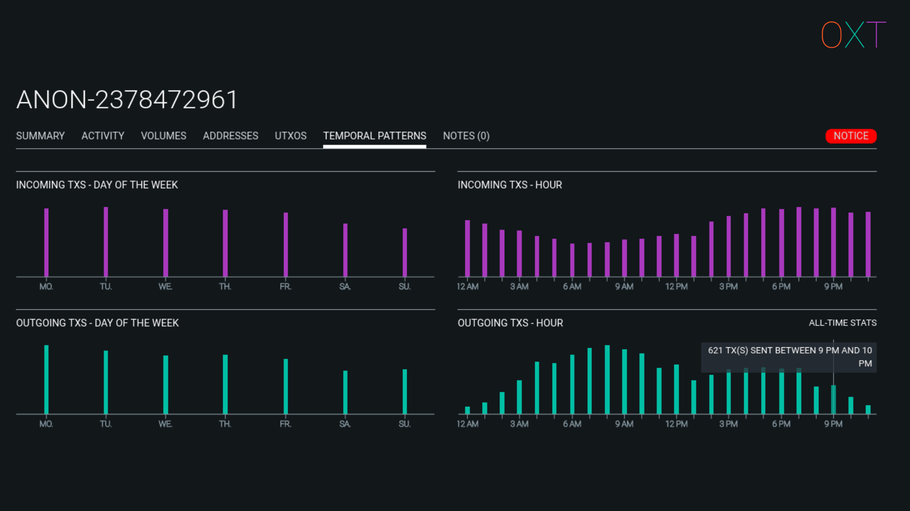

- 图 2.11 ANON 钱包集群的临时模式 -

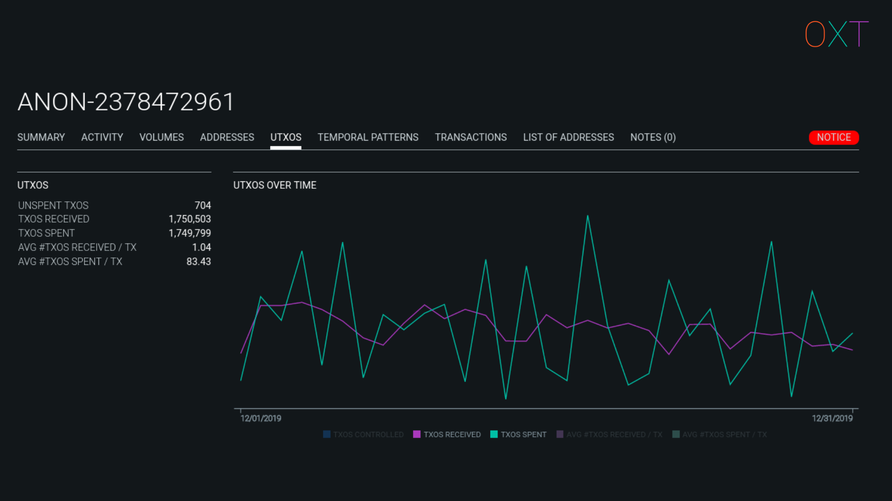

- 图 2.11 ANON 钱包集群的 UTXO 活动标签页 -

### 集群归属 —— 带标记的服务 

OXT 会使用 CIOH 来追踪钱包集群的链上活动。要将钱包集群归属于某个特定的服务需要与该服务交互。

分析师可以使用某个服务创建一个账户并将 BTC 发送到该服务提供的存款地址。然后，分析师可以监控该存款地址中 UTXO 的支出情况。一旦存款地址中的 UTXO 被花掉，分析师可以找到与该地址及共同花费地址对应的集群 ID。

或者，分析师可以使用开源情报技术来搜索服务用户发布的公开信息。存款和取款地址通常可以在社交媒体帖子里找到。这些公开数据也可以用来发现钱包集群和中心化服务之间的归属关系。

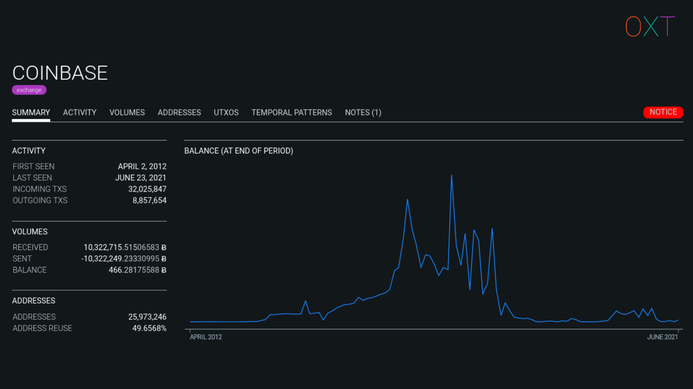

- 图 2.13 带标记的集群<a href="https://oxt.me/entity/coinbase">示例</a> -

## 将外部交易数据应用于找零检测

钱包指纹、输出的支出时间和输出聚类等额外信息可以用于找零检测解读。

对交易隐私破坏性最强的是向已识别为中心化服务的钱包集群发送一笔简单的付款。

当我们向中心化服务发送一笔简单的付款时，所有混淆找零检测的措施都会失效。显然，流向中心化服务的输出就是付款，余下的那个输出就是找零输出。以上述 “peel chain” 示例为例，未来支出情况如下图所示。

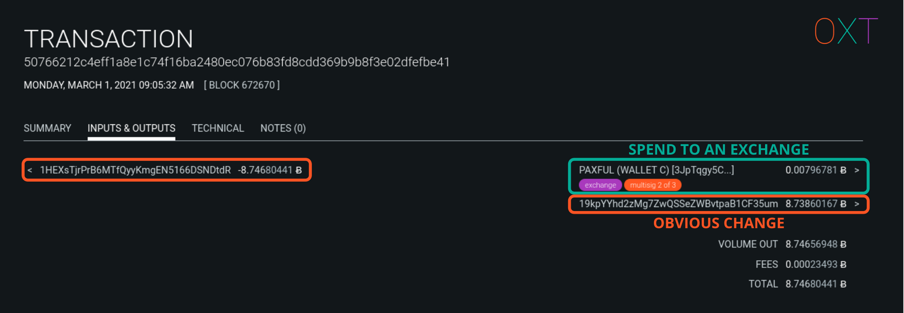

- 图 2.14 支付给交易所的简单付款<a href="https://oxt.me/transaction/50766212c4eff1a8e1c74f16ba2480ec076b83fd8cdd369b9b8f3e02dfefbe41">示例</a> -

就 CIOH 而言，最重要的并不一定是它会被用来攻击个人用户的隐私性，而是围绕中心化服务的钱包聚类对比特币网络交易图的隐私性产生了严重的负面影响。

比特币的经济活动很大程度上与中心化服务有直接关联，因为中心化服务对于整个比特币网络交易图有着很强的中心化影响。

## 回顾

在 [Part 1 ](https://medium.com/oxt-research/understanding-bitcoin-privacy-with-oxt-part-1-4-8177a40a5923)和 Part 2 中，我们介绍了区块链分析的基础知识，包括找零检测、交易图分析和共同输入所有权启发法。

找零检测包含一系列用于确定可能的交易找零输出的启发法。交易图分析可以快速且直观地阐明这些启发法的解读，以便追踪单个用户的活动。额外数据（包括根据共同输入所有权启发法进行的钱包聚类）也可用来提高找零检测的置信度。找到钱包集群与用户或中心化服务活动之间的归属关系需要额外的区块链数据来将可疑地址和支出活动与中心化服务关联起来。

在接下来的文章中，我们将介绍可以击败区块链分析，提高用户追踪难度的概念。

**Part3 介绍了提高比特币隐私性的核心概念，包括：**

1. 可以击败找零检测的随机钱包指纹
2. UTXO 流以及输入和输出之间的基本联系
3. 如何使用输出相同的 CoinJoin 交易解决确定性流的问题
4. 交易熵
5. 如何使用 PayJoin 交易击败共同输入所有权启发法

**Part4 讨论了**：

1. 分析需要 “起点”
2. 发送和接收付款对隐私性的影响
3. 现有的隐私技术如何缓解本指南中讨论的诸多问题

（完）

> *[后篇中文译本](https://www.btcstudy.org/2021/12/27/understanding-bitcoin-privacy-with-oxt-part-3/)*