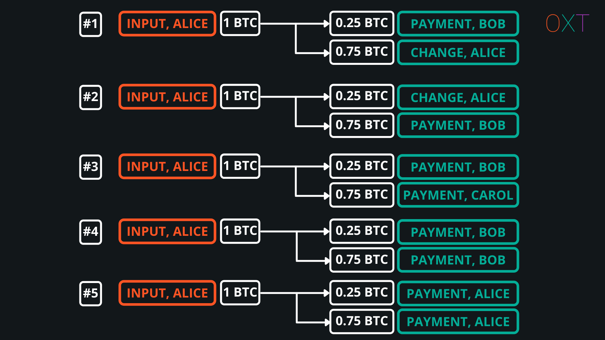
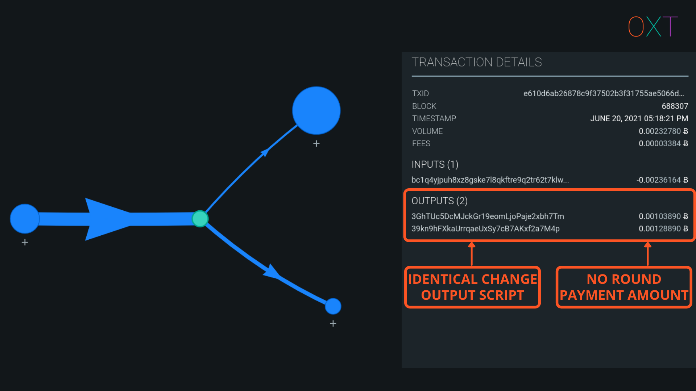
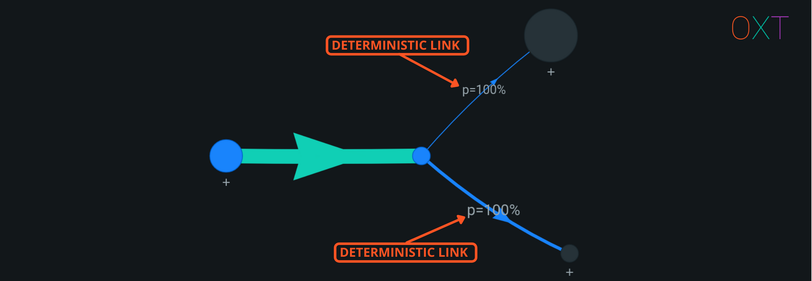
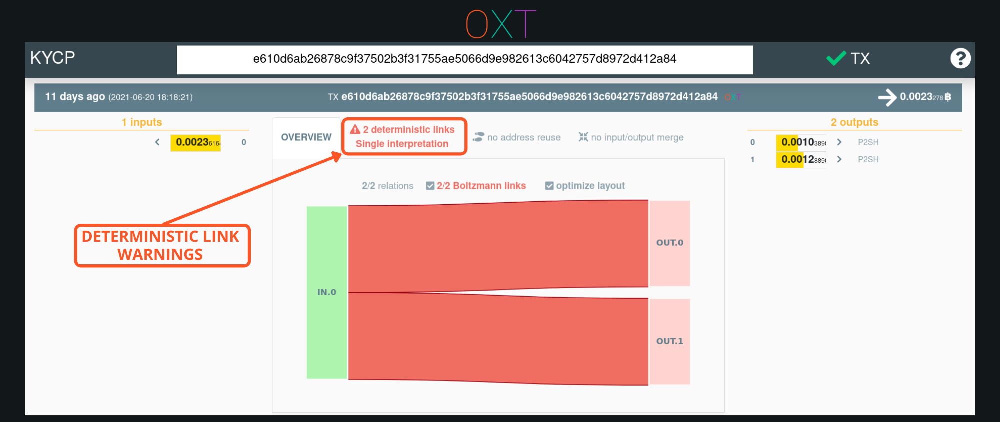
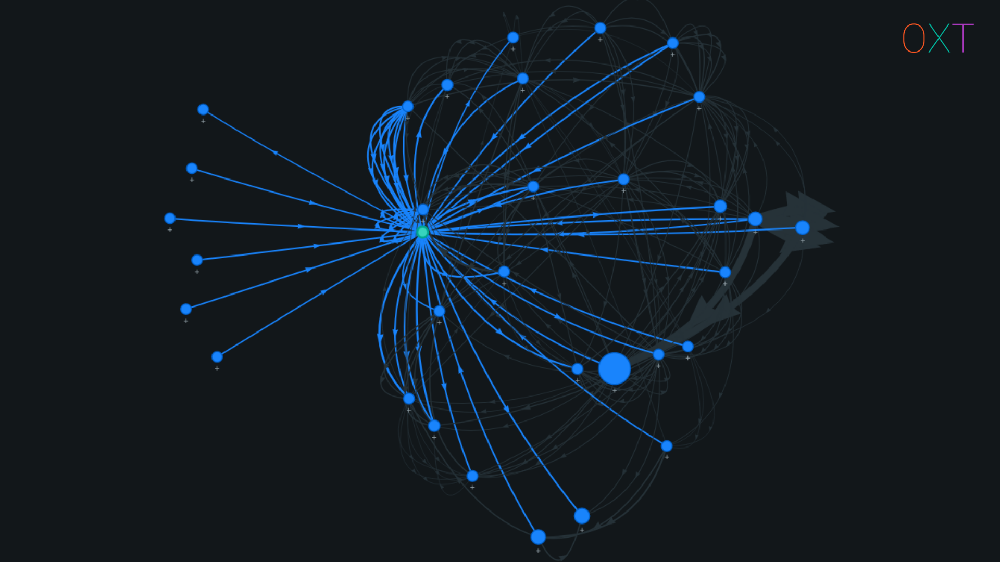
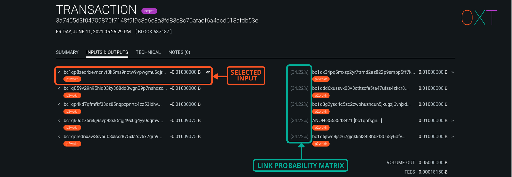
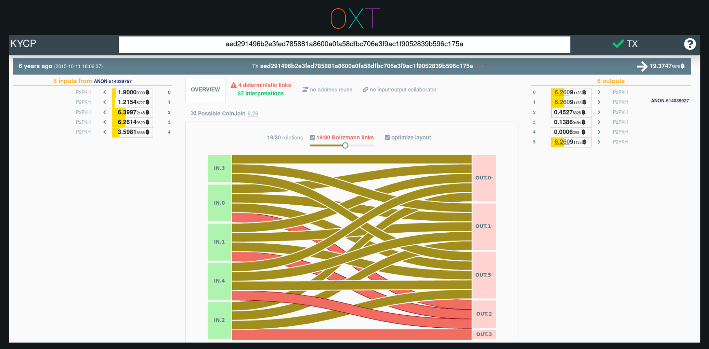
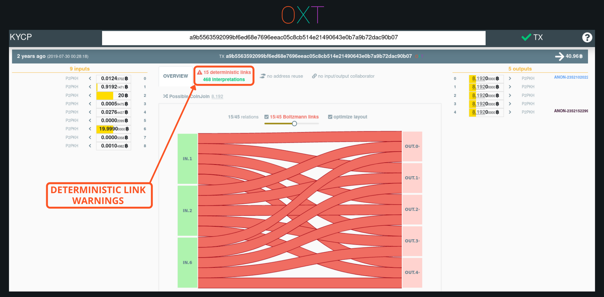
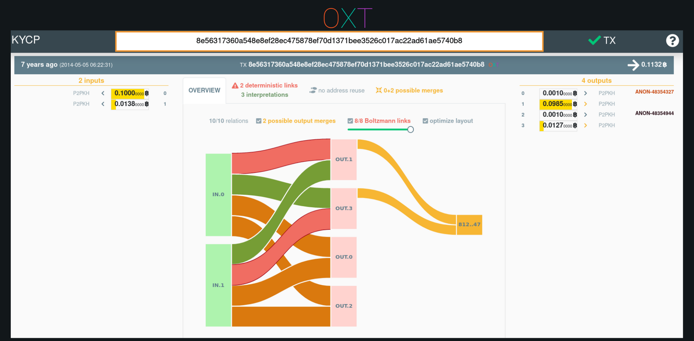
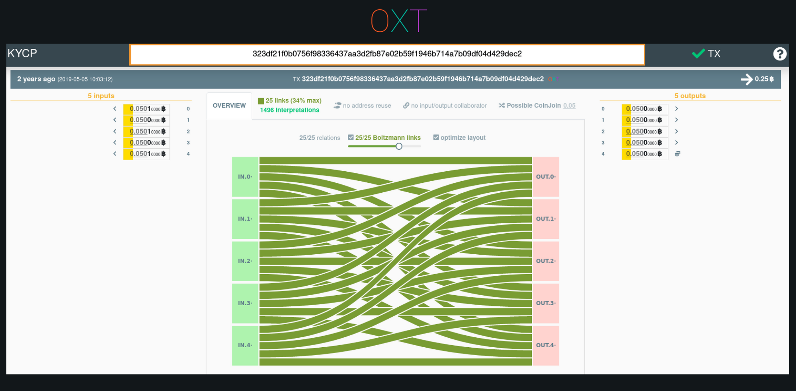

> *作者：Samourai Wallet*
>
> *来源：<https://medium.com/oxt-research/understanding-bitcoin-privacy-with-oxt-part-3-4-9a1b2b572a8>*
>
> *[前篇中文译本](https://www.btcstudy.org/2021/12/15/understanding-bitcoin-privacy-with-oxt-part-2/)*

## 介绍

我们已经在 [Part 1](https://medium.com/oxt-research/understanding-bitcoin-privacy-with-oxt-part-1-4-8177a40a5923) 和 [Part 2](https://medium.com/oxt-research/understanding-bitcoin-privacy-with-oxt-part-2-4-20010e0dab97) 中介绍了区块链分析的基础概念。Part 3 将讨论破坏区块链分析的方法。

在本文中，我们将探究以下内容：

1. 打败针对简单花费的找零检测启发法
2. 利用等输出额的 CoinJoin 交易形成模糊的交易图
3. 利用 CoinJoin 交易打败 CIOH

## UTXO 所有权模型和简单花费的模糊性

在之前的文章中，我们介绍了针对只有一个输入和两个输出的简单花费的找零检测启发法。我们**假设**了交易包含一笔付款输出和一笔找零输出。

事实上，根据 UTXO “所有权模型”，简单花费有很多其它解释可能。所有权模型试图为交易的输入和输出确定所有权。关于有一个输入和两个输出的交易的所有权解释完整版如图 3.1 所示。

- 图 3.1 简单花费的 UTXO 所有权模型 -

分析师必须考虑上述每一种解释，尤其是在仅使用内部交易数据的情况下。额外的钱包指纹、正常钱包行为和典型用户行为可以用来对解释作排除法。

从典型用户行为的角度来看，解释 #1 和 #2 的可能性最高。解释 #3 和 #4也是有可能的，尽管许多比特币钱包都没有批量花费功能。解释 #5 的可能性很低，因为需要支付额外的交易费，而且会导致 UTXO 集合膨胀。

外部交易数据（如发送到中心化服务或重复使用的地址的输出）可以用来排除解释。由于比特币交易图集中于中心化服务和正常用户模式，分析师很少会在实际分析过程中考虑所有这些解释。

## 打败找零检测启发法

旨在打败 Part 1 中所述的找零检测启发法的钱包软件能够让交易变得更加模糊。我们来单独看看下面这个交易，这是一个经过 “最大程度” 模糊化的简单花费。

- 图 3.2 模糊的简单花费（<a href="https://oxt.me/transaction/e610d6ab26878c9f37502b3f31755ae5066d9e982613c6042757d8972d412a84">TxID</a>） -

### 整数付款启发法防御

付款额由用户决定。如果用户选择整数付款额，钱包很难抵御应用于简单花费的整数付款启发法。对于大多数真实的付款（以法币计价）来说，这个启发法不太可能奏效。图 3.2 中的例子没有使用整数付款额，并采用了针对整数付款启发法的保护措施。

### 相同的找零输出脚本类型

示例交易的两个输出都采用了相同的输出脚本类型，因此特殊脚本输出启发法并不适用。这有助于维持模糊性，并增加找零检测的难度。

### 随机化的找零输出位置

为了进一步增强该钱包在一系列交易中的行为模糊性，钱包软件必须将找零输出的位置随机化。在输出 0 和 1 之间交替安排找零位置会让针对钱包（如图 2.8 中所示的活动）的自动化追踪变得更难。

### 评估包含外部交易数据的交易

OXT 的交易图使用不同的线宽来表现 UTXO 和交易量的相对大小。这样一来，自动展开交易图会包含一些外部交易数据。

*根据交易图和未来的 UTXO 花费情况，哪个输出有可能是付款？该交易中的地址之前有没有被重复使用过？*

这就是使用外部交易数据来确定付款和找零输出的绝佳示例。展开交易图或追踪未来的 UTXO 花费情况验证你的 付款/找零 假设。

## UTXO 流和确定性花费

钱包可以使用相同的找零输出脚本和随机化的找零位置来维持简单花费的模糊性，但是这样无法掩盖交易的输入和输出之间的基本关联。

交易的输入和输出之间始终存在关联。这些存在于交易内的 UTXO 关系可以被视为 “流”。输入 UTXO 所消耗的 BTC 被转移到了输出 UTXO 中。

- 图 3.3 OXT 交易图的 UTXO 流可视化（<a href="https://oxt.me/transaction/e610d6ab26878c9f37502b3f31755ae5066d9e982613c6042757d8972d412a84">TxID</a>） -

在简单花费（只有一个输入和两个输出）中，唯一的输入一定被拆分成了两个输出。一个简单花费的内部交易流只有一种解释。因此，单个输入和每个输出之间的关联在数学上具有确定性（**确凿无疑**）。

你可以在 OXT 交易图上选择某个输入或输出来查看输入和输出之间的关联。[kycp.org](http://kycp.org/) 的交易可视化界面显示了交易的内部关联。

- 图 3.4 KYCP 的 UTXO 流可视化（<a href="https://kycp.org/#/e610d6ab26878c9f37502b3f31755ae5066d9e982613c6042757d8972d412a84">TxID</a>） -

## 打破关联 —— 非确定性交易

尽管 UTXO 所有权模糊性始终存在，但是仅靠 UTXO 所有权模型并不能混淆链上 BTC 流。如果不打破确定性关联并向交易图中引入模糊性，比特币将永远是 “可追溯的”。

打破确定性关联并产生链上模糊性需要采用特定的交易结构。确定性取决于交易输入和输出的数量，以及每个 UTXO 中的 BTC 数量。

有多个输入和输出的交易本身就可以创建一个复杂的交易图。如果不借助特殊的工具或经过特别的考量，这类交易解释起来绝非易事。

- 图 3.5 拥有多个输入和输出的交易示例（<a href="https://oxt.me/transaction/c7d1e40ae001a7fe4c860f9b7ddddcf9b5a3dad461466744e9b5e28c4b47e6b7">TxID</a>） -

尽管交易图如此复杂，我们仍可以对拥有多个输入和输出的交易的 UTXO 之间的确定性关联进行评估。Kristov Atlas 是最先在他的 “[CoinJoin 数独](https://github.com/kristovatlas/coinjoin-sudoku)” 咨询和算法中引入这一概念的人。

CoinJoin 可以让多名用户将他们的资金集中起来，共同创建一个交易。通常情况下，这个交易的每个输出额都相等。CoinJoin 数独算法使用数学领域的子集总和分析从输入和输出的 “共同所有权” 角度对交易进行评估。

CoinJoin 数独所涉及的数学概念不在本文的讨论范围内。此处想要强调的重点是，如果 CoinJoin 交易的构造过于简单，我们完全可以通过评估找出其内部的确定性关联。

如今，CoinJoin 数独概念已经得到了进一步扩展。由 OXT 开发主管 [LaurentMT](https://twitter.com/laurentmt) 创建的 [Boltzmann](https://code.samourai.io/oxt/boltzmann) 算法使用 CoinJoin 数独概念评估交易的一些隐私相关指标。

即使是正确构造的 CoinJoin 交易，**输入和相等输出之间的关联依然存在，但是这些关联是概率性的而非确定性的**。Boltzmann 算法通过计算关联概率矩阵（LPM）来确定交易的输入和输出之间的关联。

交易的 LPM 输出可以在 OXT 的 TRANSACTION 页面上看到。INPUTS&OUTPUTS 选项卡内可查看交易的单个输入和每个输出之间的子集。点击你感兴趣的 UTXO 右侧的 “🔗” 图标即可查看。

- 图 3.6 OXT 关联矩阵子集（<a href="https://oxt.me/transaction/3a7455d3f04709870f7148f9f9c8d6c8a3fd83e8c76afadf6a4acd613afdb53e">TxID</a>） -

你也可以在 OXT 交易图（见图 3.3）中选择输入和输出来查看被选中的 UTXO 的 LPM。根据 Boltzmann 算法计算出的完整 LPM 可以在 [kycp.org](http://kycp.org/) 上查看。

- 图 3.7 KYCP UTXO 流和 LPM（<a href="https://kycp.org/#/aed291496b2e3fed785881a8600a0fa58dfbc706e3f9ac1f9052839b596c175a">TxID</a>） -

## 熵 —— 等输出额的 CoinJoin 交易以及 CIOH 的适用场景

在一个等输出额的 CoinJoin 交易中，多名用户通过共同创建交易的方式来将自己的资金集中起来，打破交易的输入与等额输出之间的确定性关联。

由于这类交易包含多名用户，CIOH（共同输入所有权启发法）并不适用。如果有可能是 CoinJoin 交易的交易的输入由同一个钱包控制，CIOH 可能会得出错误的钱包集群。

为避免出现这种情况，分析师可以对有可能是 CoinJoin 交易的交易采用等输出额启发法。但是，并非所有等输出额的交易都是 CoinJoin 交易。如果一个拥有多个等额输出的交易构造过于简单，其内部输入和**等额输出**之间可能依然存在确定性关系，从而证明这个交易**不是** CoinJoin 交易。

- 图 3.8 存在确定性关联的等输出额交易（<a href="https://kycp.org/#/a9b5563592099bf6ed68e7696eeac05c8cb514e21490643e0b7a9b72dac90b07">TxID</a>） -

有了 Boltzmann，分析师可以真正评估交易的 CoinJoin 属性，而非错误地对交易进行聚类分析或简单地将等输出额的交易排除在外。

Boltzmann 本质上是利用子集总和分析来追问这样一个问题：*交易的输入是否有可能通过多种方式产生输出（是否存在多种解释）？*

如果一个交易的内部 UTXO 流有多个解释，Boltzmann 给该交易的熵打分会大于或等于 0。熵的概念源自热力学心智模型。在这个模型中，我们可以将解释的数量看作是整个交易的宏观状态下的微观状态数量。

**熵可被视为衡量分析师对其所观察交易的确切配置了解匮乏程度的指标。**

带有熵的交易不仅具备 CoinJoin 属性，而且丧失了确定性关联。CoinJoin 属性可证明一个交易的输入来自多名用户。谨慎起见，带有熵的交易的输入不应该通过 CIOH 进行聚合分析。 

- 图 3.9 KYCP 对一个来自 DarkWallet 的 CoinJoin 交易的评估（<a href="https://kycp.org/#/8e56317360a548e8ef28ec475878ef70d1371bee3526c017ac22ad61ae5740b8">TxID</a>） -

### KYCP 交易解释

KYCP 包含大量交易信息，包括跨交易的地址重用、确定性和概率性关联以及输入和输出合并。上图的示例交易是一个来自 DarkWallet 的 CoinJoin 交易。等额输出之间的确定性关联已经被打破，但是输入和 “找零输出” 之间的确定性关联依然存在。还要注意的是，上图中的输出 1 和 3 被发送（合并）到了同一个未来交易内。这说明相同的 用户/钱包 被混合到了一起。

## CoinJoin —— 等输出额（加密）和 PayJoin（隐写术）

等输出额的 CoinJoin 交易拥有独特的链上足迹，可以根据多个等额输出的存在来识别。但是，等输出额的 CoinJoin 交易的 UTXO 流不具备确定性。如果分析师知道他们正在观察的是一个 CoinJoin 交易，他们必须考虑这样一个情况：众多等额输出之一就控制在他们试图追踪的用户手中。在大多数情况下，这足以让分析师停止追踪。

- 图 3.10 Whirlpool 的 CoinJoin 交易图（<a href="https://kycp.org/#/323df21f0b0756f98336437aa3d2fb87e02b59f1946b714a7b09df04d429dec2">TxID</a>） -

碰到等输出额的 CoinJoin 交易时，分析师知道该交易使用了隐私技术，但是无法可靠地解释该交易。如此看来，等输出额的 CoinJoin 交易就类似于**加密**。这就好比说加密消息的观察者明知一个消息存在（可以观察 CoinJoin 交易），但是无法破译该消息（可靠解释该交易的 UTXO 流）。

另一类 CoinJoin 交易被称为 PayJoin、pay-to-end-point（P2EP）或（在 Samourai Wallet 中叫作）Stowaway。PayJoin 交易由付款用户和收款用户之间的合作交易组成。在区块链上，许多 PayJoin 交易并没有可识别的模式或适用的启发法。

实际上，PayJoin 与用户花费多个 UTXO 的普通交易之间无法辨别。由于二者无法通过任何链上交易足迹进行区分，分析师可能会错误地将 CIOH 应用于 PayJoin 交易，并错误地假设每个输入都由同一个用户控制。

如此看来，PayJoin 交易是一种**隐写术**。隐写术就是将秘密消息（发生了 CoinJoin 交易）隐藏在看似正常的数据（花费多个输入的正常交易）内。由于 PayJoin 交易不会留下任何可分辨的链上足迹，分析师使用 CIOH 分析时通常会得出错误的钱包集群。

## 其它技术方案 —— “破坏” 交易图 

托管式 tumbler（通常被称为混币器）是最早在应用层采用的隐私技术之一。托管式 tumbler 旨在提供互换服务。在将代币存入 tumbler 后，用户（有望）收到拥有不同交易历史的 UTXO。在理想情况下，这种互换过程会 “破坏” 交易图，斩断用户的存取款之间的联系。

混币技术还带火了 “污点” 的概念。在互换过程中，tumbler 用户可能会在不知情的情况下收到 “交易历史存在问题” 的 UTXO。有兴趣的读者可以阅读我们[关于 Kucoin 被黑事件的调查报告](https://research.oxt.me/publications)，里面有我们对全球最大的两家托管式混币服务提供商（ChipMixer 和 Blender）的评估。

CoinSwap 等隐私增强方案旨在以非托管方式破坏交易图。这些技术仍处于起步阶段。如果不采取其它措施，这些互换理论上将面临与托管式 tumbler 同样的 “污点” 问题。如果将来有新的技术方案成功部署，我们会相应更新这一节的内容。

## 回顾

在本文中，我们介绍了很多能够打败主流区块链分析启发法的工具。

避免整数付款额、创建支付输出与找零输出脚本类型相同的交易和实现找零输出位置随机化等措施可以打败找零检测启发法。

等输出额的 CoinJoin 交易是涉及多名用户的合作交易，通过打破确定性关联形成模糊的交易图。由于包含了多名用户，这类交易得以打败 CIOH。

PayJoin 交易也属于合作交易，涉及到创建交易的付款方和收款方，其交易指纹与普通的多输入花费没有区别。由于没有可识别的指纹，这类交易得以打败 CIOH。

Part 4 讨论了：

1. 需要 “起点” 的分析
2. 发送和接收付款对隐私性产生的影响
3. 现有的隐私性技术如何缓解本指南中讨论的很多问题

（完）