> *作者：Samourai Wallet*
> 
> *来源：<https://medium.com/oxt-research/understanding-bitcoin-privacy-with-oxt-part-4-4-16cc0a8759d5>*

> *[前篇中文译本](https://www.btcstudy.org/2021/12/27/understanding-bitcoin-privacy-with-oxt-part-3/)*

## 引言

迄今为止，这份指南已经介绍了区块链分析所用的基本概念以及用来破环链分析的方法。

读了这份指南，不见得能就此成为区块链分析的 “专家”，但是，对这些用来攻击隐私的工具和概念的基本理解，可以帮助你更好地保护你的隐私。

在本部分中，我们将介绍在真实世界中，发送和接收交易对用户隐私造成的影响。然后，我们会介绍一些用户在跟比特币打交道时可以用来保护隐私的特定技术。

## 迷失在链上 —— 起点以及打破准匿名性

比特币自身是准匿名的。如果没有额外的信息将用户的活动与链上的活动联系起来，区块链分析就缺乏跟踪相关比特币网络活动的 “起点”。

起点一般包含用户自愿暴露的自己所控制的地址。提供地址一般是为了接收支付。起点也可以从第三方提供的信息中获得，比如监控公司与密码货币交易所的信息共享协议。

对于新手分析师来说，一些 “语境（context）” 对于分析来说也是十分必要的。这些有价值的语境来自于对他们自己的交易的分析。用户在通过第三方的区块浏览器评估自己的交易历史时，最好使用 VPN 或者 Tor 浏览器，以防止自己的 IP 地址与交易信息被关联起来。

## OXT 工作流 —— 地址作为起点

大部分用户查询区块浏览器的时候，都以键入一个地址作为起点。在查询 OXT 时，若输入地址作为起点，相关的效益信息不会自动显示出来。用户需要做下列步骤来导航到交易图谱。

1. 登录你的 OXT 账户。账户可以免费获得，而且不需要认可个人身份信息。
2. 将你需要查询的地址输入搜索框。

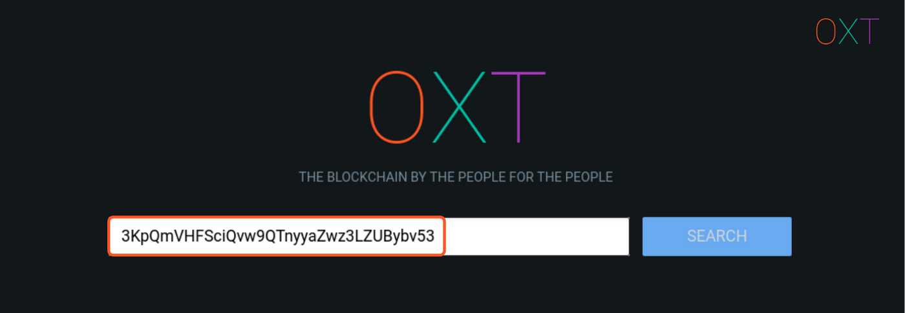

- 图 4.1 OXT 工作流之 地址查询 -

3. 导航到 TRANSACTION 栏

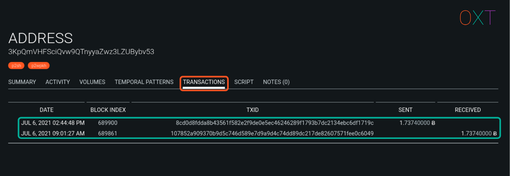

- 图 4.3OXT 工作流之 地址-交易栏 -

4. 选择想要的交易。用户应该注意到，一个起始地址可能已经接收过多笔支付。若是如此，则用户需要拘役交易的体量和时间选择合适的交易。
5. 然后交易界面可从侧边栏打开。

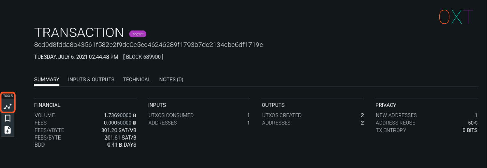

- 图 4.4 OXT 工作流之 交易界面和图谱工具 -

6. 打开交易图，开始资金流评估。

*注意：如果用户已经有想要研究的交易的 ID，可以不必登录 OXT，直接导航到交易界面然后访问交易图谱。回顾 [Part II](https://medium.com/oxt-research/understanding-bitcoin-privacy-with-oxt-part-2-4-20010e0dab97)（[中文译本](https://www.btcstudy.org/2021/12/15/understanding-bitcoin-privacy-with-oxt-part-2/)）可了解更多与交易图交互的细节。*

## 分析方向 —— UTXO 历史以及未来的花费

从一笔起点交易和 UXTO 开始，分析师可以追求两个 “方向”。

分析师可以通过观察目标 UTXO 过去的历史来了解资金的 “来源”。单个输入的交易链条来源评估是非常简单的，因为不需要在多个 UTXO 输入路径中 “选择” 。不过，多个输入的交易则有多个来源要探究。

分析师还可以从相关的 UTXO 中搜索未来花费的 “目标”，办法是运用 [Part I](https://medium.com/oxt-research/understanding-bitcoin-privacy-with-oxt-part-1-4-8177a40a5923)（[中文译本](https://www.btcstudy.org/2021/11/13/understanding-bitcoin-privacy-with-oxt-part-1/)） 所述的找零启发分析法和 [Part II](https://medium.com/oxt-research/understanding-bitcoin-privacy-with-oxt-part-2-4-20010e0dab97) 所述的外部交易数据分析法。

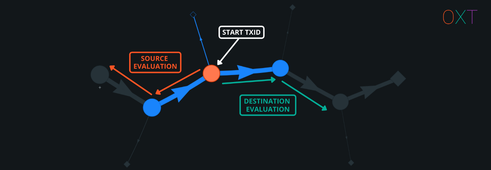

- 图 4.5 探究方向 —— 来源和目标 -

<strong><em>注意：UTXO 流跟踪不能跨过托管服务。这是因为，一笔存入的 UTXO 用来给这个存款人支付的情形是极为罕见的。</em></strong>

## 发送和接收支付对隐私造成的影响

在发送和接收一笔支付时，用户必然会向对手方暴露自己的一些  UTXO。对于管理不善的 UTXO，地址暴露可能导致用户的 *全部* 余额暴露给对手。

暴露财富，是发起交易对比特币隐私性的一个不利的副作用。这种暴露的负面影响会是很明显的，尤其是对简单支付来说。

此外，发送者的交易还将向接收者暴露发送者过往的交易历史。不过，支付也让发送者可以评估接收者未来的花费（这笔支付交易的）行为。

下面介绍的技术就是用来降低收发交易对比特币隐私性的负面作用的。

## Samourai Wallet 的隐私强化型交易

大部分区块链分析都基于下面的核心概念：

- 分析需要一个起点
- 交易图谱
- 找零检测
- 通过公共输入所有权线索来聚类单个单个的地址

在 [Part I](https://medium.com/oxt-research/understanding-bitcoin-privacy-with-oxt-part-1-4-8177a40a5923) 和 [II](https://medium.com/oxt-research/understanding-bitcoin-privacy-with-oxt-part-2-4-20010e0dab97) 中，我们介绍了区块链分析的核心概念。[Part III](https://medium.com/oxt-research/understanding-bitcoin-privacy-with-oxt-part-3-4-9a1b2b572a8)（[中文译本](https://www.btcstudy.org/2021/12/27/understanding-bitcoin-privacy-with-oxt-part-3/)）介绍了用来击败这些技术的概念。

OXT 团队跟 [Samourai Wallet](https://samouraiwallet.com/) 的开发者一起工作，测试和创建能够缓解我们介绍的隐私缺陷的方法。讲解如下。

### 隐私地址 —— 拒绝起点

在尝试跟踪一个实体的链上活动时，区块链分析师需要一个起点。这个起点通常意味着要把一个目标的互联网上活动与一个该用户暴露出来接收支付或者捐赠的地址关联起来。从这个地址开始，分析师可以研究目标用户的活动，包括接受过的支付、总的地址余额，以及花费模式。

用户可能经常公开一个地址用来接收支付。这个公开的地址就是在区块链上出现的地址，并且可以通过任何区块链浏览器作为起点展开分析。

除了交换一个直接地址用来收款，用户也可以交换 “隐形地址”。隐形地址基于 Diff-Hellman 密钥交换的衍生概念。Diff-Hellman 密钥交换是支撑着 TLS/SSL 的关键密码学概念，而 TLS/SSL 又是用在互联网安全通信中最重要的密码学形式之一。

Samourai Wallet 的隐形地址实现基于 Open Bitcoin Privacy Project 提出的 [BIP 47](https://github.com/bitcoin/bips/blob/master/bip-0047.mediawiki)。BIP 47 “可重用的支付代码” 让发送者可以：创建无数的唯一比特币地址、支付给意向接收方而无需接受方在线。

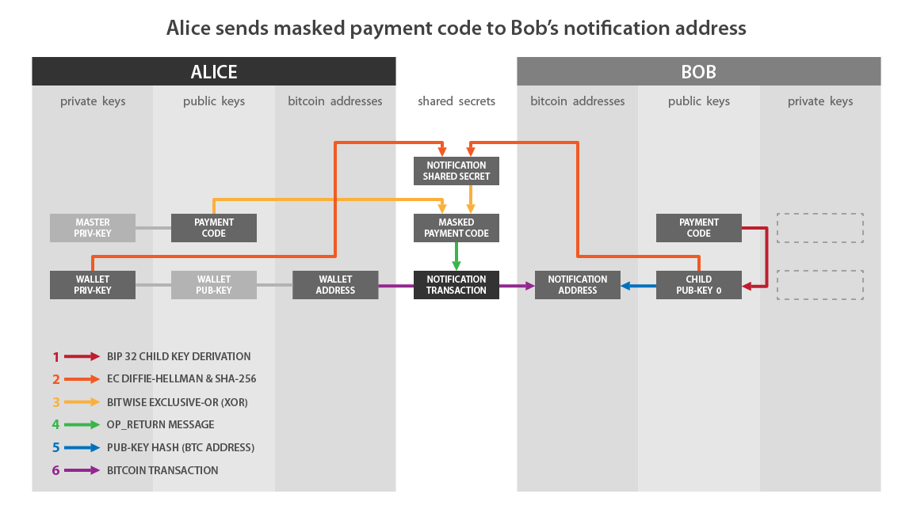

- 图 4.6 V1 BIP47 支付码架构（<a href="https://raw.githubusercontent.com/bitcoin/bips/master/bip-0047/reusable_payment_codes-01.png">BIP47</a>） -

可重用的支付码让分析师失去了比特币区块链上的一个 “免费的” 起点。更多关于 Samourai Wallet 的可重用支付码的信息，可见[此处](https://docs.samourai.io/en/wallet/usage#paynym-1)。

### Coin Control —— UTXO 隔离

在后来的交易中整合来自多个来源的输入，可能会导致支付的发送者暴露额外的 UTXO 的交易历史。

为了缓解隐私泄露的风险，用户可以实践 “coin control”。一般来说可以分成这么几个步骤：

- 标记已经收到的 UTXO。标签至少应包括发送者和支付理由。
- “标记不花费的 UTXO”。为了防止钱包意外在未来的支付中使用某个 UTXO，UTXO 可以设置成不响应未来花费的纳入请求。
- 发送特立独行的（选择性激活 UTXO）。UTXO 可以选择性花费。

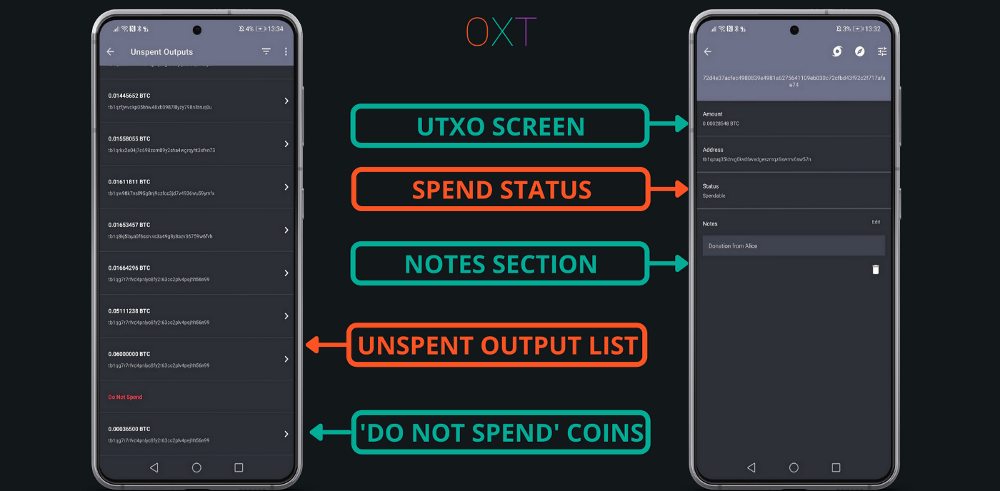

- 图 4.7 Samourai Wallet 的 Coin Control 功能 -

在发起支付时，用户也应该养成标记自己的找零输出的习惯。给一个 UTXO 添加一个标签后，Samourai Wallet 将用同一个标签自动标记同一次花费中的其它 UTXO（找零输出）。

### Ricochet —— 增加距离

Ricochet 是一个简单的工具，可以自动化增加 “步数” —— 在初始 UTXO 和支付目标之间增加假交易。Ricochet 交易不会混洗资金，也不会打破交易图谱。但是，这些交易会在支付目标和此前的 UTXO 的历史之间增加距离。

单输入交易的资金来源评估是相对简单的，但增加了 “步数” 之后，接收支付的人就不能仅凭收到的 UTXO 来观察你的交易历史。遍历交易图谱的分析也容易进行，但延展 UTXO 的历史将引发额外的疑虑（基于 “UTXO 所有权模型”），并提高误判的概率。

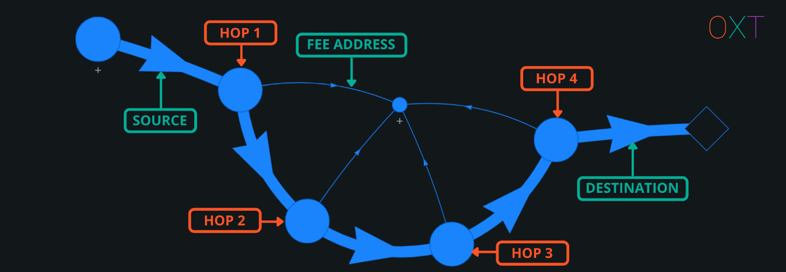

- 图 4.8 Ricochet 交易的例子（<a href="https://oxt.me/transaction/ee0d4dd6703949e594d88734ec40aa669a586c3126ee713bcf5883bd7f55b816">交易 ID</a>） -

当前版本的 ricochet 交易会加入额外的 4 步。Samourai Wallet 还机会推出更 “动态” 的版本，将允许步数变化。更多信息可见[此处](https://docs.samourai.io/wallet/privacy-enhanced-transactions#ricochet)。

### STONEWALL 和 STONEWALLx2 —— 支付安全

STONEWALL 和 STONEWALLx2 使用了相同的 UTXO 选择算法来创建具有 coinjoin 特性的交易。STONEWALL 是一种模拟的 coinjoin 交易，使用来自单个人钱包的输入。STONEWALLx2 是 “真正的” coinjoin 交易，使用来自两个合作的 用户/钱包 的输入。

使用同一个算法意味着这些交易的链上足迹是完全相同的，对外部观察者来说也是不可区分的。结果是，分析师必须考虑任何 STONEWALL 交易都是 “真” coinjoin 的可能性。

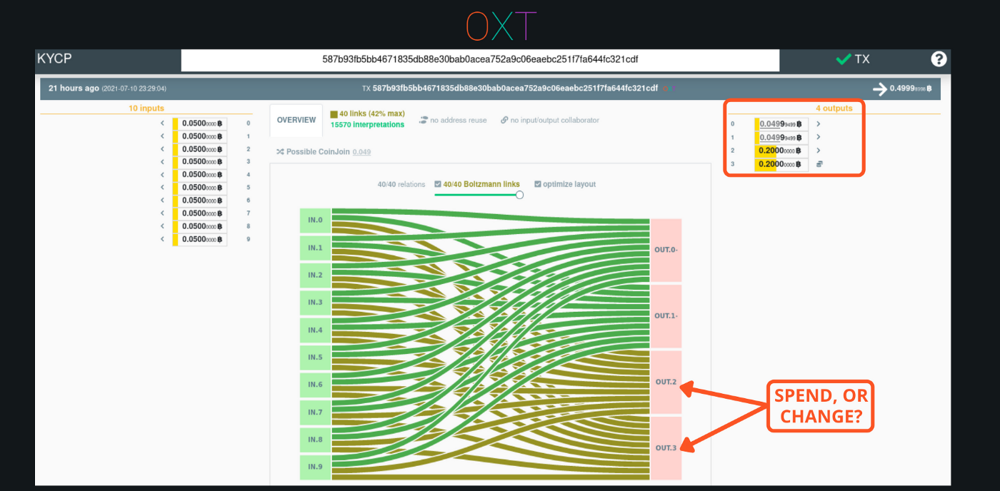

- 图 4.9 Stonewall 交易的例子（<a href="https://kycp.org/#/587b93fb5bb4671835db88e30bab0acea752a9c06eaebc251f7fa644fc321cdf">交易 ID</a>） -

STONEWALL 算法是交易属性的一个插件，旨在击败简单支付找零检测分析法，比如它会使用同类输出脚本，并随机化找零输出的位置。

因为它的 coinjoin 特性，stonewall 交易有能力击败循环输出支付启发法（round output payment heuristic），而这是简单支付不可能做到的。Stonewall 算法通过创建面额与意图支付交易相同的 “假” 输出来击败这些分析。

STONEWALL 交易是真正的支付，所以依然包含跟他们的 “找零” UTXO 的确定关联。但因为 STONEWALL 交易可能是两个钱包的 coinjoin，交易的对手就无法确定哪个找零 UTXO 属于这笔交易的发送者、哪个找零 UTXO 属于 coinjoin 合作者。

### Stowaway —— 打破共同输入所有权分析法（CIOH）

如我们在 [Part III](https://medium.com/oxt-research/understanding-bitcoin-privacy-with-oxt-part-3-4-9a1b2b572a8) 中提到的，payjoin 交易可以削弱共同输入所有权分析。如果单个 UTXO 没有足够的面额来发起支付，钱包软件会加入额外的输入来获得需要的数额。分析师可以在一定程度上正确假设这些输出都由同一个钱包控制。

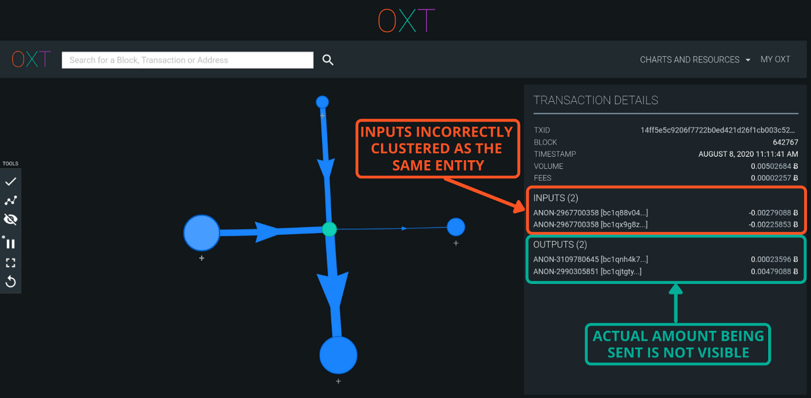

- 图 4.10 Stonewall 交易的例子（<a href="https://oxt.me/transaction/14ff5e5c9206f7722b0ed421d26f1cb003c523070c4882150073817683bd2dda">交易 ID</a>） -

Payjoin 交易一般来说没有可辨识的链上足迹，通过纳入来自交易发送者和接收者双方的输出，两个钱包参与到了输出的创建中。这就削弱了 CIOH 并制造了一个 “假集群”。接收方也向交易贡献输出的结果是，真正的支付数额也被隐藏了起来。

### Whirlpool Coinjoin —— 打造面向未来的隐私性

支付的发送者可以跟踪交易对手对当前这笔支付的未来花费行为，也许还能获得关于对手钱包构成的ewd信息。为了维护隐私性，交易接收方可以混币来打破收到的支付与未来的花费之间的关联。换句话说，通过一笔 coinjoin 交易将收到的 UTXO 作为支付发送出去，可以实现面向未来的隐私性。

Whirlpool 是唯一一个 100% 实现了 Zerolink 的 coinjoin 实现。Whirlpool 的 coinjoin 交易不包含 “没有混合的找零” 输出，因此也无法用来继续跟踪用户的活动。

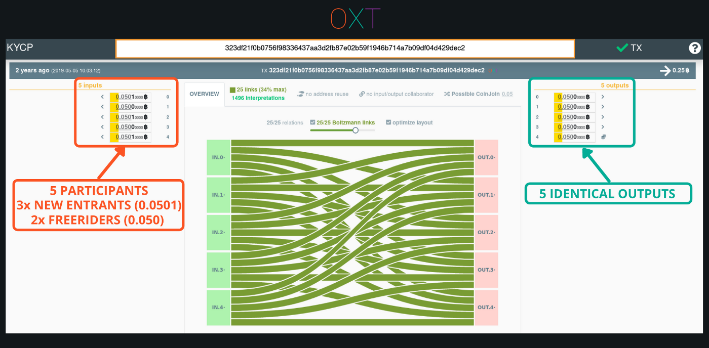

- 图 4.11 Whirlpool 交易的例子（<a href="https://kycp.org/#/323df21f0b0756f98336437aa3d2fb87e02b59f1946b714a7b09df04d429dec2">交易 ID</a>） -

Whirlpool 交易的 Tx0 会支付协作费、创建预混合的 UTXO（面额等于池的面额加上矿工费）以及一笔单独的找零 UTXO。

对 Tx0 的输入应该有意选择，以避免它跟不同的来源相关联。结合多个资金源会暴露共同所有权。找零输出也应该小心处理，以避免直接关联到未来的花费行为。

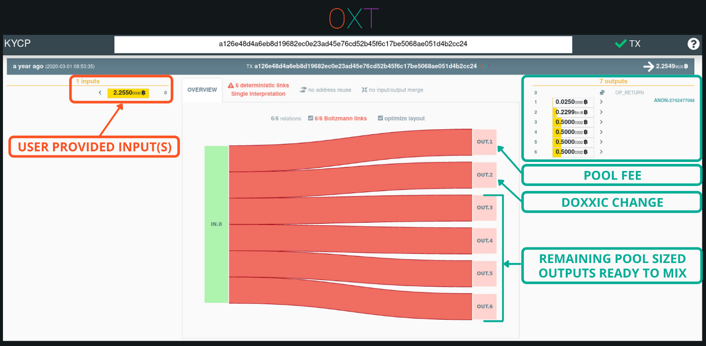

- 图 4.11 Tx0 交易的例子（<a href="https://kycp.org/#/a126e48d4a6eb8d19682ec0e23ad45e76cd52b45f6c17be5068ae051d4b2cc24">交易 ID</a>） -

在 coinjoin 之后，初始（预混合的） UTXO 跟混合后的 UTXO 之间的关联被打破，支付的接受方可以确信，交易的发送方将不再能可靠地跟踪他们的未来花费行为。

## 回顾

因为真实世界的身份与区块链上的活动并无直接相关（准匿名性），比特币保留了基本的用户隐私。

在协议层面，比特币交易从透明的地址发起、发送透明的面额到透明的地址。这种透明性导致了区块链分析的泛滥。区块链分析的主要内涵包括支付找零检测、交易图谱分析，以及使用共同输入所有权分析来区分 “钱包群组”。

虽然这些技术大多依赖于启发式分析，但使用外部交易数据，比如地址重用、来自和发往中心化服务器的输出，可以极大地降低简单比特币交易的模糊性。

钱包软件可以通过包含随机指纹和同类地址输出来维持简单花费的模糊性。但即使有这些工具，链上资金流依然是 “可跟踪” 和确定性的。恰当创建的等面额输出 coinjoin 依然是打破确定性关联、为交易图谱注入合理推诿属性的最佳方式。

一般的用户阅读这个指南应该不是为了成为一个区块链分析的专家，而是希望提升自己收发交易时候的隐私性。发送和接收交易都必然会向支付接收者暴露关于发送者钱包的 UTXO 集信息。结果是，发送者和接收者都可以看到这些 UTXO 的过去和未来，而这会暴露许多关于交易对手的额外信息。

具备区块链分析相关知识的用户可以更好地应对发送和接收交易带来的影响，并能够开始采取措施保护自己的隐私。

这些措施包括：不要将区块链的活动与互联网上的人格联系起来、避免重复使用一个地址、用不同的历史隔离 UTXO、使用 coinjoin 建立面向未来的隐私性，以及，使用前文所述的高级发送工具来击败区启发式分析法。

善用这些工具，可以让用户获得他们的传统金融系统中习以为常的、基本程度的隐私性。

## 结语

许多读者都希望得到一份全面的比特币隐私和 OXT 指南。我们的希望是这份指南能给你提供一个起点，让你可以继续扩充你关于比特币隐私性的知识。

有了这份指南中的额外知识和背景，我们鼓励有恒心的读者回看我们之前的研究报告。尤其是前面关于交易图谱的部分。

欢迎反馈、评论以及对进一步的指南的请求。

感谢您的阅读，祝一切安全。

—— *OXT 研究团队*

（完）