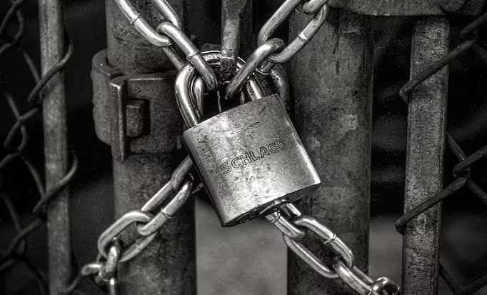
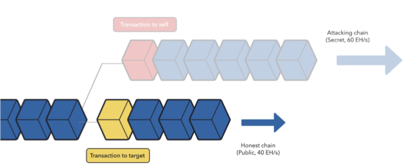
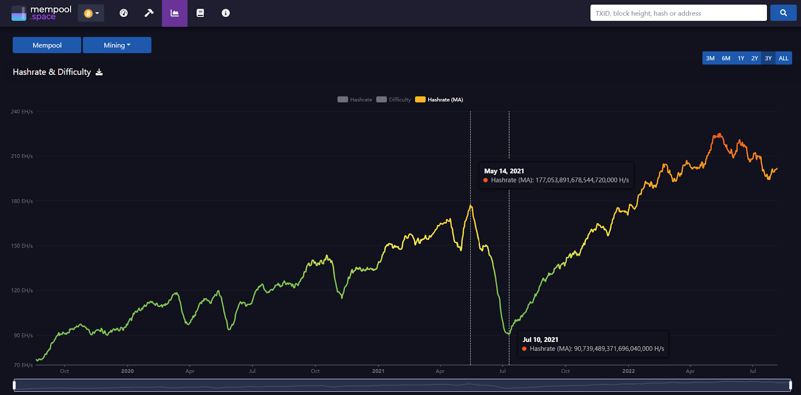
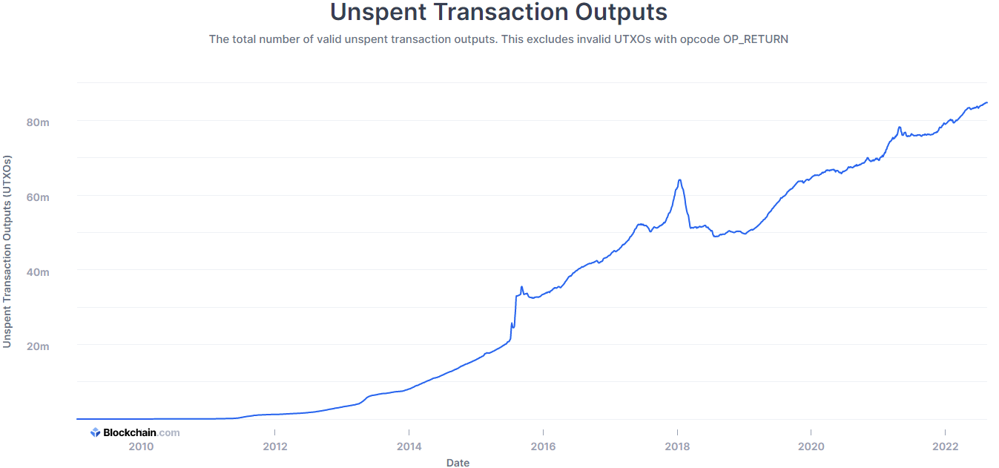
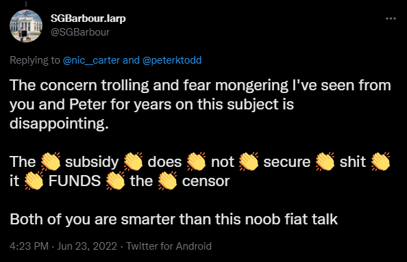

> *作者：econoalchemist*
>
> *来源：<https://braiins.com/blog/bitcoin-fees-security-threats>*
>
> *原文出版于 2022 年。*
>
> *本文是由 [Econoalchemist](https://twitter.com/econoalchemist) 为 Braiins 博客编写的文章，他是一位比特币教育者和家庭矿工。*

## 引言

随着熊市持续，人们开始分享关于比特币的基于手续费的安全模型的想法，并且一些投资人认为，当区块补贴小时之后，手续费不足以保护比特币网络。大家主要担心的事情似乎是，在未来的某个时间点，比特币的安全性将下降，因为区块补贴退场之后，矿工无法获得那么多的收益。

一些提议尝试解决这类担忧，包括提高比特币的 2100 BTC 数量上限、将手续费从现付制切换为滞期费（demurrage），以及逐步削减区块体积。这些讨论让许多比特币人开始关注抗审查性、博弈论和手续费市场。虽然这些想法可能只是娱乐，或者就像战争游戏的不同场景那样可以给人带来快乐，但区分 FUD（恐惧困惑怀疑）和真实的威胁也有难度。一些矿工可能会怀疑自己手上的比特币是否安全。文本尝试厘清围绕比特币的基于手续费的安全模型的各个方面。

## 背景

比特币矿工使用消耗电力的特殊硬件（矿机），以 “哈希率” 的形式为比特币网络贡献算力（computational power）。他们得到的补偿是区块奖励；而且，平均来说，在一段时间内，一个矿工为网络贡献的哈希率越大，TA 赚得的比特币也就越多。矿工赚得的比特币来自 “区块补贴” 和 “交易手续费”，两者一起被称为 “挖矿奖励”（译者注：区块补贴即是随区块增发的比特币，而交易手续费则来自区块所确认的交易的输入与输出之间的差额）。绝大部分矿工都会选择跟其他人一起组成一个矿池，然后根据各自对矿池的贡献的比例来分割矿池所得到的挖矿奖励。对于矿工，这可以帮助降低比特币挖矿收入流的波动；也就是将数额更大但不稳定的奖励，替换为数额更小但持续的奖励。但不同的矿池的支付结构可能[不同](https://hashrateindex.com/blog/pps-fpps-pplns-pps_plus/)。

而且，区块奖励也不是稳定不变的，它每隔 21 0000 个区块（大概是 4 年）就会改变一次。在比特币刚刚出现的时候，区块奖励是 50 BTC 。第二个补贴周期从 2012 年 11 越开始，让区块降低到 25 BTC 。到了 2016 年，补贴再一次减半，每个区块只有 12.5 BTC 。再然后，从 2020 年开始，区块降低下降到了 6.25 BTC 。这些补贴减半事件是硬编码在比特币协议中的，目前的设定是持续到大概 2140 年，然后不再有补贴；这也是比特币数量上限的由来。

（译者注：原文出版于 2022 年。在 2024 年 4 月，比特币网络又一次按计划发生了补贴减半事件，将区块补贴降低到 3.125 BTC 。这些规则是由组成比特币网络的每一个计算机来执行的。）

自然就有许多人会问：“那没有区块补贴之后，会怎么样呢？”，“我的比特币是不是就不安全了？” 以及 “如果有人攻击网络，会怎么样呢？”。在下面的章节中，本文会讨论，随着区块奖励持续下降，51% 攻击意味着什么、人们提议了什么办法来避免这种攻击，以及这些提议如何影响比特币。

## 51% 攻击

跟区块补贴最终结束有关的最大的安全顾虑之一便是 51% 攻击的可能性。这背后的推理是这样的：如果不再有区块奖励，那么矿工就没有使用 ASIC 的必要激励；那么，一旦矿工不再提供这些资源，网络的哈希率就会下降；诚实矿工所掌控的哈希率变少，意味着恶意矿工将能控制绝大部分的哈希率，然后发动 51% 攻击。那么结论似乎是：比特币协议应该尽快改变，以缓解在未来出现 51% 攻击的可能性。

这里有很多需要解释的话题，包括：（比如说）51% 攻击的真正危险在那里、在遥远的未来 ASIC 会不会依然是专用的硬件，以及，单靠交易手续费是否不足以激励矿工。

首先，要理解的是在 51% 攻击场景中，什么东西会面临风险。“51% 攻击” 这个词听起来可以很吓人，尤其是在不知道它的影响的时候。一种常见的误解是，在 51% 攻击事件中，供给者可以想怎么样就怎么样（让任何交易得到确认）；但并非如此。成功的供给者也无法花费还不属于他们的钱，或者说，攻击者只能重复花费 *他们自己的* 比特币。只有在攻击发动之前不久从攻击者这里收到的比特币才会面临风险：攻击者会重组区块链、取消原本的支付交易所得到的区块确认，然后发起一笔新的交易，将原本的支付交易所使用的资金发送到别的地址（他们自己控制的地址）。

Medium 上有一系列关于比特币基于手续费的安全性的[科普贴](https://joekelly100.medium.com/on-bitcoins-fee-based-security-model-part-1-beware-the-turkey-fallacy-4285e18d41ea)，作者是 [Joe Kelly](https://twitter.com/joekelly100)。在这系列文章中，Kelly 解释了多种常见的误解，也包括关于 51% 攻击的。51% 攻击背后的动机可能是获得一些不可撤回的商品、服务或者支付，同时撤回用于交换这些商品、服务和支付的比特币。成功的攻击者将能获得所有被重组的区块（也即重写的账本历史）的区块奖励。攻击者甚至可以用额外的金融工具来获得更多收益，比如做空 BTC 的汇率，因为实施攻击的新闻会导致比特币价格下跌。

如果人们不提供不可撤回的商品、服务和支付，那么不太可能成为 51% 攻击的受害者。尤其是，如果单笔交易的比特币数额没有大到能够吸引攻击者投入价值数百万美元的挖矿资源来发送攻击的话。赚取诚实区块奖励的矿工也将面临损失挖矿奖励的风险，如果攻击者最终成功的话，被重组的区块的区块奖励将全部属于攻击者。但如果你不是一个大矿工的话，这对你的影响也微乎其微。

尽管许多人认为攻击者必须反向操作，也就是先选择以往区块高度的一笔交易作为目标、然后使用足够多的哈希率从那个区块高度开始挖出一条链、追上并打败诚实矿工所在的链条，但 Kelly 指出，这也不是必需的。攻击者可以先在诚实矿工挖矿的链条上确认一笔交易，然后，将自己控制的哈希率切换到另一条秘密挖矿的链上，并包含上述交易的另一个版本、将资金发送到由自己控制的地址中。如【图 00】所示。

- 【图 00】51% 攻击示例，来自 joekelly100.mdium.com -

攻击者不需要回溯交易历史，也不需要追赶，只需要跟诚实链条保持同一步调，对于控制大部分哈希率的攻击者来说，这不是什么难事。一旦恶意链条取得领先，攻击者就向整个网络公开他们重组的链条。在比特币网络中，矿工会跟随带有最多工作量证明（PoW）的链，因此会切换到这个重组后的链，然后继续挖矿。

然而，上述分析还显得太过简单了。因为，一旦攻击者开始将哈希率分配到秘密挖矿的恶意链条上，诚实链条上的哈希率就开始下降。因此，区块出现的时间间隔也会拉长。但是，在这个案例中，受害者会等待交易得到一定数量的区块确认，再发送不可撤回的商品、服务和支付（至少从常识角度看，他们肯定会先等待）。所以，攻击者分配过去的哈希率越多，让商家对交易的安全性感到放心的等待时间就越长。但攻击者又要将尽可能多的哈希率尽可能快地分配到恶意链条上，这样从能发动攻击。这将是一个极为难以控制的平衡。尤其是，受害者可能同样聪明，知道网络哈希率的突然下跌是一种警报，要比平时等待更长时间，再履行交易中的义务。

另一种攻击者难以控制的复杂性在于，他们在诚实链条上撤出哈希率的动作越快，其他矿工使用落伍矿机 —— 也即正常情况下已无法获得收益的机器 —— 的预期回报就越大。最近的一个例子出现在 2021 年夏天，当时政府禁止中国大陆的比特币挖矿业务。从  2021 年 3 月 14 日到 2021 年 7 月 10 日，57 天里，整个比特币网络的哈希率从大约 177 Eh 下降到 90 Eh（降低了大约 49%），见【图 01】。

- 【图 01】比特币网络哈希率在中国挖矿禁令期间的变化，来自 mempool.space -

这是最接近 51% 攻击可能样貌的真实世界案例，虽然并不完美。在此期间，所有挖矿的人，平均收益从 508 聪/Th/天 上涨到了 991 聪/Th/天，上涨了 195% ，见【图 02】。

在这段时间里，全球的矿工把各种能够挖矿的设备全都用上了。在真正的 51% 攻击场景中，哈希率的下跌可能会来得更急，不像挖矿禁令那样接近两个月才跌到谷底。但是，对挖矿收益的影响，将是类似的，所以，任何闲置的硬件都会被启用，尤其是如果攻击被证实导致了哈希率下跌（以及后续的难度调整）的话。攻击者尝试发动攻击的时间越长，就会有越多哈希率会加入诚实链条，因此 51% 对 49% 的力量对比会迅速改变，供给者将不再占据多数哈希率，除非他们的起点就是以更高的哈希率占比（比如 60% 乃至更高）开始的。

此外，还要考虑到，在攻击开始的时候，两条链的挖矿难度是一样的；而攻击开始的区块，在所在的难度调整周期（长为 2016 个区块）中的位置，决定了还要挖出多少区块，链才会根据新的哈希率水平重新调整挖矿的难度。攻击者需要谨慎地计划在难度调整周期的哪个阶段发送攻击。如果在攻击发生之前，整个网络平均 10 分钟能挖出一个区块，那么在攻击发动之后，由于攻击者控制了 51% 的哈希率，竞争的两条链都会以平均大约 20 分钟的间隔挖出区块，攻击者的恶意链条会稍微快一些（因为控制了更大比例的哈希率），直到挖出比诚实链更常的链条。这又意味着，攻击者需要控制超过 51% 的哈希率，才能在合适的时间范围内完成攻击。或者，他们需要在（相比诚实链条）更高难度的链条上挖矿，这样才能证明自己具有更多工作量。（译者注：此处以 “攻击者挖出比诚实链条更长的链” 作为攻击成功的标志，是不正确的，因为比特币的共识规则在选择链条时，考虑的是 PoW 的量级总和而不是区块高度；而每一个区块的 PoW 量级都可以不同；详见[此处](https://www.btcstudy.org/2022/11/23/bitcoin-paper-errata-and-details/)。所以，攻击成功的标志应该是挖出了比诚实链条具有更高 PoW 的链条。）

一旦恶意链条到达了难度更高的周期，或者在同一周期中挖出了更多区块（从而具有了更多的工作量证明），其链条可以向整个网络公开，其他矿工就会接受这条具有更多更多工作量证明的链作为共识链，攻击者也就获得所有他们在恶意链条上挖出的区块的挖矿奖励，以及他们重复花费的收益。如果攻击者使用了额外的金融工具来做空比特币，那么在市场上出现抛售潮时，他们也将获得这些额外的收益。不过。攻击者也必须考虑这种风险：成功的重复花费实际上会对比特币的声誉造成不可逆的破坏；所以对比特币的需求可能消失、价格会进入更深的熊市，然后反过来影响攻击者自己的财富。

Kelly 指出的另一个常见误解是，6 个区块的确认就足以保证交易不可逆转。进一步推论，错误的假设是，如果你希望交易获得更多的安全性，那么只需等待更多的区块确认就好。正如前面所展示的，区块的数量可能变得毫无意义，因为攻击可能持续很长时间、恶意链可能重组许多区块。明智的比特币人会通过观察比特币网络的哈希率变化来评估交易的安全性。在哈希率没有剧烈变化的时候，6 个区块的确认似乎是一个合理的数字，能够对冲区块链重组所带来的风险。

一些跟 51% 攻击相关的信号包括：

- 全网的哈希率出现剧烈而且无法解释的下跌，等于甚至超过 50% 。
- 挖出区块的速度显著慢于 10 分钟的平均值，同时交易池积压许多交易。
- 全网的哈希率出现突然且无法解释的上涨，等于甚至超过 100% 。
- 挖出区块的速度显著快于 10 分钟的平均值。
- [mempool.space](https://mempool.space/) 这样的网站是观察这些变化的趁手工具。

如果你怀疑 51% 攻击正在发生，可以考虑以下事项：

- 你是否提供了不可撤回的商品、服务和支付并接受了比特币支付？
- 你的交易的价值是否大到使你可能成为攻击目标？
- 在收到比特币款项之后，你会等待多少个区块再发货？
- 你是否统计了，在发生了巨大而且无法解释的哈希率波动以来，过去了多少区块？

51% 攻击和重复花费并不只是个玩笑，但补充关于其风险的上下文，可以帮助人们发现这样的攻击尝试，甚至，分享一些博弈论推理可以帮助破坏这样的尝试。虽然跟 51% 攻击相关的风险可能被夸大了，这也不能阻止许多人提出对低概率问题的解决方案。下文就列举了一些。

## ‍Tail Emissions

[Peter Todd](https://twitter.com/peterktodd) 在近期一篇博客中提出给比特币引入 “长尾释放（tail emissions）”。总的来说，长尾释放背后的想法就是，从未来的某个时间点开始，比特币的区块补贴不再下降，而永久保持一个恒定的数值。这毫无疑问会让比特币的供给量超过 2100 BTC 。Todd 在自己的文章中解释，根据他对人们会逐渐弄丢钱币的想法，长尾释放不会造成通货膨胀。Todd 使用这个弄丢钱币的假设来辩称固定的区块补贴不会导致供给量膨胀。

在他的博客中，Todd 引用了一份他称为 “学术分析” 的材料，作为工作量证明系统在单靠交易手续费运作时区块生成会变得不规律的证据。这份引用的文章似乎是 4 位普林斯顿大学（Princeton Unisversity）的学生写的，可以在[这里](https://www.cs.princeton.edu/~arvindn/publications/mining_CCS.pdf)找到。重要的是，这篇文章文章并没有经过同行评审，也没有发表在科学期刊上。所以，虽然 Todd 可以根据作者是大学学生的身份，管这篇文章叫做 “学术分析”，读者不应将它与科学出版物相混淆，也不应认为它在相关主题上拥有权威意见。

本质上，这篇 “学术分析” 创建了一个模型来预测矿工在几种特殊环境下的行为。比如说，这个模型建立在以下假设上：

A）区块补贴已经完全消失（已处于公元 2140 年之后）。

B）出于一些理由，区块没有体积限制，所以，矿工的普遍策略是在每一个区块中包含在交易池中见到的每一笔交易。

C）新交易以一个稳定的速率持续出现，但会在挖出一个新区块之后突然停滞，产生所谓的 “挖矿间隔”。

这份 “学术分析” 进一步定义了作者预测在这个（基于他们模型的）幻想世界中可能出现的 “异常行为”。包括：

1）**小气规矩矿工** —— 在挖矿的区块模板中包含所有可得的交易、在最长链上挖矿，并在找到有效的工作量证明之后立即发布。不过，在同一高度上几乎同一时间出现两个区块的时候，矿工必须选择一个，这些小气规矩矿工会选择手续费最少的那一个。他们这么做是为了剩下更多交易在交易池里面，从而在自己的区块中能够包含更多交易。

2）**懒惰分叉矿工** —— 如果链顶端的区块所包含的交易手续费大于交易池中剩余交易的手续费，他们就转而挖掘分叉（在当前链顶端区块的同一高度上挖掘竞争区块）。所以，当懒惰分叉矿工们宣布一个有效的工作量证明时，他们的区块只会包含交易池中可得区块的一半，这样他们才不会自己分叉自己。

3）**自私矿工** —— 在发现有效的工作量证明时并不公开，而立即将自己的哈希率从诚实链条切换到自己的秘密挖矿链条上，希望所有其他矿工在自己找到第二个区块之前也无法挖出区块，这样他们就能一下子发布两个区块，让其他矿工浪费自己的时间和资源。

介绍这些是为了说明，Todd 之所以希望打破 2100 BTC 的数量上限，是因为他担心，在 2140 年以后，在同时出现两个区块的事件中，一些矿工会选择包含交易费更少的区块（也就是在交易池中留下更多交易的区块），因为这样他们就有机会获得更多手续费。但他们也将不得不留下一半的交易在交易池中，免得其他矿工用同样的手段对付他们 —— 以及/或者 这些反常的矿工会扣住可以公开的区块，即使他们必须放弃一个区块中包含的交易手续费。这并不是一个能够说服人们改变比特币的核心特性之一（2100 BTC 的供给量上限）的理由。

对于压倒性多数的投资者来说，比特币的 2100 BTC 上限是一个极为关键的设计元素。这个元素让比特币不会因为一个中央权威的货币政策而贬值，可以说是许多人一开始转向比特币的首要理由。改变 2100 BTC 的数量上限是非常困难的共识规则变更，而且许多投资者会将它视为对比特币的攻击。

而且，也有一些被认为已经丢失的钱币突然转移的例子。比如，区块 [3654](https://mempool.space/tx/cb1440c787d8a46977886405a34da89939e1b04907f567bf182ef27ce53a8d71) 的挖矿奖励，以及[在比特币诞生 12 周年纪念日被汇总的 1000 BTC](https://mempool.space/tx/cd36ab430bef09d3fde061fe29158699d2f9ef16125f4c567450ff01785ae0eb) 。虽然这些事件可能不多，但至少表明，任何比特币都可能随时转移。

## 滞期费

“滞期费（demurrage）” 是这样一种想法：交易手续费将根据一笔资金静置不动的时间来收取。钱币静置的时间越长，在花费时就有越高比例的部分会被烧掉，从而能够在货币供给量中制造能够奖励矿工而又不触发通胀的空间。

[Freicoin](http://freico.in/docs/freimarkets.pdf) 是一个尝试了滞期费模型的失败的比特币分叉，读者可以在这个 [Bitcoin Talk 论坛帖子](https://bitcointalk.org/?topic=3816.0)了解。截至本文撰写之时，根据 [Coin Market Cap](https://coinmarketcap.com/currencies/freicoin/) 的统计，Freicoin 的市场价值在所有密码货币中排名 #21126 。显然市场并不需要一种持有时间越长就会损失越多价值的密码货币 …… 太像法币了。

也有人根据比特币区块链上的情况制作了一种统计指标，称作 “[Coin Days Destroyed](https://en.bitcoin.it/wiki/Bitcoin_Days_Destroyed)”，定义为一笔交易中花费的钱币的数量，乘以这些钱币从上一次被花费以来经过的天数（译者注：从 “UTXO” 概念的角度看，不如说是自创造这些钱币以来经过的天数，也就是我们说的静置天数）。所以，如果 Alice 收到了 0.25 BTC，一直持有它 30 天之后才花出去，那么这笔花费交易就表现为 7.5 Coin Days Destroyed 。有一种想法是，使用这一指标来衡量被花费的钱币有多大比例会成为矿工手续费（译者注：应指在滞期费模型下的情形）；这个数字越高，交易手续费也就越高。或者换句话说，你的比特币越高的比例会被烧掉，为矿工手续费创造空间。

滞期费模型无法跟比特币结合，有多个理由。例如：

- 前事不忘，后事之师 —— 比特币的分叉币 Freicoin 已经惨败了。
- 用户会有被出卖的感觉 —— 滞期费会惩罚比特币的长期持有者：他们用比特币来存储价值的时间越长，被存储的价值就有越大的比例被烧掉。长期持有者是比特币持有者人群中最大的子集，这可以从 UTXO（未花费的交易输出）的数量看出来（当前已达新高，84.7 百万个，见【图 03】）。这些人把比特币当成一种储值技术，如果他们发现长期储蓄实际上会惩罚他们，那比特币生态系统会崩溃，因为许多人会认为比特币已经失败了。
- 技术理由 —— [OP_CHECKLOCKTIMEVERIFY](https://en.bitcoin.it/wiki/Timelock) 是比特币的地址编程中一个操作码，用来限定一个 UTXO 在未来某个时间点（比如某个区块高度）之后才能花费。人们出于许多理由而使用这种功能，但其中一个例子是，你想给你的孩子留一些比特币，但你希望他们大一点才能花这些钱；那么你可以将比特币转移到这样带有时间锁的地址中，这些钱币只有在你定义的区块高度之后才能花费。设想，如果你安排好了时间锁，而比特币突然出现了滞期费模型，而你只能等待自己设定的区块高度到来。人们会非常生气。只有硬分叉才能忽略这些操作码、刷新这些 UTXO，这又会带来额外的争论和复杂性。

- 【图 03】UTXO 的数量，来自 Blockchain.com -

## 减少区块空间

Nicolas Dorier [提出](https://twitter.com/NicolasDorier/status/1546721321186234368)，也许应对区块奖励不足而又不引发通胀的办法是动态地减少区块空间。这种想法的支持意见包括：2100 万 BTC 的数量上限将保持不变、不需要硬分叉（虽然可能需要软分叉，并且有争议），而且矿工的收益也会更高。一些反对意见认为，更小的区块会让交易审查变得更加容易，至少可以拖延交易得到第一次确认的时机；区块空间上限太小会让手续费变得过于昂贵，甚至阻止许多人使用，尤其是 CoinJoin 这样的服务：用户要在合理的等待时间与经济性之间取得平衡。

本质上，当人们发送比特币交易的时候，他们的矿工费是用来购买进入一个有限空间的优先权的。降低区块的可用空间，市场的自然回应便是为进入区块支付更多。不过，更小的区块空间也可能会使矿工和用户的行为发生改变，例如刺激用户讯在链下价值转移方案（或者说 Layer 2 替代品）。

## 什么也不干

“什么也不干（Not doing anything）” 也是一个选项，可能还是最有道理的一个选项，因为到区块补贴最终消失的时候（2140 年），今天活着的人可能都无法活到那一天。51% 供给的可能性、效果和可持续性常常被夸大了。长尾释放、滞期费和削减区块空间这样的 “解决方案”，都面临残酷的取舍。最后，[Upstream Data](https://blog.upstreamdata.ca/) 的首席执行官 Steve Barbour 在 [Twitter](https://twitter.com/SGBarbour/status/1540098288749162498?s=20&t=AQ-G1BgA8LF_GVgeFwdmYw) 上提出了一个有效的观点：区块补贴让审查成为可能。见【图 04】。

- 【图 04】SGBarbour 的推文 -

只要还有区块补贴，矿工就总是能选择审查一下交易，而依然能维持运营。如果矿工只能依赖于交易手续费，那他们就无法负担审查交易的代价了，因为交易手续费是唯一的收入流。如果没有区块奖励，那也不会有任何[空区块](https://mempool.space/block/00000000000000000002bd186c0aa527e4c9a8b1b1fa69e477f3163b83e81941)（空区块本质上是审查所有人）。

就笔者所知，现在还没有某个政府要求比特币矿工审查一笔交易的案例。有一些比特币地址被添加到了 [OFAC 制裁名单](https://home.treasury.gov/policy-issues/office-of-foreign-assets-control-sanctions-programs-and-information)中，而且现在有一些矿池，比如 MaraPool，尝试只挖掘 [OFAC 合规区块](https://marathondh.com/about/)。但是这似乎是 MaraPool 自愿的，并不是政府强制的结果。

如果情形发生改变，政府开始要求比特币矿工审查某些交易，最有可能受到影响的就是公开的大型矿工，他们已经在政府的监管范围内。也许较小的矿工也会因为害怕严厉的惩罚而屈服。但重点是，虽然这种假想的交易审查要求可能会影响一个司法辖区的矿工，这个司法辖区以外的许多矿工不会觉得有必要满足这样的要求。所以，虽然被审查的交易可能不会由这个残暴的司法辖区的矿工挖出，最终也会由别的地区的矿工挖出。

另一个要考虑的事情是，一个在政府一时兴起的审查请求下运行的合规矿池，也许最开始能维持自己的业务一段时间，因为审查请求不会太多，但事情很快就会发生改变。一开始，政府会要求审查关涉严重犯罪的交易，很少有人会反对；然而，一旦开了先例，这种要求的门槛就会下降，最终要求降低到审查仅仅只是发表特定观点的个人的交易。这时候，政府要求审查的交易将多到合规的矿工不再能维持业务规模。随着区块补贴变少，矿工审查交易的空间也变小。

## 结语

即使没有区块补贴，51% 供给也不太可能发生，因为潜在目标可能很少、很少有人会基于一个区块的确认就交付价值几百万美元的不可撤回的商品、服务和支付。不是说绝无可能，但采取上述任何一种提议来避免这种小概率情形，都无异于对比特币的空间。

而且，当比特币挖矿挖矿编程了电网基础设施的一部分之后，对基于手续费的安全性的顾虑就会消散。当比特币挖矿成为能源基础设施策略的一部分时，有理由将公共事业公司看成一种提供哈希率的准利他企业，他们这样做不是为了赚取手续费，而是因为只有 ASIC 才能提供带有经济激励的动态负载响应。

在电能需求下降时，煤炭和天然气发电厂要想方设法保持峰值效率。比特币挖矿就可以作为一种高效燃烧燃料、减少排放、延长法典设施寿命、减少传输损失的工具，还能在 石油/天然气 井和矿井中捕获滞留的能源。你可以在 [Upstream Data 在 2022 年 7 月的月度新闻](https://blog.upstreamdata.ca/coal-maximalists/) 中读到更多讲解。

从中获得效率提升的机会非常大，那些不利用比特币挖矿来实现这些收益的能源生产者将在长期竞争中淘汰出局。这类同时是能源生产者的矿工将超越今天固守法币商业模式的矿工。与不使用比特币作为金融工具、而作为更大系统中的企业相比，法币商业模式企业的财政策略、ASIC 担保贷款、波动的比特币价格和电力成本都将成为劣势。但 BTC 的价格对 ASIC 不那么重要，它将是最终负载，在需要的时候顶上作为能源的消费者。

更不用说，在今天与 2140 年之间，会有许多企业建立在比特币之上。这些企业可能会提供哈希率来维持他们建立在上面的商业模式，用其他收入流来弥补挖矿成本。

当你听到比特币的基于手续费的安全模式是不可持续的、需要天翻地覆的变革时，不妨先停下来，思考一下，什么东西真的面临风险、它对你个人的影响是什么，以及这些提议的变更要牺牲什么。

（完）