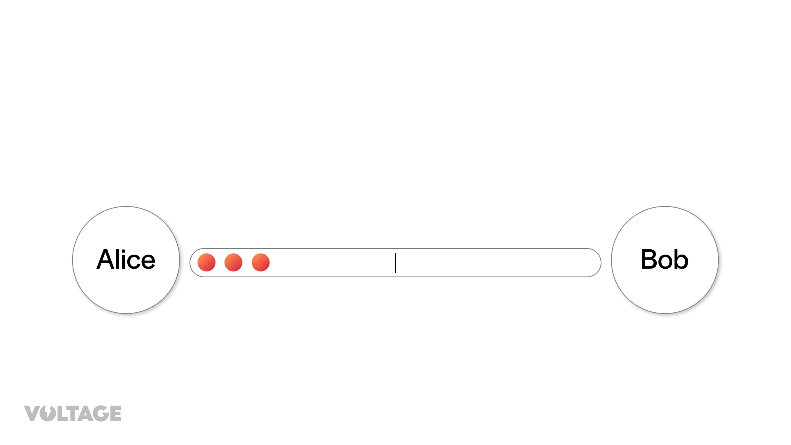

> *作者：Voltage*
> 
> *来源：<https://voltage.cloud/blog/lightning-network-faq/understanding-hold-invoices-on-the-lightning-network/>*

Hold Invoices（“暂缓支付发票”），也叫 HODL Invoices，是由 LND 客户端在 2019 年引入的。这个特性利用了[闪电网络](https://voltage.cloud/blog/bitcoin-lightning-network/what-is-the-lightning-network)的能力，提供了独特的付款方式，从而让一些新的应用在闪电网络上成为可能。

在本文中，我们会揭晓暂缓支付发票的巧妙之处。我们将先给出 “暂缓支付发票” 的清晰定义、比较它跟常规的闪电网络发票，然后，我们会解释暂缓支付发票的工作原理，让读者能够更深入的理解其机制。最后，我们将列举它在真实世界中的用途。

无论你是开发闪电网络项目的开发者、谋求创新的企业家，还是仅仅对暂缓支付发票的原理感到好奇，这篇文章都适合你。

## 闪电支付概述

闪电网络上的常规支付是一个 “哈希时间锁合约（[HTLC](https://voltage.cloud/blog/lightning-network-faq/how-do-htlc-work-lightning-network/)）”，这是一种用 Bitcoin Script 语言编写的智能合约，可以支持免信任的链下比特币支付。用日常语言来写这种合约的话，可以这样说（假定是 Alice 要在闪电网络上给 Bob 支付 1 BTC）：

“我，Alice，将给 Bob 支付 1 BTC，只要他能提供哈希值 9ed15..232e 背后的原像，以及他本人的一个有效签名。”

“如果 Bob 无法在 24 小时内给出原像，我会收回我的钱。”

“如果 Bob 想要谎报我应该给他的钱，我可以惩罚他，将我们双方一起锁定在金融合约中的钱全部拿走。”

为了向 Alice 请求支付，Bob 先要生成一个秘密值，然后对这个秘密值运行哈希运算。在我们这个例子，假设这个秘密值是 “Run Nodes”，它的哈希值是 “9ed15..232e”。用技术语言来说，这个秘密值叫做 “（支付）原像”，而这个哈希值叫做 “（支付）哈希值”。Bob 在闪电发票中写入这个哈希值，然后将发票发送给 Alice；Alice 得到发票之后，就可以将这个哈希值放在 HTLC 中（如上所述）。想要收到 Alice 的支付，Bob 就必须揭晓这个哈希值背后的原像。而一旦他这样做了，Alice 就会把钱给他。

## 理解 Hold Invoices

Hold Invoices 则是另一种发票，会触发另一种支付流程。在遇到暂缓支付发票时，支付的接收方不会立即释放原像，从而结算支付，而是会锁定 HTLC，并推迟（甚至取消）释放原像的步骤。接收方本身自行决定是否要接受闪电支付。如前所述，接收方可以在一段时间内揭晓原像。如果超出了这段时间，就无法再结算支付了。

假设 Bob 是一家服装店的老板。Alice 想在他店里买一双袜子。这时候，Bob 没有给 Alice 常规发票，而给出了暂缓支付发票。因此，当 Alice 发送支付给 Bob 时，Bob 不是立即发回原像，而是先检查自己能够提供 Alice 想要的样式。他找到了 Alice 想要的货之后，就返回原像，并结算这次支付。

暂缓支付发票也可以用在接收方当下还不能获得原像的时候。在这种星星中，接收方可以先采取额外的步骤获得原像，然后再完成支付。支付仅能在接收方成功获得原像之后完成。后面会有案例告诉大家这是怎么用的。

## 应用场景

我们已经在上一节中看过了一个简单的例子，但暂缓支付发票可以做的还有很多。比如：

### 押金

滑雪设备租赁店的老板可以使用暂缓支付发票来收取押金。如果某个客户损坏了滑雪板，老板可以通过揭晓原像来取走押金；反过来，如果没有损坏，他们可以让支付自然过期，从而资金会自动回到客户手中。

### 原子化的外卖

在编程术语里面，“原子化” 的意思是一个操作要么完成，要么等于完全没发生过。暂缓支付发票可以用来创建一种 “不见披萨不付钱”。以下是它的工作原理：

客户订了一个披萨，并发送一个自己知晓原像的哈希值。披萨店的老板创建一个使用该哈希值的暂缓支付发票，然后发给客户。客户给这个发票支付，但因为披萨店老板并不知道原像，所以无法结算这笔支付。当披萨送达的时候，外卖员可以询问客户这个原像；一旦原像揭晓，披萨店的老板就可以结算这次支付、收到款项。

## 当前的暂缓支付发票用法

RoboSats 是一种闪电网络上的点对点交易所。他们在交易托管（Trade Escrow）中使用暂缓支付发票，以保护交易，并防止欺诈。

当一个卖家决定卖出比特币的时候，他们创建一个暂缓支付发票，本质上就是将自己希望卖出的数额锁进一个类似于托管商的合约。这个暂缓支付发票就扮演交易托管商的角色，保护交易资金，并保证买家不会遭遇欺诈。在这种情况下，暂缓支付发票是交给 RoboSats 的实验性协调节点的。当卖方确认自己已经收到了钱，发票就会得到结算。

## 使用暂缓支付发票

如果你运行着一个 [Node](https://voltage.cloud/nodes/)，或者是自主保管的 LND 节点，那么你可以使用 LND 的 AddHoldInvoice 功能来创建一个暂缓支付发票，用 Cancelvoice 或者 SettleInvoice 来取消或结算暂缓支付发票。你可以阅读他们的 [API 文档](https://lightning.engineering/api-docs/category/invoices-service?utm_source=Voltage-Blog&utm_medium=blog&utm_campaign=Understanding+Hold+Invoices+on+the+Lightning+Network)来了解更精确的指令。

## 暂缓支付发票的缺点

但是，暂缓支付发票也不是完全没有缺点的。以下就是：

### 流动性锁定

因为闪电支付会锁定资金，支付路径上的中介节点也将因此锁定资金，因为暂缓支付的特性，他们可以需要很长时间才能释放资金。这也会影响他们路由别的支付的能力，因此会降低运营效率、对整个网络的流动性造成负面影响。

### 信任接收者

接收者被信任会根据一些显示或虚拟的条件来决定是否释放原像。这在闪电交易的对手方方风险中增加了一个元素，因为发送者必须信任接收者会按约定行事。

## 结论

- Hold Invoices，也叫 HODL Invoices， 是一种特殊的发票类型，由 LND 在 2019 年引入。
- 这个特性利用了闪电网络的能力，提供了独特的付款方式，让一些新的应用在闪电网络上成为可能。
- 不同于普通的发票，暂缓支付发票允许接收者推迟或者取消揭晓原像的步骤，也即推迟支付的结算。
- 暂缓支付发票并不要求立即释放原像，从而引入了一种新的支付流程。

（完）