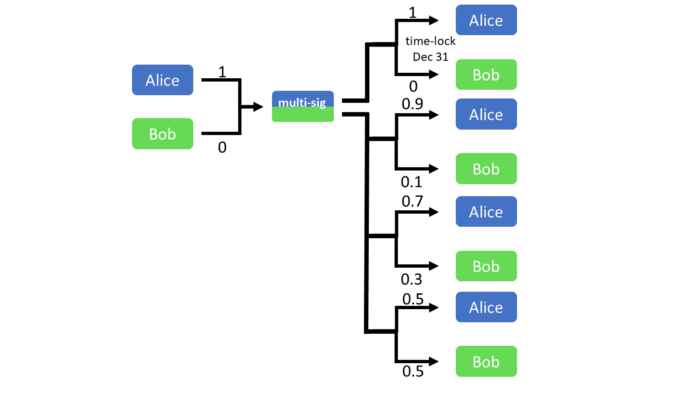
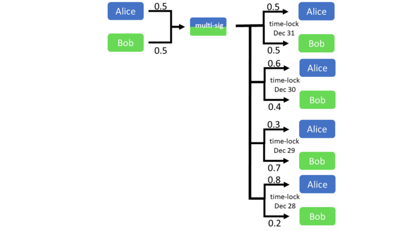
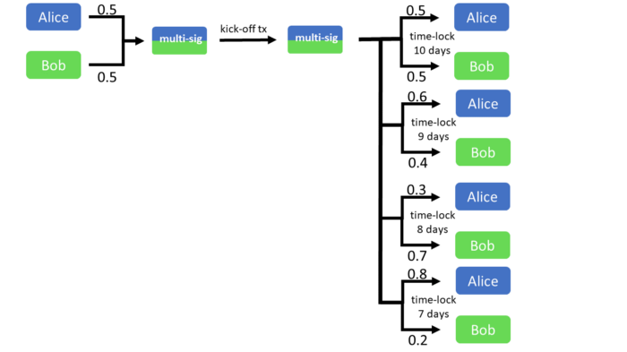
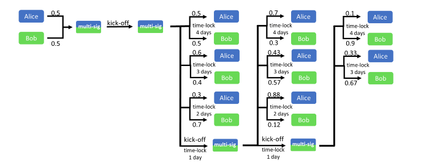
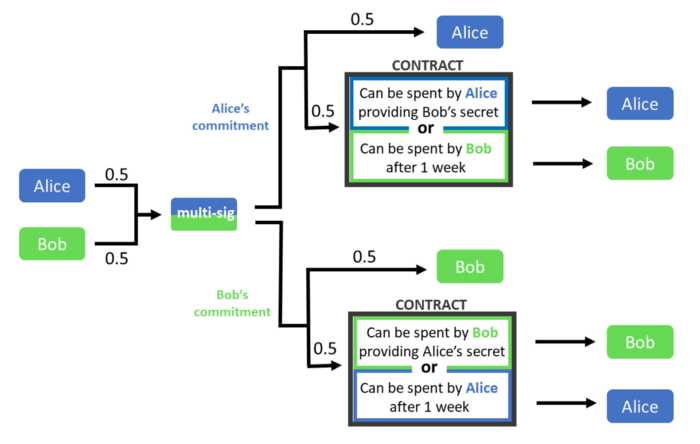
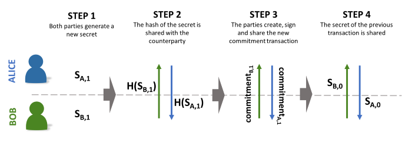

> *作者：Federico Tenga*
> 
> *来源：<https://blog.chainside.net/understanding-payment-channels-4ab018be79d4>*


链下交易似乎是提高比特币可扩展性的最佳方案。虽然有多家公司正在构建和测试链下交易基础设施，但是体验过的用户很少。

## 问题

首先，我们为何要在区块链之外进行交易？既然用户为了安全性而使用比特币，区块链当然是保护交易安全的最佳方式。问题在于区块链不仅成本高昂，而且效率低下，因为每位网络参与者都要存储完整的交易历史副本，而且，为了确保网络参与的可持续性，他们对区块链的使用也受到限制。

由于区块链上可以存储的数据量有限，参与者需要通过竞争的方式将交易添加到账本上，导致交易成本增加。因此，为了确保区块链层的轻量化和安全性，我们需要尽可能减少区块链的使用，找到其它交易方式。

## 链下支付通道

支付通道的设计思路是，使用交易替换的方式更新未确认交易的状态，直至其被广播到比特币网络上为止。很多人并不知道，这个想法其实早就出现了。早在[首个比特币版本](https://github.com/trottier/original-bitcoin/blob/master/src/main.cpp#L434)中，中本聪就使用了类似的实现（不过，ta 当时的目的不是提高可扩展性，而是为了支持多方高频交易）。

通过在广播之前替换交易，我们就可以在不使用昂贵缓慢的区块链的情况下完成大量交易。链下支付通道可以分为三类：

- 单向支付通道
- 基于时间的双向支付通道
- 基于惩罚的双向支付通道

## 单向支付通道

首个单向支付通道实现诞生于 2013 年。当时，Matt Corallo 和 Mike Hearn 在 BitcoinJ 中率先支持了这种技术。但是，单向支付通道的应用场景十分有限，因为它只支持代币从用户 A 转移给用户 B，反之则不行。



单向支付通道的基本设计原理如下：

- Alice 将 1 BTC 发送至 Alice 和 Bob 之间的 2/2 [多签合约](https://en.bitcoin.it/wiki/Multisignature)。
- Alice 想要将 0.1 BTC 发送给 Bob，于是创建并签署了一笔交易（具体内容是将 0.1 BTC 发送给 Bob，剩余 0.9 BTC 发送给自己），再将这笔交易发送给 Bob。
- Alice 想要再发送 0.2 BTC 给 Bob，于是更新通道状态，创建了另一笔交易将 0.7 BTC 发送给自己，0.3 BTC 发送给 Bob。
- Alice 无法将这些交易广播至网络并添加到区块链上，因为她还需要 Bob 的签名（别忘了所有 BTC 都锁定在多签合约里）。
- 在激励机制的作用下，Bob 只会广播最新的通道状态，因为这个状态意味着 Bob 收到的 BTC 最多。
- 为了避免因 Bob 不响应且不配合广播通道状态而给 Alice 带来风险，随多签合约一起创建的还有一个[时间锁交易](https://en.bitcoin.it/wiki/Timelock)，用于将 1 BTC 退还给 Alice。时间锁设置是为了确保 Alice 只能在 Bob 不响应的情况下使用该交易。
- 在时间锁到期之前，Bob 会广播最新的通道状态。否则，一旦 Alice 广播了时间锁交易，Bob 将无法拿到来自 Alice 的转账。

但是，时间锁交易并非理想的解决方案，因为它容易受到[熔融性攻击](https://en.bitcoin.it/wiki/Transaction_malleability)。为了缓解这一问题，2015 年的协议升级引入了 [CLTV](https://github.com/bitcoin/bips/blob/master/bip-0065.mediawiki)（check lock-time verify），可以将时间锁包含到合约脚本内，无需用户再创建时间锁交易，从而避免熔融性问题。

**请注意**：这类支付通道的使用期是有限的。等时间锁到期后，继续使用该通道对 Bob 来说并不安全。因此，这类支付通道必须在到期之前关闭。

## 基于时间的双向支付通道

虽然单向支付通道只支持 Alice 付款给 Bob，不支持 Bob 付款给 Alice，但是双向支付通道可以支持 Alice 与 Bob 之间相互转账。

单向支付通道的安全性源自 Bob 没有动机广播旧的通道状态，因为这只对 Alice 有利（没有 Bob 的签名，Alice 无法自己广播旧的状态）。但是，在双向支付通道中，交易双方可能会在不同时间点受利益驱使而想广播旧的通道状态。因此，双向支付通道需要采用另一种安全模型。这类安全模型共有两种选择：基于时间和基于惩罚。我们先来分析前者。

**基于时间的支付通道**通过给交易加上时间锁来保障安全性。通道状态越新，其时间锁越低，这意味着时间锁最低的通道状态是第一个可以被广播上链的。一旦出现时间锁更低的新交易，之前的交易就会失效，通道状态也会更新。

为了保证系统的免信任性，交易者在将比特币转入多签合约之前必须先创建一笔将比特币还给交易双方的交易，以应对交易对手不响应的情况。但是，创建一笔花费未确认交易的交易会给交易双方带来熔融性攻击风险，这意味着在此过程中只能使用[隔离见证交易](https://en.bitcoin.it/wiki/Segregated_Witness)，因为普通交易无法抵御熔融性攻击。



但是，这种设计有一个明显的问题：通道只在第一个时间锁到期之前具备安全性，到期后只能关闭（即，将多签合约内的比特币发送给交易双方），这意味着通道的有效期是预先设定好的。

为了解决这个问题，我们可以在设计上做出细微调整，使用[相对时间锁](https://github.com/bitcoin/bips/blob/master/bip-0068.mediawiki)来代替上文介绍的绝对时间锁。相对时间锁的意思是时钟只在交易被打包到区块后才开始计时。为了使用相对时间锁实现长期有效的通道，我们需要构建一个由交易双方预先签署过的特殊的启动交易，其目的是激活时间锁（开始计时）。只有当交易双方中任意一方想要单独关闭通道时，该交易才会被广播（如果双方都同意关闭通道，通过一笔简单的交易将正确的金额发送到各自的地址即可）。在启动交易被广播之前，时间锁一直处于冻结状态。



这一设计虽然大幅延长了支付通道的有效期，但依然具有很强的局限性：**如果你的交易次数很多，你的通道有效期会很快耗尽**，因为每当通道状态改变时，时间锁都会缩短，直至为零。幸好我们还有办法进一步延长通道的有效期：当交易的时间锁变得太低时，交易双方可以放弃取回比特币，选择再次将比特币发送至多签合约，创建另一个启动交易，开启新一轮时间锁交易。这一过程在必要时可以反复多次，让支付通道保持开启状态，代价则是单边关闭通道时需要广播更多交易，导致交易费成本增加。



在这种结构下，交易者需要采取某种措施来监控对手方是否已将启动交易广播上链，因为一旦出现这种情况，交易者就要在先前的交易可以广播之前使用最新状态关闭通道。

## 基于惩罚的支付通道

另一个创建长期有效的支付通道的方法是，**惩罚恶意对手方来保障通道的安全性**。其思路依然是将比特币锁入由通道双方订立的多签合约内，但是为了防止作恶，通道双方需要签署交易将比特币发送到一个更复杂的智能合约内，以确保交易替换的安全性。这就是闪电网络实现采用的支付通道设计。

创建通道之前，Alice 和 Bob 必须先各自生成一个秘密值（即，一个随机数）并彼此交换秘密值的哈希值。他们需要创建一笔充值交易，将比特币存入一个 2/2 多签合约。假设他们各自存入了 0.5 BTC，在将充值交易广播至网络之前又创建一笔 *承诺交易（commitment transaction）*。Alice 在其创建的承诺交易中将 0.5 BTC 发送给自己，另外 0.5 BTC 发送到一个合约内。只要满足条件，Bob 和 Alice 都可以自行花费合约内比特币： Bob 需要等待预定等待期结束（例如，交易上链一周之后），Alice 则需要将 Bob 生成的秘密值包含到交易内。

此时，Alice 签署了承诺交易并将其发送给 Bob。Bob 可以在想要关闭通道（例如，Alice 没有响应或 Bob 需要链上流动性）时签署该交易，并将其广播至网络。

同时，Bob 也创建了一笔镜像承诺交易，即，将 0.5 BTC 发送给自己，另外 0.5 BTC 发送到一个合约内。Alice 必须等待一周才能花费合约内的比特币，Bob 则需要提供由 Alice 生成的秘密值（才能花费）。



<p style="text-align:center">- 通道双方各自签署自己的承诺交易并发送给对手方，后者可随时签署并广播该交易 -</p>


Alice 的承诺交易脚本如下方模板所示：

**输出 0**：发送 0.5 BTC 至以下合约

```Script
OP_DUP OP_HASH160 <hash160(pubK Alice)> OP_EQUALVERIFY OP_CHECKSIG
```

**输出 1**：发送 0.5 BTC 至以下合约

```Script
OP_IF
	“+7 days” OP_CHECKSEQUENCEVERIFY OP_DROP
	<Bob pubkey> OP_CHECKSIG
OP_ELSE
	OP_SHA256 <sha256(Bob secret)> OP_EQUALVERIFY
	<Alice pubkey> OP_CHECKSIG
OP_ENDIF
```

此时，充值交易才可以广播上链。现在，Alice 知道即使 Bob 不配合解锁通道内的比特币，她也可以签署来自 Bob 的承诺交易并将其发送到链上，取回自己的比特币。但是，她必须等待为期一周的时间锁到期才可以取回自己的资金。在此期间，**Bob 无法花费合约中的比特币，因为他没有 Alice 的秘密值**。

接收来自 Alice 和 Bob 的比特币的多签地址脚本如下所示：

```Script
OP_2 <pubK A> <pubK B> OP_2 OP_CHECKMULTISIG
```

到目前为止，我们所做的一切都是在安全地设置通道，现在终于到了链下交易部分。就像基于时间的支付通道那样，基于惩罚的支付通道同样使用交易替换来实现链下付款，但这次**使用的是秘密值而非时间锁来让旧的交易失效**。

假设 Bob 想要支付 0.1 BTC 给 Alice，他们首先需要各自生成一个新的秘密值并彼此分享秘密值的哈希值。秘密值的哈希值可以用来创建一个新的承诺交易，结构上与前一个承诺交易相同，只是内容从分别发送 0.5 BTC 给 Alice 和 Bob 变成了发送 0.6 BTC 给 Alice，0.4 BTC 给 Bob。

现在存在两个不同但都有效的承诺交易。由于 Bob 可能会试图将旧的交易广播到区块链上（这会让他多拿到 0.1 BTC），找到让旧的交易失效并实现安全交易替换的方法很重要。为此，通道双方可以共享他们为之前的交易生成的秘密值。这样一来，如果 Bob 试图广播旧的交易，Alice 就有整整一周的时间可以提供 Bob 的秘密值解锁并花费合约内的比特币，Bob 则无法取出任何比特币。因此，为自身经济利益着想，Bob 不会试图广播旧的交易，否则就会失去自己在通道内的所有比特币。



<p style="text-align:center">- 在支付通道内完成一笔交易的必需操作 -</p>


上述流程不仅可以实现安全的交易替换，让通道永久保持开启状态，还能避免结算成本因交易数量增多而上升（比起基于时间的支付通道更有优势），但是依然需要利用某种区块链监控机制来保障安全性。

## 前景展望

支付通道是链下可扩展性解决方案的构成部分，但是仅靠它们的力量远远不够，因为它们要求用户在与任何对手方交易时必须开启通道（并锁定流动性）。为了解决这个问题，闪电网络又引入了基于哈希锁的密码学技术，让不同的支付通道可以相互通信，形成一个网络（此处过度简单化了，具体可以参考[这篇文档](http://lightning.network/docs/)）。

全球还有很多团队和开发者正在探索提高比特币付款可扩展性的解决方案，例如，有助于重新平衡支付通道的<a href='https://www.tik.ee.ethz.ch/file/a20a865ce40d40c8f942cf206a7cba96/Scalable_Funding_Of_Blockchain_Micropayment_Networks (1).pdf'>支付通道工厂</a>、缩小链上结算交易体积的 [Schnorr 签名方案](https://bitcoinmagazine.com/articles/the-power-of-schnorr-the-signature-algorithm-to-increase-bitcoin-s-scale-and-privacy-1460642496/)和 [MAST 脚本](https://github.com/bitcoin/bips/blob/master/bip-0114.mediawiki)，还有其它很多绝妙的提议。

扩大比特币的吞吐量并非易事，目前可用于改进基础设施的资金又有限。比特币可能需要一段时间才能与主流的中心化解决方案竞争。但是，放眼未来，比特币还将走过一个又一个世纪。为了比特币的健康发展，一切等待都是值得的。

（完）